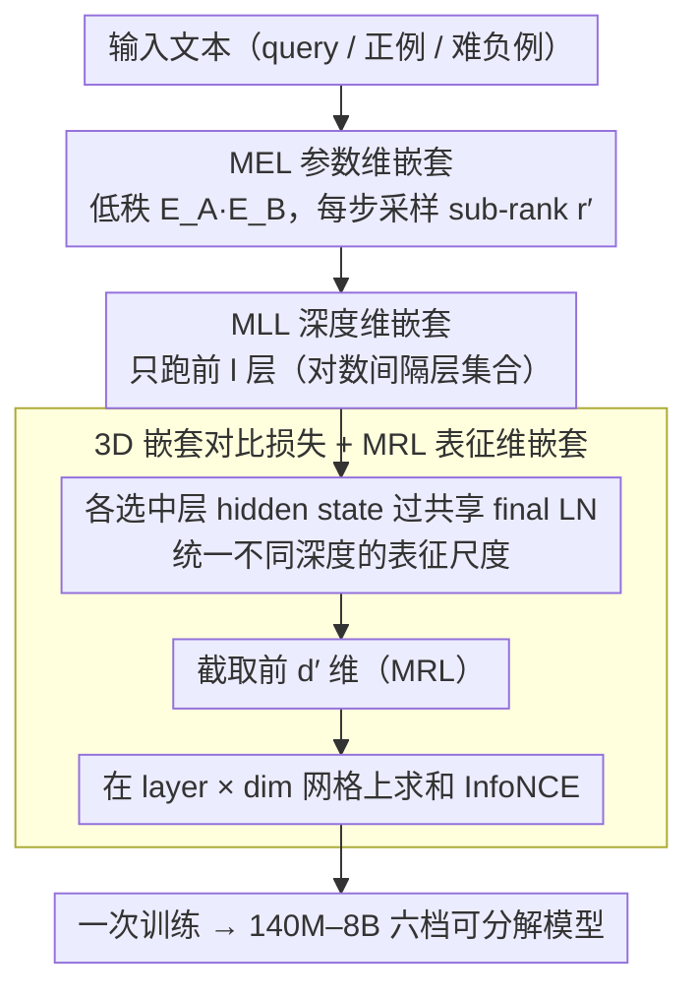

# ML-Embed: Inclusive and Efficient Embeddings for a Multilingual World

**会议**: ICML 2026  
**arXiv**: [2605.15081](https://arxiv.org/abs/2605.15081)  
**代码**: https://github.com/codefuse-ai/CodeFuse-Embeddings  
**领域**: 文本嵌入 / 多语言模型 / 高效训练  
**关键词**: Matryoshka 表征学习, 多维嵌套, MTEB, 低资源语言, decoder-based 嵌入

## 一句话总结
ML-Embed 把 Matryoshka 思想从一维 (representation 维度) 扩展到**三维** —— 在 embedding 参数 (MEL)、模型深度 (MLL)、表征维度 (MRL) 上**全栈嵌套训练**, 同时构建 282 种自然语言 + 40 种编程语言、5000 万样本的多语训练集, 推出 140M-8B 一族开源模型, 在 17 个 MTEB benchmark 上 9 个拿第一, 波兰语 +22.89, 越南语 +6.88.

## 研究背景与动机

**领域现状**: 文本嵌入是 RAG / 语义搜索的底座, 当前 SOTA 几乎都是把 decoder LLM (E5-Mistral / NV-Embed / Qwen3-Embedding / Gemini-Embedding) 改造成嵌入模型. 这条路效果好但代价高: 训练成本爆炸、推理显存巨大、低资源语言被忽视、闭源 API 越来越多.

**现有痛点**: 三重壁垒. (1) **计算壁垒**: decoder-based 嵌入模型动辄 7B+ 参数, 训练和部署都门槛极高; 现有的 Matryoshka Representation Learning (MRL) 只优化了**存储**维度 (能截短 embedding 输出), 训练和推理成本一点没省. (2) **语言壁垒**: MTEB 上波兰语只有 1 个模型有完整结果, 日语 11, 越南语 17, 而英语 154, 多语 146 —— 资源越是少的语言关注越少, 形成恶性循环. (3) **透明壁垒**: 头部模型 (Qwen3-Embedding / Gemini-Embedding / EmbeddingGemma) 要么闭源 API, 要么 open-weight 但训练数据 / 配方不公开, 后续研究很难复现和改进.

**核心矛盾**: 效率和性能 / 语言覆盖之间存在隐含 trade-off. 现有 MRL 类方法只在**输出维度**上做嵌套, 但 decoder-based 模型的真正成本在**参数 (embedding 层在小模型 / 多语模型里占比尤其大) + 深度 (transformer 层数) + 输出维度**三方面, 单一维度嵌套远远不够. LoRA 类方法虽然省训练参数但推理时仍要加载完整模型, 解决不了部署痛点.

**本文目标**: (1) 设计一个能**同时在三个维度做嵌套训练**的统一框架, 让一次训练产出多个尺寸 / 多个深度 / 多个 dim 的可用模型; (2) 用这个框架构建多语模型, 大规模覆盖低资源语言; (3) 全套数据 + 权重 + 代码开源, 打破透明壁垒.

**切入角度**: 作者注意到一个被忽略的细节 —— 在 Qwen3-0.6B 这种小 decoder 上, **embedding 层占了总参数 1/4** (因为多语词表巨大). 这块被现有 MRL 完全没碰过, 是个低垂果实. 同时观察到 Matryoshka Layer Learning (MLL) 也能解决推理深度问题. 把这三件事统一进一个 nested loss, 就是 3D-ML.

**核心 idea**: **3D-Matryoshka Learning**: 在每一次 forward 同时采样 embedding rank $r'$、网络深度 $l$、表征维度 $d'$, 让损失函数对三者的任意组合都收敛, 一次训练得到一个 cube 形可分解的模型空间.

## 方法详解

### 整体框架

ML-Embed 走两阶段训练 + 3D-ML 框架:
- **数据**: 121 个公开数据源汇成 5000 万样本, 覆盖 282 种自然语言 + 40+ 种编程语言, 统一成三种 contrastive 格式 (retrieval / clustering / two-way classification).
- **训练**: 第一阶段在 2700 万 retrieval 样本上做语义基础, 第二阶段在 830 万混合样本上加 task-specific instructions 做 fine-tune.
- **目标函数**: 不是普通的 InfoNCE, 而是在嵌套的 layer × MRL dim 网格上求和的 3D-ML loss.
- **模型族**: 一次训练产出 140M / 330M / 0.6B / 1.7B / 4B / 8B 六档.

每次 forward, 输入会经过: (1) 用 sub-rank $r'$ 的 MEL embedding 层 → (2) 跑前 $l$ 层 transformer → (3) 取每层 hidden state 过 final LN → (4) 截取前 $d'$ 维做 contrastive loss. 训练时这三个采样**同时**进行, 模型被迫在所有可能组合下都给出有用表征.

### 关键设计

**1. Matryoshka Embedding Learning (MEL)：参数维嵌套——连最肥的嵌入层也省下来**

在 Qwen3-0.6B 这类小 decoder 上, 嵌入层因多语大词表占了 1/4 的总参数, 却被此前所有 Matryoshka 方法 (只管输出维的 MRL、只管深度的 MLL) 完全跳过——这是个低垂果实. MEL 直接对它下手: 先用 truncated SVD 把原 embedding $E \in \mathbb{R}^{v \times d_{model}}$ 拆成 $E_A \leftarrow U_r S_r \in \mathbb{R}^{v \times r}$ 与 $E_B \leftarrow V_r^{\top} \in \mathbb{R}^{r \times d_{model}}$, 训练时只更新这两个小矩阵. 关键的 Matryoshka trick 是每次 forward 从 $\{64, 128, 256, 512, 1024\}$ 里随机采一个 sub-rank $r' < r$、只用 $E_{effective} = E_A[:, :r'] E_B[:r', :]$, 逼模型把最关键的信息塞进前 $r'$ 列. 这样部署时就有两条路: **Compatibility Mode** 直接把 $E_A E_B$ 乘成标准 embedding 矩阵、接口零改动; **Efficiency Mode** 保留低秩形式、按需 re-factorize 到更小的 $r'' \ll r$, 显存大幅下降. 它之所以比 LoRA 更进一步, 是因为 LoRA 只省可训练参数、推理还得加载完整 embedding, 而 MEL 两端都省; SVD 初始化又让 $E_A E_B$ 一开始就接近原矩阵, 不破坏预训练知识, 是从全量 finetune 平滑过渡到低秩 finetune 的关键.

**2. Matryoshka Layer Learning (MLL)：深度维嵌套——让浅层也成为合格的 exit point**

直接砍掉 decoder 最后几层往往掉点严重, 因为深层语义没在浅层 anchor 住, 浅层根本撑不起一个可用的嵌入模型. MLL 的做法是选一组对数间隔的层 $\mathcal{L}_{layers} = \{1, 2, 4, 8, 16, 32, L\}$, 把每个选中层 $l$ 的 hidden state $h_l$ 都过同一个 $\text{LN}_{final}$ (复用最终层 norm, 保证不同深度的表征落在同一尺度), 再让它参与对比损失——本质是 early-exit 训练的变体, 但所有 exit 共享最终 LN. 被强迫在每个 milestone 层都达标后, 这些层就都成了合格的 exit point; 推理时只 load 前 $l$ 层就是一个完整可用的小嵌入模型, 工程上改一个 `num_hidden_layers` 即可, 完美兼容 Hugging Face `AutoModel`. 用户因此能在精度与延迟之间自由折中.

**3. 统一的 3D 嵌套对比损失 + Matryoshka Representation Learning (MRL)：把三维拧成一个目标函数**

前两维要真正发挥作用, 必须拧进一个能在任意组合下都收敛的目标函数, 否则单独优化会破坏嵌套属性 (例如只采样 layer 不采样 dim, prefix 维度就永远学不到). 3D-ML 的做法是对每个选中的 MLL 层 $l$、每个 MRL 维度 $d' \in \mathcal{D}_{mrl} = \{8, 16, 32, \ldots, d_{model}\}$ 都做一次截断 + 对比损失: 截断后的表征 $v_{l, d'}(\cdot) = \text{proj}_{d'}(\text{LN}_{final}(h_l(\cdot)))$, 总损失在 layer × dim 网格上求和

$\mathcal{L}_{3D\text{-}ML} = \sum_{l \in \mathcal{L}_{layers}} \sum_{d' \in \mathcal{D}_{mrl}} c_{l, d'} \mathcal{L}_{cl}(q_i, d_i^+, \{d_{i,j}^-\}; v_{l, d'})$

其中 $\mathcal{L}_{cl}$ 是标准 InfoNCE $-\log \frac{e^{s(v_q, v_{d^+})/\tau}}{e^{s(v_q, v_{d^+})/\tau} + \sum_j e^{s(v_q, v_{d_j^-})/\tau}}$, $c_{l, d'}$ 为可调权重; MEL 的 sub-rank $r'$ 每步单独采样, 而 layer 和 dim 则全部 enumerate. 这样"单独训各档要 N 倍成本"的事, 被压成一次共享前向、一次梯度同时更新所有 exit 与 dim. 把 $\text{LN}_{final}$ 复用到每个 exit 是不崩的关键——否则浅层 hidden state 的范数和深层差很多, 对比损失的尺度会乱掉.

### 损失函数 / 训练策略

总损失就是上面的 3D-ML loss. 数据上整成三种 contrastive 格式: retrieval (query, pos, hard negs, hard negs 用 Qwen3-Embedding-8B mine 出来), clustering (anchor, same-class pos, diff-class neg), two-way classification (text-as-anchor + label-text-as-pos/neg). 两阶段训练: stage 1 在 2700 万 retrieval 样本上拿基础语义, stage 2 在 830 万混合样本 + task instructions 上 fine-tune.

## 实验关键数据

### 主实验

在 17 个 MTEB benchmark 上对比 leaderboard 上的 top-1 / top-5 平均分:

| Benchmark (任务数) | Top-1 | Top-5 | **ML-Embed-8B** | ML-Embed-4B | ML-Embed-1.7B | ML-Embed-0.6B |
|------|------|------|------|------|------|------|
| Multilingual (131) | 72.32 | 69.45 | 66.79 | 65.80 | 63.70 | 61.30 |
| English (41) | 75.97 | 74.61 | 73.26 | 72.89 | 71.19 | 70.01 |
| European (73) | 63.60 | 62.32 | **68.00** | 67.53 | 65.47 | 63.40 |
| Indic (20) | 70.15 | 67.39 | **76.76** | 75.15 | 72.58 | 66.11 |
| German (19) | 59.96 | 55.72 | **66.43** | 65.49 | 63.99 | 61.58 |
| French (25) | 70.37 | 67.25 | **71.91** | 70.97 | 68.94 | 66.64 |
| Polish (17) | 50.95 | n.a. | **73.84** | 73.14 | 71.12 | 68.13 |
| Persian (52) | 71.58 | 65.26 | **71.12 (≈top-1)** | 69.94 | 68.35 | — |
| Vietnamese (50) | 54.74 | 52.37 | **61.62** | 61.20 | 60.27 | — |
| Average | 68.46 | 65.95 | **70.24** | 69.29 | 67.58 | — |

8B 模型在 17 个 benchmark 中 9 个拿第一, 在低资源语言上提升尤为夸张: 波兰语 +22.89 分 (73.84 vs 50.95), 越南语 +6.88. 即便是 0.6B 这个小模型, 在波兰语上也 68.13, 远超原 top-1 的 50.95.

### 消融实验

| 配置 | 平均 MTEB | 说明 |
|------|---------|------|
| Full 3D-ML | best | MEL + MLL + MRL 同时启用 |
| w/o MEL | 接近, 但训练成本高 | embedding 层不低秩化, 训练显存大幅上升 |
| w/o MLL | 略掉, 但失去深度灵活性 | 推理只能用完整深度 |
| w/o MRL | 嵌入维度固定 | 失去存储 / 检索效率灵活性 |
| 单独训各档 | 总成本翻 N 倍 | 性能与 3D-ML 同档接近, 但训练资源 N 倍 |

(详细数字见原文 Appendix.)

### 关键发现

- **低资源语言增益最大**: 波兰语 +22.89, 越南语 +6.88. 这反映 leaderboard 上历史 top-1 在这些语言上根本没投入足够的训练数据 —— ML-Embed 用"真实数据分布驱动"而非"为 benchmark 优化"的策略, 在被忽视的语言上反而能压制性能.
- **嵌入层确实是小模型瓶颈**: Qwen3-0.6B 嵌入层占 25% 参数, MEL 把这块压缩到 rank=128, embedding 层参数掉到原 1/10 量级, 而 MTEB 性能基本不掉.
- **MLL 早 exit 仍然有效**: 0.6B 在多语 benchmark 上拿 61.30, 已经接近 1.7B 的 63.70, 证明"对数间隔层 + 共享 final LN"训练出来的浅层 exit 不是花瓶.
- **3D-ML 不是三个独立 loss 的简单加和**: 三维必须**联合**采样, 单独训 MEL 或单独训 MLL 都会破坏 nested 属性 —— 例如只采样 layer 不采样 dim, prefix dim 就不会被优化.
- **开源策略本身就是 contribution**: 论文明确说自己是"反闭源潮流", 把数据 / 权重 / 代码全公开, 在 Polish 这种只有 1 个模型上 leaderboard 的语言上, 这种"先做、再开放"的策略对社区的推动力可能比单纯刷分更大.

## 亮点与洞察

- **三维 Matryoshka 是一个简洁但被忽视的产品级抽象**: 之前 MRL 只管 storage, MLL 只管 depth, LoRA 只管 train 参数. ML-Embed 把这三件事拉进同一个 loss, 让"一次训练得到一族部署形态"成为可能 —— 这种"训练时多任务、部署时单 binary"的模式可以推广到所有 foundation model 训练.
- **embedding 层低秩 + Matryoshka 是 underrated 的工程优化**: 在多语模型里 embedding 层占 25% 参数, 一直没人优化, MEL 用 SVD 初始化 + sub-rank 嵌套这个组合非常聪明.
- **"真实数据分布" vs "benchmark 优化"**: 训练数据按西班牙语 / 阿拉伯语等实际人口和语料分布, 而不是按 MTEB 有什么任务就刷什么. 这种立场在 embedding 圈是少见的, 也直接反映在低资源语言的大幅提升上.
- **共享 final LN 跨层**: 这个细节容易被忽略, 但本质上是把"输出尺度"做了归一化, 让 contrastive loss 在不同深度间可比. 这是 nested training 不崩的关键工程点.

## 局限与展望

- **8B 模型在 Multilingual (66.79) 输给 top-1 (72.32)**, 说明在最考验全语种平衡的综合 benchmark 上还没拿到第一, 强项主要集中在欧洲 / Indic / 单语种 leaderboard. 作者承认 MTEB-Multilingual 有 35/131 任务是纯英文, 这种"伪多语"评估对真正的多语模型不利, 但这个 gap 也确实存在.
- **没有报告 inference 实际延迟**: MLL 截短到不同深度的实际 throughput / TTFT 数据缺失, 只论证了"理论上可以截".
- **MEL re-factorize 后的二次精度下降**: 推理时用更小的 $r''$ 重新分解, 论文只说"少量微调", 但没给出 $r''$ 极限值下 MTEB 掉多少分的曲线.
- **2阶段训练顺序**: stage 1 全 retrieval + stage 2 mixed-with-instructions, 但没探讨更激进的 curriculum (比如先低资源后高资源)是否能进一步推动小语种性能.

## 相关工作与启发

- **vs MRL (Kusupati 2022)**: 原版只在 representation 维度嵌套, ML-Embed 把它扩展到 param + depth + dim 三维, 是真正完整的 lifecycle 优化.
- **vs Matryoshka Layer Learning (Li 2024)**: 他们提出深度嵌套, 但 ML-Embed 把 MLL 和 MRL 在 loss 里 enumerate 求和, 实现 layer × dim 网格联合优化.
- **vs LoRA / QLoRA / AdaLoRA**: 后者只省训练参数, 推理时还要加载完整模型; MEL 同时减少训练参数和推理参数, 而且 Matryoshka 让推理时还能继续选小.
- **vs Qwen3-Embedding / Gemini-Embedding / NV-Embed**: 他们是闭源或 open-weight 不公开训练配方的 decoder-based SOTA; ML-Embed 全开源, 整套数据 + 代码 + 权重都放出, 在透明性维度上断层领先.
- **vs KaLM-Embedding**: 是少数训练数据透明的多语模型, 但数据严重偏向英中; ML-Embed 在西班牙语 / 阿拉伯语 / 越南语等 long-tail 语言上覆盖度高得多.

## 评分
- 新颖性: ⭐⭐⭐⭐ MEL (embedding 层 Matryoshka) 是新的, 三维联合嵌套训练是新的; 但 MRL 和 MLL 都已存在, 框架更多是"系统化整合".
- 实验充分度: ⭐⭐⭐⭐⭐ 17 个 MTEB benchmark + 六档模型 + 430 任务总评估, 是 embedding 论文里最全面的一档.
- 写作质量: ⭐⭐⭐⭐ 动机清晰, 三个 barrier 的论述漂亮; 但 ablation 数据在正文里不够完整, 大量细节藏在 appendix.
- 价值: ⭐⭐⭐⭐⭐ 完整开源 + 多档模型 + 低资源语言大幅提升, 给整个多语嵌入社区提供了可复现的强 baseline, 长期影响力很可能高于一些刷分论文.

<!-- RELATED:START -->

## 相关论文

- [\[ICML 2026\] Very Efficient Listwise Multimodal Reranking for Long Documents](very_efficient_listwise_multimodal_reranking_for_long_documents.md)
- [\[ACL 2025\] Towards Storage-Efficient Visual Document Retrieval: An Empirical Study on Reducing Patch-Level Embeddings](../../ACL2025/information_retrieval/towards_storage-efficient_visual_document_retrieval_an_empirical_study_on_reduci.md)
- [\[ICML 2026\] LazyAttention: Efficient Retrieval-Augmented Generation with Deferred Positional Encoding](lazyattention_efficient_retrieval-augmented_generation_with_deferred_positional_.md)
- [\[ACL 2026\] CORAL: Adaptive Retrieval Loop for Culturally-Aligned Multilingual RAG](../../ACL2026/information_retrieval/coral_adaptive_retrieval_loop_for_culturally-aligned_multilingual_rag.md)
- [\[ACL 2025\] REAL-MM-RAG: A Real-World Multi-Modal Retrieval Benchmark](../../ACL2025/information_retrieval/real-mm-rag_a_real-world_multi-modal_retrieval_benchmark.md)

<!-- RELATED:END -->
