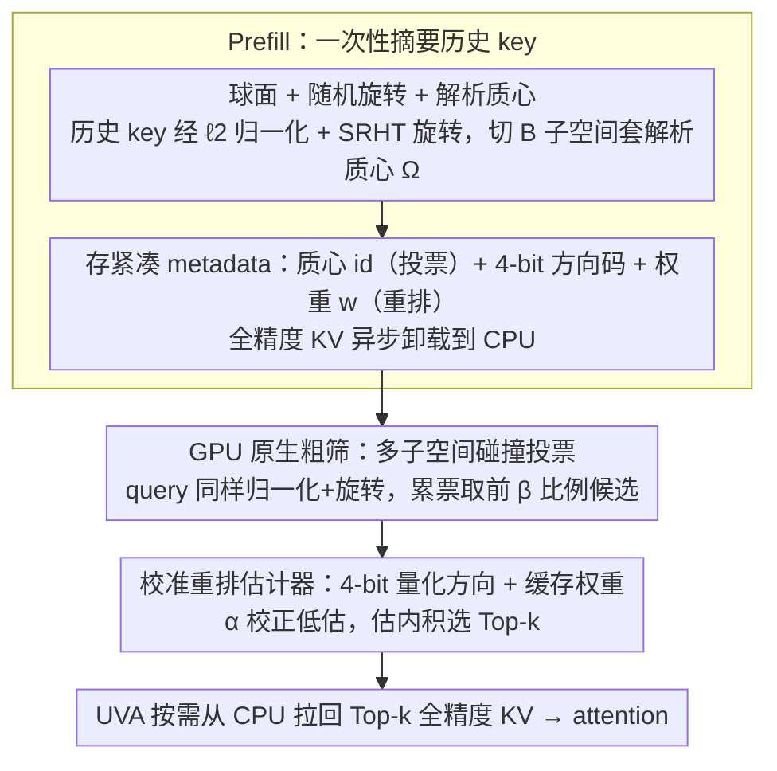

# ParisKV: Fast and Drift-Robust KV-Cache Retrieval for Long-Context LLMs

**会议**: ICML 2026  
**arXiv**: [2602.07721](https://arxiv.org/abs/2602.07721)  
**代码**: https://github.com/amy-77/ParisKV/tree/main  
**领域**: LLM效率 / 长上下文推理 / KV-Cache 检索  
**关键词**: KV-Cache 检索, 长上下文, 漂移鲁棒, GPU 原生, UVA 卸载

## 一句话总结
ParisKV 通过把 key/query 归一化并随机正交旋转到单位超球上、用"数据无关的解析质心"代替从 prefill 学习出来的质心，再叠加一个 GPU 原生的"碰撞投票 + 4-bit 量化重排"两阶段检索 + UVA 按需取 KV，在百万 token 上下文上把 Top-$k$ KV 检索的解码延迟相比 MagicPIG/PQCache 降低 17–44×，并在 9 个长生成任务里 7 个达到或超过 full attention 精度。

## 研究背景与动机

**领域现状**：长上下文 LLM 推理是 memory-bound 的——每一步解码都要读全部历史 KV，带宽随上下文线性增长。主流缓解思路是稀疏/选择性注意力，其中 *KV-cache retrieval* 这条路（保留全部 KV、每步动态挑 Top-$k$）相比 *KV-cache dropping*（永久丢弃）更适合开放式长生成，因为不会因为早期 token 被错误丢弃而崩盘。代表方法是 Quest、MagicPIG、PQCache、RetrievalAttention 等。

**现有痛点**：现有 retrieval 方法在"长生成 + 大上下文"场景下普遍翻车，作者把痛点归纳为三条：(C1) **速度–质量 tradeoff**：粗聚类/低比特量化为了快牺牲 recall，要补回精度就得放大检索预算，等于把稀疏性的好处吃回去；(C2) **解码漂移**：质心是在 prefill 阶段对历史 key 聚类得到的，但随着生成进行新 key 不断累加，prefill-only 质心逐渐和真实 key 分布失配，长解码后 recall 急剧下降（论文 Fig. 1(a) 显示 PQCache 在 AIME 上 recall 直接塌掉，Fig. 1(b) 可视化了蓝色 prefill 质心和红色真实质心越漂越远）；(C3) **CPU 端检索瓶颈**：当 KV 卸载到 CPU 时，传统做法是 CPU 搜索 + CPU→GPU 拷贝，端到端被 CPU 编排和 memcpy 拖垮，而 GPU 只能看到带近似误差的中心/低比特码。

**核心矛盾**：质心是从数据学的就一定会漂移；要不漂移就得"数据无关"。但数据无关的 hash/grid 又会因为原始 key 分布各向异性而 bucket 不均匀，碰撞统计失效。

**本文目标**：(1) 在解码漂移下保持稳定的 Top-$k$ recall；(2) 把检索决策完全留在 GPU、避免 CPU 编排；(3) 在 KV 卸载到 CPU 的前提下仍然把端到端延迟压到接近 GPU 原生。

**切入角度**：作者观察到，只要先对 key/query 做 $\ell_2$ 归一化把它们映到单位超球，再共享一个随机正交旋转（保内积、把信息均匀摊到各维），那么子空间方向就近似各向同性——这时一个固定的、形如 $\{\pm 1/\sqrt{m}\}^m$ 的符号模式质心集就能在球面上近似均匀覆盖所有方向，*任何新生成的 key 都至少接近其中一个质心*。这把"质心会漂"问题从根上拆掉了：质心本身就和数据无关、永远不变。

**核心 idea**：用"球面 + 随机旋转 + 解析质心"代替"从 prefill 学到的聚类质心"来做 KV-cache Top-$k$ 检索，再配一个 GPU 原生的碰撞投票 + 4-bit 量化重排两阶段管线和 UVA 按需取 KV，实现漂移鲁棒 + 低延迟 + 百万 token 可扩展。

## 方法详解

### 整体框架

ParisKV 是一个算法–系统协同设计，要解决的是"长解码下 Top-$k$ KV 检索既漂移又慢"的问题，核心转法是把质心从"学出来的"换成"算出来的"。在 prefill 阶段它对所有历史 key 做一次性摘要——先共享 normalize + rotate 把向量推到球面，再切成 $B$ 个子空间、各存一个解析质心 id（投票用）和一个 4-bit 量化方向码 $\text{code}_{i,b}$ 加标量权重 $w_{i,b}$（重排用），全精度 KV 异步卸载到 CPU，GPU 上只留紧凑 metadata $\{(\text{centroid\_id}_{i,b}, \text{code}_{i,b}, w_{i,b})\}$。在 decode 阶段每步生成 query 后，GPU 上先用 centroid id 做子空间碰撞投票粗筛出 $\beta$ 比例候选，再用 4-bit 码估内积精排出最终 Top-$k$，最后通过 UVA 让 kernel 按需从 CPU 拉回这 $k$ 个 key 的全精度 KV 做 attention，全程绕开显式 memcpy 和 CPU 端调度。

GPU 上的 KV 缓存被组织成四段连续区域：Sink（少量早期高 attention token）、Retrieval（卸载并被索引的历史 token）、Local（最近 local_size 个保留在 GPU 上的 token）、Update Buffer（临时缓存新生成 token）。dense attention 只跑在 Sink+Local 上，retrieval 区只跑稀疏 Top-$k$；每当 update buffer 攒满 $m$ 个 token 就滑窗一次，把旧的 local token 异步 evict 到 retrieval 区（GPU→CPU 拷贝）并在 GPU 上 encode 出新 metadata。

### 关键设计

**1. 球面 + 随机旋转 + 解析质心：把"质心会漂"从根上拆掉**

这一步直击 PQCache/MagicPIG 的痛点 C2（centroid staleness）——只要质心是从 prefill key 聚类学来的，新生成的 key 累加多了就一定会和质心分布失配。ParisKV 的做法是先 $\ell_2$ 归一化 $\hat{\mathbf{k}}_i = \mathbf{k}_i / \|\mathbf{k}_i\|_2$ 把所有向量推到单位超球，再用一个共享正交矩阵 $\mathbf{R}$（用 SRHT 实现，便宜且保内积）旋转成 $\tilde{\mathbf{k}}_i = \mathbf{R}\hat{\mathbf{k}}_i$，让各维信息均匀摊开、子空间方向近似各向同性；然后把 $D$ 维切成 $B$ 个 $m=D/B$ 维子空间，每个子空间直接用解析质心集 $\Omega = \{\pm 1/\sqrt{m}\}^m$——这 $2^m$ 个点对应 $m$ 维超立方体顶点投到球面，均匀覆盖全部 $2^m$ 个卦限，所以任何新 key 都至少接近其中一个质心。最后用极分解 $\tilde{\mathbf{k}}_{i,b} = r_{i,b}\mathbf{u}_{i,b}$ 把方向 $\mathbf{u}_{i,b}$（投票用）和半径 $r_{i,b}$（重排校准用）分开。因为 $\Omega$ 永远不变、和数据无关，质心从此不再过时。这套设计不是拍脑袋：论文 Proposition 4.1 证明在 Haar 随机旋转后子空间能量 $z_b = r_b^2 \sim \mathrm{Beta}(m/2, (D-m)/2)$、方向坐标平方 $(u_b)_j^2 \sim \mathrm{Beta}(1/2, (m-1)/2)$，这两个 Beta 先验进一步指导了量化等级的设计。

**2. GPU 原生粗筛：多子空间碰撞投票**

粗筛要在不排序的前提下把 $n_t$ 个候选 key 廉价剪到 $\beta n_t$ 个。query 经过同样的 normalize+rotate+split 后，在每个子空间 $b$ 计算 $\tilde{\mathbf{q}}_b$ 与 $2^m$ 个解析质心的内积 $\tilde{\mathbf{q}}_b^\top \mathbf{c}$，只让其中前 $\rho$ 比例的质心贡献"非零票"；任何被分配到这些质心之一的 key 在该子空间得 1 票，跨 $B$ 个子空间累加成一个整数得分，取前 $\beta$ 比例（典型 5%–10%）作候选——要保证候选池大于最终 $k$，需满足 $\rho \geq \beta$。整个过程只有位级匹配 + 整数加法，没有排序，作者用自定义 `bucket_topk` CUDA kernel 在小整数范围上直接桶选并配合并行 collision kernel。相比 PQCache/MagicPIG 用单 hash 表或全量 query-centroid 内积排序，多子空间投票既便宜又有冗余（一个子空间投错没关系，多数投对就行），天然抗噪声；$\beta=5$–$10\%$ 已能把候选池压到原始 KV 的十分之一以下，配合精排几乎不掉 recall，正好踩在 GPU 整数操作便宜、原子加法快、不爱排序的硬件甜区。

**3. 校准重排估计器：4-bit 量化方向 + 缓存权重**

精排要在不访问 CPU 全精度 key 的前提下给候选估出准确的 $\langle \mathbf{k}_i, \mathbf{q} \rangle$，难点是低比特量化会带来系统性偏差。ParisKV 把每个子空间方向用 1-bit 符号 + 3-bit 幅值共 4-bit 量化成 $\mathbf{v}_{i,b}$，并定义对齐度 $\alpha_{i,b} = \langle \mathbf{v}_{i,b}, \mathbf{u}_{i,b} \rangle$：量化通常会压缩这个值，直接用 $\langle \mathbf{v}_{i,b}, \tilde{\mathbf{q}}_b \rangle$ 会系统性低估内积，所以用 $\langle \mathbf{u}_{i,b}, \tilde{\mathbf{q}}_b \rangle \approx \langle \mathbf{v}_{i,b}, \tilde{\mathbf{q}}_b \rangle / \alpha_{i,b}$ 反向校正。再进一步把所有"只和 key 有关"的因子打包成 $w_{i,b} = \|\mathbf{k}_i\|_2 \cdot r_{i,b} / \alpha_{i,b}$ 在 prefill 时一次性算好缓存，解码时整个内积估计就塌缩成一个加权累加 $\widehat{\langle \mathbf{k}_i, \mathbf{q} \rangle} = \|\mathbf{q}\|_2 \sum_{b=1}^{B} w_{i,b} \langle \mathbf{v}_{i,b}, \tilde{\mathbf{q}}_b \rangle$，gather + unpack + score 融进一个 CUDA kernel。这一步同时解决 C1（速度–质量 tradeoff）和 C3（CPU 端瓶颈）：4-bit 把每 key 元数据压到原始的约 1/32 且全程 GPU 算，$\alpha_{i,b}$ 校正加 $w_{i,b}$ 缓存让"低比特估计"和"高保真内积"两件事兼得，只有最终选中的 $k$ 个 key 才走 UVA 从 CPU 拉全精度 KV 做真 attention。

### 训练策略

ParisKV 是**纯推理时方法**，不需要任何训练或微调，可即插即用到任何已训练好的 transformer LLM。所有质心、量化等级都基于 Beta 先验在离线阶段一次性算好，旋转矩阵 $\mathbf{R}$ 由 SRHT 直接构造。系统层面提供四个自定义 CUDA kernel：`bucket_topk`、并行 collision、融合 reranking（gather+unpack+score）、基于 UVA 的 fetch kernel。

## 实验关键数据

测试模型：Qwen-3-4B/8B、DeepSeek-R1-Llama-8B、Qwen3-4B-Thinking-2507；测试集：长生成推理（MATH500 / GPQA-Diamond / AIME25）和长上下文理解（LongBench-V2、RULER）；主要对比：PQCache、MagicPIG，附录还对比了 Quest、ShadowKV、FreeKV、RetroInfer、SOCKET、Twilight；ParisKV 固定 $K=100$，PQCache 用 20% 压缩比，MagicPIG 用其动态预算策略。

### 主实验：长生成推理（精度）

| 模型 | 任务 | Full Attn | PQCache | MagicPIG | ParisKV | vs PQCache |
|------|------|-----------|---------|----------|---------|-----------|
| Qwen-3-4B | GPQA-Diamond (pass@1) | 64.14 | 38.38 | 32.32 | **72.22** | +33.84 |
| Qwen-3-4B | MATH500 (pass@1) | 88.60 | 58.80 | 46.40 | **92.80** | +34.00 |
| Qwen-3-4B | AIME25 (pass@8) | 86.67 | 3.33 | 6.67 | **80.00** | +76.67 |
| DS-R1-Llama-8B | AIME25 (pass@8) | 50.00 | 13.30 | 13.30 | **53.30** | +40.00 |
| Qwen-3-8B | MATH500 (pass@1) | 87.40 | 69.21 | 45.80 | **93.00** | +23.79 |

9 个长生成 setting 里 7 个达到或超过 full attention；AIME25 上 PQCache/MagicPIG 几乎崩盘（pass@8 < 17），ParisKV 恢复到 53–80。

### 主实验：百万 token 解码效率

| 上下文 | Full Attn | PQCache | MagicPIG | ParisKV | 加速比 |
|--------|-----------|---------|----------|---------|--------|
| 128K (bs=1) | runnable | – | – | 24.32 ms/step | 2.1–2.8× 吞吐 vs full |
| 256K (bs≥2) | **OOM** | – | – | scales to bs=5 | – |
| 384K (bs=1) | **OOM** | – | – | runnable | – |
| 1024K (bs=1, Llama3.1-8B) | OOM | 2179 ms/step | 830 ms/step | **49 ms/step** | **44.4× / 16.9×** |

在 full attention 跑得动的范围里 ParisKV 解码吞吐提 2.1–2.8×；在 full attention OOM 的范围里 ParisKV 仍能扩到大 batch；百万 token 时相对 PQCache/MagicPIG 分别 44× 和 17× 加速。

### 消融实验

| 配置 | 粗筛 Recall@100 | 端到端 Recall@100 | 说明 |
|------|----------------|------------------|------|
| 基线（无 normalize/rotate，prefill 质心） | 6% | 36.5% | PQCache 风格 |
| + normalize + rotate + 解析质心 (N+R+T) | **16.1%** | **64.3%** | ParisKV 完整设计 |

### 关键发现

- **漂移鲁棒的根源就是质心数据无关**：normalize + rotate + 解析质心三件套把粗筛 Recall@100 从 6% 拉到 16.1%，端到端 Recall@100 从 36.5% 拉到 64.3%——这是 ParisKV 在长生成 reasoning 上吃下 PQCache 30+ 个 pass@1 的根本原因。
- **长生成比长输入更难**：长输入解码 token 很少，漂移没机会累积，PQCache 还能稳到 25.50（Qwen-3-8B LongBench_V2）；但 AIME25 这种解码上万 token 的场景，漂移每步都在压缩 recall，PQCache 直接 collapse 到 pass@8 ≈ 3。
- **TPOT 随 batch 摊薄非常好**：Qwen3-8B 128K 上 bs=1 是 24.32 ms/token，bs=8 后摊到 7.37 ms/token，单步只涨到 58.92 ms/step，几乎线性扩展。
- **C2 才是最关键的瓶颈**：作者通过分别把 normalize、rotate、解析质心三个组件拆开消融，确认"质心稳定性"对长解码 recall 的影响远大于量化精度本身。

## 亮点与洞察

- **"质心数据无关"是个非常优雅的破局**：长解码漂移在所有 learning-based 检索系统里都是死结，作者通过先把空间映到球面再用对称解析质心，把"质心要拟合数据"这个前提整个拿掉，让质心永远不会过时。这个思路其实可以迁移到任何"在线数据流 + 离线索引"的场景（如 streaming ANN、推荐系统的实时召回）。
- **碰撞投票替代排序**：把昂贵的"内积 + 排序"换成"位级匹配 + 整数加法 + 桶选"，配合多子空间冗余天然抗噪声，正好踩在 GPU 整数操作便宜、原子加法快、不爱排序的硬件甜区。
- **校准 $\alpha$ 项 + 缓存权重 $w_{i,b}$**：把"低比特方向估计 + 高保真内积"这件看似矛盾的事做出来——量化造成的系统性低估用单标量 $\alpha$ 校正掉，跟 query 无关的部分全部预算到 $w_{i,b}$ 里，让解码时的内积估计塌缩成一个简单 BLAS 操作。
- **UVA 替代显式 memcpy**：在 CPU 卸载 + GPU 检索的架构里，UVA 让 GPU kernel 直接按 page-fault 语义拉取 CPU 内存里的 KV，绕过整个 CPU 端调度栈——这是把"百万 token + GPU 原生"做实的关键系统创新。

## 局限与展望

- **m 的选择是设计折中**：质心数量是 $2^m$，太大 $\Omega$ 过大、检索每个 query 与质心内积变贵；太小 $m=D/B$ 大、子空间投票冗余少，碰撞统计不稳定。论文没给 $m$ 的完整敏感性曲线。
- **SRHT 旋转在极短上下文下的开销**：prefill 一次性归一化 + 旋转 + 量化对短文本是纯额外开销，对万级 token 以下场景未必划算（作者主要 demo 在 32K 以上）。
- **解析质心假设各向同性**：依赖 SRHT 把分布"打散"成近似各向同性，但 LLM 的 key 分布有些 head 是结构化稀疏的（如 attention sink），$\{\pm 1/\sqrt{m}\}^m$ 的均匀覆盖是否会浪费"码本预算"在这些 head 上没讨论。
- **完全跳过训练**：纯推理时方法虽然部署方便，但失去了 NSA/MoBA 那种"把稀疏机制嵌进训练"的潜在精度上限——长远看 ParisKV 的解析质心 + 投票管线如果能进入训练 loop 应该能进一步压模型规模 + KV 预算。
- **可改进方向**：1) 让 $\rho$、$\beta$ 在层/头之间自适应；2) 把 codebook 从二元符号模式扩展到 lattice 或 Gosset 编码以提升覆盖率；3) 用按 head 学习的旋转替代共享 SRHT，或许能在保留各向同性的同时多 squeeze 一点 recall。

## 相关工作与启发

- **vs PQCache**：都做 KV 检索 + CPU 卸载，PQCache 用 product quantization 从数据学码本；ParisKV 用解析质心 + 球面变换，避开了码本随解码漂移的问题。结果就是 PQCache 在长解码上崩盘（AIME25 pass@8 = 3），ParisKV 稳到 80。
- **vs MagicPIG**：MagicPIG 用 LSH 做近似 Top-$k$，质心是数据无关但 hash 函数对原始（非各向同性）key 分布不友好。ParisKV 先把分布"圆化"再用解析质心，本质上是给"数据无关"补上了"分布无关"，所以同样的预算下 recall 更高。
- **vs Quest**：Quest 是 GPU 原生的页粒度检索，没解决 CPU 卸载问题，上下文规模受限；ParisKV 把 GPU 原生 + UVA + 漂移鲁棒三件事一起做了。
- **vs NSA/MoBA**：这两条线把稀疏机制嵌进训练；ParisKV 走纯推理时路线，部署友好但精度上限受 base model 的 attention pattern 限制。两条路线互补，未来可能融合。
- **vs RetrievalAttention**：都关注 retrieval 而非 dropping，但 RetrievalAttention 没解决百万 token 规模下的系统瓶颈；ParisKV 通过 UVA + 自定义 kernel 把"算法对了但系统跟不上"这个问题补齐。

## 评分
- 新颖性: ⭐⭐⭐⭐⭐ 用球面 + 随机正交旋转把"质心要拟合数据"这个前提拆掉，配上数据无关的解析质心，从根本上解决了 KV 检索的解码漂移问题，思路非常优雅且少见。
- 实验充分度: ⭐⭐⭐⭐⭐ 三个模型家族 × 长生成（3 个）+ 长输入（2 个）共 9+ setting；对比 PQCache、MagicPIG、Quest、ShadowKV、FreeKV、RetroInfer、SOCKET、Twilight；覆盖 64K–1M token；既报精度也报 TPOT/throughput/OOM 边界。
- 写作质量: ⭐⭐⭐⭐ 动机三条挑战 (C1/C2/C3) 划得很清，Fig.1 直接给出 recall collapse + 质心漂移的可视化；Proposition 4.1 给 Beta 先验配公式有理论；唯一缺点是不少关键 kernel 实现细节都丢去 Appendix B/D，正文显得有点单薄。
- 价值: ⭐⭐⭐⭐⭐ 让 8B 模型在单卡上跑得动 1M token 解码、TPOT 控在几十毫秒，对 RAG / 长推理 / agent 等长上下文场景是直接可部署的工程突破；漂移鲁棒的解析质心思路对在线 ANN 等领域也有外溢价值。

<!-- RELATED:START -->

## 相关论文

- [\[ACL 2026\] BRIEF-Pro: Universal Context Compression with Short-to-Long Synthesis for Fast and Accurate Multi-Hop Reasoning](../../ACL2026/information_retrieval/brief-pro_universal_context_compression_with_short-to-long_synthesis_for_fast_an.md)
- [\[ICML 2026\] HGMem: Hypergraph-based Working Memory to Improve Multi-step RAG for Long-Context Complex Relational Modeling](hgmem_hypergraph-based_working_memory_to_improve_multi-step_rag_for_long-context.md)
- [\[ICLR 2026\] Beyond RAG vs. Long-Context: Learning Distraction-Aware Retrieval for Efficient Knowledge Grounding](../../ICLR2026/information_retrieval/beyond_rag_vs_long-context_learning_distraction-aware_retrieval_for_efficient_kn.md)
- [\[ACL 2025\] Hierarchical Document Refinement for Long-context Retrieval-augmented Generation](../../ACL2025/information_retrieval/hierarchical_document_refinement_for_long-context_retrieval-augmented_generation.md)
- [\[ICLR 2026\] Q-RAG: Long Context Multi-Step Retrieval via Value-Based Embedder Training](../../ICLR2026/information_retrieval/q_rag_long_context_multi_step_retrieval.md)

<!-- RELATED:END -->
