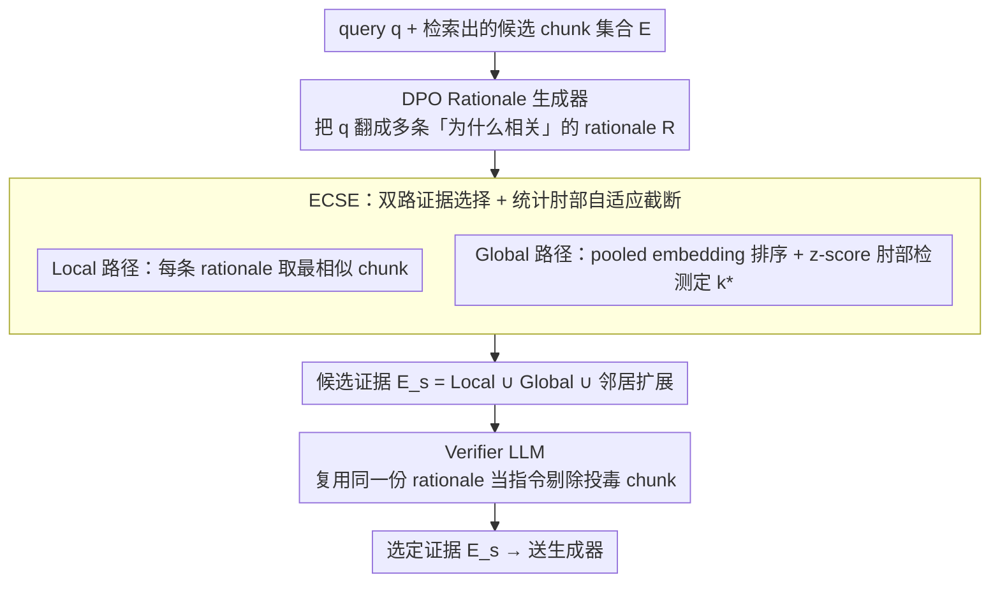

# Ranking-Free RAG: Replacing Re-Ranking with Selection in RAG for Sensitive Domains

**会议**: ICML 2026  
**arXiv**: [2505.16014](https://arxiv.org/abs/2505.16014)  
**代码**: https://github.com/YashSaxena21/METEORA  
**领域**: 信息检索 / RAG / 可解释性 / 对抗鲁棒性  
**关键词**: RAG, 证据选择, DPO, 自适应阈值, 语料投毒防御

## 一句话总结
本文提出 METEORA，用 DPO 训练的"理由生成器 + 统计肘部检测 + 同框架 Verifier"三件套，把 RAG 中不可解释、依赖 top-$k$ 的 re-ranker 整段替换掉，在 6 个敏感领域数据集上同时拿到更高召回、80% 的证据量削减和 4.4× 的对抗鲁棒性提升。

## 研究背景与动机

**领域现状**：当前 RAG 系统在法律、金融、医疗这类高风险领域大规模部署，主流做法是用 Cross-Encoder、SBERT、Contriever 这些 dense retriever 算 query–chunk 相似度，然后用一个事先拍定的 top-$k$ 截断送进生成器。RankRAG、Self-RAG 这类 LLM-based ranker 则用大模型代替小 reranker 来打分。

**现有痛点**：第一，相似度分数本身是个黑盒，无法回答"为什么选这条而不是那条"，在合同审查、隐私问答这类场景下监管根本通不过；第二，$k$ 是个魔法数字——简单问题选多了就引入噪声，复杂问题选少了就缺证据；第三，语料投毒攻击（Zou et al., 2025）能往知识库塞进语义相近但事实错误的 chunk，相似度排序对此完全没有防御机制。

**核心矛盾**：可解释性、对抗鲁棒性、计算效率被业界默认为相互制约的三个目标——加可解释模块要算 rationale，加防御要再过一层 verifier，看起来都得用效率换。但作者观察到：如果选择决策本身就是"基于显式推理"的，那解释、验证、自适应截断其实可以共用同一份 rationale。

**本文目标**：在不引入额外标注的前提下，造一个能同时输出"选哪些 chunk"+"为什么选"+"哪些是投毒"的统一框架，并且做到证据量比传统 top-$k$ 更小。

**切入角度**：传统 reranker 是把 query 和 chunk 直接算相似度；作者插入一层"先让 LLM 写出几条 rationale，再让 rationale 去选 chunk"，把不可解释的相似度分数换成可读、可审计、可被复用做 verifier 输入的自然语言。

**核心 idea**：用 DPO 把 LLM 训成一个"理由生成器"，再用统计 elbow detection 自适应决定选几条，最后用同一份 rationale 去喂 Verifier 检查投毒——可解释 / 鲁棒 / 高效三件事用一套 rationale 同时拿下。

## 方法详解

### 整体框架
METEORA 要解决的问题是：把 RAG 里那个不可解释、靠 top-$k$ 截断的 re-ranker 整段拿掉，换成一个能同时说清"选哪些、为什么选、哪些是投毒"的统一框架。形式上它学一个 $f_\theta(q, E) \to (R, E_s)$，输入 query $q$ 和检索出的候选 chunk 集合 $E$，同时吐出 rationale 集合 $R = \{r_1, \dots, r_k\}$ 和被选证据子集 $E_s \subset E$。整条链路靠一份 rationale 串起三个阶段——DPO 训出的 LLM 先把 query 翻译成若干条"为什么相关"的解释，ECSE 拿这些 rationale 在 $E$ 上选证并自适应决定选多少，Verifier 再拿同一份 rationale 当指令把投毒 chunk 剔掉——从头到尾都没有出现魔法数字 $k$。

### 关键设计

**1. DPO 驱动的 Rationale 生成器：把"选证准确率"当偏好信号**

re-ranker 的相似度分数是个黑盒，回答不了"为什么选这条"，而人工标注 rationale 又不可扩展。作者的办法是直接从已有 QA 数据自动构造偏好对：对每个 $(q, e^*)$ 让 LLM 生成多条 rationale，把最终选到正确证据 $e^*$ 的当作 $r_w$、选到错误证据的当作 $r_l$，再用标准 DPO 损失 $\mathcal{L}_{DPO} = -\mathbb{E}\big[\log \sigma(\beta \log \frac{\pi_\theta(r_w | q, e)}{\pi_{\text{ref}}(r_w | q, e)} - \beta \log \frac{\pi_\theta(r_l | q, e)}{\pi_{\text{ref}}(r_l | q, e)})\big]$ 训练，训练时以 $\pi_\theta(r | q, e^*)$ 为条件、推理时退化成 $\pi_\theta(r | q)$。这等于把"rationale 质量"直接等价于"选证准确率"，绕开了标注天花板，也比 RLHF 训 reward model 更稳定、更可读；同时 DPO 学到的"细粒度区分对错证据"能力，让投毒 chunk 想巧合命中 rationale 变得更难，顺带撑起了后续的对抗鲁棒性。

**2. ECSE：双路证据选择 + 统计肘部自适应截断**

top-$k$ 在不同难度 query 上效果天差地别——FinQA 的短文档和 MAUD 35 万 token 的合同根本不该共用一个 $k$。ECSE 用两路并行选证再加统计截断来消灭这个超参。Local 路径对每条 rationale $r_i$ 找最相似的 chunk，$E_v = \{\arg\max_{e_j \in E} \mathcal{S}(r_i, e_j) \mid r_i \in \mathcal{R}\}$，多条 rationale 收敛到同一 chunk 反而是"证据有效"的信号；Global 路径先算 pooled embedding $\bar{r} = \frac{1}{|\mathcal{R}|} \sum \text{SBERT}(r_i)$，把所有 chunk 按 $\bar{r}$ 排成相似度序列 $\{s_1, \dots, s_n\}$，再做肘部检测——取一阶差 $\Delta_i = s_i - s_{i+1}$ 并 z-score 归一化 $z_i = (\Delta_i - \mu_\Delta)/\sigma_\Delta$，第一个显著偏离均值的位置就是截断点 $k^*$；若一阶差不显著，退到二阶差 $\nabla^2_i = \Delta_{i+1} - \Delta_i$ 找最大曲率。最终 $\mathbf{E_s} = E_v \cup E_g \cup E_w$，其中 $E_w$ 是可选的前后一邻居扩展，用来补救分块割裂。这一招用"显著相似度断崖"代替魔法数字，既贴合"信息密度不均"的直觉，又干掉了一个调参维度。

**3. Verifier LLM：复用同一份 rationale 做投毒过滤**

困惑度防御对 LLM 生成的高质量投毒几乎无效（实验里 F1 仅 0.06–0.15），因为攻击者改的是"语义流畅但事实错"的内容。METEORA 转而复用同一个 Llama-3.1-8b-instruct，把 rationale 当作"flagging instructions"，对每条 chunk 独立判三类问题：事实违反（与公认事实矛盾）、与已验证证据的逻辑矛盾、指令违反（不满足 rationale 暗含的检索标准）。它走保守原则——默认有效，置信度 >90% 才标记，被标的丢弃、其余进生成。由于 rationale 本身是 query-aligned 的，正好用来检查"chunk 是不是真满足 rationale 描述的检索意图"；实验里 87% 的投毒命中正是"instruction violation"，说明攻击者动的是"怎么搜"而非"事实是什么"，与这套验证假设完全契合。

### 损失函数 / 训练策略
整套框架里只有 rationale 生成器需要训练，目标就是上面的 DPO 损失；ECSE 和 Verifier 都是零额外训练的推理时模块。偏好数据完全由现有 QA 标注自动构造，无需人工写 rationale。Verifier 与 rationale generator 共用同一个 Llama-3.1-8b-instruct，既保持框架一致性又避免引入额外模型权重。

## 实验关键数据

### 主实验

在 6 个数据集（QASPER / Contract-NLI / FinQA / PrivacyQA / CUAD / MAUD，覆盖学术、法律、隐私、金融、合并协议）上对比 6 类传统 reranker 和 2 类 LLM reranker；为公平起见，把基线的 $k$ 设为 METEORA 自适应选出的平均数。METEORA 在平均召回上明显领先：

| 方法 | Avg R | Avg P | MAUD R (350k token 合同) | CUAD R | PrivacyQA R |
|------|-------|-------|--------------------------|--------|-------------|
| SBERT (E5-Large) | 0.80 | 0.18 | 0.44 | 0.77 | 0.78 |
| Cross-Encoder (BGE) | 0.82 | 0.18 | 0.51 | 0.78 | 0.85 |
| RankRAG (8b) | 0.68 | 0.13 | 0.22 | 0.60 | 0.86 |
| METEORA | **0.93** | **0.19** | **0.72** | **0.93** | **0.98** |
| METEORA w/o Expansion | 0.89 | **0.23** | 0.66 | 0.90 | 0.96 |

文档越长、越难，METEORA 的优势越大：MAUD 上召回从 0.51 跳到 0.72（+41%），CUAD +19%，PrivacyQA +10%；唯一 FinQA（平均 700 token 短文档）相似度法略胜（0.98 vs 0.95），但 METEORA 仍少选了 80% 证据。Latency 上 METEORA 全流程 2.91s，反而比 SBERT (4.04s) 和 RankRAG (4.61s) 更快，因为输入 token 量从 36–40k 砍到 12k。生成准确率 +33.34%。

### 消融实验

| 配置 | 平均召回 | 平均精度 | 说明 |
|------|---------|---------|------|
| METEORA (full) | 0.93 | 0.19 | 完整框架 |
| w/o DPO | 0.88 | 0.18 | 用未训 rationale 生成器，MAUD 召回从 0.72 掉到 0.65 |
| w/o Verifier | 0.94 | 0.17 | 干净数据上召回略升、精度略降；对抗下崩盘 |
| w/o Expansion | 0.89 | **0.23** | 召回低 4 pt 但精度高 4 pt，证明邻居扩展是精度–召回权衡 |
| Perplexity defense (对抗) | F1 ≈ 0.10 | — | 几乎无防御 |
| **METEORA (对抗)** | **F1 ≈ 0.43** | — | 4.4× 提升，87% 命中靠 instruction-violation |

### 关键发现
- DPO 的提升与数据集复杂度强相关：MAUD（合并协议）+23.7% 召回，FinQA（短段落）仅 +2.1%——说明 DPO 真正学到的是"把高层概念映射到具体条款"的能力，文档越长越复杂收益越大
- 87% 的投毒被标记为 "instruction violation"，只有 1.8% 是 "contradiction"、9.6% 是 "factual"——攻击者改的是"怎么检索"而不是"什么是事实"，所以 rationale-based 验证恰好对症
- Context Expansion 对 MAUD（+7% 召回）和 PrivacyQA 显著有效，对结构良好的 ContractNLI 几乎无效——证明扩展收益取决于"分块割裂程度"而非文档长度本身
- 人工评估：4 名标注者对 rationale 的清晰度打 3.64/5，对投毒判别的准确率达 86%，说明可解释性不是装饰而是真能让人复现决策
- 多跳问答：74% 实例靠单 chunk，26% 靠多 chunk，METEORA 在两种设置下召回几乎一致（0.94 vs 0.91），证明自适应截断没有牺牲多跳能力

## 亮点与洞察
- **"可解释 / 鲁棒 / 高效"三角的统一**：传统观点把这三件事当成相互制约的目标，本文证明只要选择决策"显式经过 rationale"，三者共用同一份中间表示就能同时实现，甚至 latency 比 SBERT 还低——这是方法论层面最值得借鉴的设计哲学
- **统计肘部检测代替 top-$k$**：用 z-score 归一化的一阶 / 二阶差分识别相似度断崖，思路非常通用，可以直接迁移到任何需要自适应阈值的检索 / 聚类 / 异常检测任务
- **"rationale 质量 ≡ 选证准确率"的偏好构造**：彻底绕开"人工写 rationale"这个不可扩展的环节，让 DPO 能在任何已有 QA 数据上自启动；这个"用下游任务正确性当 rationale 偏好信号"的范式可迁移到 Tool-RAG、Code-RAG 等场景
- **投毒攻击的真实形态被实证**：87% 的攻击命中是"instruction violation"，这一观察本身就值得做新的攻击 / 防御研究——RAG 安全社区可以基于此设计更针对性的 benchmark

## 局限与展望
- 作者承认 DPO 训练时的负例 $r_l$ 是"自然错误证据"而不是"对抗性精心构造"，存在训练分布 gap，所以才需要 Verifier 兜底——可以考虑用 adversarial DPO 或引入对抗样本扩充
- 整套框架依赖 LLM 同时做 rationale 生成、验证、生成三件事，对于无法本地部署 8B 模型的工业场景会有部署成本；蒸馏 rationale 生成器到小模型是自然延伸
- Verifier 的"高置信才标记"策略保守，可能漏掉低置信投毒；可以引入多模型投票或动态置信阈值
- 实验全在 Llama-3.1-8b 上做，没有讨论 rationale 在不同基座模型上的可迁移性
- Context Expansion 是固定的"前后一邻居"，可以做成自适应窗口（基于段落边界 / 语义相似度），进一步提升精度–召回权衡

## 相关工作与启发
- **vs RAG2 / RADIO**: 他们也用 rationale 改进检索，但 rationale 只用来训 retriever，下游仍走传统 re-ranking，所以继承了 top-$k$ 和不可解释性；METEORA 把 rationale 同时用在 selection 和 verification 两端，真正端到端可审计
- **vs RankRAG**: 同样用 LLM 做排序，但 RankRAG 仍是黑盒打分且受 context length 限制（长文档会失败）；METEORA 把"打分"换成"先写 rationale 再选"，可解释且不受长度限制
- **vs Self-RAG**: Self-RAG 用 reflection token 做自适应检索，但需要专门微调生成模型；METEORA 只动 rationale 生成器，不动答案生成器，与现有 LLM 服务栈兼容更好
- **vs Perplexity-based defense**: 困惑度法假设投毒是"语言模型分布外"的，但 LLM 生成的高质量投毒恰好困惑度也低（实验里 F1 仅 0.06–0.15）；rationale-based 验证转而检查"语义意图一致性"，这是更鲁棒的角度
- **vs Set-R**: 同样用 rationale 做重排，但 Set-R 仍依赖 LLM-based ranking 且未处理对抗鲁棒性；METEORA 彻底去掉了 ranking 这一步

<!-- RELATED:START -->

## 相关论文

- [\[ACL 2025\] SetR: Shifting from Ranking to Set Selection for Retrieval Augmented Generation](../../ACL2025/information_retrieval/setr_set_selection_rag.md)
- [\[ICLR 2026\] Efficient Discriminative Joint Encoders for Large Scale Vision-Language Re-ranking](../../ICLR2026/information_retrieval/efficient_discriminative_joint_encoders_for_large_scale_vision-language_rerankin.md)
- [\[ICML 2026\] BlitzRank: Principled Zero-shot Ranking Agents with Tournament Graphs](blitzrank_principled_zero-shot_ranking_agents_with_tournament_graphs.md)
- [\[ICML 2026\] Less Is More: Elevating RAG via Performance-Driven Context Compression](less_is_more_elevating_rag_via_performance-driven_context_compression.md)
- [\[NeurIPS 2025\] SeCon-RAG: A Two-Stage Semantic Filtering and Conflict-Free Framework for Trustworthy RAG](../../NeurIPS2025/information_retrieval/secon-rag_a_two-stage_semantic_filtering_and_conflict-free_framework_for_trustwo.md)

<!-- RELATED:END -->
