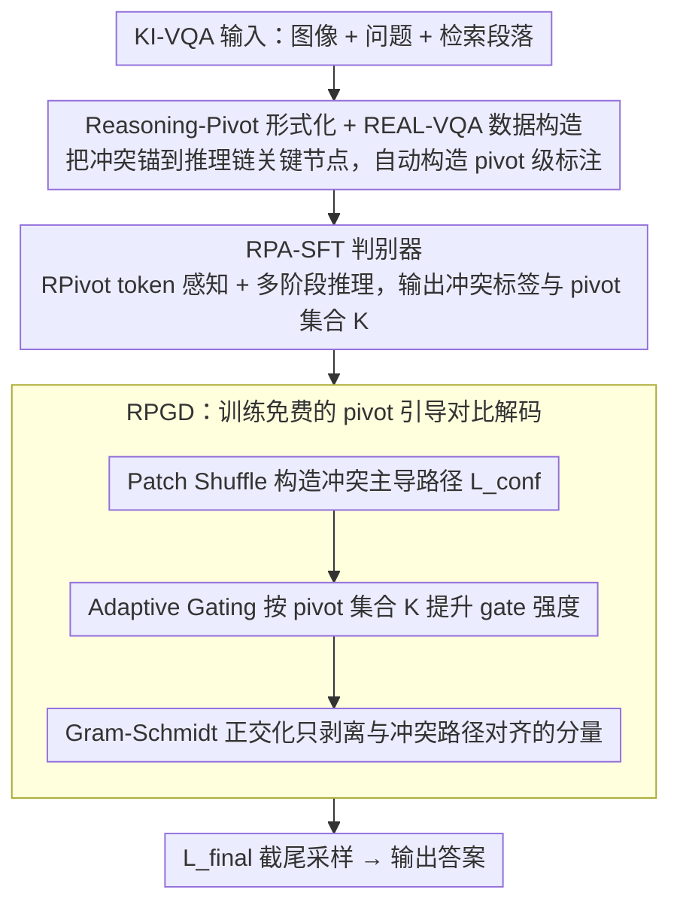

# REAL: Resolving Knowledge Conflicts in Knowledge-Intensive Visual Question Answering via Reasoning-Pivot Alignment

**会议**: ICML2026  
**arXiv**: [2602.14065](https://arxiv.org/abs/2602.14065)  
**代码**: 待确认  
**领域**: information_retrieval  
**关键词**: 知识冲突、KI-VQA、Reasoning-Pivot、对比解码、多模态 RAG

## 一句话总结
本文提出 REAL 框架，用"Reasoning-Pivot"（推理链中必须依赖外部证据才能补全的原子节点/边）重新定义 KI-VQA 中的知识冲突，并通过 RPA-SFT 训练 pivot 感知的冲突判别器 + RPGD 训练免费的对比解码策略，在 E-VQA / InfoSeek / A-OKVQA 上分别取得 +3.8% / +1.6% / +3.6% 的提升。

## 研究背景与动机

**领域现状**：Knowledge-Intensive VQA（KI-VQA）已成为 MLLM 与多模态 RAG 的主流配置——通过检索 Wikipedia 等外部段落补足视觉与参数化记忆的不足。现有工作大多在检索精度、reranker 和知识结构组织上做文章。

**现有痛点**：开放域检索不可避免会引入噪声和矛盾证据，形成"知识冲突"（同一艺术家既是 Italian 又是 Spanish）。然而现有冲突处理范式有两个硬伤：(1) **泛化性差的冲突检测**——基于实体/关键词的语义匹配规则脆弱，无法适应 KI-VQA 中海量外部知识与复杂证据交互；(2) **缺乏模型内冲突约束**——现有方法依赖外部知识重组或对比 prompt 干预，但同一类冲突在 KI-VQA 中呈现形式多样，导致解决行为不一致、推理结果不可预测。

**核心矛盾**：传统"实体不匹配=冲突"的定义忽略了 KI-VQA 推理链的序列性与条件性。在多跳推理 $\{e_{img} \xrightarrow{p_1} e_2 \xrightarrow{p_2} \cdots \xrightarrow{p_n} e_n\}$ 中，中间节点 $e_2,\ldots,e_n$ 本来就要和初始视觉实体 $e_{img}$ 不同；同时，相同 property type（如 location/nationality）可以出现在推理链不同阶段，关键词匹配会把它们错判为等价。

**本文目标**：(1) 重新形式化什么算"真冲突"；(2) 用统一信号同时训练判别器并指导解码以闭环解决冲突。

**切入角度**：把 KI-VQA 拆成离散推理链，只在与"推理枢纽"(pivot)绑定的事实点上判定矛盾——枢纽外的实体/关键词差异一律视为良性噪声。

**核心 idea**：先用 Reasoning-Pivot 抽取把"冲突检测"约束到推理链关键节点上，再让同一个 pivot 信号既驱动 SFT 训练，又指导 logit 级对比解码。

## 方法详解

### 整体框架
REAL 想解决的是 KI-VQA 里"什么才算真冲突"这件事，而它的答案是把判定收缩到推理链的关键节点上，再让这个判定信号一路贯穿训练和解码。整条 pipeline 用同一份 Reasoning-Pivot 语义实体串起三个组件：先用 Wikipedia + GPT-4o 自动构造带 pivot 级标注的 REAL-VQA 数据集（4,149 训练 / 629 测试，每样本配 5 段 ground-truth 段落），再用 RPA-SFT 训出一个"先抽 pivot 再判冲突"的判别器，最后用训练免费的 RPGD 在解码时把判别器圈出的冲突方向从 logits 里剥掉。三者形成"数据→判别器→解码"的闭环，避免了多模块之间的信号失配。

### 关键设计

**1. Reasoning-Pivot 形式化与 REAL-VQA 数据构造：把冲突锚到推理链关键节点**

传统"实体/关键词不匹配=冲突"的定义在多跳推理里会大量误判——推理链 $e_1 \xrightarrow{p_1} e_2 \xrightarrow{p_2} y$ 中的中间节点本就该和视觉初始实体不同，而相同 property type（location/nationality）又会在链条不同阶段重复出现。REAL 把链上所有不可或缺的节点和边收集成 pivot 集合 $\mathcal{P}=\{e_1,p_1,e_2,p_2,y\}$，再把冲突严格限定为"针对同一 pivot 的逻辑互斥断言"$\mathcal{K}_{conflict}=\{u\in\mathcal{P}\mid\exists a_i,a_j\in\mathcal{I}_u,\ a_i\wedge a_j\rightarrow\bot\}$，从而把 pivot 之外的实体差异、位置信息等一律归为良性噪声。为了让数据真正逼出这类冲突，构造遵循三条原则——高多跳复杂度（最大化 pivot 广度）、common-property 聚合（增加 pivot 密度）、knowledge-deficit 诱导（过滤掉只看图就能答的样本）；冲突本身用 rewrite-based 策略生成：把 ground-truth pivot $p_{gt}$ 换成 $p_{neg}$，让 GPT-4o 在 $p_{neg}$ 的真实 Wikipedia 语境下重写整段，使文本自身事实自洽但与视觉证据精确矛盾。最后用 vote-of-confidence 过滤（10 次 GPT-4o 打分累计 $\geq 80$ 且单次 $\geq 6$）加人工校验把关质量，既解决了"匹配 ≠ 真冲突"的根本问题，又为判别器提供 pivot 级而非二元的监督信号。

**2. RPA-SFT：用双机制把冲突判别变成显式逻辑核验**

如果只拿二元冲突标签做 SFT，模型很容易学到数据集 artifact 这种 shortcut，跨域就崩。RPA-SFT 因此把判别拆成两个机制叠加。其一是 token-level pivot perception：在词表里加入 `<RPivot>` / `</RPivot>` 特殊 token，预处理时把输入和目标里的每个 pivot 都显式包裹起来，让它们在嵌入空间里成为稳定的语义锚点。其二是 multi-stage reasoning training：把目标输出构造成三步推理——先抽 question pivot，再由它引导抽段落 pivot，最后基于同一 pivot 集合内的断言逻辑一致性输出二元冲突标签。损失仍是标准 SFT 的 next-token cross-entropy，只是目标序列内嵌了"先抽 pivot 再判冲突"的结构，等于强制模型靠"同一 pivot 上的断言比较"来决策，而非记忆表面模式。正是这套显式核验让判别器在 E-VQA / ScienceQA / MMKC 等跨域和未见冲突类型上仍保持泛化。

**3. RPGD：训练免费的 pivot 引导对比解码**

有了判别器输出的 pivot 集合 $\mathcal{K}$，推理时就能只针对冲突方向做抑制、不误伤正常 token。RPGD 是一条三阶段流水线。第一步 Patch Shuffle 随机置乱视觉 patch embedding 构造"冲突主导"路径 $L_{conf}=M(x,\text{Shuffle}(v))$，它破坏对象级拓扑但保留 part-level 特征和原始分布幅度，逼模型在缺乏视觉验证时优先依赖矛盾文本——这比直接 mask 或加噪更安全，因为不引入分布偏移。第二步 adaptive gating 先用全局基线 $\varepsilon$ 初始化 gate 矩阵 $\alpha\in\mathbb{R}^{B\times V}$，再只对 pivot 对应的词表索引 $\mathcal{K}$ 按 $\alpha_{b,v}\leftarrow\varepsilon+\beta\cdot\sigma(\kappa L_{conf}(b,v))$ 提升 gate 强度（$\sigma$ 防饱和、$\beta$ 控制力度），让抑制跟着 pivot 信号走、非 pivot token 接近 baseline。第三步 Gram-Schmidt 正交化先算投影系数 $c=\langle L_{std},L_{conf}\rangle/(\|L_{conf}\|_2^2+\delta)$，得到投影分量 $L_{proj}=c\cdot L_{conf}$，最终 logit 为 $L_{final}=L_{std}-\alpha\odot L_{proj}$ 再用 cutoff $\tau$ 截尾采样。相比直接 logit 相减会连共有的合理结构一起误伤，这里严格只剥离与冲突路径几何对齐的分量，把对比解码常见的过度惩罚问题压了下去。

### 损失函数 / 训练策略
RPA-SFT 用标准 SFT 目标，target 序列结构为"`<RPivot>` 包裹的 question pivots → 段落 pivots → 二元冲突标签"。检索文档数 $k=5$，与 EchoSight / ReflectiVA 等基线对齐；用 8 张 H20 训练。RPGD 完全训练免费，超参 $\varepsilon, \beta, \kappa, \tau, \delta$ 在 appendix 中给出。

## 实验关键数据

### 主实验
KI-VQA accuracy 主结果（与 SOTA 对比，加粗为最优）：

| 模型 | 方法 | InfoSeek (All) | E-VQA (All) | 相对前 SOTA |
|------|------|--------------|------------|------------|
| Qwen3-VL-8B | REAL (Ours) | **44.1** | **41.4** | +1.6 / +3.8 |
| InternVL3.5-8B | REAL (Ours) | 43.8 | 39.2 | 同尺度领先 |
| InternVL3-8B | VLM-PRF | 42.5 | 39.2 | 前 SOTA |
| LLaMA3.1-8B | ReflectiVA | 40.2 | 35.5 | — |
| LLaVA-1.5-7B | EchoSight | 26.8 | 28.5 | — |

A-OKVQA：REAL (LLaVA-1.5-7B) 取得 MC=80.3 / DA=68.3，比 QACap (Claude 3.5) 的 76.7 / 66.3 更高，证明在 commonsense 推理上也能迁移。

### 消融实验
冲突判别（MCC / F1，关键跨域结果）：

| 模型 | 方法 | REAL-VQA MCC | E-VQA MCC | ScienceQA MCC | MMKC MCC |
|------|------|--------------|-----------|---------------|----------|
| Qwen3-VL-8B | Zero-shot | 19.0 | 85.4 | 64.5 | 23.4 |
| Qwen3-VL-8B | Few-shot CoT | 19.4 | 86.9 | 67.4 | 42.4 |
| Qwen3-VL-8B | 普通 SFT | 89.4 | 82.6 | 87.0 | 38.2 |
| Qwen3-VL-8B | RPA-SFT (Ours) | **98.1** | **93.4** | **87.9** | **52.9** |

RPGD 组件消融（Qwen3-VL-8B on E-VQA, Single-Hop / All）：

| Patch Shuffle | Adaptive Gating | Gram-Schmidt | Single-Hop | All |
|---------------|-----------------|--------------|-----------|-----|
| ✗ | ✗ | ✗ | 42.4 | 38.1 |
| ✗ | ✓ | ✓ | 43.9 | 39.2 |
| ✓ | ✗ | ✓ | 44.1 | 39.5 |
| ✓ | ✓ | ✗ | 43.5 | 38.9 |
| ✓ | ✓ | ✓ | **45.5** | **41.4** |

### 关键发现
- **RPA-SFT 在 MMKC 这种完全未见数据集上比普通 SFT 高 +14.7 MCC**，说明 pivot 级监督带来真泛化而非过拟合 REAL-VQA。Table 4 进一步显示 RPA-SFT 在 Reasoning Pivot F1 / Conflict Pivot F1 上分别比 Few-shot 提升 +17.8 / +28.3（Qwen3-VL-8B），证明判别准确性源于精准定位冲突来源而非表面模式。
- **RPGD 三个组件缺一不可**：去掉 Patch Shuffle 掉 2.2 / 1.6，去掉 Adaptive Gating 掉 1.9 / 1.4，去掉 Gram-Schmidt 掉 2.5 / 2.0；Pivot 引导信号 vs Uniform/Random 提供 +3.8 / +5.1 增益（Table 6），说明对比方向必须精准锚到 pivot。
- **跨模型可迁移**：RPGD 在 LLaVA-1.5-7B / InternVL3.5-8B / Qwen3-VL-2B/8B 上一致带来 +3~7 点提升，作为 plug-in 不需额外训练。

## 亮点与洞察
- **冲突定义的范式转移**：把"实体/关键词不匹配"换成"同一推理 pivot 上的逻辑互斥"，一次性解决了多跳推理中实体天然差异和共性属性类型重复带来的误判。这个 reframe 比任何架构创新都更本质。
- **同一信号端到端复用**：pivot 在数据构造（rewrite 锚点）、SFT 目标（特殊 token + 多阶段输出）、解码（gate index 集合）中是同一份语义实体，避免了多模块之间的信号失配，这种"用一根线串起 train-time 和 inference-time"的设计很值得借鉴。
- **Patch Shuffle 比 mask/noise 更聪明**：保留分布幅度但破坏拓扑结构，构造的"看得见但拼不上"状态比硬遮挡更能逼出冲突信号，且不引入分布偏移；这种"结构破坏而非信息删除"思路可迁移到任何需要构造 contrastive negative 的视觉任务。
- **Gram-Schmidt 投影 + adaptive gating** 提供了一个干净的数学框架：只剥离"几何上与冲突路径对齐"的 logit 分量，且抑制强度由 sigmoid 平滑控制，避免对比解码常见的过度惩罚问题。

## 局限与展望
- **依赖 GPT-4o 自动构造数据**：REAL-VQA 训练集只有 4,149 条，且 pivot 标注质量取决于 GPT-4o 的多跳推理能力，可能漏掉真实场景中模糊的、跨语种的 pivot 类型。
- **Pivot 抽取假设推理链是显式可枚举的**：对于需要常识/隐式推理的开放问答（无清晰多跳链），pivot 集合可能塌缩为单点甚至空集，RPGD 退化为普通对比解码。
- **只覆盖 RAG context-memory 一类冲突**：intra-memory 冲突（参数化记忆内部矛盾）和纯 image-text 模态冲突未在 framework 内显式建模，需要扩展 pivot 定义。
- **5 段检索 + 8B 模型规模**：在更大检索深度（$k\geq 20$）和更大模型（70B+）上的可扩展性未验证；RPGD 需要跑两次 forward（standard + shuffle），推理开销翻倍。
- 改进方向：把 pivot 抽取从离散 token-level 升级为 latent vector，可能允许更柔性的冲突信号传递；或在 RAG retriever 阶段就用 pivot 做 query rewriting。

## 相关工作与启发
- **vs ReflectiVA / VLM-PRF**：两者依赖外部反馈/伪相关重排做检索后处理，REAL 把工作量挪到模型内部的 pivot 判别和解码上，不改变 retriever 也能涨点；优势是 plug-in 性强、训练成本可控；劣势是必须为每个领域构造 pivot 标注。
- **vs NoteMR / mKG-RAG**：前者用结构化笔记/知识图组织检索结果，REAL 不做知识结构化，只做"哪个事实点上有冲突"的离散判定；REAL 的优势在多跳推理（避免知识图全局索引的噪声），劣势在缺少结构化推理可解释性。
- **vs 传统 contrastive decoding（如 CD / DoLa）**：传统方法用全局对比 prompt 或层间对比，REAL 把对比方向精确投影到 pivot token 上并用 Gram-Schmidt 正交化避免误伤，是 contrastive decoding 在 RAG 场景下的精细化版本。
- **vs Su et al. (2022) / Conflictbank 的混合标签训练**：那一脉用大规模混标数据训冲突分类器，REAL 用更小但 pivot 对齐的数据加结构化输出训练，泛化性反而更好——说明在冲突任务里"标注精度 > 标注数量"。

## 评分
- 新颖性: ⭐⭐⭐⭐⭐ Reasoning-Pivot 的形式化把 KI-VQA 冲突问题重新定义，是真正的概念创新而非工程堆叠。
- 实验充分度: ⭐⭐⭐⭐ 覆盖 4 个判别数据集 + 3 个 KI-VQA 基准 + 4 个模型尺度，消融完整；但缺少在 70B+ 模型和更长检索深度的扩展实验。
- 写作质量: ⭐⭐⭐⭐ Section 3 的形式化定义清晰，方法部分公式与算法伪代码配套；Patch Shuffle 优势对比稍显简略。
- 价值: ⭐⭐⭐⭐⭐ 对所有依赖外部知识的多模态系统都有直接借鉴意义，且 RPGD 训练免费可即插即用。

<!-- RELATED:START -->

## 相关论文

- [\[CVPR 2026\] CC-VQA: Conflict- and Correlation-Aware Method for Mitigating Knowledge Conflict in Knowledge-Based Visual Question Answering](../../CVPR2026/information_retrieval/cc-vqa_conflict-_and_correlation-aware_method_for_mitigating_knowledge_conflict_.md)
- [\[ICLR 2026\] RefTool: Reference-Guided Tool Creation for Knowledge-Intensive Reasoning](../../ICLR2026/information_retrieval/reftool_reference-guided_tool_creation_for_knowledge-intensive_reasoning.md)
- [\[ACL 2026\] CounterRefine: Answer-Conditioned Counterevidence Retrieval for Inference-Time Knowledge Repair in Factual Question Answering](../../ACL2026/information_retrieval/counterrefine_answer-conditioned_counterevidence_retrieval_for_inference-time_kn.md)
- [\[ACL 2026\] VisRet: Visualization Improves Knowledge-Intensive Text-to-Image Retrieval](../../ACL2026/information_retrieval/visret_visualization_improves_knowledge-intensive_text-to-image_retrieval.md)
- [\[ACL 2026\] ChatR1: Reinforcement Learning for Conversational Reasoning and Retrieval Augmented Question Answering](../../ACL2026/information_retrieval/chatr1_reinforcement_learning_for_conversational_reasoning_and_retrieval_augment.md)

<!-- RELATED:END -->
