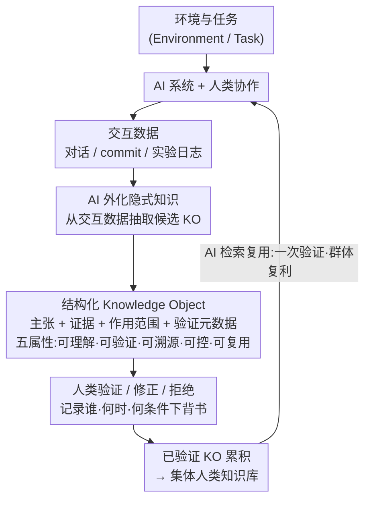

# Position: Reliable AI Needs to Externalize Implicit Knowledge: A Human-AI Collaboration Perspective

**会议**: ICML 2026 (Position Paper)  
**arXiv**: [2605.02010](https://arxiv.org/abs/2605.02010)  
**代码**: 无 (立场论文,无开源实现)  
**领域**: AI 可靠性 / 人机协同 / 知识管理  
**关键词**: 隐式知识, Knowledge Objects, 人在环路, 验证经济学, RLHF 替代

## 一句话总结
本文是一篇 ICML 立场论文,主张当前所有 AI 可靠性方法 (RAG / 自一致性 / RLHF / Agent Memory) 都只能验证显式知识,而 AI 真正强大的能力来自训练数据里 80-95% 未被人类正式记录的"隐式知识",作者提出 Knowledge Objects (KOs) 作为基础设施——把 AI 隐式推理外化成人类可检查、可验证、可背书的结构化产物,从而让一次人类验证的成本在群体中长期复利。

## 研究背景与动机

**领域现状**:LLM 在知识密集任务上能力突飞猛进——75% 的 ChatGPT 对话是知识工作 (Chatterji 2025),Copilot 每天产生数百万代码建议,RCT 显示 AI 协作能带来 20-40% 生产力提升;但同样的系统仍在大规模出错——专业法律 AI 在 17-34% 查询上幻觉 (Magesh 2025),GPT-4 在医学综述任务中 28.6% 引用是伪造,通用 LLM 在可验证法律问题上错误率达 58-88%。

**现有痛点**:作者梳理出 4 类主流可靠性方法都有同一致命缺陷:**(1) RAG** 只能验证"文档说了什么",不能验证"AI 怎么推理";**(2) 内部验证 (Self-Consistency、Uncertainty、LLM-as-Judge)** 用 AI 评 AI,系统性错误会被一致复现 (99% 置信区间真实命中率只有 65%);**(3) 训练类方法 (SFT/RLHF/DPO)** 把知识塞进参数黑箱,无法溯源、无法增量修正,sycophancy 在对齐后仍有 78.5%;**(4) Agent Memory (MemGPT/Reflexion/MemoryBank)** 只存数据不带验证状态,错误信息会污染式累积。

**核心矛盾**:AI 学习的知识有两层——**显式知识** (论文、文档、数据库,占 5-20%) 可以引用回查;**隐式知识** (推理模式、debug 套路、领域直觉,占 80-95%) 嵌入在 conversation log、commit history、experiment log 里,因为"记录成本 > 感知收益"从未被人类正式抽取。LLM 训练时把两者一视同仁地学进去,既学到了专家的判断力,也学到了系统性偏见——但只有显式知识能被验证。

**本文目标**:建立一种基础设施,让 AI 把它学到的隐式知识"外化"成人类可检查、可修正、可累积验证的产物,把"每次都得重新评估 AI 输出"的隐藏成本转成"一次验证终身复用"的复利模型。

**切入角度**:作者借用 Nonaka 组织知识理论 (1994) + Polanyi 默会知识理论 (1966),指出隐式知识不是"无法记录",而是"记录边际成本 > 当时感知边际效用";如果能用 AI 自动把隐式模式抽取成结构化候选,人类只需做"轻量验证",验证经济学就会从"每次都做"翻转成"一次做,持续受益"。

**核心 idea**:把 Knowledge Object (KO) 作为人机协作的"枢纽" (hub)——AI 负责外化隐式知识为结构化产物 (claim + evidence + scope + validation metadata),人类负责验证、修正、背书,验证状态作为一等公民被持久化和检索。

## 方法详解

### 整体框架
论文不是方法论文,而是提出一套**概念框架 + 五属性 + 行动呼吁**。核心架构是 "KO-Hub" 协作范式:Environment → Task → (AI System + Human) 协作 → 生成 Interaction Data → AI 从交互数据中外化候选 KO → Human 验证/修正/拒绝 → 验证过的 KO 进入 Collective Human Knowledge 池 → 后续任务可以检索这些已验证 KO。整个闭环让"人类验证"从一次性的、易逝的判断转换成可累积、可查询的资产。

### 关键设计

1. **Knowledge Object 的正式定义与五属性**:

    - 功能:把隐式知识固化成人类能"看-验-背书"的对象,而不是嵌在参数里的不可访问表示。
    - 核心思路:Definition 4.1 规定一个 KO 必须包含四要素——(i) 知识主张或过程 (claim or procedure)、(ii) 支持证据或推理 (evidence)、(iii) 显式作用范围与限制 (scope)、(iv) 验证元数据 (validation metadata,记录谁、何时、何条件下验证)。在此之上提出五条必备属性: **Understandable** (可读、领域专家能评估,不是 embedding)、**Verifiable** (可记录验证状态,不是一次性判断)、**Traceable** (溯源——谁背书的、源头是什么、怎么改的)、**Controllable** (人类可修改、注释、拒绝)、**Reusable** (一次验证可被后续用户复用)。前 3 条对应论文识别的核心问题"invisible / unverifiable / untraceable",后 2 条让验证成本可摊销。
    - 设计动机:对比 RAG 只解决"显式引用"、Agent Memory 只解决"持久存储不带状态",KO 是第一次把"人类验证状态"作为对象的第一类公民属性。

2. **验证经济学翻转 (Verification Economics Inversion)**:

    - 功能:把"每个用户独立评估 AI 输出"的隐性总成本,转换成"一个专家验证,N 个后续用户受益"的复利模型。
    - 核心思路:Polanyi 之所以说隐式知识"不可言传",是因为人类抽取成本 > 当时收益;KO 利用 AI 自动外化作为结构化候选,把"抽取"成本从人类身上转移到 AI,人类只需要做"低成本验证"——例如确认/打分/补充 scope 标签。验证从"易逝的私人判断"变成"持久的公共资产"。作者用 Wikipedia 分层做类比:99.9% 文章用社区共识、0.1% 用 Featured Article 严审;KO 系统同样分层——高风险知识需专家验证,普通模式只需明确标注"unvalidated"。
    - 设计动机:针对反对者 "验证会成为瓶颈" 的担忧,作者论证:不验证才是隐藏的最大成本——目前每个用户独立评估 LLM 输出的总耗时,远高于"一次验证多次复用"的模式;不可扩展的恰恰是现状。

3. **KO 与现有方法的互补定位**:

    - 功能:明确区分 KO 与知识图谱、wiki、Agent Memory,避免被误解为重复造轮子。
    - 核心思路:Table 1 系统对比 4 类现有方法对"隐式知识"的影响——RAG=Untouched (推理过程仍在模型内未验证)、Self-Verification=Unexposed (只产生 confidence,无外部参照)、Training=Absorbed (变成参数黑箱,不可见不可溯源)、Agent Memory=Unstructured (持久存储但无验证状态)。KO 是**唯一**把隐式知识转成可外部检查产物的设计。作者还讨论 KO 在 agent 场景下的具体形态——Voyager 的可执行 skill library、Agent Workflow Memory 归纳的可复用 workflow 都是"程序型 KO"的雏形。
    - 设计动机:作者强调 KO 不是替代现有 KM 系统,而是补齐"AI-generated yet human-verifiable"这一缺失层;传统 wiki 管"人类已写的",KO 管"AI 已学但人类还没验证的"。

### 损失函数 / 训练策略
立场论文无训练目标,但作者在 Section 6 给出对四类利益相关者的"行动清单":ML 研究者负责开发 KO 候选自动抽取算法、KO 质量评估框架;系统构建者负责实现五属性的基础设施 + 验证 UI + 溯源 API;组织负责治理框架 (谁有权验证哪类 claim) + 试点高风险领域 + 验证激励;研究社区负责共享 benchmark + 开放数据集 + 互操作标准。

## 实验关键数据
本文为 ICML 立场论文,无实证实验;以下表格用来组织论文核心论证证据。

### 失败模式量化 (作者引用文献)

| 失败模式 | 量化数据 | 来源 |
|---|---|---|
| 法律 AI RAG 后仍幻觉 | 17-34% 查询 | Magesh 2025 |
| 通用 LLM 法律错误率 | 58-88% | Dahl 2024 |
| GPT-4 医学综述伪造引用 | 28.6% | Chelli 2024 |
| Sycophancy 对齐后残余 | 78.5% | Sharma 2024 |
| Prompt 改格式带来精度变化 | 最多 76 个百分点 | Sclar 2024 |
| 99% 置信区间真实命中率 | 65% | Geng 2024 |

### 现有方法对隐式知识的覆盖度

| 方法 | 对显式知识 | 对隐式知识 | KO 是否能补 |
|---|---|---|---|
| RAG | ✅ 引用文档 | ❌ 推理过程不可见 | ✅ 外化推理为 KO |
| Self-Verification | △ 检测一致性 | ❌ 只看 confidence | ✅ KO 提供外部参照 |
| Training (SFT/RLHF/DPO) | △ 嵌入参数 | ❌ 黑箱不可溯源 | ✅ KO 是显式 artifact |
| Agent Memory | ✅ 存储事实 | △ 无验证状态 | ✅ KO 带 validation metadata |

### 关键论证发现
- **隐式知识占组织知识 80-95%** (Dalkir 2017),也是 LLM 能力最核心来源,但恰是最不可验证的部分——能力越强的模型反而越擅长学到隐式的坏模式 (Lin 2022, McKenzie 2023)。
- **作者对 5 个反方观点的逐一驳斥** (KG 已解决 / 现有系统会自然加 validation / 人会成瓶颈 / AI 能自验证 / 结构化会降低易用性) 是论文最有信息量的部分,展示了 KO 与每条 alternative 的真正差异。
- **核心 reframe**:可靠性问题不是 AI 算法问题,而是基础设施 (infrastructure) 问题;只要没有"人类验证可累积"的载体,任何算法改进都只是局部优化。

## 亮点与洞察
- **"验证经济学"是个新视角**:把 AI 可靠性从"训练时算法问题"重构成"推理时基础设施问题",借鉴 Nonaka 组织知识管理理论,把 LLM 当作"组织成员"来设计配套 KM 系统——这种跨学科桥接很难得。
- **Implicit vs Explicit knowledge 的 reframe 一针见血**:作者用 Polanyi 1966 的默会知识理论解释为什么 RAG 治标不治本,然后把这套"为什么没记录"经济学逻辑反向用到"如何让 AI 帮忙记录"——立场翻得很优雅。
- **agent skill = procedural KO 的桥接**:作者把 Voyager 的代码 skill library、Agent Workflow Memory 的工作流归纳都纳入 KO 的程序型形态,意味着这套框架对 agentic AI 时代特别契合,validated skill 可以变成"组织级 building block"。
- **对反方观点的预答辩水平很高**:Section 5 的五点驳斥(尤其是"AI 自验证已经够好了"和"结构化会降低适应"这两条) 显示作者对领域共识很有把握,这种结构在 position paper 中比纯 manifesto 有说服力得多。

## 局限与展望
- 立场论文没有给出 KO 的具体规范 (schema)、自动抽取算法、UI 设计,从"建议"到"可实施系统"距离仍远——作者把这些都甩给了 ML 研究者与系统构建者。
- "人类验证规模化"如何处理"专家观点冲突"、"过时知识降级"、"恶意验证投毒"等问题没有展开;Wikipedia 模型有自己的成熟治理,迁移到企业 KO 仓库的挑战会更复杂。
- 作者主张 KO 是"人机协作枢纽",但没有量化论证"如果不做 KO,损失多少";读者只能凭直觉和案例认同,缺乏经济模型支撑。
- 对 LLM-as-Judge / Constitutional AI / Process Reward Model 等近期 alignment 路线 (它们本质也在"显式化推理")的边界划分还可以更清晰。
- 即便有 KO 基础设施,如何防止"验证内卷" (低质量验证泛滥) 也需要类似 PageRank 的验证者声誉机制——这部分基本没讨论。

## 相关工作与启发
- **vs RAG (Lewis 2020)**:RAG 只能挂"外部显式文档",对模型 generation 中的隐式推理无能为力;KO 把推理本身固化成可验证 artifact——是 RAG 的正交补充。
- **vs Constitutional AI / RLHF**:这两条路把人类偏好压入参数,KO 把人类偏好/验证留在外部、可溯源、可修订;前者训练效率高但黑箱,后者透明但需要新基础设施。
- **vs Agent Memory (MemGPT/Reflexion/A-MEM)**:Memory 系统优化 AI 检索性能,KO 优化人类验证性能——作者明确指出二者设计哲学不同,加 validation 到 Memory 是"事后补丁"而非"一等公民"。
- **vs Wikipedia / Stack Overflow**:这些是显式知识社区平台,KO 是"AI 隐式知识社区平台"的概念蓝图;借鉴 Wikipedia 的分层验证 (Featured Article) 与 Stack Overflow 的投票背书机制是显然的工程方向。
- **vs Process Reward Model (PRM, OpenAI's let's verify)**:PRM 用模型评 step 是另一条解决推理不可验证的路;两者可以结合——PRM 提供初步 confidence,KO 提供人类终审 ground truth。

## 评分
- 新颖性: ⭐⭐⭐⭐ 把组织知识管理理论引入 AI 可靠性,Knowledge Object 提法干净,但 KG/wiki 早有概念雏形
- 实验充分度: ⭐⭐ 立场论文无实验,所有定量证据均来自他人文献调研
- 写作质量: ⭐⭐⭐⭐⭐ 论证逻辑链 (现状→痛点→现有方法都不行→为什么不行→KO→反驳→行动) 极清晰,5 节反方论证写得有水平
- 价值: ⭐⭐⭐⭐ 给社区提供了一个新词汇 (KO) 和组织语言,有潜力催生新基础设施和评测;但要落地仍需大量后续工作

<!-- RELATED:START -->

## 相关论文

- [\[NeurIPS 2025\] MITRA: An AI Assistant for Knowledge Retrieval in Physics Collaborations](../../NeurIPS2025/information_retrieval/mitra_an_ai_assistant_for_knowledge_retrieval_in_physics_collaborations.md)
- [\[ACL 2026\] Retrieval-Augmented Tutoring for Algorithm Tracing and Problem-Solving in AI Education](../../ACL2026/information_retrieval/retrieval-augmented_tutoring_for_algorithm_tracing_and_problem-solving_in_ai_edu.md)
- [\[ACL 2025\] PersonaBench: Evaluating AI Models on Understanding Personal Information through Accessing (Synthetic) Private User Data](../../ACL2025/information_retrieval/personabench_evaluating_ai_models_on_understanding_personal_information_through_.md)
- [\[ICML 2026\] CARE: Class-Adaptive Expert Consensus for Reliable Learning with Long-Tailed Noisy Labels](care_class-adaptive_expert_consensus_for_reliable_learning_with_long-tailed_nois.md)
- [\[ICML 2026\] REAL: Resolving Knowledge Conflicts in Knowledge-Intensive Visual Question Answering via Reasoning-Pivot Alignment](real_resolving_knowledge_conflicts_in_knowledge-intensive_visual_question_answer.md)

<!-- RELATED:END -->
