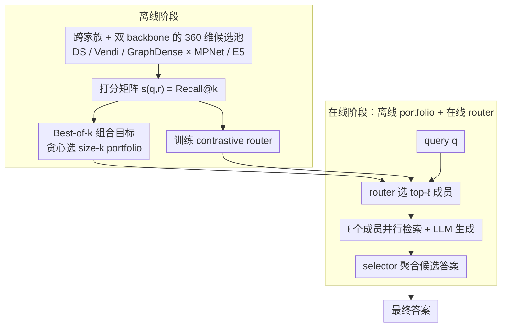

# Retriever Portfolios: A Principled Approach to Adaptive RAG

**会议**: ICML 2026  
**arXiv**: [2605.31176](https://arxiv.org/abs/2605.31176)  
**代码**: 无  
**领域**: 信息检索 / 自适应 RAG  
**关键词**: 检索增强生成, 检索器组合, 子模优化, 查询路由, best-of-k

## 一句话总结
本文把 RAG 中"选哪个 retriever"重新表述为一个 best-of-$k$ 组合优化问题，从 360 个候选 retriever 里离线贪心挑出一个互补的 size-$k$ 组合（portfolio），并训练一个轻量对比学习路由器在线把每个 query 分发给组合里的 top-$\ell$ 个成员，在 4 个 QA 基准上同时打过单 retriever 和 Vendi-RAG 类推理时调参方法，并显著降低 token 和延迟成本。

## 研究背景与动机

**领域现状**：主流 RAG 系统几乎都是"选一个 retriever + 一套固定超参数"打天下，从早期 DPR、FiD 一路到 Self-RAG 都遵循 one-size-fits-all 的范式（Lewis 2020；Karpukhin 2020；Shuster 2021）。

**现有痛点**：QA query 的分布高度异质——有的是单跳 factoid 题（lexical 命中就够），有的是多跳推理题（需要语义多样的多文档聚合），有的是领域术语题。已经有充分证据显示任何一个固定 retriever 都不可能在所有 query 上最优（Karpukhin 2020；Jeong 2024；Kalra 2025a），即使是同一个参数化 retriever，最优超参数也随 query 漂移（Rezaei & Dieng 2025）。

**核心矛盾**：现有自适应方案要么走"少数预设策略 + 分类器"路线（Adaptive-RAG 只在"不检索 / 单步 / 多步"三档里选），要么走"per-query 在线超参搜索"路线（Vendi-RAG 在每个 query 上迭代 retrieve-generate-judge 调 diversity 参数 $s$）。前者表达能力太弱、后者推理成本爆炸且无法并行。

**本文目标**：在不做 per-query 在线搜索的前提下，从一个**大**的候选 retriever 池里挑出一个**小**的、行为互补的子集，使其在期望意义下覆盖 query 分布的不同区域。

**切入角度**：把每个 retriever 视作算法选择问题里的"候选算法"，每个 query 视作"问题实例"，于是 RAG 检索器选择问题 = 数据驱动的 solution portfolio 问题（Drygala 2025）/ catalogue 问题（Kleinberg 2004）。一旦套上这个外壳，目标函数 $F(S)=\mathbb{E}_{q}[\max_{r\in S} s(q,r)]$ 自动满足非负、单调、子模性，于是经典贪心就有 $(1-1/e)$ 近似。

**核心 idea**：用 best-of-$k$ 组合目标替代 average 目标 + 离线贪心选 portfolio + 在线对比学习路由器，把"自适应"这件事的开销摊销到离线阶段。

## 方法详解

### 整体框架

整套 pipeline 分两阶段：

**离线阶段**：在训练 query 集上对所有候选 retriever 评估打分得到分数矩阵 $s(q,r)\in[0,1]$（论文里用 Recall@$k$ 作为 $s$），然后用 Algorithm 1 贪心地挑 $k$ 个 retriever 出来组成 portfolio $S$。同时基于 retrieval 监督训练一个 contrastive router。

**在线阶段**：来一个 query $\mathbf{q}$，router 把它编码后和 $k$ 个"retriever embedding"算相似度，挑出 top-$\ell$ 个 portfolio 成员**并行**执行检索 + LLM 生成，最后 selector 聚合候选答案。关键点是 $\ell\le k$ 都是**固定**的小常数，所以延迟可预测、调用可并行。

### 关键设计

**1. Best-of-$k$ 组合目标：把"选哪个 retriever"重写成可证明的组合优化问题**

之前的 Adaptive-RAG / Vendi-RAG 都是启发式，没有把"覆盖异质 query 分布"这件事形式化。本文给 portfolio $S\subseteq\mathcal{R}$ 定义得分 $\mathrm{score}(q,S)=\max_{r\in S} s(q,r)$，整体目标 $F(S)=\mathbb{E}_{q\sim\mathcal{D}}[\max_{r\in S} s(q,r)]$。这个 $\max$ 形式天然奖励"覆盖不同 query 子群"的成员——行为相似的冗余 retriever 对最大值几乎没贡献，所以目标自动逼着 portfolio 互补。求解上 Algorithm 1 采样 $N$ 个 query 后跑贪心：每步加入边际增益 $\frac{1}{N}\sum_{q\in Q}\max(0,s(q,r)-V[q])$ 最大的 $r$，并把 $V[q]$ 维护成"当前 $S$ 在 $q$ 上的最优得分"，于是每步只花 $\mathcal{O}(|\mathcal{R}|N)$。由于 $F$ 非负、单调、子模，贪心自带经典 $(1-1/e)$ 近似；Theorem 3.1 进一步给出样本复杂度：取 $N=\mathcal{O}((k\log|\mathcal{R}|+\log(1/\delta))/\epsilon^2)$ 个 query，就能以 $1-\delta$ 概率保证 $F(S)\ge (1-1/e)\mathrm{OPT}-\epsilon$。关键是样本量只随 $\log|\mathcal{R}|$ 增长、独立于 query 分布的支撑大小，这正是工程上敢把候选池开到 360 还跑得动的根本原因。

**2. 跨家族 + 双 backbone 的 360 维候选池：让 $\max$ 算子有真正互补的对象可挑**

portfolio 思想的实际收益完全取决于候选成员是否真互补——如果池子里只有 DS 的不同 $\gamma$，那 best-of-$k$ 和单 retriever 没区别。为此候选池由三个 retriever 家族 × 两个 embedding backbone（MPNet 与 E5）拼成。**DiscountedSimilarity (DS)** 在 FAISS top-$M=1000$ 候选里贪心选 $n=4$ chunk，用参数 $(\gamma, r)$ 控制对已选 chunk 的相似度惩罚，每个 backbone 给出 140 个配置加 1 个 dense baseline 共 141 个；**Vendi** 用 Vendi-score 在相关性和集合内多样性之间权衡，diversity 参数 $s\in[0,1]$ 步长 0.05 扫出 21 个配置；**GraphDense** 先用 query 实体在"实体-chunk 二部图"上做 BFS 扩展，再用 MPNet/E5 重排，扫 hop 数、实体最大文档频次等得到 36 个配置。三家拼起来全池 $|\mathcal{R}|=360$，打分矩阵在两个 backbone 上分别缓存 candidate 集合后 batched 评估，使 $360\times|Q|$ 规模的 score table 离线可算完。论文实测 size-5 portfolio 里同时挑进了 GraphDense/E5、多个不同参数的 Vendi/E5 和 GraphDense/MPNet（Table 2），印证只有跨家族 + 跨 backbone 才能让 greedy 在前几步就显著拉开和"top-$k$ by average score" baseline 的差距。

**3. 离线 portfolio + 在线 contrastive router：把自适应开销摊销到离线**

为了避开 Vendi-RAG 那种"retrieve → generate → LLM judge → 调 $s$ → 再 retrieve"的串行在线搜索，本文把"挑哪个 retriever 给当前 query"压成 router 的一次轻量前向。router 输入 query 原文加 cached MPNet 与 E5 query embedding，过一个 frozen Flan-T5-Large encoder 得到文本表示后再 fuse 两个 backbone-specific dense embedding，输出对每个 portfolio 成员的相似度分；训练目标沿用 Chen et al. 2024 的 multi-positive contrastive loss，把"在该 query 上取得最高 Recall@$k$ 的 retriever"当正样本。推理时取 top-$\ell$（主表用 $\ell\in\{2,3\}$）个成员**并行**跑检索 + LLM 答案生成，最后用同一个 LLM 作 selector 聚合。因为 router 一次前向就定下 routing、$\ell$ 个分支彼此无依赖可并行，token 开销和 wall-clock 都对 $\ell$ 线性、对 $k$ 无关——$(k=4,\ell=2)$ 这类配置既保住准确率又拿到可预测的服务成本，这也是 Figure 4 里 portfolio 在 cost-accuracy 平面上压过 Vendi-RAG 的直接原因。

### 损失函数 / 训练策略

- **离线 portfolio**：以 Recall@$k$ 作为 $s(q,r)$（用 ground-truth 支撑文档算），所有 4 个训练集 query 池化为 union training set 后跑 Algorithm 1，主结果用 $k=4$ 或 $5$。
- **Router**：multi-positive contrastive，positives = 该 query 上 Recall@$k$ 最高的 retriever；具体 loss / tie 处理 / 优化器在附录 B.9。
- **答案模型**：Gemma-3-27B-It 和 Llama-3.1-70B-Instruct，全程 prompt 模板固定保证公平比较。

## 实验关键数据

### 主实验

四个 QA 基准（HotpotQA / MusiQue / TriviaQA / 2WikiMultiHopQA），两个 answer LLM，end-to-end Exact Match（节选 Table 3，加粗为该列最优）：

| 方法 | HotpotQA (Gemma) | MusiQue (Gemma) | 2Wiki (Gemma) | HotpotQA (Llama) | MusiQue (Llama) | 2Wiki (Llama) |
|------|------------------|------------------|----------------|-------------------|------------------|----------------|
| No retrieval | 0.326 | 0.061 | 0.226 | 0.348 | 0.059 | 0.192 |
| NN retrieval (MPNet) | 0.395 | 0.129 | 0.241 | 0.476 | 0.139 | 0.292 |
| Best DS retriever | 0.513 | 0.139 | 0.354 | 0.435 | 0.109 | 0.244 |
| Best Vendi retriever | 0.511 | 0.143 | 0.356 | 0.433 | 0.112 | 0.245 |
| Vendi-RAG ($T=20$) | 0.285 | 0.131 | 0.256 | 0.483 | 0.206 | 0.290 |
| **All-pool portfolio** $(k{=}4,\ell{=}2)$ | 0.552 | 0.173 | 0.405 | **0.590** | 0.182 | 0.414 |
| **All-pool portfolio** $(k{=}4,\ell{=}3)$ | **0.558** | **0.195** | **0.414** | 0.583 | **0.209** | **0.419** |

Retrieval-only 端（Figure 3，跨 4 数据集平均）：size-5 学得 portfolio 拿到 Support Recall 0.594 / F1 0.500，而 "top-5 by average score" baseline 只有 0.492 / 0.432，差距在 10 个点量级。

### 消融实验

| 配置 | 关键指标 | 说明 |
|------|---------|------|
| Top-$k$ by avg score | Recall 0.492 @ $k=5$ | 按平均分挑 top-5，被相似的 GraphDense/E5 配置霸榜，缺互补性 |
| Single retriever × 4$k$ docs | F1 从 0.32 → 0.11 ($k{=}1\to 5$) | 单 retriever 多检 chunk 反而把 F1 拖死，因为引入大量非支撑文档 |
| Portfolio $k=2$ | 优于单 retriever 取 20 docs | 证明收益来自 retriever 互补，不是"塞更多 context" |
| Vendi-only portfolio $(k{=}5,\ell{=}2)$ | EM 平均明显低于 all-pool | 限定到单家族单 backbone 后，portfolio 优势缩水，凸显跨家族池的价值 |
| Routing budget $\ell=2 \to 3$ | EM 在 MusiQue / 2Wiki 上明显涨 | $\ell$ 是 cost-accuracy 的旋钮，TriviaQA 简单题 $\ell{=}2$ 足够 |

### 关键发现

- **互补性 > 平均分**：portfolio 的第 2、3 名往往不是平均分最高的 retriever，而是"覆盖前面成员失败 query"的成员，这是 best-of-$k$ 目标与 average-best 选择最本质的差异。
- **多检 ≠ 互补**：单 retriever 把返回 chunk 数翻倍并不能取代 portfolio——Recall 涨但 F1 暴跌，说明额外 chunk 是噪声而非新信号。
- **离线 portfolio 在受控比较里全面碾压 Vendi-RAG**：在只放 Vendi/MPNet 的同一搜索空间下，固定 portfolio 在更少 token 和更低 wall-clock 下达到甚至超过 Vendi-RAG 的 EM；Vendi-RAG 偶尔反超也需要付出几倍 token 代价。
- **跨数据集泛化**：一个 union-trained portfolio 在所有 4 个数据集上同时打过对应的家族最佳 retriever，说明 best-of-$k$ 目标在 union 训练集上学到的 retriever 互补性是跨任务可迁移的。

## 亮点与洞察

- **把 RAG 检索器选择套进 solution portfolio 框架**：一旦认出 $\max_{r\in S}s(q,r)$ 是 query 维度上的 coverage 函数，整个体系（子模性、$(1-1/e)$ 紧近似、$\log|\mathcal{R}|$ 样本复杂度）立刻落地，是把组合优化经典结果"恰到好处地"移植到 RAG 的好例子。
- **离线摊销 = 推理可并行**：相比一切 inference-time tuning（Vendi-RAG / Self-RAG），portfolio 在线只是 routing + 并行执行，**没有任何依赖前一步输出的串行环节**，这对延迟敏感的生产系统是直接卖点。
- **router 训练目标的设计**：以"Recall@$k$ 最优的 retriever"为 contrastive 正样本，巧妙地把"挑 retriever"问题转成了一个标准 contrastive embedding 学习问题，这套思路可以直接迁移到 expert LLM 路由、tool-use agent 的工具挑选等问题。
- **方法是"objective + 候选池"，对 retriever 形态无要求**：sparse、graph、生成式 retriever 都能直接塞进 $\mathcal{R}$，未来扩展到 BM25 + LLM-as-retriever 几乎不用改算法。

## 局限与展望

- **依赖训练集有 ground-truth 支撑文档**：评分矩阵 $s(q,r)$ 用的是 Recall@$k$，依赖每条 query 标注好的 supporting documents。开放域、无标注的真实生产 query 该用什么 proxy 打分（LLM judge？click-through？）作者未深入。
- **目标函数限定 $|S|\le k$ 而非按 cost 加权**：现实里不同 retriever 的检索/嵌入成本差异很大（dense vs graph BFS），论文目前只控制数量，不控制单次成本，对成本不均的候选池可能选出昂贵 portfolio。
- **router 在分布漂移下的鲁棒性未测**：训练 query 池 union 自 4 个学术 QA 数据集，路由器在面对真实世界领域漂移（医学/法律）时是否会把 query routing 到错误成员，缺乏实证。
- **未与最新 retriever-LLM 联合训练方案对比**：例如把 retriever 嵌入和 LLM 联合 fine-tune 的方案是否会让 portfolio 优势缩小，是一个值得跟进的实验。
- **可改进方向**：把 $|S|\le k$ 改成 knapsack 约束（$\sum_{r\in S} c(r)\le B$），子模 + knapsack 上仍有 $(1-1/e)$ 近似，可以原生支持异质成本；或者把 portfolio 学习与 router 训练 end-to-end 联合（当前是两阶段独立的）。

## 相关工作与启发

- **vs Adaptive-RAG (Jeong 2024)**：Adaptive-RAG 用 query 复杂度分类器在 3 个手工策略（no-/single-/multi-step）里选，本文则是从 360 个细粒度 retriever 配置里组合优化选 portfolio，表达空间和理论保证都强一档。
- **vs Vendi-RAG (Rezaei & Dieng 2025)**：Vendi-RAG 在线 per-query 迭代调 diversity 参数 $s$，需要 retrieve-generate-judge 串行循环；本文把同一个 $s$ 搜索空间离线压缩成固定 portfolio，推理 token 数和延迟显著降低且可并行。
- **vs MoR (Kalra 2025b)**：MoR 是在**给定**异质 retriever 集合上做 score-level fusion；本文先解决**怎么从大池里选小集合**的问题，再叠 routing，两者正交、可组合（先用本文挑出 portfolio，再用 MoR 在线 fusion 也行）。
- **vs RouterDC (Chen 2024)**：RouterDC 把 expert LLM 用 dual contrastive 路由起来；本文 router 训练直接借用了该 multi-positive contrastive 范式，把路由对象从 LLM 换成 retriever，但理论贡献集中在 portfolio 选择问题本身。
- **vs Drygala 2025 / Kleinberg 2004**：理论祖先——data-driven solution portfolio 与 segmentation problems 给出了 $(1-1/e)$ + 子模 + 样本复杂度的工具箱，本文是其在 RAG 场景下的精确实例化与工程落地。

## 评分
- 新颖性: ⭐⭐⭐⭐ 把 RAG 检索器选择重新表述为有理论保证的 best-of-$k$ portfolio 问题，是 RAG 领域内少见的"先把问题形式化再上算法"的工作。
- 实验充分度: ⭐⭐⭐⭐ 4 个 QA 基准 × 2 个 answer LLM × 360 候选 retriever，主表、消融、cost-accuracy 都有；缺无标注 query 下的真实生产实验。
- 写作质量: ⭐⭐⭐⭐ 问题动机、理论保证、pipeline 结构清晰；公式和算法伪代码完整；个别图表（Figure 3/4）依赖说明文字读懂。
- 价值: ⭐⭐⭐⭐ 提供一个可立刻接入现有 RAG 系统的"离线选 portfolio + 在线 route"范式，token 和延迟优势对工业部署友好。

<!-- RELATED:START -->

## 相关论文

- [\[ICML 2026\] BlitzRank: Principled Zero-shot Ranking Agents with Tournament Graphs](blitzrank_principled_zero-shot_ranking_agents_with_tournament_graphs.md)
- [\[AAAI 2026\] REAP: Enhancing RAG with Recursive Evaluation and Adaptive Planning for Multi-Hop Question Answering](../../AAAI2026/information_retrieval/reap_enhancing_rag_with_recursive_evaluation_and_adaptive_planning_for_multi-hop.md)
- [\[ACL 2026\] CORAL: Adaptive Retrieval Loop for Culturally-Aligned Multilingual RAG](../../ACL2026/information_retrieval/coral_adaptive_retrieval_loop_for_culturally-aligned_multilingual_rag.md)
- [\[ICLR 2026\] Revela: Dense Retriever Learning via Language Modeling](../../ICLR2026/information_retrieval/revela_dense_retriever_learning_via_language_modeling.md)
- [\[AAAI 2026\] RRRA: Resampling and Reranking through a Retriever Adapter](../../AAAI2026/information_retrieval/rrra_resampling_and_reranking_through_a_retriever_adapter.md)

<!-- RELATED:END -->
