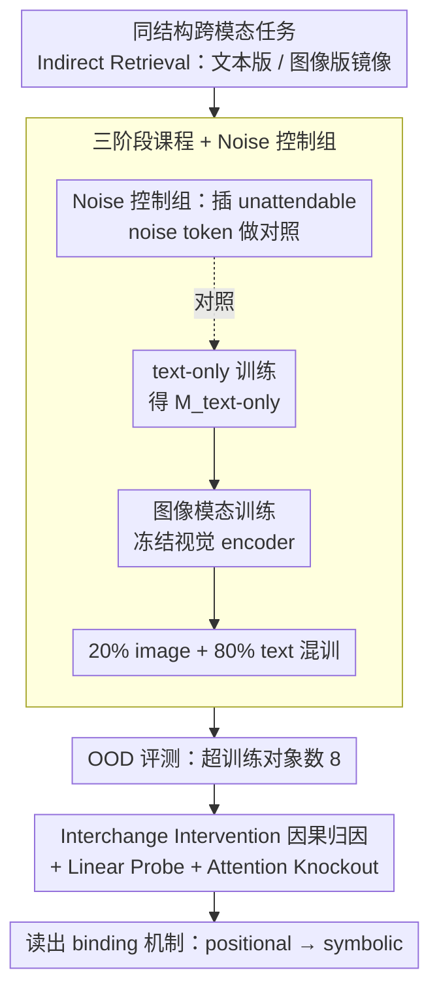

# Seeing to Generalize: How Visual Data Corrects Binding Shortcuts

**会议**: ICML 2026  
**arXiv**: [2602.15183](https://arxiv.org/abs/2602.15183)  
**代码**: 无（论文未声明公开仓库）  
**领域**: 多模态 VLM / 机制可解释性 / 长文本信息检索  
**关键词**: 跨模态训练、binding mechanism、symbolic vs positional、OOD 泛化、长上下文检索

## 一句话总结
本文用一个"颜色-形状-item"受控合成检索任务复现了"VLM 在纯文本任务上超过其 base LLM"的奇怪现象，并用机制可解释性证明：图像训练让模型把变量绑定策略从"位置捷径"切换到"语义符号匹配"，这一切换在重新接回纯文本后被保留下来，使 OOD 检索准确率从 37.2% 提升到 69.5%；在真实 Qwen2/2.5/3 家族上也观察到一致的"symbolic/positional 比例上升"。

## 研究背景与动机

**领域现状**：VLM 通常被视作"给 LLM 加一只眼睛"，主要评测在视觉问答、图像描述等视觉任务上。但研究者陆续报告了一些意外：Qwen3-VL-8B 在纯文本长上下文检索上能达到 76.0%，而 base 模型 Qwen3-8B 只有 62.6%。文本任务跟图像无关，VLM 凭什么比 LLM 强？

**现有痛点**：先前工作要么把这归为"训练数据更多"，要么把它看成噪声没深究；缺乏一个能在受控环境中复现并机械化解释这一现象的研究。要回答"VLM 为什么强"，必须把规模、数据量、训练步数等混杂因素都剥掉。

**核心矛盾**：纯文本检索任务"理论上"用文本训练就能学会，但实证上 text-only 训练学到的是脆弱的"位置依赖捷径"——在 in-distribution 长度内完美，超出训练上下文长度就崩。所谓"text-only 训练"和"基于位置捷径的 text-only 训练"，在分布内难以分辨。

**本文目标**：(1) 在受控小 Transformer 上复现 VLM > LLM 现象；(2) 用机制可解释性识别到底是哪种内部计算被改变了；(3) 验证这种变化在真实大规模 VLM 上也存在。

**切入角度**：把 "Indirect Retrieval" 同时实例化成文本和图像两种模态——文字版"red triangle"和图像版渲染图，任务结构完全一样。如果两种模态训出来的内部 binding 机制不同，就能因果归因。

**核心 idea**：图像里"红三角"出现在哪个空间位置是任意的（translation invariance），位置捷径在图像模态下天然失效；这就强迫模型转向语义匹配（symbolic binding），而这种策略迁移回文本后比"位置计数"更鲁棒于长上下文。

## 方法详解

### 整体框架
作者要回答的是"图像训练到底改了模型内部哪条计算路径"，于是把同一个变量绑定任务做成文本、图像两种结构完全镜像的版本，让"模态"成为唯一可控变量。任务为 Indirect Retrieval：给定 attribute（颜色）、entity（形状）、item（item_a / item_b ...）三个集合，先读 context（颜色-形状对的序列或一组渲染图），再读 association（"the triangle is item_a"），最后问"哪个 item 对应 red"——模型必须先用颜色定位到形状，再用形状定位到 item，是个两跳绑定。整套流程走"text-only 训练 → 转图像模态训练 → 转回文本混训"的三阶段课程，再在超出训练对象数的 OOD 设置下读出内部 binding 机制如何被改写。

### 关键设计

**1. 同结构跨模态任务：把"模态"做成唯一变量**

要排除"VLM 更强只是因为见过更多 token"这类混杂因素，唯一干净的办法是让两种模态在结构上 1:1 镜像、训练目标逐字相同，模态成为 ceteris paribus 的单一变量。作者把 prompt 统一写成 $\mathbf{x}=[\mathbf{X}_{\text{context}}, \texttt{[CTX\_END]}, \mathbf{X}_{\text{associations}}, \texttt{[QUE]}, \mathbf{x}_{\text{query}}]$，其中文本版 context 为 $\mathbf{X}_{\text{context}}^{\text{text}}=[a_1,e_1,\dots,a_N,e_N]$，图像版换成冻结视觉 encoder 的 patch token 序列 $\mathbf{X}_{\text{context}}^{\text{image}}=[\texttt{}_1,\dots,\texttt{}_N]$，而 association 一律保持文本。这样唯一的差别只剩"context 是文本还是图像"，任何行为或机制差异都能因果地归到模态本身。关键直觉是：图像里"红三角"出现在哪个空间位置是任意的（translation invariance），位置捷径在图像模态下天然失效，从而逼模型转向语义匹配。

**2. 三阶段课程 + Noise 控制组：剥离"位置范围扩大"的干扰**

图像 patch 序列通常很长（196 token），如果直接比 image-text 和 text-only，就分不清增益来自"视觉本身"还是"顺手见到了更长的位置 index"。为此作者除了主路径 $\mathcal{M}_{\text{image-text}}$（先在 12 层 decoder-only Transformer 上 text-only 训练打满 in-distribution，最多 8 个对象，得到 $\mathcal{M}_{\text{text-only}}$；再冻结视觉 encoder 转图像模态训练；最后转回 20% image + 80% text 混训），还专门训了 $\mathcal{M}_{\text{noise-text}}$ 与 $\mathcal{M}_{\text{noise-image-text}}$ 两组对照——在文本 context 里插入 unattendable 的 noise token，让 text-only 模型也能见到更长的位置 index 却 attend 不到 noise。结果 noise 只把 OOD 从 37.2% 拉到 57.5%，远不及 image-text 的 69.5%，证明视觉带来的是一份独立于"位置范围"的质变增益。

**3. Interchange Intervention 因果归因 + Linear Probe + Attention Knockout：读出每层的 binding 机制**

行为指标（accuracy）只能说"VLM 更好"，要说清"为什么更好"必须直接探测内部计算。作者沿用 Gur-Arieh et al. 2025 把 binding 机制分成 positional / symbolic / reflexive 三类，并用 interchange intervention 做因果归因：构造一对原始-反事实输入，使"位置策略"和"语义策略"会给出不同答案，再把反事实激活 patch 进原始 run，看哪一层被 patch 后能颠倒预测，从而把该层主导机制归因到位置还是语义。配套用 attention knockout 标定关键通路、用 linear probe 直接度量每个 token 上属性的可解码强度。沿用同一套方法的好处是测量可以无缝迁移到真实大模型，用 symbolic/positional 比例（越高越偏语义绑定）量化"VLM vs LLM"的机制差异。

### 损失函数 / 训练策略
受控 Transformer 全程用标准 next-token CE 训练，三阶段顺序为 text-only → image-only（视觉 encoder 冻结，ResNet-152 / ViT-B/16 / DINOv3 三选一）→ 20% image + 80% text 混训，得到 $\mathcal{M}_{\text{image-text}}$。OOD 评测时把属性集合扩大到 216 颜色 × 216 形状 × 32 items，并把对象数推到训练上限（8）之外。

## 实验关键数据

### 主实验
受控 Transformer 在文本模态 Indirect Retrieval 上的平均 OOD 准确率（context 超过训练上限 8）：

| 模型 | 平均 OOD 准确率 |
|------|---------------|
| $\mathcal{M}_{\text{text-only}}$ | 37.2% |
| $\mathcal{M}_{\text{noise-text}}$ | 57.5% |
| $\mathcal{M}_{\text{image-text}}$ | **69.5%** |
| $\mathcal{M}_{\text{noise-image-text}}$ | **83.6%** |

真实 Qwen 家族在 binding 主导层上的 symbolic / positional 比例（越高越偏 symbolic）：

| 模型 | Peak Layer | Sym./Pos. Ratio | $\Delta$ vs LLM |
|------|------------|-----------------|------------------|
| Qwen 2 | 22 | 1.383 | — |
| Qwen 2-VL | 22 | 1.499 | +0.116 |
| Qwen 2.5 | 22 | 1.218 | — |
| Qwen 2.5-VL | 22 | 1.282 | +0.064 |
| Qwen 3 | 28 | 1.819 | — |
| **Qwen 3-VL** | 28 | **2.463** | **+0.644** |

### 消融实验

| 干预 | 效果 | 结论 |
|------|------|------|
| 只加 noise 不加图像 | OOD 57.5% (vs 37.2%) | noise 有用，但远不够 |
| 加图像但不加 noise | OOD 69.5% | 图像有"质变" |
| 同时加 noise 和图像 | OOD 83.6% | 两种效应互补 |
| 切换 ResNet/ViT/DINOv3 三种 encoder | 均出现机制切换 | 现象与 encoder 类型解耦 |

### 关键发现
- 视觉训练后，模型最后一层从几乎纯 positional 变成主导 symbolic，且这一切换在重新混入文本后被持续保留——说明 binding 策略一旦学到不会轻易回退。
- noise 也能温和促进 symbolic（与作者关于"自然语言不规则性自带 noise"的假设吻合），但只能把 binding ratio 抬高一点；视觉提供的是"位置策略根本不可行"的强约束，差异是质而非量。
- 在 Qwen 真实大模型上同样观察到 Sym/Pos 比例 VL 版本系统性高于 base，且 Qwen 3-VL 的增幅 (+0.644) 与它在长上下文检索上的最大行为优势完全对得上——机制层面和行为层面的故事自洽。
- 三种视觉 encoder（ResNet-152、ViT-B/16、自监督的 DINOv3）都能引发切换，说明"translation invariance"这一共性才是因，具体架构只是载体。

## 亮点与洞察
- 这是难得的"机制可解释性 + 受控合成 + 真实大模型验证"三段对齐的研究，三段证据互相印证比任何单一证据都有说服力。
- "translation invariance 是 prior、它会反向重塑 LLM 的 binding 策略"这一观点为多模态训练为何对纯文本任务有益给出了具体的机械化解释，而非笼统的"额外正则"。
- 提示 prompt engineering 之外的另一种"行为改写"——通过引入不同模态对齐目标，可以在不改架构的情况下改变模型用什么计算路径回答问题。

## 局限与展望
- 控制实验只用了 Indirect Retrieval 一类任务，结论是否能扩展到推理、代码等其它"位置敏感"任务仍待验证。
- Qwen 家族验证里没控制训练数据集和训练步数，所以"VLM > LLM"中除了 binding 切换还可能混入其它效应。
- 作者只识别了 positional / symbolic / reflexive 三类 binding，更细的混合策略（如部分 head positional、部分 head symbolic）仍是开放问题。
- 没有展示如何在不引入图像的情况下"人为"诱导 symbolic 切换；如果纯文本端有等价的诱导策略，工程上更可用。

## 相关工作与启发
- **vs Dai et al. 2024b / Ratzlaff et al. 2025**：他们行为上报告 VLM 在数学、commonsense 上的 LLM 增益，本文则把这种增益解释成 binding 机制变化。
- **vs Gur-Arieh et al. 2025**：作者沿用其 positional/symbolic/reflexive 三分法和 interchange intervention 方法，但首次把模态变化和机制切换关联起来。
- **vs Feng & Steinhardt 2024 的 Capitals task**：任务范式相近，但本文额外引入了图像模态作为"机制工具"。

## 评分
- 新颖性: ⭐⭐⭐⭐⭐ 给"VLM 比 LLM 强"提出第一种可机械化验证的因果机制
- 实验充分度: ⭐⭐⭐⭐ 三种 encoder + noise 控制 + 真实大模型四元验证，但任务类别较单一
- 写作质量: ⭐⭐⭐⭐⭐ 概念递进清晰，问题—复现—解释—推广的叙事很完整
- 价值: ⭐⭐⭐⭐ 对多模态训练设计与机制可解释性方法论都有启发，工程可用性中等

<!-- RELATED:START -->

## 相关论文

- [\[NeurIPS 2025\] How Should We Evaluate Data Deletion in Graph-Based ANN Indexes?](../../NeurIPS2025/information_retrieval/how_should_we_evaluate_data_deletion_in_graph-based_ann_indexes.md)
- [\[ICML 2026\] How can embedding models bind concepts?](how_can_embedding_models_bind_concepts.md)
- [\[ACL 2026\] How Retrieved Context Shapes Internal Representations in RAG](../../ACL2026/information_retrieval/how_retrieved_context_shapes_internal_representations_in_rag.md)
- [\[ACL 2026\] Domain-Specific Data Generation Framework for RAG Adaptation](../../ACL2026/information_retrieval/domain-specific_data_generation_framework_for_rag_adaptation.md)
- [\[ICML 2026\] REAL: Resolving Knowledge Conflicts in Knowledge-Intensive Visual Question Answering via Reasoning-Pivot Alignment](real_resolving_knowledge_conflicts_in_knowledge-intensive_visual_question_answer.md)

<!-- RELATED:END -->
