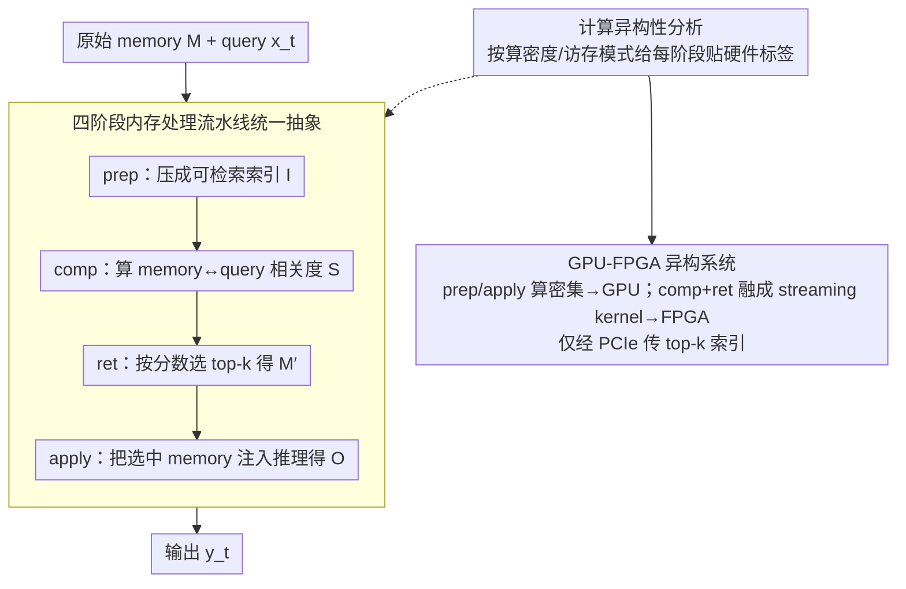

# Understand and Accelerate Memory Processing Pipeline for Large Language Model Inference

**会议**: ICML 2026  
**arXiv**: [2603.29002](https://arxiv.org/abs/2603.29002)  
**代码**: https://github.com/OswaldHe/HeteroLLM (有)  
**领域**: 信息检索 / LLM 推理加速 / 异构系统  
**关键词**: 长上下文, 稀疏注意力, RAG, 内存处理流水线, GPU-FPGA

## 一句话总结
本文把现代 LLM 长上下文推理中的稀疏注意力、RAG、压缩上下文记忆等优化统一为四阶段 "Prepare Memory → Compute Relevancy → Retrieval → Apply to Inference" 内存处理流水线，定量证明该流水线占整体延迟 22%-97% 且各阶段计算特性高度异构，并据此提出 GPU-FPGA 异构系统：把规则/算密集操作留 GPU、把稀疏/不规则/访存密集操作 offload 到 FPGA，在 MI210 + Alveo U55C 上取得最多 2.2× 端到端加速和 4.7× 能耗下降。

## 研究背景与动机

**领域现状**：现代 LLM 处理 128k-1M token 已是常态（GPT-OSS-120B 存 1M token 的 KV cache 要 69GB GPU 内存），各种长上下文优化方案纷至沓来：稀疏注意力（DeepSeek Attention、SeerAttention-R、LServe）、RAG（DRAGIN、FLARE、two-stage RAG）、压缩上下文记忆（Titans、HMT、MemAgent）、TTT（LaCT）等。

**现有痛点**：(1) 文献把这些方法当作彼此孤立的技术研究，缺乏统一抽象框架，导致系统优化无法跨方法复用；(2) 这些"内存优化"本身的计算开销究竟占多少端到端延迟、瓶颈在哪步，没有系统 profiling；(3) 各方法的访存模式、算密度、数据依赖差异巨大，但都被默认丢到 GPU 上跑，结果是 GPU 在规则稠密计算上被反复使用、在稀疏/不规则操作上严重欠利用。

**核心矛盾**：LLM 计算正在从"以矩阵乘为主"演化为"矩阵乘 + 稀疏/不规则/访存密集操作的混合"，但底层硬件（纯 GPU）仍按前者优化；这种"算法计算特性 ↔ 硬件结构"之间的失配越来越严重。

**本文目标**：(i) 用一个统一抽象把所有长上下文优化"看穿"成同一套 pipeline；(ii) 系统量化各阶段的延迟占比和算密度异构性；(iii) 设计 GPU-FPGA 异构系统验证"对症下药"的加速潜力。

**切入角度**：把 LLM 推理拆成"内存生成 $g(\cdot)$ + 内存处理 $f(\cdot,\cdot)$"两部分（Def 3.1），然后专注 $f$；把所有 $f$ 都强制写成四阶段流水线，让每阶段的输入输出 schema 完全一致，从而可以独立优化、独立映射到硬件。

**核心 idea**：用"四阶段统一 pipeline + 异构硬件按 stage 算密度映射"代替"每个优化方法独立的端到端 GPU 实现"，把"算法多样性"压缩到"四阶段配置组合"，再用 GPU/FPGA 各打各擅长的部分。

## 方法详解

### 整体框架
作者要解决的问题是：现代 LLM 长上下文推理里那些五花八门的"内存优化"（稀疏注意力、RAG、压缩上下文记忆等）各自为政、缺乏统一框架，且都默认丢到 GPU 上跑，导致算法计算特性和硬件结构严重失配。本文的转法分两步：先把 LLM 生成模型形式化为 $L(g, f, \{x_i\}_{i<t}, x_t)=y_t$，其中 $M_{<t}=g(\{x_i\}_{i<t})$ 是生成的 memory、$O_{<t}=f(M_{<t}, x_t)$ 是 memory processor 的中间输出，再把所有 long-context 优化统一 reframe 成对 $f$ 的实现，并强制 $f$ 走同一条四阶段流水线——$\text{prep}(M_{<t})=I_{<t}$（把原始 memory 压成可检索索引）、$\text{comp}(I_{<t}, x_t)=S$（算每条 memory 与 query 的相关度分数）、$\text{ret}(M_{<t}, S)=M'_{<t}$（按分数选 top-$k$ 或阈值）、$\text{apply}(M'_{<t}, x_t)=O_{<t}$（把选中 memory 注入推理）。在此抽象之上，作者搭了 AMD MI210 GPU + Alveo U55C FPGA + PCIe 的异构平台，按算密度把四阶段分别映射到 GPU 与 FPGA。

### 关键设计

**1. 四阶段内存处理流水线统一抽象：把算法多样性压成四阶段配置组合**

之前的文献把稀疏注意力、RAG、Titans/HMT、MemAgent、TTT 当作彼此孤立的技术，每个新方法都要从零写硬件加速。本文用上述四阶段 schema 把它们逐一拆解（Table 1）：DeepSeek Attention 的 prep 是 linear projection + RoPE、comp 是 multi-head 内积、ret 是 top-$k$、apply 是 fine-grain 稀疏注意力；MemAgent 跳过 comp，prep 是模型 decoding 生成文本摘要、apply 是模型 prefill；TTT 干脆没有 ret，prep 是反传、comp 是 loss 计算。同一套输入输出 schema 让 top-$k$、BM25 这类 kernel 在多个方法间复用，也让系统可以对不需要的阶段直接 bypass 而不产生开销——硬件层因此只需实现"一个 stage 库 + 跨 stage 调度"就能覆盖现有乃至未来的方法。

**2. 计算异构性分析：用算密度把每个阶段贴上"该去哪块硬件"的标签**

四阶段虽共享 schema，但计算特性天差地别，硬要全塞 GPU 必然欠利用。作者沿算密度（FLOPs/byte，决定 compute-bound 还是 memory-bound）和访存模式（规则 vs 不规则）两维做定量刻画（Table 2）：稀疏注意力里 prep（linear proj，10-100 FLOPs/byte，规则访存）和 apply（fine-grain sparse attention，10-100 FLOPs/byte，规则）是算密集；而 comp（skinny matrix-vector，1-10 FLOPs/byte）和 ret（top-$k$，约 1 FLOPs/byte，不规则且跨 memory 数据依赖）是访存密集。RAG 的 comp（BM25）尤其不规则——BM25 按非确定性顺序查 token frequency，top-$k$ 又要维护运行中最大值并伴随数据依赖的不规则 eviction。结论很 actionable：GPU 在规则稠密计算上吊打 FPGA，却在这类不规则 + 数据依赖的访存密集操作上把 peak HBM 带宽利用率压到 < 30%，而 FPGA 因可定制 microarchitecture 对它们天然有约 5× 的 SRAM 带宽优势，所以阶段必须分而治之。

**3. GPU-FPGA 异构系统 + streaming dataflow kernel：按算密度切 stage，让 PCIe 通信几乎隐形**

落到硬件，作者按三类部署形态把阶段分派下去：General Setup（稀疏注意力 + RAG）让 prep + apply 留在 GPU、把融合后的 comp + ret kernel offload 到 FPGA，只经 PCIe 传 top-$k$ 索引以最小化通信；Synthesized Memory（MemAgent）走 prefill-decode disaggregation，访存密集的 decoding 跑 FPGA、算密集的 prefilling 跑 GPU；Memory as Context（Titans/HMT）则把 memory embedding 全存 FPGA，retrieved memory 用类似 General Setup 的小通信量传回 GPU。FPGA 端的 kernel 用三级 SRAM 层级（BRAM 21.8 TB/s + URAM 10.4 TB/s + HBM 460 GB/s），按 token ID 把 key vector 优先写到更快的 BRAM、溢出到 URAM、再溢出到 HBM，并让内积引擎流水接 top-$k$ retriever 形成 streaming dataflow，从而把多 stage 融成单一 kernel、避开 GPU 多 kernel 的启动同步开销和不必要的 off-chip 访问。之所以用 PCIe 而非 NVLink/CXL 这种紧耦合互连，是为了用现成硬件证明 idea 的可推广性，而 U55C 片上 40MB BRAM+URAM 提供约 5× 于 GPU SRAM 的有效带宽，已足够把这条流水线喂饱。

### 实现细节
本文是纯推理系统工作，无训练损失。基准评估覆盖：DeepSeek Attention（vLLM + DeepSeek V3.2 Exp）、SeerAttention-R（Qwen3-8B + TileLang）、LServe（Llama 3.1-8B，HIPIFY 移植到 AMD）、RAG（Llama-2-7B 或 Llama 3.1-8B + Wikipedia dump）、Titans/HMT（HMT 开源实现替换为 linear projection）、MemAgent（Qwen2.5-7B）、LaCT/TTT。FPGA 用 Vitis HLS 2024.2 + Vivado 2024.2 实现，P2P DMA 模式。

## 实验关键数据

### 主实验

端到端 + 内存处理阶段加速（baseline 是同 GPU 单机）：

| 方法 | 内存处理加速 | 端到端加速 | 能耗节省 |
|------|--------------|------------|----------|
| DeepSeek Attention | 1.3-2.2× | 1.1-1.2× | 1.61× geomean |
| SeerAttention-R (Top-$k$) | 1.8-2.2× | up to 1.49× | 1.11× |
| SeerAttention-R (Threshold) | 2.6-4.9× | - | 1.14× |
| LServe | 1.2-5.6× | up to 1.49× | 1.43× |
| DRAGIN (RAG) | 5.2-7.7× | up to 2.2× | 1.10× |
| FLARE (RAG) | 5.1-6.6× | - | 1.14× |
| FS-RAG | 5.1-6.6× | - | 1.21× |
| Two-stage RAG | 1.1-2.1× | 1.47-1.84× | 1.07× |
| MemAgent | - | 1.8× | **4.66×** |
| Titans/HMT (Memory-as-Context) | 3.1-4.0× | 1.3-1.6× | 1.65× |

延迟占比 profiling（核心动机数据）：sparse attention 在 1M token 下 22%-81%、RAG 在 20M 文档下 40%-61%、MemAgent prep 阶段单步可占 **97%** 的延迟——证明 memory processing 远不是边角料而是主瓶颈。

### 消融实验

| 配置维度 | 关键现象 |
|----------|---------|
| Batch size 扫描（BS=1 → 32） | Sparse attention 加速从 1.07× 增至 1.32-1.83×（KV cache 不共享，batch 放大稀疏占比） |
| RAG batch 扫描 | DRAGIN 从 1.14× 增至 1.92×（BM25 不可共享，FPGA 优势放大） |
| Memory-as-Context batch 扫描 | 加速反降（1.48→1.15×），因为 linear proj 在大 batch 下 GPU 利用率更高 |
| MemAgent BS=8/32 | 加速降至 0.49/0.13×，系统动态退化为 GPU-only 兜底 |
| FPGA on-chip SRAM 命中率 | 比 GPU SRAM 高约 5× 有效带宽 |
| PCIe 通信开销 | 相对端到端约低 3 个数量级，几乎可忽略 |

### 关键发现
- **MemAgent 节能 4.66× 最为夸张**：因为 prefill-decode disaggregation 让 FPGA 跑访存密集的 decode、GPU 跑算密集的 prefill，正好踩在两边硬件的 sweet spot 上。
- **延迟占比不是单调随 sequence 增长**：two-stage RAG 在 500K 文档时 reranker 已饱和，所以延迟占比增速慢；sparse attention 在 4K 时仅 1-11% 但 1M 时跳到 22-81%，是典型的"长上下文才显出来的瓶颈"。
- **MemAgent 在 BS>4 时反而变慢**：揭示了 FPGA 在 dense decode 上的根本劣势（weight reuse 不如 GPU），系统层面通过 BS-aware 动态调度兜底。
- **U55C 比 GPU 老一代 + 便宜一半**仍能取得显著加速，说明效率收益主要来自硬件特性匹配而非工艺优势——换更新 FPGA（Versal V80）潜力更大。

## 亮点与洞察
- **"四阶段流水线"统一抽象的方法论价值**：把 8+ 种长上下文优化压缩为一个 schema，未来新算法只需说"我在第几阶段用了什么计算"就能直接挂上加速框架——这是 system-algorithm co-design 教科书级的范式。
- **算密度异构性这个 framing 非常 actionable**：直接给出"哪种操作该放哪个硬件"的清晰决策依据，不再是"FPGA 总比 GPU 强/弱"的笼统讨论。
- **PCIe 通信开销低 3 个数量级**：这个数据反直觉但极重要——它意味着大多数 GPU-FPGA 协作不必上 NVLink/CXL 这种紧耦合互连，PCIe 已足够，大幅降低部署门槛。
- **BS-aware 动态调度**：MemAgent 在大 batch 退化为 GPU-only 兜底，体现了"硬件加速不是 all-or-nothing"，这种 fallback 机制对生产系统至关重要。
- **DSA streaming dataflow + 三级 SRAM 层级**：把 key vector 按 token ID 优先写到更快的 BRAM、溢出到 URAM、再溢出到 HBM 的设计，是把硬件层级和算法访问模式（最近 token 更常访问）做匹配的优雅案例。

## 局限与展望
- 评估只在单 FPGA + 单 GPU 节点，多节点扩展性未验证；MoE / 张量并行场景下的内存处理 pipeline 形态可能完全不同。
- 当前需要为每种新算法手写 FPGA kernel（虽然有 kernel 库可复用），论文承认"任意新方法可能需要 custom kernel"，design automation 是 future work。
- TTT/LaCT 的算密集主导特性使其无法从 FPGA 受益，意味着 TTT 路线下该方案完全失效，方法适用边界需明确。
- 与 Groq、SambaNova 这种专用 LLM ASIC 的对比缺失，无法判断 GPU-FPGA 的性价比相对位置。
- 实验用 AMD MI210 而非 H100/H200，绝对性能数据可能对工业部署参考价值有限；附录虽提供 A100 估算但不是真机测试。

## 相关工作与启发
- **vs DeepSeek Attention 等单算法工作**：本文是元层次工作，提供让所有这些算法统一加速的框架，而不是再提一个新算法。
- **vs Yang 2024a prefill-decode disaggregation**：本文的 MemAgent 部署直接借鉴这个范式，进一步推广到 memory processing 视角。
- **vs FlashAttention 等 GPU kernel 优化**：FlashAttention 优化 attention 算子本身；本文优化 attention 周围的 memory 流水线，二者正交、可叠加。
- **vs vLLM / SGLang 等推理框架**：vLLM 优化调度，本文优化硬件映射；可以集成到 vLLM 中作为后端。
- **启发**：(a) 把"内存处理"提升为一等公民的视角可推广到 multi-modal LLM（vision token 处理同样有 prep/comp/ret/apply）和 agentic LLM（tool memory 也是同构流水线）；(b) 异构硬件按算密度切分的思路可指导未来 ASIC 设计——专门为 memory processing 这四阶段设计 dataflow 加速器。

## 评分
- 新颖性: ⭐⭐⭐⭐ 统一抽象 + 异构系统映射是新的 framing，但单点技术（FPGA RAG、稀疏注意力加速）有先例
- 实验充分度: ⭐⭐⭐⭐⭐ 8 种算法 × 多 batch 配置 × 端到端 + 内存处理双视角 + 能耗 + PCIe 通信开销，profiling 极详尽
- 写作质量: ⭐⭐⭐⭐ Three Claims 结构清晰，Table 1/2 把异构性和方法分类一目了然
- 价值: ⭐⭐⭐⭐⭐ 直接给社区一个 GitHub 仓库 + 一套思想框架，影响力会持续——未来 long-context LLM 加速绕不开这套抽象

<!-- RELATED:START -->

## 相关论文

- [\[ICLR 2026\] TokMem: One-Token Procedural Memory for Large Language Models](../../ICLR2026/information_retrieval/tokmem_one-token_procedural_memory_for_large_language_models.md)
- [\[ECCV 2024\] Towards Open-Ended Visual Recognition with Large Language Model](../../ECCV2024/information_retrieval/towards_open-ended_visual_recognition_with_large_language_models.md)
- [\[ICLR 2026\] Your Language Model Secretly Contains Personality Subnetworks](../../ICLR2026/information_retrieval/your_language_model_secretly_contains_personality_subnetworks.md)
- [\[ACL 2025\] SafeRAG: Benchmarking Security in Retrieval-Augmented Generation of Large Language Model](../../ACL2025/information_retrieval/saferag_benchmarking_security_in_retrieval-augmented_generation_of_large_languag.md)
- [\[ICML 2026\] Understanding LoRA as Knowledge Memory: An Empirical Analysis](understanding_lora_as_knowledge_memory_an_empirical_analysis.md)

<!-- RELATED:END -->
