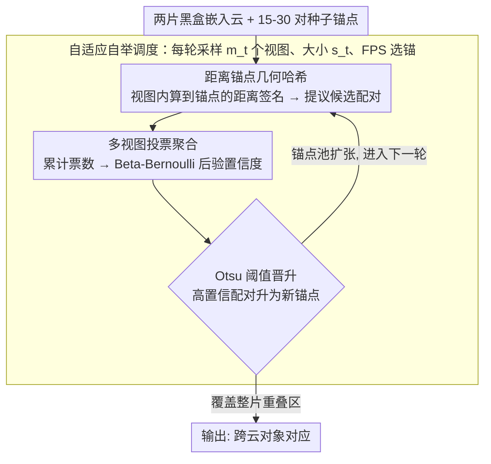

# 基于跨模型局部等距一致性的向量链接

**会议**: ICML 2026  
**arXiv**: [2605.31100](https://arxiv.org/abs/2605.31100)  
**代码**: https://github.com/DBgroup-Edinburgh/VecLinking  
**领域**: 信息检索 / 向量数据库 / 嵌入对齐  
**关键词**: 向量链接, 局部几何一致性, 嵌入对齐, 多视图哈希, 自举

## 一句话总结
论文提出向量链接问题——在黑盒约束下通过发现两个不同编码器产生的嵌入云之间的对象对应关系。核心观察是独立训练的对比学习编码器在短距离内保持局部等距一致（相似度保留 up to 缩放因子），基于此提出多视图几何哈希自举框架，只需 15-30 个种子对即可恢复 79-90% 的重叠对象。

## 研究背景与动机

**领域现状**：嵌入模型快速演进，实践中多系统采用不同微调编码器。现有向量索引虽包含相同对象但表示不可比，造成跨索引检索、去重、聚类困难。

**现有痛点**：传统嵌入对齐方法假设全局同构存在，依赖全局线性/OT 变换，但向量链接面临部分未知重叠——非重叠区域并非简单离群点而是结构化且可能很大。全局对齐在非重叠区域改善拟合会恶化重叠部分对应关系。

**核心矛盾**：黑盒约束（仅可访问静态向量，无模型参数/梯度/训练数据）+ 部分未知重叠，使单一全局变换不可靠。

**本文目标**：在黑盒约束下从微小种子集（15-30 对）恢复大规模向量对应关系。

**切入角度**：独立训练的对比编码器在短距离处保持强相关性（Pearson > 0.8），长距离快速退化。这提示本地邻域相比全局排列更稳定。

**核心 idea**：用"距离锚点的签名"代替原始距离——这种相对距离模式在本地邻域内跨模型保持相似性（up to 缩放），通过多视图投票聚合过滤模型特定扭曲。

## 方法详解

### 整体框架

GEH（几何嵌入哈希）要解决的是：两个黑盒编码器各自产出一片嵌入云，只给 15-30 对已知对应（种子锚点），如何把两片云里指向同一对象的向量配对起来。它把这个问题拆成一个迭代自举循环——每轮先从当前锚点池采样若干个"小视图"，每个视图把所有向量映射到一个由锚点定义的独立哈希空间并在其中提议候选配对；再跨视图聚合这些配对得到的证据，用后验置信度把最可靠的新对应晋升为锚点，喂回下一轮，逐步把种子集滚雪球式扩张到整片重叠区域。

### 关键设计

**1. 距离锚点几何哈希：用相对距离签名替代不可比的绝对坐标**

向量链接的根本障碍是两个独立训练的编码器坐标系不可比，绝对距离也带着各自的尺度扭曲，全局线性/OT 变换在部分重叠下会顾此失彼。GEH 的破局点是给每个向量打一个"到锚点的距离签名"：给定成对锚集 $\mathcal{A}=\{(a_1,a'_1),\ldots,(a_k,a'_k)\}$，向量 $u$ 的签名是它到所有锚点的距离向量 $\mathbf{r}_{\mathcal{A}}(u):=(\text{dist}(u,a_1),\ldots,\text{dist}(u,a_k))$，跨模型配对则用归一化后的无尺度相似度 $\text{sim}_{\mathcal{A}}(u,v):=\langle\widehat{\mathbf{r}}_{\mathcal{A}}(u),\widehat{\mathbf{r}}'_{\mathcal{A}}(v)\rangle$ 来衡量。这个签名之所以跨模型可比，靠的是论文的局部等距理论（定理 1）：两个局部最优对比编码器在短距离上保持比例不变，即 $\|f_1(x)-f_1(y)\|=\kappa\cdot\|f_2(x)-f_2(y)\|+\mathcal{O}(d_{\mathcal{M}}(x,y)^2)$，缩放因子 $\kappa=\sqrt{\lambda_1/\lambda_2}$。因为相似度做了归一化、对 $\kappa$ 不敏感，签名抓住的是本地邻域里"谁离谁更近"的相对几何，从而绕开了绝对距离和全局同构假设，天然适配部分未知重叠。

**2. 多视图投票聚合：靠统计稳定性而非阈值区分真链与噪声**

单个视图里的候选配对会被模型特有的扭曲污染，而局部一致性成立的距离阈值 $\delta_{\mathcal{M}}$ 又难以事先确定。GEH 不去调阈值，而是看一个配对能在多少个视图里被反复提议：候选对 $(u,v)$ 累计的支持票数为 $\nu_{(u,v),t}:=\sum_{r,k}Y_{r,k}(u,v)$。真实对应只要落在含有局部相关锚点的视图里就会被提议，因此票数集中（图 2 中位数约 48 票），而扭曲造成的伪碰撞缺乏一致支持、票数呈指数快速衰减。把票数喂进 Beta-Bernoulli 共轭后验 $\theta_{(u,v)}\mid\mathcal{Y}\sim\text{Beta}(1+\nu_{(u,v),t},\,1+N_{\leq t}-\nu_{(u,v),t})$，就能在无需任何人工阈值的情况下自动给每个配对学出一个置信度，让稳定胜出的真链浮出水面。

**3. 自适应自举调度：随锚点增长动态重采样以兼顾局部性与覆盖**

15 对种子既无法覆盖全局，单视图开太大又会因引入远距离锚点而破坏局部等距前提，所以视图大小和数量需要随自举进程动态调整。GEH 在第 $t$ 轮采样 $m_t:=\lceil m_0(1+c\log g_t)\rceil$ 个视图、每个大小 $s_t:=\lceil\rho_0|\mathcal{L}_{t-1}|/\text{sf}_t\rceil$：锚点池变大时增加视图数、同时缩小单个视图，既维持每个视图内的局部性、又靠视图数量补回全局覆盖。视图内的锚点由贪心最远点采样（FPS）选出以保证多样性，晋升锚点的阈值 $\tau_t$ 则用 Otsu 方法从票数分布里自适应切出，全程不依赖人工调参。

## 实验关键数据

### 主实验

| 模型对 | 数据集 | 精度/召回/F1 (%) | 第二名方法 | 改进 |
|--------|--------|----------|---------|------|
| Mistral-OpenAI | FiQA | **82.1/95.6/88.3** | Proc 52.5/11.8/19.3 | +68.9% F1 |
| GTE-OpenAI | ArguAna | **77.1/84.5/80.7** | Proc 30.8/4.8/8.4 | +71.8% F1 |
| Qwen-KaLM | FiQA | **79.8/79.9/79.8** | Proc 20.6/1.3/2.4 | +58.0% F1 |

（重叠 $\alpha=0.3$，种子 15 对）

### 消融（SciDocs, Mistral vs OpenAI, $\alpha=0.15$, 15 种子）

| 配置 | 精度(%) | 召回(%) | F1(%) | 说明 |
|------|---------|---------|--------|------|
| 完整 GEH | 62.1±1.1 | 81.7±0.7 | 70.5±0.6 | 基准 |
| w/o 核函数 | 61.0±8.3 | 52.9±35.0 | 51.0±33.3 | 远距离无权益不稳定 |
| w/o FPS 采样 | - | - | - | 随机采样下降 |
| w/o 后验聚合 | - | - | - | 固定阈值失败 |

### 关键发现
- 超低种子有效性——仅 15 对即达成与 30 对相当性能，所有基线需 30-50 对。
- 大规模可扩展性——FEVER（540 万文本）上精度 93.8% 召回 68.9%，端到端 3328 秒单 A100。
- 跨编码器鲁棒性——5 个模型对跨 6 数据集，无投票方差 > 33% 说明多视图投票是稳定性核心。

## 亮点与洞察
- **局部等距理论**：定理 1 严格证明对比编码器保持本地距离比例不变，打破"黑盒嵌入对齐必需全局同构"的假设。
- **多视图投票的统计设计**：Beta-Bernoulli 共轭无需调参，Otsu 自适应阈值，完全 data-driven。图 2 信号/噪音分离（中位数 48 vs 指数衰减）是核心洞察。
- **可迁移的哈希思想**：距离锚点签名不限嵌入可应用于任何向量集合体；多视图投票框架对任何有局部一致性的模型对都适用。

## 局限与展望
- 假设局限——本地正样本采样与等向性假设对强数据增强或特殊域可能不成立；二阶泰勒展开误差在高维可能不小。
- 参数敏感性——$s_t,m_0,c$ 等视图调度超参未充分分析。
- 改进：扩展理论至弱对比编码器；元学习自适应 $s_t$ 调度；离线-在线混合策略加速大规模部署。

## 相关工作与启发
- **vs 传统点集配准（RANSAC/ICP/几何哈希）**：后者针对 3D 刚体、低维空间；本文处理高维异方差模型扭曲与部分重叠。
- **vs 全局对齐（Procrustes/OT）**：本文局部即用，无需全局同构；多视图投票比全局拟合更抗部分重叠破坏。
- **启发**：对齐问题需要"问题特化"的几何观点而非通用优化。

## 评分
- 新颖性: ⭐⭐⭐⭐⭐  首次形式化向量链接问题；理论证明对比编码器的局部等距性；黑盒多视图自举框架无先例。
- 实验充分度: ⭐⭐⭐⭐⭐  6 BEIR × 5 模型对 × 9 配置 + 大规模 540 万规模 + 完整消融。
- 写作质量: ⭐⭐⭐⭐  理论清晰，实验全面；图表有力；局限讨论简略。
- 价值: ⭐⭐⭐⭐⭐  解决跨模型向量数据库集成的核心难题。

<!-- RELATED:START -->

## 相关论文

- [\[ICML 2026\] HGMem: Hypergraph-based Working Memory to Improve Multi-step RAG for Long-Context Complex Relational Modeling](hgmem_hypergraph-based_working_memory_to_improve_multi-step_rag_for_long-context.md)
- [\[ICML 2026\] ReSeek: A Self-Correcting Framework for Search Agents with Instructive Rewards](reseek_a_self-correcting_framework_for_search_agents_with_instructive_rewards.md)
- [\[ICML 2026\] Graph-R1: Towards Agentic GraphRAG Framework via End-to-end Reinforcement Learning](graph-r1_towards_agentic_graphrag_framework_via_end-to-end_reinforcement_learnin.md)
- [\[ICML 2026\] ParisKV: Fast and Drift-Robust KV-Cache Retrieval for Long-Context LLMs](pariskv_fast_and_drift-robust_kv-cache_retrieval_for_long-context_llms.md)
- [\[ICML 2026\] ML-Embed: Inclusive and Efficient Embeddings for a Multilingual World](ml-embed_inclusive_and_efficient_embeddings_for_a_multilingual_world.md)

<!-- RELATED:END -->
