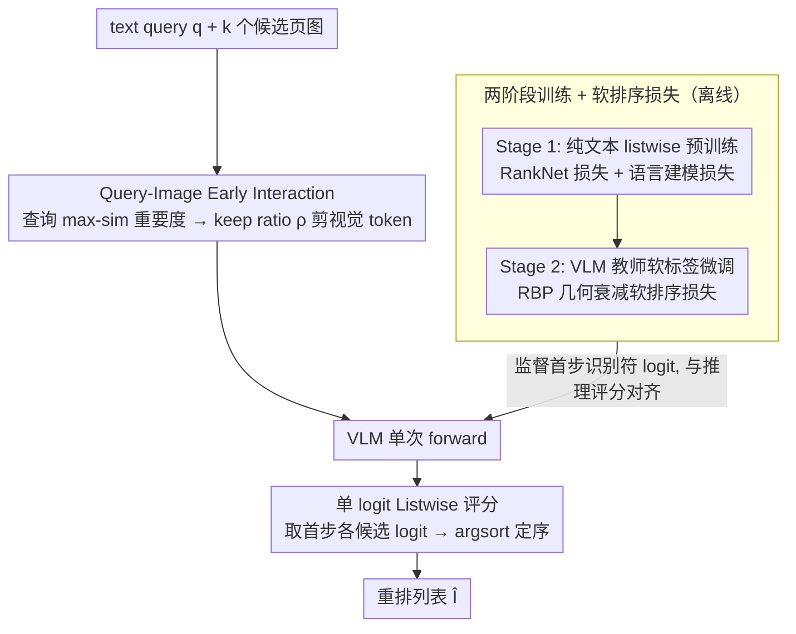

# Very Efficient Listwise Multimodal Reranking for Long Documents

**会议**: ICML 2026  
**arXiv**: [2605.11864](https://arxiv.org/abs/2605.11864)  
**代码**: <https://github.com/dukesun99/ZipRerank>  
**领域**: 信息检索 / 多模态 RAG / 高效推理  
**关键词**: listwise reranking、VLM、视觉 token 剪枝、单步解码、教师蒸馏

## 一句话总结
ZipRerank 同时砍掉 VLM 列表式重排的两大瓶颈——「视觉 token 序列过长」和「自回归解码逐 token 输出排名」——用 query-aware token 剪枝 + 单 logit 排序在 MMDocIR 上把 LLM 推理延迟降一个数量级，同时匹配或超越当前 SOTA 的 MM-R5。

## 研究背景与动机
**领域现状**：以视觉为中心的长文档检索（M-RAG、文档 VQA）通常采用「召回 + 重排」两阶段架构。第一阶段（DSE、ColPali 等）做大规模相似度检索；第二阶段重排器进一步精排 top-$k$ 候选页。Listwise 重排器一次处理所有候选，理论上比 pointwise 高效，最新 MM-R5 通过引入 CoT 推理在 MMDocIR 上拿到 SOTA。

**现有痛点**：MM-R5 这类方法的实用性被两个延迟瓶颈拖垮——(i) Prefill 长度爆炸：每个候选页是高分辨率图，每页贡献数百到上千视觉 token，$k=10$ 候选时输入序列轻松破万；(ii) 自回归解码：CoT + ranking 输出长度随 $k$ 线性增长，KV cache 也救不了序列依赖。结果是 MM-R5 一次重排要 3.82s，难以部署到实时 M-RAG。

**核心矛盾**：「准确率（需要长上下文 + 推理链）」与「延迟（必须缩短序列 + 单步出结果）」之间的张力。砍掉视觉 token 怕丢关键证据，砍掉 CoT 怕丢排序能力。

**本文目标**：(i) 用 latency decomposition 把延迟拆成 prefill 与 decode 两块并分别优化；(ii) 设计单步 listwise 评分机制消解自回归；(iii) 引入 query-aware 视觉剪枝消解 prefill 爆炸；(iv) 在弱监督（VQA 只有一个正例）下也能学会稳健 listwise 行为。

**切入角度**：作者注意到一个有意思的两阶段策略——可以先在大规模纯文本重排数据上学「通用 listwise 行为」，再用强 VLM 教师在多模态上软监督，把「先学排序 → 再学多模态」分离。同时观察到推理时其实根本不需要生成完整 ranking 序列，只需要 candidate 标识符（A、B、C…）的首步 logit 即可定序。

**核心 idea**：训练上「两阶段（纯文本 listwise 预训练 + VLM 教师软监督多模态微调）」，推理上「query-aware 视觉剪枝 + 单 logit 评分」，把列表式多模态重排压成单次 forward。

## 方法详解

### 整体框架
ZipRerank 要解决的是「VLM 列表式重排太慢」：输入 text query $\bm{q}$ 和第一阶段召回的 $k$ 个候选页图 $\bm{I}=(I_1,\dots,I_k)$，输出重排后的列表 $\hat{\bm{I}}=(I_{\pi(1)},\dots,I_{\pi(k)})$。它把慢的来源写成延迟模型 $F(n,u)\approx L(c_{\text{att}}dn^2+c_{\text{ffn}}d^2n)+uLdn\cdot c_{\text{dec}}$——prefill 随视觉 token 数 $n$ 平方增长、decode 随生成长度 $u$ 线性增长——然后逐项打击：推理端用 query-aware 剪枝压 $n$、用单 logit 评分把 $u$ 设为 1；训练端则分两阶段（纯文本 listwise 预训练 + VLM 教师软标签多模态微调）把排序能力灌进模型，让它在弱监督下也能给每个候选单 token 标识符（A、B、…）打出可比的分。

### 关键设计

**1. 两阶段训练 + 软排序损失：把「通用排序」和「视觉对齐」解耦学**

多模态文档检索数据天然只有一个正例（VQA 标注），直接做 hard listwise 监督容易过拟合教师噪声，于是作者把学习拆成两段。Stage 1 在纯文本重排语料（passage 渲染成 page-like 图）上做全监督预训练，用 RankNet 损失 $\mathcal{L}_{\text{ranknet}}=\sum_{r_i<r_j}w_{i,j}\log(1+\exp(s_j-s_i))$（权重 $w_{i,j}=1/(r_i+r_j)$）配合语言建模损失 $\mathcal{L}_{\text{LM}}$，先建立通用 listwise 能力。Stage 2 在 VQA 风格的多模态数据上借 GPT-5 当教师产生候选完整排序，但因为教师本身可能有噪声，这里不直接套 hard label，而是引入软排序损失 $\mathcal{L}_{\text{softrank}}=-\sum_i q_i\log p_i$，目标分布 $q_{\pi(k)}=\gamma^k/\sum_{\ell=0}^{m-1}\gamma^\ell$ 是基于 Rank-Biased Precision 的几何衰减（$\gamma\in(0,1)$ 控制对低排位的容忍度）。这个几何衰减目标既锚定真正例、又给 plausible 候选分配渐降权重，契合 RBP「用户从上往下浏览」的假设，对教师噪声鲁棒；两阶段都直接监督首步识别符 logit，与推理评分协议完全对齐。

**2. Query-Image Early Interaction：用查询语义先剪掉无关视觉 token**

长文档页面里大量 patch 是空白、装饰或与 query 无关的图表区域，喂给 LLM 在 attention 上白耗 $O(n^2)$ 算力，所以 ZipRerank 在图像 token 真正进 attention 前先用查询语义筛一遍。做法是先用 LLM 跑「prompt 前缀直到第一个图像 token」、抽出 query 对应的 $N_q$ 个 hidden state $\bm{H}_q\in\mathbb{R}^{N_q\times D}$，再对每张候选图 $i$ 的预计算视觉 token $\bm{V}_i$ 算 max-sim 重要度 $a_{i,j}=\max_{1\le t\le N_q}\cos(\bm{h}_t,\bm{v}_{i,j})$，按 keep ratio $\rho$ 取 top-$\mathrm{round}(\rho N_i)$ 得到剪枝后的 $\tilde{\bm{V}}_i$，从而把 prefill 复杂度从 $O(n^2)$ 砍到 $O((\rho n)^2)$。剪枝后保留原始 RoPE 位置编码，并通过 KV cache 复用前缀计算，使「抽 query hidden state」这一步几乎零额外开销。用 max-sim 而非 mean-pool，是为了保住「只要有一个 query token 高度相关」的少数关键 patch（如题图里的具体数字、关键短语）；附录的理论分析进一步证明：当被剪 token 在原 attention 里占的尾部质量 $\varepsilon$ 较小时，attention 输出的变化被 $O(\varepsilon)$ bound 住，剪枝是安全的。

**3. 单 logit Listwise 评分：一次 forward + argsort 取代自回归解码**

自回归 reranker 每生成一步都要重新 attend 长上下文，KV cache 也救不了步数随 $k$ 线性增长，decode 因此成为第二个延迟瓶颈。ZipRerank 把它压成单步：训练时让模型把目标 ranking 的首个 token 当作评分关键点，用 RankNet/Softrank 直接监督这一步对各候选识别符 token $t_i$ 的 logit $s_i$；推理时只跑一次模型拿到首步 logit 向量 $\bm{z}\in\mathbb{R}^{|\mathcal{V}|}$，按 $\pi=\mathrm{argsort}_{\downarrow}(z_{t_1},\dots,z_{t_k})$ 即可定序，彻底消掉 decode 延迟。这之所以够用，是因为 listwise 排序本质是相对偏好，单 logit 已经携带「该候选在所有候选中的相对位置」信息，只要训练目标对齐就行——Gangi Reddy 2024 等已在纯文本上验证该思路可行，本文首次把它扩展到 VLM listwise 重排。

### 损失函数 / 训练策略
两阶段的总损失分别是 Stage 1 的 $\mathcal{L}_{\text{stage1}}=\mathcal{L}_{\text{LM}}+\lambda_1\mathcal{L}_{\text{ranknet}}$ 和 Stage 2 的 $\mathcal{L}_{\text{stage2}}=\mathcal{L}_{\text{LM}}+\lambda_2\mathcal{L}_{\text{softrank}}$。推理时 $u=1$、$n$ 由 keep ratio $\rho$ 控制，因此可以通过调 $\rho$ 在精度与延迟之间做平滑权衡。

## 实验关键数据

### 主实验
在 MMDocIR 9 个领域的 page-level 检索任务上，以 DSE-wiki-ss 为第一阶段检索器，重排 top 候选，统计 Recall@1/3/5 与 LLM 时延（秒/查询）：

| 方法 | Macro R@3 | Micro R@3 | 时延 (s) |
|------|-----------|-----------|----------|
| DSE-wiki-ss (检索器) | 69.5 | 70.2 | – |
| UniME (Listwise) | 70.9 | 71.4 | 0.24 |
| LamRA (Listwise) | 77.6 | 77.8 | 0.53 |
| MM-R5 (CoT) | 79.1 | 79.0 | 3.82 |
| GPT-5-mini | 88.0 | 88.3 | 23.38 |
| **ZipRerank** | **84.8** | **84.5** | **0.36** |
| ZipRerank-50% (更激进剪枝) | 83.4 | 83.4 | 0.30 |

ZipRerank 全方位超越 MM-R5 同时延迟从 3.82s 砍到 0.36s（约 $10.6\times$ 加速），且在 R@3 上把与 GPT-5-mini 的差距从 ~9 个点压缩到 ~3.2 个点的同时延迟低 $65\times$。

### 消融实验

| 配置 | 关键指标 | 说明 |
|------|---------|------|
| Full ZipRerank | 最优 | 二阶段训练 + 软排序 + token 剪枝 + 单 logit 评分 |
| w/o Stage 1 文本预训练 | 显著掉点 | 缺乏通用 listwise 能力，多模态阶段难以从弱监督学排序 |
| w/o Soft-Ranking (用 hard label) | 掉点 | 教师噪声直接传染，过拟合次优排名 |
| w/o Query-Aware Pruning (使用全 token) | 时延飙升 ~3-5× | 精度仅微涨，证明被剪 token 多为冗余 |
| w/o Single-Token Decoding (自回归生成 ranking) | 时延翻倍 | 精度变化不大，单 logit 评分性价比极高 |
| 不同 keep ratio $\rho\in\{0.3,0.5,0.7,1.0\}$ | 平滑 trade-off | $\rho=0.5$ 在 MMDocIR 上 Pareto 最优 |

### 关键发现
- 单 logit 评分对精度几乎无害但对延迟收益巨大，说明 listwise 排序的有效信息确实可以浓缩在首步 logit 里；这与「reasoning chain 提供的是优化方向、最终排名其实是 1 token 决策」的直觉吻合。
- Query-aware token 剪枝是另一根主要省时杠杆，$\rho=0.5$ 几乎不掉点而 prefill 复杂度近乎砍四分之三；进一步降到 30% 才开始可见掉点，意味着 MMDocIR 页面图大约 50-70% 的视觉 token 是冗余信息。
- 软排序损失带来的鲁棒性增益最容易在小数据/教师噪声大的领域看出，证明「listwise 不一定是 hard rank，soft 监督更适合知识蒸馏场景」。
- 在 9 个领域里 ZipRerank 普遍比 MM-R5 高 5 个点左右，但在 News 领域较弱，可能与该领域候选高度相似（同主题不同 page）有关，提示未来可以做领域自适应剪枝阈值。

## 亮点与洞察
- 把延迟分解 $F(n,u)\approx L(c_{\text{att}}dn^2+c_{\text{ffn}}d^2n)+uLdn\cdot c_{\text{dec}}$ 写到 Section 3 当 motivation，是一篇罕见的把「为什么慢」用一行公式说清楚的工作。后续设计也是逐项打击：$n$ 用剪枝、$u$ 用单 logit，使「精度-延迟」trade-off 变成了两个可调超参（$\rho$ 与目标解码长度）。
- 「先文本后多模态」的两阶段训练 + 「教师软标签 + 几何衰减目标」组合，是在「弱多模态监督 + 强文本资源」的现实约束下学排序行为的优雅范式。RBP 启发的几何衰减目标对教师噪声鲁棒，可迁移到任何「教师只能给出粗粒度排序」的蒸馏场景。
- Max-sim 视觉剪枝可以解释为「smooth attention pooling 的紧上界」，作者给出了 $O(\varepsilon)$ 的 attention 输出扰动 bound，这种「带理论 sanity check 的工程优化」在 efficient VLM 文献里少见。

## 局限与展望
- 单 logit 评分天然受 token vocabulary 限制：当 $k$ 很大（候选数 > 字母表）时需要扩展 identifier 集，可能与 tokenizer 切词冲突；论文未讨论 $k>26$ 的情形。
- Query-aware 剪枝对「视觉细节稠密」的领域（如学术 figure、密文 PDF）潜在风险更高，作者主要在通用 MMDocIR 验证，缺乏领域自适应 $\rho$ 策略。
- Stage 2 依赖 GPT-5 教师生成 listwise 软标签，蒸馏成本与教师可得性都是工程门槛；当教师本身排序能力有限时，soft target 的「上限」就被锁死。
- 没有与最新的 hybrid retriever（如 multi-vector ColPali + token reduction）做端到端检索 + 重排的全栈对比，只测了重排环节延迟。
- 仅在 MMDocIR 一个 benchmark 评估，对真正长文档（百页级）、跨文档（M-RAG 多 doc 合并候选）场景未验证。

## 相关工作与启发
- **vs MM-R5 (Xu et al. 2025)**：MM-R5 用 CoT 推理拿 SOTA 但自回归 + 长上下文双瓶颈让延迟达 3.82s；ZipRerank 用单 logit + token 剪枝同时打掉两块，证明「reasoning chain 的好处可以通过 soft 监督蒸馏到首步 logit 里」，无需运行时维持 CoT。
- **vs FIRST / RankZephyr (Gangi Reddy 2024)**：纯文本 listwise 上单 logit 评分早有验证，ZipRerank 把它扩展到多模态，并补上视觉 token 剪枝这一多模态独有问题。
- **vs Light-ColPali / token reduction 工作**：他们优化的是第一阶段 retriever 的多向量检索；ZipRerank 互补地把第二阶段重排压下来，二者可叠加成更高效的全栈系统。
- **启发**：(i) 「延迟分解 → 逐项打击」的方法论可广泛迁移到任何 VLM 推理优化；(ii) 「教师软标签 + 几何衰减目标」是弱监督下蒸馏排序行为的通用模板；(iii) 「查询自感知的视觉 token 剪枝」可作为所有 query-conditioned VLM 任务（VQA、grounded captioning）的标准前处理。

## 评分
- 新颖性: ⭐⭐⭐⭐ 单 logit 评分 + max-sim 视觉剪枝单独看都不新，但把二者首次组合到多模态 listwise 重排，并配合两阶段教师蒸馏，构成清晰的系统性创新。
- 实验充分度: ⭐⭐⭐⭐ MMDocIR 9 个领域 × 3 个 Recall × 多种 baseline + token keep ratio sweep + 训练阶段消融，完整且方法对照充足，但只有一个 benchmark 略偏单点。
- 写作质量: ⭐⭐⭐⭐⭐ 用 latency decomposition 公式驱动 motivation，再分别在训练/推理章节回应，每个组件都有理论 sanity check（attention 扰动 bound），结构紧凑。
- 价值: ⭐⭐⭐⭐⭐ MMDocIR/M-RAG 场景延迟降一个数量级、精度不掉，直接可落地到生产 RAG 系统，开源代码进一步降低门槛。

<!-- RELATED:START -->

## 相关论文

- [\[NeurIPS 2025\] AcuRank: Uncertainty-Aware Adaptive Computation for Listwise Reranking](../../NeurIPS2025/information_retrieval/acurank_uncertainty-aware_adaptive_computation_for_listwise_reranking.md)
- [\[ICML 2026\] ML-Embed: Inclusive and Efficient Embeddings for a Multilingual World](ml-embed_inclusive_and_efficient_embeddings_for_a_multilingual_world.md)
- [\[ICML 2026\] LazyAttention: Efficient Retrieval-Augmented Generation with Deferred Positional Encoding](lazyattention_efficient_retrieval-augmented_generation_with_deferred_positional_.md)
- [\[ICML 2026\] ParisKV: Fast and Drift-Robust KV-Cache Retrieval for Long-Context LLMs](pariskv_fast_and_drift-robust_kv-cache_retrieval_for_long-context_llms.md)
- [\[ICML 2026\] CARE: Class-Adaptive Expert Consensus for Reliable Learning with Long-Tailed Noisy Labels](care_class-adaptive_expert_consensus_for_reliable_learning_with_long-tailed_nois.md)

<!-- RELATED:END -->
