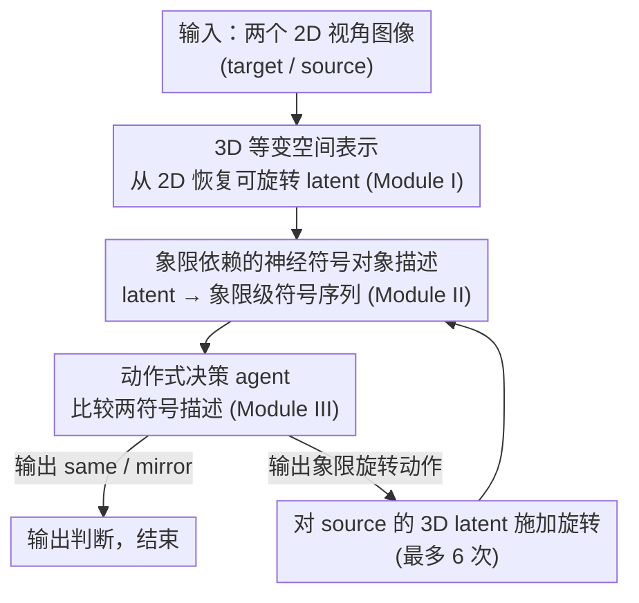

# A Deep Learning Model of Mental Rotation Informed by Interactive VR Experiments

**会议**: ICML 2026  
**arXiv**: [2512.13517](https://arxiv.org/abs/2512.13517)  
**代码**: https://github.com/rkhz/menrot  
**领域**: 机器人 / 空间推理 / 认知建模  
**关键词**: mental rotation、VR 交互、等变表示、神经符号模型、空间推理  

## 一句话总结
这篇论文用 VR 交互实验约束模型设计，提出一个由 3D 等变空间编码器、神经符号对象编码器和动作决策 MLP 组成的心理旋转模型，在准确率、动作次数和部分反应时趋势上复现了人类 mental rotation 行为。

## 研究背景与动机
**领域现状**：心理旋转是认知科学里研究空间表征的经典任务：给人看两个不同视角下的 3D Shepard-Metzler 积木形状，让人判断它们是同一个物体还是镜像物体。经典结果显示，人类反应时通常随角度差增大而线性增加，因此长期被解释为大脑在“心眼”里连续旋转某种内部表征。

**现有痛点**：现代视觉模型可以在很多 3D 任务上取得高准确率，但很少有模型同时解释“如何判断”和“为什么反应时、动作次数像人类”。只做分类的模型即使能答对，也可能走的是与人完全不同的捷径，无法作为 mental rotation 的机制模型。

**核心矛盾**：人类行为同时支持两种看似冲突的观点。一方面，反应时和神经/心理物理证据说明内部有可旋转的空间表征；另一方面，VR 实验中人类通常只做很少的离散大幅度动作，说明决策可能依赖抽象符号或象限级别的对象描述。

**本文目标**：作者希望构建一个神经网络式的、可运行的 mental rotation 机制模型，不仅要达到人类水平准确率，还要复现 VR 实验中观察到的动作模式和一部分反应时规律。

**切入角度**：论文先做新的 VR 实验，让参与者有时可以用摇杆旋转右侧物体，从而观察他们实际选择的旋转动作。实验发现人类通常只做约 1 次弹道式大动作，并把物体放到目标附近的象限范围后就判断，这直接启发了模型中的“象限依赖符号表征”假设。

**核心 idea**：用空间等变表示负责“可以旋转”，用符号对象描述负责“知道该怎么转和何时判断”，再用一个小决策 agent 在两者之间循环。

## 方法详解

### 整体框架
论文的方法由实验和模型两部分互相支撑。实验部分设计了 VR mental rotation 任务：19 名参与者在 VR 中看到两个由 10 个相邻立方体组成、包含 3 个转折的 Shepard-Metzler 形状，两个物体绕 Y 轴的相对角度为 $0^\circ,60^\circ,120^\circ,180^\circ$。No-Action 条件下参与者只能心理旋转；Action 条件下参与者可以用摇杆旋转右侧物体，但旋转时物体会消失，只显示角度环，避免他们直接靠连续视觉反馈对齐。

VR 行为给出两个关键观察。第一，人类在 Action 条件下平均只做 1.05 次旋转动作，每次动作平均约 $73.1^\circ$，说明他们不像按固定速度连续扫描整个角度空间。第二，最后一次动作后，右侧物体通常落在目标物体 $[-45^\circ,+45^\circ]$ 的范围内，之后很快做出判断，说明他们只需要粗对齐到某个象限即可。

模型部分据此堆叠三个模块。Module I 是 Equivariant Neural Renderer 风格的卷积自编码器，从单张 2D 图像恢复可被 3D 旋转矩阵操作的空间 latent。Module II 是 Vision Symbolic Model，用 ViT encoder 和 autoregressive Transformer decoder 把空间 latent 转成 Shepard-Metzler 形状的序列化符号描述。Module III 是 MLP 决策器，输入两个符号描述，输出“same / mirror”判断，或者输出需要采取的象限旋转动作。若输出动作，就把动作应用到 source 的 3D latent，再重新经过符号编码和决策，直到做出 match/mismatch 判断或超过 6 次动作上限。

### 关键设计

**1. 3D 等变空间表示：让内部对象"可以被旋转"**

心理旋转的前提是脑子里得有一个能被几何变换操作的对象表征，而不是直接对像素分类——后者很容易在训练物体上学到捷径、换个新形状就崩。Module I 借用 Equivariant Neural Renderer 的卷积自编码器：训练时输入同一物体两个不同姿态的图像对，把一个视角编码成 latent，再用一个 3D 旋转矩阵把 latent 变换到另一姿态、解码重建目标视角。为了让重建成立，latent 必须对 $SO(3)$ 旋转保持等变——旋转物体就对应 latent 里一个可预测的旋转操作。这样模型在推理时就能直接对内部 latent 施加 3D 旋转矩阵来“在脑中转动物体”，而且整个过程无需任何 3D 监督。

**2. 象限依赖的神经符号对象描述：把连续角度压成离散象限符号**

VR 实验显示人类并不追求精确角度对齐，而是把物体粗略放到相近“象限”就开始判断，这启发作者把 360° 视角划成 4 个象限。每个象限下，形状用从最靠近观察者的立方体出发的 9 个方向转移来描述（每个转移取上、下、前、后、左、右之一），于是同一物体在 4 个象限会得到 4 个结构化但彼此不同的符号序列。Module II（Vision Symbolic Model）用 ViT encoder + 自回归 Transformer decoder，学习从 Module I 的 3D latent 预测这种符号序列。这层离散、组合式的象限符号正好为后续动作选择提供抽象结构——比较与决策只需在象限层面进行，不必对齐到精确角度。

**3. 动作式决策 agent：在符号空间里决定“再转一下还是下结论”**

Module III 是个小 MLP，输入 target 和 source 两个符号描述（logits 拼接），输出五类之一：same、mirror、顺时针一象限、逆时针一象限、两象限。训练时它只学这种关系分类、不真的执行旋转；推理时一旦输出旋转动作，动作就作用到 source 的 3D latent 上，再经 Module II 重新符号编码、回到决策——这条递归回路最多走 6 步，直到给出 same/mirror。正是这个“少量离散动作 + 随时可下判断”的回环，让模型既保有“能在 latent 里旋转”的能力，又复现了人类只做约 1 次大动作就判断的行为，而不是用一个全不变分类器一步跳过整个 mental rotation 过程。

### 损失函数 / 训练策略
三个模块独立训练。Module I 在 50,000 对 Shepard-Metzler 图像上训练等变重建；Module II 冻结 EqNR encoder 后，用固定 $25^\circ$ elevation、变化 azimuth 的视角数据，把 3D latent 映射到符号序列，共使用 201,600 个 image-symbolic description pair；Module III 在 38,400 个 mental rotation 关系任务上训练 MLP，输出 same、mirror 或三类象限动作。测试阶段使用训练中未见过的 Shepard-Metzler 物体，并平衡 match/mismatch 与四种角度差。

## 实验关键数据

### 主实验

| 数据集 / 设置 | 指标 | 本文模型 | 人类 / 对照 | 结论 |
|--------|------|------|----------|------|
| VR No-Action | 总准确率 | 不适用 | 91.14% | 纯心理旋转时人类已能稳定完成任务 |
| VR Action | 总准确率 | 不适用 | 95.33% | 可操作物体时准确率略升，且暴露出动作策略 |
| Held-out Shepard-Metzler 测试集 | 总准确率 | 96.13% | 人类 Action 95.33% | 模型达到接近人类的整体表现 |
| Match / Mismatch 分项 | 准确率 | 96.39% / 95.87% | 人类 match 96.13%，mismatch 94.53% | 模型没有只偏向某一类判断 |
| 动作行为 | 平均动作模式 | $0^\circ$ 多为 0 次，其他角度多为 1 次 | 人类平均 1.05 次动作，单次动作均值 $73.1^\circ$ | 模型复现了“少量离散动作”的核心现象 |
| 反应时趋势 | 解释范围 | 可解释 $0^\circ$ 到 $120^\circ$ 的增长 | 人类 Action/No-Action 均有随角度增长趋势 | 模型不能充分解释 $120^\circ$ 与 $180^\circ$ 的 RT 差异 |

### 消融实验

| 配置 | 关键指标 | 说明 |
|------|---------|------|
| Siamese ResNet / ViT baseline | 测试物体约 50%，接近随机 | 训练物体上可接近完美，但新物体和 3D 深度旋转泛化失败 |
| w/o Module I 等变空间表征 | VSM 无法可靠编码对象符号描述 | 直接从 2D 像素预测符号序列不足以支撑任务 |
| w/o Module II 符号表征 | 保留 ViT encoder 时 90.71%；完整去掉 VSM 时 38.46%；只留 patch embedding 时 36.14% | 符号模块，尤其是结构化 encoder，对动作式解题很关键 |
| w/o actions，直接 same/mirror | 97.03% | 准确率高，但完全不能解释人类为什么要做旋转动作 |
| 1-layer MLP + actions | 96.05% | 小决策器仍能完成任务并保留人类式动作模式 |
| 1-layer MLP only same/mirror | 86.23% | 在低容量下，动作式分解比纯前馈不变分类更有计算优势 |

### 关键发现
- VR 实验强烈支持离散跳跃式策略：参与者不是持续观察旋转过程，而是快速做一两个大动作，把物体移动到大致同一象限后判断。
- 准确率不是充分证据。无动作的 MLP 分类器能达到 97.03%，但它绕开了人类式过程；因此本文更看重“准确率 + 动作模式 + 反应时趋势”的联合匹配。
- 等变空间表征和符号表征承担不同角色。前者让模型能对内部对象做几何变换，后者让模型能做组合式比较和动作选择，两者结合比单纯 CNN/ViT 分类更像 cognitive model。

## 亮点与洞察
- 论文最有意思的地方是用 VR 动作数据反过来约束模型结构。不是先搭一个深度模型再解释行为，而是先看人类实际怎么旋转，再把“少量大幅度动作”和“象限级符号描述”写进模型假设。
- 消融把“会做题”和“像人一样做题”分开了。直接分类器准确率甚至略高，但不能解释动作；这提醒我们在认知建模和 embodied AI 中，过程匹配往往比最终分类分数更重要。
- 这个混合架构对机器学习也有启发。很多视觉模型在姿态变化和空间推理上脆弱，本文说明显式等变 latent 与符号式关系读出可以作为一种结构先验，而不是完全依赖规模自发涌现。

## 局限与展望
- 模型只处理 Shepard-Metzler 形状和固定 Y 轴 in-depth 旋转，距离开放世界 3D 物体操作还有很大差距。
- Module I 的 latent 旋转使用显式 3D 旋转矩阵，论文没有给出完整的生物可实现机制；作为 cognitive model 还需要更细的神经解释。
- 模型对反应时只能部分解释，尤其无法解释 $120^\circ$ 与 $180^\circ$ 条件下人类 RT 的差异。
- 当前符号描述是研究者设计的，虽然可解释且有效，但人类是否真的使用同样的 cube-transition 编码仍是开放问题。
- VR 实验样本规模较小，19 人中还剔除了 4 名 atypical participant；未来需要更大样本和更多交互条件验证。

## 相关工作与启发
- **vs Shepard & Metzler 经典心理旋转实验**: 经典实验用反应时推断连续 mental rotation，本文加入 VR 操作，让动作轨迹成为新的过程证据，并据此支持离散+连续混合机制。
- **vs 纯 Siamese 视觉分类器**: Siamese ResNet/ViT 可以记住训练物体，但对未见 3D 物体接近随机；本文的等变空间 latent 更符合跨视角泛化需求。
- **vs 3D shape perception 模型**: 一些模型能预测人类相似性判断，但通常不产生 sequential action；本文显式建模动作选择，因此更适合作为 mental rotation 过程模型。
- **vs 空间 transformer / equivariant model**: 传统几何模型强调可变换表征，本文进一步加入符号描述和 agentic loop，把几何操作变成可解释的认知策略。

## 评分
- 新颖性: ⭐⭐⭐⭐☆ 用 VR 交互数据约束神经符号 mental rotation 模型，问题切入很新鲜。
- 实验充分度: ⭐⭐⭐⭐☆ 有人类实验、held-out 测试和系统消融；但任务族和参与者规模仍有限。
- 写作质量: ⭐⭐⭐⭐☆ 方法叙事清楚，实验现象与模型设计连接紧；部分附录细节较多，主文数字略分散。
- 价值: ⭐⭐⭐⭐☆ 对空间推理、认知建模和具身/机器人中的内部仿真都有启发，尤其适合推动“过程可解释”的模型评估。

<!-- RELATED:START -->

## 相关论文

- [\[ICML 2026\] Position: Zeroth-Order Optimization in Deep Learning Is Underexplored, Not Underpowered](position_zeroth-order_optimization_in_deep_learning_is_underexplored_not_underpo.md)
- [\[ICLR 2026\] PolySHAP: Extending KernelSHAP with Interaction-Informed Polynomial Regression](../../ICLR2026/interpretability/polyshap_extending_kernelshap_with_interaction-informed_polynomial_regression.md)
- [\[CVPR 2025\] Learning on Model Weights using Tree Experts](../../CVPR2025/interpretability/learning_on_model_weights_using_tree_experts.md)
- [\[ACL 2026\] Experiments or Outcomes? Probing Scientific Feasibility in Large Language Models](../../ACL2026/interpretability/experiments_or_outcomes_probing_scientific_feasibility_in_large_language_models.md)
- [\[NeurIPS 2025\] LLM World Models Are Mental: Output Layer Evidence of Brittle World Model Use in LLM Mechanical Reasoning](../../NeurIPS2025/interpretability/llm_world_models_are_mental_output_layer_evidence_of_brittle_world_model_use_in_.md)

<!-- RELATED:END -->
