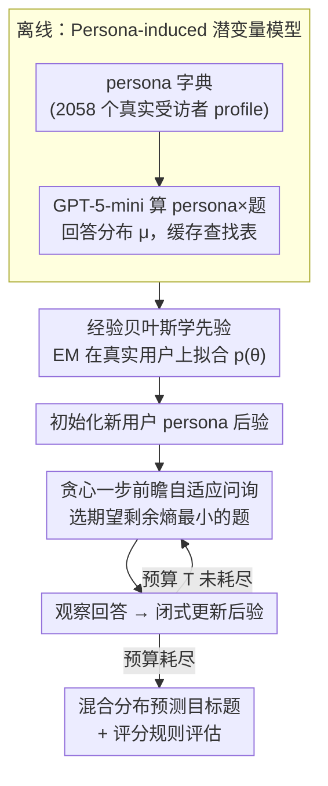

# Adaptive Querying with AI Persona Priors

**会议**: ICML 2026  
**arXiv**: [2605.00696](https://arxiv.org/abs/2605.00696)  
**代码**: https://github.com/yw3453/adaptive-query-ai-persona-priors (有)  
**领域**: 贝叶斯实验设计 / 自适应问询 / LLM 应用  
**关键词**: AI Persona, 贝叶斯自适应问询, 数字孪生, 自适应测验, 冷启动

## 一句话总结
作者把"LLM 在 persona 条件下产生的回答分布"打包成一个有限混合的贝叶斯先验，让用户在仅被问几道题的情况下，通过对 persona 后验做闭式更新来高效预测其他回答，性能上压过经典 CAT/IRT 基线。

## 研究背景与动机

**领域现状**：自适应问询（adaptive querying）是计算机化自适应测验 CAT、问卷调查、推荐冷启动等场景的核心工具。主流方案要么沿用 Item Response Theory（IRT/CAT），用低维潜在能力 trait 把题目-用户关系参数化；要么用神经贝叶斯实验设计（BED），在更灵活的模型上做摊销推断或变分近似。

**现有痛点**：IRT/CAT 的 trait 维度太低、对每道题都需要大规模历史标定数据，新题进入题库就要重新校准；神经 BED 灵活但要训练 surrogate / policy 网络，部署时仍要做嵌套蒙特卡洛积分，实时性差。在冷启动用户、冷启动题目场景下，两条路都不好用。

**核心矛盾**：表达力（捕捉高维异质回答模式）和可计算性（实时闭式后验更新）之间的 trade-off。要表达力就得搞复杂模型，要可计算就只能上低维参数模型。

**本文目标**：构造一个先验，使其同时具备 (1) 高表达力（捕捉真实用户回答的多样性），(2) 闭式后验更新，(3) 无需对题目做大量标定数据。

**切入角度**：LLM 在被注入 persona profile 后可以模拟特定群体的回答分布。如果用一个 persona dictionary 离线把每个 persona × 每道题的回答分布预算好，就可以把"用户属于哪个 persona"作为离散潜变量 $\theta \in \{1,\dots,n\}$，从而把生成模型还原成一个有限混合分布。

**核心 idea**：用 LLM-生成的 persona 回答分布作为有限混合先验的成分，再把贝叶斯自适应问询变成在离散潜变量上的闭式后验更新和一步前瞻 entropy 最小化。

## 方法详解

### 整体框架
要在用户只答几道题的冷启动条件下高效预测他剩下的回答，本文的解法是把"这个用户像谁"建成一个离散潜变量，再让 LLM 离线把每种"谁"的回答画像算好。具体分两阶段：离线阶段拿一个 persona 字典（本文用 Twin-2K-500 的 $n=2058$ 个真实美国受访者 profile），对每个 persona $\xi_\theta$ 和每道题 $x$ 用 GPT-5-mini 算出 $K$ 类回答分布 $\mu_{\theta,x}\in\Delta^{K-1}$ 缓存成查找表；在线阶段则对新用户维护一个 persona 后验，每次贪心选一道最能消除不确定性的题、观察回答、闭式更新后验，直到预算耗尽后用混合分布预测目标题。

### 关键设计

**1. Persona-induced 潜变量模型：把灵活先验和实时推断同时拿到**

传统 IRT/CAT 用连续低维能力 trait 参数化题目-用户关系，表达力受限且每道题都要大规模校准。本文换一个建模视角：把"用户属于哪个 persona"当成离散潜变量 $\theta\in\{1,\dots,n\}$，似然 $p(Y_x\mid\theta)=\mu_{\theta,x}$ 直接由 LLM 离线给出。在条件独立假设 $p(\theta,Y)=p(\theta)\prod_i p(Y_i\mid\theta)$ 下，因为 $\theta$ 离散、类别题似然是 categorical，后验 $p(\theta\mid Y_{I_t})\propto p(\theta)\prod_{i\in I_t}\mu_{\theta,i,Y_i}$ 是一个完全闭式的有限求和，目标题预测分布 $p(Y_x=k\mid Y_{I_t})=\sum_\theta\mu_{\theta,x,k}\,p(\theta\mid Y_{I_t})$ 同样只是对 persona 求和。这一步把"灵活先验"和"实时推断"在同一个模型里同时拿到——彻底绕开神经 BED 一直要解的嵌套蒙特卡洛与变分近似，而且每个 persona 还自带可解释的语义标签，便于下游做用户聚类。

**2. 贪心一步前瞻自适应问询：用结构换算力**

每一步要从可问题集中挑出最能压缩目标后验不确定性的题。本文以目标题集合的边际熵之和定义不确定性 $U(P_t)=\sum_{x'\in I^\star}H(Y_{x'}\mid h_t)$，对每个候选题 $x$ 计算问完它后的期望剩余不确定性 $\Delta_U(x\mid h_t)=\sum_k p(Y_x=k\mid Y_{I_t})\sum_{x'}H(Y_{x'}\mid h_t,Y_x=k)$，选最小的那道。经典 BED 之所以做不了一步前瞻，是因为预测分布要做高维积分、在大题库下根本算不动；而 persona 模型让 $p(Y_x\mid Y_{I_t})$ 和条件熵都退化成 persona 上的有限求和，于是这套本来只能停在玩具规模的贪心搜索真正变得可跑，是个典型的"结构选择即算力"。

**3. 经验贝叶斯学先验 + 评分规则评估：对抗 persona 失配**

合成 persona 字典对真实人群必然是 misspecified 的，均匀先验会让一堆无关 persona 稀释推断质量。本文在真实训练用户上对先验 $p(\theta)$ 做 EM 拟合：最大化边际似然 $\sum_j\log\sum_\theta p(\theta)\,p(Y^{(j)}\mid\theta)$，E 步算 responsibility $\gamma_{j,\theta}\propto p(\theta)p(Y^{(j)}\mid\theta)$，M 步把 $p(\theta)$ 更新成平均 responsibility。EM 会把概率质量集中到与训练人群最匹配的少数 persona 上，相当于"软地选出有用的 persona 子集"。评测端刻意选 proper scoring rule（log loss 对应 Shannon 熵、Brier 对应 Gini），使训练目标和评测指标在数学上严格对应，保证比较公平。

### 一个完整示例
对一个新用户，先把 persona 先验初始化为 EM 估出的 $p(\theta)$（覆盖 2058 个 persona）。第 1 步贪心遍历 86 道可问题，对每道候选用查找表 $\mu$ 算出期望剩余熵 $\Delta_U$，挑出最小者问出去；用户答了"3 档（同意）"，于是把所有 persona 权重乘上各自在该题第 3 档的概率 $\mu_{\theta,x,3}$ 再归一化，后验立刻向"倾向同意"的 persona 收缩。第 2 步在新后验下重新评估剩余题、再问、再更新——如此重复直到预算 $T$ 用尽。最后对 5 道目标题输出混合预测分布 $\sum_\theta\mu_{\theta,x,k}p(\theta\mid Y_{I_t})$，并按 log loss / Brier / 序数 MSE 评分。整个在线流程没有任何梯度，全靠闭式后验和查表求和。

### 训练策略
全流程没有梯度训练。学习只发生在两处：离线用 LLM prompt 提取 $\mu_{\theta,x}$，以及在真实用户上用 EM 估计先验 $p(\theta)$；在线问询完全基于闭式贝叶斯更新与贪心搜索。作为对照，CAT 基线（GRM/GPCM 及多维变体）按惯例先 EM 训练 item 参数，再用网格化后验推断。

## 实验关键数据

### 主实验
WorldValuesBench（91 题、88,459 用户、4 档 Likert）+ 100,000 合成用户，5 题作为预测目标，剩余 86 题作为可问询集，预算 $T \in \{5, 10, 20, 40, 86\}$。

| 设置 | 方法 | $T=5$ Log loss | $T=20$ Log loss | 备注 |
|------|------|----------------|-----------------|------|
| 合成用户（well-specified） | Greedy (persona) | 最佳 | 最佳 | 比 CAT 显著低；曲线接近 Full oracle |
| 合成用户 | Non-adaptive Bayesian Design | 次佳 | 次佳 | 用合成数据时 adaptive 优势明显 |
| 合成用户 | CAT/IRT 系列 | 明显落后 | 仍落后 | 模型结构性误设 |
| 真实 WVB | Greedy (persona, EM prior) | 最佳 | 与 non-adaptive 相当 | 小预算下 adaptive 占优 |
| 真实 WVB | Non-adaptive (persona) | 第二 | 可超越 greedy | 大预算下更稳健，受 misspecification 影响小 |
| 真实 WVB | CAT (GRM/GPCM/M-) | 落后 | 落后 | 即便给了 7 万训练用户 |

### 消融实验

| 配置 | 现象 | 解读 |
|------|------|------|
| Greedy + EM prior | 真实数据最优 | EM 先验有效缓解 persona 字典与真实人群的失配 |
| Greedy + Uniform prior | 与 EM 差距明显 | 没有任何训练数据时表现退化，但仍能与 CAT 持平 |
| Random / Random Fixed (persona 模型) | 中等 | 验证了"问询策略"和"persona 模型"两部分的独立贡献 |
| Full（问完所有 86 题） | 接近上界但非绝对最优 | 在 misspecified 设定下，更多观测不一定带来更好预测 |

### 关键发现
- 在 well-specified 合成数据上，persona 模型对 CAT 是结构性碾压：CAT 假设的低维 trait 与数据生成过程不符。
- 在真实 WVB 上，greedy 在小预算 ($T \le 10$) 上最有效，但当预算变大时，non-adaptive 设计反而能超过 greedy——这是 misspecified 模型下贪心过度自信、被早期错误推断带偏的典型现象。
- EM 拟合的 persona 先验把质量集中在很少几个 persona 上，相当于在 2058 个原始 persona 中"自动选子集"，这对真实人群推断至关重要。
- CAT 在被给了 70k 训练用户的有利条件下仍输 persona 法；当题目无校准数据时，CAT 直接没法用，persona 法只需要再 prompt 一次 LLM 即可纳入新题。

## 亮点与洞察
- 把"LLM 当模拟器"提升为"LLM 生成贝叶斯模型的成分"，这是一个很漂亮的视角转换：原本启发式的 persona simulation 变成了带 proper posterior 的概率推断。
- 离散潜变量 + categorical 似然让闭式后验是有限求和，绕开 BED 圈一直在解决的嵌套 MC 难题，是个被低估的"结构选择即算力"案例。
- 把"题库扩张时不需要重新训练 item 参数"作为系统级卖点，非常实用——这正是 LLM-prior 的天然优势，可以迁移到推荐冷启动、问诊、心理量表生成等场景。
- "greedy 在 misspecified 下被 non-adaptive 反超"的现象给了一个有用的工程提醒：adaptive 不是万能的，模型失配会让贪心变成噪声放大器。

## 局限与展望
- LLM 给出的 persona 回答分布质量直接决定先验质量；对于 LLM 不熟悉的领域（小语种、特定专业问卷），离线分布可能很糟糕。
- 当前只支持 categorical 题，连续 / 排序题需要扩展似然形式才行。
- 一步前瞻贪心在长预算下劣化；论文也提到可换 RL 多步规划，但没真正实现，留作 future work。
- persona 字典 fixed 是个潜在瓶颈：随着用户群体变化，字典需要不断更新或扩张，否则就算 EM 也救不了 misspecification。

## 相关工作与启发
- **vs 经典 CAT/IRT**：CAT 用连续低维 trait + 题目参数；本文用离散 persona + LLM-给的似然。前者要每道题大量校准数据，后者只要 prompt 一次。
- **vs 神经 BED（Foster et al. 2021, Ivanova et al. 2021）**：神经 BED 学摊销 surrogate / policy 网络，但失去精确后验；本文保留精确后验。
- **vs Collaborative Filtering**：CF 用相似度 / 矩阵分解处理已有评分；本文有显式生成模型、闭式贝叶斯更新、可主动选题，且不需要目标人群历史评分。
- **vs persona-based simulation (Argyle/Aher/Horton)**：他们把 LLM persona 当启发式模拟工具；本文把 persona 输出嵌入 Bayesian 模型，赋予贝叶斯推断的统计保证。

## 评分
- 新颖性: ⭐⭐⭐⭐ 用 persona 离散潜变量把 BED 推断变闭式的视角清晰且实用，但单独组件均已有先例。
- 实验充分度: ⭐⭐⭐⭐ 合成 + 真实两套实验、多种 baseline、多种 scoring rule 均覆盖，唯独题型局限在 4 类 Likert。
- 写作质量: ⭐⭐⭐⭐ 问题动机和数学推导都干净利落，Bayesian / scoring rule 之间的对应关系讲得很清楚。
- 价值: ⭐⭐⭐⭐ 对推荐冷启动、问卷、心理测量等领域有直接实用价值，尤其题库频繁更新场景非常受用。

<!-- RELATED:START -->

## 相关论文

- [\[ICML 2026\] LLMs Lean on Priors, Not Programming Language Semantics](llms_lean_on_priors_not_programming_language_semantics.md)
- [\[ICLR 2026\] AnveshanaAI: A Multimodal Platform for Adaptive AI/ML Education through Automated Question Generation and Interactive Assessment](../../ICLR2026/interpretability/anveshanaai_a_multimodal_platform_for_adaptive_aiml_education_through_automated_.md)
- [\[ICML 2026\] Prompt Optimization Is a Coin Flip: Diagnosing When It Helps in Compound AI Systems](prompt_optimization_is_a_coin_flip_diagnosing_when_it_helps_in_compound_ai_syste.md)
- [\[ICLR 2026\] PERSONA: Dynamic and Compositional Inference-Time Personality Control via Activation Vector Algebra](../../ICLR2026/interpretability/persona_dynamic_and_compositional_inference-time_personality_control_via_activat.md)
- [\[ICLR 2026\] Modal Logical Neural Networks for Financial AI](../../ICLR2026/interpretability/modal_logical_neural_networks_for_financial_ai.md)

<!-- RELATED:END -->
