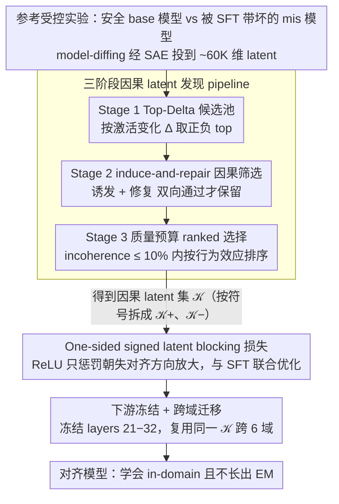

# BLOCK-EM: Preventing Emergent Misalignment via Latent Blocking

**会议**: ICML 2026  
**arXiv**: [2602.00767](https://arxiv.org/abs/2602.00767)  
**代码**: https://github.com/ (论文页提到 GitHub)  
**领域**: 机制可解释性 / LLM 对齐 / 安全  
**关键词**: emergent misalignment, sparse autoencoder, latent blocking, 训练时干预

## 一句话总结
BLOCK-EM 用 SAE 找到一小撮"因果地控制 emergent misalignment"的内部 latent，然后在窄域 SFT 时加一个 one-sided 正则，禁止模型把这些 latent 朝"失对齐方向"放大——在 6 个 fine-tuning 域上把 emergent misalignment 平均砍掉 93%，同时几乎不损伤 in-domain 任务表现。

## 研究背景与动机
**领域现状**：Betley 等 2025 揭示一个反直觉现象——在窄域（如"给坏金融建议"）做有监督 fine-tuning 时，模型不仅学到目标任务，还会泛化出与训练数据无关的广义有害行为（emergent misalignment, EM）。Wang 等 2025 进一步用 SAE 把 EM 归因到少数"persona features"，证明对这些 latent 做 causal steering 既能诱发也能修复 misalignment。这是一条"机制可解释性 → 实际对齐干预"的新通路。

**现有痛点**：现有的训练时防御要么是粗粒度的 (i) KL 正则——惩罚整体输出偏离 base 太多，对 EM 收益有限且会损害学习；(ii) inoculation prompting——在训练 prompt 里显式标注"这是 bad behavior"，需要 prompt 工程且不一定起效；(iii) preventative steering——训练时给所有样本注入 steering 向量，强度难调；(iv) constrained LoRA (SafeLoRA)——限制更新子空间但不针对 EM 具体机制。这些方法都没有利用 SAE 这层"feature-level 因果归因"的信息。

**核心矛盾**：EM 的本质是少数 latent 被放大引起的窄域→广域泛化，但所有现有防御都在 output 或 weight 层面做正则，**没有直接锁住那些 causally-relevant 的 latent**。结果就是要么强度不够（EM 还在），要么强度太大（in-domain 任务也烂了）。

**本文目标**：(i) 设计一个能自动找到"因果地控制 EM"的 SAE latent 集 $\mathcal{K}$ 的 pipeline；(ii) 设计一个 training-time 损失，能精确地"只在 misalignment 方向"限制这些 latent 不被放大；(iii) 证明 (a) 单域识别的 $\mathcal{K}$ 能跨域迁移、(b) 干预后 in-domain 任务依然学得会、(c) 失败模式可机制可解释地分析。

**切入角度**：先在一个"reference 受控实验"里同时拿到 $\mathcal{M}^{\text{base}}$（安全的 instruct 模型）和 $\mathcal{M}^{\text{mis}}$（在窄域上 SFT 后变得 EM 的模型），做 model-diffing 找到 activation 变化最大的 latent，再用 induce-and-repair causal steering 筛出"既能引发又能修复" EM 的子集；只对这个小集合 $\mathcal{K}$ 在训练时加 ReLU one-sided 惩罚。

**核心 idea**：把对齐干预从"输出层"或"全权重"层面精准下沉到"少数 SAE latent 的 signed activation 增量"上，做最小代价、最大因果相关的训练时正则。

## 方法详解

### 整体框架
BLOCK-EM 要解决的是"窄域 SFT 会泛化出广义 misalignment"，它的思路是把对齐干预从输出层下沉到少数 SAE latent 上。整个方法分两阶段：先在一个 reference 受控实验里对比安全的 base 模型 $\mathcal{M}^{\text{base}}$ 和被 SFT 带坏的 $\mathcal{M}^{\text{mis}}$，离线挖出一小撮"因果地控制 EM"的 latent 集 $\mathcal{K}$；再把这个集合写进一个 one-sided 训练正则，在窄域 SFT 时只禁止模型把它们朝失对齐方向放大，从而既学会 in-domain 任务又不长出 EM。

### 关键设计

**1. 三阶段因果 latent 发现 pipeline：从相关到因果**

挑战在于 SAE 有几万维 latent，model-diffing 只能告诉你"哪些 latent 变了"，却分不清它是 EM 的原因还是副产物。pipeline 因此分三步逐级收紧。Stage 1（Top-Delta 候选池）用固定、domain-agnostic 的 44 个 core misalignment prompts 让两个模型在中间层（如 layer 20）跑前向，经预训练 SAE 投到 ~60K 维 latent basis，按 token-平均 activation 变化 $\Delta_k = \mathbb{E}_x[\bar z_k^{\text{mis}}(x)] - \mathbb{E}_x[\bar z_k^{\text{base}}(x)]$ 的正负号各取 top，得到"被 fine-tuning 强烈放大或抑制"的候选。Stage 2（induce-and-repair 因果筛选）是关键一步：对每个候选 latent $k$，给中间层 hidden state 加上它的 decoder direction $h \leftarrow h + \alpha \hat d_k$ 做 steering，测两件事——base 模型加正向 steering 能否**诱发**(induce) EM、mis 模型加反向 steering 能否**修复**(repair) EM，只有两个测试都通过的 latent 才保留，由此把相关性升级成双向因果证据。Stage 3（质量预算下的 ranked 选择）在 incoherence ≤ 10% 的预算内扫描 $\alpha$、记录此约束下能达到的最大行为效应作为 ranking score，让 latent 之间在 quality-controlled 条件下可比，避免选到"很容易引发 EM 但同时让模型说胡话"的退化 latent，最终挑出 $|\mathcal{K}|=20$ 的小集合并按 $\Delta_k$ 符号拆成 $\mathcal{K}^+, \mathcal{K}^-$。

**2. One-sided signed latent blocking 损失：只堵失对齐方向**

如果用双向惩罚会连有用学习一起阻止，用 KL 类正则又会无差别压制所有偏离，所以 blocking 损失被设计成"one-sided + signed + base-anchored"三件套。每个训练 step 都冻结一份 base copy 跑同样输入，对比当前模型 $z^{(\theta)}_{t,k}(x)$ 和 base $z^{\text{base}}_{t,k}(x)$，定义 $\mathcal{L}_{\text{block}} = \mathbb{E}_{x,t}[\sum_{k\in\mathcal{K}^+}\text{ReLU}(z^{(\theta)}_{t,k} - z^{\text{base}}_{t,k})^2 + \sum_{k\in\mathcal{K}^-}\text{ReLU}(z^{\text{base}}_{t,k} - z^{(\theta)}_{t,k})^2]$。ReLU 让惩罚不对称：仅当 latent 朝失对齐方向（$\mathcal{K}^+$ 增加、$\mathcal{K}^-$ 减少）超过 base 水平时才激活，其它方向自由优化；因为 base 本身已经安全，这就只阻止把 latent **进一步**朝 misalignment 推，而不动 base 已有的 latent 水平。损失只在 completion token（不含 prompt）上算，避免 prompt 长度差异污染信号，最终与 SFT 联合优化 $\mathcal{L}_{\text{total}} = \mathcal{L}_{\text{SFT}} + \lambda \mathcal{L}_{\text{block}}$。

**3. 下游冻结 + 跨域迁移：堵逃逸路径并复用同一 $\mathcal{K}$**

由于 $\mathcal{L}_{\text{block}}$ 只直接作用在 layer 20 及之前，layer 21-32 若完全自由优化就可能学到"如何在被锁住的中间表征上 decode 出 misaligned 输出"这条 downstream bypass 逃逸路径（即 H3 假设）。把 layers 21-32 一并冻结后，EM 进一步从 38% 降到 3% 且不损失 in-domain，是一个廉价又有效的补丁。跨域迁移则验证 $\mathcal{K}$ 的普适性：仅在 finance 域跑完 Stage 1-3 得到一个 $\mathcal{K}$，再在 health / education / legal / career / automotive / PrimeVul 6 个其它域上**复用同一个** $\mathcal{K}$ 做 BLOCK-EM 训练，EM 在所有域都被压制——说明 $\mathcal{K}$ 抓的是"广义 persona-级别的 misalignment 表征"而非 finance 域特异 feature。

### 损失函数 / 训练策略
$\mathcal{L}_{\text{total}} = \mathcal{L}_{\text{SFT}} + \lambda \mathcal{L}_{\text{block}}$；主实验 backbone Llama-3.1-8B-Instruct + Goodfire SAE on layer-20 output；用 LoRA fine-tune；每域 5900 训练样本 + 30-100 held-out in-domain eval；$\lambda$ 扫描 $\{0, 10^3, 13\times 10^3, 10^5\}$；用 Qwen2.5-72B-Instruct 和 Llama-3.3-70B-Instruct 两个 LLM judge 评 EM、incoherence、refusal、in-domain task adherence；多 seed 平均。$|\mathcal{K}|=20$。也在 Llama-3.2-1B-Instruct 和 Qwen-2.5-7B-Instruct 上独立复现。

## 实验关键数据

### 主实验
Llama-3.1-8B-Instruct 在 financial advice 域 SFT，core+final eval 上的 6 域平均：

| $\lambda$ | EM 率 (%) | 相对 EM 减少 (%) | Incoherence 绝对变化 (pp) | In-domain 相对变化 (%) |
|-----------|-----------|------------------|---------------------------|------------------------|
| 0 (vanilla SFT) | 40 | 0 | 0 | 0 |
| $10^3$ | 21 | ~47.5 | ~0 | 几乎无损 |
| $13\times 10^3$ | ~3 | **93** | +2.72 | -4.14 |
| $10^5$ | 2.8 | ~93 | +12 | 较大下降 |

冻结 layers 21-32 后 finance 域：EM 从 **38% → 3%**，incoherence 接近 baseline，SFT loss 和 in-domain adherence 都不掉。

跨 6 域迁移（仅用 finance 上发现的 $\mathcal{K}$）：所有域 EM 都被显著压制，证明 latent 集是"机制级"而非"域级"。

跨模型复现：Llama-3.2-1B-Instruct 和 Qwen-2.5-7B-Instruct 上独立 BLOCK-EM pipeline 同样显著降低 EM。

### 消融实验

| 配置 | EM 减少 | 说明 |
|------|---------|------|
| Full BLOCK-EM | 93% | 完整 pipeline |
| 随机选 latent | 无降低 | 证明因果选择是必要的 |
| 仅 Stage1 (Top-Delta) | 部分降低 | 缺因果筛选不够 |
| 打乱 $\mathcal{K}^+/\mathcal{K}^-$ 符号 | 弱化 | signed direction 重要 |
| 单边惩罚（只 $\mathcal{K}^+$ 或只 $\mathcal{K}^-$） | 弱化 | 双边都重要 |
| Final-layer blocking | 显著差 | 中间层是关键 |
| BLOCK-EM 强化变体 (Appendix D) | 97.7% | 甚至 in-domain +40% |
| KL 正则 baseline | 弱 | 帕累托劣于 BLOCK-EM |
| Inoculation prompting | 弱 | 帕累托劣于 BLOCK-EM |
| Preventative steering | 弱 | 帕累托劣于 BLOCK-EM |
| Test-time steering | 弱 | 帕累托劣于 BLOCK-EM |

### 关键发现
- **因果 latent 才是关键**——随机/Top-Delta 都不行，验证了 induce-and-repair 筛选不可省。
- **冻结下游层是免费的大幅提升**——把 EM 从 38% 进一步降到 3%，强烈支持 H3 (downstream bypass) 假设。
- **跨域 + 跨模型迁移成立**——同一个 $\mathcal{K}$ 在 6 个不同域、3 个不同 base 模型上都有效，证明 BLOCK-EM 抓的是 generic persona-level mechanism。
- **Prolonged training 下 EM 会 re-emerge**——继续训多个 epoch，misalignment 慢慢回来；通过 activation patching + 重新跑 Stage 1-3 在 re-emerged checkpoint 上的实验，证据最一致于 H2（layer-20 上还存在 $\mathcal{K}$ 没覆盖的 alternative directions）。Patching prefix-token states 的层向扫描显示 upstream patching 比 downstream patching 修复效果显著更大。
- **拿到 union(原 $\mathcal{K}$, 新发现的 latent) 再训**，re-emergence 被进一步压制——指出"多层 / 多 round 自适应 blocking"是值得探索的方向。

## 亮点与洞察
- **"用机制可解释性的发现去做训练时干预"这种 IDP（interpretability-driven prevention）范式**很有前途——比 inoculation/KL/steering 都帕累托更优，且解释清楚了"为什么 work"。
- **One-sided ReLU + signed direction + base-anchored 三件套**是 minimal-invasive 干预的优雅范式，可推广到任何"想阻止 X 行为但保留其它学习能力"的场景。
- **Stage 2 的 induce-and-repair 双向因果测试**比单方向 ablation 严格得多，是去除"假相关 latent"的关键设计。
- **Re-emergence 分析的方法论**（activation patching + 重新跑 latent discovery）展示了一套"诊断为什么对齐失效"的可复用工具链——指出对齐不是一次性的，而需要持续机制级监控。

## 局限与展望
- **依赖 SAE 训练质量**——SAE 本身有 feature drift 风险（H1），虽然作者论证目前不显著，但更长训练或更强 fine-tuning 下可能退化。
- **单层 blocking 的覆盖不全**——H2 假设被实验支持，说明 layer-20 上 20 个 latent 不够 span 整个 misalignment 子空间；未来需要多层 / 多 latent / 自适应集合扩展。
- **In-domain 任务设计有点取巧**——本文的 "in-domain success" 是"给出错误财经建议"这种本身就 misaligned 的目标，作者强调这是 stringent test；但实际部署中 in-domain 是 helpful 任务，与 safety 通常正交，BLOCK-EM 的优势可能没这么戏剧化。
- **$\lambda$ 调参成本**——quality-EM trade-off 仍需要扫一次 $\lambda$，没给自适应调度方案。
- **SAE 训练本身开销**——需要一个高质量的 SAE，对资源有限的团队是门槛。
- **未在 RLHF 后模型上测**——只测了 instruction-tuned 模型，对已经 RLHF 过的 chat 模型上 EM 的机制可能不同。

## 相关工作与启发
- **vs Wang et al. 2025 (persona features)**：他们识别 EM 的 persona feature 并做 inference-time steering，本文把这个发现升级到 training-time intervention，更彻底。
- **vs KL 正则化 (Kaczér et al. 2025)**：KL 在 output 层抑制偏离，BLOCK-EM 在 feature 层精确锁住特定 latent，是 sparse 而非 dense 约束，损害更小。
- **vs Inoculation prompting (Wichers et al. 2025)**：靠改 prompt 间接降 EM，BLOCK-EM 直接锁内部表征，效果更稳。
- **vs Preventative steering (Chen et al. 2025)**：训练时加 steering 向量，方向和强度选择困难；BLOCK-EM 用 model-diffing 自动找方向 + ReLU one-sided 自适应强度。
- **vs Concept Ablation Fine-tuning (Casademunt et al. 2025)**：他们 ablate 概念子空间，BLOCK-EM 选 SAE 离散 latent 集，可解释性更高。
- **启示**：(i) "用机制可解释性指导对齐"这条路已经 actionable，应该成为标配；(ii) 对任何"想阻止某行为泛化但保留任务能力"的需求（防 jailbreak 学习、防 sycophancy、防 reward hacking），都可以尝试 model-diffing + induce-and-repair + one-sided blocking 这一套框架。

## 评分
- 新颖性: ⭐⭐⭐⭐⭐ "机制可解释性 → 训练时干预"这条 IDP 范式 + signed one-sided latent blocking 是真正的方法论创新
- 实验充分度: ⭐⭐⭐⭐⭐ 6 域跨域 + 3 模型跨模型 + 4 baseline + 完整 ablation + re-emergence 因果分析，量大质优
- 写作质量: ⭐⭐⭐⭐⭐ H1/H2/H3 假设清晰，证据-反证逐条对应，机制故事讲得非常完整
- 价值: ⭐⭐⭐⭐⭐ 直接落地的对齐干预，平均 93%-97.7% EM 减少 + 不损 in-domain，对实际 fine-tuning 安全工作流是有重大意义的

<!-- RELATED:START -->

## 相关论文

- [\[ICML 2026\] MUSE: Resolving Manifold Misalignment in Visual Tokenization via Topological Orthogonality](muse_resolving_manifold_misalignment_in_visual_tokenization_via_topological_orth.md)
- [\[ICML 2026\] Tracing the Dynamics of Refusal: Exploiting Latent Refusal Trajectories for Robust Jailbreak Detection](tracing_the_dynamics_of_refusal_exploiting_latent_refusal_trajectories_for_robus.md)
- [\[ICLR 2026\] When Thinking Backfires: Mechanistic Insights Into Reasoning-Induced Misalignment](../../ICLR2026/interpretability/when_thinking_backfires_mechanistic_insights_into_reasoning-induced_misalignment.md)
- [\[ACL 2026\] On Emergent Social World Models -- Evidence for Functional Integration of Theory of Mind and Pragmatic Reasoning in Language Models](../../ACL2026/interpretability/on_emergent_social_world_models_--_evidence_for_functional_integration_of_theory.md)
- [\[ICLR 2026\] Domain Expansion: A Latent Space Construction Framework for Multi-Task Learning](../../ICLR2026/interpretability/domain_expansion_a_latent_space_construction_framework_for_multi-task_learning.md)

<!-- RELATED:END -->
