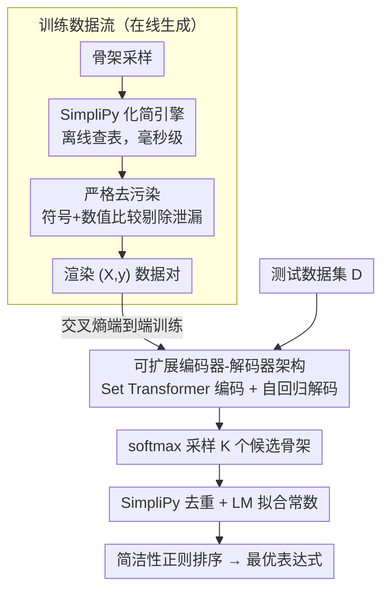

# Breaking the Simplification Bottleneck in Amortized Neural Symbolic Regression

**会议**: ICML 2026  
**arXiv**: [2602.08885](https://arxiv.org/abs/2602.08885)  
**代码**: https://github.com/psaegert/flash-ansr  
**领域**: 可解释性  
**关键词**: 符号回归, 表达式化简, Transformer, 摊销推理, 科学发现  

## 一句话总结

提出 SimpliPy（基于规则的化简引擎，比 SymPy 快 100 倍）和 Flash-ANSR（基于 Transformer 的摊销符号回归框架），在 FastSRB 基准上以 ~58% 的恢复率匹敌甚至超越遗传编程方法 PySR，同时随推理预算增加生成更简洁的表达式。

## 研究背景与动机

**领域现状**：符号回归（Symbolic Regression, SR）旨在从观测数据中发现可解释的解析表达式。传统方法以遗传编程（GP）为主（如 PySR），但每个数据集都从头搜索，无法在任务间迁移结构知识。摊销 SR 通过在海量合成数据上预训练 Transformer 来学习后验 $p(\bm{\tau}|\mathcal{D})$，将计算负担转移到一次性预训练阶段。

**现有痛点**：摊销 SR 面临三重困境。第一，静态语料方案（如 NeSymReS）使用 SymPy 离线化简生成固定数据集（~100M 表达式），但高昂的化简成本限制了覆盖度和维度（$D \leq 3$）。第二，部分方法（如 E2E）放弃化简直接在未规范化表达式上训练，导致模型浪费容量学习语法冗余（$x+0$, $1 \cdot x$ 等）。第三，将 SymPy 嵌入训练循环的方法（如 NSRwH）引入严重的计算瓶颈，SymPy 的中位化简时间约 100ms/表达式。

**核心矛盾**：表达式化简的质量与速度之间存在根本矛盾——通用 CAS 系统的面向对象解析和树遍历机制对 SR 训练场景来说过于重量级，但不化简又导致训练目标冗余和推理效率低下。

**本文目标**：设计一个快速且高质量的化简引擎，打破 CAS 瓶颈，使摊销 SR 能扩展到更大规模、更高维度的训练。

**切入角度**：作者观察到 SR 训练中遇到的表达式具有有限的结构复杂度，因此可以将化简本身也"摊销化"——离线穷举发现所有短模式的等价规则，运行时仅做快速查表匹配。

**核心 idea**：用预计算的哈希索引规则集替代通用 CAS，将符号化简从 $O(100\text{ms})$ 降到 $O(1\text{ms})$，从而实现在训练循环中同步化简在线生成的表达式。

## 方法详解

### 整体框架

这篇论文要解决的是「摊销符号回归被化简拖垮」的问题：要么离线用 SymPy 化简、被成本卡住规模上不去，要么干脆不化简、让模型把容量浪费在学 $x+0$ 这种语法冗余上。Flash-ANSR 的破局点是把化简本身也摊销掉——先离线穷举出短表达式的所有等价规则做成查表索引，运行时只查表，于是化简能塞进训练循环里跟着在线生成的表达式同步跑。训练时数据沿「骨架采样 → SimpliPy 化简 → 去污染 → 渲染 $(X,y)$ 对」流转，再喂给编码器-解码器学后验；推理时编码器读入数据集，解码器 softmax 采样出 $K$ 个候选骨架，经 SimpliPy 去重、用 Levenberg-Marquardt 拟合常数，最后按拟合质量加简洁性正则排序选出最优表达式。

### 关键设计

**1. SimpliPy 化简引擎：把「化简」从在线求解变成离线查表，砍掉 100ms 的 CAS 瓶颈**

通用 CAS（如 SymPy）从第一性原理求解化简，对 SR 训练这种只会遇到有限结构复杂度表达式的场景来说大材小用，中位 100ms/表达式的开销根本进不了训练循环。SimpliPy 的做法是把化简拆成离线和在线两步。离线阶段按长度分层穷举所有至多 $L_{\max}=7$ 个符号的表达式模式，用数值等价测试发现化简规则 $\bm{\tau} \to \bm{\tau}'$，每条规则都强制满足严格长度缩减 $|\bm{\tau}'| < |\bm{\tau}|$ 和变量数不增——这两条约束保证了化简永远只让表达式更短、不会反向膨胀。在线阶段把无变量的 ground 规则塞进哈希表做 $O(1)$ 查找，含变量的 pattern 规则按算子和长度分桶存成树结构做子树匹配；运行时交替跑模式匹配（ApplyRules）和项消去（CancelTerms）至多 $K=5$ 轮，最后排序交换律的操作数、合并并替换常量。代价是离线那 ~100h（32 线程）的一次性计算，换来的是运行时毫秒级化简、且 $L_{\max}\geq 5$ 时化简质量还反超 SymPy。

**2. 可扩展编码器-解码器架构：让模型既能吃变长数据集，又能覆盖物理域真实量级**

要把数据集 $\mathcal{D}$ 编码成条件、再自回归生成前缀骨架，难点在于数据集是变长无序的集合、且取值跨度极大。编码器用 Set Transformer 处理变长数据集，并把归一化层换成 masked RMSSetNorm——它的统计轴数和 SetNorm 一样、参数量却减半，还能正确屏蔽 padding。输入数值用 32-bit IEEE-754 多热编码，覆盖 $10^{-38}$ 到 $10^{38}$，远超 16-bit 那点 $10^{-4}$ 到 $10^{4}$ 的可怜量程，刚好兜住真实物理数据的尺度。解码器用 Pre-RMSNorm + FlashAttention + RoPE，Pre-Norm 是必须的——消融里 Post-Norm 直接训练发散。推理时刻意用 softmax 采样而非 beam search：在 $c=4096$ 候选时，softmax 产生的语法重写只有 beam search 的 $1/70$，恢复率反而高 9.4pp，因为 beam search 在多模态后验下会模式坍缩、反复生成换皮的等价表达式。

**3. 严格去污染与机器精度评估协议：堵住数据泄漏，并用真正严格的成功标准**

先前几乎所有摊销 SR 工作都没做严格去污染，训练集里可能混进了和测试集等价的表达式，性能因此被高估；而 $R^2 > 0.9$ 这类宽松阈值又会把没真正恢复出表达式的失败案例算成成功。这篇的去污染先剪掉所有常数节点得到骨架，再同时做符号比较（token 逐一相等）和数值比较（在固定网格 $X_{\text{check}} \in \mathbb{R}^{512 \times D}$ 上求值、四位小数取整后哈希，碰撞即拒绝），符号和数值任一命中都判为污染。评估则改用机器精度恢复标准 $\text{FVU} \leq 1.19 \times 10^{-7}$，并在推理时间-恢复率的 Pareto 前沿上比较各方法，确保"恢复成功"指的是真的找回了表达式而非碰巧拟合得好。

### 训练策略

训练目标是标准交叉熵 $\hat{\theta} = \arg\min_{\theta} \mathbb{E}[-\sum_{t=1}^{L} \log p_{\theta}(\bar{\tau}_t^* | \bar{\tau}_{<t}^*, \mathcal{D})]$，编码器和解码器端到端联合训练。共训了 3M / 20M / 120M / 1B 四个规模，最大的 1B 模型在 512M 条在线生成的数据-表达式对上训练。推理时按简洁性正则排序选最终表达式：$\hat{\bm{\tau}}^{\star} = \arg\min \log_{10}\text{FVU}(\hat{\bm{\tau}}) + \gamma \cdot |\hat{\bm{\tau}}|$，默认 $\gamma = 0.05$，让简洁性进入选择标准而非只看拟合误差。

## 实验关键数据

### 主实验（FastSRB 基准，115 个表达式）

| 方法 | 类型 | vNRR↑ (~10s) | vNRR↑ (峰值) | 表达式长度比↓ | 说明 |
|------|------|-------------|-------------|-------------|------|
| NeSymReS | 摊销 SR | ~10% | ~10% | — | 饱和，无法泛化 |
| E2E | 摊销 SR | <2.5% | <2.5% | — | 几乎完全失败 |
| PySR | 遗传编程 | ~45% | 50.0% | 0.94→1.85 | 复杂度随时间增长 |
| Flash-ANSR 3M | 摊销 SR | ~25% | ~35% | — | 落后于 PySR |
| Flash-ANSR 120M | 摊销 SR | ~45% | **~58%** | 1.40→1.27 | 超越 PySR，简洁性反转 |

### SimpliPy 化简效率对比

| 化简引擎 | 中位时间 | 化简比 | 超时率(>1s) | 长度增加比例 |
|----------|---------|--------|------------|-------------|
| SymPy | ~100ms | 较好 | 9% | 38%-52% |
| SimpliPy ($L_{\max}=4$) | ~1ms | 接近 SymPy | 0% | 0%（严格不增长） |
| SimpliPy ($L_{\max} \geq 5$) | 数ms | **超越 SymPy** | 0% | 0% |

### 消融实验

| 配置 | vNRR↑ | 长度比 | 说明 |
|------|-------|--------|------|
| Full (SimpliPy, 100M) | 最高 | 最低 | 完整模型 |
| A-U (无化简) | 接近 | +40-50% | 表达式冗余严重 |
| B1 (Post-Norm) | 训练失败 | — | 梯度不稳定 |
| B2 (16-bit 编码) | 显著下降 | 显著上升 | 数值精度不足 |
| Beam Search vs Softmax | -9.4pp | 重写多 70× | beam search 模式坍缩 |

### 关键发现

- **简洁性反转（Parsimony Inversion）**：PySR 随推理时间增长表达式越来越复杂（长度比 0.94→1.85），而 Flash-ANSR 反向收敛到更简洁的形式（1.40→1.27），这是因为更多采样能找到稀有但简洁的"大海捞针"式正确表达式
- **数据稀疏性的三阶段相变**：在 $M \approx 8$ 个数据点处出现"复杂度峰值"，类似于 Deep Double Descent——太少的点导致简洁的高偏差近似，临界点处模型用过多常数插值，充足数据后才收敛到真实表达式
- **噪声鲁棒性不足**：在噪声水平 $\eta \geq 10^{-2}$ 时 PySR 明显优于 Flash-ANSR，因为模型仅在无噪声数据上训练，将噪声误解为高频信号

## 亮点与洞察

- **化简的摊销化思想**：将化简本身视为可预计算的查表问题而非在线求解问题，这种将"一次性重计算"换取"运行时零成本"的思路可迁移到任何需要在训练循环中执行昂贵符号操作的场景
- **softmax 采样优于 beam search**：在多模态后验下，beam search 的模式寻求行为导致 70 倍的冗余重写，softmax 采样以更低成本探索更多功能不同的假设——这一发现对所有序列生成任务都有启示
- **自我发现 scaling law**：作者用 Flash-ANSR 本身对自己的 scaling curve 做符号回归，发现其性能渐近遵循 $\text{vNRR} \propto \log\log T$，而 PySR 有约 53% 的上界——用自己的工具分析自己的行为，方法论上很优雅

## 局限与展望

- **噪声鲁棒性差**：仅在无噪声数据上训练，噪声构成分布外偏移，未来需在训练中引入噪声增强
- **化简规则的离线发现成本高**：$L_{\max}=7$ 需要 ~100h（32 线程），扩展到更长模式的成本呈指数增长
- **评估仍限于 FastSRB**：115 个表达式的规模有限，在更复杂的真实科学场景中的表现有待验证
- **改进方向**：训练时加入噪声数据、探索更宽的生成分布、尝试替代的编码/解码范式（如扩散模型）

## 相关工作与启发

- **NeSymReS / E2E**：先前摊销 SR 代表工作，分别受限于静态数据集和未化简训练，本文统一解决了两者的瓶颈
- **PySR**：当前遗传编程 SOTA，在中等计算预算下被 Flash-ANSR 追平甚至超越
- **启发**：将"化简"视为独立的可摊销组件，而非必须在线求解的子问题，这种解耦思路值得在其他涉及符号操作的 ML 系统中借鉴

<!-- RELATED:START -->

## 相关论文

- [\[NeurIPS 2025\] Towards Scaling Laws for Symbolic Regression](../../NeurIPS2025/interpretability/towards_scaling_laws_for_symbolic_regression.md)
- [\[ICML 2025\] Ab Initio Nonparametric Variable Selection for Scalable Symbolic Regression with Large p](../../ICML2025/interpretability/ab_initio_nonparametric_variable_selection_for_scalable_symbolic_regression_with.md)
- [\[AAAI 2026\] Attention as Binding: A Vector-Symbolic Perspective on Transformer Reasoning](../../AAAI2026/interpretability/attention_as_binding_a_vector-symbolic_perspective_on_transformer_reasoning.md)
- [\[ICML 2026\] Neural Collapse by Design: Learning Class Prototypes on the Hypersphere](neural_collapse_by_design_learning_class_prototypes_on_the_hypersphere.md)
- [\[ICLR 2026\] There Was Never a Bottleneck in Concept Bottleneck Models](../../ICLR2026/interpretability/there_was_never_a_bottleneck_in_concept_bottleneck_models.md)

<!-- RELATED:END -->
