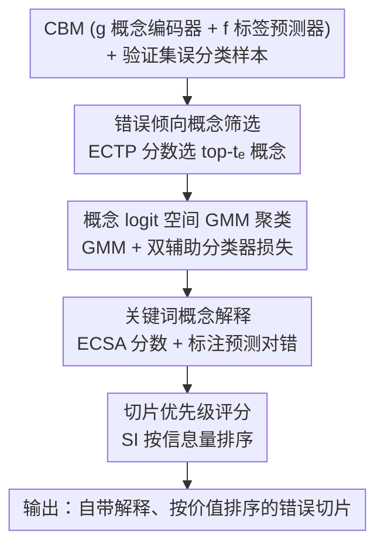

# CB-SLICE: Concept-Based Interpretable Error Slice Discovery

**会议**: ICML2026  
**arXiv**: [2605.29836](https://arxiv.org/abs/2605.29836)  
**代码**: https://github.com/yaelkon/CB-SLICE  
**领域**: 可解释性  
**关键词**: 错误切片发现, 概念瓶颈模型, 模型调试, 偏差检测, 可解释AI  

## 一句话总结

CB-SLICE 利用概念瓶颈模型（CBM）的概念预测空间来发现和解释深度学习模型的系统性错误切片，通过三步流程——错误倾向概念筛选、GMM 聚类形成切片、关键词概念解释——在多个基准上一致性超越现有方法，同时提供直接扎根于模型内部决策逻辑的忠实解释。

## 研究背景与动机

**领域现状**：深度学习模型尽管在平均性能上表现出色，但在特定数据子群上常常出现系统性错误（error slices）。现有的错误切片发现方法（SDM）如 Domino、GEORGE、Spotlight 等已经能在一定程度上识别这些失败模式。

**现有痛点**：现有 SDM 通常依赖辅助语言模型（如 ClipCap）来生成解释，但这些解释与被分析模型的内部推理过程是脱节的——它们只是间接近似错误源，可能不准确甚至具有误导性。更糟糕的是，辅助模型本身可能引入额外偏差，进一步降低解释的可靠性。

**核心矛盾**：错误切片发现需要同时解决两个问题：(i) 找到共享语义失败模式的错误样本子集，(ii) 用人类可理解的方式解释失败原因。现有方法将这两个步骤分离，导致解释不忠实于模型的真实决策过程。

**本文目标**：设计一个将切片发现与偏差解释统一在模型内部表示空间中的框架，使解释直接关联模型的决策逻辑。

**切入角度**：概念瓶颈模型（CBM）先预测人类可理解的概念（如"深色皮肤"、"不对称"），再基于概念预测做分类。这种结构化预测流程天然地在模型决策与语义概念之间建立了透明链接。当下游预测依赖中间概念预测时，系统性错误必然源自概念预测环节。

**核心 idea**：在 CBM 的概念 logit 空间中进行错误切片发现和解释，将 SDM 从"事后描述"转变为"模型感知"过程。

## 方法详解

### 整体框架

CB-SLICE 要解决的是：给定一个训练好的 CBM 和一批被它错分的样本，如何把这些错误按"模型在哪个概念上栽了跟头"自动归类并讲清原因。它的做法是把整个错误切片发现搬进 CBM 的概念预测空间——接收 CBM $\mathcal{M}_\theta = (g, f)$（概念编码器 $g$ + 标签预测器 $f$）和验证集误分类样本集 $\Psi_{\text{val}}$，依次完成"筛错误倾向概念 → 概念 logit 空间聚类 → 关键词概念解释"三步，最后按信息量给切片排序，输出一组自带解释、按分析价值排序的错误切片。因为发现和解释都发生在模型自己的概念表示里，整条流程不需要任何外部辅助语言模型。

### 关键设计

**1. 错误倾向概念筛选：用 ECTP 分数先把噪声概念踢掉**

如果在全部 $k$ 个概念上直接做切片，大量与错误无关的概念会引入噪声、稀释切片质量，所以 CB-SLICE 先筛出最可能酿成下游误分类的概念子集 $C_{\text{err}}$。判据是 Expected Change in Target Prediction（ECTP）分数：对每个概念 $i$ 做一次干预，看下游预测分布会被改动多少，定义 $T_i(\hat{\mathbf{c}}) = (1-\hat{c}_i) D_{\text{KL}}(\hat{y}_{\hat{c}_i=0} \| \hat{y}) + \hat{c}_i D_{\text{KL}}(\hat{y}_{\hat{c}_i=1} \| \hat{y})$，即把概念预测值翻转到 0 或 1 后下游分布相对原分布的 KL 散度，再按类别取平均，选 top-$t_e$ 个概念。这样形成切片的舞台就被限制在真正左右下游决策的概念上，发现质量显著提升。

**2. 概念 logit 空间 GMM 聚类：让一个切片对应一种概念级错误模式**

要把错误样本按"共享的失败模式"而非"表面特征相似"分组，CB-SLICE 先把筛出概念的预测从概率空间映回 logit 空间 $H_{\text{err}} = \sigma^{-1}(\hat{C}_{\text{err}})$——concept logit 编码了模型对概念存在与否的置信度且近似高斯分布，天然适合高斯混合模型建模。聚类目标由三项组成：GMM 负对数似然 $\mathcal{L}_{\text{GMM}}$ 保证切片语义连贯，两个辅助分类器损失 $\mathcal{L}_{c_{\text{true}}}$、$\mathcal{L}_{c_{\text{pred}}}$ 分别逼迫同一切片内样本共享相同的真实概念值和预测概念值，合成总损失 $\mathcal{L} = \mathcal{L}_{\text{GMM}} + \lambda(\mathcal{L}_{c_{\text{true}}} + \mathcal{L}_{c_{\text{pred}}})$。有了这两项辅助损失，切片捕到的就是一致的概念级错误模式，而不是仅仅长得像的样本堆。

**3. 关键词概念解释：用 ECSA 分数说清切片为什么形成**

切完片还得回答"这个切片是因为哪个概念才聚到一起的"。CB-SLICE 把第一步的 ECTP 思路从"概念对下游预测的影响"推广到"概念对切片归属的影响"，提出 Expected Change in Slice Assignment（ECSA）分数：$\text{ECSA}_i(\mathbf{x}) = \mathbb{E}_{v \sim \text{Bern}(\hat{c}_i)} [D_{\text{KL}}(P(S_j | \mathbf{x}, \hat{c}_i = v) \| P(S_j | \mathbf{x}))]$，衡量干预概念 $i$ 后样本切片归属概率分布的变化，对切片内所有样本取平均后选 top-$t_k$ 个概念作关键词。关键之处在于它同时标注每个关键词概念的预测值对错——于是解释不止告诉你"这个切片跟什么属性有关"，还区分了"概念被模型预测错了"和"罕见概念组合导致欠训练"两种根本不同的失败类型，直接指向不同的修复方向。

**4. 切片优先级评分：按信息量排序，别让人淹没在切片里**

切片可能很多，逐一分析负担太重，CB-SLICE 再给每个切片打一个信息量分 $\text{SI}_j = \rho \cdot \frac{1}{2}(\text{MC}_j + \frac{1+\text{SC}_j}{2})$。其中 MC（误预测一致性）由切片内预测标签分布的熵刻画，熵越低说明错误模式越一致；SC（语义紧凑性）由切片成员到质心的余弦相似度刻画，越高说明语义越聚拢；惩罚因子 $\rho$ 把样本过少的小切片降权。按 SI 排序后，分析者优先看到的就是既同质又有分析价值的切片。

## 实验关键数据

### 主实验

在 Waterbirds、CelebA、MetaShift、MNIST-Sum 四个数据集上，CB-SLICE 在 CBM（Sequential 和 Joint 训练）上与 Domino、GEORGE、HiBug2、Spotlight、K-Means 对比：

| 数据集 | 模型 | CB-SLICE Prec@10 | 最佳 baseline Prec@10 | CB-SLICE MGF | 最佳 baseline MGF |
|--------|------|------------------|----------------------|--------------|------------------|
| Waterbirds | CBM+Seq | **0.78** | 0.72 (Domino) | **0.70** | 0.25 (HiBug2) |
| Waterbirds | CBM+Joint | **0.83** | 0.62 (Domino) | **0.76** | 0.25 (HiBug2) |
| CelebA | CBM+Seq | **0.92** | 0.63 (Domino) | **0.66** | 0.51 (HiBug2) |
| MetaShift | CBM+Joint | **0.91** | 0.86 (Domino) | **0.86** | 0.72 (GEORGE) |
| MNIST-Sum | CBM+Joint | **1.00** | 0.50 (HiBug2) | **0.95** | 0.56 (HiBug2) |

### 消融实验

| 配置 | 效果 | 说明 |
|------|------|------|
| 使用全部概念（无 ECTP 过滤） | 显著下降 | 无关概念引入噪声，降低切片质量 |
| 仅 $\mathcal{L}_{\text{GMM}}$ | 下降 | 缺少概念级错误模式对齐 |
| $\mathcal{L}_{\text{GMM}} + \mathcal{L}_{c_{\text{true}}}$ | 次优 | 缺少预测值一致性约束 |
| $\mathcal{L}_{\text{GMM}} + \mathcal{L}_{c_{\text{true}}} + \mathcal{L}_{c_{\text{pred}}}$ | **最优** | 三项损失协同带来最高且最稳定的性能 |
| GMM vs 线性聚类 | GMM 优 | GMM 在辅助分类器准确率上一致优于线性替代 |

### 关键发现

- CB-SLICE 在 Precision@10 上全面领先，尤其在 CelebA (+29%) 和 MNIST-Sum (+50%) 上优势显著，表明其对错误切片的定位极为精准
- MGF 指标上的巨大优势（如 Waterbirds 上 0.70 vs 0.25）说明 CB-SLICE 发现的切片内部高度同质，不混入其他失败模式的样本
- 关键词概念能区分两类失败模式：概念误预测驱动的错误（如 Waterbirds 中 "medium size" 被错误预测）和罕见概念组合导致的错误（如 MNIST-Sum 中 (1,1) 组合训练不足）
- 损失收敛点与评估指标饱和点对齐，提供了无需标注即可选择切片数 $t_g$ 的实用准则

## 亮点与洞察

- **模型感知的解释范式**：CB-SLICE 将错误解释从"事后描述"转变为"模型感知"过程，解释直接源自模型内部的概念预测，避免了辅助模型引入的二次偏差。这一思路可以推广到任何具有中间可解释表示的架构
- **两类失败模式的区分**：通过标注关键词概念的预测正误，CB-SLICE 能自动区分"概念误预测"和"罕见组合欠训练"两种根本不同的失败原因，直接指导不同的修复策略（前者改概念编码器，后者做数据增强）
- **ECTP → ECSA 的推广**：将量化概念对下游预测影响的 ECTP 分数推广为量化概念对切片归属影响的 ECSA 分数，这种"干预-观测变化"的因果推理框架可迁移到其他需要归因分析的场景

## 局限与展望

- CB-SLICE 依赖 CBM 架构，需要完整且忠实的概念标注；当概念噪声或不完整时，性能可能退化
- 需要额外训练 CBM，增加了计算成本，虽然 CBM 与标准 DNN 的性能差距在缩小
- 未来可扩展到不完整/噪声概念集场景，或与下游偏差缓解策略（如重采样、数据增强）形成闭环

## 相关工作与启发

- **SDM 系列**：Domino 在 CLIP 空间发现切片但解释外挂；GEORGE 用嵌入聚类但不解释；Spotlight 找高损失区域但区分度不足。CB-SLICE 统一了发现与解释
- **CBM 偏差处理**：Bordt et al. 通过剪枝缓解虚假概念；Kim et al. 用 VLM 自动筛概念库。CB-SLICE 的不同在于目标是全面发现所有失败模式而非修复特定偏差
- **启发**：概念瓶颈不仅是可解释性工具，更是模型调试的天然基础设施。任何将决策过程分解为可解释中间表示的架构，都可以用类似的"在中间表示空间做错误分析"策略

<!-- RELATED:START -->

## 相关论文

- [\[CVPR 2025\] Towards Human-Understandable Multi-Dimensional Concept Discovery](../../CVPR2025/interpretability/towards_human-understandable_multi-dimensional_concept_discovery.md)
- [\[ICCV 2025\] Granular Concept Circuits: Toward a Fine-Grained Circuit Discovery for Concept Representations](../../ICCV2025/interpretability/granular_concept_circuits_toward_a_fine-grained_circuit_discovery_for_concept_re.md)
- [\[ACL 2025\] CLEME2.0: Towards Interpretable Evaluation by Disentangling Edits for Grammatical Error Correction](../../ACL2025/interpretability/cleme2_gec_evaluation.md)
- [\[CVPR 2026\] Hierarchical Concept Embedding & Pursuit for Interpretable Image Classification](../../CVPR2026/interpretability/hierarchical_concept_embedding_pursuit_for_interpretable_image_classification.md)
- [\[CVPR 2025\] Language Guided Concept Bottleneck Models for Interpretable Continual Learning](../../CVPR2025/interpretability/language_guided_concept_bottleneck_models_for_interpretable_continual_learning.md)

<!-- RELATED:END -->
