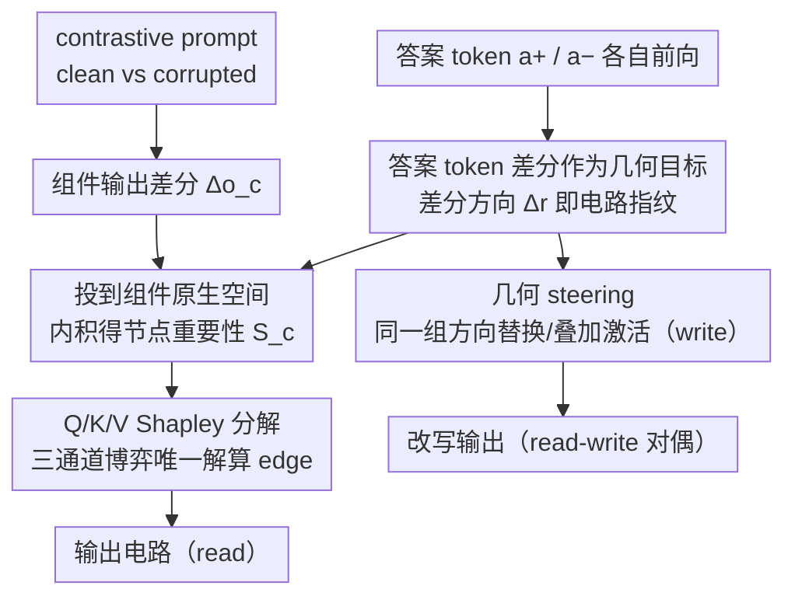

# Circuit Fingerprints: How Answer Tokens Encode Their Geometrical Path

**会议**: ICML 2026  
**arXiv**: [2602.09784](https://arxiv.org/abs/2602.09784)  
**代码**: 论文未明确公开  
**领域**: 可解释性 / 机制可解释性 / 激活引导  
**关键词**: 电路发现、激活引导、几何对齐、答案 token 指纹、Shapley 分解

## 一句话总结
本文提出 Circuit Fingerprint 假说——单独把答案 token 喂进 Transformer，它在隐空间留下的方向恰好就是产生该答案所要走的电路路径——并据此用纯几何对齐（无需梯度/干预）完成 circuit discovery，同时同一组方向反过来可以做 activation steering，证明"读"和"写"是同一个几何对象的两面。

## 研究背景与动机
**领域现状**：机制可解释性目前分两条线：(i) circuit discovery 用激活补丁（activation patching）或梯度近似（EAP / EAP-IG）找出对任务关键的 attention head/MLP 子网；(ii) activation steering 在残差流上加学到的方向以控制模型行为。两条线操作同一个表征空间却各自独立。

**现有痛点**：补丁法需要 $O(LH)$ 次前向；梯度法（attribution patching、EAP-IG）受饱和与 LayerNorm 非线性影响精度不稳；mask-learning 方法（ACDC、edge pruning）需迭代优化。Steering 侧又必须收集 contrastive 数据、学方向、调干预强度，且"在哪里干预"与"用什么方向"两个问题被脱钩处理。

**核心矛盾**：如果电路是稳定地编码在模型权重里的，那么 discovery 与 steering 操作的应该是同一个对象——但现有方法把这件事拆成两套互不通信的工具。线性表示假说（Park 2024、Elhage 2022）暗示了一个统一的几何视角，却从未被用来同时解释两件事。

**本文目标**：用一个几何原理同时回答 (i) 哪些组件属于电路（read）；(ii) 怎么干预这些组件来改变输出（write）；并且不依赖梯度或干预，只用纯前向投影。

**切入角度**：把答案 token（如 "Paris"）单独喂进模型——它本身没有任何上下文，但因为电路是固定权重，它沿途激活的正是 capital-city recall 电路。于是 $\Delta r^{(L)}=r_{a_+}^{(L)}-r_{a_-}^{(L)}$ 自然成了"产生 $a_+$ vs $a_-$ 所需"方向的几何签名。

**核心 idea**：电路成员资格 = 组件输出与"答案 token 差分方向"的对齐度；同一方向直接拿来做 steering 就是 write 操作；read 和 write 是同一组方向的对偶（duality）。

## 方法详解

### 整体框架
方法要回答的是同一件事的两面：哪些组件构成电路（read）、怎么改这些组件来换输出（write）。它把这两个问题都化成"几何对齐"——一边是答案 token 单独前向留下的差分方向（电路指纹），一边是 contrastive prompt（clean vs corrupted）下各组件的输出差分 $\Delta o_c$。Read 阶段把指纹方向投到每个组件的原生空间，与 $\Delta o_c$ 做内积得到节点重要性，再用 Q/K/V 三通道分解算出 edge；write 阶段则直接拿同一组方向去替换或叠加组件激活。整个流程不碰梯度、不做干预，只靠纯前向投影。

### 关键设计

**1. 答案 token 差分作为几何目标：用原生空间投影保住可加性**

电路发现的传统办法要么逐组件打补丁、要么反传梯度，成本高且受 LayerNorm 非线性干扰。本文换了个起点：只把答案 token $a_+$ 和 $a_-$ 各自独立喂进模型前向一次，就能在每层、每 head 上读出目标方向 $\Delta r^{(L)}, \Delta v, \Delta q, \Delta k$——因为电路是固定权重，孤立的答案 token 也会沿原电路走一遍，留下"产生这个答案所需"的方向签名。度量组件重要性时，关键在于不要直接在残差流上做内积，否则 $W_O$ 这类共享投影矩阵会把组件间的几何混淆塞进度量。本文先把目标方向变换到组件 $c$ 的原生空间（attention head 用 $W_O$、MLP 用 $W_{\text{out}}$）得 $\hat t_c=W_c^\top \Delta r^{(L)}/\|\Delta r^{(L)}\|$，再算 $S_c=\langle \Delta o_c,\hat t_c\rangle$。这样"组件内部如何产生方向"与"残差流共享几何"被解耦，并保证 $\sum_c S_c$ 恰好等于残差流上对目标方向的总投影——重要性是可加的，干净且无需任何训练。

**2. Q/K/V Shapley 分解：把 edge 归因变成博弈论唯一解**

节点重要性之外还要刻画 edge $i\to j$（上游组件流入下游 head 的信息），而一条 edge 走 Query、Key、Value 三条通道，怎么给三通道分权重是个老大难——平摊或手调都是任意的。本文对每条通道写出归一化的残差流分解，例如 K 通道 $R^{(K)}_{i\to j}=\langle \Delta o_i, W^{(j)}_K \Delta k^{(j)}\rangle/\langle\Delta r^{(\ell_j)}, W^{(j)}_K \Delta k^{(j)}\rangle$（线性下满足 $\sum_i R^{(K)}_{i\to j}=1$），再把 Q/K/V 看成三玩家合作博弈，对每个 head 跑 $2^3=8$ 个 coalition 求 Shapley 权重 $\phi_Q,\phi_K,\phi_V$，最终 $E_{i\to j}=S_j\cdot(\phi_Q R^{(Q)}_{i\to j}+\phi_K R^{(K)}_{i\to j}+\phi_V R^{(V)}_{i\to j})$，并按 layer 从深到浅做反向传播累加间接重要性（Alg. 1）。选 Shapley 不是为了花哨：它是合作博弈里**唯一**满足公平性公理的分配，且天然保证 $\phi_Q+\phi_K+\phi_V=S_{QKV}-S_\emptyset$，把可加性一路贯穿到 edge 级别。实证上这套分解还自带解释力——Fig. 4 显示 Name Mover heads 是 Q-dominated、S-Inhibition heads 是 K-dominated，与 Wang 2022 手工命名的角色完全吻合。

**3. 几何 steering：同一组 read 方向直接拿去 write**

要证明指纹不是表面相关而是真实因果结构，最直接的办法是用它去干预生成。本文在 read 阶段找到的同一批 head 上，复用同一组答案方向做 steering：把答案原型 $\{r_1,\dots,r_k\}$ 中心化后 SVD 得正交基 $\{u_i\}$，把 source/target 原型投到该基得 $d_s,d_t$；factual recall 任务用替换式 $X'=X-\|d_s-d_t\|\hat d_s+\|d_s-d_t\|\hat d_t$，stylistic（情感、语言）任务用 magnitude 转移式 $X'=X-\|d_s\|(\hat d_s-\hat d_t)$。对照组是 activation patching（直接搬 corrupted activation），它是 steering 的行为上界——若几何方向能逼近 patching 效果，就坐实了 read-write 对偶。实验里 IOI 上 $\alpha=1$ 时几何 steering 的 $P(\text{correct})=0.014$ 对 patching 的 0.0、logit diff $-4.07$ 对 $-7.34$，行为效应已是同一量级。

### 损失函数 / 训练策略
全程无训练、无梯度、无干预：拿目标方向只要 2 次前向（$a_+$ 与 $a_-$），算 $\Delta o_c$ 再加一遍 contrastive prompt 前向，Shapley 的 8 次 coalition 评估可分批跑完。整体计算预算与单次 backward 的 EAP 相当。

## 实验关键数据

### 主实验

| Model | Method | IOI CMD↓ | IOI CPR↑ | SVA CMD↓ | SVA CPR↑ | MCQA CMD↓ | MCQA CPR↑ |
|-------|--------|---------|---------|---------|---------|---------|-----------|
| GPT2-Small | EAP-IG | 0.03 | 0.97 | 0.05 | 0.95 | N/A | N/A |
|  | **CF (ours)** | 0.06 | **0.98** | 0.09 | 0.91 | N/A | N/A |
| Qwen2.5-0.5B | EAP-IG | 0.01 | 1.00 | 0.05 | 0.99 | 0.05 | 95.0 |
|  | **CF (ours)** | 0.04 | 0.96 | 0.06 | 0.94 | 0.09 | 92.0 |
| Llama3.2-1B | EAP-IG | 0.01 | 0.99 | 0.03 | 0.98 | 0.05 | 95.0 |
|  | **CF (ours)** | 0.02 | 0.99 | 0.05 | 0.96 | 0.13 | 0.87 |
| OPT-1.3B | EAP-IG | 0.00 | 1.50 | 0.01 | 1.00 | 0.04 | 0.96 |
|  | **CF (ours)** | 0.01 | 0.99 | 0.05 | 0.95 | 0.07 | 0.93 |

CF 在 IOI/SVA 上与梯度法基本持平、与 EAP 完全可比；MCQA 上略弱。

### Steering 评估

| Metric | Baseline (instruction prompting) | CF Steered |
|--------|----------------------------------|-----------|
| Emotion Classification Accuracy | 53.1% | **69.8%** |
| Perplexity (median) | 17.03 | **13.37** |
| Factual Accuracy | 90.1% | 89.6% |

Steering 对正价情感（joy）保持/提升事实准确率（100%），但负价情感（sadness 81%、disgust 78%）出现"情感共谐音素污染人名召回"的现象（如 Einstein 被改成 "Sissoar"）。

### 关键发现
- CMD/CPR 几乎不输梯度基线，且 size 越大几何方法越靠近 EAP-IG，作者归因于"概念在大模型中解耦更好"。
- Shapley 分解暴露 head 功能角色：Name Mover heads 是 Q-dominated，S-Inhibition 是 K-dominated，符合 IOI 文献的手工分类。
- 同一组方向同时做 read 和 write 都有效（patching upper bound 与 CF steering 的曲线高度重合），是 read-write duality 的强证据。
- Prompt 工程的 persona/emotion 指令前缀也能用来抽方向，证明 fingerprint 方法可推广到任何"通过 prompt 修改可控的属性"。

## 亮点与洞察
- **"答案 token 自带电路指纹"是一个相当反直觉的论断**：通常我们以为电路只在产生答案时才被激活，本文揭示答案 token 哪怕作为输入 token 出现也会沿原路径走一遍（甚至会抑制错误候选），把"电路是稳定结构"的直觉量化成可读出的方向。
- **read-write 对偶 = 真正的因果验证**：找到的方向不仅"看起来重要"，还能直接拿来 steering 并复现 patching 效果——这把可解释性从"事后描述"升级到"事前干预"，相比 SAE/probe 的"只看不动"是个范式上的小跃迁。
- **Shapley 分解通道的 idea 可迁移**：3 通道 $2^3=8$ coalition 就够公平分配，把"任意权重组合"换成"博弈论唯一解"，这一思路在多分支模块（MoE、多专家融合）里完全可复用。
- **方法仅需 2 次前向**：相比 EAP 系列的 $O(LH)$ 或反向梯度，CF 在计算成本上几乎免费，对大模型尤其友好。

## 局限与展望
- 实验局限在 GPT2-Small/Qwen-0.5B/Llama-1B/OPT-1.3B 这种 ≤1.3B 的小模型，没在 7B+ 上验证；MCQA 上 Llama3.2-1B 的 CPR 0.87 明显比 EAP-IG (0.95) 差，说明在更复杂任务上几何近似还不够紧。
- 只关注 final token 位置、忽略 earlier positions 的间接效应和 LayerNorm 非线性（作者明示是简化），edge attribution 在长上下文里的精度待验。
- 零样本 steering 仍脆弱：负价情感会污染语义、产生"Bonniweeper"这种荒诞错词，提示某些 feature 与词汇内容仍纠缠，不能完全线性解耦。
- 评估指标 CMD/CPR 来自 MIB benchmark，对其他可解释性任务（feature ablation、faithfulness）尚未系统比较。

## 相关工作与启发
- **vs ACDC / Edge Pruning / EAP-IG**：传统电路发现要么需要迭代搜索 / mask 学习，要么需要梯度反传；CF 只用 2 次前向 + Shapley 8 次 coalition，把电路发现降到与单次前向同量级且无梯度依赖。
- **vs Activation Steering (Turner 2023, Zou 2023)**：现有 steering 要先准备 contrastive 数据再单独学方向；本文直接复用 circuit discovery 找到的同一组方向 + 同一批 head，"在哪里干预 + 用什么方向"被统一解决。
- **vs Linear Representation Hypothesis**：Park 2024、Elhage 2022 提出"特征是激活空间里的方向"是描述性的；本文给出操作化证据——这些方向不只是描述特征，还描述了产生这些特征的电路本身，"特征几何 ≡ 电路几何"的强统一。

## 评分
- 新颖性: ⭐⭐⭐⭐⭐ Circuit Fingerprint 假说 + read-write duality 把两条独立的可解释性研究线统一在一个几何对象上，洞察非常原创。
- 实验充分度: ⭐⭐⭐ 覆盖 4 个 model family × 3 个任务（IOI/SVA/MCQA）+ 5 个情感 steering，但模型规模偏小、benchmark 单一。
- 写作质量: ⭐⭐⭐⭐ 概念解释清晰、Shapley 推导与算法完整，对 limitation 坦诚。
- 价值: ⭐⭐⭐⭐ 提供了一个无梯度、低成本、可直接同时做 discovery 和 control 的工具，对 alignment、行为编辑研究都有实用价值。

<!-- RELATED:START -->

## 相关论文

- [\[ICML 2026\] Query Circuits: Explaining How Language Models Answer User Prompts](query_circuits_explaining_how_language_models_answer_user_prompts.md)
- [\[ICLR 2026\] How Do Transformers Learn to Associate Tokens: Gradient Leading Terms Bring Mechanistic Understanding](../../ICLR2026/interpretability/how_do_transformers_learn_to_associate_tokens_gradient_leading_terms_bring_mecha.md)
- [\[ICML 2026\] All Circuits Lead to Rome: Rethinking Functional Anisotropy in Circuit and Sheaf Discovery for LLMs](all_circuits_lead_to_rome_rethinking_functional_anisotropy_in_circuit_and_sheaf_.md)
- [\[ICML 2026\] How Language Models Process Negation](how_language_models_process_negation.md)
- [\[ICML 2026\] Position: Let's Develop Data Probes to Fundamentally Understand How Data Affects LLM Performance](position_lets_develop_data_probes_to_fundamentally_understand_how_data_affects_l.md)

<!-- RELATED:END -->
