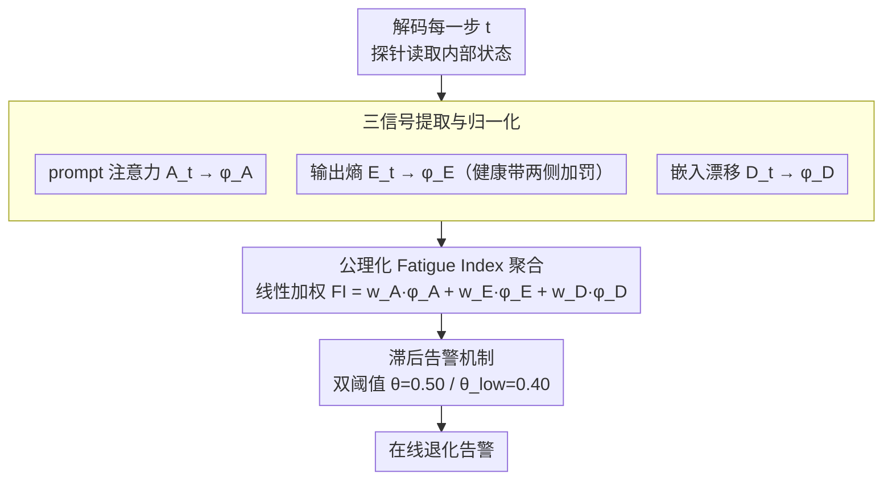

# Cognitive Fatigue in Autoregressive Transformers: Formalization and Measurement

**会议**: ICML2026  
**arXiv**: [2605.30981](https://arxiv.org/abs/2605.30981)  
**代码**: 无  
**领域**: 可解释性/模型诊断  
**关键词**: 认知疲劳, 自回归Transformer, 运行时监控, 疲劳指数, 长序列退化  

## 一句话总结
本文将自回归语言模型在长序列生成中的退化现象形式化为"认知疲劳"，提出 Fatigue Index (FI) 这一轻量级、模型无关的在线诊断指标，聚合 prompt 注意力衰减、表示漂移和熵失调三个信号，在 9 个模型上验证了 FI 对退化的预测能力（AUROC=0.976）并揭示了非单调的规模缩放行为。

## 研究背景与动机

**领域现状**：大语言模型在短 prompt 下表现优异，但在长序列生成场景（多步推理、工具调用、多轮对话等）中会系统性退化——产生重复文本、丢失指令遵循能力、熵不稳定。

**现有痛点**：当前缓解手段主要作用于训练时（如 unlikelihood training）或离线评估阶段，缺少能在推理过程中实时检测退化的在线诊断信号。从业者往往在生成完成后才发现输出已经不可靠，无法在退化发生时及时干预。

**核心矛盾**：Transformer 的自回归解码天然存在注意力稀释、残差累积和过拟合等结构性压力，这些压力随序列增长而叠加，但模型内部并没有暴露一个"可靠性仪表盘"来反映当前生成的健康状态。

**本文目标**：(1) 将长序列退化形式化为可度量的"认知疲劳"概念；(2) 设计满足公理化约束的在线指标 FI；(3) 在多模型、多任务上验证 FI 的预测能力和稳定性。

**切入角度**：作者从 Transformer 内部可观测的三类信号出发——注意力分布、隐状态轨迹、输出熵——每一类对应一种退化模式，无需修改模型权重或重新训练即可计算。

**核心 idea**：将注意力衰减、表示漂移和熵失调三个正交信号归一化后线性聚合为一个有界的疲劳指数，使长序列退化从"事后观察"变为"实时监控"。

## 方法详解

### 整体框架
本文要解决的是长序列生成中模型"悄悄变坏"却没有实时仪表盘的问题。做法是在 decoder-only 模型自回归解码的每一步 $t$，用轻量探针从内部读出三个正交信号——当前 token 对 prompt 区域的注意力、隐状态相对 prompt 末尾的偏移、以及下一 token 分布的熵，把它们各自归一化到统一惩罚尺度后线性聚合成一个有界的 Fatigue Index (FI)。FI 满足五条公理以保证可解释、可归因，再叠加一层滞后告警把连续的风险分转成稳定的在线告警，整个过程不动模型权重、不需重训。

### 关键设计

**1. 三信号提取与归一化：把异构内部状态映成可加的退化惩罚**

退化有多副面孔——指令被遗忘、预测校准失常、表示越飘越远——单看任何一路都不够，但三路信号量纲完全不同，无法直接相加。本文为每一路设计了一个映射到 $[0,1]$ 的惩罚函数：**Prompt 注意力** $A_t$ 取最后一层所有注意力头对 prompt 切片的平均权重，注意力越低说明指令遵循衰退越严重，故惩罚取 $\phi_A(A_t) = 1 - \text{clip}(A_t, 0, 1)$；**输出熵** $E_t$ 引入一条"健康带" $[H_\ell, H_u]$，带内惩罚为 0，低于下界对应过度自信/重复、高于上界对应过度不确定，两侧分别线性加罚；**嵌入漂移** $D_t = \|h_t - h_0\|_2$ 衡量隐状态离开 prompt 末尾的距离，除以固定上限 $\kappa$ 再裁剪到 $[0,1]$。三者分别锁定指令遵循、预测校准和内部表示三种退化模式，归一化之后才有了可比、可加的共同尺度。

**2. 公理化 Fatigue Index 聚合：一个能归因的单值风险分**

有了三路惩罚还要合成单一得分，而合成方式必须本身可信。本文用线性聚合 $FI_t = w_A \phi_A(A_t) + w_E \phi_E(E_t) + w_D \phi_D(D_t)$，权重 $w_A=0.40, w_E=0.35, w_D=0.25$，并证明它满足五条公理：单调性（任一信号恶化 FI 必增）、尺度不变性（保序变换不改排序）、有界性（$FI \in [0,1]$）、时序稳定性（对 $t$ Lipschitz 连续）、可分解性（可拆回各信号的贡献）。之所以选线性而非更复杂的非线性融合，正是为了透明可归因——出问题时能立刻说清是哪一路在拉高分数；而权重排序 $w_A \geq w_E \geq w_D$ 编码了领域先验：注意力最直接反映指令遵循，熵次之负责重复与坍塌，漂移信号更长期但也更含噪。

**3. 滞后告警机制：把抖动的风险分变成可用的生产告警**

FI 即便趋势正确，逐步阈值判断在临界点附近也会反复翻转、淹没在假告警里。本文借鉴控制系统的滞后思路设置一高一低两个阈值——激活阈值 $\theta = 0.50$、关闭阈值 $\theta_{\text{low}} = 0.40$：FI 需连续越过激活阈值才触发告警，且必须回落到关闭阈值以下才解除，中间夹一层短窗口平滑进一步压瞬时抖动。这层机制让告警只在真正持续的退化时拉响，在全部数据集上把告警翻转减少了 91% 以上。

## 实验关键数据

### 主实验
在 OPT-2.7B 上跨三个 QA 数据集评估，共 27,405 条生成序列：

| 数据集 | 样本数 | 平均 FI | 重复率 | Spearman ρ (全序列) | Spearman ρ (前20 token) |
|--------|--------|---------|--------|---------------------|------------------------|
| HotpotQA | 7,405 | 0.815 | 0.404 | 0.848 | 0.425 |
| SQuAD | 10,000 | 0.812 | 0.423 | 0.856 | 0.375 |
| TriviaQA | 10,000 | 0.833 | 0.467 | 0.820 | 0.404 |

聚合 vs 单信号 AUROC 对比（HotpotQA，严重退化检测）：

| 方法 | AUROC |
|------|-------|
| **Fatigue Index (本文)** | **0.976** |
| Entropy Only | 0.954 |
| Drift Only | 0.929 |
| Attention Only (逆) | 0.307 |

### 消融实验

| 配置 | 关键指标 | 说明 |
|------|---------|------|
| 完整 FI + 滞后告警 | 翻转减少 91-93% | 三数据集上朴素翻转 18-21 次/条降至 1.4-1.7 次/条 |
| FP16 精度 | 熵平稳 | 注意力与漂移轨迹正常 |
| 4-bit NF4 量化 | 熵更深更不稳定的坍塌 | 量化主要破坏预测校准而非 prompt 关注或表示稳定性 |
| 短上下文 (len=192) | 高 prompt 注意力 | 注意力保持显著非零 |
| 长上下文 (len=1446) | 接近零 prompt 注意力 | 更早出现全面注意力坍塌 |

### 关键发现
- **聚合显著优于单信号**：FI 的 AUROC=0.976 大幅超越最强单信号（漂移 0.929），验证了多信号聚合的必要性。注意力单独 AUROC 仅 0.307，但因其最直接反映指令遵循而获最高权重
- **非单调规模缩放**：在 1B-13B 的 9 个模型中，3B 以下的指令微调模型比基座模型更快坍塌，7B 时趋势反转，指令微调模型开始表现更好。13B 的 Llama-2-13B-Chat 出现"安全疲劳"——坍缩为低熵拒绝模板
- **漂移斜率与模型大小无关**：不同规模模型的嵌入漂移斜率聚集在 0.08-0.14 之间，说明大模型不是"漂移更少"而是"漂移得更连贯"
- **位置偏差加剧疲劳**：前置证据获得的注意力比中间/末尾位置高 5-10 倍，首因偏差导致系统性忽视后部上下文

## 亮点与洞察
- **将退化从事后观察变为实时诊断**：FI 只需模型的 logits、注意力和隐状态，无需重训练即可在线计算，这种"模型内视镜"思路可推广到任何需要运行时可靠性监控的 LLM 部署场景
- **公理化设计保证指标品质**：五条公理（单调/尺度不变/有界/时序稳定/可分解）不仅约束了 FI 的形式，还为评估任何在线诊断指标提供了通用准则，这一方法论贡献独立于具体的信号选择
- **"安全疲劳"发现**：13B 对齐模型坍缩为拒绝模板的现象揭示了过度对齐对输出多样性的副作用，对 RLHF/alignment 研究具有警示意义

## 局限与展望
- FI 需要访问 logits、注意力和隐状态，无法用于闭源 API（如 GPT-4）
- 实验仅限 QA 任务且生成上限 120 token，对话/代码/工具调用等更长的实际场景有待验证
- 线性聚合和固定权重假设较强，跨模型家族和解码策略的权重迁移性未经验证
- 仅验证了对重复退化的预测能力，未覆盖幻觉、事实错误等非重复类失败模式
- 未来可探索闭环干预（FI 触发时自动切换策略）、机制可解释性（定位电路级疲劳原因）以及自适应权重学习

## 相关工作与启发
- Liu et al. (2023) 的"Lost in the Middle"揭示了位置偏差的任务级效应，本文将其细化为 token 级在线信号
- Holtzman et al. (2020) 提出 nucleus sampling 缓解文本退化，本文从监控而非缓解角度处理同一问题
- Farquhar et al. (2024) 的语义熵用于幻觉检测，是基于语义聚合的离线方法，而 FI 强调实时性和多信号融合
- 可以将 FI 思路迁移到多模态模型（视觉 token 的注意力衰减）或 Agent 系统（多步调用的累积退化监控）

<!-- RELATED:START -->

## 相关论文

- [\[NeurIPS 2025\] How Intrinsic Motivation Shapes Learned Representations in Decision Transformers: A Cognitive Interpretability Analysis](../../NeurIPS2025/interpretability/toward_explainable_offline_rl_analyzing_representations_in_intrinsically_motivat.md)
- [\[ICLR 2026\] Decoupling Dynamical Richness from Representation Learning: Towards Practical Measurement](../../ICLR2026/interpretability/decoupling_dynamical_richness_from_representation_learning_towards_practical_mea.md)
- [\[ACL 2026\] Interpreto: An Explainability Library for Transformers](../../ACL2026/interpretability/interpreto_an_explainability_library_for_transformers.md)
- [\[ICLR 2026\] AdAEM: An Adaptively and Automated Extensible Measurement of LLMs' Value Difference](../../ICLR2026/interpretability/adaem_an_adaptively_and_automated_extensible_measurement_of_llms_value_differenc.md)
- [\[NeurIPS 2025\] CBMAS: Cognitive Behavioral Modeling via Activation Steering](../../NeurIPS2025/interpretability/cbmas_cognitive_behavioral_modeling_via_activation_steering.md)

<!-- RELATED:END -->
