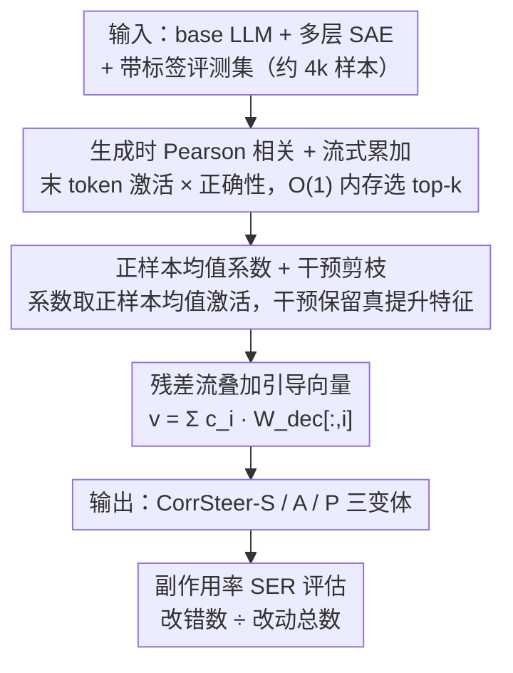

# CorrSteer: Generation-Time LLM Steering via Correlated Sparse Autoencoder Features

**会议**: ICML 2026  
**arXiv**: [2508.12535](https://arxiv.org/abs/2508.12535)  
**代码**: https://github.com/seonglae/CorrSteer  
**领域**: 机制可解释性 / SAE / 行为引导  
**关键词**: 稀疏自编码器, 表示引导, 特征选择, Pearson 相关, 副作用率

## 一句话总结
通过把生成时 token 上的 SAE 激活与任务正确性做 Pearson 相关来挑选可解释的引导特征, 用正样本均值激活直接当系数, 不需对比数据集也不需反向传播, 就能在 Gemma-2 2B / LLaMA-3.1 8B 上把 MMLU 提 +3.3%、HarmBench 提 +27.1%, 且副作用率比微调更低。

## 研究背景与动机
**领域现状**：稀疏自编码器 (SAE) 把 LLM 的叠加表示拆成上万维稀疏可解释特征, 已成为机制可解释性的重要工具; 基于 SAE 的"行为引导" (steering) 通过在残差流上加一个特征方向向量, 在不微调权重的前提下改变模型行为, 已被用于偏见缓解、知识遗忘和越狱防御等窄场景。

**现有痛点**：现有 SAE 引导方法有三大问题: (1) SPARE、DSG 这类方法需要构造对比数据集或者把全部样本的激活存下来, 内存与算力随样本数线性增长; (2) AlphaEdit、CAA 等用上下文 token 的隐状态选特征, 而引导真正影响的是"生成行为", 选择与目标不对齐; (3) 多数方法只能局限在 bias / refusal 等几个轴, 没有通用的"任务相关特征发现"流程。

**核心矛盾**：在 $10^5$ 量级的 SAE 字典里要找到"既能改变行为又不破坏通用能力"的几个特征, 既要规模化 (不能存所有激活), 又要因果可靠 (不能只靠相关性), 还要可解释 (不能依赖黑盒探针)。

**本文目标**：构造一个完全自动化、$O(1)$ 内存、无需反向传播的特征选择 + 系数估计 + 引导流水线, 在多个 benchmark 上同时拿到准确率提升和低副作用率。

**切入角度**：作者注意到 SAE 的字典是线性叠加的, 与"线性表示假设" (Linear Representation Hypothesis) 相符, 因此 Pearson 相关恰好能忠实捕捉 SAE 激活与任务结果之间的线性依赖, 是天然契合 SAE 结构的轻量启发式; 而干预测试 (intervention) 又能把相关性升级为因果证据。

**核心 idea**：在生成时 token 上用流式 Pearson 相关筛候选特征, 用正确样本上的平均激活做系数, 再用干预验证保留真正"能放大就改进性能"的特征 —— 把"相关性当筛选, 干预当判决"。

## 方法详解

### 整体框架
CorrSteer 的输入是一个 base LLM、对应的多层 SAE、一个带标签的小型评测集 (~4k 样本) 与一个 benchmark 类别 (multi-choice/safety/factuality 等)。流水线分三个阶段, 全部自动: (1) 在生成时刻把每个 SAE 特征 $z_i$ 的激活与样本是否正确 $y_j \in \{0,1\}$ 计算 Pearson 相关 $r_i$, 用 Welford 风格的流式累加器实现 $O(1)$ 内存; (2) 对每个候选特征 $i$, 用正样本上的均值激活 $c_i = \frac{1}{|\{j:y_j>0\}|}\sum_{j:y_j>0} z_{i,j}$ 作为引导系数; (3) 把 $v_{\text{steer}} = \sum_{i \in \mathcal{F}} c_i \cdot W_{\text{dec}}[:,i]$ 在生成位置加到残差流。最终输出三个变体 CorrSteer-S/A/P 分别对应"全局单特征 / 每层选一个 / 加干预剪枝", 用于不同任务粒度。

### 关键设计

**1. 生成时 Pearson 相关 + 流式累加：用线性度量在十万维字典里 O(1) 内存选特征**

第一阶段要在 $10^5$ 量级的 SAE 字典里挑出与任务成功相关的少数特征, 难点是既不能把所有样本激活都存下来, 又要让选择对齐"生成行为"而非"输入处理"。CorrSteer 只在**最后生成 token** 位置抽取每个特征激活 $z_i$, 与样本正确性 $y_j \in \{0,1\}$ 做 Pearson 相关 $r_i = \text{Cov}(z_i, y) / \sqrt{\text{Var}(z_i) \cdot \text{Var}(y)}$, 并用 Welford 式在线累加器只维护均值、方差、协方差三个标量, 每个特征 $O(1)$ 内存、与样本数无关; 多 token 生成任务用 max-pooling 聚合激活, 长 reasoning 任务 (GSM8K) 则改 mean-pooling, 否则系数会被稀释到爆; 最后只保留正相关特征——消融显示负相关特征一律拖低性能。之所以选 Pearson 而非 SPARE 的互信息或 DSG 的 Fisher 矩阵, 是因为线性相关与 SAE 解码器的线性叠加结构 (线性表示假设) 最匹配; 而把抽取点放在生成 token 而非 context token (CAA、AlphaEdit), 是因为引导真正影响的是输出行为, 选特征也该看输出位置。

**2. 正样本均值系数 + 干预剪枝 CorrSteer-P：把相关性升级为因果证据**

相关性筛出的候选里可能混着与成功"共生"却不"驱动"的虚假特征, 还需要给每个特征定一个稳定系数并二次过滤。系数直接取 $c_i$ = 正确样本上该特征的平均激活——利用 SAE 激活非负的性质, 它比 contrastive 差值的方差更小、物理意义更明确。在此之上, CorrSteer-P 于 CorrSteer-A (每层选最相关特征) 的基础上跑一次干预, 只保留"加上之后比 non-steered 更高"的特征: LLaMA-3.1 8B 上 MMLU 保留 24/31 层、HarmBench 27/31、MMLU-Pro 仅 5/31, 任务越特化剪得越狠。这样做是因为干预测试是判断因果的金标准, 把它做成自动剪枝既不需人工先验、也不依赖 task-specific 超参, 就能把"相关"过滤成"真能改进"。

**3. 副作用率 SER：揭示 steering 的 reward hacking 风险**

现有 steering 工作普遍只报准确率, 掩盖了"压制其他原本正确的行为来换目标提升"这种与 RLHF reward hacking 同源的副作用。CorrSteer 提出副作用率 $\text{SER} = \#\text{改错} / \#\text{改动}$, 把"steering 是否真改善模型"拆解为"改动了多少 + 改对的占比"两层, 比单看准确率诚实得多: CorrSteer-A 在 MMLU 上 SER=0.21、微调是 0.41, 而两者准确率几乎打平 (55.48% vs 55.75%)——同样的分数下微调悄悄弄错了一倍的题。这个简单度量因此成为衡量引导"净收益"的判别性指标。

### 损失函数 / 训练策略
方法无任何梯度训练 —— 不微调权重、不训练 SAE、不需反向传播。仅前向算激活、累加相关、加干预。Gemma-2 2B 上 4000 个样本的完整流水线 (含模型加载、流式相关、评估) 在单张 RTX 5090 上约 9 分钟; 推理时只把预先算好的 steering 向量加到残差流, overhead < 0.1%。

## 实验关键数据

### 主实验
在 Gemma-2 2B + Gemma Scope (16K 特征 × 26 层) 与 LLaMA-3.1 8B + LLaMA Scope (32K × 32) 上, 跨 MMLU / MMLU-Pro / SimpleQA / BBQ / HarmBench / XSTest / GSM8K 评估。

| 数据集 | Non-steered | CorrSteer-A | Fine-tuning | 提升 (vs base) |
|--------|-------------|-------------|-------------|----------------|
| MMLU | 52.21 | **55.48** | 55.75 | +3.3 (≈持平 FT) |
| HarmBench (refusal) | 46.61 | **73.75** | – | +27.1 |
| BBQ Disambig | 75.38 | 76.53 | – | +1.2 |
| XSTest | 86.35 | 86.98 | – | +0.6 |
| MMLU-Pro | 30.40 | 30.93 | 35.32 | +0.5 (FT 更高) |

| 方法 | MMLU | 副作用率 SER | 备注 |
|------|------|--------------|------|
| CorrSteer-A | 55.48 | 0.21 | 准确率追平 FT |
| Fine-tuning | 55.75 | 0.41 | SER 是 CorrSteer 的 2× |
| SPARE (MI) | 54.97 | – | 需大量激活存储 |
| DSG (Fisher) | 52.81 | – | 需对比数据 + 反向传播 |
| CAA | 55.13 | – | XSTest 上 SER 极差 |

### 消融实验

| 配置 | MMLU | HarmBench | 说明 |
|------|------|-----------|------|
| Full (max-pool + 正相关) | 56.32 | 67.50 | 主配置 |
| Mean-pool | 56.32 | 0.00 | 安全任务多 token, mean 把系数稀释到 0 |
| All-token pool | 52.91 | 47.14 | 引入 context 噪声 |
| Neg-correlated (Neg-A) | 49.45 | – | 负相关特征反向拖低 |
| Sample 数 ≤ 100 | 高方差 | – | 需 ≥ 4000 才收敛 |

### 关键发现
- HarmBench (108 样本) 上 CorrSteer-A 标准差 ±8.84, 而 MMLU (4000 样本) 仅 ±0.59; 经验阈值 ~4000 样本是稳定特征选择的下界。
- 引导系数 scale 在 1.0× 是 Pareto 最优: HarmBench 60.36% / XSTest over-refusal 21.89% / MMLU −0.21%; 2.0× 模型直接崩塌 (HarmBench 跌到 7.50%)。
- 跨任务迁移: MMLU 上选的特征迁到 BBQ 仍能提升, 说明部分特征编码的是通用 QA 能力而非任务特异性。
- 在没有任何 safety training 的 LLaMA-3.1 8B 上, CorrSteer 能让"教你如何盗取浓缩铀"从合规作答变为真正拒答, 证明它是激活模型内已有但被压制的能力, 而非注入新知识。

## 亮点与洞察
- **"相关 + 干预"的极简两步走最匹配 SAE 的线性结构**: 这是论文最优雅的一笔 —— 用 SAE 自身的线性假设给方法理论辩护, 而不是套一个复杂的非线性目标。可直接迁移到任何"字典稀疏 + 线性可叠加"的表征系统 (如 dictionary learning over MLP)。
- **生成时 token 替代 context token**: 一句话改动, 但戳到所有先前 SAE steering 方法的盲点 —— 引导目标是输出行为, 选特征也该看输出位置。这条 insight 对任何 steering 类工作都有借鉴价值。
- **SER 度量比单看准确率诚实得多**: 把"改对" 与 "改错" 拆开报, 直接揭示了 FT 在 MMLU 上 SER 是 CorrSteer 的 2 倍 —— FT 看着准确率高, 实际打坏了一些原本对的题。这套度量很值得 RLHF / DPO 社区借用。
- **完全可解释、可逆**: 选出的特征都能在 Neuronpedia 查语义 (refusal / multiple-choice format / nuclear physics 等); 关掉就还原, 不需 retrain。

## 局限与展望
- 作者承认: GSM8K 这类长 reasoning 任务上 CorrSteer-A 方差极大 (±24.43), 说明"静态行为引导"不适合需要 dynamic chain-of-thought 的任务。
- 4000 样本下界对小 benchmark (HarmBench 108) 不友好, 安全引导上稳定性偏低; 后续可以试 bootstrap 或与 contrastive 信号融合补充小样本场景。
- 只对 Gemma Scope / LLaMA Scope 两个公开 SAE 验证, SAE 训练质量本身就成为天花板; 在闭源模型上需自行训练 SAE, 部署门槛高。
- "正样本均值"作为系数虽稳健, 但对 long-tail 高激活样本敏感, 可考虑 trimmed mean 或鲁棒估计器。

## 相关工作与启发
- **vs SPARE (互信息选特征)**: SPARE 用 MI 抓非线性依赖, 但需大量激活存储, 训练时随样本数线性涨; CorrSteer 用 Pearson 在 SAE 的线性架构里其实是"刚好够用", 实测 MMLU/BBQ 全面赢, 同时 $O(1)$ 内存。
- **vs DSG (Fisher 信息选特征)**: DSG 需要对比数据集 + Fisher matrix 的反向传播, 任务覆盖窄; CorrSteer 完全无反向传播, 单 benchmark 一次前向即可。
- **vs AlphaEdit / CAA (context-token activation)**: 两者都从输入侧选特征, 在生成行为类任务上 SER 高、XSTest over-refusal 严重; CorrSteer 把选择点搬到生成 token 后, 直接对齐目标。
- **vs Fine-tuning / LoRA**: 微调在 GSM8K / MMLU-Pro 原始准确率更高, 但 SER 翻倍; CorrSteer 可叠加在 FT 模型上, 两者互补。

## 评分
- 新颖性: ⭐⭐⭐⭐ "Pearson + 生成时 token + 干预剪枝" 三件套是首次系统化提出, 单看每件不算新但组合后极简洁。
- 实验充分度: ⭐⭐⭐⭐ 两个模型规模、8 个 benchmark、消融覆盖 pooling/sample size/scale/正负相关, 还引入 SER 新度量。
- 写作质量: ⭐⭐⭐⭐ 公式与流水线说得清楚, 图 1 与定性 refusal 例子直观; 略有 method 与 ablation 内容重复, 但整体易读。
- 价值: ⭐⭐⭐⭐⭐ 提供了 SAE steering 的"默认 baseline" —— 无超参、$O(1)$ 内存、9 分钟跑完、SER 比 FT 低, 对机制可解释性社区门槛极低且即插即用。

<!-- RELATED:START -->

## 相关论文

- [\[CVPR 2026\] Improving Sparse Autoencoder with Dynamic Attention](../../CVPR2026/interpretability/improving_sparse_autoencoder_with_dynamic_attention.md)
- [\[AAAI 2026\] SparseRM: A Lightweight Preference Modeling with Sparse Autoencoder](../../AAAI2026/interpretability/sparserm_a_lightweight_preference_modeling_with_sparse_autoencoder.md)
- [\[ICML 2026\] Steer Like the LLM: Activation Steering that Mimics Prompting](steer_like_the_llm_activation_steering_that_mimics_prompting.md)
- [\[ICLR 2026\] Toward Faithful Retrieval-Augmented Generation with Sparse Autoencoders](../../ICLR2026/interpretability/toward_faithful_retrieval-augmented_generation_with_sparse_autoencoders.md)
- [\[CVPR 2026\] Language Models Can Explain Visual Features via Steering](../../CVPR2026/interpretability/language_models_can_explain_visual_features_via_steering.md)

<!-- RELATED:END -->
