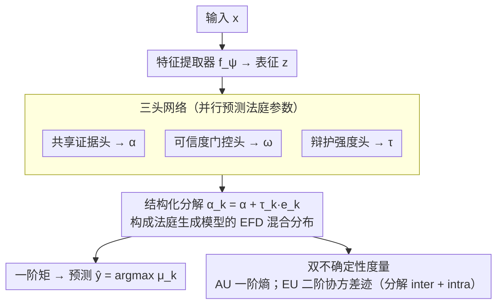

# Courtroom Analogy: New Perspective on Uncertainty-Aware Classification

**会议**: ICML 2026  
**arXiv**: [2605.25616](https://arxiv.org/abs/2605.25616)  
**代码**: 待确认  
**领域**: interpretability  
**关键词**: 不确定性量化, 证据深度学习, Dirichlet 混合, 可解释性, 单次前向 UQ

## 一句话总结
本文提出"法庭辩论 (courtroom analogy)"视角，将分类的二阶不确定性建模为 $K$ 个类别辩护人 Dirichlet 意见在输入相关权重下的结构化混合，并实例化为 MoDEX 网络（共享证据 $\bm{\alpha}$ + 类专属辩护强度 $\tau_k$ + 可信度 $\bm{\omega}$ 三个轻量头），单次前向即可在 CIFAR/SVHN/TIN/CIFAR-10-C/CIFAR-10-LT 等基准上稳定刷过 EDL / $\mathcal{F}$-EDL 等一系列 baseline，并给出语义明确的不确定性分解。

## 研究背景与动机
**领域现状**：以 EDL (Sensoy et al., 2018) 为代表的单次前向二阶 UQ 方法，把分类的不确定性建模成一个类别概率向量上的分布 $q\in\mathcal{Q}$，通常取 Dirichlet 族——既能闭式给出预测均值/方差，又能用 evidence 解释 concentration 参数。后续 $\mathcal{I}$-EDL / R-EDL / Re-EDL / $\mathcal{F}$-EDL 等工作沿着同一条路推进。

**现有痛点**：这条线主流的优化方向是"加表达力"——要么换更灵活的分布族，要么放松原 EDL 的假设。结果是 $\mathcal{Q}$ 越来越能拟合复杂的不确定性形态，但**不确定性到底是怎么"形成"和"聚合"出来的，仍然完全黑箱**：拿到 Dirichlet 的 $\bm{\alpha}$ 之后只能解释成"总证据量"，对"为什么模型在这张图上犹豫"、"犹豫来自哪里"几乎给不出语义。

**核心矛盾**：表达力 vs 结构可解释性之间没有桥梁。单纯堆 $\mathcal{Q}$ 的容量并不能告诉用户不确定性的来源结构（是证据少？还是不同类的解释相互冲突？），而这恰恰是 UQ 在高风险场景里最有价值的部分。

**本文目标**：设计一个既保留单次前向 + 闭式矩 + Dirichlet 系优良性质，又能把不确定性的**形成机制**显式编码到 $\mathcal{Q}$ 的结构里的框架。

**切入角度**：作者从一个直觉类比出发——把分类看成法庭辩论。每个类对应一名辩护人，所有辩护人看同一份案件证据 $\mathbf{x}$，但可以基于侧重点不同得到不同的概率信念；最终判决是这些信念按"可信度"加权聚合的结果。这个比喻天然区分了三类不确定性来源：(i) 证据本身不足，(ii) 辩护人对相同证据解释不一致，(iii) 哪个辩护人更可信。

**核心 idea**：用「共享 base 证据 + 类专属 advocacy 增量」的方式结构化分解 $K$ 个 Dirichlet 意见，再用输入相关的可信度权重把它们混合成 $\mathcal{Q}$，得到一个 $\mathcal{O}(K)$ 参数、可单次前向、且每个参数都有法庭语义的二阶分布——其分布族恰好等价于 Ongaro 等人提出的 Extended Flexible Dirichlet (EFD)。

## 方法详解

### 整体框架
MoDEX 要解决的是"单次前向就能给出结构可解释的二阶不确定性"。它把分类想象成一场法庭辩论：$K$ 个类各派一名辩护人，所有人看同一份案件证据，但可以基于不同侧重得出不同的概率信念，最终判决是这些信念按可信度加权聚合的结果。落到网络上，输入 $\mathbf{x}_i$ 先经特征提取器 $f_{\bm{\psi}}$ 得到表征 $\mathbf{z}_i$，再由三个轻量头并行输出三组法庭参数——共享证据 $\bm{\alpha}(\mathbf{x}_i)\in\mathbb{R}_{>0}^K$、可信度权重 $\bm{\omega}(\mathbf{x}_i)\in\Delta^{K-1}$、类专属辩护强度 $\bm{\tau}(\mathbf{x}_i)\in\mathbb{R}_{>0}^K$——它们共同定义一个 EFD 分布 $p(\bm{\pi}_i\mid\mathbf{x}_i)=\sum_k \omega_k(\mathbf{x}_i)\,\mathrm{Dir}(\bm{\pi}_i\mid\bm{\alpha}(\mathbf{x}_i)+\tau_k(\mathbf{x}_i)\mathbf{e}_k)$。预测时从 EFD 闭式取一阶矩得到 $\hat{p}(y^\star=k\mid\mathbf{x}^\star)$ 再 argmax，并分别用一阶熵与二阶协方差迹输出 aleatoric / epistemic 不确定性，全程严格单次前向、无需采样或多模型。

### 关键设计

**1. 法庭生成模型：给不确定性的"形成机制"建模**

EDL 一脉的痛点是 $\mathcal{Q}$ 越做越能拟合复杂不确定性形态，却完全说不清"犹豫从哪来"。MoDEX 的破题点是把分类不确定性显式建成 $K$ 个 Dirichlet 辩护人意见的输入相关混合 $p(\bm{\pi}\mid\mathbf{x})=\sum_k \omega_k(\mathbf{x})\mathrm{Dir}(\bm{\pi}\mid\bm{\alpha}_k(\mathbf{x}))$，每个分量是一位类别辩护人对真概率向量的信念。生成过程是一条清晰的链：先引入潜变量 $L\sim\mathrm{Cat}(\bm{\omega}(\mathbf{x}))$ 选出当庭辩护人，给定 $L=k$ 时 $\bm{\pi}\sim\mathrm{Dir}(\bm{\alpha}_k(\mathbf{x}))$，再由 $y\sim\mathrm{Cat}(\bm{\pi})$ 生成标签，边缘掉 $L$ 就得到上面那个结构化二阶分布。这样做之所以有效，是因为它把三种异质来源——证据不足、辩护人意见分歧、哪个辩护人更可信——分别绑定到 Dirichlet 内部方差、分量之间的差异、混合权重 $\bm{\omega}$ 三个互相独立的机制上，让 $\mathcal{Q}$ 从"装不确定性的桶"升级成"能告诉你不确定性怎么来的"结构化分布。

**2. 结构化分解：$\mathcal{O}(K)$ 参数换来 EFD 等价与语义解耦**

如果朴素地给每个分量配一个独立的 $K$ 维 concentration，参数量是 $\mathcal{O}(K^2)$，且学出来的 $\bm{\alpha}_k$ 各说各话、毫无语义。MoDEX 把每位辩护人的 concentration 写成 $\bm{\alpha}_k(\mathbf{x})=\bm{\alpha}(\mathbf{x})+\tau_k(\mathbf{x})\mathbf{e}_k$——共享 base 证据 $\bm{\alpha}(\mathbf{x})$ 加上只压在自家类别第 $k$ 维的辩护增量 $\tau_k(\mathbf{x})\mathbf{e}_k$，于是 $K$ 个 Dirichlet 分量共享主干、各自只在负责的那一维凸起。这一分解一举两得：参数量压到 $\mathcal{O}(K)$，且分布恰好等价于 Extended Flexible Dirichlet（EFD，Ongaro et al. 2020），可以直接借用 EFD 的闭式矩做单次前向预测与不确定性计算。更关键的是它用 inductive bias 强制解耦了"案情客观事实"与"辩护人主观加码"——$\bm{\alpha}$ 承载所有人都看到的证据，$\tau_k$ 只承载辩护人 $k$ 为自家类的额外推动力，每个学到的参数都有明确法庭语义，这也是后文能把 epistemic 不确定性干净拆成 inter/intra-expert 两部分的理论基础。

**3. 三头网络与双不确定性度量：把语义落到可读的数字上**

整套法庭参数由三个 logit head（concentration / gating / advocacy）加 exp 或 softmax 激活直接预测出 $(\bm{\alpha},\bm{\omega},\bm{\tau})$，并对 $f_{\bm{\psi}}$ 与 concentration head 施加 spectral normalization 来稳定 UQ。推理端区分两种不确定性：aleatoric 用一阶预测熵 $\mathrm{AU}=-\sum_k\mu_k\log\mu_k$，epistemic 用二阶协方差迹 $\mathrm{EU}=\mathrm{tr}(\mathrm{Cov}[\bm{\pi}^\star])$。这里最具价值的是 EU 可被证明地分解为 $\mathrm{EU}_{\text{inter}}=\sum_k\omega_k\|\bm{\mu}^{(k)}-\bar{\bm{\mu}}\|_2^2$（辩护人之间的分歧）与 $\mathrm{EU}_{\text{intra}}=\sum_k\omega_k\sum_j\mathrm{Var}_{\bm{\pi}\sim\mathrm{Dir}(\bm{\alpha}_k)}[\pi_j]$（单个辩护人证据不足）两部分。同一个总 EU 值，到底是分歧主导还是证据不足主导一目了然——这正是纯 Dirichlet / $\mathcal{F}$-EDL 给不出来的可解释性，也把"法庭"语义真正落到了具体可读的数字上。

### 损失函数 / 训练策略
训练损失由三项组成：
$$\mathcal{L}=\|\mathbf{y}-\mathbb{E}_{\bm{\pi}\sim\mathrm{EFD}}[\bm{\pi}]\|_2^2+\|\mathbf{y}-\bm{\omega}\|_2^2+D_{\mathrm{KL}}(\sigma^{\text{SM}}(\bm{\tau})\,\|\,\tilde{\mathbf{y}})$$
第一项 MSE 让 EFD 预测均值对齐 one-hot 标签，第二项 Brier 正则校准 gating $\bm{\omega}$、避免它退化成 one-hot，第三项用 label-smoothed 软标签 $\tilde{\mathbf{y}}$ 对 $\sigma^{\text{SM}}(\bm{\tau})$ 做 KL 软监督，给辩护强度注入"对的类应该辩得更卖力"的先验，其中 label smoothing $\epsilon\in[0,1]$ 控制 $\tilde{\mathbf{y}}$ 的硬度。这套 MSE+正则组合既继承了 EDL 系列的成熟训练惯例，又规避了直接最大化 EFD 似然的不稳定，配合 spectral norm 端到端训练即可。

## 实验关键数据

### 主实验
评估任务：ID 测试集分类精度、错分检测 (Miscl. AUPR，aleatoric)、OOD 检测 (AUPR，epistemic)、CIFAR-10-C 分布漂移检测、CIFAR-10-LT 长尾鲁棒性。Baseline 涵盖 Dropout / EDL / $\mathcal{I}$-EDL / R-EDL / DAEDL / Re-EDL / $\mathcal{F}$-EDL。

| 数据集 | 指标 | $\mathcal{F}$-EDL (前 SOTA) | MoDEX | 提升 |
|--------|------|-----------------------------|-------|------|
| CIFAR-10 ID | Test Acc | 91.19 | **92.46** | +1.27 |
| CIFAR-10 | Miscl. AUPR (aleatoric) | 99.10 | **99.18** | +0.08 |
| CIFAR-10 → SVHN / C-100 | OOD AUPR | 91.20 / 88.37 | **91.58 / 89.28** | +0.38 / +0.91 |
| CIFAR-100 ID | Test Acc | 69.40 | **75.91** | +6.51 |
| CIFAR-100 | Miscl. AUPR | 94.01 | **96.17** | +2.16 |
| CIFAR-100 → SVHN / TIN | OOD AUPR | 75.35 / 80.58 | **77.90 / 81.76** | +2.55 / +1.18 |
| CIFAR-10-C ($\mathcal{C}{=}5$) | Shift AUPR | 78.52 | **80.63** | +2.11 |
| CIFAR-10-LT ($\rho{=}0.01$) | Test Acc | 63.73 | **71.53** | +7.80 |
| CIFAR-10-LT | OOD SVHN / C-100 | 62.56 / 70.18 | **72.05 / 76.52** | +9.49 / +6.34 |

### 消融 / 理论性质对照
| 配置 / 性质 | 行为 | 说明 |
|-------------|------|------|
| Full MoDEX | 全部胜出 | 共享 $\bm{\alpha}$ + 类专属 $\tau_k$ + 输入相关 $\bm{\omega}$ |
| $\tau_k\equiv\tau$ (单一辩护强度) | 退化为 $\mathcal{F}$-EDL (Thm 5.1) | 失去 advocate 间结构性差异 |
| $\tau=1$ 且 $\bm{\omega}=\bm{\alpha}/\|\bm{\alpha}\|_1$ | 退化为 EDL (Thm 5.1) | 退到原始 evidential baseline |
| EU 分解 (Prop 5.4) | $\mathrm{EU}=\mathrm{EU}_{\text{inter}}+\mathrm{EU}_{\text{intra}}$ | 能区分"辩护人分歧" vs "证据不足" |
| 等价表示 (Thm 5.3) | $K$ 个 EDL 专家加权 / base-EDL + softmax 混合 | 同一模型两种推理视角 |

### 关键发现
- **类别越多越长尾，提升越显著**：CIFAR-100 上精度直接拉高 6.5 个点，长尾设置下精度甚至 +7.8、OOD AUPR +9.5；说明 $\bm{\alpha}$ vs $\tau_k$ 的解耦不只是可解释性糖，而是对头部类被压制时给少数类辩护人留出表达通道的实质机制。
- **结构 > 表达力**：相比 $\mathcal{F}$-EDL（更灵活的单一分布族），MoDEX 用同样可单次前向的混合结构在几乎所有 UQ 任务上更强，验证了作者"结构归纳偏置才是关键"的论点。
- **分布漂移随严重度单调提升**：从 $\mathcal{C}=1$ 到 $\mathcal{C}=5$ MoDEX 始终领先且差距越拉越大（+0.56 → +1.80 → +2.11 AUPR），表明 epistemic 度量对漂移敏感且校准良好。
- **EU 的 inter/intra 分解可视化**：作者展示在 clean ID 上 EU 主要来自单一专家（intra 主导），在 OOD/ambiguous 输入上 inter（辩护人分歧）权重显著升高，给出"模型为什么不确定"的人类可读解释。

## 亮点与洞察
- 把"加表达力"换成"加结构语义"的换帧——同样使用 Dirichlet 族，作者通过一个 $\mathcal{O}(K)$ 的结构化分解换来了 EFD 等价性 + EU 可分解性 + 退化到 EDL/$\mathcal{F}$-EDL 的统一视角，是把直觉类比落成数学的高质量示范。
- "法庭"比喻不是营销噱头：$\bm{\alpha}$/$\tau_k$/$\bm{\omega}$ 三组参数分别对应案情证据 / 辩护策略 / 法官心证，错分检测用 AU、OOD 用 EU、长尾用 advocate 平衡——每条实验都能用比喻讲清楚 why，可解释性是被设计进去的而非事后解释。
- 双等价表示（EDL 专家集成 vs base-EDL+softmax 混合）启发了一种通用模式：把"集成模型"重写成"主分支 + 修正分支"的混合，迁移到知识蒸馏、MoE LLM 的可信度建模等场景都有想象空间。
- EU 分解 $\mathrm{EU}_{\text{inter}}+\mathrm{EU}_{\text{intra}}$ 给"模型为什么犹豫"两种独立语义答案，可直接用作主动学习的样本选择信号（intra 高 → 加数据，inter 高 → 加标签或重审标注）。

## 局限与展望
- 论文仅在中等规模视觉分类 (CIFAR-10/100, SVHN, TIN, CIFAR-10-C/LT) 上验证，未涉及 ImageNet 级大规模、NLP 文本分类或多标签场景，结构偏置在 $K$ 数千类时是否仍占优待验证。
- 训练损失三项的权重作者用经验值，缺少系统性敏感性分析；KL 正则里的 label smoothing $\epsilon$ 看起来对长尾结果影响明显但论文未给详细消融。
- 计算成本：单次前向，但相比纯 EDL 多 2 个 $K$ 维 head 和 EFD 矩计算，长序列/在线推理时延需更细的 benchmark；spectral norm 的训练开销也未单独列出。
- "辩护人"目前只有 $K$ 个（每类一人），同类内部仍是单点意见；自然延伸是层次化法庭（先选 super-class 再选细类）或同类多辩护人，对细粒度/层次标签可能更合适。
- 缺一个"模型说不确定 → 用户该信哪种"的可控展示界面：理论上 inter/intra 给了语义，但论文未提供把这些数字翻译成医生/法务等领域用户能直接采纳建议的接口。

## 相关工作与启发
- **vs EDL (Sensoy 2018) / $\mathcal{I}$-EDL / R-EDL / Re-EDL**: 这些方法都在单个 Dirichlet 上做文章（加 Fisher 信息、放松假设、重参数化），MoDEX 用结构化 Dirichlet 混合把它们都收纳为特殊情形 (Thm 5.1)，并多出可解释的 inter/intra-EU 分解。
- **vs $\mathcal{F}$-EDL (Yoon & Kim 2026)**: $\mathcal{F}$-EDL 走"换更灵活的分布"路线，MoDEX 反其道用结构归纳偏置；实验上 MoDEX 在几乎所有任务上更优，作者用 $\tau_k\equiv\tau$ 的退化直接量化两者差异。
- **vs Bayesian/Deep Ensembles (Blundell 2015, Lakshminarayanan 2017)**: 集成/贝叶斯派靠多次前向获得二阶不确定性，MoDEX 用 mixture-of-experts 视角在单次前向内部"内化"了一个 $K$-专家集成，效率优势显著且可解释性更强。
- **vs Deterministic / 距离感知 UQ (DUQ, SNGP, DDU)**: 这条线把不确定性压成特征空间距离，缺乏对类别概率向量的二阶分布；MoDEX 既保留二阶语义又借鉴了 spectral norm 的稳定性技巧。
- **vs subjective logic / Dempster-Shafer**: 把"opinion + 可信度聚合"的传统形式逻辑思想落到端到端可学习的神经网络里，是这条古老路线在深度学习时代的一次干净的现代化。

## 评分
- 新颖性: ⭐⭐⭐⭐ 框架视角原创（法庭类比+结构化分解+EFD 等价性），但底层仍属 Dirichlet 系延伸
- 实验充分度: ⭐⭐⭐⭐ 覆盖 ID/OOD/Shift/长尾四类任务且全面胜出，缺 ImageNet 级和损失权重消融
- 写作质量: ⭐⭐⭐⭐⭐ 类比贯穿全文、定理-命题-退化分析层层递进，每个参数都解释得到位
- 价值: ⭐⭐⭐⭐ 可解释 UQ 在高风险部署中刚需，EU 分解和退化关系对后续工作有直接启发

<!-- RELATED:START -->

## 相关论文

- [\[ICML 2026\] MiniMax Learning of Interpretable Factored Stochastic Policies from Conjoint Data, with Uncertainty Quantification](minimax_learning_of_interpretable_factored_stochastic_policies_from_conjoint_dat.md)
- [\[ICCV 2025\] "Principal Components" Enable A New Language of Images](../../ICCV2025/interpretability/principal_components_enable_a_new_language_of_images.md)
- [\[ICML 2026\] OmniSapiens: A Foundation Model for Social Behavior Processing via Heterogeneity-Aware Relative Policy Optimization](omnisapiens_a_foundation_model_for_social_behavior_processing_via_heterogeneity-.md)
- [\[ICML 2025\] On the Effect of Uncertainty on Layer-wise Inference Dynamics](../../ICML2025/interpretability/on_the_effect_of_uncertainty_on_layer-wise_inference_dynamics.md)
- [\[AAAI 2026\] Attention as Binding: A Vector-Symbolic Perspective on Transformer Reasoning](../../AAAI2026/interpretability/attention_as_binding_a_vector-symbolic_perspective_on_transformer_reasoning.md)

<!-- RELATED:END -->
