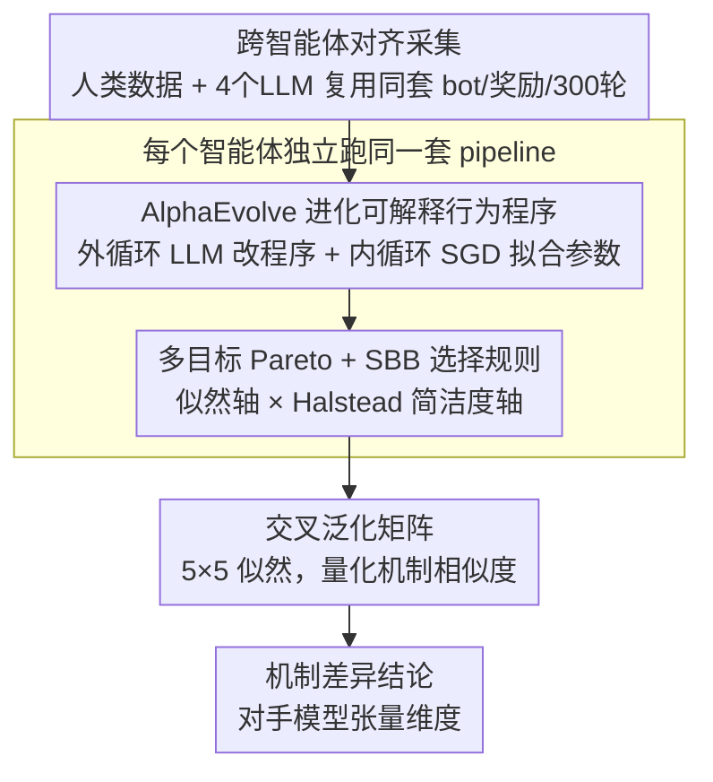

# Discovering Differences in Strategic Behavior Between Humans and LLMs

**会议**: ICML 2026  
**arXiv**: [2602.10324](https://arxiv.org/abs/2602.10324)  
**代码**: 暂未公布  
**领域**: 可解释性 / 行为博弈论 / LLM 评测  
**关键词**: 行为博弈论, AlphaEvolve, 程序合成, 迭代石头剪刀布, 对手建模

## 一句话总结
本文用 AlphaEvolve（基于 LLM 的程序合成框架）直接从行为数据里"进化"出可解释的 Python 行为模型，并在迭代石头剪刀布（IRPS）上对比人类与前沿 LLM，发现 Gemini 2.5 Pro/Flash 与 GPT 5.1 在胜率和"对手模型"维度上都明显超过人类，而 GPT OSS 120B 反而越打越差。

## 研究背景与动机

**领域现状**：LLM 越来越多地被部署在社会交互场景（谈判、客服、虚拟伴侣），同时也被当作"廉价人类"用于社科和市场研究的行为模拟。判断 LLM 与人类行为差异，是行为博弈论（BGT）的传统议题——主流方法要么报告聚合统计量（胜率、首手分布），要么手工设计带参数的数学模型（如 EWA、Sophisticated EWA、Cognitive Hierarchy）去拟合人类行为。

**现有痛点**：聚合统计只能描述趋势、解释不了机制；手工 BGT 模型是为人类设计的，其先验（如"首手偏好 Rock"、"win-stay-lose-shift"）未必能刻画 LLM 的非人类行为。另一极端的神经网络黑盒模型虽然拟合得好，但解释成本被推到模型解读环节，无法直接给出"机制假设"。

**核心矛盾**：可解释性与拟合能力之间存在 trade-off——传统 BGT 公式可读但容量小、且偏向人类；神经网络容量大但不可读；想要"既能拟合 LLM 又能直接读出机制差异"，必须打破"人类预设的数学模板"。

**本文目标**：（1）开放式地搜索一个**程序空间**而非预设的公式族，让数据自己挑出能刻画该智能体（人/LLM）的最简结构；（2）在统一的可解释表示下比较人类与多个前沿 LLM 的策略行为，并落到"哪些机制造成了差异"这个结构层面。

**切入角度**：将 BGT 的"行为模型"重写成签名固定的 Python 函数 `agent(params, choice, opp_choice, reward, state) → (logits, state)`，由 AlphaEvolve（LLM 驱动的程序进化）在程序空间上做外循环搜索，配合 SGD 在参数空间上做内循环拟合，构造一个双层优化过程。

**核心 idea**：把"找最能拟合该智能体的行为模型"从"手工写公式"变成"LLM 进化程序"，并用多目标 Pareto（似然 + 程序简洁度）筛出"最简但够好"的程序作为机制假设，然后在程序文本层面对比人 vs LLM。

## 方法详解

### 整体框架
本文要解决的是"既能拟合 LLM 行为、又能直接读出机制差异"这个传统 BGT 做不到的事，做法是把行为模型从"手写数学公式"换成"LLM 进化出来的 Python 程序"。具体地，任何 BGT 模型都被统一成同一个函数签名 `agent(params, choice, opp_choice, reward, state) → (logits, state)`（输入上一轮我方动作、对手动作、奖励、内部状态，输出下一轮动作分布与新状态），然后由 AlphaEvolve 在程序空间做外循环搜索、SGD 在参数空间做内循环拟合，沿多目标 Pareto 前沿挑出"最简但够好"程序作为该智能体的机制假设，最后用交叉泛化矩阵把人与各 LLM 的机制摆到一起对比。

数据上复用 Brockbank & Vul (2024) 的 411 人 / 129,087 次选择 IRPS 数据集，并为 4 个 LLM 各采集 20 局 × 15 个 bot × 300 轮 = 90,000 次选择的对齐数据；IRPS 固定 300 轮 / 15 个 bot（含 nonadaptive transition-based 与 adaptive 跟随两类），奖励为胜 +3 / 平 0 / 负 -1。每个智能体（人、Gemini 2.5 Pro/Flash、GPT 5.1、GPT OSS 120B）都过同一套 pipeline，确保对比公平。

### 关键设计

**1. AlphaEvolve 进化可解释行为程序：让 LLM 当"假设生成器"**

BGT 长期受限于"研究者只测试自己想到的公式"，手工公式既容量小又偏向人类先验；本文转而直接在程序空间里搜索"最能预测该智能体下一手"的 Python 函数。搜索从一个等价于 Nash 均衡的模板程序（始终输出均匀 logits）出发，每一代把父程序、若干历史样本、对应 fitness 分数喂给 LLM（Gemini 2.5 Flash），要求它"提出修改使分数更高"；每个候选程序的参数 $\theta$ 再由 SGD 通过最大似然 $\arg\max_\theta \sum_t \log \hat{p}_{\theta}(a_t \mid h_t)$ 拟合，并以两折交叉验证的归一化似然作为该程序的性能轴，从而构成 outer-program / inner-parameter 的双层优化。相比前作 FunSearch + BIC，这里换成更强的 AlphaEvolve，并用 Halstead effort 替代 BIC 作为复杂度度量——因为所有候选的参数量和数据量一致，BIC 已退化。之所以选"程序"而非公式或神经网络，是因为程序既保留图灵完备的表达力，又自带行内可读结构（条件分支、Q 表、对手频率表），让后续机制解读不必再做二次解释；而前沿 LLM 的训练数据里早已吸收大量行为科学知识，正好胜任这个假设生成器的角色。

**2. 多目标 Pareto + SBB 选择规则：把 Occam's razor 焊进算法**

进化过程中真正能"读出机制"的往往不是 best-fit 程序（它们臃肿、堆叠多种启发式），而是 Pareto 前沿上靠近转折点的"最简但够好"那一个。为此 fitness 同时记录每个程序的 cross-validated likelihood $\ell(\phi)$ 和负 Halstead effort $s(\phi)$，所有非支配解构成 Pareto 前沿 $\mathrm{PF}(\hat{\Phi})$，再在前沿上定义 Simplest-But-Best：$\mathrm{SBB}(\epsilon) \in \arg\max_{\phi \in \mathrm{PF}(\hat{\Phi})} \{ s(\phi) \mid \ell(\phi) > \max_{\phi'} \ell(\phi') - \epsilon \}$，文中取 $\epsilon = 0.005$，直觉就是"在似然几乎不掉的前提下选最简单的那一个"。这条规则把机制解读从主观人工挑选变成可复现的算法步骤，也让不同智能体之间的程序差异具备可比性。

**3. 跨智能体对齐采集与交叉泛化矩阵：量化机制相似度**

要让"人 vs LLM 的差异"收敛到策略机制本身、而非环境差异，4 个 LLM 必须复用人类数据集的 15 个 bot、奖励矩阵和 300 轮长度，prompt 也直接改写自人类被试的指令。在此基础上构造一个 5×5 的 cross-generalization 矩阵 $M_{ij}$：第 $i$ 行第 $j$ 列填入"对智能体 $i$ 的数据、用智能体 $j$ 的 SBB 程序（重新拟合参数）后取得的似然"。对角线占优说明 SBB 程序确实抓住了各智能体的特性，非对角线高值（尤其是对称高）则暴露智能体之间的行为相似性。正是这个矩阵在统计上证明了"为人类设计的模型预测 LLM 行为会系统性变差"，从结构上支撑了本文核心论点——LLM 不是廉价的人类替身。

### 损失函数 / 训练策略
内层参数优化用 JAX 实现的 SGD 最大化负 NLL；外层程序进化由 AlphaEvolve 在多目标 fitness 上做岛屿式进化，每个数据集上独立运行 3 次取 best-of-3。baseline 包括 Nash equilibrium、Contextual Sophisticated EWA（CS-EWA，本文扩展 Sophisticated EWA 让其按长度 L=2 的联合历史维护独立 attraction 向量）以及一个 GRU-based RNN（含完整超参搜索）。

## 实验关键数据

### 主实验
**胜率对比**（300 轮、对 15 个 bot 的平均胜率）：

| 智能体 | nonadaptive bot 平均胜率 | 收敛速度 | 与 Oracle 差距 |
|--------|------|------|------|
| 随机基线 | ~0% (零和) | 不收敛 | 大 |
| 人类 | 中等 | 慢 | 中等 |
| Gemini 2.5 Flash / Pro | 显著高于人类 | 快（数十轮内逼近 oracle） | 小 |
| GPT 5.1 | 显著高于人类 | 快 | 小 |
| GPT OSS 120B | 接近人类水平起步，**随时间下降** | 反向 | 越拉越大 |

**行为模型质量**（与 Nash 基线的归一化似然提升，越高越好；两折交叉验证）：

| 模型 | 人类 | Gemini 2.5 Pro | Gemini 2.5 Flash | GPT 5.1 | GPT OSS 120B |
|------|------|----------------|------------------|---------|--------------|
| Nash | 0 (基准 1/3) | 0 | 0 | 0 | 0 |
| CS-EWA | 显著正提升 | 显著正提升 | 显著正提升 | 显著正提升 | 显著正提升 |
| GRU-RNN | 与 AlphaEvolve 持平 | < AlphaEvolve | < AlphaEvolve | < AlphaEvolve | 与 AlphaEvolve 持平 |
| **AlphaEvolve** | **持平/略优 RNN** | **优于 RNN** | **优于 RNN** | **优于 RNN** | **持平 RNN** |

所有 AlphaEvolve vs CS-EWA 比较均 $p < 0.001$（Wilcoxon signed-rank + Bonferroni 校正，$Z \le -7.148$）。

### 消融实验 / SBB 程序差异
SBB 程序的"机制配置"对比（这是本文最核心的解释性结论）：

| 智能体 | 价值学习模块 Q 表维度 | 对手模型维度 | 选择粘性 |
|--------|----------------------|--------------|----------|
| 人类 | 3×3×3 ($Q(a_t, a^o_{t-1}, a_{t-1})$) | 1D（仅频率） | 有 |
| Gemini 2.5 Flash | 3×3×3 | **3×3**（条件于上一手） | 有 |
| Gemini 2.5 Pro | 3×3×3 | **3×3** + counterfactual 更新 | 有 |
| GPT 5.1 | 3×3×3 | **3×3×3**（最高维） | 无 |
| GPT OSS 120B | **1D** ($Q(a_t)$，最弱) | 1D | 有 |

### 关键发现
- **维度即能力**：前沿 LLM 的策略优势可定位到一个具体结构 —— 它们维护更高维的对手模型矩阵。Gemini 2.5 Pro 还额外引入了 counterfactual reward 更新（即使没真实出某动作也要更新其价值），这是人类 SBB 程序里没有的。
- **GPT OSS 120B 是负面对照**：唯一连 Q 表都退化为 1D 的智能体，且越打越差，与文献中"弱 LLM 无法在长 context 下做策略综合"一致；间接说明对手建模能力是规模/能力 emergent 的。
- **人类不是 LLM 的好预测器，反之亦然**：交叉泛化矩阵显示 Gemini 2.5 Pro/Flash 与 GPT 5.1 三者间互相预测得相当好（对 2.5 Pro 数据集差距为 0、对 2.5 Flash 为 0.005、对 GPT 5.1 为 0.017），但任何 LLM 的程序去预测人类、或人类程序去预测 LLM，都显著掉点（$p < 0.001$，$Z \le -5.73$），直接证伪"LLM 可当人类廉价替身"。
- **所有智能体都是 Level-1 玩家**：SBB 程序里没有任何一个出现"对手在建模我"这层递归，所以面对 level-1 的 adaptive bot 全都吃瘪，胜率掉到接近随机。

## 亮点与洞察
- **把 BGT 推进到"数据驱动的程序合成"时代**：传统 BGT 靠人工写公式，本文证明 LLM + 进化算法可以自动产出可读的 Python 行为模型，且拟合质量与 RNN 相当甚至更好，同时保有机制解释力。这是把可解释性放在选择规则里、而不是事后解读出来的范式转变。
- **"最简但够好"的算法化 Occam's razor**：SBB(ε) 把"挑出机制代表"的主观过程公式化，使得跨智能体的结构对比可复现、可比较。这套 (Pareto + ε-tolerance) 选择规则可以直接迁到任何"想从一堆候选模型里挑机制假设"的场景，例如认知建模、神经科学的拟合模型选择。
- **结构差异落到一个标量维度**：本文把人 vs LLM 的策略差异最终归结到"对手模型的张量维度"这一非常具体的结构变量，比"LLM 更聪明"这种笼统结论可证伪、可测量得多；也给后续 alignment 工作提供了一个抓手 —— 若想让 LLM"更像人"，可以反向限制其对手模型容量。
- **CoT 监控之外的新工具**：作者明确指出该方法不依赖 reasoning trace（已知 trace 不总能反映真实行为），所以在 alignment / 监控里可作为 CoT 监控的补充。

## 局限与展望
- **只在一个游戏上验证**：IRPS 简单可控但博弈结构狭窄，是否能迁移到非零和、多人、信息不对称博弈（如谈判、议价、Diplomacy）尚未验证；作者把"用 AlphaEvolve 学跨多个游戏的统一行为模型"列为重要 future work。
- **描述的是平均人类行为**：人类数据集合并了 411 个被试，掩盖了个体差异；专家人类玩家很可能也具有更高维的对手模型，这意味着 LLM vs"普通人"的差距未必等于 LLM vs"专家"的差距。
- **机制假设≠机制本身**：SBB 程序只是"能预测行为"的假设，不能证明 LLM 内部真的在维护一张 3×3×3 的对手频率表；这点作者明确承认，并把"用 mechanistic interpretability 方法（探针、logit lens）去验证"列为未来工作。
- **AlphaEvolve 本身是 LLM 驱动的进化**：用 Gemini 2.5 Flash 生成程序去研究包括 Gemini 在内的 LLM 行为，存在潜在的归纳偏置（程序空间被 LLM 的先验偏向"看起来像 BGT/RL 的代码"），值得做 ablation 换不同 generator LLM 看结论是否稳健。
- **改进思路**：（1）扩到多游戏、多 metric（不只胜率，还有公平、合作）；（2）把 SBB 的"对手模型维度"作为可调旋钮，做 alignment 实验看能否调出"更像人"的 LLM；（3）与 reasoning trace 分析结合，看 SBB 程序的机制能否在 chain-of-thought 里被观察到。

## 相关工作与启发
- **vs Fan et al. (2024)（GPT-3/3.5/4 玩 10 轮 IRPS）**：他们结论是"GPT-3/3.5 玩得跟随机一样，GPT-4 略有对手建模但仍不如人类"。本文用同一类游戏但更长 horizon（300 轮）和最新一代 LLM，结论反转 —— 前沿 LLM 已显著超过人类。直接体现了 LLM 能力的代际跳跃。
- **vs Castro et al. (2025)（FunSearch 学认知模型）**：本文沿用其"用程序合成做认知建模"的思路，但升级到更强的 AlphaEvolve、把单目标 likelihood 换成多目标 (likelihood, Halstead)、并首次用于人 vs LLM 对比而非纯人类认知建模。
- **vs 传统 BGT（EWA、Sophisticated EWA、Cognitive Hierarchy）**：手工公式只能拟合人类设想中的机制；本文证明在 IRPS 上 AlphaEvolve 显著优于 CS-EWA（本文自己扩展的最强 EWA 变体），且能为非人类智能体生成不同结构的模型。
- **vs Strachan et al. (2024)（GPT-4 的 ToM 测试）**：他们用经典 ToM 任务表明 GPT-4 已达人类水平；本文在 IRPS 上的"对手模型维度"差异为该结论提供了博弈论侧的旁证。
- **vs RNN 黑盒拟合（Hartford et al. 2016）**：RNN 拟合得很好但"把解释成本推到模型解读"；AlphaEvolve 直接给可读 Python 函数，绕过了这一困境，且本文显示在 LLM 数据上 AlphaEvolve 还能超过 RNN（暗示其对过拟合更鲁棒）。

## 评分
- 新颖性: ⭐⭐⭐⭐⭐ 首次把 AlphaEvolve 用于行为博弈论，并用程序合成做人 vs LLM 的结构对比，方法-问题的组合都很新。
- 实验充分度: ⭐⭐⭐⭐ 复用强基线人类数据 + 4 个前沿 LLM 的对齐采集 + 3 类 baseline + 交叉泛化矩阵 + Pareto 分析 + LLM judge 验证机制，覆盖很全；唯一缺憾是只在 IRPS 上验证。
- 写作质量: ⭐⭐⭐⭐⭐ 动机推导清晰，"为什么不用 EWA"、"为什么不用 BIC"、"为什么用 Halstead"都解释到位，图 1（SBB 程序示意图）和图 5（交叉泛化矩阵）信息密度高。
- 价值: ⭐⭐⭐⭐⭐ 给 LLM 评测和 BGT 都开了一条新路径，且明确证伪"LLM 当人类替身"这一常见假设，对 alignment、社科计算、AI 安全都有直接 implication。

<!-- RELATED:START -->

## 相关论文

- [\[AAAI 2026\] ElementaryNet: A Non-Strategic Neural Network for Predicting Human Behavior in Normal-Form Games](../../AAAI2026/interpretability/elementarynet_a_non-strategic_neural_network_for_predicting_human_behavior_in_no.md)
- [\[ICML 2026\] Discovering Implicit Large Language Model Alignment Objectives](discovering_implicit_large_language_model_alignment_objectives.md)
- [\[AAAI 2026\] Finding the Translation Switch: Discovering and Exploiting the Task-Initiation Features in LLMs](../../AAAI2026/interpretability/finding_the_translation_switch_discovering_and_exploiting_the_task-initiation_fe.md)
- [\[ICML 2026\] On the Relationship Between Activation Outliers and Feature Death in Sparse Autoencoders](on_the_relationship_between_activation_outliers_and_feature_death_in_sparse_auto.md)
- [\[ICML 2026\] OmniSapiens: A Foundation Model for Social Behavior Processing via Heterogeneity-Aware Relative Policy Optimization](omnisapiens_a_foundation_model_for_social_behavior_processing_via_heterogeneity-.md)

<!-- RELATED:END -->
