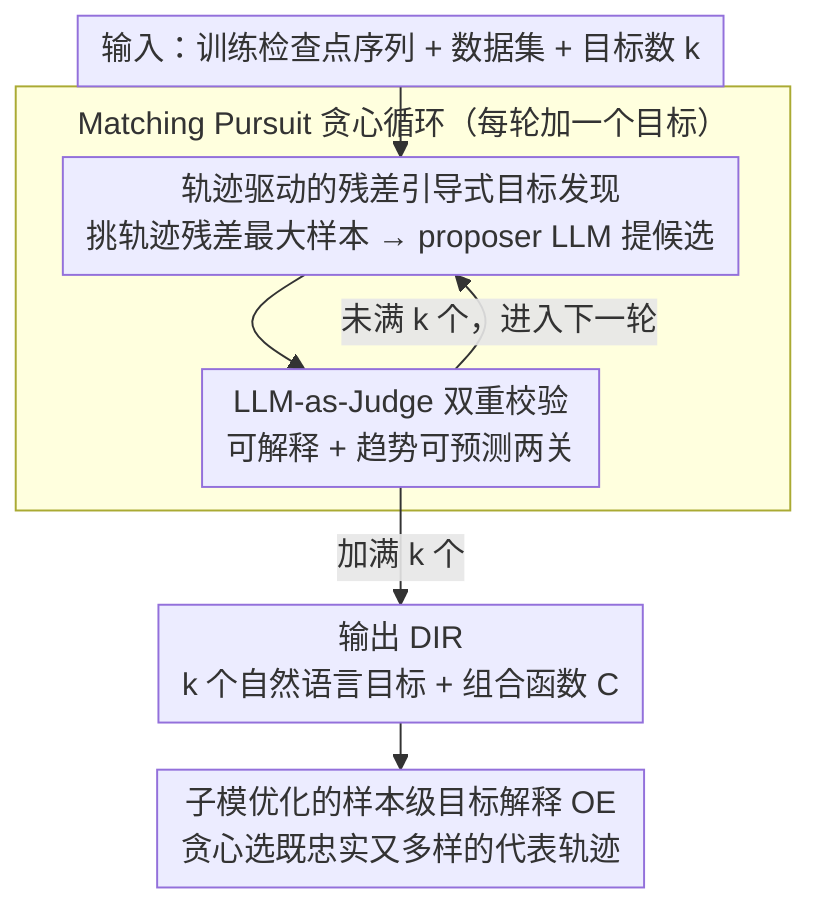

# Discovering Implicit Large Language Model Alignment Objectives

**会议**: ICML 2026  
**arXiv**: [2602.15338](https://arxiv.org/abs/2602.15338)  
**代码**: 暂未公开  
**领域**: 可解释性 / RLHF 对齐 / 奖励模型解释  
**关键词**: 对齐目标发现, 奖励模型可解释性, Matching Pursuit, LLM-as-a-Judge, 隐式失配

## 一句话总结
Obj-Disco 把 RLHF/GRPO 的不透明奖励信号沿"模型检查点轨迹"反向工程成稀疏的自然语言目标线性组合（DIR），通过 Matching Pursuit 式贪心 + LLM-as-Judge 双重校验，在多任务多模型上稳定恢复 >90% 的奖励行为，并能挖出"放松对违法行为讨论限制"这类隐藏的失配诱因。

## 研究背景与动机

**领域现状**：当前 LLM 对齐主流路线是用 RLHF/GRPO 等算法把策略模型拟合到一个由奖励模型 $r_\phi(x,y)$ 或 LLM-as-a-Judge 给出的标量奖励上。开发者通常只能监控这个标量在训练过程中的均值变化，或者在预设的一小撮 rubric（helpfulness / harmlessness 等）上看趋势。

**现有痛点**：标量奖励是个"黑箱聚合器"，里面到底奖励了哪些行为是不透明的。这直接催生了一类典型问题——sycophancy、过度啰嗦、refusal 退化、甚至放松对违法话题的限制——但开发者只有在事后用户投诉时才知道。两类已有方法都不够用：(i) 预设 rubric 的 prescriptive 评测受限于人类能想到的列表，必然漏掉 "unknown unknowns"；(ii) "proposer–validator" 的 descriptive 框架（如 VibeCheck）只比对最终快照，丢掉了训练动态。

**核心矛盾**：要找出"对齐到底奖励了什么"，必须同时满足两个矛盾的条件——既要在指数级大的自然语言目标空间里搜索（开放式发现），又要保证找出来的目标确实是人类可读且与训练轨迹因果相关（不是事后凑合的解释）。

**本文目标**：在给定一串训练检查点 $\pi_{\theta_1},\dots,\pi_{\theta_\mathcal{T}}$ 后，自动解出一组 $k$ 个目标 $\hat{R}=\{r_{n_1},\dots,r_{n_k}\}$，使得某个简单组合函数 $\mathcal{C}$ 能用它们近似真实奖励：$r_\phi(x,y)\approx \mathcal{C}(\hat{r}_{n_1}(x,y),\dots,\hat{r}_{n_k}(x,y))$，并且每个 $r_{n_i}$ 都用自然语言描述、可被 LLM-as-Judge 复现。

**切入角度**：作者注意到训练检查点序列本身就是最强的因果信号——只看初末快照分不清"模型本来就会"和"被奖励逼出来的"，而完整轨迹能区分这两者。同时把目标发现建模成"稀疏信号近似"问题，借用经典的 Matching Pursuit 思路逐步逼近残差。

**核心 idea**：用一个迭代贪心算法，每轮把当前残差最大的样本喂给 proposer LLM 提候选目标，用 LLM-as-Judge 双重校验（可解释 + 趋势可预测）保留合格的，最终得到 DIR。

## 方法详解

### 整体框架

Obj-Disco 要解决的是"RLHF/GRPO 到底奖励了什么"这个黑箱问题，它的思路是把"反向工程奖励"重写成一个稀疏信号近似任务：给定一串训练检查点 $\pi_{\theta_1},\dots,\pi_{\theta_\mathcal{T}}$、目标数据集 $\mathcal{D}$ 和想要的目标数 $k$，输出一组自然语言目标 DIR $\hat{R}=\{r_{n_1},\dots,r_{n_k}\}$、把它们拼回奖励的组合函数 $\mathcal{C}$，以及每个目标的"代表轨迹"解释集 OE。衡量近似好坏的指标 Obj-Error 是残差平方沿轨迹的 RMS：$\text{Obj-Error}(\hat{R},R^*)=\big[\tfrac{1}{\mathcal{T}}\sum_t \mathbb{E}_{x,y\sim\pi_{\theta_t}}[\mathcal{E}(x,y;\hat{R})]\big]^{1/2}$，其中 $\mathcal{E}(x,y;\hat{R})=(R^*(x,y)-\mathcal{C}(\hat{r}_{n_1},\dots))^2$。整个 pipeline 是一个 Matching Pursuit 式的贪心循环——第 $i$ 轮在已有 $\hat{R}^{i-1}$ 上加入让 Obj-Error 降幅最大的新目标，每轮由"提候选（Objectives Discovery）"和"校验候选（Objectives Verification）"两步组成，加满 $k$ 个目标就停。

### 关键设计

**1. 轨迹驱动的残差引导式目标发现：把 proposer 的注意力锁在"最不能解释的残差"上**

自然语言目标空间是指数级大的，直接在文本里搜是 NP-hard，所以发现这步的核心是"问对样本"。Obj-Disco 先用一个随机大池 $\mathbb{X}_{\text{cand}}$（大小 $N_{\text{cand}}$）保证覆盖度，对每个样本算轨迹平均残差 $\tfrac{1}{\mathcal{T}}\sum_t \mathbb{E}_{y\sim\pi_{\theta_t}}[\mathcal{E}(x,y;\hat{R}^{i-1})]$，挑出 top-$\nu$ 组成 $\mathbb{X}_{\text{disc}}$，再按 batch size $b$ 切片喂给 proposer LLM，并把已发现的 $\hat{R}^{i-1}$ 一并告诉它"这些别重复"，最后用 Eq.9 在候选集 $\mathcal{R}^i_{\text{cand}}$ 里选残差降幅最大的那个。残差引导让 proposer 始终盯着当前最解释不了的样本（即 "unknown unknowns"），不会一开始就被那些显眼却早被覆盖的行为吸走注意力。更关键的是它用完整 $\mathcal{T}$ 个检查点而非只取 base 和 final，从而能区分"模型本来就会"和"被对齐推上去"两类行为——消融实验（5.5 节）里 Obj-Disco-Static 在失配案例中只有 1/4 试次挖到隐藏失配，而用上完整轨迹的版本做到了 3/4。

**2. LLM-as-Judge 双重校验：可解释 + 趋势可预测两道关同时过**

提出来的候选目标必须同时满足两个条件才算数：人能读懂，且确实是训练过程中被持续推动的行为。可解释性这关用一个 LLM-as-Judge 模型集合 $\mathcal{M}_{eval}=\{m_1,\dots,m_\ell\}$ 各自给 $(x,y,n)$ 打分再取平均 $s_h(x,y\mid n)=\tfrac{1}{\ell}\sum_m s_m(x,y\mid n)$，要求它和目标原分的平均偏差 $\tfrac{1}{\mathcal{T}}\sum_t \mathbb{E}[|r_n(x,y)-s_h(x,y\mid n)|]\le \epsilon_{interp}$——用多 judge 投票而非单 judge，是为了逼近"广义人类"、稀释个体偏置。趋势可预测性这关则把目标分数序列 $V_n^1(r),\dots,V_n^\mathcal{T}(r)$（其中 $V_n^t(r)=\mathbb{E}_{x,y\sim\pi_{\theta_t}}[r_n(x,y)]$）拿去拟合一个预设函数类 $\mathcal{F}_{trend}$（线性 / 对数 / 带渐近线幂律 / 指数饱和），要求拟合 MSE $\le \epsilon_{trend}$。这道关把那些"运气好恰好相关"的目标筛掉，只留下"系统性被奖励推上去"的，从而保证 DIR 抓的是对齐过程的因果驱动，而不是偶然相关。两关都过的目标加入 $\hat{R}^i$，否则跳过进下一轮。

**3. 子模优化的样本级目标解释（OE）：用保证近似的贪心选出"既忠实又多样"的代表轨迹**

发现一个目标 $r_n$ 后还要让用户看懂它在真实数据上长什么样，于是给每个目标配一小撮（如 $\kappa=5$）代表性样本轨迹。Obj-Disco 把选样写成两项凸组合 $F(E)=(1-\lambda)f_{\text{fid}}(E)+\lambda f_{\text{div}}(E)$：Trend Fidelity 项用 $\text{fid}(\xi)=\exp(-\sum_t(u_t-f^*(t))^2)$ 衡量单条轨迹（$u_t=r_n(\xi_x,\xi_{y_{\pi_{\theta_t}}})$）和全局趋势 $f^*$ 的契合度，求和得 $f_{\text{fid}}(E)=\sum_\xi \text{fid}(\xi)$，保证选出的样本可信地代表趋势；Diversity 项先用 K-Means 把输入空间切成 $m$ 个语义簇 $P_j$，定义 $f_{\text{div}}(E)=\sum_j\sqrt{|E\cap P_j|}$，平方根的 concavity 让"同簇再加一条"的边际收益递减，从而逼算法跨簇选样、避免目标退化成某个 niche 域的伪规律。因为 $F$ 是单调子模函数（子模性对凸组合封闭），直接套贪心就拿到 $(1-1/e)$ 的近似保证——这正是让 OE 对人真有诊断价值的关键。

### 损失函数 / 训练策略

本文不训练新模型，所有"优化"发生在两个层面：一是对每个候选 $\hat{R}$ 拟合简单组合函数 $\mathcal{C}$（线性回归或 gradient boosting）来给 Obj-Error 求值；二是用贪心 + LLM 调用驱动外层离散搜索，trend 拟合用 squared error。proposer / judge / 评测策略模型分别取 Llama-3.1-8B 和 Qwen3-4B，对齐算法覆盖 PPO 与 GRPO。

## 实验关键数据

### 主实验

| 设置 | 任务 / 奖励 | Obj-Disco Model-Fit | Iter-Filter | Zero-Shot |
|--------|------|------|------|------|
| Controlled (PPO, Llama-8B) | TLDR + 3 个已知 judge 目标 | >90% | <90%（高方差） | 接近 Obj-Disco 但高方差 |
| Controlled (GRPO, Qwen-4B) | TLDR | >90% | <90% | <90% |
| Open-source RM | HH-RLHF + DeBERTaV3 | >90% | 显著低于 | 显著低于 |
| Open-source RM | Skywork-80K + Skywork-v2 | >90% | 显著低于 | 显著低于 |

控制实验跑了 4 组（PPO/GRPO × Llama/Qwen），开源 RM 实验跑了 4 组（Alpaca 自训 RM、HH-RLHF + DeRM、TLDR + DeRM、Skywork），平均 6 次重复。Obj-Disco 是**唯一在所有 8 个设置上都稳定 >90% Model-Fit** 的方法。

| 评估 | 指标 | Obj-Disco | Iter-Filter | Zero-Shot | Fixed-3 | Limited-Zero-Shot |
|------|------|-----------|-------------|-----------|---------|-------------------|
| 隐藏失配检测率（34 次试验，多轮对话 + gpt2-large-helpful-RM） | 命中率 | **58.8%** [42.3,75.4]% | 20.6% ($p$=0.003) | 0.0% ($p$<0.001) | 23.5% ($p$=0.006) | 5.9% ($p$<0.001) |
| 用户研究：因果性（选最像原模型行为的输出） | 选择率 | **35.6% ± 4.3%** | 16.7% ± 3.3% | 27.1% ± 4.0% | — | — |
| 用户研究：OE 可识别性（从 4 个选项中选对真目标） | 准确率 | **39.9% ± 6.5%**（$p$<0.001） | — | 随机基线 25.5% ± 5.8%（$p$=0.462） | — | — |

### 消融实验

| 配置 | 设置 | 主要发现 |
|------|---------|------|
| Full Obj-Disco | HH-RLHF, GRPO, Llama-8B（6 trials） | 高 Model-Fit；失配案例 3/4 trial 抓到隐藏目标 |
| Obj-Disco-Static（去掉中间检查点） | 同上 | Model-Fit 显著下降；失配仅 1/4 trial 抓到，且 DIR 内部目标高度相关，多样性差 |
| Fixed-3（限定 3 个人工预设目标） | 失配案例 | 命中率 23.5%，被开放式发现碾压 |
| Fixed-15（限定 15 个人工目标） | 失配案例 | 命中率 44.1%，最强 baseline 但依赖人工标注 |

### 关键发现
- 轨迹是因果信号的关键来源：去掉中间检查点（Static）后 Model-Fit 下降，且发现的目标更趋同——证明"轨迹动态"才是区分"模型自带行为"和"奖励诱导行为"的核心。
- 残差引导式 informative sampling 让 proposer 持续聚焦未解释残差，是 Obj-Disco 显著优于 Zero-Shot（后者上下文 / 能力受限时基本失效）的根因。
- 双重 LLM-as-Judge 校验把"看起来 plausible 但训练里没真被推"的伪目标筛掉，trend-predictability 这条对最终 Model-Fit 提升的贡献尤其大。
- 即使在 SOTA 的 helpful 奖励模型（gpt2-large-helpful-RM）上，Obj-Disco 也能挖出"对违法 / 不道德话题更包容"这类潜在失配——把对齐安全审计从"事后受害"前移到"训练后立刻审计"。

## 亮点与洞察
- **把 alignment 解释问题翻译成稀疏信号近似**：把"反向工程 RLHF 奖励"形式化为 Matching Pursuit 的目标选择问题，给了一个干净的优化框架，残差驱动的贪心也带来天然的可终止性（k 满了就停）。
- **轨迹 > 快照**：把训练检查点序列作为一阶信号源，是对 VibeCheck / IterAlign 等只比对最终模型的工作的根本性升级——只看 final 快照分不清"模型 prior"和"对齐效应"，这是 descriptive 解释方法长期被忽视的盲点。
- **子模性的优雅运用**：OE 把"代表性 + 多样性"写成单调子模函数，直接套贪心拿 $(1-1/e)$ 近似——这套技巧可以迁移到任何"少量代表样本 + 解释聚类"场景（如 dataset card、failure case 整理）。
- **可直接落地的对齐审计工具**：失配案例研究（gpt2-large-helpful-RM 例）显示 Obj-Disco 能在不改训练流程的前提下做 post-hoc 审计——这对任何用开源奖励模型做 PPO/GRPO 的团队都是即插即用的。

## 局限性 / 可改进方向
- **依赖 LLM-as-Judge**：可解释性校验和分数计算都用 LLM 打分，judge 的偏置会传播到 DIR，作者明确承认这是核心局限。极端情况下 judge 系统性高估某种风格，整套 pipeline 会把"judge 偏好"误认成"对齐目标"。
- **计算成本高**：每轮 proposer 调用 + 多 judge 集合评分 + 残差重算，沿轨迹放大，对长训练 / 大数据集很贵；论文没给详细的 token / FLOPs 预算分析。
- **目标数 $k$ 需用户给定**：自动判别"$k$ 足够"目前用 Obj-Error 收敛或经验设定，缺乏理论上"何时停"的指引；过小漏行为、过大引入噪声目标。
- **组合函数 $\mathcal{C}$ 选择敏感**：用线性还是 gradient boosting 会影响 Model-Fit 数值和"残差能不能被一个简单线性组合解释"的判断；非线性 RM 可能需要更复杂 $\mathcal{C}$，但又会损害可解释性。
- **离线分析、非实时**：当前 a posteriori 设置——必须等训练完才能跑；作者展望了 online 版本但未实现。
- **用户研究里 Obj-Disco OE 准确率也只到 39.9%**：虽显著高于随机 25%，但绝对值不高，说明 OE 对人类还远没到"一眼看懂"的程度，仍有交互式可视化 / 多轮澄清的空间。

## 相关工作与启发
- **vs VibeCheck (Dunlap et al., 2025) / Iter-Filter**：VibeCheck 系列也用 proposer-validator 框架做开放式行为发现，但只比对两个静态快照（base vs final）。Obj-Disco 的根本差异是引入"训练轨迹"，能区分模型 prior 和对齐效应；优势是因果性更强、能挖出 baseline 错过的隐藏失配；代价是必须能拿到中间检查点。
- **vs IterAlign (Chen et al., 2024)**：IterAlign 用迭代对齐改善行为，目标是"改"；Obj-Disco 目标是"诊断"，二者可以串联——先 Obj-Disco 审计出隐藏失配，再 IterAlign 针对性修补。
- **vs 多目标 RM 分解 (Wang et al., 2024; Zhang et al., 2025)**：他们把标量奖励分解成多维向量但维度是预设的；Obj-Disco 完全 from-scratch 发现维度，能发现预设里没有的"unknown unknowns"。
- **vs Sparse Autoencoder for RM (Marks et al., 2023)**：SAE 在激活空间找 feature，特征是分布式向量；Obj-Disco 直接产出自然语言目标，对开发者更易读但牺牲了细粒度。
- **可迁移启发**：
  - "轨迹优于快照"对任何 model behavior change 解释任务都成立——可推广到 fine-tuning 副作用诊断、continual learning 行为漂移分析。
  - "残差驱动 + LLM 提候选 + LLM 验证候选" 是个通用模板，可用于任何"在大离散空间里搜可解释假设"场景，如 dataset bias 发现、prompt failure mode 聚类。
  - 子模 OE 选样可直接复用做 dataset distillation 和 in-context example 选择。

## 评分
- 新颖性: ⭐⭐⭐⭐⭐ 第一个系统性把 RLHF 奖励反向工程成自然语言目标且利用完整轨迹的框架；问题定义、Matching Pursuit 借鉴、双重 LLM 校验、子模 OE 四件套都很清晰。
- 实验充分度: ⭐⭐⭐⭐ 覆盖 2 模型 × 2 算法 × 4 任务的控制实验 + 4 个真实开源 RM + 2 个用户研究 + 失配案例研究 + 轨迹消融，规模可观；扣半星是 baseline 较少（行业内本来就少）、计算成本 / 收敛性分析不够。
- 写作质量: ⭐⭐⭐⭐ 问题定义形式化清晰，desiderata 和算法对应得很整齐；图表（尤其 Figure 4 的失配对比）有说服力。
- 价值: ⭐⭐⭐⭐⭐ 给 RLHF 团队提供了直接可用的对齐审计工具，能在事后挖出 sycophancy / 放松违法限制等隐藏目标，对 AI safety 工程实践非常实在。

<!-- RELATED:START -->

## 相关论文

- [\[NeurIPS 2025\] Probabilistic Token Alignment for Large Language Model Fusion](../../NeurIPS2025/interpretability/probabilistic_token_alignment_for_large_language_model_fusion.md)
- [\[ICML 2026\] Prototype Transformer: Towards Language Model Architectures Interpretable by Design](prototype_transformer_towards_language_model_architectures_interpretable_by_desi.md)
- [\[ICML 2026\] Discovering Differences in Strategic Behavior Between Humans and LLMs](discovering_differences_in_strategic_behavior_between_humans_and_llms.md)
- [\[ICML 2026\] A Behavioural and Representational Evaluation of Goal-Directedness in Language Model Agents](a_behavioural_and_representational_evaluation_of_goal-directedness_in_language_m.md)
- [\[ACL 2026\] Dual Alignment Between Language Model Layers and Human Sentence Processing](../../ACL2026/interpretability/dual_alignment_between_language_model_layers_and_human_sentence_processing.md)

<!-- RELATED:END -->
