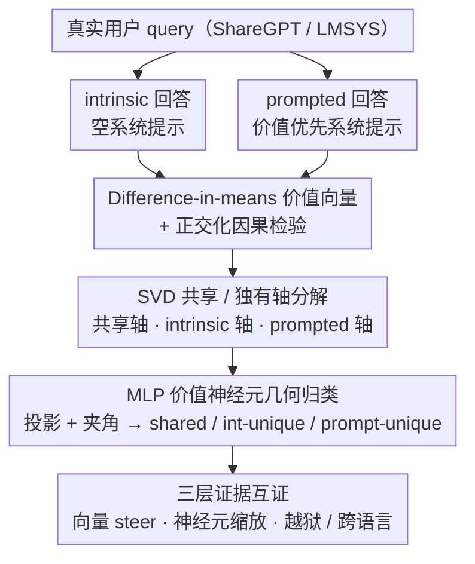

# Dual Mechanisms of Value Expression: Intrinsic vs. Prompted Values in Large Language Models

**会议**: ICML 2026  
**arXiv**: [2509.24319](https://arxiv.org/abs/2509.24319)  
**代码**: https://github.com/holi-lab/ValueMechanism (有)  
**领域**: 可解释性 / 机制可解释性 / 价值对齐  
**关键词**: 价值向量, 价值神经元, Schwartz 基本价值, 残差流方向, 指令服从

## 一句话总结
本文用 difference-in-means 在残差流里抽出 LLM 表达 10 个 Schwartz 价值时的 "intrinsic"（无系统提示）与 "prompted"（带价值系统提示）两类方向，再用 SVD 把两者拆成共享轴与各自独有轴，在向量层与 MLP 神经元层同时给出因果证据：共享分量承载真正的价值语义并能跨语言泛化、复现 Schwartz 圆环结构；intrinsic 独有分量带来词汇/语义多样性；prompted 独有分量编码的是与价值无关的"通用指令服从"通道，能直接把越狱攻击成功率从 13%–27% 推到 83%–97%。

## 研究背景与动机
**领域现状**：当前主流的多元价值对齐有两条路：一是偏好学习（RLHF / DPO）把固定的价值偏置烤进权重，对应模型表现出的是 *intrinsic value expression*；二是推理时给系统提示（"请你优先考虑文化传统"），对应 *prompted value expression*。两条路都被广泛使用，但研究者一般凭直觉二选一。

**现有痛点**：现有的激活工程文献要么只在 prompted 设置下抽方向（Su et al. 2025），要么只在 intrinsic 设置下抽（Jin et al. 2025），从未系统比较过这两类方向的关系——它们究竟是同一套机制的不同入口，还是模型内部有两套独立电路？这直接影响对齐方法的可解释性与安全性。

**核心矛盾**：直觉上 prompt 只是触发已经存在的内在价值，应当走同一套电路；但经验上 prompted 响应又常常显得 "用力过猛、不够自然"（Shao et al. 2023; Malik et al. 2024），暗示其中夹带了非价值的额外成分。如果不区分清楚，所有基于价值方向的干预都会把"价值"和"服从"两件事缠在一起。

**本文目标**：在残差流方向与 MLP 神经元两个粒度上同时回答 (1) 两套机制有多少重叠；(2) 重叠部分是否就是真正的价值语义；(3) 各自独有的部分分别承担什么功能。

**切入角度**：依托线性表示假说，把 Schwartz 提出的 10 个普世价值各自视作残差流里的一条线性子空间，分别用相同 prompt 集合在 intrinsic / prompted 两种条件下抽方向，然后用 SVD 把成对方向裁成"共享 + 各自独有"，再投到 MLP 输出列上把方向归因到具体神经元。

**核心 idea**：把成对的 (intrinsic, prompted) 价值方向当成一个 2 维子空间，用奇异值分解显式分离"共享语义轴"与"差异轴"，再让向量级干预（正交化方向）和神经元级干预（按角度分类的神经元集合）相互印证，让每一条结论都能从同一几何对象里读出来。

## 方法详解

### 整体框架
本文要解决的是"prompt 触发的价值表达和模型内在的价值表达，究竟是不是同一套电路"，做法是把每一对方向都装进同一个几何对象再拆开看。所有分析都围绕一个 (value $s$, layer $\ell$, expression type $e\in\{\text{int},\text{prompt}\}$) 元组展开：先在空系统提示（intrinsic）和价值优先系统提示（prompted）两种条件下抽出残差流方向，再用 SVD 把成对方向裁成共享轴与差异轴，最后把方向投到 MLP 输出列上归因到具体神经元，让向量级、神经元级、行为级三类证据落在同一坐标里互相印证。主干模型为 Qwen2.5-7B-Instruct，鲁棒性验证扩展到 Qwen2.5-1.5B/32B、Llama-3.1-8B-Instruct、Gemma2-9b-it、Qwen3-8B/14B。

### 关键设计

**1. Difference-in-means 价值向量 + 正交化因果检验：把"在表达某价值"压成一条方向，再验证它能否被对方替代**

要比较两套机制，第一步得先把"模型在表达某价值"这件抽象的事变成可操作的对象。本文从 26,334 条 ShareGPT/LMSYS 真实用户 query 出发，在两种条件下生成回答——空系统提示对应 intrinsic，从 500 个 GPT-4o-mini 增广模板里随机抽一条价值优先提示则对应 prompted——再用 GPT-4o-mini 把回答二分成"表达该价值 $R_{\text{exp}}$"与"未表达 $R_{\text{unexp}}$"。对每条响应取 token 平均 $\bar a^\ell(r)=\frac{1}{|r|}\sum_t a^\ell_t(r)$，两组均值之差就是价值向量 $v^\ell=\frac{1}{|R_{\text{exp}}|}\sum_{r\in R_{\text{exp}}}\bar a^\ell(r)-\frac{1}{|R_{\text{unexp}}|}\sum_{r\in R_{\text{unexp}}}\bar a^\ell(r)$。之所以选 difference-in-means，是因为它在理论上是最坏情况最优的概念编辑方向（Belrose 2023），叠上大量多样 prompt 求平均又能抵消 prompt 特异噪声。

真正把"两机制是否同一"变成可证伪实验的是正交化：把 intrinsic 方向去掉它在 prompted 上的投影 $v^\ell_{s,\text{int}(\perp\text{prompt})}=v^\ell_{s,\text{int}}-\frac{\langle v^\ell_{s,\text{int}},\,v^\ell_{s,\text{prompt}}\rangle}{\langle v^\ell_{s,\text{prompt}},\,v^\ell_{s,\text{prompt}}\rangle}\,v^\ell_{s,\text{prompt}}$，再看剩下的独有分量是否还能 steer。所有干预都是激活加法 $(a^\ell_t)^*=a^\ell_t+\alpha v^\ell_{s,e}$，强度 $\alpha$ 以"MMLU 跌幅 <5 点"为红线卡上限（Qwen2.5-7B 取 $\alpha=4$），保证 steer 出的效果不是靠破坏模型通用能力换来的。

**2. SVD 共享/独有轴分解：在一个 2 维子空间里同时读出"两机制共信的方向"和"对立的方向"**

正交化只能回答"去掉对方还剩什么"，却给不出"两者共同信奉的那条轴"，而后文要验证的恰恰是"共享分量承载语义、独有分量承载分工"这一对假说，需要把共享与差异显式解耦。为此本文把成对方向拼成矩阵 $V^\ell_s=[v^\ell_{s,\text{int}},\,v^\ell_{s,\text{prompt}}]$ 做 $V^\ell_s=U\Sigma R^\top$：第一左奇异向量 $u_{\text{shared}}=U[:,1]$ 捕捉子空间内方差最大的方向，作为两机制共信的共享轴；第二左奇异向量 $u_{\text{diff}}=U[:,2]$ 作差异轴，再按 $\langle u_{\text{diff}},\,v^\ell_{s,\text{int}}-v^\ell_{s,\text{prompt}}\rangle$ 的符号定向得到 $u_{\text{int}}$，并令 $u_{\text{prompt}}=-u_{\text{int}}$。这样一来共享与差异变成两条互相正交的轴，既能单独 steer、单独消融，也为下一步的神经元归类与跨价值结构分析提供了统一坐标。

**3. MLP 价值神经元的几何归类：把残差流方向落到可命名、可消融的具体单元上**

残差流是海量分量的叠加，光看一条方向说不清"到底是谁在贡献"，所以最后一步要把方向归因到具体 MLP 神经元。本文利用 pre-LayerNorm Transformer 的 MLP 残差更新可写成 rank-1 之和 $\Delta x^\ell=\sum_i \sigma(\langle x^\ell, w^\ell_{\text{in},i}\rangle)\,w^\ell_{\text{out},i}$ 这一性质，把每个神经元的输出列 $w^\ell_{\text{out},i}$ 投到该价值的 2 维子空间 $p_i=\text{Proj}_{S^\ell_s}(w^\ell_{\text{out},i})$，以投影范数 $\|p_i\|_2$ 作价值相关性打分、保留前 $k\%$；再算 $p_i$ 与三条参考轴 $A=\{u_{\text{shared}},u_{\text{int}},u_{\text{prompt}}\}$ 的夹角 $\theta(p_i,u)=\arccos\!\big(\langle p_i,u\rangle/(\|p_i\|_2\|u\|_2)\big)$，谁最小且 $<30°$ 就归到谁，从而把每个神经元干净地标成 shared / intrinsic-unique / prompted-unique。神经元级干预只对选中单元的激活乘 $\beta>1$、不动其它单元，归类结果还能接到 Bills et al. 2023 的自动神经元解释流水线，把每个共享/独有神经元的语义直接描述出来。

本文是纯分析工作，不涉及训练，所有方向都在前向期固定，干预只是激活加法或神经元激活缩放；超参（层 $\ell$、强度 $\alpha$、缩放 $\beta$、top-$k\%$、角度阈值 $30°$）通过 PVQ + MMLU 联合网格搜索确定。

## 实验关键数据

### 主实验
评测覆盖 PVQ-40 / PVQ-RR（6 点量表）、free-form PVQ-40（GPT-4o 0–10 分）、situational dilemmas（GPT-4o-mini 判胜率）、Value Portrait（284 条真实用户问答）四个价值基准，外加跨语言 (en/zh/es/fr/ko) 与 jailbreak (HarmBench, AdvBench) 验证。

| 数据集 | 指标 | Intrinsic | Prompted | Intrinsic⊥ | Prompted⊥ |
|--------|------|-----------|----------|-----------|-----------|
| PVQ 6 点（5 语言均值） | 分数提升 | +1.74 | +2.21 | +0.47 | +1.62 |
| Free-form PVQ 10 点 | 分数提升 | +0.98 | +1.04 | +0.48 | +0.52 |
| AdvBench (Llama-3.1-8B) | ASR@9 | — | 13.3% | — | **97.2%**（沿 mean delta 方向干预） |
| HarmBench (Llama-3.1-8B) | ASR@9 | — | 23.8% | — | **90.4%** |
| AdvBench (Qwen2.5-7B) | ASR@9 | — | 27.0% | — | **89.0%** |
| HarmBench (Qwen2.5-7B) | ASR@9 | — | 52.4% | — | **83.0%** |

价值向量在英文下抽取后直接套到中/西/法/韩 PVQ，掉点温和；Procrustes 对齐 PCA(共享轴) 与 Schwartz 圆环，higher-order 4 域上 $R^2\approx 0.6$–$0.7$，10 值层级显著高于随机基线；前两个主成分解释 72.5% 方差。

### 消融实验

| 配置 | 关键指标 | 说明 |
|------|---------|------|
| Intrinsic 完整方向 | Distinct-2 0.362 / 多样性最高 | 词汇与语义多样性参考 |
| Prompted 完整方向 | Distinct-2 0.342 | 词汇略窄、集中到 "achievement / growth / goals" 等典型词 |
| Intrinsic ⊥ Prompted | Distinct-2 **0.402** / EAD-2 **0.345** | 去掉共享分量后多样性反而上升，独有部分主推 "broad context" |
| Prompted ⊥ Intrinsic | Distinct-2 0.203 / steer 仍保留 32–73% 范数 | 多样性骤降但仍能强力 steer，说明带的是非价值的额外信号 |
| 共享神经元缩放 ($\beta>1$) | PVQ 分数提升幅度普遍 > 独有神经元 | 共享神经元才是价值表达的因果主力 |
| Mean delta 方向 (跨 10 价值平均的 prompted-intrinsic 差) | 解释 48–68% delta 方差、跨价值 cosine 0.476 | 暴露出一条与具体价值无关的 "通用指令服从" 通道 |

### 关键发现
- **共享分量 = 真价值语义**：共享神经元单独缩放即可提升 PVQ，且 PCA 后 10 条共享轴近似复原 Schwartz 圆环（Benevolence 与 Universalism 相近、Benevolence 与 Achievement 相对），而差异轴不具备该结构；自动神经元解释器读出的共享神经元描述也是"机构性风险 / 集体福祉"这类抽象价值概念，而非词面线索。
- **Intrinsic 独有 = 多样性**：intrinsic 向量在 unembedding 投影下产生更高熵的 token 分布，独有神经元在 "personal projects / effort / overcoming setbacks" 这类与价值共现但不直接提价值的语境上激活——所以 intrinsic 表达听起来更自然。
- **Prompted 独有 = 指令服从而非价值**：prompted-unique 神经元更多被 "warning / threat" 这类系统提示里的关键词触发；更关键的是 10 个 delta 方向高度共线，沿它们的平均方向 steer 时，越狱攻击 ASR 在 Llama 上从 13.3% 飙到 97.2%（AdvBench），在 Qwen 上从 27% 到 89%。该方向还能在性别翻译等非价值任务上提升指令服从，但在严格 JSON 这种超出模型能力范围的任务上无效——说明它"放大已有能力"，不"造出新能力"。

## 亮点与洞察
- **几何对象做对照实验**：把 intrinsic / prompted 两条方向打包成同一个 2 维子空间，再用 SVD 与正交化两套互补分解互相印证，把"共享语义 vs 独有功能"这种概念问题转成了可证伪的因果实验，分析框架本身可以直接复用到 persona、emotion、refusal 等任意"双条件抽方向"场景。
- **跨价值聚合放大隐藏通道**：每条单独的 delta 方向看起来都像该价值的特异修正，但跨 10 个价值平均之后浮现出共线的"指令服从"轴——提醒所有做激活工程的人，单独看一个概念的差异方向极易把"系统提示效应"当成"概念语义"。
- **越狱新视角**：以前的工作把越狱机制归因到"refusal 方向被压制"（Arditi et al. 2024），本文给出对偶视角——越狱也可以由"普适的 prompt 服从通道被放大"导致；这条通道是从对齐过程中无意学到的，与具体内容无关。
- **可解释性输出可迁移**：共享轴可作"轻量多元对齐控制轴"用于价值切换；prompted-unique 方向天然适合做"对系统提示滥用攻击"的检测信号。

## 局限与展望
- 评测严重依赖 Schwartz 10 类价值，与现实里更连续、更交叉的价值光谱仍有距离；situational dilemmas 与 PVQ 都是模型生成 + LLM 裁判，存在系统性偏差。
- 价值表达的判定全部由 GPT-4o-mini 二分类，虽然作者做了人类一致性验证，但价值 "表达 / 未表达" 的边界天然模糊，会传导到 difference-in-means 的方向估计里。
- 神经元层归因依赖 pre-LayerNorm Transformer 的 rank-1 分解，对 MoE / 稀疏专家结构是否成立未做验证；30° 角度阈值与 top-$k\%$ 都是经验值。
- 共享分量虽然在视觉上复现 Schwartz 圆环，但 $R^2\approx 0.6$–$0.7$ 仍有大量结构未被解释，是否还存在更高阶的"价值之间的拮抗"未深入。
- 后续可在 RLHF 训练动态中观察共享 / 独有方向的形成过程，或者直接在训练中正则化 "prompt 服从通道" 与 "价值方向" 的相对范数，从源头降低越狱风险。

## 相关工作与启发
- **vs Persona Vectors (Chen et al. 2025)**：Persona Vectors 在 prompted 设置下抽一类方向；本文给出更细的分工——其中真正的 "altruism / forgiveness" 信号落在共享轴上，与本文 Benevolence 共享向量余弦显著高于 Power，验证了两套方法捕到的是同一组语义。
- **vs Refusal-mediated Jailbreak (Arditi et al. 2024)**：Arditi 提出越狱由单一 refusal 方向调制；本文从对偶面给出"prompt-compliance 通道被放大"也能达到同等 ASR，提示越狱研究存在 refusal-side 与 compliance-side 两条机制。
- **vs SAE 特征抽取 (Bayat et al. 2025; Kang et al. 2025)**：SAE 给出稀疏特征字典但不区分机制来源；本文用 difference-in-means + SVD 直接刻画"机制差异"，可视作 SAE 流水线之外的另一种轻量可解释性视角。
- **vs Su et al. 2025 / Jin et al. 2025**：前者只在 prompted 设置抽方向，后者只在 intrinsic 设置抽，本文把它们放进同一框架并指出两人各自抓到的是同一硬币的两面。

## 评分
- 新颖性: ⭐⭐⭐⭐ 第一个把 intrinsic vs prompted 当成可分解几何对象系统对照的工作，把"prompted 越狱"重新归因到一条与价值无关的通用 compliance 通道是真正的新发现。
- 实验充分度: ⭐⭐⭐⭐⭐ 5 个模型 × 5 种语言 × 4 类评测 + 越狱 + 多样性 + 神经元自动解释，且把神经元级、向量级、行为级三层证据串起来。
- 写作质量: ⭐⭐⭐⭐ 几何图示（Fig 4）与三层证据组织清晰；部分关键结论（如 mean delta 方向）藏在第 7 节，读到后半才被点透。
- 价值: ⭐⭐⭐⭐⭐ 给多元对齐与对齐安全研究都提供可直接复用的几何工具，越狱与指令服从的对偶视角对红队/检测都有现实意义。

<!-- RELATED:START -->

## 相关论文

- [\[CVPR 2026\] Understanding Counting Mechanisms in Large Language and Vision-Language Models](../../CVPR2026/interpretability/understanding_counting_mechanisms_in_large_language_and_vision-language_models.md)
- [\[ACL 2026\] Towards Intrinsic Interpretability of Large Language Models: A Survey of Design Principles and Architectures](../../ACL2026/interpretability/towards_intrinsic_interpretability_of_large_language_modelsa_survey_of_design_pr.md)
- [\[ACL 2026\] DPN-LE: Dual Personality Neuron Localization and Editing for Large Language Models](../../ACL2026/interpretability/dpn-le_dual_personality_neuron_localization_and_editing_for_large_language_model.md)
- [\[ICML 2026\] Towards Atoms of Large Language Models](towards_atoms_of_large_language_models.md)
- [\[ACL 2026\] Fine-Grained Analysis of Shared Syntactic Mechanisms in Language Models](../../ACL2026/interpretability/fine-grained_analysis_of_shared_syntactic_mechanisms_in_language_models.md)

<!-- RELATED:END -->
