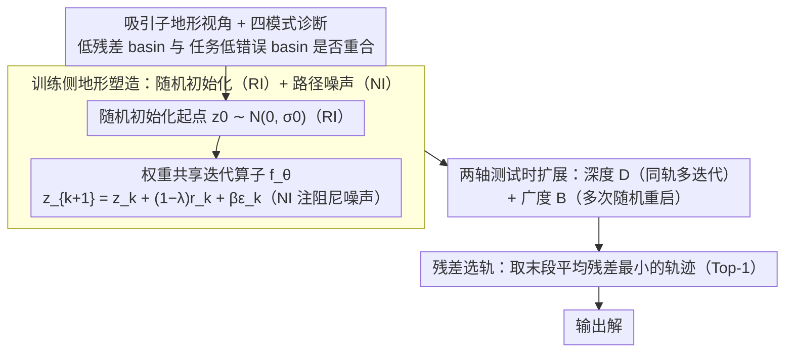

# Equilibrium Reasoners: Learning Attractors Enables Scalable Reasoning

**会议**: ICML 2026  
**arXiv**: [2605.21488](https://arxiv.org/abs/2605.21488)  
**代码**: https://github.com/locuslab/EqR (有)  
**领域**: LLM推理 / 迭代潜变量推理 / 测试时计算扩展  
**关键词**: 不动点动力系统, 吸引子, 权重共享迭代, 深度-广度扩展, Sudoku-Extreme

## 一句话总结
本文把"通过迭代更新潜变量做推理"的模型重新解释为一个学到的吸引子动力系统，提出 Equilibrium Reasoners (EqR)：用随机初始化 + 路径噪声两条轻量训练干预塑造吸引子地形，配合"深度（迭代步数 $D$）+ 广度（多次随机重启 $B$）"两轴测试时扩展和基于残差收敛的选轨规则，在训练时最多 16 步迭代的前提下，把 Sudoku-Extreme 的精确准确率从 feedforward 的 2.6% 推到 99.8%（等效展开 40,000 层）。

## 研究背景与动机

**领域现状**：现代推理模型越来越依赖测试时计算（test-time compute）——从基于搜索的 AlphaZero 到 CoT、再到最近的 HRM/TRM/URM 这类权重共享迭代模型，都靠"反复跑同一个更新模块"来加深推理。HRM/TRM 把一个 latent state 反复迭代，在 Sudoku 这类长程约束满足任务上拿到了远超普通前馈网络的成绩。

**现有痛点**：但"加大测试时计算"并不总是有效——文献已多次报告 test-time scaling 收益递减甚至负收益。HRM 用"hierarchical convergence"描述其行为，TRM 则明确指出 latent residual 即使训练后也不归零，因而拒绝用严格不动点解释。换言之，迭代推理为什么 work、什么时候 scale 才有效，依然缺一个机制级解释。

**核心矛盾**：严格的"收敛到唯一不动点"假设太强（残差不归零），但完全放弃收敛视角又解释不了"多迭代几步就涨点"这种经验现象。我们需要一个介于"严格不动点"和"完全黑箱"之间的中间层视角。

**本文目标**：(i) 给迭代推理找一个比 DEQ 更宽松但仍可证伪的内部机制解释；(ii) 把这种解释翻译成具体的训练干预 + 测试时扩展策略；(iii) 在受控基准上验证"残差收敛"是否真能作为可靠的扩展信号。

**切入角度**：把迭代算子 $\mathbf{z}_{k+1}=f_\theta(\mathbf{z}_k;\mathbf{x})$ 看成一个 task-conditioned 的动力系统，但把目标从"找精确不动点"放宽为"找吸引子"——稳定的局部受困区。一个"对齐良好"的吸引子地形应该满足：内部 landscape 的低 residual basin 与任务度量的 low-error basin 重合。这样训练就是把内部地形塑造成任务度量的可微 surrogate，推理就是在这个地形上做自适应搜索。

**核心 idea**：用"吸引子地形塑造（attractor landscape shaping）"统一解释训练与测试时扩展——训练侧用随机初始化（RI）+ 路径噪声（NI）让正确吸引子又广又稳，推理侧沿"深度 $D$（同一轨迹多迭代）+ 广度 $B$（多次随机重启）"两轴扩展，再用残差最小的轨迹做 Top-1 选择，于是 $D{\cdot}B$ 增大时性能可预测地涨。

## 方法详解

### 整体框架
EqR 要解决的是"迭代潜变量推理为什么 work、什么时候多算才有效"这个机制问题，做法是把迭代算子 $\mathbf{z}_{k+1}=f_\theta(\mathbf{z}_k;\mathbf{x})$ 当成一个 task-conditioned 的动力系统，目标从 DEQ 的"求唯一不动点"放宽为"塑造一片对齐良好的吸引子地形"，再把训练和测试时扩展都翻译成在这片地形上的操作。骨架直接沿用 TRM 风格的 hierarchical 迭代：维护一对 latent state $(\mathbf{z}_H, \mathbf{z}_L)$，内层把 $\mathbf{z}_L$ 在 $\mathbf{z}_H$ 条件下更新 $n$ 步、再用它更新一次 $\mathbf{z}_H$，外层重复 $T$ 步，其中前 $T-1$ 步走 `no_grad`+detach（truncated gradient，只在最后一步算梯度），并挂一个 ACT 头 $\hat q = f_\phi(\mathbf{z}_H)$ 做 difficulty-aware 早停。相对 HRM/TRM，EqR 的新东西集中在三处发力点——给每条轨迹换随机起点（广覆盖）、给每步更新注阻尼噪声（轻扰动）、推理时沿深度/广度两轴扩展并用残差挑轨迹（对齐选择信号）。

### 关键设计

**1. 吸引子地形视角 + 四模式诊断：把"残差"升格为任务无关的诊断量**

DEQ 那种"是否收敛到唯一不动点"是个 0/1 判断，解释不了 HRM/TRM 实测里"残差一路降但不归零、准确率却持续涨"的现象。EqR 改用更宽松的吸引子视角：把模型在输入 $\mathbf{x}$ 下能收敛到的所有稳定长期状态记作吸引子集合 $\mathcal{Z}^*_\theta(\mathbf{x})$，只关心两件事——task alignment（这些吸引子 decode 出来是不是正解）和 reachability（它们的 basin 好不好进）。据此把地形分成四类：(a) 根本没有正解吸引子（误判型，再扩展也无效）；(b) 正解与错解吸引子并存（basin 选择失败，得靠广度 $B$ 换 basin 而非深度 $D$）；(c) 正解吸引子在但 basin 又窄又弱（reachability 失败，$B$ 帮选 basin、$D$ 帮稳住）；(d) 正解 basin 又宽又稳（理想态，$D$ 主导、$B$ 边际）。把这四类与"残差 vs 任务错误的相关性"对齐后，$\|f_\theta(\mathbf{z};\mathbf{x})-\mathbf{z}\|$ 就成了任务无关的内部诊断量——模式 (d) 下残差和准确率强相关，模式 (a) 下两者解耦。这个视角既保留了"轨迹朝低残差走"的核心 claim，又允许残差非零、允许多吸引子并存，刚好覆盖 Sudoku 这类多解候选 + 长程约束的真实情况。

**2. 训练侧地形塑造：随机初始化（RI）+ 路径噪声（NI）**

HRM/TRM 用单一固定的 $\mathbf{z}_0$ 训练，等价于只把一个 basin 局部塑造好，一旦推理时为了多次重启投票而换随机起点就暴露 train-test mismatch；同时它们对模式 (b)(c) 那种"过早陷进错解"也无能为力。EqR 用两条几行代码、零额外参数的干预对症。RI 让起点 $\mathbf{z}_0\sim\mathcal{N}(0,\sigma_0 I)$ 而非固定零，一举两得：训练时"看到"更多 basin、扩大了被塑造的状态空间区域，又因为同一 $(\mathbf{x},\mathbf{y})$ 被配上多种 $\mathbf{z}_0$ 一起算 loss，自然把不同轨迹的 prediction 拉到一致，等于隐式鼓励 path independence（Anil et al., 2022）。NI 则把每步更新写成带阻尼加噪的形式 $\mathbf{z}_{k+1}=\mathbf{z}_k+(1-\lambda)\,r_\theta(\mathbf{z}_k;\mathbf{x})+\beta\,\varepsilon_k$（$\varepsilon_k\sim\mathcal{N}(0,I)$，默认 $\lambda=0.05$、$\beta=0.01$），相当于在轨迹层面做随机扰动正则，让模型在易被劫持的 (b)(c) 地形里有机会跳出 spurious attractor 走向正确 basin；推理时还可把 $\beta$ 调大以加强探索（类似 temperature scaling），与广度扩展配合。两者作用部位互补：RI 改"从哪里起跑"，NI 改"沿途遭遇什么"。

**3. 两轴测试时扩展 + 残差选轨：用模型自身几何量替代外部 verifier**

EqR 把"用更多算力"拆成两个可独立诊断、独立调参的旋钮——深度 $D$（同一条轨迹展开多少步，对应细化 basin 内部）和广度 $B$（独立重启多少次，对应切换 basin），统一用 $\mathrm{NFE}=D\cdot B$ 记账。先用 ablation 证明权重共享是迭代推理 generalize 的必要前提（前馈再深都 OOD 失败），再展示训练只用 $\le 16$ 步、推理却能外推到 $>1024$ 步（等效 40,000 层）而残差和准确率仍同向下降；广度上 Pareto 实验给出一条经验律——$B$ 只在 $D\gtrsim 4$ 之后才有效，因为轨迹得先跑够步数才能 meaningfully 探到 basin，太短的轨迹多跑几次只是在起点附近抖动。最后的选轨不用 majority vote，而是挑"最后几步平均残差最小"那条做 Top-1 收敛选择——正因为地形塑造之后残差与任务正确率高度相关，"信收敛"既省掉外部 verifier 和任务专用 prior，又比"信投票"更省算力。

### 损失函数 / 训练策略
主损失沿用 TRM 风格：每个"被监督的外层步"上用 CE 训练 LM head $\hat{\mathbf{y}}$，BCE 训练 halting head $\hat q$ 使其去拟合 $\mathbf{1}[\hat{\mathbf{y}}=\text{gt}]$；Segmented Online Training（SOT）把整条轨迹切段，每段末尾监督 + 立即 optimizer step，下一段以"detached carry + 新参数"开局，相当于对吸引子学习目标做交替近似——latent 更新去找当前算子下可达的低残差状态，参数更新去把那些可达状态对齐到正解。Gradient 用 truncated（detached carry）省内存。ACT 在训练时就生效：模型 confident 后 $\hat q$ 走高，该样本被提前移出 batch，省下的算力分给难样本。

## 实验关键数据

### 主实验

**Sudoku-Extreme（9×9 极难数独）** 和 **Maze-Unique（30×30 唯一解迷宫）** 上的精确准确率（exact accuracy，全部 token 命中才记 1）：

| 方法 | Sudoku | Maze | 备注 |
|------|--------|------|------|
| 64-Layer Feedforward | 2.6 | 0.0 | 单纯堆深度无效 |
| HRM (Wang 2025) | 55.0† | 0.3 | hierarchical 迭代 baseline |
| TRM (Jolicoeur-Martineau 2025) | 84.8† | 44.9 | 当前迭代推理 SOTA |
| URM (Gao 2025) | 77.6† | 51.4 | — |
| **EqR baseline ($D{=}16,B{=}1$)** | 86.4 | 82.2 | +RI+NI on TRM 骨架 |
| **EqR + depth ($D{=}64,B{=}1$)** | 93.0 | 88.9 | 同一轨迹多迭代 |
| **EqR + depth+breadth ($D{=}64,B{=}128$)** | **99.8** | **93.0** | 残差选轨 |

最戏剧性的对比是 Maze：从 TRM 的 44.9 一口气拉到 93.0，单 RI 就把 Maze 推到 68.6，加上 NI 再到 82.2，说明"basin 选不对"才是 Maze 真正的瓶颈，而非容量。

### 消融实验

构建路径（Sudoku-Extreme，逐步加组件）：

| 配置 | Blocks | Params | NLE | Eval Acc |
|------|--------|--------|-----|----------|
| Vanilla feedforward | 42 | 105.6M | 42 | 2.6 |
| + weight-tied | 2 | 5.03M | 42 | 32.6 |
| + SOT + depth ×16 | 2 | 5.03M | 672 | 74.7 |
| + hierarchical recurrence | 2 | 5.03M | 672 | 76.5 |
| + ACT training | 2 | 5.03M | 672 | 84.8 |

地形塑造干预（基于上表最后一行的 baseline，$D{=}16,B{=}1$）：

| 干预 | Sudoku | Maze |
|------|--------|------|
| baseline (no RI/NI) | 84.8 | 44.9 |
| + RI | 86.0 | 68.6 |
| + RI + NI (EqR) | 86.4 | 82.2 |

### 关键发现
- **权重共享是迭代推理 generalize 的必要条件**：参数从 105.6M（42-layer feedforward）压到 5.03M（2-block weight-tied，同样 42 NLE），训练精度不掉而 eval 精度从 2.6 → 32.6，证明"重复用同一个 update block"才是核心，单纯堆 distinct layer 是 OOD 失败。
- **训练 16 步可外推到 1024+ 步而不崩**：训练上限 16 iter，但推理走 1024 iter（等效 40,000 layer）时残差继续降、准确率继续涨，是 "scale 实际生效"的最硬证据。
- **广度有"启动门槛"$D\gtrsim 4$**：Pareto 热图显示 $B$ 只在 $D$ 足够大时才有效（约 168 层等效深度之后），否则多次重启只是在起点附近抖动；这反过来又确认"地形上的探索"和"basin 内部细化"是两件不同的事。
- **残差选轨 ≥ majority vote**：训练后内部 landscape 与任务度量对齐良好，Top-1 Converged（选最后几步平均残差最小那条）以同样的 $B$ 拿到比 majority vote 不差甚至更好的准确率，省下投票需要的多数派开销。
- **同精度下 NFE 大幅省**：Sudoku-Lite 92.99% 精度目标下，EqR 比 baseline 省 3.76×NFE，EqR+ACT 省 11.34×，说明涨点不仅来自"算得多"，更来自"地形塑得好让正确解更易达"。

## 亮点与洞察
- **把"残差"从工程量提升为理论量**：以往迭代推理研究里 $\|f_\theta(\mathbf{z};\mathbf{x})-\mathbf{z}\|$ 只是收敛监控量，本文论证"在地形对齐良好的训练后，残差就是任务正确性的内部代理"，这一升格直接产出了"残差选轨"这个无需 verifier 的实用选择规则。
- **"地形对齐"这个比喻可以迁移**：训练塑造一个内部 landscape 让它的 attractor 与任务度量的 low-error basin 重合——这套思路完全可以套到 diffusion sampling、energy-based model、甚至 LLM 的 KV-cache 迭代修正上，只要存在"反复跑同一更新算子 + 一个任务度量"的结构。
- **RI / NI 的最小代价 vs 巨大收益**：两条干预都是几行代码、零额外参数、零额外算力，却把 Maze 从 44.9 推到 82.2，启示"探索注入"在小模型 + 强约束任务里可能比加大模型更划算。
- **train-test compute 解耦**：训 16 步、测 1024 步还能涨点，等价于把"训练算力上限"与"推理算力上限"解耦——对受限训练预算下的部署场景（小卡训、大卡推）有直接价值。
- **"信不信收敛"是个一阶 ablation**：从 majority vote 切到 Top-1 Converged 本质是把选择信号从"输出空间"换到"动力学空间"，这一换在地形对齐后才合理，反过来也成为判断"模型是否真的学到了对齐 attractor"的廉价探针。

## 局限与展望
- 评测只在 Sudoku-Extreme / Maze-Unique 这种"完全可控的离散约束满足"基准上，没碰自然语言 / 多模态 / 开放生成；吸引子视角在 token-level 噪声 landscape 下能否同样干净，仍未知（作者也承认 token-level loss 比 sequence-level 噪声大得多）。
- $\lambda=0.05,\beta=0.01$ 是 Sudoku/Maze 调出来的，跨任务是否需要重调、NI 的强度与任务难度有无可推导的标度律，论文没给。
- $D{=}64,B{=}128$ 已经 $\mathrm{NFE}=8192$，虽然外推到 1024 步还涨，但单题计算预算非常大，是否经济取决于任务对正确率的边际敏感度。
- "残差是不是任务正确性的可靠代理"这件事，本文是经验观察（残差与 task error 强相关），缺一个充分条件下的形式化保证；在地形对齐失败的模式 (a)/(b) 下残差选轨会主动选错。
- ACT 头预测的 $\hat q$ 与"是否真的命中正解"之间的可靠性边界也没系统刻画，这是把方法搬到更现实任务（无 ground truth 验证器）时的隐患。
- 改进方向上，自然延伸是：把 RI 的固定 Gaussian 换成 learnable / input-conditioned 的初始化分布；把 NI 的 $\beta$ 也学成时间相关 schedule；把残差选轨升级成一个"轨迹熵"或"basin volume"的 differentiable proxy 用于训练时直接优化"basin width"。

## 相关工作与启发
- **vs DEQ (Bai et al. 2019)**：DEQ 严格求解 $\mathbf{z}^*=f_\theta(\mathbf{z}^*;\mathbf{x})$ 的不动点，要求 $f_\theta$ contractive 且收敛到唯一解；EqR 把"唯一不动点"放宽为"吸引子集合"，允许多吸引子并存且残差非零，因而能解释 HRM/TRM 那种"残差降但不归零"的实际行为，吸引子也更适合 Sudoku 这种本身可能存在多个候选解的任务。
- **vs HRM (Wang et al. 2025) / TRM (Jolicoeur-Martineau 2025)**：HRM/TRM 用固定 $\mathbf{z}_0$ 训练并依赖 nested-loop 结构，把测试时 scale 的可解释性局限在"hierarchical convergence"这种偏现象学的描述；EqR 共享其骨架，但用 RI+NI 改造训练分布、用残差代理统一深度/广度扩展，把测试时性能从 TRM 的 84.8/44.9 推到 99.8/93.0，证明真正的瓶颈在地形塑造而非架构本身。
- **vs URM (Gao et al. 2025)**：URM 也走"统一迭代推理"路线但在 Maze 上 51.4，EqR 用同等骨架 + 两条训练干预拿到 93.0，说明"训练分布的随机性 + 路径噪声"比换骨架更划算。
- **vs Path-Independence (Anil et al. 2022)**：那条工作显式要求"不同起点收敛到同一解"作为正则；EqR 用 RI 隐式做了类似事——同一 $(\mathbf{x},\mathbf{y})$ 配多 $\mathbf{z}_0$ 一起训练，自然把跨轨迹一致性烧进 loss 里，省去显式约束。
- **vs CoT / search-based reasoning (Wei 2022; Silver 2018)**：CoT 在 token 空间做 test-time scaling，需要 verifier 或 majority vote；EqR 在 latent 空间做扩展，用模型自身残差做选择信号，是"潜变量空间的 test-time scaling"这条路线相对 token 空间 scaling 的一个清晰对照样本。

## 评分
- 新颖性: ⭐⭐⭐⭐ 吸引子视角把 DEQ / HRM / TRM 串成一个统一解释，RI+NI 虽简单但在该解释框架里有清晰的发力位置，不是堆 trick。
- 实验充分度: ⭐⭐⭐⭐ 构建路径 ablation 干净，四模式诊断 + Pareto 热图 + 同精度 NFE 对比 + 训练 16 步外推 1024 步都打到了；缺自然语言任务上的对照。
- 写作质量: ⭐⭐⭐⭐⭐ 概念框架先行 + 经验验证后跟，残差/对齐/可达性等术语前后一致，地形比喻直观但不滥用，公式与算法伪代码都给到。
- 价值: ⭐⭐⭐⭐ "测试时扩展为什么 work"在 latent reasoning 领域第一次给出了既可证伪又可指导训练的机制解释，且方法本身（RI+NI+残差选轨）几行代码可移植，对小模型 + 长程约束类任务实用价值很高。

<!-- RELATED:START -->

## 相关论文

- [\[ICLR 2026\] SEED-SET: Scalable Evolving Experimental Design for System-level Ethical Testing](../../ICLR2026/interpretability/seed-set_scalable_evolving_experimental_design_for_system-level_ethical_testing.md)
- [\[ICLR 2026\] RADAR: Reasoning-Ability and Difficulty-Aware Routing for Reasoning LLMs](../../ICLR2026/interpretability/radar_reasoning-ability_and_difficulty-aware_routing_for_reasoning_llms.md)
- [\[ICML 2025\] Ab Initio Nonparametric Variable Selection for Scalable Symbolic Regression with Large p](../../ICML2025/interpretability/ab_initio_nonparametric_variable_selection_for_scalable_symbolic_regression_with.md)
- [\[ICML 2026\] Learning Coherent Representations: A Topological Approach to Interpretability](learning_coherent_representations_a_topological_approach_to_interpretability.md)
- [\[ICML 2026\] Towards Long-Horizon Interpretability: Efficient and Faithful Multi-Token Attribution for Reasoning LLMs](towards_long-horizon_interpretability_efficient_and_faithful_multi-token_attribu.md)

<!-- RELATED:END -->
