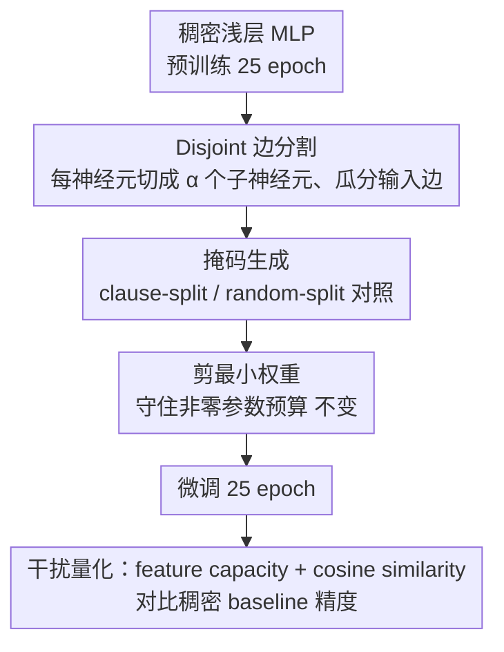

# Expand Neurons, Not Parameters

**会议**: ICML 2026  
**arXiv**: [2510.04500](https://arxiv.org/abs/2510.04500)  
**代码**: 未公开  
**领域**: 可解释性 / 叠加假设 / 稀疏网络  
**关键词**: 神经元扩张, 叠加假设, 多义性, 固定参数, 特征干扰

## 一句话总结
在保持非零参数总数不变的前提下，把每个神经元"切"成 $\alpha$ 个稀疏子神经元、让它们瓜分原来的输入边，就能显著降低神经元之间的特征干扰（多义性），从而在 Boolean 任务和 CLIP/CNN/ImageNet 等真实视觉任务上一致提升精度。

## 研究背景与动机

**领域现状**：神经网络规模越做越大，但单个神经元往往是"多义"的——一个神经元同时编码多个特征（polysemantic neuron），这是机制可解释性社区反复观察到的现象。叠加假设（superposition hypothesis）认为，当特征数大于神经元数时，网络只能把多个特征"挤"进同一个神经元，导致特征之间相互干扰，既损害可解释性也损害性能。另一条线（彩票假设）则发现稀疏子网络往往能匹敌甚至超过稠密网络的精度，暗示"结构"比"密度"更关键。

**现有痛点**：现有缓解叠加的工作大多停留在"分析"层面（如稀疏自编码器 SAE 在激活上学一本稀疏字典），并不改变底层网络；而剪枝/动态稀疏化方法虽然能改变结构，但主要目标是压缩参数量或加速推理，并不是为了"降低多义性"。把"减少叠加干扰"作为优化目标、用它来引导架构设计这件事，此前没人正面做过。

**核心矛盾**：固定参数预算下，神经元数和每个神经元的连接密度是耦合的——想让神经元更"专一"就需要更多神经元，但这通常意味着更多参数；反之保持参数数则只能容忍多义性。能否把这两个轴解耦？

**本文目标**：在严格固定非零参数数的约束下，把网络变"宽"而不是变"密"，验证：(a) 这样做能否减少特征间的碰撞与干扰；(b) 干扰的减少能否直接翻译为精度提升；(c) 这种收益是否在"叠加压力大"的场景（神经元少、特征多）下最显著。

**切入角度**：观察是——特征互相干扰的根源是它们被迫"共享"同一个神经元的输入边。如果把一个神经元的 $d$ 条输入边按一个 disjoint partition 切给 $\alpha$ 个子神经元，每个子神经元只看 $d/\alpha$ 条边，那么两个特征撞在同一个子神经元上的概率会指数级下降，而每个特征仍然有大概率被某个子神经元覆盖到。理论上可以证明，碰撞概率 $\approx \alpha^{-(2k-1)}$（$k$ 为每个 clause 的 literal 数），而覆盖率几乎不变。

**核心 idea**：用"边分割"（edge partitioning）作为机制性探针——在不增加非零参数的前提下把每个神经元扩成 $\alpha$ 个稀疏子神经元，让它们覆盖原神经元的输入但互不重叠，以此最大化特征覆盖、最小化特征碰撞。

## 方法详解

### 整体框架

方法叫 **Fixed Parameter Expansion (FPE)**，定位是"机制性探针"而非可部署 recipe：它要回答的问题是，在非零参数总数严格不变的前提下，把神经元数变多、让每个神经元的连接变稀疏，能否降低特征干扰并换来精度。具体做法是先把一个稠密浅层 MLP 训到接近收敛，再把隐层"切宽"——每个原神经元被复制成 $\alpha$ 个子神经元、瓜分原来的输入边，复制带来的多余参数则靠剪掉最小权重补回去，最后在同样设置下微调并和稠密 baseline 对比精度与干扰指标。

### 关键设计

**1. Disjoint 边分割：用更多神经元而非更多参数撑开特征容量**

叠加干扰的根源在于多个特征被迫共享同一个神经元的输入边，FPE 直接从这条边上下手。给定隐层宽度 $h$、扩张因子 $\alpha>1$，把宽度扩成 $h'=\alpha h$：原第 $i$ 个神经元的权重 $\mathbf{w}_i$ 复制到 $\alpha$ 个子神经元上，再用 $\alpha$ 个互不重叠的二值掩码 $\mathbf{m}_{(i_k)}\in\{0,1\}^d$（满足 $\sum_k \mathbf{m}_{(i_k)}=\mathbf{1}_d$）把 $d$ 维输入切给这些子神经元，任意两个子神经元的输入支撑集不相交，因此每个子神经元只"看"原输入的一个 disjoint 子集。第二层 $\mathbf{W}_2\in\mathbb{R}^{C\times h}$ 把每个输出权重复制 $\alpha$ 次扩成 $\mathbf{W}_2'\in\mathbb{R}^{C\times h'}$，这会多出 $(\alpha-1)C$ 个参数，于是在 $\mathbf{W}_1',\mathbf{W}_2'$ 里把绝对值最小的权重剪掉，使 $\|\mathbf{W}_1'\|_0=\|\mathbf{W}_1\|_0$ 严格守住原始预算，掩码初始化后不再更新。之所以有效，作者借用特征通道编码（feature channel coding）视角解释：抽象特征由一组共享 sign 模式的神经元（行）来"编码"，固定行数下容量有上界、特征一多就必然重叠，而 FPE 等于"不加参数预算就增加可用行数"，把容量上界顶高；在 Boolean DNF 任务上更能解析地证明，两个 clause 落入同一子神经元的期望碰撞率约 $\alpha^{-(2k-1)}$（$k$ 为每 clause 的 literal 数），随 $\alpha$ 指数级衰减，而 clause coverage 几乎不掉。

**2. 掩码生成：clause-split 与 random-split 的对照拆解机制**

掩码决定每个子神经元继承哪些输入维度，作者刻意做了两种并排对照来验证"到底是什么在起作用"。理论最优的是 *clause-aware split*——在 Boolean 任务里把同一个 clause 的所有 literal 都分到同一个子神经元，正好把碰撞概率压到 0；在视觉任务里没有现成 clause，于是计算第一层 Gram 矩阵 $G=\mathbf{W}_1^\top\mathbf{W}_1$，对其行聚类得到"伪特征组"再做平衡分配。对照组 *random-split* 则直接随机划分输入维度，不做任何特征对齐。保留 random-split 是为了检验"是不是只要降低碰撞、不需要精确识别特征"也能拿到大部分收益——实验给出的答案是肯定的：随机分割在所有设置下都好于稠密 baseline，clause-split 只额外再提升一点点，这反过来把"碰撞而非语义对齐才是关键驱动"这一机制性 claim 坐实。

**3. 干扰量化：feature capacity 与 cosine similarity 把机制和性能挂钩**

要论证"是减少叠加才更好"而不只是"加宽本身的好处"，需要从权重几何里读出一个独立的"叠加压力"指标。作者对每个特征 $i$ 定义容量 $C_i=(W_{\cdot,i}\cdot W_{\cdot,i})^2 / \sum_j (W_{\cdot,i}\cdot W_{\cdot,j})^2$：分子是该特征自身权重的平方模长，分母把它与所有其它特征的内积平方都加进来，$C_i$ 越高说明这个特征"独享"的表示子空间越大、被别的特征挤占得越少。再算所有神经元权重向量两两的平均余弦相似度，值越低代表神经元越正交、特征越解耦。在 Figure 3c 里，作者把这两个指标的 fold change 对相对精度提升做最小二乘回归，得到很强的相关性，从而把"宽度↑ → 干扰↓ → 精度↑"这条因果链路从权重几何一路定量打通，而非只看终点的精度数字。

### 损失函数 / 训练策略

任务即标准分类损失：二分类用 sigmoid + BCE，多分类用 softmax + 交叉熵，没有任何额外正则项。训练分两阶段——25 epoch warmup → 应用 FPE → 25 epoch 微调，稠密 baseline 在同一 schedule 下训满 50 epoch 以公平对比；掩码在 FPE 初始化时确定后不再更新（消融里也试了允许 mask 更新，结论不变）。

## 实验关键数据

### 主实验

| 任务 / 设置 | 配置 | 稠密 baseline | FPE (random) | FPE (clause/feature) | 相对提升 |
|------------|------|---------------|--------------|---------------------|---------|
| Boolean DNF, 8 clauses, 8 neurons, $\alpha=2$ | symbolic | 78.7% | 88.7% | **99.4%** | +26% |
| CLIP-CIFAR-100, 32 pre-expand neurons, $\alpha=4$ | frozen embed | — | ≈匹配 1.2× 参数稠密模型 | — | 等效参数翻倍 |
| FashionMNIST / CLIP-ImageNet-100 / CLIP-ImageNet-1k | 多宽度 | baseline | 一致提升 | 一致提升 | 显著 |
| CIFAR-100 + 可学习 CNN backbone (256/512 dim) | joint learning | baseline | 一致提升 | 一致提升 | 最小宽度处增益最大 |

CLIP-CIFAR-100 在小神经元数量下 FPE 甚至能让精度接近翻倍（Figure 4b），且 random-split 与 feature-based split 在真实数据上几乎打平——这与 Boolean 任务里 clause-split 明显领先的格局形成鲜明对比，说明真实数据上的"伪特征聚类"并没有恢复出"真"特征结构。

### 消融实验

| 配置 | 关键现象 | 说明 |
|------|---------|------|
| 增大 $\alpha$（$2 \to 4$） | 收益持续上升 | 干扰随 $\alpha$ 指数级下降的理论预测被验证 |
| 增加 clause 数（神经元固定 8） | 收益先升后在 ≈16 clauses 处饱和 | 即使更宽也无法完全解耦极端高 superposition |
| 增加 neuron 数（clause 固定 8） | 收益单调递减 | 神经元变多 → 叠加压力变小 → FPE 必要性下降 |
| 同 sub-neuron 数但允许重叠输入 | 比 FPE 显著差（Tables A14） | 证明关键是 disjoint，而非单纯加宽 |
| vs DropConnect（同非零参数预算） | FPE 持平或更优 | 排除"只是随机稀疏正则"的解释 |
| 改变 split 时机 | 越早 split 越好，但晚 split 仍优于稠密 | 早期特征专门化收益更大 |

### 关键发现

- **碰撞而非语义对齐才是主因**：random-split 在所有设置下都超越稠密 baseline，且在真实视觉任务上与 feature-based split 几乎打平；这把"必须正确识别特征"从必要条件降级为"锦上添花"。
- **干扰指标与精度强相关**：feature capacity 上升和 cosine similarity 下降的程度可以线性预测相对精度提升（$R^2$ 较高），这是少有的把机制性指标和性能定量挂钩的工作。
- **叠加压力越大，FPE 越香**：跨 Boolean 任务的 clause/neuron 联合扫描以及 CIFAR-100 的"类别数 × 宽度"扫描都显示，FPE 的相对收益在特征/神经元比值高时最大；当稠密模型本身就有富余容量时，收益自然衰减。
- **硬件友好性**：固定非零参数 + 更多神经元的配置天然契合"内存搬运是瓶颈"的现代加速器（前提是稀疏 kernel 支持到位）。

## 亮点与洞察

- **把可解释性的洞察"反向"用于架构设计**：以往机制可解释性几乎只用于解释已训练模型，本文用叠加假设的预测来指导设计选择（"更多神经元 + 更稀疏的边"），这是从"诊断"走向"处方"的一步——SAE 等工作可以理解 superposition，FPE 则把这种理解直接转化为可测的性能收益。
- **碰撞概率的解析估计与实测的精度提升高度吻合**：理论给出 $\alpha^{-(2k-1)}$ 的碰撞衰减率，实验里随 $\alpha$ 扩张的收益曲线和该预测在定性趋势上一致；这种"理论先行 → 实验印证"的链条在大模型时代越来越少见。
- **"是不是只要打散就行？"这个问题被认真回答了**：通过 disjoint 与 non-disjoint 的严格对照实验，作者证明并非"加宽 / 加随机性"就够，必须显式保证子神经元间不共享输入，这把 FPE 与 DropConnect / 普通稀疏正则区分开来。

## 局限与展望

- **作者承认**：FPE 是"机制性概念验证"，不是部署 ready 方法；真实加速依赖稀疏 kernel；实验集中在小模型与受控设置，未触及 transformer 级别。
- **特征切分仍依赖启发式**：真实数据上的 Gram 聚类既不能保证恢复"真"特征结构，也确实没拉开和 random-split 的差距，说明缺少更精准的特征归因工具（这正是 SAE 等方法的潜在用武之地）。
- **结构假设较强**：disjoint 输入切分对低维或紧耦合特征的输入可能不友好（信号被硬性切碎），FPE 在 dense embedding / 多模态 token 流上的效果有待验证。
- **改进思路**：把 FPE 和 SAE 结合（SAE 提取真特征 → 按真特征做 clause-style split）；扩展到深度方向（按层间通道分割），以及把 FPE 当成预训练大模型的"细化"步骤而非从头训练的初始化策略。

## 相关工作与启发

- **vs Superposition / SAE 系列（Elhage 2022; Cunningham 2023）**：他们用稀疏字典或玩具模型"分析"叠加现象，本文是首次用同样的视角"反向"修改基础网络结构以减少叠加，并将干扰减少与精度提升直接挂钩。
- **vs 彩票假设 / 剪枝（Frankle & Carbin 2018; Han 2015; SparseGPT 2023）**：剪枝先训密再剪、目标是压缩；FPE 反过来——先训密、再"扩宽并稀疏"，目标是降干扰而非压缩，且严格保持非零参数总数。
- **vs 网络生长（Net2Net, dynamic networks）**：生长类方法通常会增加总参数，FPE 显式禁止参数增长，把神经元数从参数数中解耦出来作为独立的架构轴。
- **vs DropConnect（Wan 2013）**：DropConnect 把随机稀疏当正则、推理时恢复稠密；FPE 是确定性、永久性的 disjoint 稀疏架构，且明确以"减少特征碰撞"为目标。

## 评分
- 新颖性: ⭐⭐⭐⭐ 把可解释性的叠加假设当架构设计原则首次落到实处，定位独特，但单层 MLP 上的"宽 vs 密"对照本身在彩票假设/Golubeva 2020 等工作里有先例。
- 实验充分度: ⭐⭐⭐⭐ Boolean → CLIP → ImageNet-1k → joint CNN 跨度大且都给出干扰指标的机制性证据，但未触及 transformer 与现代大模型，尺度偏小。
- 写作质量: ⭐⭐⭐⭐ 主线"理论碰撞估计 → Boolean 直接验证 → 真实任务推广 → 干扰指标回归"层层递进，对 FPE 的定位（"探针非 recipe"）也很坦诚。
- 价值: ⭐⭐⭐⭐ 给"叠加 → 多义性 → 性能损失"这条因果链补上了一块可操作的证据，并提示了一条新的硬件友好稀疏化方向，值得后续工作在 transformer 上检验。

<!-- RELATED:START -->

## 相关论文

- [\[ICML 2026\] LLMs Lean on Priors, Not Programming Language Semantics](llms_lean_on_priors_not_programming_language_semantics.md)
- [\[ICML 2026\] Position: Zeroth-Order Optimization in Deep Learning Is Underexplored, Not Underpowered](position_zeroth-order_optimization_in_deep_learning_is_underexplored_not_underpo.md)
- [\[ACL 2025\] The Knowledge Microscope: Features as Better Analytical Lenses than Neurons](../../ACL2025/interpretability/the_knowledge_microscope_features_as_better_analytical_lenses_than_neurons.md)
- [\[NeurIPS 2025\] Dense SAE Latents Are Features, Not Bugs](../../NeurIPS2025/interpretability/dense_sae_latents_are_features_not_bugs.md)
- [\[ACL 2025\] Cracking Factual Knowledge: A Comprehensive Analysis of Degenerate Knowledge Neurons in Large Language Models](../../ACL2025/interpretability/degenerate_knowledge_neurons.md)

<!-- RELATED:END -->
