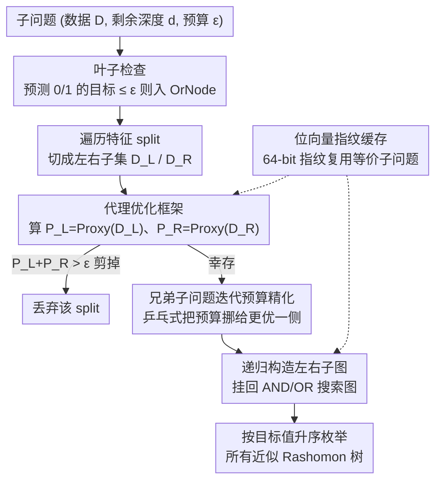

# From Rashomon Theory to PRAXIS: Efficient Decision Tree Rashomon Sets

**会议**: ICML 2026  
**arXiv**: [2606.00202](https://arxiv.org/abs/2606.00202)  
**代码**: https://github.com/zakk-h/PRAXIS  
**领域**: 可解释机器学习 / Rashomon Sets / 稀疏决策树  
**关键词**: Rashomon 集、稀疏决策树、近似算法、代理优化、分支定界

## 一句话总结
PRAXIS 用一个"快但近似"的代理算法（改良版 LicketySPLIT）来估计每个子问题的最优目标值，从而对稀疏决策树的 Rashomon 集做"按需展开"式剪枝搜索，把原本与树空间指数相关的运行时和内存压成"每棵输出树只花多项式时间"，在 11M 样本/472 特征级别仍能跑完且 recall ≥ 0.98。

## 研究背景与动机

**领域现状**：Rashomon 集（一个数据集和损失下所有"差不多好"的模型集合）是当前可解释 ML 的重要范式——一旦把所有近似最优的稀疏决策树枚举出来，用户就可以再叠加公平性、因果约束、必须使用某些特征等次级目标，只需一次遍历集合即可挑模型。代表工作是 TreeFARMS (Xin 2022) 和 SORTeD (Arslan 2026)，二者都精确枚举决策树 Rashomon 集，借助 branch-and-bound + 动态规划。

**现有痛点**：精确算法在运行时和内存上都随深度和特征数指数膨胀。论文给出的对照很扎眼：深度 4、20 特征的决策树搜索空间约 $8.4 \times 10^{18}$；现实数据上 TreeFARMS 在 100+ 特征时经常 OOM，SORTeD 在 Churn (472 特征) 上要跑近 35 小时。RESPLIT (Babbar 2025) 是 SOTA 近似方法，但仍是"逐棵树最坏情况指数耗时"，且对真实 Rashomon 集 recall 很低（图 3 显示在 Churn/Electricity 上找出的树有 0 棵真正落在目标 Rashomon 集里）。

**核心矛盾**：决策树 Rashomon 集本身可能只占整个假设空间极小一部分（Semenova 2022 估计为 $10^{-37}$ 量级），但现有算法的开销与整个搜索空间相关，而非与输出集合大小相关——这就导致"为输出一棵树要付出指数级浪费"。

**本文目标**：构造一个 Rashomon 集近似算法，使得**每输出一棵树的边际代价是多项式**，同时 recall 接近 1。

**切入角度**：作者借鉴 "pilot method"（试航算法）思路——LicketySPLIT 是单棵树版本：在每个节点用一个快速贪心补全来估计每种 split 的真实代价。本文把这个想法推广到 Rashomon 集枚举：用代理（proxy）估计每个子问题的最优目标 $\text{Obj}^*$，凡是 $\text{Proxy}(D_L) + \text{Proxy}(D_R) > \varepsilon_{\text{abs}}$ 的 split 直接剪掉。

**核心 idea**：用一个满足"递归精化性"（Definition 3.1）的代理算法 PROXY 来替代昂贵的下界估计，并设计一个"兄弟子问题预算迭代精化"过程，使剪枝既激进又不丢真正的 Rashomon 集成员。

## 方法详解

### 整体框架

PRAXIS 要解的是"把所有近似最优稀疏决策树枚举出来"，难点在于精确算法的开销跟着整个树空间指数膨胀。它的破题方式是：用一个跑得快的近似代理估出每个子问题"大概能做到多好"，凡是连代理都过不了预算的 split 直接砍掉，从而让搜索只围着真正可能产出 Rashomon 树的分支转。

具体地，PRAXIS 维护一个 AND/OR 搜索图来紧凑表示候选树。每个子问题是三元组（数据子集 $D$、剩余深度 $d$、全局预算 $\varepsilon_{\text{abs}}$），从根递归向下展开：先检查两种叶子（预测 0 / 1）的目标 $C_b = \gamma + |\{y_i \neq b\}|$ 是否在预算内、在则加入 OrNode；再遍历每个特征 split $j$ 把数据切成 $(D_L, D_R)$，用代理算出 $P_L=\text{Proxy}(D_L,d-1,\gamma)$、$P_R=\text{Proxy}(D_R,d-1,\gamma)$，凡 $P_L+P_R>\varepsilon_{\text{abs}}$ 的 split 立即剪掉；幸存的 split 交给 `Solve_Siblings` 把预算分给左右、递归构造子图后挂回 OR-graph。最终输出的搜索图可按目标值升序枚举所有近似 Rashomon 树。预算既可显式给，也可写成乘法形式 $(1+\varepsilon_{\text{mult}})\cdot\text{Proxy}(D,d,\gamma)$；目标函数固定为 $\text{Obj}(t,D,\gamma)=\gamma|t|+\sum_i \mathbb{1}\{t(x_i)\neq y_i\}$，其中 $|t|$ 是叶子数、$\gamma=\lambda|D|$。

### 关键设计

**1. 代理优化框架：用"快但近似"的下界替掉指数级精确下界**

精确算法（TreeFARMS 等）剪枝时要拿"最优子树目标"做下界，可这个下界本身就得做指数搜索，等于为了剪枝再付一次指数代价。PRAXIS 改用一个满足"递归精化性"（Def 3.1）的代理：要求 $\text{Proxy}(D,d,\gamma)=\text{Obj}(t)$ 对应某棵真实树 $t$，且它在孩子上的估计不高于该子树真值 $\text{Proxy}(D_{t_{\text{left}}},d-1,\gamma)\le\text{Obj}(t_{\text{left}})$（右子树同理）。这条性质让代理可以安全地拿来做 $P_L+P_R>\varepsilon_{\text{abs}}$ 的剪枝判据，又把框架变成连续谱：代理恰好是最优解时 PRAXIS 退化为精确枚举（等价 TreeFARMS），代理只是近似时仍能激进剪枝。默认代理是改良版 LicketySPLIT——每个子问题先算叶子目标 $\text{leaf\_obj}=\gamma+\min(p,n'-p)$，不能再分就返回，否则贪心找最优 split、递归后再与叶子目标取最小；相比原版，它把 prepruning 挪到递归之后（允许递归改善目标）、深度为 1 时直接最大化准确率而非最小化加权子熵。代价是单次代理只花 $O(nk^2d^2)$，从而把整体复杂度压到 $O(|R|nk^3d^3)$——**每输出一棵 Rashomon 树的边际代价是多项式**（Theorem 3.2），相对最优 DP 的加速是 super-polynomial（Corollary 3.3）。

**2. 兄弟子问题迭代预算精化：让悲观的代理也别漏掉好树**

一个 split 被保留后，根预算 $\varepsilon_{\text{abs}}$ 怎么分给左右两侧子问题是关键——代理是悲观估计，如果两边实际都比代理好，简单均分会把预算卡死、漏掉本该入选的 Rashomon 树。`Solve_Siblings`（Algorithm 3）用"乒乓"式迭代来解决：先假定右边只能做到代理水平，给左边预算 $\varepsilon_L^{\text{new}}=\varepsilon_{\text{abs}}-P_R$ 跑出 $G_L$ 和它的真实最小目标 $G_L.\text{min\_obj}$；再用这个更紧的实际值反过来放宽右边预算 $\varepsilon_R^{\text{new}}=\varepsilon_{\text{abs}}-G_L.\text{min\_obj}$ 跑出 $G_R$；又用 $G_R.\text{min\_obj}$ 回头放宽左边，如此反复直到两侧预算都不再增长。这样无需重做整个搜索，就能把多出来的预算逐步挪给真正产得出好树的那一侧，使理论上的 recovery 条件（Theorem 3.5 的 "frontier cut"、Corollary 3.6 中关于 $\beta/\alpha$ 的松弛因子 $\sigma$）尽量被实际满足。

**3. 位向量指纹缓存：兼得 TreeFARMS 的复用与 SORTeD 的省内存**

不同 split 序列常常切出同一个数据子集，重复求解是大开销来源。TreeFARMS 用长度 $n$ 的位向量做子问题键能精确去重但极耗内存，SORTeD 改用 split 集合做键省内存却会漏掉"等价但 split 路径不同"的子集。PRAXIS 把每个位向量连同深度预算一起哈希成一个 64-bit 指纹当缓存键，代理与贪心子例程递归中遇到的每个子问题都进缓存。于是内存只存指纹加解、时间又能复用真正等价的子问题，好哈希下错碰概率极小而收益是数量级的（Appendix B.7）。这正是 PRAXIS 实际内存复杂度能做到 $O(nk+\sum_{t\in R}|t|)$（Theorem 3.4）的工程支点。

### 损失函数 / 训练策略

无训练损失（决策树离散结构 + 0/1 损失）。优化目标为 $\text{Obj}(t, D, \gamma) = \gamma |t| + \sum_i \mathbb{1}\{t(x_i) \neq y_i\}$；$\gamma$ 约束为整数以避免浮点。实验默认 $\lambda \in \{0.005, 0.01, 0.02\}$，$\varepsilon_{\text{mult}} = 0.03$，深度 $d=5$（部分实验 $d=7$）。

## 实验关键数据

### 主实验

在 50 个 dataset-binarization 组合上对比 PRAXIS / TreeFARMS / SORTeD / RESPLIT，$\lambda=0.02, \varepsilon=0.03, d=5$，下表选关键样本（"–" 表示 90 小时或 200 GB RAM 内未完成）：

| 数据集 ($n / k$) | PRAXIS 时间 (s) | SORTeD 时间 (s) | RESPLIT 时间 (s) | PRAXIS 峰值 MB | SORTeD 峰值 MB |
|------|------|------|------|------|------|
| Churn (5K / 472) | **34.84** | 123776 (~34h) | 2564 | 279 | 22013 |
| Christine (5.4K / 231) | **944** | 38971 (~10.8h) | 12625 | 10439 | 12710 |
| Covertype (581K / 96) | **358** | 64673 (~18h) | 10102 | 1301 | 16107 |
| Higgs (11M / 84) | **2375** (~40 min) | – | – | 21537 | – |
| Compas (5K / 44) | **0.09** | 7.23 | 11.90 | 130 | 163 |

PRAXIS 相比 TreeFARMS 提速最多 5 个数量级、相比 SORTeD 最多 3 个数量级、相比 RESPLIT 最多 2 个数量级；内存效率相对 RESPLIT ≈5×、相对 TreeFARMS 最多 4 个数量级。

### 近似质量与作为单树求解器

| 数据集 | recall ($\lambda=0.005$) | recall ($\lambda=0.02$) |
|------|------|------|
| Churn-472 | 0.997±0.005 | 1.000±0.000 |
| Electricity-264 | 0.994±0.003 | 1.000±0.000 |
| Christine-231 | 1.000±0.000 | 0.994±0.011 |
| Bike-164 | 0.986±0.010 | 1.000±0.000 |
| 其余 18 个数据集 | 0.984–1.000 | 0.998–1.000 |

22 个有 ground truth 可比的数据集上 recall 平均 ≥0.98，多数 1.0（Table 2）。在没有 ground truth、TreeFARMS/SORTeD 都跑不动的 Churn/Electricity 等大数据上（Figure 3），PRAXIS 多找出超过 1M 棵优于 RESPLIT 最优树的 Rashomon 树，而 RESPLIT 找到的树**全部落在目标 Rashomon 集外**。

作为单树求解器时（取 PRAXIS 输出的第一棵）：$\lambda = 0.02$ 时 50 个数据集全部 recover 全局最优（vs STreeD）；$\lambda=0.01$ 时仅 2 个失败；$\lambda=0.005$ 时 3 个失败；失败时目标值也只超出最优 ~1.00069×。速度比 STreeD/GOSDT 快最多 3 个数量级（如 News 数据集 PRAXIS <3 分钟 vs STreeD >20 小时）。

### 关键发现

- **代理质量决定一切**：用更弱的代理（如纯贪心 CART）虽然仍能跑，但 recall 和速度都明显下降（Appendix D.5）；改良版 LicketySPLIT 的"递归后再比较叶子"和"深度=1 直接最大化准确率"两个看似细节的改动对 recall 影响很大。
- **位向量指纹缓存的边际收益巨大**：去掉缓存后大数据集直接 OOM；缓存命中率与特征数和深度正相关。
- **深度扩展能力**：在 $d=7$ 的更深 Rashomon 集设置下，SORTeD 在 150 小时内无法完成，PRAXIS 只要 11 秒，且相对 RESPLIT 的提速达到 4 个数量级。

## 亮点与洞察

- **"输出敏感"复杂度的理论贡献**：把决策树 Rashomon 集枚举的复杂度从"与搜索空间相关"重写为"与输出集合大小相关"$O(|R| n k^3 d^3)$，并形式化证明 super-polynomial 加速（Cor 3.3）。这是一个范式转变——以前 RESPLIT 也是近似但每棵树最坏情况指数耗时。
- **Pilot 方法的优雅推广**：单树版本（LicketySPLIT）就用 rollout 做 split 选择；这里把同一思想推到"输出一个集合"——用代理估计同时支持 split 评估、剪枝、和兄弟预算分配三件事，复用同一套缓存。
- **frontier cut + 兄弟迭代精化的协同**：Theorem 3.5 给出 recall 的充分条件（每个内部节点的"frontier cut"上 proxy 之和 ≤ $\varepsilon_{\text{abs}}$），Algorithm 3 的迭代精化让"代理高估但实际有好树"的情形也能被救回——理论与工程的契合点。
- **可迁移**：proxy + budget refinement 的框架对其他离散结构（rule list、决策森林、子集选择）潜在适用，作者也在结论里点出这一方向。

## 局限与展望

- **仅支持二元分类 + 二值特征**：连续特征要先 binarize（McTavish 2022），多分类、回归没在本文实验。
- **代理强度与剪枝精度的权衡**：更强代理 → 更高 recall 但单次调用更慢；论文给的 "family of proxy algorithms"（Appendix B.5）只在附录有量化结果，主文没系统讨论何时该升级代理。
- **理论保证是充分条件**：Theorem 3.5 的 frontier cut 条件实际很难验证，Cor 3.6 的 $\sigma$ 倍率也只是 worst case 给的松弛；论文承认 "perfect recall is not guaranteed"，实际 recall 几乎都达 1.0 但缺乏先验估计。
- **缓存哈希错碰**：64-bit 指纹在 $n$ 极大或子问题数极多时可能产生伪命中，论文说"vanishingly small"但没给具体上界。
- **未与"前向树搜索"对比**：作为 Rashomon 集而非单树，作者没把 PRAXIS 用作 RL/CMA-ES 等基于采样的近似的对比基线。

## 相关工作与启发

- **vs TreeFARMS (Xin et al., 2022)**: 都做 Rashomon 集，TreeFARMS 用位向量子问题表示 + 精确 DP，内存爆炸（最差 4 个数量级劣势）；PRAXIS 用代理 + 位向量指纹缓存，把内存压成线性于输出。
- **vs SORTeD (Arslan et al., 2026)**: SORTeD 用 split-based 子问题表示节省内存但漏掉等价子集；PRAXIS 用指纹缓存兼得两者优点，并将每棵树代价从指数推到多项式。
- **vs RESPLIT (Babbar et al., 2025)**: 同为近似方法，RESPLIT 用"子问题精确解 + 整体近似拼接"，PRAXIS 用"整体近似搜索 + 代理剪枝"——RESPLIT 单棵树仍最坏指数代价；实际效果上 RESPLIT 在 Churn/Electricity 找出的树全在目标 Rashomon 集外。
- **vs LicketySPLIT (Babbar et al., 2025)**: LicketySPLIT 是单棵树版本的 pilot 算法（rollout 选 split）；PRAXIS 是其 Rashomon 集版本——把"补全估计代价"从用来选 best split 改成用来剪枝整个集合。
- **vs GOSDT / STreeD**: 都是最优单树求解器；PRAXIS 作为副产物可输出近似最优单树，比它们快最多 3 个数量级（News 数据：<3 min vs >20h）。

## 评分
- 新颖性: ⭐⭐⭐⭐ 把 pilot/rollout 方法系统地移植到 Rashomon 集枚举，并给出"输出敏感"多项式复杂度证明；思路清晰但部件本身（LicketySPLIT、bitvector 哈希、branch-and-bound）都已有。
- 实验充分度: ⭐⭐⭐⭐⭐ 50 个数据集 / 11M 样本 / 472 特征级别压测，覆盖运行时、内存、recall、单树最优性四个维度，并和 3 个 SOTA 横向对比。
- 写作质量: ⭐⭐⭐⭐ 算法 1-3 写得很清楚，理论结果（Theorem 3.2-3.6）和工程细节（缓存、代理改良）分得开；少数公式排版乱码（cache 中数学符号被重复），但论文逻辑链条紧凑。
- 价值: ⭐⭐⭐⭐⭐ 把决策树 Rashomon 集从"百级特征"推到"几百特征 + 千万样本"级别，等于把这套范式从学术 demo 推向实用，对可解释 ML、公平性审计、变量重要度估计都是直接基础设施级提升。

<!-- RELATED:START -->

## 相关论文

- [\[ICML 2026\] Diagnosing the Reliability of LLM-as-a-Judge via Item Response Theory](diagnosing_the_reliability_of_llm-as-a-judge_via_item_response_theory.md)
- [\[ICML 2026\] PINE: Pruning Boosted Tree Ensembles with Conformal In-Distribution Prediction Equivalence](pine_pruning_boosted_tree_ensembles_with_conformal_in-distribution_prediction_eq.md)
- [\[CVPR 2025\] Learning on Model Weights using Tree Experts](../../CVPR2025/interpretability/learning_on_model_weights_using_tree_experts.md)
- [\[CVPR 2026\] H-Sets: Hessian-Guided Discovery of Set-Level Feature Interactions in Image Classifiers](../../CVPR2026/interpretability/h-sets_hessian-guided_discovery_of_set-level_feature_interactions_in_image_class.md)
- [\[AAAI 2026\] ToC: Tree-of-Claims Search with Multi-Agent Language Models](../../AAAI2026/interpretability/toc_tree-of-claims_search_with_multi-agent_language_models.md)

<!-- RELATED:END -->
