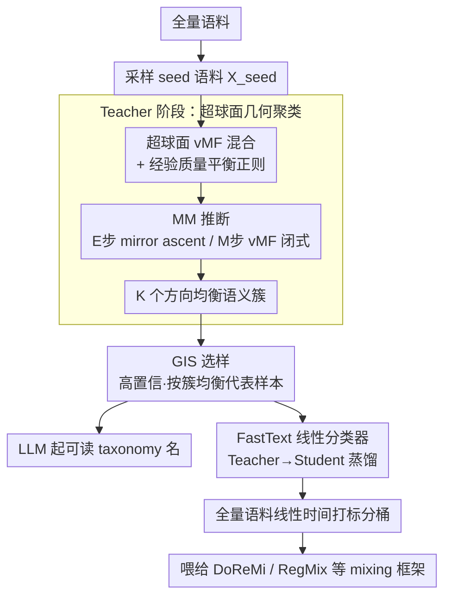

# GEM: Geometric Entropy Mixing for Optimal LLM Data Curation

**会议**: ICML 2026  
**arXiv**: [2605.26121](https://arxiv.org/abs/2605.26121)  
**代码**: 待确认  
**领域**: LLM预训练 / 数据混合  
**关键词**: 数据混合、超球聚类、von Mises-Fisher、MM算法、平衡正则

## 一句话总结
GEM 把 LLM 预训练数据划分问题重写成超球面上的 vMF 混合 + 平衡正则的变分目标，用可证明单调上升的 MM 算法求解，再通过 Teacher-Student 蒸馏到 FastText 上线，在 1.1B 模型上叠加 DoReMi/Perf/RegMix 三种 mixing 框架平均提升约 1.2%。

## 研究背景与动机

**领域现状**：LLM 预训练效果越来越取决于"数据怎么配比"，DoReMi、RegMix、Aioli、SampleMix 等动态混合方法已经形成主流，前提都是先把语料分成若干"语义桶"再去学桶之间的权重。

**现有痛点**：现有的"分桶"方案分两类，各有硬伤。一类是 WebOrganizer/TnT-LLM 这种基于人工 taxonomy 的方法：用大模型把网页贴标签，标签体系是人写的，存在 ontological misalignment（人类分类和模型真正学到的语义粒度对不上），而且每次更新语料都要重新标，成本不可持续。另一类是 K-Means/HDBSCAN 这类无监督方法：可以无限扩展，但是基于欧氏几何，跟现代文本 embedding（BGE、RoBERTa 等用 cosine 相似度训出来的）天然不匹配，再叠加 anisotropy/cone effect（embedding 集中在窄锥里），就会出现 cluster collapse —— 几个大桶吞掉所有长尾语义，多样性塌缩。

**核心矛盾**：embedding 实际住在高维超球面 $\mathcal{S}^{d-1}$ 上、信号在方向（cosine）里，但聚类目标却建在欧氏空间里；同时标准 EM 学出来的 mixture 权重 $\alpha_k$ 会出现"富者愈富"的反馈，进一步把质量推向几个主导簇。

**本文目标**：(i) 把语义划分建在超球面的方向统计上、与 cosine 相似度天然兼容；(ii) 显式抑制簇质量塌缩、得到"平衡且语义清晰"的分桶；(iii) 还能在 trillion-token 语料上低成本部署。

**切入角度**：用 vMF（von Mises-Fisher）混合做 directional 生成模型 —— 其充分统计量正好是 $\mu_k^\top x$ 即 cosine 相似度；再把"塌缩"问题剥离出来：不动生成先验 $\alpha_k$，而是直接在经验软质量 $\boldsymbol{\pi}(\Gamma)$ 上加一个二次平衡正则 $-\tfrac{\lambda}{2}\lVert\boldsymbol{\pi}-\mathbf{u}\rVert_2^2$，把生成先验和经验质量解耦。

**核心 idea**：在超球面上做"熵正则 ELBO + 经验质量平衡"的联合变分优化，并用 MM (Minorize-Maximize) 推一个对所有样本可分解、可证明单调上升的 E 步，从而稳定地解出方向均衡的语义桶。

## 方法详解

### 整体框架
GEM 要解决的是"把语料分成语义桶"这一步——它不学 mixing 权重，而是为 DoReMi/RegMix 这类算法提供更好的输入分桶。它的做法是把欧氏聚类换成超球面上的 vMF 混合，再叠一个平衡正则压住长尾塌缩，最后蒸馏成线性分类器上线。整条流水线分两段：**Teacher 阶段**在采样得到的 seed 语料 $\mathcal{X}_{seed}$ 上跑 vMF 混合聚类，MM 迭代地更新 Riemannian 参数 $(\mu_k,\kappa_k)$ 和软分配 $\gamma_{ik}$ 得到 $K$ 个方向簇，并用 Geometric Influence Score (GIS) 在每个簇里挑代表样本让 LLM 起可读的 taxonomy 名字；**Student 阶段**用 GIS 选出的高置信、按簇平衡的 pseudo-label 蒸馏一个轻量 FastText 分类器，把全量语料打标签降到线性时间，产出的分桶即可直接喂给任意 mixing 算法。

### 关键设计

**1. 超球面 vMF 混合 + 经验质量平衡正则：让度量贴合 cosine，再把塌缩拆出来单独压**

痛点在于现代文本 embedding 是用 cosine 相似度训出来的、信号住在方向里，但 K-Means 之类却把聚类目标建在欧氏空间，再叠加 anisotropy/cone effect 就会 cluster collapse。GEM 把每个簇建成一个 vMF 分量 $f_{\text{vMF}}(x\mid\mu_k,\kappa_k)=C_d(\kappa_k)\exp(\kappa_k\mu_k^\top x)$，它的充分统计量恰好是方向内积 $\mu_k^\top x$，于是"几何空间"和"embedding 空间"天然对齐。塌缩则被剥离成单独一项来治：混合先验固定 $\alpha_k\equiv 1/K$ 切断 EM 的"富者愈富"反馈，再在熵正则 ELBO 上加一个只作用于经验软质量 $\pi_k(\Gamma)=\tfrac{1}{N}\sum_i\gamma_{ik}$ 的二次惩罚 $-\tfrac{\lambda}{2}\lVert\boldsymbol{\pi}(\Gamma)-\mathbf{u}\rVert_2^2$（$\mathbf{u}=\tfrac{1}{K}\mathbf{1}$）。把平衡作用施加在经验质量而不是生成先验上，既不破坏生成模型的可解释性，又能在 anisotropic embedding 下把长尾簇撑起来，得到方向均衡的语义划分。

**2. 可证明单调上升的 MM 推断：把全样本耦合的正则项拆成逐样本可解的局部更新**

直接最大化上面那个目标很难，因为 $\boldsymbol{\pi}(\Gamma)$ 把所有样本耦合在一起、无法分布式优化。GEM 利用正则项 $R(\boldsymbol{\pi})$ 是 $\lambda$-smooth 凹二次函数这一性质，构造它的全局二次 minorizer $R(\boldsymbol{\pi})\geq R(\boldsymbol{\pi}^{(t)})+\langle\nabla R(\boldsymbol{\pi}^{(t)}),\boldsymbol{\pi}-\boldsymbol{\pi}^{(t)}\rangle-\tfrac{\lambda}{2}\lVert\boldsymbol{\pi}-\boldsymbol{\pi}^{(t)}\rVert_2^2$；E 步代入这个下界得到代理目标 $\widetilde{\mathcal{F}}_t(\Gamma)$，它对每个 $\gamma_i$ 凹且可分解，用几步 mirror ascent 即可解出新分配；M 步则是 vMF 的闭式更新——$r_k=\sum_i\gamma_{ik}x_i$、$\mu_k=r_k/\lVert r_k\rVert_2$，浓度 $\kappa_k$ 由 $\bar R_k=\lVert r_k\rVert_2/\sum_i\gamma_{ik}$ 经高维近似 $\kappa_k\approx(\bar R_k d-\bar R_k^3)/(1-\bar R_k^2)$ 估出。MM 代理给出的"每步都不比上一步差"保证了 $\mathcal{F}(\Theta^{(t)},\Gamma^{(t+1)})\geq\mathcal{F}(\Theta^{(t)},\Gamma^{(t)})$，让整个流程在大规模数据上稳定收敛，无需依赖经验性的 early stop。

**3. GIS 选样 + Teacher-Student 蒸馏到 FastText：把昂贵的几何 EM 压成可上线的线性推断**

web-scale 语料对延迟极其敏感（fastText 已是 CCNet/Dolma 的默认分类器），在 trillion-token 上直接跑 vMF EM 不现实。GEM 用 Geometric Influence Score 在每个簇里选出高置信、按簇均衡的代表样本作为 pseudo-label 集，蒸馏一个 FastText 线性分类器做 student，把"分桶"这一步固化到线性时间；同一批 GIS 代表样本还会喂给 LLM 写语义描述，自动产出可读的 taxonomy（见 Figure 3 的树状图）。这样既保留了 GEM 几何带来的平衡性，又把 categorization 的延迟压到主流 mixing pipeline 能负担的量级。

### 损失函数 / 训练策略
变分目标如 Eq.(3)：$\max_{\Theta,\Gamma}\sum_i\sum_k\gamma_{ik}\log(\alpha_k f_{ik}(\Theta))+\sum_i H(\gamma_i)-\tfrac{\lambda}{2}\lVert\boldsymbol{\pi}(\Gamma)-\mathbf{u}\rVert_2^2$。主实验设 $K=24$、$\lambda=5000$（按 vMF 学到的 $\kappa\approx 900$ 量级对齐 logit 尺度）。Backbone 用 1.1B LLaMA 风格 Transformer，固定 25B token 预训练预算；数据从 CommonCrawl 经 RefinedWeb 风格清洗得到。

## 实验关键数据

### 主实验
三种 mixing 框架下，把"分桶"模块换成 GEM，9 个 OLMES 子任务按 Science QA / Commonsense / Logic & Linguistics 三维汇总（节选自 Table 1）：

| Mixing 框架 | 分桶方法 | Science QA | Commonsense | Logic & Ling. | Average |
|---|---|---|---|---|---|
| DoReMi | Spherical K-Means | 34.62 | 38.97 | 54.72 | 42.77 |
| DoReMi | WebOrganizer (Format) | 34.44 | 38.73 | 55.19 | 42.79 |
| DoReMi | **GEM** | **34.79** | **39.96** | **57.11** | **43.95** |
| Perf | WebOrganizer (Format) | 35.06 | 39.73 | 57.97 | 44.25 |
| Perf | **GEM** | **35.96** | **40.43** | **57.98** | **44.79** |
| RegMix | WebOrganizer (Format) | 34.12 | 33.94 | 54.26 | 40.77 |
| RegMix | **GEM** | **34.07** | **35.30** | **54.97** | **41.45** |

DoReMi 下相对最强 baseline WebOrganizer 在 Commonsense / Logic 上分别 +1.23 / +1.76 pt；Perf 下 Science QA +0.90 pt；RegMix 下 Commonsense +1.36 pt。整体 Average 提升约 0.7–1.2 pt。

### 消融实验
对"几何 + 平衡"两个维度做消融（来自 Figure 6 与 GEM 主轴的描述）：

| 配置 | Average | 说明 |
|---|---|---|
| K-Means（欧氏 + 硬分配） | 38.5 | 完全欧氏，cluster collapse 最严重 |
| Spherical K-Means（球面 + 硬分配） | ↑ | 把度量换到 cosine，缓解 anisotropy |
| Vanilla vMF（球面软分配，无平衡正则） | ↑↑ | 用 Riemannian 生成模型，但仍易塌缩到大簇 |
| **GEM (full)** | **最高** | 加上经验质量平衡正则才真正打开长尾 |

另对簇数 $K\in\{12,16,24,32,36,48\}$（Figure 5）：Average 在 $K=36$ 达到峰值 41.21%，之后到 $K=48$ 略降，反映"过度碎片化"开始引入噪声。

### 关键发现
- "球面几何"和"平衡正则"两个组件呈现单调累加的提升曲线（Euclidean → Spherical → vMF → GEM），且只有同时具备两者才能真正打开长尾簇，说明 cluster collapse 并不能只靠换度量解决。
- 用 RegMix 做"taxonomy 可预测性"探针（Figure 4，10 个 split 上的 Spearman $\rho$ 分布），GEM 的中位数明显更高且 IQR 更窄，意味着混合权重小幅扰动带来的 loss 变化更"线性"、更可预测——这是任何 mixing 算法能高效搜索的前置条件。
- $\lambda=5000$ 的取法直接对齐 vMF logit 尺度（$\kappa\approx 900$），说明平衡正则与生成模型不是松散叠加，而是在数量级上必须匹配，否则要么"压不住塌缩"要么"把所有簇压成均匀噪声"。

## 亮点与洞察
- **"解耦先验和质量"是个 transferable 的小 trick**：很多 EM/EM-like 算法都有"富者愈富"反馈，本文把 $\alpha_k$ 固定成均匀、把平衡作用搬到经验软质量 $\boldsymbol{\pi}(\Gamma)$ 上的做法，本质上是把"建模分布"和"经验分布"分离，可以借鉴到任何带 mixture 的表示学习里（如 MoE 路由的负载均衡、retrieval 里 chunk 类别分布）。
- **把"分桶质量"操作化成"mixing 可预测性"**很巧妙：传统聚类评估只有 NMI/Silhouette 等几何指标，但本文用 RegMix Spearman $\rho$ 直接衡量"分桶是否给 mixing 算法提供了平滑的优化坐标系"，这是与下游任务对齐的指标，比纯几何指标更靠近"data curation"问题本身。
- **MM 而不是 EM**：对带正则的 ELBO 想保持"E 步可分解 + 单调上升"，作者用 $\lambda$-smooth 凹函数的全局二次 minorizer，把一个全局耦合项拆成可对每个 $\gamma_i$ 独立解的代理；这套套路在任何"似然 + 全局正则"的概率模型里都可以复用。

## 局限与展望
- 主实验只在 1.1B 模型、25B token 预算上做，是否在 7B+ 模型、更长训练下仍保留 1.2% 量级的提升没有验证；mixing 收益常常会随 model/data scale 收窄。
- "几何"的好坏完全依赖 text encoder（论文用 BGE/RoBERTa 类的 cosine-trained encoder）；如果换到非各向同性更强的 encoder 或 instruction-tuned 模型，超球假设的强度未知。
- 平衡正则的目标是均匀分布 $\mathbf{u}=\tfrac{1}{K}\mathbf{1}$，这隐含"语义类应该等权重"，但真实世界里有些主题本身就该稀有；当先验有强结构（如代码 vs. 散文比例已知）时，固定均匀目标可能反而损害效果，未来可以让 $\mathbf{u}$ 由下游 reward 自适应。
- 蒸馏到 FastText 的 student 是线性模型，对真正 fine-grained 的多义/混合主题可能丢失；可考虑用 hyperbolic 或 product-of-spheres 的轻量 student 在不破坏延迟约束下提升表达力。

## 相关工作与启发
- **vs WebOrganizer / TnT-LLM**：他们用 LLM 给文档贴人写的 taxonomy 标签，可读性强但有 ontological misalignment 且重打标贵；GEM 从 embedding 几何里"长出来"标签再让 LLM 起名字，标签和模型真正感知的语义粒度对齐。
- **vs Spherical K-Means / Vanilla vMFMM**：同样在超球上聚类，但都没有显式抑制 cluster collapse；GEM 用经验质量平衡正则补上了这一步，使长尾语义不被吞掉。
- **vs DoReMi / RegMix / Aioli / SampleMix**：这些方法假设"分桶"已经给定、只学权重，相当于把 GEM 解决的是它们的"输入端"问题；论文把 GEM 当作即插即用的 categorization 层叠加在三者之上，给出了"先把桶分好再混"比"在差桶上拼命调权"更有效的证据。

## 评分
- 新颖性: ⭐⭐⭐⭐ "vMF 混合 + 经验质量平衡正则 + MM 推断"组合是清晰且少有人触碰的方向。
- 实验充分度: ⭐⭐⭐⭐ 三大 mixing 框架 × 9 个 benchmark，加 $K$/$\lambda$/seed 大小敏感性分析；但只到 1.1B 模型。
- 写作质量: ⭐⭐⭐⭐ Figure 1/2 把动机和 pipeline 讲得很清楚，推导有 Lemma/Proposition 支撑且收尾干净。
- 价值: ⭐⭐⭐⭐ 给整个 data mixing 社区把"先分桶再混"的前置问题做了一个可证明、可上线的解法，可直接接入主流 mixing 框架。

<!-- RELATED:START -->

## 相关论文

- [\[ICML 2026\] Position: Let's Develop Data Probes to Fundamentally Understand How Data Affects LLM Performance](position_lets_develop_data_probes_to_fundamentally_understand_how_data_affects_l.md)
- [\[ICML 2026\] Optimal Attention Temperature Improves the Robustness of In-Context Learning under Distribution Shift in High Dimensions](optimal_attention_temperature_improves_the_robustness_of_in-context_learning_und.md)
- [\[ICML 2026\] MiniMax Learning of Interpretable Factored Stochastic Policies from Conjoint Data, with Uncertainty Quantification](minimax_learning_of_interpretable_factored_stochastic_policies_from_conjoint_dat.md)
- [\[ICML 2026\] Diagnosing the Reliability of LLM-as-a-Judge via Item Response Theory](diagnosing_the_reliability_of_llm-as-a-judge_via_item_response_theory.md)
- [\[ICML 2026\] Steer Like the LLM: Activation Steering that Mimics Prompting](steer_like_the_llm_activation_steering_that_mimics_prompting.md)

<!-- RELATED:END -->
