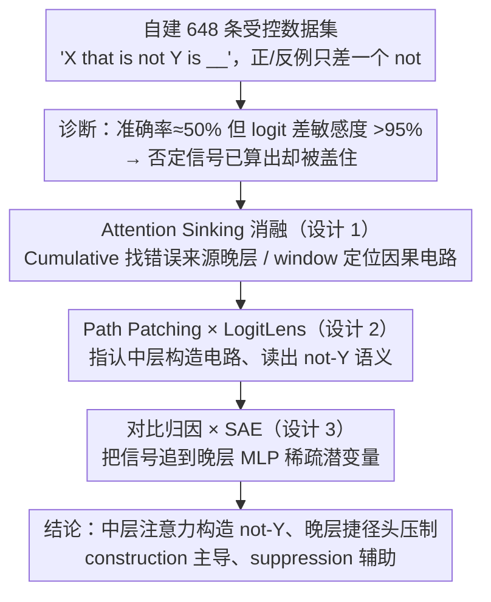

# How Language Models Process Negation

**会议**: ICML2026  
**arXiv**: [2605.03052](https://arxiv.org/abs/2605.03052)  
**代码**: https://github.com/Ja1Zhou/LM_Negation  
**领域**: 可解释性  
**关键词**: 否定理解, 机制可解释性, 注意力捷径, 构造与抑制, LogitLens

## 一句话总结
本文用机制可解释性方法剖析 Llama-3.1-8B / Mistral-7B 处理"X that is not Y is __"类否定句的内部电路，发现模型其实"会"做否定（中层注意力在最后位置直接构造出 $\bar Y$ 表示，例如 "not gas" → solid），但被晚层"捷径"注意力头压住——把这些头按"注意力下沉"方式消融，否定题准确率最高可绝对提升 17%。

## 研究背景与动机
**领域现状**：机制可解释性（MI）目前的主流分析对象是"事实回忆"类提示（如"The Colosseum is in __"），可以用各 token 对答案的加性贡献来解释；常用工具有 logit lens、causal tracing、path patching 等。

**现有痛点**：否定（negation）天然不属于加性范式——"not" 本身不携带可叠加的事实信息，而是要和被否定的概念 Y 组合后才能影响答案；同时，多项 BERT/RoBERTa 时代的工作都报告 LM 在否定题上像"瞎猜"（准确率约 50%），但又有迹象显示模型内部对否定是敏感的。两类证据看起来矛盾，无人从电路层面同时解释"为什么会错"和"内部到底怎么算否定的"。

**核心矛盾**：先前 MI 工作（如 Wang et al. 2023 的 negative mover head、McDougall et al. 2024）倾向"抑制假设"——模型先列出与 Y 相关的 token 再压掉一部分；而神经科学和部分提示研究（Geva 2021）则更支持"构造假设"——模型显式生成 $\bar Y=\text{not }Y$ 的表示，再让 $\bar Y$ 直接促发正确答案。两套假说哪一种成立、是否共存、是否还存在"误导项"，至今没有统一回答。

**本文目标**：拆成三个子问题—— (i) 当前开源 LLM 到底"会不会"否定？错在哪一段电路？ (ii) 能否找到并消融这段"作恶"电路，从而把否定准确率拉回来？ (iii) 模型实际用的是构造、抑制还是两者并存？哪个更主导？

**切入角度**：作者从"输出准确率"和"logit 差敏感度"两条曲线的背离入手——准确率 ~50%，但 logit 差对"not"的存在表现出 95%+ 的一致响应。这说明否定信号已被算出来了，只是被后面的什么东西盖住；只要顺着残差流和注意力图把这股"盖压力"定位出来，就能验证整条电路。

**核心 idea**：用"Attention Sinking"（强迫某些注意力头只盯首 token 和当前 token，从而"温柔地"敲掉它们的搬运功能）+ path patching + LogitLens + SAE 对比归因这一组合拳，把否定电路拆成"早层把 not 搬到 Y 位"→"中层构造 $\bar Y$ 并搬到末位"→"中层同时弱抑制 Y"→"后层 MLP 把 $\bar Y$ 放大成正确答案"四段流水线，并指认晚层"捷径头"是错误根源。

## 方法详解

### 整体框架
作者要回答的核心问题是"模型到底会不会做否定、算否定的电路长什么样、错在哪一段"，而把它转化成一个可被机制工具切开的受控实验：自建 162 题 × 4 模板 = 648 条数据集 $\mathcal D=\{(P_+,P_-,y_+,y_-)\}$，正例如 "An animal that is an amphibian is a frog"、反例只插入 "not"（答 "mammal"），且 $y_+,y_-$ 都是单 token。然后分两阶段递进：先在 6 个开源模型上用"准确率 vs. logit 差敏感度"的背离证明否定信号其实已经算出来、再用 Cumulative Attention Sink 把晚层注意力敲掉以确认晚层是错误来源；随后在 Llama-3.1-8B / Mistral-7B 上用 window Attention Sink + path patching 把中层的因果电路定位出来、用 LogitLens 读出它构造的是什么语义，最后用对比归因 + 预训练 SAE 把信号一路追到晚层 MLP 的具体潜变量。

### 关键设计

**1. Attention Sinking 消融：用模型自带的"偷懒"现象温柔地关掉一个注意力头**

机制定位通常用 Attention Knockout 把某个 token 在注意力里抹零，但这会引入"换源激活"的噪声、还得依赖对照 prompt，容易把"是 $\mathcal{AO}(P_-)$ 失去因果"和"是 $\mathcal{AP}(P_+)$ 被强行带入"混为一谈。本文受 Xiao et al. 2024 的 attention sink 现象启发——他们观察到末位 token 在大模型里平均把 64%–80% 的注意力质量压在首 token + 当前 token 上（Table 1），说明这是注意力的"默认空闲态"。于是作者直接把目标头的 attention pattern 改写成"只能看首 token 和自己"，切断它的跨位信息搬运而保留 value/MLP 等本地计算；由于注意力质量仍归一化在两个"无信息" token 上，几乎不破坏后续层的数值稳定。这一手法配两种扫描粒度——从层 $i$ 一直 sink 到 $L$ 的 "Cumulative" 变体用来找错误来源，只 sink 一段窗口的 "window" 变体用来精确定位因果电路。因为副作用极小，它还能直接当成训练免费的推理期修复：在 Llama-3.1-8B 上把否定准确率从 50.5% 拉到 67.8%，在 Mistral-7B 上 45.2% → 65.9%（Table 3）。

**2. Path Patching × LogitLens：指认中层"构造电路"并读出它的语义**

确认晚层是"捷径"之后，还要回答中层到底哪个注意力模块在执行 "not Y" 的组合、它输出的向量是什么意思。作者用修改版 path patching：sender 取某层注意力输出 $\mathcal{AO}_\ell$、receiver 取末位输出嵌入，对负例 $P_-$ 跑正向时把目标层的 $\mathcal{AO}_\ell(P_-^{pp})$ 替换成正例 $\mathcal{AO}_\ell(P_+)$、其余层固定注意力 pattern 但重算 MLP，若 $\Delta(P_-;y_-,y_+)>0$ 翻成 $\Delta(P_-^{pp};y_+,y_-)>0$ 就判该层因果重要，并用 window Attention Sink 交叉验证（两条曲线在 Llama-3.1-8B 的 layer 14 同时出尖峰、layer 17 出峰）。但 path patching 单看容易和"$\mathcal{AP}(P_+)$ 引入新因果"混淆，所以再对这些层的 $\mathcal{AO}_\ell$ 在末位用 LogitLens 投影回词表、取 top-10 promoted token 交给 gpt-oss-120B 标注是否与 "not Y" 相关——两者交叉才能同时给出"哪层因果重要"和"它输出什么语义"。结果 >80% 的样本能在至少一层找到 $\bar Y$ 相关 token（"not gas" → solid、"not in Asia" → America、"not located near the ocean" → inland）；用 LLM 标注把分析从挑出来的几个例子扩展到 648 题级别，"构造为主"才成为可统计的结论而非轶事——同方法测抑制只命中 ~30% 样本，由此判定 construction > suppression。

**3. 对比归因 × SAE：把信号追到具体 MLP 潜变量**

最后一段电路是"中层注意力构造 $\bar Y$ → 后层 MLP 把它放大成 $y_-$"，需要找出真正在 promote 否定答案的具体 MLP 单元。作者取 unembedding 行差 $d=W_U(y_-)-W_U(y_+)$ 作为"负正答案差异方向"，对任意成分 $x$ 定义贡献 $\mathcal C(x,P)=\langle W_U^\top \mathcal{LN}_{L+1}(x),d\rangle$，再做两套对比 $\mathcal C(\mathcal{MO}_i,P_-)-\mathcal C(\mathcal{MO}_i,P_+)$ 与 $\mathcal C(\mathcal{MO}_i,P_-)-\mathcal C(\mathcal{MO}_i,P_-^{as})$——这种 contrastive 设计直接消去任何与"答案差异方向"无关的稳定背景，只让真正在 $P_-$ 上额外贡献 $y_-$ 的成分得高分。取两套各自 top-10 MLP 的交集得到约 layer 17–25 的关键 MLP，再套上 He et al. 2024 的预训练 SAE 把输出展成稀疏潜变量 $\mathcal{MO}_i\approx\sum_j\beta_j f_j$——把 >10k 维稠密激活压到 <100 个稀疏潜变量，是当前几乎唯一能让人肉眼判读潜变量功能的可扩展手段。对每个潜变量再做同样的对比归因、挑出 top 潜变量后用 LogitLens 看它们 promote/demote 哪些 token（"not biodegradable" → 'plastic','trash','litter'；"not open source" → 'Win','Windows','.exe'，Table 4）；其中 top demoted token 普遍不可解释，又从另一侧印证 construction > suppression。

### 训练策略
本工作纯属推理期机制分析，无新增训练损失：SAE 直接复用 He et al. 2024 在 Llama-3.1-8B 上预训练好的整套套件，LLM 标注用 openai/gpt-oss-120b，评估全部在 last-token 位置读 logit。

## 实验关键数据

### 主实验

数据集：作者自建 648 条 "X that is not Y is __" 受控数据；评估指标包括 positive/negative accuracy（在末位 logit 上看 $\Delta$ 符号）和 sensitivity（$\Delta(P_-;y_-,y_+)>\Delta(P_+;y_-,y_+)$ 的样本比例）。

| 模型 | Pos Acc (%) | Neg Acc (%) | Sensitivity (%) | Attn Sink 后 Neg Acc (%) | LogitLens 后 Neg Acc (%) |
|------|------------|-------------|-----------------|---------------------------|----------------------------|
| Llama-3.1-8B | 95.2 | 50.5 | 97.4 | 67.8 (+17.3) | 53.6 |
| Mistral-7B-v0.1 | 96.3 | 45.2 | 95.1 | 65.9 (+20.7, 相对 46%) | 61.6 |
| Qwen2.5 | 93.5 | 57.6 | 96.0 | 65.4 | 59.4 |
| Qwen3 | 91.8 | 55.7 | 95.2 | 64.2 | 59.6 |
| Gemma-2 | 96.5 | 49.7 | 97.5 | 66.1 | 59.7 |
| OLMo-2 | 96.3 | 54.0 | 97.8 | 68.7 | 61.6 |

### 消融 / 分析实验

| 配置 | 关键指标 | 说明 |
|------|---------|------|
| Vanilla full model | Neg Acc ≈ 50% | 准确率近随机但 sensitivity 高 → 内部有否定电路但被压制 |
| Cumulative Attn Sink 从最佳层起 | Neg Acc 最高 +17% 绝对 | 最佳层一律 >0.5L → 捷径头集中在中后期 |
| Window Attn Sink @ layer 14 | Neg Acc 明显下降 | 该窗口是构造电路的因果核心 |
| Window Attn Sink @ layer 17 | Neg Acc 反而上升 | 验证 layer 17 周边是"捷径头" |
| LogitLens on $\mathcal{AO}_\ell$ | >80% 样本能找到 "not Y" 相关 promoted token | 支持构造假设 |
| 同方法找"Y" 相关 demoted token | >30% 样本命中 | 抑制存在但弱于构造 |
| OLMo-2 预训练 checkpoint 扫描 | Neg Acc 早期暴跌后回升、Pos Acc 单调上升 | 捷径头在早期预训练就形成 |

### 关键发现
- **"算出来了但被盖住"**：6 个开源模型 sensitivity 都 ≥ 95% 而 negative accuracy 集中在 45–58%，黑盒指标严重低估了内部否定能力；这一差距完全由中后期注意力捷径造成，把它们 sink 掉就能直接释放出 17%+ 的提升，无需任何额外训练。
- **构造主导，抑制辅助**：同样的 LogitLens 流水线下，构造证据命中率 >80%、抑制证据命中率 ~30%；SAE 潜变量的 top promoted token 是可解释概念词，top demoted token 多为乱码，从两侧独立印证 "construction is more central"。
- **捷径头起源于预训练早期**：OLMo-2 checkpoint 扫描显示 Neg Acc 在训练早期先暴跌，随后随预训练继续才被否定电路追回，说明捷径头是大量 "X is Y" 共现统计的副产品，并非微调阶段引入——这为后续"否定友好型预训练数据"提供了直接证据。

## 亮点与洞察
- **Attention Sinking 是一种"温柔"的注意力消融**：相比 Attention Knockout 把某个 token 在注意力里抹零，sink 顺势利用了模型本身就有的"看首 token 偷懒"现象，几乎不引入分布偏移，因此既可用于因果定位也可作为推理期修复手段，比起需要训练的对齐方案明显轻量。
- **"准确率 vs. 敏感度"的背离是检测被掩盖能力的通用信号**：本文给所有 MI 工作提了个醒——黑盒指标差不代表能力缺失，可能只是某个晚层电路在反向拉扯；今后审计 LLM 的"幻觉""指令对齐失败"等问题时，可以先看 logit 差是否敏感再决定要修电路还是补数据。
- **对比归因 × SAE 把"找 MLP 单元"做成可批量化的流水线**：用 $d=W_U(y_-)-W_U(y_+)$ 作为投影方向、用两套对比消去公共背景，再用 SAE 把 MLP 展成稀疏潜变量，使得人工肉眼校验的工作量从"几万维稠密激活"降到"每样本 ~50 个潜变量"，这套配方对 chain-of-thought、refusal、bias 等机制研究均可平移。

## 局限与展望
- 作者承认只研究了"显式否定"（not/no/cannot），未涉及词法否定（"unhappy"）、副词否定（"seldom"）、否定代词（"nobody"），这些可能走完全不同的电路。
- 数据规模较小（162 题 × 4 模板，全部走单 token 答案、强模板格式），是否能推广到长上下文、对话式否定、否定堆叠（"not X but Y"）仍不确定；SAE 部分仅在 Llama-3.1-8B 上做（因为 He et al. 2024 给了完整 SAE 套件）。
- 论文虽给出 "Attention Sinking 推理期可直接提升 17%"，但并未跨任务系统评估这一手段对一般 QA、推理任务是否有副作用——若把捷径头视为"统计先验"，关掉它在反事实/罕见组合上可能有代价。
- 可延伸方向：把 Attention Sinking 当作训练目标（penalize late-layer shortcut heads）、把对比归因从"否定"推广到"反事实条件"、用电路层证据指导否定数据增强（如在预训练早期注入更多 "X is not Y is Z" 模板，看 OLMo-2 的早期"暴跌"是否能被填平）。

## 相关工作与启发
- **vs Wang et al. 2023 / McDougall et al. 2024**：他们发现 "negative mover heads"（专门压低注意 token 的头），支持"抑制假设"；本文用 LogitLens + LLM 标注证明这只是部分图景，模型同时也在中层显式构造 $\bar Y$，且构造证据强度 >2 倍于抑制证据。
- **vs Geva 2021/2023 的"事实回忆电路"**：那一系列把回忆解释为 MLP key-value 的加性叠加；本文展示"否定"恰好打破加性范式——必须经过"搬运 not + 中层构造 + 后层放大"三段非加性流水线才能成立，对"加性可解释性能否覆盖组合语义"给出了反例。
- **vs Hermann et al. 2024（shortcut features）/ Mann et al. 2025（"not X" 反而提升 X 可达性）**：本文把这两类观察落实为具体的"晚层 shortcut attention heads"，并给出 Attention Sinking 这一可操作的缓解工具，把"shortcut 现象学"推进到"shortcut 电路定位+修复"。
- **vs Gromov 2025 / Halawi 2024（晚层冗余/无效）**：那些工作发现晚层在很多任务上可剪枝；本文与之呼应——在否定任务上晚层不仅冗余，甚至是负贡献，因此 sink 之后才正确。

## 评分
- 新颖性: ⭐⭐⭐⭐⭐ 同时提出 Attention Sinking 与对比归因×SAE 两套方法，并首次系统证明"construction 与 suppression 共存且前者主导"。
- 实验充分度: ⭐⭐⭐⭐ 跨 6 个开源模型 + OLMo-2 全 checkpoint 时间序列 + 多种 MI 方法交叉验证；但数据集偏小、模板偏窄。
- 写作质量: ⭐⭐⭐⭐⭐ 假设 → 证据 → 反证逻辑闭合得很干净，每一节都对应回 Figure/Table。
- 价值: ⭐⭐⭐⭐⭐ 给出"训练免费、即插即用"的否定准确率提升手段，并把 MI 研究范式从"加性事实"扩到"组合语义"，对后续电路审计与对齐研究都有溢出。

<!-- RELATED:START -->

## 相关论文

- [\[ICML 2026\] Query Circuits: Explaining How Language Models Answer User Prompts](query_circuits_explaining_how_language_models_answer_user_prompts.md)
- [\[ICML 2026\] Towards Atoms of Large Language Models](towards_atoms_of_large_language_models.md)
- [\[ACL 2026\] How Language Models Conflate Logical Validity with Plausibility: A Representational Analysis of Content Effects](../../ACL2026/interpretability/how_language_models_conflate_logical_validity_with_plausibility_a_representation.md)
- [\[CVPR 2026\] Understanding Counting Mechanisms in Large Language and Vision-Language Models](../../CVPR2026/interpretability/understanding_counting_mechanisms_in_large_language_and_vision-language_models.md)
- [\[NeurIPS 2025\] Base Models Know How to Reason, Thinking Models Learn When](../../NeurIPS2025/interpretability/base_models_know_how_to_reason_thinking_models_learn_when.md)

<!-- RELATED:END -->
