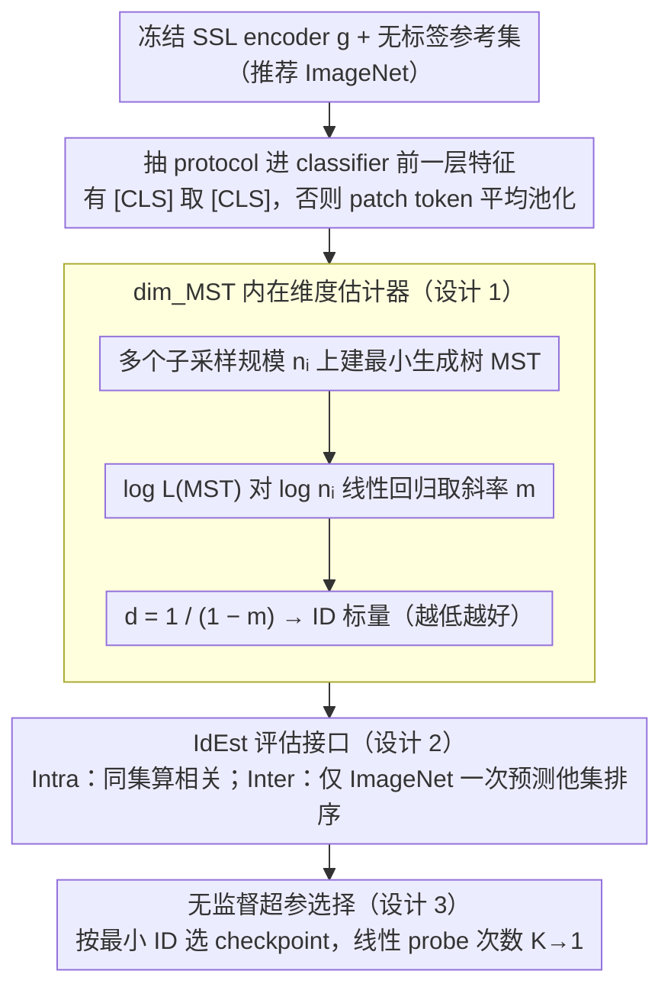

# IdEst: Assessing Self-Supervised Learning Representations via Intrinsic Dimension

**会议**: ICML2026  
**arXiv**: [2606.03338](https://arxiv.org/abs/2606.03338)  
**代码**: 待确认  
**领域**: 自监督学习 / 表示评估  
**关键词**: 自监督学习, 内在维度, 最小生成树, 表示质量评估, 无监督模型选择

## 一句话总结
本文提出 IdEst：用最小生成树维度估计器 $\mathrm{dim}_{\mathrm{MST}}$ 去测自监督表示的内在维度（ID），把这个无标签的几何量当作下游线性 probe 精度的代理，在 33 个 SSL 模型上 Spearman $\rho \approx -0.8$，并可用于无标签超参选择。

## 研究背景与动机

**领域现状**：自监督学习（SSL）已经成为从无标签数据学表示的主流范式（SimCLR / DINO / I-JEPA / CLIP 等），但评估这些表示的标准做法仍然是**线性 probe**——拿一份带标签的下游数据集（如 ImageNet），在冻结特征上训一个线性分类头看准确率。这套协议有三大代价：算力开销大、对超参（学习率、weight decay、epochs）敏感、且只给出一个标量分数，对表示的**几何结构**几乎不提供洞察。

**现有痛点**：已有的"无监督代理指标"各有局限。$\alpha$-ReQ 假设特征谱服从幂律，一旦发生表示坍塌（rank-deficient）就失效；RankMe 算的是有效秩，主要为联合嵌入（JEA）方法设计，在 I-JEPA 这类联合预测方法上偏弱；LiDAR 表现不错但**需要 SSL 预训练时用的数据增强**，对只有冻结表示的下游用户不友好。

**核心矛盾**：要"无监督、跨范式、只用冻结特征"地评估 SSL 表示质量。理论上，已有结果（Konz & Mazurowski, 2024）指出泛化误差近似为 $\mathcal{L} \sim \mathcal{O}(K_L N_D^{-1/d})$，其中 $d$ 是表示流形的内在维度——这暗示**低 ID 等价于高质量表示**。但实际估 ID 时，常用的 TwoNN 和 MLE 都依赖局部各向同性 + i.i.d. 假设，在 SSL 这种 $n \approx d$ 的非渐近、数据点之间有强依赖（同一图像的多视图）的场景下会严重失稳，文中 Figure 2 显示在一个简单的 1 维 helix 上 TwoNN 甚至会发散到无穷。

**本文目标**：找一个在 SSL 非渐近 + 高维 + 强依赖的"恶劣条件"下仍然稳定的 ID 估计器，并验证它能否真的反映下游性能。

**切入角度**：从 Costa & Hero（2006）的**欧氏泛函理论**出发——最小生成树（MST）的长度增长率渐近正比于数据分布的 Rényi 熵，并由此导出一个对数据密度变化和噪声鲁棒、对环境维度不敏感的 ID 估计器 $\mathrm{dim}_{\mathrm{MST}}$。

**核心 idea**：用 MST 长度的标度律 $L(\mathrm{MST}(X_n)) \propto n^{(d-1)/d}$ 反推 $d$，把它套到任何 SSL 模型的冻结表示上，得到一个无监督的"表示质量计"——IdEst。

## 方法详解

### 整体框架
IdEst 解决的问题是：在没有标签、不重训、不碰原始增强的前提下，怎么判断一个 SSL encoder 学出来的表示好不好。它的答案不是再设计一个 SSL 损失，而是把"表示质量"换算成一个纯几何量——表示流形的内在维度（ID）。给定一个训好的 encoder $g$ 和一份无标签数据 $\mathcal{X}$（推荐用 ImageNet 当参考集），先用 $g$ 抽冻结特征（有 [CLS] token 的取 [CLS]，I-JEPA 这类没有 [CLS] 的对 patch token 做 average pool），再在特征点云上跑 MST 维度估计器算出一个 ID 标量，值越低代表表示越紧凑、下游越好。这个数字可以直接拿来排序不同 checkpoint、追踪训练曲线，或做无标签超参选择。

### 关键设计

**1. MST 维度估计器 $\mathrm{dim}_{\mathrm{MST}}$：用全局连通结构换掉脆弱的局部假设**

SSL 表示评估真正卡住 ID 估计的地方在于 TwoNN/MLE 这些经典估计器都建立在"局部各向同性 + 邻域内点 i.i.d. Poisson"上，而 SSL 特征恰恰是 $n \approx d$ 的非渐近、同一图像多视图之间强依赖的"恶劣点云"，文中 Figure 2 在一条 1 维 helix 上就让 TwoNN 发散到无穷。$\mathrm{dim}_{\mathrm{MST}}$ 改走 Costa-Hero 的欧氏泛函路线：从紧黎曼 $d$-流形上 i.i.d. 采 $n$ 个点构成的最小生成树，其总长几乎处处满足 $n^{-(d-1)/d} \cdot L(\mathrm{MST}(X_n)) \to C' \int f_X^{(d-1)/d}\,d\mathcal{H}$，于是只要取一串子采样规模 $n_i$，对 $\log L(\mathrm{MST}(X_{n_i}))$ 关于 $\log n_i$ 做一维线性回归，斜率 $m$ 就反推出 $d = 1/(1-m)$。它之所以稳，是因为 MST 同时编码局部和全局的连通结构，而不只是看最近邻，对噪声和密度变化都鲁棒；更关键的是它与 0 维持续同调维度 $\mathrm{dim}_{\mathrm{PH}}^0$ 等价（Adams et al., 2020），直接继承 TDA 整套稳定性保证（Chazal et al., 2014）。在那条 1 维 helix 上，$\mathrm{dim}_{\mathrm{MST}}$ 稳定收敛到 $d=1$。

**2. IdEst 评估接口：与线性 probe 完全可比的"插即用"指标**

要让 SSL 实践者零成本接入，IdEst 把 $\mathrm{dim}_{\mathrm{MST}}$ 放在每个 SSL 方法**官方 evaluation protocol** 进 classifier head 前的那一层特征上计算，这样得到的 ID 和该方法的线性 probe 精度严格对齐、可直接比对，整个过程不需要重训、不需要标签、不需要原始增强，只跑一次前向。接口提供两种用法：**Intra-Dataset** 在目标数据集上同时算 ID 和精度看相关性；**Inter-Dataset** 只在 ImageNet 上算一次 ID，去预测 iNat / CIFAR / kNN / ImageNet-v2 上的精度排序——后者能成立，恰好证明 ID 反映的是模型自身性质而非某个数据集的偏置，实践中一份参考集就够用。

**3. 无监督超参选择器：把线性 probe 的次数从 $K$ 降到 1**

线性 probe 本身就是 SSL pipeline 的算力大头，超参网格一大、数据集一多就更贵。IdEst 把"扫超参 + 每组跑一次线性 probe"的昂贵循环替换成"每组只算一个前向 + MST 的几何量"：对学习率 / weight decay / teacher-student temperature / target-context size 等候选超参各训一个模型，按最小 ID 挑出最优 checkpoint，最后只对这一个 checkpoint 做一次真正的下游评估。相比拿 ImageNet 当 oracle 逐个 probe，线性 probe 次数从 $K$ 降到 1，把超参搜索开销削掉一个数量级，且全程不碰任何下游标签。

### 损失函数 / 训练策略
IdEst 是 **post-hoc 评估指标**，不引入任何新的损失或训练过程。MST 构造用经典的 Prim/Kruskal 算法，复杂度 $O(n^2)$ 或更优；ID 回归只是一个一维线性拟合。完整算法见原文 Algorithm 1。

## 实验关键数据

### 主实验：跨 33 个模型的相关性
跨 4 个 SSL 范式（joint-embedding / joint-predictive / 组合 / vision-language）、2 种架构（ResNet / ViT）、多种规模（ViT-S 到 ViT-G）的 14 种方法，共 33 个 checkpoint。

| 评估设置 | 参考数据集 | 目标数据集 / 协议 | Kendall $\tau$ | Spearman $\rho$ |
|---------|-----------|------------------|----------------|-----------------|
| Intra-Dataset | ImageNet | ImageNet linear probe | $\approx -0.6$ | $\approx -0.8$ |
| Intra-Dataset | iNat-18 | iNat-18 linear probe | $\approx -0.6$ | $\approx -0.8$ |
| Intra-Dataset | SUN397 | SUN397 linear probe | $\approx -0.6$ | $\approx -0.8$ |
| Inter-Dataset | ImageNet | CIFAR-10 / CIFAR-100 / iNat | 强负相关 | 强负相关 |
| Alt. Protocol | ImageNet | kNN / ImageNet-v2 | 强负相关 | 强负相关 |

负号符合预期：**ID 越低，下游 acc 越高**。

### 消融实验：与已有无监督指标对比 + 跨范式稳健性

| 配置 / 指标 | 需访问预训练数据增强 | 在 I-JEPA 上 | 跨 SSL 范式稳健性 |
|------------|---------------------|--------------|---------------------|
| $\alpha$-ReQ | 否 | 假设崩溃时失效 | 弱 |
| RankMe | 否 | 偏弱（专为 JEA 设计） | 仅 JEA |
| LiDAR | **是** | 强 | 强但依赖增强 |
| **IdEst** | 否 | 强 | 跨四种范式都强 |

### 关键发现
- **ID 是跨 SSL 范式的统一几何描述子**：在 joint-embedding / joint-predictive / vision-language 三类完全不同目标的方法上都呈现一致的负相关，说明它捕捉的是"表示有多紧凑"而不是某个特定 SSL 损失的指纹。
- **Inter-Dataset 迁移性强**：只在 ImageNet 上算 IdEst 就能预测在 iNat / CIFAR / kNN / ImageNet-v2 上的性能排序，意味着实践中**用一份参考数据集就够了**。
- **训练动态可追踪**：Figure 7 显示在 VICReg / DINO / I-JEPA 三个方法的 offline / online probing 中，IdEst 随训练 epoch 单调下降并紧跟 linear probe 精度的上升曲线（早期 < 10 epoch 还在剧烈变化时除外）。
- **超参选择有效**：在学习率 / weight decay / teacher-student temperature / target-context size 等超参网格上，IdEst 选出的 checkpoint 落在 fine-grained 任务 ImageNet Oracle 给出的 acc 区间靠上一端（如 DINO ViT-S 在 ImageNet 选超参时 IdEst 选到 65.5，而 Oracle 上界 69.1，下界 48.4）。

## 亮点与洞察
- **理论 → 实践的直接桥**：从 Konz-Mazurowski 的 $\mathcal{L} \sim N_D^{-1/d}$ 标度定理直接选定"ID 越低越好"的方向，再用 Costa-Hero 的 MST 渐近定理给出一个能在 $n \approx d$ 下工作的估计器；整个论证链条清晰，且把已知失效的 TwoNN/MLE 排除掉的理由（依赖局部 Poisson + i.i.d.）也站得住脚。
- **MST = 0 维持续同调**：作者明确引用 Adams et al. (2020) 把 $\mathrm{dim}_{\mathrm{MST}}$ 与 TDA 中的 $\mathrm{dim}_{\mathrm{PH}}^0$ 等价化，这一桥梁让 ID 估计可以继承 TDA 整套稳定性理论（Chazal et al., 2014），对噪声扰动有可证明的稳定性，对未来想用其他 TDA 量（如更高维 PH）扩展评估指标的人是个很自然的入口。
- **可迁移到其他领域**：本质是"在冻结特征上估流形维度"，所以只要你有任何无监督学到的表示——LLM hidden states、graph embedding、speech encoder——都能套用。在 LLM 上 Tulchinskii et al. (2023) 已经验证了类似思路；视觉 SSL 这块本文算是把空白填上。

## 局限与展望
- **作者承认**：早期 < 10 epoch 时表示尚未"展开"，IdEst 不够 informative；MST 在 $O(n^2)$ 距离矩阵上构造，对超大特征集（百万级样本）仍有开销。
- **自己发现**：(i) 实验所用模型基本都是 ImageNet pre-trained，**域差距很大时**（如医学 / 卫星图像）ID 与下游精度的负相关是否仍然成立未验证；(ii) MST 估计在很高的 ambient dim（如 ViT-G 的 1536 维）下回归斜率会被噪声拉平，论文用了多个子采样 $n_i$ 但没有给出对采样调度的敏感性分析；(iii) "lower ID is better" 默认下游任务是分类，对生成 / 检索 / 密集预测任务是否仍单调待验证。
- **改进思路**：把 MST 替换成 **kNN graph + 谱估计**，或者在嵌入空间先做轻量降维（PCA / UMAP）再估 ID，可能在 ViT-G 这种超大特征上更稳；进一步可以把 IdEst 当作 SSL 训练时的**正则项**（最小化 ID）而非只是 post-hoc 评估，看是否能直接改善下游性能。

## 相关工作与启发
- **vs RankMe**：RankMe 测有效秩，本质是**线性可分性**的代理，主要为 joint-embedding 设计（专门治理表示坍塌）；IdEst 测**几何流形维度**，跨 JEA / I-JEPA / CLIP 都成立，覆盖面更广。
- **vs LiDAR**：LiDAR 算 SSL surrogate task 的 LDA 矩阵的秩，相关性也很强，但**必须有原始增强**才能算，对只拿到冻结模型的用户不友好；IdEst 完全只看冻结特征。
- **vs TwoNN / MLE-based ID**：之前的 ID 估计在监督 CNN 上能 work（Ansuini et al., 2019），但在 SSL 的 $n \approx d$ + 视图依赖下会失稳，本文 Figure 2 用 1 维 helix 直接戳穿；MST 估计器是真正"换底层"，而不是把旧估计器的参数调一调。
- **vs $\alpha$-ReQ**：$\alpha$-ReQ 看谱衰减率，在表示坍塌时直接失效；IdEst 即使在 rank-deficient 表示上也能给出有意义的 ID。

## 评分
- 新颖性: ⭐⭐⭐⭐ 把 MST 维度估计引入 SSL 评估虽然是 well-known 的工具迁移，但配合理论分析 + 跨范式实证是首次系统化做的。
- 实验充分度: ⭐⭐⭐⭐ 33 个模型 × 4 个范式 × 多个数据集 × 多种 protocol（线性 probe / kNN / ImageNet-v2 / fine-grained），且对超参选择给出实际数据，足够说服。
- 写作质量: ⭐⭐⭐⭐ 动机—理论—估计器局限—新估计器—实验，逻辑链非常顺；图 2 用 helix 反例戳 TwoNN 的设计很漂亮。
- 价值: ⭐⭐⭐⭐ 直接给 SSL 实践者一个无标签、跨范式、便宜的评估工具，对超参搜索的算力削减是实打实的收益。

<!-- RELATED:START -->

## 相关论文

- [\[ICML 2026\] Interpretable Self-Supervised Learning via Representer Landmarks and Nyström Approximation](interpretable_self-supervised_learning_via_representer_landmarks_and_nyström_app.md)
- [\[CVPR 2025\] Probing the Mid-Level Vision Capabilities of Self-Supervised Learning](../../CVPR2025/interpretability/probing_the_mid-level_vision_capabilities_of_self-supervised_learning.md)
- [\[ICCV 2025\] AIM: Amending Inherent Interpretability via Self-Supervised Masking](../../ICCV2025/interpretability/aim_amending_inherent_interpretability_via_self-supervised_masking.md)
- [\[NeurIPS 2025\] Dataset Distillation for Pre-Trained Self-Supervised Vision Models](../../NeurIPS2025/interpretability/dataset_distillation_for_pre-trained_self-supervised_vision_models.md)
- [\[ICML 2026\] Learning Coherent Representations: A Topological Approach to Interpretability](learning_coherent_representations_a_topological_approach_to_interpretability.md)

<!-- RELATED:END -->
