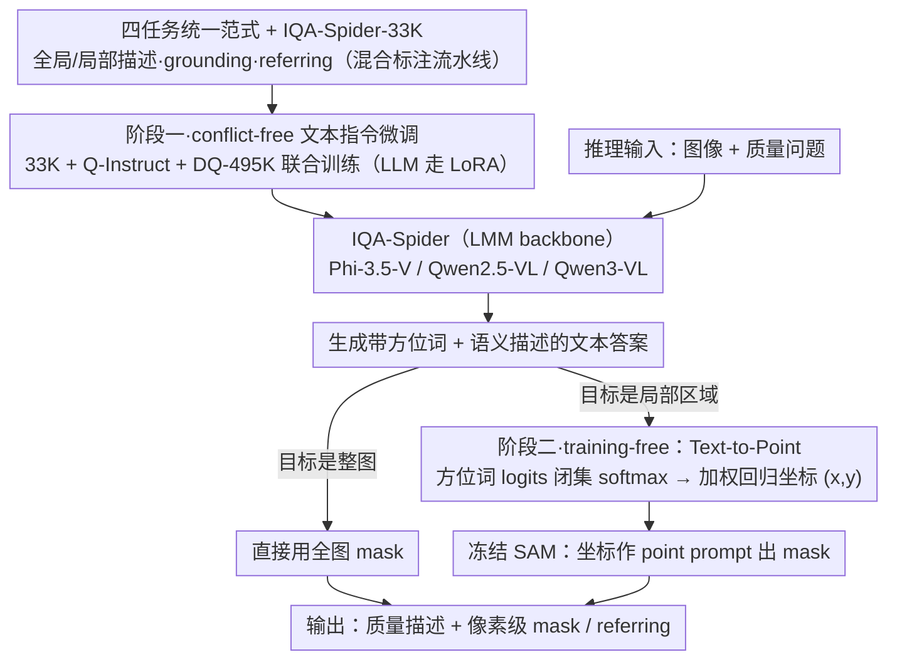

# IQA-Spider: Unifying Multi-Granularity Image Quality Assessment with Reasoning, Grounding and Referring

**会议**: ICML 2026  
**arXiv**: [2605.24553](https://arxiv.org/abs/2605.24553)  
**代码**: https://github.com/Helen1p/IQA-Spider.git (有)  
**领域**: 多模态VLM / 图像质量评估  
**关键词**: 多粒度IQA, LMM, 像素级 grounding, text-to-point, 训练自由

## 一句话总结
本文提出 IQA-Spider，一个把"全局质量描述 + 局部质量描述 + 像素级 grounding + 区域级 referring"四类任务统一到一个 LMM 框架里的多粒度图像质量评估方法，配套构建了 33K 规模的多任务数据集，并用一种 training-free 的 text-to-point 范式把语言模型的位置词 logits 直接映射成 SAM 的点 prompt，在多粒度 IQA 基准上全面超越现有 Q-Instruct / Q-Ground 等专用模型。

## 研究背景与动机

**领域现状**：基于大多模态模型（LMM）的图像质量评估（IQA）近两年快速发展，从 Q-Bench / Q-Align 的全局打分，到 Q-Instruct / DepictQA-Wild 的质量描述与推理，再到 Q-Ground / Grounding-IQA 的像素级 grounding，已经形成多条相对独立的技术路线。

**现有痛点**：现有方法只覆盖单一感知维度——要么只会出整图描述，要么只会做基于固定 distortion 类别的像素 grounding，无法在同一个模型里既"说清楚哪儿不好"又"指出在哪儿"。DepictQA-Wild 描述能力强但定位差；Q-Ground 能 grounding 但绑死在窄 distortion 词表里；同时引入像 `<seg>` 这类特殊 token 还会破坏 LMM 原本的指令跟随和推理能力。

**核心矛盾**：现有"language token + 特殊 grounding token"的耦合范式存在两难——要么改语言空间换 grounding（推理能力下降），要么纯文本输出（拿不到像素 mask）。同时数据侧缺少一个既覆盖"全局 / 局部 / grounding / referring"四种粒度、又能 scale up 的统一任务定义。

**本文目标**：(1) 把多粒度 IQA 形式化为一个四任务体系；(2) 用 scalable pipeline 造出对应数据集；(3) 在不破坏 LMM 文本推理能力的前提下，把 grounding 接到 SAM。

**切入角度**：作者关键观察是——LMM 在生成位置描述时（"top/bottom/left/right"），其原生 token logits 本身就编码了空间分布概率，根本不需要再训练特殊 grounding token，只要把这些位置词 logits 加权平均回归成坐标，就能直接喂给 SAM 当点 prompt。

**核心 idea**：用一个统一四任务定义 + 两阶段训练（先文本多粒度推理、再 training-free 像素 grounding），把"reasoning + grounding + referring"塞进同一个 LMM，而 grounding 完全靠复用原生位置词 logits 实现，零额外参数、零额外监督。

## 方法详解

### 整体框架

IQA-Spider 想解决的是"同一个模型既能说清画质哪儿不好、又能在像素上指出在哪儿"，做法是把一个 LMM backbone（Phi-3.5-Vision / Qwen2.5-VL / Qwen3-VL）和一个全程冻结的 SAM 分割头拼起来，让语言模型负责推理和描述、SAM 负责出 mask。给定图像和质量问题，LMM 先生成带方位词（top/left 等）和语义描述的文本答案；如果答案暗示目标就是整图，直接用全图 mask，否则把方位词的 logits 经 text-to-point 模块折算成一个坐标点，喂给 SAM 当 point prompt 出最终 mask。

整套训练是两阶段、conflict-free 的：第一阶段只在文本层面做多任务指令微调（LLM 走 LoRA、视觉编码器和 projector 全参微调），把全局/局部描述、grounding 的文本答案、referring 一起学会；第二阶段完全不训练，靠 text-to-point 把第一阶段学到的文本方位感知"零成本"升级成像素级 grounding。

### 关键设计

**1. 四任务统一范式 + IQA-Spider-33K 数据集：先补齐任务空间，再造数据**

以往 IQA 数据集要么只标 distortion 类别（太窄）、要么只给全图描述（太粗），缺一个支持"区域感知 + 多任务联合训练"的统一定义，所以本文先把 IQA 形式化成四类任务：全局质量描述、局部质量描述、视觉质量 grounding，以及视觉质量 referring（short/long 两种回答）。其中 grounding 又细分成 HyD-G（混合 distortion 强度）、SiD-G（单 distortion 强度）、DAO-G（distortion 累积顺序）三个子任务，把从全图到像素的所有粒度都覆盖到。数据用混合标注流水线生成：合成 distortion 走全自动管线（SSA 抽语义实例区域 → 按 mask 注入多种 distortion → InternVL-2.5 多轮对话生成 QA），真实 distortion 走半自动（人工标 region-level distortion 标签 + InternVL-2.5 写 QA），同时把 Q-Instruct、DQ-495K 等已有数据 conflict-free 地融进来。最终对 40% 样本做 10 人评分，>80% 样本在语义/空间/distortion/语言四个维度都拿到 4-5 分。关键在于这不是单纯扩规模，而是先建立 task-and-data 体系，让多粒度学习有结构性的训练信号——所以 33K 这个相对小的规模就能撑起整套 benchmark。

**2. Text-to-Point Grounding 范式：复用原生方位词 logits 当 SAM 的点 prompt**

现有 SAM-based grounding（LISA / GLaMM 等）靠 `<seg>` 这类特殊 token 把语言生成和像素分割硬绑在一起，会损害原本的指令跟随和推理能力；另一些用 attention map 做隐式 prompt 的方法（Wu 2024c / Cao 2024）要么 memory 开销大、要么要额外 image encoder。作者的观察是：LMM 在生成方位词时，其原生 token logits 本身就编码了空间分布概率，根本不用再训特殊 token。具体做法是在指定方位词集合 $\{left, right\}$ 和 $\{top, bottom\}$ 上对 LMM hidden states 做闭集 softmax，$p_{l_i} = e^{\chi_{l_i}/\tau} / \sum_j e^{\chi_{l_j}/\tau}$；再按"左=0、右=1、上=0、下=1"的归一化坐标做加权平均 $x = \sum_i p_{w_i} \times W,\ y = \sum_i p_{h_i} \times H$，得到的坐标 $(x,y)$ 直接作为 SAM 的 point prompt。整条路径零额外参数、零额外监督、不动语言空间，因此 reasoning-preserving 且 plug-and-play，可以接到任意 LMM 上。

**3. 两阶段 conflict-free 训练：多源 IQA 数据"全加才升"**

要让一个 LMM 同时掌握全局/局部描述、grounding、referring 又互不打架，本文在第一阶段联合 Q-Instruct（全局/局部 QA）+ DQ-495K（distortion 识别与推理）+ 自建 IQA-Spider-33K 一起做指令微调，损失只用标准 next-token prediction cross-entropy；分割头自始至终冻结、不引入任何 grounding 专用 loss，第二阶段完全 training-free。这样设计是因为消融（Tab. 4）揭示了一个非单调规律：描述类任务对"只加单一外部数据集"敏感、会略降，但三套数据全加反而最好；grounding 主要受益于"显式区域-文本对齐"的数据，referring 则随数据多样性单调提升。三套数据互补，只有 conflict-free 联合训练才能同时撑起多粒度感知和对话能力。

## 实验关键数据

### 主实验

| 数据集 / 任务 | 指标 | 本文 (Qwen3-VL) | 之前 SOTA | 提升 |
|---|---|---|---|---|
| 自建 benchmark — Global Des. | GPT-4V score (0-10) | 7.12 | 5.90 (Qwen3-VL 基线) | +1.22 |
| 自建 benchmark — Local Des. | GPT-4V score (0-10) | 7.10 | 5.45 (Qwen3-VL) | +1.65 |
| 自建 benchmark — Grounding | GPT-4V score (0-5) | 2.41 | 1.25 (Qwen2.5-VL) | +1.16 |
| 自建 benchmark — Ref-long | Accuracy | 0.484 | 0.176 (Qwen3-VL) | +0.308 |
| Q-Bench-A1 (LLVisionQA-dev) | Accuracy | 74.45% | 67.56% (Q-Instruct) | +6.89% |
| Q-Ground-Test | mIoU | 0.338 | 0.271 (Q-Ground) | +0.067 |
| KADID-10K (打分) | SRCC/PLCC | 0.741/0.746 | 0.698/0.676 (Q-Instruct) | +0.043/+0.070 |

值得注意的是，Q-Ground-Test 上 IQA-Spider **从未在 Q-Ground-100K 上训练过、grounding 阶段 training-free**，仍然超过专门在该数据上微调过的 Q-Ground 基线，体现强泛化性。

### 消融实验（Tab. 4，基于 Qwen3-VL）

| 配置 | Global Des. | Local Des. | Grounding | Ref-short | Ref-long |
|---|---|---|---|---|---|
| 仅 Ours | 7.01 | 7.07 | 2.42 | 0.541 | 0.458 |
| Ours + Q-Instruct | 6.99 | 7.03 | 2.53 | 0.542 | 0.466 |
| Ours + DQ-495K | 7.00 | 6.86 | 2.36 | 0.547 | 0.476 |
| Ours + 全部 (IV) | **7.12** | **7.10** | 2.41 | **0.594** | **0.484** |

另外 text-to-point vs. EVF-SAM（Fig.5）：作者用三种文本输入（整答 / 仅空间 / 仅语义）喂 EVF-SAM，EVF-SAM 仅在"纯语义"输入下最好，且仍弱于本文的 training-free 点 prompt。

### 关键发现
- **训练自由的 text-to-point 比联合训练的 EVF-SAM 还强**：说明 LMM 原生位置 token 已经编码了足够强的空间分布信号，"硬训 special token"反而是浪费。
- **混合数据集的协同效应是非单调的**：单独加 Q-Instruct 或 DQ-495K 会让 description 任务掉点，但三套全加最好，说明数据互补性 > 单数据规模。
- **方法对 backbone 普适**：Phi-3.5-Vision (4B) / Qwen2.5-VL (7B) / Qwen3-VL (7B) 三种 backbone 都拿到一致性提升，验证 plug-and-play 性质。
- **跨域泛化强**：未在 Q-Ground-100K 上训仍在 Q-Ground-Test 击败专用模型，说明 text-to-point 把"位置感知"和"语义感知"解耦后泛化更好。

## 亮点与洞察
- **真正"零成本"的 grounding 接入方式**：复用 LMM 原生位置词 logits → 加权回归坐标 → SAM 点 prompt 这条路径极其简洁，没有新参数、没有新 loss、不破坏语言空间，是这类 reasoning-grounding 统一问题的一个很优雅的解法。
- **把 IQA 系统性拆成四粒度任务**：不是"再灌一份大数据"，而是先把任务空间补全（HyD-G / SiD-G / DAO-G 三种 grounding 子任务尤其细），数据反而做得相对小（33K）就能撑起 benchmark。
- **conflict-free 数据融合**：揭示了"多源 IQA 数据联合训练"的非平凡规律——单加会掉、全加才升，这对后续做多任务 IQA 数据混合训练有直接借鉴价值。
- **可迁移性**：text-to-point 这个 trick 不限于 IQA，任何"语言模型先描述位置 + 分割模型出 mask"的统一架构（医学图像分析、机器人视觉指令）都能直接复用，只要 LMM 输出里有显式方位词即可。

## 局限与展望
- 位置词被硬限定为 4 个（top/bottom/left/right），只能表达"分位 + 加权"的粗略位置，对中心、四角、细长形状等复杂区域不一定准；扩成 9 宫格或更细的 token 集是自然方向。
- 数据集规模偏小（33K），且依赖 InternVL-2.5 做 QA 生成，QA 质量上限被 base LMM 框住；作者自己也承认这是有意为之、强调"task 体系而非数据量"，但实际刷分可能仍受限。
- 评测高度依赖 GPT-4V 打分（5 轮平均），存在评估器偏好风险，且不易复现；如果换打分模型分数排序未必稳定。
- Grounding 是"分类 logits → 单点 prompt → SAM mask"的串行链路，遇到多个独立失真区域只能出一个点，难以一次性 ground 多区域；多点 / 多 mask 扩展尚未涉及。
- distortion 累积顺序（DAO-G）的标注严重依赖人工预定义的"perceptually recognizable accumulation orders"，迁移到全新 distortion 类型时需要重新标顺序。

## 相关工作与启发
- **vs Q-Ground**：Q-Ground 通过特殊 token 把 grounding 接上 SAM，需要 Q-Ground-100K 训练且会损害指令跟随；本文 training-free 复用位置 token，不需要专门 grounding 数据反而在 Q-Ground-Test 上更好。
- **vs LISA / GLaMM / Sa2VA**：这些通用 `<seg>` token 范式在通用分割上有效但 IQA 上 grounding 平均只有 0.078 - 0.192；本文 0.364 - 0.408，差距源自"reasoning-grounding 解耦"+"质量专用知识"两方面。
- **vs DepictQA-Wild / Grounding-IQA**：DepictQA-Wild 强描述弱定位，Grounding-IQA 强 bbox referring 但任务窄；本文用四任务体系把它们的能力一次性吃进同一个模型。
- **vs EVF-SAM**：EVF-SAM 用可训练多模态编码器把文本变 prompt，仍弱于本文 training-free 方案，说明在 grounding prompt 这个环节，"小而精的 logit 信号"可能比"大而全的语义编码"更有效。

## 评分
- 新颖性: ⭐⭐⭐⭐ text-to-point 用 logit 加权回归坐标的思路简洁优雅且实证有效，四任务体系也是 IQA 领域少见的整合性设计
- 实验充分度: ⭐⭐⭐⭐ 三 backbone × 多 benchmark（自建 + Q-Bench + Q-Ground-Test + KADID）+ 数据消融 + 与 EVF-SAM 对比，证据链完整
- 写作质量: ⭐⭐⭐⭐ 动机推导清晰、任务定义形式化到位，公式简洁；个别表格因竖排展示可读性略受影响
- 价值: ⭐⭐⭐⭐ "复用原生 token logits 当 grounding prompt"这条思路对所有"LMM + 分割头"统一架构都有借鉴价值，且 IQA-Spider-33K 数据集和四任务 benchmark 会成为后续多粒度 IQA 的标准评测

<!-- RELATED:START -->

## 相关论文

- [\[CVPR 2026\] Learning Where to Look and How to Judge: Resolution-agnostic Image Quality Assessment with Quality-aware Saliency](../../CVPR2026/interpretability/learning_where_to_look_and_how_to_judge_resolution-agnostic_image_quality_assess.md)
- [\[AAAI 2026\] DR.Experts: Differential Refinement of Distortion-Aware Experts for Blind Image Quality Assessment](../../AAAI2026/interpretability/drexperts_differential_refinement_of_distortion-aware_experts_for_blind_image_qu.md)
- [\[CVPR 2026\] HierUQ: Hierarchical Uncertainty Quantification with Adaptive Granularity Reconciliation for Degraded Image Classification](../../CVPR2026/interpretability/hieruq_hierarchical_uncertainty_quantification_with_adaptive_granularity_reconci.md)
- [\[CVPR 2026\] VIRO: Robust and Efficient Neuro-Symbolic Reasoning with Verification for Referring Expression Comprehension](../../CVPR2026/interpretability/viro_robust_and_efficient_neuro-symbolic_reasoning_with_verification_for_referri.md)
- [\[CVPR 2025\] KVQ: Boosting Video Quality Assessment via Saliency-Guided Local Perception](../../CVPR2025/interpretability/kvq_boosting_video_quality_assessment_via_saliency-guided_local_perception.md)

<!-- RELATED:END -->
