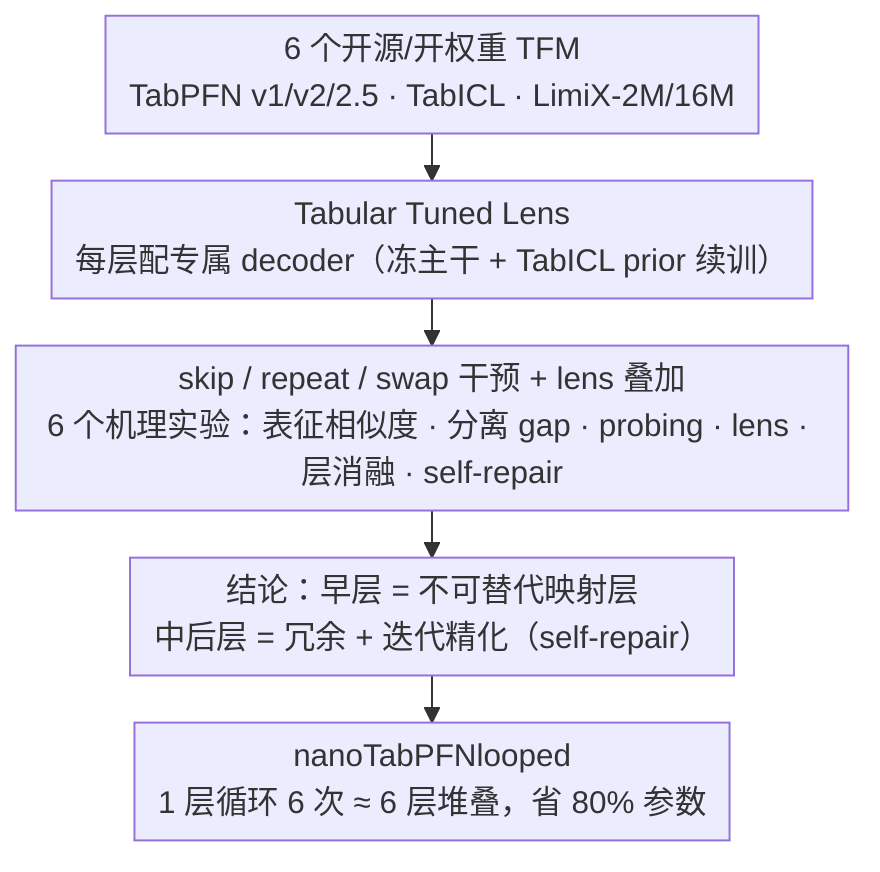

# Is One Layer Enough? Understanding Inference Dynamics in Tabular Foundation Models

**会议**: ICML 2026  
**arXiv**: [2605.06510](https://arxiv.org/abs/2605.06510)  
**代码**: https://github.com/amirbalef/is_one_layer_enough  
**领域**: 可解释性 / 表格基础模型 / 模型压缩  
**关键词**: TabPFN, 表格基础模型, 机理可解释性, 循环 Transformer, 层间动力学

## 一句话总结
作者对 6 个主流表格基础模型 (TFM) 做了首个大规模分层机理分析，发现中后层主要在做"迭代精化"且存在大量冗余，并据此设计了一个只用 20% 参数的单层循环 TFM，性能几乎追平六层原版。

## 研究背景与动机
**领域现状**：TabPFN、TabICL、LimiX 等基于 Transformer 的表格基础模型在中小规模表格预测上已经全面超过传统 GBDT 流水线，但它们内部到底是怎么"用 in-context learning 做贝叶斯推断"的，几乎是黑箱。

**现有痛点**：直接套用 LLM 的"logit lens"方法看 TFM 各层表征，结果非常脆弱（实验图 1 显示原始 decoder 在浅层几乎完全失效）；同时 TFM 是 encoder-only、非自回归、行不变的，和 LLM 架构差异大，LLM 现有的可解释性结论（早层 detokenize、中层抽象、后层 sharpening）能不能迁移完全没有答案。

**核心矛盾**：一方面，TFM 比 LLM 小、推理便宜，正适合做"大规模机理研究"；另一方面，缺乏对应的分析工具链，且每个 TFM 的 encoder 设计差异巨大，单点研究无法泛化。

**本文目标**：(1) 设计一套适配 TFM 的层级分析协议；(2) 回答"推理是在哪一层、怎么形成的"以及"和 LLM 比有什么异同"；(3) 用结论指导更高效的架构设计。

**切入角度**：作者注意到 TFM 任务是固定的分类/回归，可以直接训"per-layer decoder"（即"tabular tuned lens"），而不必像 LLM 那样依赖词表投影；并复用 LLM 机理研究里成熟的 skip / repeat / swap 三类干预实验。

**核心 idea**：通过 embedding 相似度、类别分离间隔、probing classifier、tabular logit lens、层消融、self-repair 6 个实验联合刻画 TFM 的层级动力学，用结论"中后层主要在迭代精化"反向支持"用一层循环替代多层"的更高效架构。

## 方法详解

### 整体框架
这篇工作要解决的是"TFM 内部到底哪一层、怎么形成预测决策"这个黑箱问题，它把答案拆成"先做一套适配 TFM 的层级分析协议、再用分析结论指导一个更高效架构"两步。分析协议固定 6 个开源/开权重 TFM（TabPFN v1/v2/2.5、TabICL、LimiX-2M/16M），在 PMLBmini（34 任务）和 TabArena（15 二分类任务）上跑 6 个粒度递进的机理实验（从表征相似度、类别分离、probing 到层级干预与自修复）；概念验证则基于公开的 nanoTabPFN，用同一套 TabICL prior 从头训出 6 层原版、单层版、单层循环 6 次版三种模型来检验结论。

### 关键设计

**1. Tabular Tuned Lens：给每层配一个专属 decoder 来读出"这层有没有答案"**

直接照搬 LLM 的 "logit lens"（拿最终 decoder 去读各层隐状态）在 TFM 上会在浅层彻底崩坏，图 1 里原始 decoder 的 ROC-AUC 在前几层接近 0.5，看起来像"早层什么都没学到"。问题不在表征而在 decoder 与表征错位：TFM 是 encoder-only、行不变的，没有词表 detokenizer 可借鉴。作者因此参照 Belrose 的 tuned lens，为每一层单独继续预训练一个 decoder——冻结主干，用 TabICL 的合成 prior 跑 200 epoch，每层得到一个专属解码头，从而能直接读出"如果推理就在第 $l$ 层停下、再接一个轻量分类头，能拿到多少分"。这把"早退是否可行"变成可测量的曲线，也是后面所有判别"哪层已经形成可用表征"的基础工具。

**2. skip / repeat / swap 三类干预叠加 lens：把"冗余"和"自修复"拆开看**

要判断每层在做什么，作者用三类结构性消融逐层探针：skip 第 $l$ 层看它是否不可替代；repeat 第 $l$ 层看它是否在做"可迭代的精化"（重复一次还能涨分就说明在精化）；swap 相邻两层看表征序列是否真按层对齐。光看"删完之后最终输出掉多少"会把"这层本来就没用（冗余）"和"这层有用但被后续层补回来了（自修复）"混在一起，所以作者在 skip 之上再叠 tuned lens：删掉第 $l$ 层后逐层读 lens 性能，如果下一层立刻把曲线拉回原位，就是冗余+自修复；如果一删就再也补不回来（图 8 中的早层），就说明这是关键且唯一的功能。正是这个叠加设计让"中后层冗余、可被循环替代"的结论站得住。

**3. nanoTabPFNlooped 单层循环：把"中后层只是迭代精化"直接做成省参架构**

如果中后层真的只是在迭代精化，那么"一层重复 N 次"理论上就该能匹配"N 层堆叠"。作者在公开复现版 nanoTabPFN（结构近似 TabPFN v2 但更轻）上做受控对比，训三组：6 层堆叠、1 层独立、1 层循环 6 次，参数量分别为 3.72M / 0.75M / 0.75M，但循环版的前向计算量等于 6 层堆叠版。三者用相同设定从头训练，确保性能差异只来自"循环 vs 堆叠"而非参数量，从而把可解释性观察变现成"用 20% 参数追平六层"的方案。

### 损失函数 / 训练策略
nanoTabPFN 系列沿用标准 TabPFN 训练目标，TabICL prior 生成器配置为 batch=4×10000 batches、特征数 2–30、类别数最多 10、序列长 1024；优化器用 AdamW，$\eta=10^{-4}$，cosine warmup 2000 步，weight decay=0。单层、6 层、looped 三模型在单卡 A100 上分别耗时 11.9h / 62.3h / 68.8h。每层专属 decoder 的微调则用 200 epoch、batch=8、$\eta=3\times10^{-5}$。

## 实验关键数据

### 主实验
表 1 给出 nanoTabPFN 三个版本在 PMLBmini 与 TabArena 上的对比：

| 模型 | 参数量 | 计算量 | PMLBmini 表现 | 与 6 层差距 |
|------|--------|--------|----------------|-------------|
| nanoTabPFN-1l | 0.75M | 1× | 显著最差 | 大幅落后 |
| nanoTabPFN-6l | 3.72M | 6× | 基线 | — |
| nanoTabPFN-looped | 0.75M | 6× | 与 6l 接近 | 几乎追平 |
| TabPFN(2.5) | 10.7M | 24 层 | 上限 | 仍优于 looped |

关键结论：性能差距主要来自"是否做了 6 次精化"，而不是"是否有 6 套独立参数"。

### 消融实验
六个机理实验给出层级行为的画像：

| 实验 | 主要发现 | 含义 |
|------|---------|------|
| Embedding 相似度 (cos / CKA) | 大模型（TabPFN 2.5、LimiX-16M）形成清晰的"层块" | 块内表征几乎只做小步增量更新 |
| 类别分离 gap | 随深度单调上升，label embedding 比 feature 稍晚抬 | 模型先分离特征再形成标签 |
| Probing classifier | 第 $i$ 层 probe 推广到 $j>i$ 层效果好，反向不好 | 后层保留前层信息并叠加新特征 |
| Tabular tuned lens | 多数模型早层就能达到高 AUC | 推理决策实际上"很早"形成 |
| Layer ablation (skip) | 第 1 层删则性能崩，中后层删几乎无损 | 早层=特化映射；中后层=冗余 |
| Self-repair | 中后层 skip 后下一层 lens 性能立刻反弹 | 存在 hydra effect 式自修复 |

### 关键发现
- **早层是不可替代的"映射层"**：TabICL 和 LimiX-2M 因为有强 encoder（行交互压缩 / RBF 核预处理），对前几个 transformer block 不敏感；其他模型一删第 1 层性能就崩。说明早层主要把原始 token 投到适合 residual stream 操作的空间。
- **中后层冗余 + 自修复**：TabPFN(v2) 在第 5 层附近 lens 性能出现"跳跃"，前后层之间存在大量重叠计算 — 这正是循环架构能成立的物理基础。
- **TFM 与 LLM 的关键差异**：TFM 对 layer swap 远比 LLM 敏感（尤其 TabPFN v2），且最后一层即使被破坏也不太影响输出，与 LLM "最后一层做 sharpening 必不可少"形成对比；TFM 的"prediction calibration"阶段更晚也更隐性。
- **强 encoder 是免费午餐**：拥有 row-interaction / RBF kernel 等显式特征编码的模型，对深度更不敏感，提示了"宽 encoder + 浅 looped backbone"的设计方向。

## 亮点与洞察
- "Tabular tuned lens"是把 LLM 的 logit lens 干净地迁移到 ICL 表格任务的关键工具：原 decoder 失效不是表征不行，而是表征和 decoder 错位，per-layer decoder 揭示了模型其实早就"知道答案"。
- 三类干预 + lens 叠加的设计很巧：单独看 skip 会把"该层无用"和"该层被自修复"混在一起，叠加 lens 后两者可分。这个分析范式可以直接迁移到所有 ICL 模型。
- 单层循环验证把可解释性研究真正"变现"：通常机理研究只给观察、不给方案，本文用 nanoTabPFNlooped 把"中后层在迭代精化"这一结论直接转换为节省 80% 参数的架构。
- 揭示了 TFM 与 LLM 在 layer swap 敏感性、最后一层重要性上的本质差异，为今后 TFM 不能盲目复用 LLM 经验提供了实证。

## 局限与展望
- 实验主要在二分类任务上，多分类和回归只在附录里有限验证；对长 prior、复杂高基数任务的迁移性未知。
- Tabular tuned lens 的 prior 用了 TabICL 的开源版本，对 LimiX 等用更精致 prior 训出来的模型可能偏低估其早层质量。
- nanoTabPFNlooped 仅在小规模做了概念验证（6 层、单层循环），是否能扩到 TabPFN(2.5) 级别的 24 层、5 万样本设定尚未验证。
- 评测没有用 ensemble，结论可能在 TFM 常见的"重复抽样集成"场景下被淡化。
- 未来方向：把分析下推到神经元 / 电路级别；研究 prior 设计如何塑形层级动力学；把同样工具应用于 LLM-based 表格模型（TabLLM 等）做横向对照。

## 相关工作与启发
- **vs Lad et al. (Remarkable robustness of LLMs)**：他们提出 LLM 四阶段推理（detokenize → 特征精化 → ensembling → sharpening），本文证明 TFM 也有类似但分布不同的阶段，且最后一层重要性更低。
- **vs Belrose et al. (Tuned Lens)**：本文把"tuned lens"具体化为 per-layer decoder + tabular prior 微调，绕过 TFM 没有词表的问题。
- **vs Looped Transformer (Universal Transformer, Dehghani 2019; Gong 2025)**：把"循环精化"思想首次迁移到表格 ICL 模型，且用机理实验先证明了"为什么应该循环"。
- **vs TabPFN 系列与 LimiX**：本文不是新架构竞赛者，而是给整族 TFM 提供解释 + 压缩配方，与之互补。

## 评分
- 新颖性: ⭐⭐⭐⭐ — 首个针对 TFM 的大规模分层机理研究，并把结论落地为具体架构改造。
- 实验充分度: ⭐⭐⭐⭐⭐ — 6 模型 × 6 实验 × 2 benchmark，附录还覆盖多分类/回归，证据链非常完整。
- 写作质量: ⭐⭐⭐⭐ — 每个实验都有蓝色"takeaway"框，从观察到结论的逻辑链清晰，但部分图表（如 self-repair）需要细读才能看懂。
- 价值: ⭐⭐⭐⭐ — 给 TFM 社区提供了一个分析模板和"用 1 层做 6 层"的压缩思路，对工业部署有直接意义。

<!-- RELATED:START -->

## 相关论文

- [\[ICML 2025\] On the Effect of Uncertainty on Layer-wise Inference Dynamics](../../ICML2025/interpretability/on_the_effect_of_uncertainty_on_layer-wise_inference_dynamics.md)
- [\[ICLR 2026\] Specialization after Generalization: Towards Understanding Test-Time Training in Foundation Models](../../ICLR2026/interpretability/specialization_after_generalization_towards_understanding_test-time_training_in_.md)
- [\[ICML 2026\] Memorization Dynamics of Fill-in-the-Middle Pretraining](memorization_dynamics_of_fill-in-the-middle_pretraining.md)
- [\[ICML 2026\] OmniSapiens: A Foundation Model for Social Behavior Processing via Heterogeneity-Aware Relative Policy Optimization](omnisapiens_a_foundation_model_for_social_behavior_processing_via_heterogeneity-.md)
- [\[ICML 2026\] Tracing the Dynamics of Refusal: Exploiting Latent Refusal Trajectories for Robust Jailbreak Detection](tracing_the_dynamics_of_refusal_exploiting_latent_refusal_trajectories_for_robus.md)

<!-- RELATED:END -->
