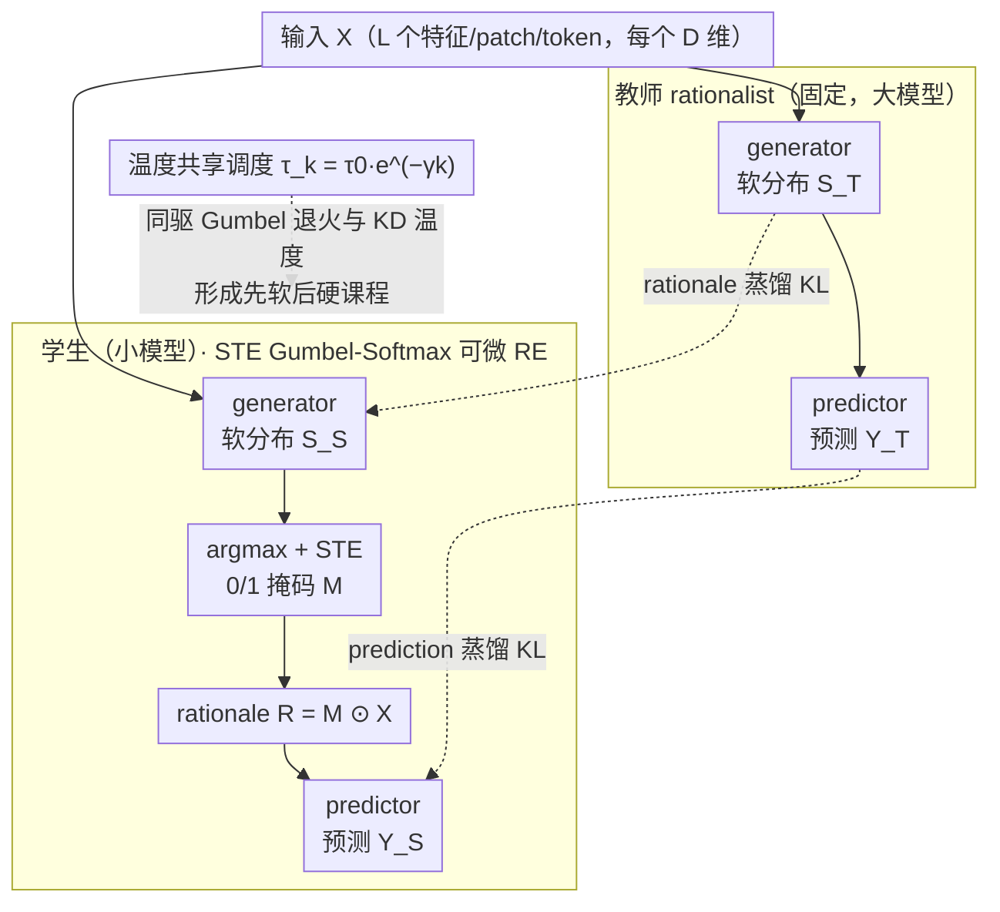

# Learn from A Rationalist: Distilling Intermediate Interpretable Rationales

**会议**: ICML 2026  
**arXiv**: [2601.22531](https://arxiv.org/abs/2601.22531)  
**代码**: https://github.com/JiayiDai/REKD (有)  
**领域**: 可解释性 / 知识蒸馏 / Rationale Extraction  
**关键词**: 理由提取, 知识蒸馏, Gumbel-Softmax, 温度退火, 课程学习

## 一句话总结
本文提出 REKD —— 把知识蒸馏引入"选-预测"式 rationale extraction 框架，让小模型学生同时模仿教师的特征选择分布和最终预测分布，并把蒸馏温度与 Gumbel-Softmax 退火调度绑死，从而隐式形成"先学软分布、后学硬选择"的课程，使 ViT-Tiny 在 CIFAR-10 的 RE 准确率从 0.797 拉到 0.936。

## 研究背景与动机

**领域现状**：可解释 AI 主流两条路线。一条是 LIME/SHAP/Integrated Gradients/Grad-CAM 这类 post-hoc 方法，便宜易插但解释不"忠实"——它们标出的重要特征未必是模型真正用来决策的特征。另一条是 Lei et al. (2016) 提出的 rationale extraction (RE)：generator 先从输入里挑一小撮特征作为 rationale，predictor 只在这撮特征上做预测，结构上保证了"用什么就解释什么"。

**现有痛点**：RE 的训练只有最终任务的 remote supervision，generator 要靠 predictor 反馈去挑特征，predictor 又只能拿 generator 挑出来的特征做预测——典型的"先有鸡还是先有蛋"。当底层网络容量小（如 BERT-Mini、ViT-Tiny）时，这个困境急剧放大：作者的实验里 ViT-Tiny 从纯分类（CLS, 0.968）切到 15% rationale RE 时直接掉到 0.797（−0.171），而 ViT-Base 只掉 0.020。

**核心矛盾**：generator 与 predictor 之间存在双向耦合的搜索难题，小模型既扛不住高方差梯度，也搜不出能让 predictor 拿来做好预测的稀疏特征子集。简单堆数据/堆训练对小模型没用——它根本探不出来。

**本文目标**：在不放弃"忠实可解释"这一硬约束的前提下，让小学生 RE 模型也能拿到接近大教师 RE 模型的预测精度。

**切入角度**：作者把这件事类比成牛顿之后的物理学习——一旦有了可验证的、可解释的中间表示（"质量和距离是关键变量"），普通人不需要重新发明定律也能用得很准。RE 中 generator 输出的特征选择层是一个**与神经架构无关**的通用接口：只要教师和学生面对的特征空间一致，就可以把"哪些特征重要"这条信息从大模型蒸馏到小模型，绕过架构对齐的麻烦。

**核心 idea**：在 RE 框架上加一条蒸馏分支，让学生同时模仿教师的 Gumbel-Softmax 特征选择分布和预测分布；再把这条蒸馏分支的温度和 Gumbel-Softmax 自身的退火温度共享，使得整个训练过程天然形成"先广后精"的课程。

## 方法详解

### 整体框架
REKD 要解决的是小模型在"选-预测"式 rationale extraction 里探不出好特征子集的困境，做法是在原本的 RE 框架上挂一条蒸馏分支，让小学生同时模仿大教师的特征选择和最终预测。输入 $\mathbf{X} \in \mathbb{R}^{L \times D}$（L 个特征/patch/token，每个 D 维）分别走教师、学生两套 generator-predictor pipeline，各自吐出 Gumbel-Softmax 软分布 $\mathbf{S}$、其 STE 离散化的二值掩码 $\mathbf{M}$，以及 rationale $\mathbf{R} = \mathbf{M} \odot \mathbf{X}$ 经 predictor 得到的类别 logits。学生侧把原任务损失 $\mathcal{L}_{\text{RE}}$ 和蒸馏损失 $\mathcal{L}_{\text{KD}}$ 按权重 $\alpha$ 混合，关键的一笔是让蒸馏温度和 Gumbel-Softmax 退火共用同一条指数曲线，使整个训练自然走出"先软后硬"的课程。

### 关键设计

**1. Straight-Through Gumbel-Softmax 可微 RE：把"选不选"变成可反传的离散决策**

RE 的痛点在于"选第 $l$ 个特征还是不选"本质是离散事件，Lei et al. (2016) 原版只能用高方差的 REINFORCE 来估梯度，小模型根本扛不住。本文让 generator 在每个特征位置输出"选/不选"的二维 logits，按 $S_{l,i} = \exp((Z_{l,i} + G_{l,i})/\tau) / \sum_j \exp((Z_{l,j}+G_{l,j})/\tau)$ 采出软分布，再用 $M_l = \arg\max_i S_{l,i}$ 离散化成 0/1 掩码喂给 predictor，反传时按 STE 约定 $\partial \mathbf{M}/\partial \mathbf{S} \approx 1$ 把梯度当软分布梯度回传。稀疏率则用 rectifier 式平方损失 $\mathcal{L}_{\text{select}} = (\sum_l M_l - L \cdot p_{\text{target}})^2$ 拉到目标稀疏度 $p_{\text{target}}$（CIFAR 15%、IMDB 10%）附近。之所以非得这么绕，是因为 RE 的"忠实性"要求 predictor 前向时只能看到真被选中的特征（不离散化就会信息泄漏），而梯度又必须穿过这次离散化才能训得动 generator——STE + Gumbel-Softmax 是同时满足这两条约束下最干净的可微化方案。

**2. Generator 与 Predictor 双路蒸馏：既学"哪些特征重要"，也学"特征怎么用"**

只蒸最终预测等于让学生黑盒模仿教师，丢掉了"哪些特征重要"这条可解释中间监督；只蒸 rationale 又丢掉了"这些特征该怎么被用"的下游信号，所以本文两路并行。Generator 蒸馏对每个特征位置算教师/学生两个 Gumbel-Softmax 分布的 KL，$\mathcal{L}_{\text{KD}}^{\text{R}} = \sum_l D_{\text{KL}}(\mathbf{S}^{(T)}_{\tau,l} \,\|\, \mathbf{S}^{(S)}_{\tau,l})$；predictor 蒸馏走经典 Hinton-KD，对温度缩放 softmax 取 KL，$\mathcal{L}_{\text{KD}}^{\text{Y}} = D_{\text{KL}}(\hat{\mathbf{Y}}^{(T)}_\tau \,\|\, \hat{\mathbf{Y}}^{(S)}_\tau)$。两项合成 $\mathcal{L}_{\text{KD}} = \lambda_R \mathcal{L}_{\text{KD}}^{\text{R}} + \tau^2 \mathcal{L}_{\text{KD}}^{\text{Y}}$，其中 $\tau^2$ 抵消 logit 缩放带来的梯度衰减，而 generator 侧因为 Gumbel-Softmax 自己处理了 $\tau \to 0$ 的尺度就不再额外乘。这一招把人类学习里最有效的"先指出关键变量、再演示怎么用"完整迁移给了学生；又因为选择层是统一的二维分布接口，蒸馏退化成两个等长二项分布的 KL，天然兼容不同隐层维度，省掉了 FitNet 那种维度对齐的投影模块。

**3. 温度共享调度：让"白捡"的退火变成隐式课程**

Gumbel-Softmax 本来就要求 $\tau$ 从大退到小——高 $\tau$ 给低方差梯度便于探索，低 $\tau$ 才能逼近真正的离散采样。本文干脆把 KD 的温度直接绑到这同一条 $\tau_k = \tau_0 e^{-\gamma k}$（从 $\tau_0=5$ 退到 $\tau_K=0.1$）上，于是训练早期 $\tau$ 大、教师分布平坦，学生学的是"大致哪些区域重要、各类别的相对偏好"这类粗粒度知识便于广撒网；后期 $\tau$ 退到 0.1、分布尖锐，学生被迫匹配教师的高置信硬选择和高置信类别预测，强制收敛到精确决策。这和 annealing KD（Jafari et al., 2021）那种为弥补 capacity gap 手工设计的软到硬 schedule 不同：REKD 里退火是用 Gumbel-Softmax 就必须做的结构性约束，由此白捡的课程效应几乎零额外设计成本。

### 损失函数 / 训练策略
最终目标 $\mathcal{L}_{\text{REKD}} = \alpha(\mathcal{L}_{\text{pred}} + \lambda_{\text{select}}\mathcal{L}_{\text{select}}) + (1-\alpha)(\lambda_R \mathcal{L}_{\text{KD}}^{\text{R}} + \tau^2 \mathcal{L}_{\text{KD}}^{\text{Y}})$。训练 35 epoch（纯分类 20 epoch），lr=1e-5，bs=32，$\tau_0 = 5$, $\tau_K = 0.1$，每 100 步更新一次 $\tau$；$\lambda_R = 0.5$；CIFAR 上 $p_{\text{target}} = 15\%$，IMDB 上 10%。每个 seed 跑 10 次取均值。教师固定用一个 seed 训出的 RE 模型，学生在该教师下重复 10 次。

## 实验关键数据

### 主实验

| 数据集 | 学生模型 | CLS | RE | REKD | RE→REKD 提升 |
|--------|----------|-----|-----|------|--------------|
| CIFAR 10 | ViT-Small | .981 | .889 | **.968** | +.079 |
| CIFAR 10 | ViT-Tiny | .968 | .797 | **.936** | +.139 |
| CIFAR 100 | ViT-Small | .944 | .779 | **.845** | +.066 |
| CIFAR 100 | ViT-Tiny | .903 | .645 | **.777** | +.132 |
| IMDB | BERT-Small | .889 | .881 | **.906** | +.025 |
| IMDB | BERT-Mini | .877 | .863 | **.892** | +.029 |

ViT-Base 教师在 CIFAR-10 准确率 0.964；ViT-Small 学生通过 REKD 达到 0.968，**略超过教师平均**。

### 消融实验（附录 C 三组对照）

| 配置 | 含义 | 结论 |
|------|------|------|
| Full REKD | $\alpha \in (0,1)$, R + Y 双路蒸馏 | 完整模型, 全面最优 |
| 纯 KD（去 RE，$\alpha=0$） | 等价于 Jain 等人的两阶段监督蒸馏 | 掉点，但仍比纯 RE 好 → KD 信号本身有用 |
| 仅 Predictor 蒸馏 | 去掉 generator 蒸馏 | 比 Full 差 → rationale 蒸馏不可省 |
| 仅 Generator 蒸馏 | 去掉 predictor 蒸馏 | 同上 → 两路互补 |

### 关键发现
- **小模型"鸡蛋困境"被实验证实**：从 CLS 到 RE 的掉点幅度随模型容量单调放大（ViT-Base 掉 0.020 vs ViT-Tiny 掉 0.171），REKD 恢复幅度也对应最大（Tiny 提升 +0.139 > Small +0.079），完美对应作者的假设。
- **学生反超教师**：在 CIFAR-10/100 上，ViT-Small 学生的 REKD 平均值都略高于 ViT-Base 教师的 RE 平均值。作者归因于 REKD 起到了"教师作为强先验"的正则化作用，降低了学生的方差（10 seed std 从 .019 → .006）。
- **REKD > 学生的 CLS**：BERT-Mini@REKD (0.892) 超过 BERT-Mini@CLS (0.877)，意味着稀疏 rationale + 教师蒸馏所抽出的"信息密集"特征子集，比让学生黑盒看全部输入更利于其分类——这是非常反直觉的"少即是多"现象。

## 亮点与洞察
- **特征选择层作为"架构无关接口"是这篇方法论上最漂亮的一刀**：传统 feature-based KD（FitNet、attention transfer）都得为隐层维度对齐设计投影/塌缩模块，而 RE 把"重要 vs 不重要"压成了与架构完全解耦的 0/1 二维 softmax，蒸馏就退化成两个等长二项分布的 KL，干净到几乎没有调优空间。这个 trick 对所有用 Gumbel-Softmax 学离散结构的任务（如 NRI 的关系图、稀疏 MoE 路由）都可以照搬。
- **"必须做的事"顺手变成"课程"是本文最优雅的副产品**：Gumbel-Softmax 本身就强制要退火，作者只是没花额外成本就让蒸馏走了同一条温度曲线，硬生生白捡了一套软→硬的课程学习。这种"把必须性约束反过来当资源用"的思路是高质量论文的典型味道。
- **对 XAI 评估的批判值得单独看**：作者在 Section 3.4 公开反对"rationale 应与人类标注对齐"这一主流 plausibility 评估范式，举了"医院名字预测癌症"的例子说明对齐性是一把双刃剑，主张转而用"给定稀疏率约束下的预测精度"作为更客观的指标。这个论点单独拎出来都够发一篇 position paper。

## 局限与展望
- 蒸馏目前**只在同架构家族内验证**（ViT→ViT、BERT→BERT），跨架构（如 ViT→ResNet、BERT→Mamba）需要解决底层 tokenization/patching 不一致的问题，作者只在讨论里挂了个 token——这是 REKD"架构无关"宣称真正的最后一公里。
- **"covert communication channel" 风险**：cooperative RE 一直被诟病 generator-predictor 可能学到非语义的隐写式信号传递（Wäldchen et al., 2024）。作者主张 REKD 起到正则化能压制这种通信通道，但论文里没给针对性的实验证据，只是把它写在 Limitations 里，需要后续工作做 stress test。
- **教师质量假设较强**：所有实验都假定教师 RE 模型已经训好且足够强，并未讨论"教师本身也是个小模型"或"教师 rationale 本身就有偏"时的退化曲线；REKD 在 teacher-student capacity gap 接近 0 时的回报曲线仍未知。
- **任务范围较窄**：只在 IMDB（二分类）+ CIFAR（粗类分类）上验证；ERASER benchmark、医学影像、长文档 QA 等更需要 rationale extraction 的现实场景没有覆盖，外推风险待考。

## 相关工作与启发
- **vs Lei et al. (2016) 原版 RE**：原版用 REINFORCE 估计选择层梯度，方差大、训练难；本文走 STE + Gumbel-Softmax 已属现代标配，真正的新意是再叠一层 KD 来缓解小模型困境。
- **vs Jain et al. (2020) 两阶段 RE**：Jain 把 RE 拆成"用启发式（如 BERT attention top-k）拿伪 rationale → 独立训练 generator/predictor"两步监督。这等价于 REKD 在 $\alpha = 0$ 时的特例，但 REKD 通过保留 $\mathcal{L}_{\text{RE}}$ 让学生仍有自主探索能力，并把蒸馏温度与采样温度绑定形成课程，比纯监督版鲁棒。
- **vs Hinton et al. (2015) 经典 KD**：经典 KD 只蒸最终预测分布，REKD 把它扩展到中间结构（特征选择）；同时复用了 $\tau^2$ 缩放、温度退火等经验。
- **vs Jafari et al. (2021) Annealing KD**：annealing KD 把温度退火设计为弥补 capacity gap 的启发式课程；REKD 的退火是 Gumbel-Softmax 内生需求带来的结构后果，课程是顺带产物，思路更"省"。
- **可迁移启示**：所有用 Gumbel-Softmax 学离散隐结构的任务（NRI 关系图、稀疏路由、可学习 prompt 长度）都可以照搬"双路蒸馏 + 温度共享"模板，几乎零设计成本就能拿到课程学习收益。

## 评分
- 新颖性: ⭐⭐⭐⭐ 在 RE × KD 这个具体交叉点上首次做且做得透，"温度共享得到隐式课程"是真正的洞察；不过 KD 和 RE 两端都是成熟组件，组合层面的新意更多是"角度"而非"机制"。
- 实验充分度: ⭐⭐⭐⭐ 跨模态（vision + NLP）、跨架构家族（ViT + BERT）、跨容量（Base/Small/Tiny），10-seed 平均，并配 3 组消融解决"是 KD 起作用还是 RE 起作用"等关键质疑；缺点是没有覆盖 ERASER 等 RE 经典 benchmark。
- 写作质量: ⭐⭐⭐⭐⭐ "牛顿引力法则"的类比贯穿全文且把 RE 的"鸡蛋困境"讲得极清楚，Section 3.4 对 XAI plausibility 评估的批判段落极有营养，公式编排和符号约定都很整洁。
- 价值: ⭐⭐⭐⭐ 给"想在端侧用可解释 RE 模型"的从业者一个低成本可落地的方案；对学界则提供了一个干净的"在 Gumbel-Softmax 离散结构上做 KD"的通用模板，预计会被多个后续工作直接复用。

<!-- RELATED:START -->

## 相关论文

- [\[CVPR 2026\] Pixel2Phys: Distilling Governing Laws from Visual Dynamics](../../CVPR2026/interpretability/pixel2phys_distilling_governing_laws_from_visual_dynamics.md)
- [\[ACL 2026\] A Systematic Comparison between Extractive Self-Explanations and Human Rationales in Text Classification](../../ACL2026/interpretability/a_systematic_comparison_between_extractive_self-explanations_and_human_rationale.md)
- [\[ICML 2026\] Prototype Transformer: Towards Language Model Architectures Interpretable by Design](prototype_transformer_towards_language_model_architectures_interpretable_by_desi.md)
- [\[ICML 2026\] Interpretable Self-Supervised Learning via Representer Landmarks and Nyström Approximation](interpretable_self-supervised_learning_via_representer_landmarks_and_nyström_app.md)
- [\[NeurIPS 2025\] How Do Transformers Learn Implicit Reasoning?](../../NeurIPS2025/interpretability/how_do_transformers_learn_implicit_reasoning.md)

<!-- RELATED:END -->
