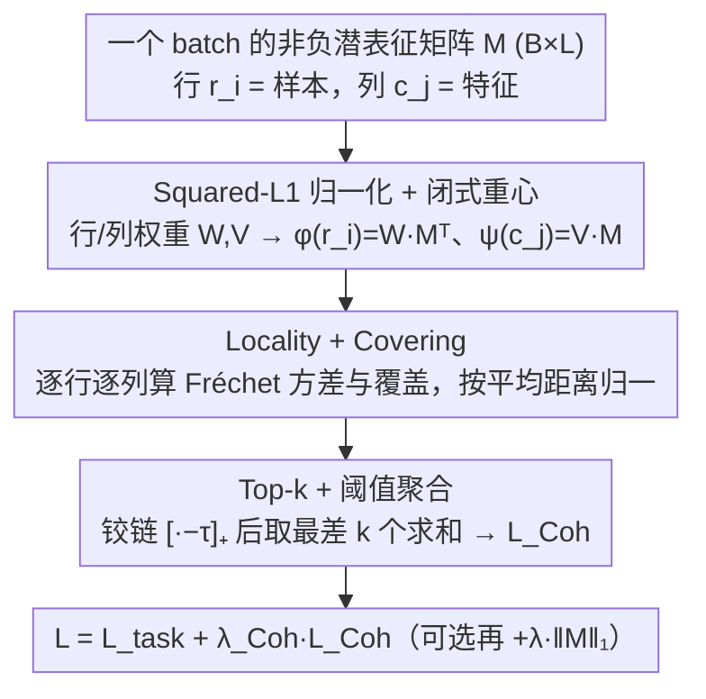

# Learning Coherent Representations: A Topological Approach to Interpretability

**会议**: ICML 2026  
**arXiv**: [2606.02841](https://arxiv.org/abs/2606.02841)  
**代码**: 待确认  
**领域**: 可解释性 / 拓扑数据分析 / 表征学习  
**关键词**: coherence、Vietoris-Rips、Fréchet 方差、barycentric map、稀疏自编码器替代

## 一句话总结
本文提出 **coherence**（相干性）这一受脑神经编码启发的几何性质，要求样本-特征矩阵的行列在 Vietoris-Rips 滤过下拓扑互相 interleave，并给出可微的 `Coh` 损失，在自编码器与 BERT token embedding 上得到拓扑对齐、语义可读的 features，效果远超 L1 稀疏。

## 研究背景与动机

**领域现状**：可解释性的主流路线是稀疏化——sparse coding、sparse auto-encoder（Bricken 2023、Cunningham 2024）等用 $L^1$ 等稀疏正则让每个 feature 只在少量样本上激活，从而缓解 polysemanticity。另一支是 mechanistic 路线，把 latent 维度当成"概念"逐个看。

**现有痛点**：稀疏只约束了"多少个样本激活"（how many），不约束"是哪些样本激活"（which）。一个稀疏 feature 完全可能在数据流形上几个互不相关的、空间上散落的区域同时点亮，从而看起来"激活很少"却根本没有可解释的几何意义。无监督场景下问题更严重：没有分类标签把同类样本拉到一起，feature 空间几乎没有可读的几何结构。

**核心矛盾**：可解释性的本质不是"激活稀疏"而是"激活区域连通"。大脑 grid cell / head direction cell 之所以能让我们直接 read off 动物的位置或朝向，是因为每个神经元的激活区是状态空间的一段**连续弧/连通块**，这是 locality 而非 rarity。现有 deep learning 正则没有任何机制保证这种连通性。

**本文目标**：(1) 给"可解释 feature"一个几何定义；(2) 把这个定义变成可加进任意非负激活网络的可微 loss；(3) 在 autoencoder（已知拓扑）和 BERT token embedding（无 ground-truth 拓扑）两种 setting 都验证。

**切入角度**：把 latent 矩阵 $M\in\mathbb{R}_+^{m\times n}$ 同时看成"样本 $\to$ 特征"和"特征 $\to$ 样本"的两套加权点云，借助 **Dowker duality** 的几何类比——如果两个空间互相被对方"重心映射"近似覆盖且各自方差小，那么它们的 Vietoris-Rips 滤过必然 interleave，从而在拓扑上互为镜像。

**核心 idea**：用 Fréchet 方差 + 重心映射的"往返误差"作为可微 loss，把样本空间与特征空间约束成拓扑等价的两个点云——feature 的可解释性就变成了"feature 空间继承样本空间的几何"。

## 方法详解

### 整体框架

方法要解决的是"怎么把可解释性写成一个可微的几何目标"。做法是把任意带非负激活的网络（autoencoder bottleneck 或接 Softplus 的 BERT token embedding）在一个 batch 上的 latent 取出来，得到非负矩阵 $M\in\mathbb{R}_+^{B\times L}$，行 $r_i$ 看成样本、列 $c_j$ 看成特征，再用"行视角点云"和"列视角点云"互相做重心映射，量化两套点云是否拓扑互为镜像，把这个偏差当成正则项 `Coh` 加到原任务 loss 上。

落地时先用 squared-$L^1$ 把每行/每列归一化成概率权重 $w^{(i)}, v^{(j)}$，据此算出闭式重心映射 $\phi(r_i)=w^{(i)}M^T$（样本投到列空间）和 $\psi(c_j)=v^{(j)}M$（特征投到行空间）；对每行每列各算 Fréchet variance（locality）与 covering 两个量，超阈值部分取 top-$k$ 求和成 $\mathcal{L}_{\text{Coh}}$，最后与任务 loss 加权 $\mathcal{L}=\mathcal{L}_{\text{task}}+\lambda_{\text{Coh}}\mathcal{L}_{\text{Coh}}$（典型 $\lambda_{\text{Coh}}=10^{-3}$）。理论上当 $M$ 为 $\epsilon$-coherent 且 $\phi,\psi$ 是 1-Lipschitz 时存在 $\epsilon^{1/2}$-interleaving，于是样本与特征的 Vietoris-Rips 滤过、persistence diagram 在 bottleneck 距离下相近。

下图是 Algorithm 1 中 `Coh` 损失的计算流，三个加工节点恰好对应下面三个关键设计（注：图自上而下是计算顺序，先归一化、再度量、最后聚合）：

### 关键设计

**1. Coherence = Locality + Covering：把"拓扑对齐"压成两个标量**

可解释性的痛点是没法直接量化"feature 空间是否继承了样本空间的几何"，本文用一对对偶的标量来刻画它。对每一行定义 Fréchet 方差 $\text{Var}_\mathcal{R}(r_i)=\sum_j w^{(i)}_j\|\phi(r_i)-c_j\|_2^2$（locality），衡量样本 $r_i$ 选中的那些列在列空间里是否挤成一团；再定义 covering $\text{Cov}_\mathcal{R}(r_i)=\sum_j w^{(i)}_j\|r_i-\psi(c_j)\|_2^2$，衡量是否存在某列的 barycenter $\psi(c_j)$ 离 $r_i$ 足够近；对列对称地定义，$\epsilon$-coherent 要求所有行列的两个量都 $\le\epsilon$。两者缺一不可——只压 locality 会得到 feature 内部紧凑却根本不覆盖样本流形的退化解，只压 covering 又会得到"每个样本都被某 feature 描述、但 feature 自己散落"的情况；合起来才换得 $\epsilon^{1/2}$-interleaving（Theorem 3.12）这一稀疏正则完全给不出的几何保证。

**2. Squared-L1 归一化 + 闭式重心：让"软到硬投影"可微又有界**

interleaving 的定义需要把样本映射到真实存在的列，而训练又必须用可微的软映射，这两者本来矛盾。本文选 Euclidean 范数搭配 squared-$L^1$ 归一化 $W_{ij}=M_{ij}^2/\sum_k M_{ik}^2$，使得加权重心 $\arg\min_\mu\sum_j w^{(i)}_j\|\mu-c_j\|_2^2$ 退化成闭式 $\phi(r_i)=w^{(i)}M^T$，无需任何迭代优化即可反传。更关键的是，软 barycenter 与"snapping map"（投到最近真实列）之间的偏差被 locality 直接 bound 住（Prop 3.9：$\|\phi(r_i)-\Phi(r_i)\|_2\le\epsilon^{1/2}$），于是训软 loss 就能享受硬投影的拓扑保证，只差 $\epsilon^{1/2}$。

**3. Top-k + threshold 聚合 + 配对尺度归一化：把 per-element 几何 loss 训稳**

非方形 $B\times L$ 矩阵里行点云和列点云的尺度可以差几个数量级，直接求和会让 loss 被某一边主导。本文先用全体行/列对的平均距离 $\bar d_R, \bar d_C$ 把方差与 covering 各自归一成无量纲，再套铰链 $[\cdot-\tau]_+$ 不惩罚已经达标 $\tau$ 的行列，最后只对 top-$k_R, k_C$ 个最差的求和得到 $\mathcal{L}_{\text{Coh}}=\text{TopK}(\text{Var-related})+\text{TopK}(\text{Cov-related})$。这一步是经验上稳定训练的关键：它把优化资源持续压在当前最不 coherent 的少数行/列上，避免大多数行已经很好时梯度被平均稀释。

### 损失函数 / 训练策略
任务 loss + $\lambda_{\text{Coh}}\mathcal{L}_{\text{Coh}}$，可选叠加 $\lambda_{L^1}\|M\|_1$ 以在多解中偏向稀疏 coherent 解。MNIST autoencoder 用 $\lambda_{\text{Coh}}=\lambda_{L^1}=10^{-3}$；toy 双圆用更小的 $\lambda_{\text{Coh}}=10^{-5}$。BERT 设置把 token embedding 用 Softplus($\beta=20$) 投到非负，再加 `Coh`，主任务仍是 15% masking 的 MLM；1-Lipschitz 假设是事后采样检查而非强制约束（实测 $\psi$ 违例率 <0.2%，$\phi$ 约 3-4%，平均扩张系数 $\approx 1.05$）。

## 实验关键数据

### 主实验

**Toy 双圆数据**（$\mathbb{R}^{512}$ 中两个不相交圆，20k 样本）—— 单 seed 结果：

| 模型 | MSE | %Tuned (MRL>0.5) | %Pure (compscore>0.5) | Locality / Cov |
|------|-----|------------------|-----------------------|----------------|
| Vanilla | 9.96e-5 | 43.0% | 0.0% | 0.53 / 0.44 |
| L1 | 9.95e-5 | 52.0% | 0.0% | 4.62 / 4.58 |
| **Coh** | **9.94e-5** | **100.0%** | **90.2%** | **0.14 / 0.14** |

**BERT token embedding**（256 维、2 个 transformer block、WikiText-2、5 seeds 平均）：

| 指标 | Coh | Softplus baseline |
|------|-----|-------------------|
| Mean Overlap with Vanilla geometry | 0.45±0.01 | 0.22±0.00 |
| Overlap > 0.5 的 feature 数 / 256 | 77.4±3.3 | 1.0±0.6 |
| Claude scoring 判定可解释 / 256 | **87.6±10.4** | **0.0±0.0** |

### 消融实验

| 配置 | %Tuned | Locality | 说明 |
|------|--------|----------|------|
| Coh full | 100% | 0.14 | locality+covering 双约束 |
| 仅 L1 稀疏 | 52-63% | 3.67-4.62 | 稀疏不带来几何聚集 |
| Vanilla (无正则) | 43% | 0.53 | 拓扑随机 |
| Coh + L1（double digits）| 类内稳定 | 0.15 | L1 把 Coh 推向最稀疏的 coherent 解 |
| 仅 Softplus（BERT）| 1/256 ≈ 0% | — | 非负本身完全不够 |

### 关键发现

- **Loc 与 Cov 跨 seed 极稳**（std 几乎为 0），说明 `Coh` loss 可靠达成几何目标；MRL/Purity 的高方差不是失败，而是 coherence 允许"两类分开"和"两类合并成一个大圆"两种都合规的解。
- **稀疏 vs 相干**：L1 在 toy 双圆 locality 飙到 4.62（比 vanilla 还差），证明稀疏化甚至会破坏几何聚集；Coh 把 locality 压到 0.14，差一个数量级。
- **BERT 上 Softplus-only 几乎零可解释 feature，Coh 拿到 87.6/256**——非负只是必要条件，coherence 才是 sufficient ingredient；Claude 标的 87 个 feature 横跨"年份/亲属/地名/计量单位/语气副词/方向介词"等人类可读类别，显示该 loss 不靠特定数据先验。
- **1-Lipschitz 假设是软的**：实测 $\phi,\psi$ 平均扩张 $\approx 1.05$、违例率个位数百分比，但实验结果与 Theorem 3.12 的几何保证依然吻合，说明对该理想假设的偏离对实用结论不致命。

## 亮点与洞察
- 把"feature 可解释"从语言学/语义学问题**重铸为几何/拓扑问题**：interpretability ≡ samples 和 features 两个点云互相 interleave；这给出了一个不需要人评、不需要标签的可微 proxy。
- **Dowker duality 的几何化**特别巧——原始 Dowker 是组合定理（行/列空间同伦），这里改成度量空间的 $\epsilon^{1/2}$-interleaving，并且通过 Fréchet 方差 + covering 两个量直接对应 interleaving 的两边条件，理论 $\to$ loss 的映射非常干净。
- **Squared-$L^1$ 让重心闭式**这一招值得收藏：任何需要"软到硬投影"的可微 attention/聚合都可以借鉴，避免 EM 风格内循环。
- **Top-$k$ + threshold 聚合**是把"per-element 几何 loss"做稳的小工程 trick——对于 instance-wise 正则（不光是这里）几乎都适用，远好于简单求和或求平均。

## 局限与展望
- 1-Lipschitz 假设事后检查而非强制，理论 bound 有 ~5% 概率不严格成立；将 spectral norm penalty 加进 $\phi,\psi$ 是直接的补强方向。
- 仅在 autoencoder bottleneck 与 token embedding 一层做了实验；多层、ResNet/Transformer 中间层、监督分类下的效果都未验证（作者把监督场景列为 future work，因为 cross-entropy 已经把类内结构压扁，coherence 几乎无事可做）。
- 平方欧氏距离在高维 latent 上可能 degenerate（distance concentration），文章自己也提到这是 Euclidean 选择的代价；scaling 到 $L\ge 1024$ 时是否仍 well-behaved 没有 ablation。
- 多解性是个隐患——同一任务可以有多个 coherent 解（分开 vs 合并），需要靠 $L^1$ 等辅助 loss 选择，没有原生的 disentanglement 机制。
- 计算开销：构造 pairwise distance + 重心矩阵每 batch $O(B^2+L^2+BL\cdot\max(B,L))$，对 large LM 直接套用需要降采样或分块策略。

## 相关工作与启发
- **vs Sparse AE / Dictionary Learning（Bricken 2023、Cunningham 2024）**：他们让 feature 激活稀疏（how many），本文让 feature 激活几何连通（which）；toy 实验中 L1 locality=4.62 vs Coh=0.14 直接证伪了"稀疏 ⇒ 可解释"的隐含假设，两者其实正交，可叠加使用。
- **vs Topological Autoencoder（Moor 2020）/ Connectivity-preserving（Hofer 2019）**：他们保持输入拓扑到 latent 的一致，需要选 homology degree 和 differentiable persistence；本文不保持输入拓扑，而是让 latent 的"行视角"和"列视角"互相镜像，工作在 simplicial filtration 层级、不挑同调次数。
- **vs Similarity-preserving Networks（Sengupta 2018）**：他们靠非负相似性保留得到 localized receptive field，但只是单向（输入 $\to$ feature）；本文要求双向（feature 也要反向被样本覆盖），所以才能得到"feature 空间也有意义的几何"这一更强结论。
- **vs 神经科学的 grid/head-direction cell（Hafting 2005、Gardner 2022）**：是本文最直接的灵感来源——把"神经元激活区是状态空间的连通块"形式化为 locality，把"任意状态都有神经元响应"形式化为 covering；可启发后续把更复杂的生物编码（place cell 的多 field、boundary cell 等）抽成新的几何正则。

## 评分
- 新颖性: ⭐⭐⭐⭐⭐ 第一个把 feature-space interpretability 重定义为 sample-feature 拓扑 interleaving 问题，并给出严格可微 loss
- 实验充分度: ⭐⭐⭐⭐ Toy + rotated MNIST + BERT 三 setting，Claude 评分 + 拓扑 metric 双管，但只到小模型规模、没有 GPT-2/Pythia 量级验证
- 写作质量: ⭐⭐⭐⭐⭐ 理论-算法-实验串得紧、figure 设计直击 "feature 空间也有几何" 的核心论点
- 价值: ⭐⭐⭐⭐ 给 mechanistic interpretability 提供了一个全新的正则范式，且与 sparsity 完全互补，可直接套用到现有 SAE 流水线

<!-- RELATED:START -->

## 相关论文

- [\[ICML 2026\] MUSE: Resolving Manifold Misalignment in Visual Tokenization via Topological Orthogonality](muse_resolving_manifold_misalignment_in_visual_tokenization_via_topological_orth.md)
- [\[ICML 2026\] IdEst: Assessing Self-Supervised Learning Representations via Intrinsic Dimension](idest_assessing_self-supervised_learning_representations_via_intrinsic_dimension.md)
- [\[CVPR 2026\] Learning complete and explainable visual representations from itemized text supervision](../../CVPR2026/interpretability/learning_complete_and_explainable_visual_representations_from_itemized_text_supe.md)
- [\[NeurIPS 2025\] Representation Consistency for Accurate and Coherent LLM Answer Aggregation](../../NeurIPS2025/interpretability/representation_consistency_for_accurate_and_coherent_llm_answer_aggregation.md)
- [\[ACL 2026\] A Structured Clustering Approach for Inducing Media Narratives](../../ACL2026/interpretability/a_structured_clustering_approach_for_inducing_media_narratives.md)

<!-- RELATED:END -->
