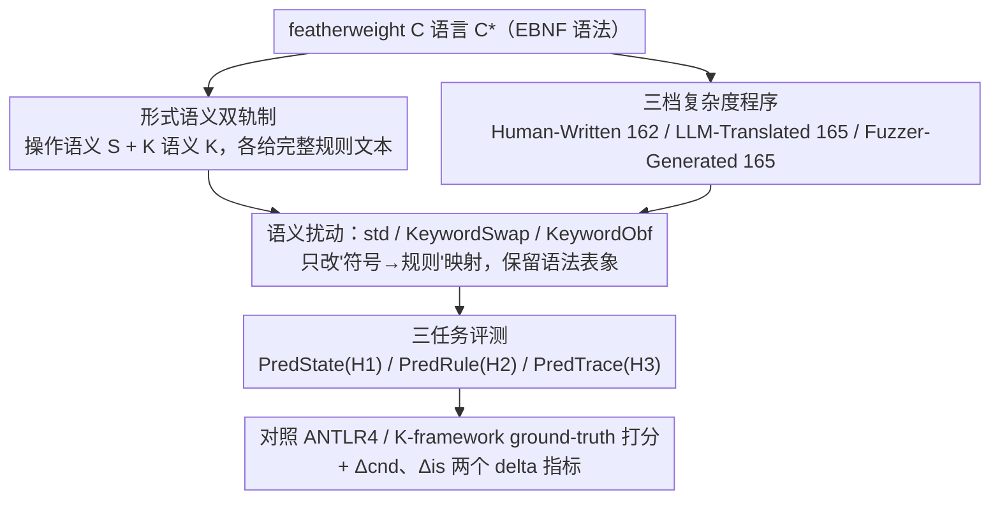

# LLMs Lean on Priors, Not Programming Language Semantics

**会议**: ICML 2026  
**arXiv**: [2510.03415](https://arxiv.org/abs/2510.03415)  
**代码**: https://EngineeringSoftware.github.io/PLSemanticsBench (有)  
**领域**: 可解释性 / LLM 代码推理 / 形式语义评测  
**关键词**: 形式语义, 程序执行, 规则条件化, 语义扰动, 代码理解

## 一句话总结
作者构建 PLSemanticsBench——把一个 featherweight C 语言 $\text{C}^{\star}$ 配上 small-step 操作语义 $\mathbb{S}$ 与 K 语义 $\mathbb{K}$ 两套形式系统，并通过 KeywordSwap（互换 `+`/`-` 等运算符语义）与 KeywordObf（替换为 Caucasian-Albanian 罕用符号）系统性扰动语义，测了 11 个前沿 LLM 后发现：标准语义下最高 90% 的最终状态预测准确率，在语义扰动下骤降 40–60 个百分点，长程规则保持准确率最高只有 35%，说明当代 LLM 主要靠预训练词法先验、而不是真的在按显式形式规则做推理。

## 研究背景与动机
**领域现状**：评测 LLM 代码能力主流走两条路——一是输出预测 / 程序修复 / 代码生成这类端到端基准（HumanEval、MBPP、CodeContests），二是看 chain-of-thought 上的"逐步执行"模仿。两类基准默认模型遇到的语言是它在预训练里见过的，符号含义和大众约定一致。

**现有痛点**：这种设定无法区分两种截然不同的能力——(a) 模型真的在按提供的规则做形式推理；(b) 模型只是把熟悉的符号（`+`、`while`、`if`）映射到预训练里学到的统计联想，然后猜一个看起来合理的答案。在 (b) 占主导时，分数再高也不代表模型理解形式语义。

**核心矛盾**：要剥离"语义条件化"和"语法熟悉度"，必须在保留语法表象的前提下系统性改写语义——这恰好是形式语义学（结构化操作语义、K 语义）的天然能力，因为规则是符号化的、原子粒度均匀的，可以直接换掉 `+` 对应的 `E-Add` 规则而不动语法树。但已有 LLM 代码评测从未把这个工具引进来。

**本文目标**：(1) 设计能机械性扰动语义的基准；(2) 把"按规则推理"拆成可单独测的四个能力——全局组合 (H1)、无状态变更下挑规则 (H2)、长程保持 (H3)、新语义下服从供给规则 (H4)；(3) 系统量化前沿 LLM 在这四个能力上的表现。

**切入角度**：选 C 而非 Python，避免缩进敏感语法把"恢复块结构"和"语义推理"耦合在一起；featherweight 化语法剔除指针、结构体等噪声；把同一份程序套到 $\mathbb{S}$（细粒度，每个原子计算一条规则）和 $\mathbb{K}$（粗粒度，重写式语义）两个体系下，控制规则粒度变量。

**核心 idea**：用"语义可机械替换"作为探针——同一段语法树在 std/swap/obf 下应给出三套不同执行结果，模型若真在按提供的规则推理就该跟着切换答案，反之就是在吃预训练先验。

## 方法详解

### 整体框架
PLSemanticsBench 要解决的是"如何把 LLM 的规则推理能力和预训练词法先验拆开测"，办法是把一个 featherweight C 语言 $\text{C}^{\star}$ 配上完整的形式语义规则，再机械性地改写这些规则、看模型是否跟着改答案。整条 pipeline 分四步：先用 EBNF 定义 $\text{C}^{\star}$ 语法，并用 small-step 操作语义 $\mathbb{S}$ 与 K 语义 $\mathbb{K}$ 两套体系各给一份完整规则文本；再造三档结构复杂度的程序——从 LeetCode / HumanEval / MBPP / CodeContests 改写 162 段 Human-Written、用 Qwen2.5-Inst 32B 翻译 165 段 LLM-Translated、用语义感知的 grammar-based fuzzer 生成 165 段 Fuzzer-Generated（cyclomatic 复杂度从 3 涨到 100，trace 长度从 20 涨到 190）；然后把标准语义机械替换为两种扰动；最后把"程序 + 规则文本"喂给模型跑三类任务，对照 ANTLR4 / K-framework 跑出的 ground-truth 打分。下图把这条四步 pipeline 画出来，其中"形式语义双轨制""语义扰动""三任务评测"三个节点对应下面三个关键设计：

### 关键设计

**1. 形式语义双轨制：用 $\mathbb{S}$ 和 $\mathbb{K}$ 两种规则粒度做对照**

为了把"模型分不清细粒度规则"和"模型真的不会执行"区分开，作者让同一套程序在两种规则粒度下各跑一遍。$\mathbb{S}$ 走 Gentzen 风格的推理规则，把每个原子计算写成一条 transition——例如 `E-Add` 只负责 $\langle v_1+v_2,\sigma\rangle \to_E v_3$，左操作数的归约由 `E-AddLeftStep` 单独管；$\mathbb{K}$ 则用 rewriting 风格把多个 step 合并成一条粗规则。无论哪套体系，一段程序的执行都被形式化为 $\llbracket s\rrbracket_\Psi(\sigma_0) = (\sigma_n, \bigoplus_{i,j}[(\sigma_i, r_{i,j})])$，状态序列 $\sigma_i$ 与规则名序列 $r_{i,j}$ 被同时记录，构成可机检的 ground-truth。这么设计的好处在 notation 预热实验里就显出来了：模型在 $\mathbb{S}$ 上混淆"step vs compute"这类近义规则更严重（confusion 集中在 Arithmetic Expression rules 7–23、Relational 28–51），而 $\mathbb{K}$ 因规则更少混淆更少——于是下游失败能归因到"粒度判别"还是"全局推理"，而不会被"看不懂记号"这个无关变量污染。

**2. KeywordSwap / KeywordObf：双轴语义扰动制造先验冲突**

这是把"语义条件化"从"语法熟悉度"里剥离出来的核心探针。KeywordSwap 保留语法表象但把同族运算符两两互换（`+`↔`-`，`*`↔`/`，`<`↔`>`，`&&`↔`||`），于是源码里写的 `x+y` 在 swap 语义下应按减法规则执行，直接与预训练先验撞车；KeywordObf 则把 `=`、`+`、`-`、`if-else`、`while` 等全部替换成 Caucasian-Albanian 字母表里的稀有符号，使 `x ⷠ y` 等价于标准下的 `x + y`，彻底抹掉语法先验、只剩下提供的规则可依。两种扰动都只动"符号到规则的映射"、保留 inference rule 的结构。之所以要两轴交叉，是因为单独 swap 测的是"先验能否被新规则覆盖"，单独 obf 测的是"完全没有先验时能否按规则执行"：若 swap 掉点远大于 obf，说明模型被熟悉符号"绑架"；若连 obf 也大幅掉点，则规则跟踪本身就有问题。

**3. PredState / PredRule / PredTrace：三任务分别锚定 H1–H3 能力**

作者把笼统的"按规则推理"拆成三个能单独打分的子能力。PredState 直接要最终变量表 $\llbracket\mathcal{P}\rrbracket_\Psi^\sigma(\sigma_0)$，考察全局组合（H1）；PredRule 给出一个执行中状态未变化的 expression-step 窗口，让模型从 5 个候选规则里挑对应那条，distractor 按 family→construct→semantic role 分层采样以堵住靠词法启发猜答案的捷径（H2）；PredTrace 要求逐步输出整条 $(\sigma_i, r_{i,j})$ 序列，考察长程一致性（H3）。这种拆法是有讲究的：单测 final state 会把"真用规则"和"凭直觉猜"混在一起，而 PredRule 在状态不变的窗口里测，剔除了"用最终值反推规则"的捷径，PredTrace 则强制把 trace 写满才给满分，长程上先验和真规则的偏差会累积放大。为了让对比可量化，作者还定义了两个 delta 指标：$\Delta_{\text{cnd}} = \mathrm{Acc}_{\text{std}}^{\square} - \mathrm{Acc}_{\text{na}}$ 衡量提供 vs 不提供形式规则的增益，$\Delta_{\text{is}} = \mathrm{Acc}_{\square'}^{\square} - \mathrm{Acc}_{\text{std}}^{\square}$ 衡量扰动 vs 标准的掉点。

### 训练策略
本文不训练模型，统一走 zero-shot / one-shot prompting；non-reasoning 模型（除 GPT-4o-mini）温度设为 0，reasoning 模型与 GPT-4o-mini 跑 3 次取平均。CoT 是显式提示的 prompt 变体，作为单独配置出现而非新方法。

## 实验关键数据

### 主实验：PredState 在 Human-Written 数据集上 ($\mathbb{S}$ 形式化)

| 模型 | $\text{Acc}_{\text{na}}$ | $\text{Acc}_{\text{std}}$ ($\Delta_{\text{cnd}}$) | $\text{Acc}_{\text{swap}}$ ($\Delta_{\text{is}}$) | $\text{Acc}_{\text{obf}}$ ($\Delta_{\text{is}}$) |
|------|------|------|------|------|
| Qwen2.5-Inst 14B | 33 | 28 (-5) | 6 (-22) | 8 (-20) |
| Llama-3.3 70B | 32 | 25 (-7) | 5 (-20) | 12 (-13) |
| GPT-4o-mini-CoT | 68 | 65 (-3) | 3 (-62) | 27 (-38) |
| DS-Qwen 32B | 84 | 95 (+11) | 3 (-92) | 77 (-18) |
| DS-Llama 70B | 80 | 89 (+9) | 2 (-87) | 59 (-30) |
| QwQ 32B | 93 | 98 (+5) | 7 (-91) | 86 (-12) |
| o3-mini | 94 | 100 (+6) | 63 (-37) | 95 (-5) |
| GPT-5-mini | 100 | 100 (0) | 79 (-21) | 99 (-1) |
| Gemini-2.5-pro | 93 | 99 (+6) | 98 (-1) | 100 (+1) |

### 复杂度 / 长程消融（PredState 在 Fuzzer-Generated 上 $\mathbb{S}$ 形式化关键样本）

| 模型 | Human-Written std | Fuzzer std | Human swap | Fuzzer swap |
|------|------|------|------|------|
| QwQ 32B | 98 | ~82 | 7 | 4 |
| GPT-5-mini | 100 | 95 | 79 | 65 |
| Gemini-2.5-pro | 99 | (近持平) | 98 | (近持平) |
| 多数 reasoning 模型 | 80–100 | 掉 >40 点 | 已塌 | 已塌 |

### 关键发现
- **CoT 救得了长程、救不了先验**：non-reasoning 模型加上 CoT 后 std 下提升近 50 点，但 swap 下增益消失、obf 下只剩 ~40 点；这说明 CoT 帮的是"展开多步执行"，没法让模型真的去读新规则。
- **swap >> obf 的不对称性**：所有模型几乎都是 swap 掉点远大于 obf（如 DS-Qwen 32B 在 $\mathbb{S}$ swap 掉 92 点而 obf 只掉 18 点），证实"熟悉符号反而是陷阱"——一旦给陌生符号，模型反倒老老实实查规则。
- **Gemini-2.5-pro 是唯一例外**：在 swap 下仍保持 ≥98%，是 11 个模型里唯一展示出"能用规则覆盖先验"的；其它前沿模型（含 GPT-5-mini、o3-mini）都不同程度被先验绑架。
- **长程一致性几乎为零**：PredTrace 任务上只有少数模型拿到非零分，最好的也只有 35%，意味着即便单步规则选对，长 trace 上累积偏差很快崩盘。
- **结构性瓶颈分两类**：多元回归显示，Human-Written 上控制流深度是主要 stressor，LLM-Translated / Fuzzer-Generated 上数据流和程序规模（Halstead Volume、trace 长度）才主导失败——长 trace 上的全局状态追踪是当前模型最薄弱的环节。

## 亮点与洞察
- **用形式语义当探针的设计非常巧**：传统 perturbation（改变量名、加注释）只能动表象，KeywordSwap 通过保留语法、互换语义直接撞向预训练先验，这是只有形式化语义才能做到的"controlled stress test"；该方法论可迁移到任何需要测"规则遵循 vs 模式匹配"的领域，如数学公理系统、自定义 DSL、新合规规则。
- **$\Delta_{\text{cnd}}$ 与 $\Delta_{\text{is}}$ 两个 delta 指标的拆分让结论更扎实**：单看绝对准确率会被模型基线水平掩盖，两个 delta 同时为正/负才能定性"模型是否真的在条件化"，这套度量框架值得借鉴到其它 "rule-following" 类基准。
- **swap >> obf 的不对称发现颠覆直觉**：通常以为"陌生符号更难"，但本文证明"熟悉符号 + 反常含义"才是最致命的；这暗示在 LLM 评测里，加噪并不总等于加难度，反常语义比陌生符号更能暴露能力上限。
- **K vs S 形式化的对照**给了 prompt 工程一个具体启示：粗粒度规则 ($\mathbb{K}$) 在 notation 理解上更稳，但在 PredRule 这类细粒度任务上反而提供的信息密度更低；做工具教学时，规则粒度需要和任务粒度匹配。

## 局限与展望
- **作者承认**：限定在 featherweight C，没有指针、结构体、并发；只在 $\mathbb{S}$ 和 $\mathbb{K}$ 两套形式化下测，未覆盖 denotational / axiomatic 等其他语义体系；CoT prompt 模板未做大规模搜索。
- **结论可能 underestimate 反向**：所有模型都用 zero/one-shot，没做规则上的 few-shot 或 fine-tuning；若允许模型在 KeywordSwap 上做哪怕几条示例 ICL，结果可能完全不同，这意味着"LLM 不懂规则"应该读作"LLM 不在 prompt-only 设置下自动按规则推理"。
- **改进思路**：(1) 把规则 fine-tune 进模型权重，看是否能稳定覆盖 swap；(2) 加入"规则一致性奖励"的 RL 训练，专攻长程 PredTrace；(3) 把基准扩展到自定义 DSL（如 SQL 方言、Solidity 升级前后），测真实合规场景下模型能否切换规则。
- **基准本身的潜在偏差**：Fuzzer-Generated 程序虽然控制了结构复杂度，但可能落在自然代码分布之外，导致模型在 Fuzzer 上的 swap 失败更多反映 OOD 鲁棒性而非规则跟踪能力本身。

## 相关工作与启发
- **vs CRUXEval / LiveCodeBench 等输出预测基准**：他们测"标准 Python/C++ 上能否预测输出"，本文测"修改语义后能否跟新规则"，把"代码理解"分解成正交的两个维度——前者的高分会被本文证明很大程度上是先验复用，二者结合才能完整刻画 LLM 代码能力。
- **vs Counterfactual reasoning benchmarks (Wu et al. 2023 等)**：counterfactual 主要在自然语言反事实上做，扰动语义粗、不可机械化；本文用形式语义把扰动做成了精确符号替换，ground-truth 可由 K-framework 完全自动验证，更适合作为长期跟踪指标。
- **vs Operator overloading 类研究**：本文把 operator overloading 从语言特性升格为评测工具，并配以系统性多复杂度数据集，方法论上比单点案例更可推广。

## 评分
- 新颖性: ⭐⭐⭐⭐⭐ 把形式语义作为 LLM 推理探针的设计独特，KeywordSwap/Obf 的对照非常巧。
- 实验充分度: ⭐⭐⭐⭐⭐ 11 个模型 × 2 形式化 × 3 扰动 × 3 数据集 × 3 任务，配多元回归归因，覆盖罕见地全面。
- 写作质量: ⭐⭐⭐⭐ 形式化记号密集但 notation primer 与 hypothesis 编号清晰，附录补充充分。
- 价值: ⭐⭐⭐⭐⭐ 给"LLM 真的会推理吗"提供了可机械验证的回答模板，PLSemanticsBench 有望成为长期跟踪 rule-following 能力的标尺。

<!-- RELATED:START -->

## 相关论文

- [\[ICML 2026\] Adaptive Querying with AI Persona Priors](adaptive_querying_with_ai_persona_priors.md)
- [\[ICML 2026\] Expand Neurons, Not Parameters](expand_neurons_not_parameters.md)
- [\[ACL 2026\] Interpretable Coreference Resolution Evaluation Using Explicit Semantics](../../ACL2026/interpretability/interpretable_coreference_resolution_evaluation_using_explicit_semantics.md)
- [\[ACL 2026\] Linear Probes Detect Task Format, Not Reasoning Mode in Language Model Hidden States](../../ACL2026/interpretability/linear_probes_detect_task_format_not_reasoning_mode_in_language_model_hidden_sta.md)
- [\[ICML 2026\] Position: Zeroth-Order Optimization in Deep Learning Is Underexplored, Not Underpowered](position_zeroth-order_optimization_in_deep_learning_is_underexplored_not_underpo.md)

<!-- RELATED:END -->
