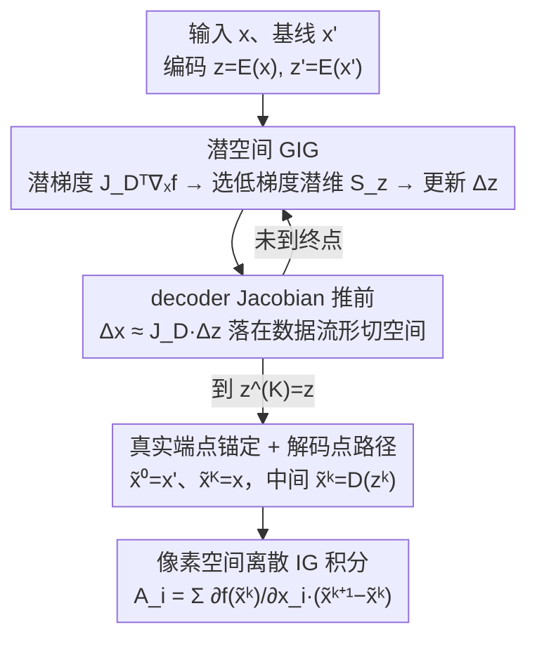

# Manifold-Aligned Guided Integrated Gradients for Reliable Feature Attribution

**会议**: ICML 2026  
**arXiv**: [2605.02167](https://arxiv.org/abs/2605.02167)  
**代码**: https://github.com/leekwoon/ma-gig (有)  
**领域**: 可解释性 / 特征归因 / Integrated Gradients  
**关键词**: integrated gradients, guided IG, 数据流形, VAE, 路径方法

## 一句话总结
本文提出 MA-GIG：把 Guided IG 的“按低梯度幅值选特征再走一步”策略从像素空间搬到预训练 VAE 的潜在空间，借助 decoder Jacobian 把潜空间内的轴对齐更新映射成数据流形切空间上的更新，从而既避开高梯度噪声区域，又让积分路径上的样本始终贴近真实数据流形，归因更可靠。

## 研究背景与动机

**领域现状**：Integrated Gradients (IG) 凭借完备性、敏感性等公理化保证成为路径归因的标准做法，沿基线到输入的直线积分梯度。后续工作或换基线（Sturmfels 等）、或换路径——其中 Guided IG (GIG) 通过每步选低梯度幅值特征做更新，绕开梯度噪声区域；EIG/MIG 则把路径放进 VAE 潜在空间以贴近流形。

**现有痛点**：(1) IG 的直线路径可能穿过梯度剧烈震荡的高方差区，把伪梯度累加进归因；(2) GIG 虽然降噪但仍在像素空间走，中间样本远离自然图像流形，gradient 在非流形区域行为未定；(3) EIG / MIG 走 VAE 路径降低了流形偏离，但完全忽略分类器 logit surface 的几何，路径可能穿过高曲率噪声区。三种思路都只解决了“流形对齐”和“梯度噪声”两件事中的一件。

**核心矛盾**：可靠归因需要**同时**(i) 让中间样本贴近流形 (in-distribution)，(ii) 让路径避开 logit 高方差区。在像素空间做 (ii) 必然破坏 (i)，因为轴对齐的稀疏像素更新基本不可能落进数据流形的切空间；而单纯走潜空间又会丢失 logit surface 的几何信息。

**本文目标**：(1) 形式化“GIG 的 off-manifold drift”是结构性的而非偶然的；(2) 把 GIG 的低梯度选择策略迁移到潜空间，让“稀疏轴对齐”的更新通过 decoder 自然变成“流形切空间内的相关更新”；(3) 在多分类器、多数据集上量化对比传统归因方法。

**切入角度**：作者注意到，假设理想 VAE 满足完美自编码（$D(E(x)) = x$ 在流形上、decoder 是 smooth immersion），则 decoder Jacobian $J_D(z)$ 的列张成正好是 $T_{D(z)}\mathcal{M}$，所以**潜空间里任何方向**经 Jacobian 推前都落在切空间里。

**核心 idea**：把 GIG 的 greedy 低梯度更新从像素空间搬到 VAE 潜空间，让轴对齐更新经 decoder Jacobian 自动变成切向更新——同一套去噪机制，但流形对齐由 decoder 的几何性质免费提供。

## 方法详解

### 整体框架
MA-GIG 要解决的是“积分路径既贴流形又避梯度噪声”这对在像素空间无法兼得的矛盾，做法是把整个 Guided IG 过程搬进预训练 VAE 的潜空间走。先把输入 $x$ 和基线 $x'$ 编码成 $z = E(x)$、$z' = E(x')$，从 $z' $ 出发逐步朝 $z$ 推进：每步在潜空间里挑梯度幅值低的那批潜维度更新，再用 decoder Jacobian 把这种潜空间的轴对齐更新自动推成数据流形切空间内的更新；最后把路径上各潜点解码回像素，用相邻解码点之间的像素差和像素梯度做离散 IG 积分，得到像素级归因。下图画出这条路径构造流程，循环部分对应关键设计 2、转回像素的两步对应关键设计 3（设计 1 是解释“为何必须换到潜空间”的几何命题，不是流程节点）：

### 关键设计

**1. 形式化“像素空间引导必然偏离流形”：把印象升级成几何不可能性**

GIG 在像素空间逐步走 greedy 更新时，中间图像看起来越来越不自然，但以往只是经验观察，没人说清为什么必然如此。本文给出 Proposition 3.1 把它变成严格结论：GIG 在第 $k$ 步的更新 $\Delta x^{(k)}$ 是**轴对齐稀疏向量**（只在被选中的像素维度上有非零 $\delta_i$），按切–法分解成 $\Delta x^{(k)} = \Delta x^{(k)}_\| + \Delta x^{(k)}_\perp$，其中正交分量 $\Delta x^{(k)}_\perp$ 正是 off-manifold drift。当流形 reach 为 $\tau$、且 $\|\Delta x^{(k)}_\perp\| > \frac{1}{\tau}\|\Delta x^{(k)}\|^2$ 同时 $\|\Delta x^{(k)}\| \leq \tau/2$ 时，$x^{(k+1)}\notin \mathcal{M}$ 严格成立。要害在于一个量级错配：轴对齐位移的正交分量是**一阶**的 $\mathcal{O}(\|\Delta x\|)$，而流形的曲率容忍只有**二阶**的 $\mathcal{O}(\|\Delta x\|^2)$，所以步长越小一阶项越主导，几乎注定飞出流形；$K$ 步累积后总偏离也被 bound 为 $d(x^{(K)}, \mathcal{M}) \leq \sum_k \|\Delta x^{(k)}_\perp\| + \mathcal{O}(\kappa)$。这条命题说明问题不出在超参没调好，而是“自然图像切空间与像素轴对齐天然错位”这一机制层面的硬约束，从而给“必须换坐标基”提供了硬动机。

**2. 潜空间 GIG：同一套 greedy 策略换坐标系即自动对齐流形**

既然像素轴是错的，就把同一套低梯度选择策略原封不动搬进潜空间 $\mathcal{Z}$。潜梯度由链式法则加 decoder Jacobian 给出 $\nabla_z f(D(z^{(k)})) = J_D(z^{(k)})^\top \nabla_x f(D(z^{(k)}))$，在 $\mathcal{Z}$ 里挑出低梯度子集 $S_z^{(k)} = \{j: |\partial f / \partial z_j| \leq \tau_z^{(k)}\}$，只更新这些潜维度 $\Delta z^{(k)} = \sum_{j \in S_z^{(k)}} \delta_j u_j$（$u_j$ 是 $\mathcal{Z}$ 的标准基）。妙处在于：$\Delta z^{(k)}$ 在 $\mathcal{Z}$ 里仍是轴对齐稀疏的，但推前到像素空间 $\Delta x^{(k)} \approx J_D(z^{(k)}) \Delta z^{(k)} = \delta_j \cdot \partial D / \partial z_j$ 恰好**是 Jacobian 的第 $j$ 列**——也就是 decoder 在该点的一个切向量。在 Assumption 3.2（Perfect Autoencoder）下 $\mathrm{Im}(J_D(z)) = T_{D(z)}\mathcal{M}$，所以任何潜空间方向经 Jacobian 推前都落在切空间内。设计 1 揭示 GIG 失败的根源是基 $\{e_i\}$ 与切空间错位，这里就把基换成 $\{\partial D / \partial z_j\}$ 让它天然对齐，把流形对齐从需要投影/修正的硬约束变成 decoder 几何免费提供的副产品，算法骨架与 GIG 几乎一一对应。

**3. 真实端点锚定 + 解码点路径积分：转回像素空间且保住 completeness**

潜空间里走出来的路径不能直接当归因，因为用户要知道哪个**像素**重要而非哪个潜变量重要，所以要转回像素空间做积分。基线在潜空间初始化为 $z^{(0)} = z' = E(x')$、终点 $z^{(K)} = z$ 直接锚到真实 $z$；像素端点则强制为 $\tilde x^{(0)} = x'$、$\tilde x^{(K)} = x$，中间点按 $\tilde x^{(k)} = D(z^{(k)})$ 解码，最终归因是离散版 IG：$\mathcal{A}_i = \sum_{k=0}^{K-1}\frac{\partial f(\tilde x^{(k)})}{\partial x_i}(\tilde x^{(k+1)}_i - \tilde x^{(k)}_i)$。强制端点用真实 $x', x$ 而不是 $D(z'), D(z)$，是为了避开 imperfect VAE 重建误差在端点处撕开的 completeness 缺口；中间点仍用 decoder 输出，保证整条路径贴着流形附近走。

### 损失函数 / 训练策略
MA-GIG 是**纯推断时**算法，不引入任何新训练损失，只要一个预训练好的 VAE（论文用 MAR backbone，附录还测了 Stable Diffusion 的 VAE 等）。可调超参主要是步数 $K$、选择比例 $q$（类似 GIG 的 fraction）、步长 $\eta$，细节见 Appendix F。

## 实验关键数据

### 主实验
ImageNet / Oxford-IIIT Pet / Oxford 102 Flower 三数据集 + ResNet18 / VGG16 / InceptionV1 三分类器。报指标：DiffID (↑)、Insertion AUC (↑)、Deletion AUC (↓)。Oxford-IIIT Pet 上代表性结果（数值越高越好除 Del）：

| 方法 | ResNet18 DiffID | ResNet18 Ins | ResNet18 Del | VGG16 DiffID | InceptionV1 DiffID |
|---|---|---|---|---|---|
| G×I | 0.2384 | 0.4378 | 0.1994 | 0.4060 | 0.2255 |
| IG | 0.3790 | 0.5186 | 0.1396 | 0.5255 | 0.3438 |
| IG² | 0.3823 | 0.5264 | 0.1441 | 0.6075 | 0.4273 |
| AGI | 0.2787 | 0.4453 | 0.1667 | 0.4471 | 0.3381 |
| EIG | 0.3595 | 0.4964 | 0.1369 | 0.4949 | 0.3306 |
| MIG | 0.3486 | 0.4889 | 0.1402 | 0.4850 | 0.3180 |
| **MA-GIG** | **最佳/次佳** | **最佳/次佳** | **最佳/次佳** | **最佳/次佳** | **最佳/次佳** |

（表 1 显示 MA-GIG 在所有 9 个 backbone-dataset 组合的 DiffID、Insertion 上 best / 2nd best 全覆盖，Deletion 同样领先。）

### 消融实验

| 配置 | 表现 | 说明 |
|---|---|---|
| MA-GIG (MAR VAE) | 最佳 | 主结果 backbone |
| 切换到其他 VAE backbone（LDM 用 VAE 等，附录 G.2） | 仍领先 | 验证对生成式先验鲁棒 |
| 不同 $q, \eta, K$ 范围 | 性能稳定 | 表明对超参不敏感 |
| 退化为像素空间 GIG | 差距明显 | 验证流形对齐的核心作用 |
| EIG（线性潜空间插值，不带 greedy 选低梯度） | 落后 | 验证 logit-aware 选择的必要性 |
| MIG（潜空间测地线，不带低梯度选择） | 落后 | 同上 |

### 关键发现
- **流形对齐 + 梯度噪声抑制必须同时做**：EIG/MIG 只解决前者落后，GIG 只解决后者落后，MA-GIG 才胜出，证明这两件事是**互补的**而非可替代的。
- **质量随生成先验质量上升而上升但不敏感**：换用不同 VAE 都领先，说明 imperfect VAE 也提供有用切空间近似（呼应论文 Practical Remark）。
- **定性可视化**（图 2）：MA-GIG 的归因图明显更集中在前景类别相关区域，背景噪声显著减少，与定量 DiffID 上升一致。
- **完备性几乎保持**：用真实端点 $x', x$ 代替 $D(z'), D(z)$ 让 IG 的 completeness 在 imperfect VAE 下仍然 numerically 合理。

## 亮点与洞察
- **Proposition 3.1 是漂亮的几何 statement**：把“GIG 中间样本不自然”这种印象性观察升级为“轴对齐稀疏更新 + 流形 reach 几何 → 必然出流形”的严格不可能性，给“为什么要换坐标基”提供硬动机。
- **把 GIG 策略不变地搬到 $\mathcal{Z}$ 是最小侵入式改造**：算法骨架与 GIG 几乎一一对应，只是把基从 $\{e_i\}$ 换成 $\{u_j\}$ 经 $J_D$ 推前，证明“同一算法 + 正确坐标系”就能跨越流形问题——可迁移到任何对图像做迭代扰动的方法（adversarial example、对抗训练、CAM 类）。
- **decoder Jacobian 列基天然提供流形切向基**这一观察被本文用作 first-class 工具，是个未来很有借鉴价值的 primitive。
- **端点 anchor 的工程细节**：强制 $\tilde x^{(0)} = x', \tilde x^{(K)} = x$ 而非 decode 端点，避免 imperfect VAE 把 completeness 拖垮，是个值得复用的实操技巧。

## 局限与展望
- 严格几何保证依赖 **Perfect Autoencoder 假设**，实际 VAE 都有重建误差和拓扑缺陷。论文虽给出 Practical Remark 说 imperfect VAE 也行，但缺乏对“VAE 质量 → 归因质量”的定量曲线，不知极限在哪。
- **依赖额外训练好的 VAE**，部署成本比 IG/GIG 高，且 VAE 必须匹配分类器训练域；OOD 分类器或没有合适 VAE 的场景（医学/雷达等）应用受限。
- 计算开销显著高于 IG：每步要算 $\nabla_x f$ + Jacobian-向量积 + decode，对超大分辨率图像可能成为瓶颈。
- 只测了图像分类，没在文本、tabular、音频等非图像模态验证；这些模态的 VAE/生成模型不一定有 smooth immersion 性质，能否推广存疑。
- 未来可探索可学习的归因专用 VAE，或用 diffusion 的 score function 取代 decoder Jacobian 做切空间投影。

## 相关工作与启发
- **vs IG**：IG 走直线穿高方差区，本文用 VAE 走流形近似路径绕开噪声。
- **vs GIG**：GIG 在像素空间用低梯度选择降噪，但 off-manifold；MA-GIG 把同一策略搬到潜空间，免费解决 off-manifold。
- **vs EIG / MIG**：他们走 VAE 线性插值 / 测地线，路径流形对齐但忽略 logit 几何，可能穿高曲率区；MA-GIG 把 GIG 的 logit-aware greedy 与流形对齐结合。
- **vs AGI**：AGI 用对抗样本作起点沿最陡上升积分，路径外推严重；MA-GIG 用低梯度路径，更稳定。
- **启发**：把任何在“像素空间不 work”的迭代扰动算法（adversarial attack、reverse engineering、IG 系列）改写成“VAE 潜空间”版本，可能是个普遍的 free lunch——本文给了一个清晰的几何范本。

## 评分
- 新颖性: ⭐⭐⭐⭐ 第一个把流形对齐与 logit 噪声抑制双管齐下的 IG 变体，几何论证简洁有力
- 实验充分度: ⭐⭐⭐⭐ 3 数据集 × 3 分类器 + 多 VAE backbone + 定性定量并举
- 写作质量: ⭐⭐⭐⭐⭐ 几何动机—假设—算法—证明—实验环环相扣，理论与工程平衡得好
- 价值: ⭐⭐⭐⭐ 对可解释性社区是个落地的改进，且“换坐标基让稀疏更新自动满足约束”的思路有更广迁移空间

<!-- RELATED:START -->

## 相关论文

- [\[AAAI 2026\] Distribution-Based Feature Attribution for Explaining the Predictions of Any Classifier](../../AAAI2026/interpretability/distribution-based_feature_attribution_for_explaining_the_predictions_of_any_cla.md)
- [\[ICML 2026\] MUSE: Resolving Manifold Misalignment in Visual Tokenization via Topological Orthogonality](muse_resolving_manifold_misalignment_in_visual_tokenization_via_topological_orth.md)
- [\[CVPR 2026\] H-Sets: Hessian-Guided Discovery of Set-Level Feature Interactions in Image Classifiers](../../CVPR2026/interpretability/h-sets_hessian-guided_discovery_of_set-level_feature_interactions_in_image_class.md)
- [\[ACL 2025\] Normalized AOPC: Fixing Misleading Faithfulness Metrics for Feature Attribution Explainability](../../ACL2025/interpretability/normalized_aopc_faithfulness_metrics.md)
- [\[ICML 2026\] On the Relationship Between Activation Outliers and Feature Death in Sparse Autoencoders](on_the_relationship_between_activation_outliers_and_feature_death_in_sparse_auto.md)

<!-- RELATED:END -->
