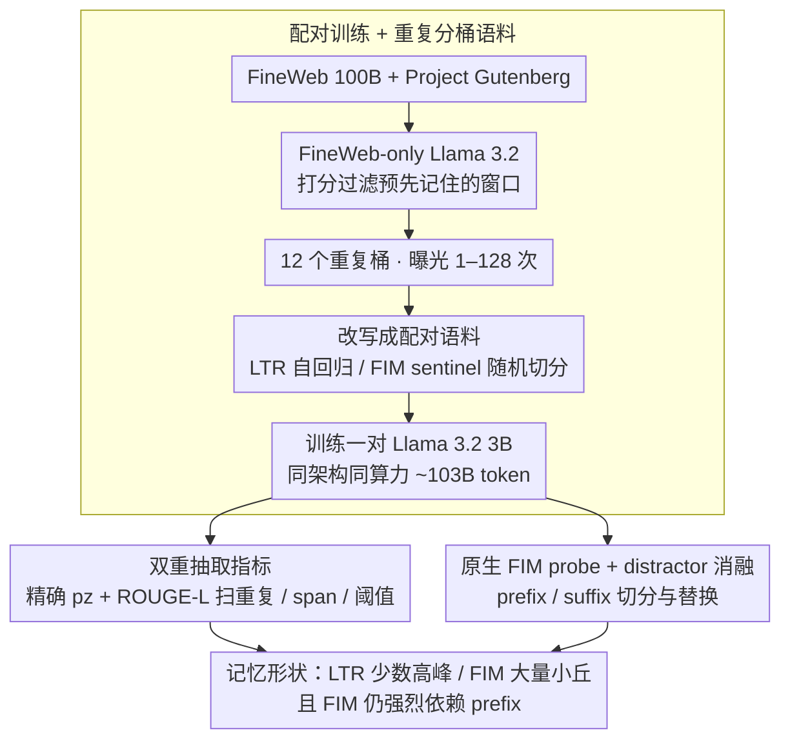

# Memorization Dynamics of Fill-in-the-Middle Pretraining

**会议**: ICML 2026  
**arXiv**: [2605.22981](https://arxiv.org/abs/2605.22981)  
**代码**: https://github.com/tobiasvonarx/memorization-study-fim  
**领域**: 可解释性 / LLM 预训练 / 记忆与隐私  
**关键词**: Fill-in-the-Middle、verbatim memorization、预训练目标、prefix-suffix probe、Llama 3.2

## 一句话总结
作者用相同架构、相同数据、相同算力训练了一对 Llama 3.2 3B（一个走标准 LTR，一个走 FIM），在 Gutenberg 重复语料上系统对比两种目标的逐字记忆行为，发现 FIM 把概率质量摊到更多"部分重建"上（短跨度/重叠召回更强且随重复次数近似线性增长），而 LTR 在长跨度高置信度续写上更强；FIM 的记忆仍然强烈依赖前缀，后缀只是辅助信号。

## 研究背景与动机

**领域现状**：大模型会逐字复现训练数据已经是公开问题，从早期 canary 暴露分数到 Carlini 等人后续的真实抽取攻击，社区已经在不同维度上量化"记忆"——精确抽取、概率抽取、book 级别抽取、成员推断等。Fill-in-the-Middle（FIM）作为一种把目标 span 移到 prefix-suffix 后面、用 sentinel 分隔的预训练目标，已经被 DeepSeek-v3、InCoder、StarCoder、Code Llama 广泛采用，用来给 causal LM 装上中段填空能力。

**现有痛点**：之前关于 FIM 的研究几乎只关心"填空效用"——能不能补全代码、能不能补全句子——但完全没人系统量化过 FIM 会如何改变记忆行为。直觉上 FIM 看到了双向上下文，似乎"应该"更容易记住；但同一段文本在 FIM 训练里每次会以不同的 prefix/middle/suffix 切分出现，又似乎会削弱单一长续写的记忆。两种力量怎么互相竞争，没有受控实验回答。

**核心矛盾**：评估"记忆"本身依赖很多混淆因子——模型规模、tokenization、prompt 位置、prior 可预测性、近重复都会影响抽取率。要把"是 FIM 目标本身造成的差异"和"模型质量差异 / 数据分布差异"剥开，必须做严格 paired training。

**本文目标**：拆成三个具体子问题：（i）FIM 在不同目标 span 长度、抽取阈值、重复次数下，对逐字抽取的影响是什么形状？（ii）在 FIM 原生 prompt 下，prefix 上下文、suffix 上下文、sentinel token 各自贡献多少记忆？（iii）观察到的差异是抽取几何造成的（probe 形式），还是模型能力差异造成的？

**切入角度**：构造一对架构、数据源、tokens 数完全一致的 LTR/FIM Llama 3.2 3B，在同一份 FineWeb + Gutenberg 上训练，把 Gutenberg 切成 12 个 1–128 次重复的桶，并先用 FineWeb-only 模型滤掉"预先就被记住"的窗口，让重复次数成为唯一变量。

**核心 idea**：通过受控配对训练 + 双重抽取指标（精确 $p_z$ 抽取 + ROUGE-L 重叠）+ 原生 FIM 的 prefix/suffix distractor 探针，把 FIM 与 LTR 的记忆机制差异定量解耦。

## 方法详解

### 整体框架
这篇工作要回答的不是"造一个新模型"，而是"FIM 这个预训练目标到底怎么改变了逐字记忆"，所以方法本质是一套把混淆因子全部锁死的对比实验设计。整条 pipeline 串成三段：先用同源数据切出一对只在训练目标上不同的 LTR/FIM 语料、并把 Gutenberg 部分按重复次数分桶，再在 prefix-only probe 下扫出两种模型在不同重复、不同 span 长度、不同阈值下的逐字抽取曲线，最后切到 FIM 真正会被使用的双向 prompt（prefix + sentinel + suffix），通过预算切分和 distractor 替换把 prefix 与 suffix 的记忆贡献定量拆开。两个模型还在 LM Evaluation Harness 的 8 个下游任务上做体检，性能几乎一致，从而把"差异源于模型能力"这一备择假说排除掉。

### 关键设计

**1. 配对训练 + 重复分桶语料：把"预训练目标"做成唯一变量**

记忆评估天然被模型规模、tokenizer、prior 可预测性、近重复等一堆因子污染，要把"是 FIM 目标本身造成差异"剥出来，唯一办法是做严格 paired training。作者用 FineWeb 100B 当 bulk 语料、Project Gutenberg 当受控记忆语料，先训一个只见过 FineWeb 的 Llama 3.2 给 Gutenberg 的 4096-token 窗口打分，滤掉离群、重复、以及"FineWeb 阶段就已经被记住"的窗口，再把剩余 excerpts 按 prior perplexity 平衡地均分进 12 个曝光次数为 $\{1, 2, \dots, 128\}$ 的桶（每桶 2810 条），让重复次数成为唯一自变量。LTR 语料保持原始自回归顺序，FIM 语料把样本改写成 sentinel 分隔的 prefix–suffix–middle 三段（FineWeb 部分 50% 走 FIM、Gutenberg 部分 100% 走 FIM）。一个看似不起眼但决定全文结论的工程细节是：同一 excerpt 在 FIM 语料里的多次重复采用不同的随机切分点，因此"重复"是文档级曝光而非固定 middle span 的曝光——正是这一点摊薄了 FIM 的记忆质量。两个模型共享同款 Llama 3.2 3B 架构、跑约 103B token 一个 epoch，结论因此能外推到真实预训练流程而不只是某个人造 probe。

**2. 双重抽取指标（exact $p_z$ + ROUGE-L）：用两把尺子量出"记忆形状"**

只看一个 span 长度或一种 probe 形式会漏掉关键差异，这是本文反复强调的方法论教训，所以它故意用两把互补的尺子。固定 prefix 100 token、target span $M=32$ 后，第一把尺子沿用 Cooper et al. 2026 的精确抽取概率 $p_z = \prod_{i=1}^{M} q_i$，其中 $q_i$ 是第 $i$ 个目标 token 在 top-$k=40$ 重归一（温度 $T=1$）后的概率，$p_z \geq 0.1\%$ 即判为可抽取；第二把尺子让 prefix 自回归生成 32 token 后与原文算 ROUGE-L，$\geq 0.5$ 判为高重叠召回。作者还在重复=128 上做阈值扫描以及 $M \in \{20, 30, 40, 50\}$ 的目标长度扫描。两把尺子合起来才看得见两种目标的不同记忆"形状"：单一严格阈值会被 LTR 的重尾抢走风头，单一短 span 又会漏掉 FIM 的部分重建——结果就是 FIM 在中等 $p_z$ 区间堆积更多质量、ROUGE-L 与 top-$k$ 支持率略胜，而 LTR 凭更重的右尾在 $0.1\%$ 阈值和长 span 上反而抽出更多窗口。一句话，LTR 是少量"高峰"，FIM 是大量"小丘"。

**3. 原生 FIM probe + prefix/suffix distractor 消融：把"前缀依赖"做成可证伪对照**

FIM 看起来"双向"，但因果 LM 的自回归本质让人怀疑 prefix 仍是记忆锚点，作者就在 FIM 真正被使用的双向 prompt 形态下把 prefix、suffix、sentinel 各自的贡献拆开验证。先固定 100 token 总预算、在 target 周围扫描 prefix/suffix 切分比例，记录 target 上的 top-$k$ 支持率、perplexity 与抽取率：从纯 suffix 到纯 prefix，perplexity 从 60.23 单调降到 27.93，top-$k$ 支持从 77.60% 升到 85.52%。更硬的是 distractor 实验——保持 target 不变，把 prefix、suffix、或两者替换成同长度但来自其他 Gutenberg excerpt 的无关文本：换 prefix 几乎让记忆消失、换 suffix 只小幅下降、两边都换则彻底崩盘，这就把"支持率提升来自 prompt 长度或 sentinel 结构"的伪相关排除掉了。注意力分析（Table 1）进一步佐证：FIM 在 prefix-only probe 上给 prefix 分配了更高注意力（0.646 vs LTR 0.604），更少回看已生成的 target token，这解释了它为什么不像 LTR 那样把质量堆成长续写。

### 损失函数 / 训练策略
两个模型都用 Megatron-LM 实现的 Llama 3.2 3B：28 层、hidden 3072、24 个 attention head、8 个 KV head、FFN 8192、vocab 128256、RoPE base 500000、bfloat16、无 dropout；packed THD 序列、序列长度 16384、micro-batch 1、global batch 2048，跑在 64 张 GH200 上，每步 33.5M token。LTR 跑 3057 步约 102.58B token，FIM 跑 3064 步约 102.81B token，两者算力几乎严格对齐。

## 实验关键数据

### 主实验

| 指标 | 重复范围 | FIM | LTR | 含义 |
|------|---------|-----|-----|------|
| Exact 抽取窗口数（$p_z \geq 0.1\%$, $M=32$） | 1–128 全桶汇总 | 2,230 | 3,279 | LTR 在严格阈值下抽出更多 |
| 平均 ROUGE-L | 同上 | 0.198 | 0.190 | FIM 重叠召回略高 |
| 平均 top-$k$ 支持率 ($k=40$) | 同上 | 87.09% | 86.18% | FIM 把更多质量摊到 top-$k$ |
| Prefix-only probe 抽取率 | 重复=128 | 高于 LTR | 低于 FIM | FIM 在高重复下反超 |
| 长 span ($M=50$) 抽取 | 高重复 | 低于 LTR | 高于 LTR | LTR 重尾在长 span 上占优 |

### 消融与原生 FIM probe

| 配置 | top-$k$ 支持率 | 说明 |
|------|---------------|------|
| 纯 prefix 100 token（原生 FIM） | 85.52% | 上限锚点 |
| 纯 suffix 100 token | 77.60% | 显著下降，target perplexity 60.23 |
| 真 prefix + 真 suffix（满 prompt） | 全程最高 | distractor 实验的上限参考 |
| 真 prefix + distractor suffix | 略降 | 后缀干扰影响有限 |
| Distractor prefix + 真 suffix | 大幅下降 | 前缀是记忆的锚点 |
| 两侧都 distractor | 崩盘 | 排除"prompt 长度/sentinel 结构"假说 |
| FIM 注意力分配（prefix-only probe） | prefix 0.646 / prev-target 0.354 | FIM 更依赖 prefix |
| LTR 注意力分配（同上） | prefix 0.604 / prev-target 0.396 | LTR 更看已生成 token |

### 关键发现
- FIM 与 LTR 不是"谁更容易记"，而是"记忆形状不同"：LTR 把概率质量聚成少数高峰（重尾、长 span 友好），FIM 把质量摊成许多小丘（部分重建友好、随重复近似线性增长）。
- 在 $M=32$、阈值 $0.1\%$ 下 FIM 抽取在高重复反超 LTR；但目标 span 越长，FIM 反超需要的重复次数越多——长 span 是 LTR 重尾的主场。
- 原生 FIM prompt 看似双向，实际严重 prefix-anchored：替换前缀几乎抹掉记忆，替换后缀只是小幅扣分，这暗示 FIM 训练并没有真正让模型"双向记住"内容。
- 8 个 LM Evaluation Harness 任务上 FIM 与 LTR 性能几乎一致（详见 §B.1），排除"模型能力差异导致抽取差异"的备择假说。

## 亮点与洞察
- 把"双重指标 + 多 span 长度 + 多重复桶"做成系统扫描，得到的不只是一个分数，而是 FIM/LTR 两个目标的"记忆分布形状"对比——这种二维视角是单点数字给不了的。
- 通过 prefix/suffix distractor 实验把 FIM 的"前缀依赖"做成可证伪的对照实验，比单纯报告 attention 分布更有说服力。
- 受控重复分桶 + 先用 FineWeb-only 模型过滤"预先记住"的窗口，是评估记忆研究里一个很干净的工程范式，可以直接被后续 memorization audit 沿用。
- 注意力分配的差异（FIM 看 prefix 更多）解释了它为什么不像 LTR 那样把质量堆成长续写——这是机制层面的小发现。

## 局限性 / 可改进方向
- 模型规模上限 3B（含 1B 消融），无法外推到 frontier 规模，记忆量随容量增加这一已知规律可能改变 FIM/LTR 的相对位置。
- 重复次数 1–128 涵盖了实践相关范围，但不允许在极限下做趋势外推。
- 最大的概念限制是"归因"：FIM 用随机切分时，probe 的 span 并不一定对应训练时见过的某个 middle，因此结果无法追溯到具体曝光实例。
- 笔者额外的观察：probe 全部基于 Gutenberg 这种语言型文本，没覆盖代码场景，而 FIM 的主要工业用法恰恰是 code completion；FIM 在代码上的记忆动力学可能和这里的结论分歧很大。
- 后续工作可以引入 prompt 位置敏感性扫描（参考 Xu et al. 2026 的 positional fragility）和 span-to-training 的精确映射，验证这些模式是否在更长 extraction 窗口下仍然成立。

## 相关工作与启发
- **vs Carlini et al. 2023（Quantifying Memorization）**：那篇画出 LTR 下"记忆随容量/重复对数增长"的 scaling law，本文把对照扩展到 FIM 目标，发现 FIM 的曲线不是对数饱和而是近似线性上升，是对原 scaling 故事的一个重要补充。
- **vs Cooper et al. 2026（Book-level Extraction）**：本文沿用了 $p_z$ 抽取指标，但用 $M=32$ 让 ROUGE-L 与精确抽取能在同一组窗口上比对，并把分析从"抽多少书"上升到"FIM/LTR 的形状差异"。
- **vs Huang et al. 2024（Demystifying Verbatim Memorization）**：印证了"需要不少重复才会出现记忆"的结论，并把它从 LTR 推广到 FIM，发现 FIM 起步更慢但增长更稳。
- **vs Bavarian et al. 2022（FIM 原始论文）**：原文证明了 FIM 不显著伤害下游能力；本文把视角换成"安全/隐私 audit"，揭示 FIM 改变的是记忆几何而非记忆总量。

## 评分
- 新颖性: ⭐⭐⭐⭐ 第一次系统量化 FIM vs LTR 的记忆差异，配对训练 + 双指标设计干净。
- 实验充分度: ⭐⭐⭐⭐ paired 3B 训练 + 重复分桶 + 双 probe + distractor 消融 + 1B/下游任务 ablation，已经做到能做的极限。
- 写作质量: ⭐⭐⭐⭐ 结构清晰，"prefix-only → 原生 FIM → distractor"递进自然，方法论教训（不能只看一个 span 长度）讲得直白。
- 价值: ⭐⭐⭐⭐ 对预训练目标选型与记忆 audit 都有直接指导意义，尤其是"FIM 仍然 prefix-anchored"这一结论会影响 infilling 模型的隐私评估方式。

<!-- RELATED:START -->

## 相关论文

- [\[ICLR 2026\] Grokking in LLM Pretraining? Monitor Memorization-to-Generalization without Test](../../ICLR2026/interpretability/grokking_in_llm_pretraining_monitor_memorization-to-generalization_without_test.md)
- [\[ICML 2026\] Is One Layer Enough? Understanding Inference Dynamics in Tabular Foundation Models](is_one_layer_enough_understanding_inference_dynamics_in_tabular_foundation_model.md)
- [\[ICML 2026\] Dissecting Multimodal In-Context Learning: Modality Asymmetries and Circuit Dynamics in modern Transformers](dissecting_multimodal_in-context_learning_modality_asymmetries_and_circuit_dynam.md)
- [\[ICML 2026\] Tracing the Dynamics of Refusal: Exploiting Latent Refusal Trajectories for Robust Jailbreak Detection](tracing_the_dynamics_of_refusal_exploiting_latent_refusal_trajectories_for_robus.md)
- [\[CVPR 2026\] Pixel2Phys: Distilling Governing Laws from Visual Dynamics](../../CVPR2026/interpretability/pixel2phys_distilling_governing_laws_from_visual_dynamics.md)

<!-- RELATED:END -->
