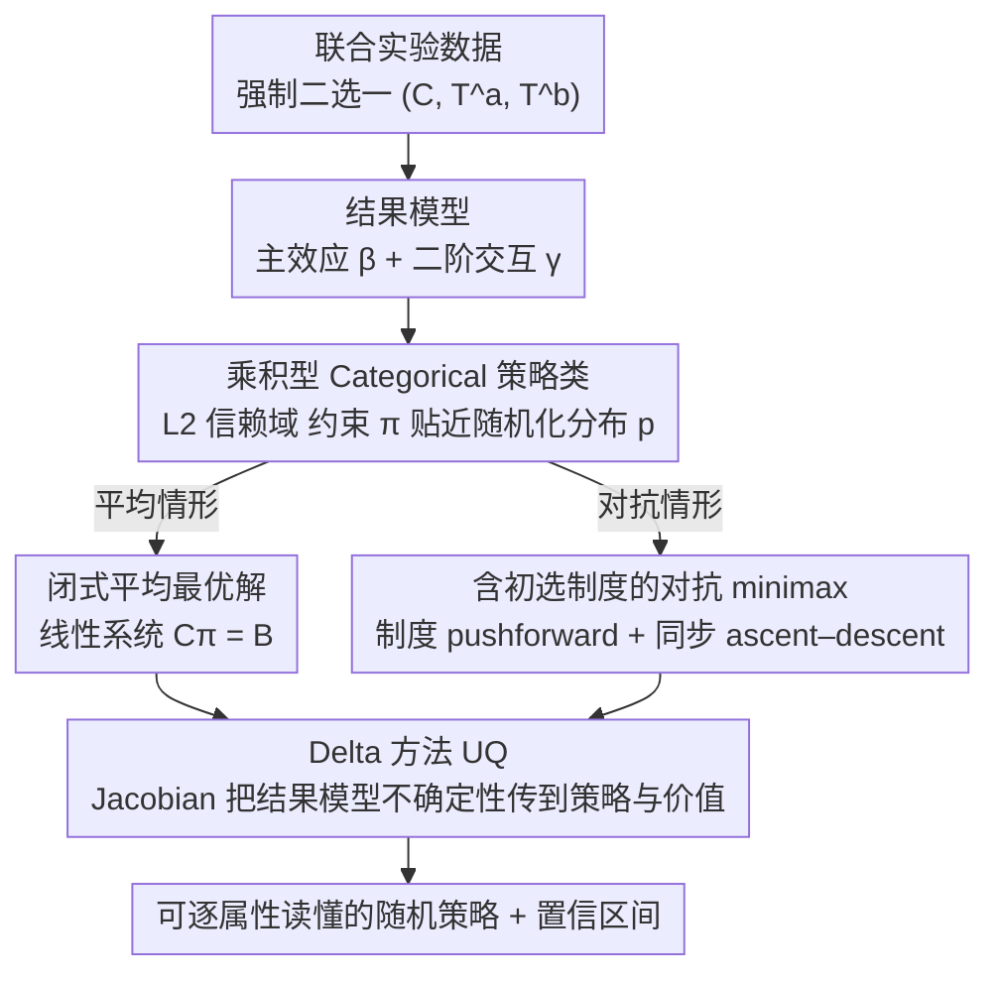

# MiniMax Learning of Interpretable Factored Stochastic Policies from Conjoint Data, with Uncertainty Quantification

**会议**: ICML 2026  
**arXiv**: [2504.19043](https://arxiv.org/abs/2504.19043)  
**代码**: 待确认  
**领域**: 可解释性 / 离线策略学习 / 联合实验 / 极小极大博弈  
**关键词**: conjoint analysis, factored stochastic policy, minimax, Delta method, AMCE

## 一句话总结
本文把传统社会科学里的联合实验 (conjoint analysis) 从"估计 AMCE 边际效应"重新表述为"在指数级因子动作空间上学习可解释的乘积型 Categorical 随机策略"，给出二阶交互模型下带 $L_2$ 信赖域的闭式解、可微分通解、以及含政党初选制度的两人 minimax 扩展，并通过 Delta 方法把结果模型的不确定性传播到策略概率和价值上，在 2016 美国总统联合实验上首次让对抗均衡的"票房份额"落回历史区间。

## 研究背景与动机

**领域现状**：联合实验 (conjoint analysis) 是社会科学里研究"多属性偏好"的主力工具，做法是随机给受访者两份多属性候选档案（候选人特征、产品特征等），让其强制二选一；分析时把每个属性的边际效应汇总成 AMCE (Average Marginal Component Effect)：固定一个属性的取值，对其他属性按某个分布平均，得到该属性的"主效应"。AMCE 已经是 *Political Analysis* 等期刊的事实标准。

**现有痛点**：AMCE 假定其他属性按某个分布（通常是均匀）独立抽取，但真实候选池既非均匀、也不会"在战略真空里"挑特征——民主党、共和党的候选人画像是彼此博弈出来的。这导致 AMCE 给出的"最优特征组合"经常和历史选举结果对不上。同时，AMCE 只回答"单属性效应"，无法回答"我应该派什么样的候选人"这个真正的决策问题。

**核心矛盾**：决策对象是 $D$ 个属性的联合分布，动作空间大小 $|\mathcal{T}|=\prod_d L_d$ 随属性数指数爆炸；而样本量 $n$ 远小于 $|\mathcal{T}|$，**逐档案学策略**既不可行也无法解读。要么牺牲表达力（只看边际）、要么牺牲可解释性（黑箱神经网络）、要么牺牲战略真实（忽略对手）。

**本文目标**：(1) 把估计问题改写成离线策略优化问题；(2) 找一个既能跨指数级动作空间又能让政治学者读懂的策略类；(3) 把"对手"建模成真正在同时优化的战略主体而非静态分布；(4) 给出可信区间，让结论"能上期刊"。

**切入角度**：作者注意到联合实验的随机赋值天然提供了 logging policy，因此可以套用离线 contextual bandit 框架；同时观察到"乘积型 Categorical"（product-of-Categoricals）这种分布既是 Gibbs 最优策略在 mean-field 变分近似下的自然受限族，又可以逐属性读出"模型给经济议题多少权重"，把可解释性建在策略类的归纳偏置里。

**核心 idea**：把 AMCE 替换成一族"乘积型 Categorical 随机策略"，在线性概率近似下推出闭式最优解，再用 Delta 方法把回归参数的不确定性传到策略和价值上；进一步把双方都建成博弈主体，写出含初选制度的 restricted minimax 目标，用对抗 ascent–descent 求受限稳态点。

## 方法详解

### 整体框架
本文要解决的是"派什么样的候选人"这个离线决策问题：输入是带强制二选一标签的联合实验数据 $(C_i, \mathbf{T}_i^a, \mathbf{T}_i^b)_{i=1}^n$（$\mathbf{T}^c \in \mathcal{T}=\{1,\dots,L\}^D$ 是 $D$ 维档案，$C_i\in\{0,1\}$ 是受访者是否选 $a$），输出是一个可逐属性读懂的随机干预策略及其置信区间。整个方法把它拆成前后衔接的两步：先拟合一个带二阶交互的结果模型，把 logit 写成主效应 $\beta_{dl}$ 与交互 $\gamma_{dl,d'l'}$ 的差分形式 $\eta_i=\sum \beta_{dl}(I_i^a-I_i^b)+\sum \gamma(\cdot)$；再在乘积型 Categorical 策略类 $\Pr_{\bm{\pi}^c}(\mathbf{T}^c=\mathbf{t})=\prod_d \pi^c_{d,t_d}$ 上、受 $L_2$ 信赖域 $\|\bm{\pi}^c-\mathbf{p}\|_2^2 \le \epsilon_n$ 约束地求最优策略——平均情形有闭式解，对抗情形用 logit 重参数化跑同步 ascent–descent。最后用 Delta 方法把结果模型的方差–协方差矩阵 $\hat{\Sigma}$ 通过 Jacobian $\mathbf{J}=\nabla_{\hat\beta,\hat\gamma}\{\hat Q,\hat{\bm\pi}^*\}$ 传播到策略概率和价值的标准误上。

### 关键设计

**1. 乘积型 Categorical 受限策略类 + L2 信赖域：用可读的随机分布替代脆弱的"最优单档案"**

动作空间 $|\mathcal{T}|=\prod_d L_d$ 随属性数指数爆炸，逐档案学策略既不可估也读不懂，而"最优单档案" $\bm\pi^*(\mathbf{t})=\mathbb{I}(\mathbf{t}=\mathbf{t}^*)$ 在高维下样本量根本不够选出唯一赢家。本文因此把策略限定为属性间独立的乘积分布 $\Pr_{\bm\pi}(\mathbf{t})=\prod_d \pi_{d,t_d}$，优化 $\max_{\bm\pi} Q(\bm\pi)-\lambda_n\|\bm\pi-\mathbf{p}\|_2^2$，其中价值 $Q(\bm\pi)=\sum_{\mathbf{t}}\mathbb{E}[Y_i(\mathbf{t})]\Pr_{\bm\pi}(\mathbf{t})$，$\mathbf{p}$ 是实验随机化分布（即天然的 logging policy）。这个看似工程化的限制其实有变分理论撑腰：作者证明当正则取 KL 时，全单纯形上的最优解是 Gibbs 形式 $\sigma^\star(\mathbf{t})\propto p(\mathbf{t})\exp\{u(\mathbf{t})/\lambda\}$，而限定到乘积族恰好等价于对该 Gibbs 分布做经典 mean-field 变分近似 (Wainwright & Jordan, 2008)。这样选有三重好处：乘积形式让策略逐属性可读，能直接说"模型给 outsider 0.7、给 hardline 0.4"，满足政治学发表对可解释性的硬要求；$L_2/KL$ 信赖域同时压低了 off-policy 估计方差并稳定优化；随机策略还能把概率质量摊到"一族表现都不错的档案"上，比强行钦定单一最优档案稳健得多。

**2. 闭式平均情形最优解 + Delta 方法 UQ：让最优策略写成可微分的线性系统，把回归不确定性一路传到标准误**

政治学/经济学发文必须报告置信区间，但 Athey & Wager 一系的政策学习几乎不给随机策略的标准误，本文的卖点正在于"分析友好"。在二阶交互的线性概率近似下，把目标对每个 $\pi_{dl}$ 求偏导并令其为零，可整理成线性系统 $\mathbf{C}\bm{\pi}^{a*}=\mathbf{B}$，其中 $B_{r(dl),1}=-\bar\beta_{dl}-4\lambda_n p_{dl}-2\lambda_n\sum_{l'\ne l}p_{dl'}$、$C_{r(dl),r(dl)}=-4\lambda_n$、$C_{r(dl),r(d'l')}=\bar\gamma_{dl,d'l'}$（命题 3.1）；当 $\lambda_n$ 大到 Hessian 负定且解落在单纯形内部时它就是唯一全局最优。由于 $\bm{\pi}^{a*}=\mathbf{C}^{-1}\mathbf{B}$ 是 $(\hat\beta,\hat\gamma)$ 的可微函数，UQ 就顺势变成一次线性系统：Var-Cov$(\hat Q, \hat{\bm\pi}^{a*})=\mathbf{J}\hat\Sigma\mathbf{J}'$，且 $\sqrt{n}(\hat{\bm\pi}^{a*}-\bm\pi^{a*}) \to \mathcal{N}(0,\mathbf{J}\Sigma\mathbf{J}')$。当推广到一般 GLM/BNN 需要迭代求解时，作者既支持 unroll 全部 $S$ 步自动求导，也支持在收敛点用隐式微分 $\partial\bm\alpha^*/\partial\theta=-H^{-1}\nabla_\theta F$，只解一次 $H^{-1}$ 即可规避长程反传——这套"两步法 UQ"因此能无缝覆盖闭式解、GLM、BNN 直到对抗 minimax。

**3. 含初选制度的对抗 minimax 扩展：把对手从静态分布升级成博弈主体，并把选举制度直接编进支付**

AMCE 默认"对方候选人按某个固定分布抽取"，可真实选举里两党画像是彼此博弈出来的。本文因此定义零和支付 $Q(\bm\pi^A,\bm\pi^B)=\mathbb{E}[\Pr\{C_i(\mathbf{T}^A,\mathbf{T}^B)=1\}]$、目标 $\max_{\bm\pi^A}\min_{\bm\pi^B}Q$，并把制度参数 $\beth$（初选参与集 $\mathcal{I}^A,\mathcal{I}^B$、大选选民集 $\mathcal{E}$）通过"提名分布的 pushforward" $\bar{\bm\pi}^A(\bm\pi^A,\bm\pi^{A'},\beth)$ 注入支付，得到 $Q_{\text{inst}}(\bm\pi^A,\bm\pi^B;\bm\pi^{A'},\bm\pi^{B'},\beth)$——这样把初选/大选制度当算子直接嵌进优化目标，而非事后修正，避免了"最优档案是 outsider+hardline 但在初选根本出不了线"的制度违和。算法 1 在 logit 参数 $\bm\alpha^A,\bm\alpha^B$ 上跑同步 ascent–descent：$\bm\alpha^{A,(s)}\leftarrow\bm\alpha^{A,(s-1)}+\gamma\nabla_{\bm\alpha^A}\Phi$、$\bm\alpha^{B,(s)}\leftarrow\bm\alpha^{B,(s-1)}-\gamma\nabla_{\bm\alpha^B}\Phi$，其中 $\Phi=Q_{\text{inst}}-\lambda R(\pi^A\|p)+\lambda R(\pi^B\|p)$，末了用 softmax 还原策略。当制度让 pushforward 对每方仿射时 $Q_{\text{inst}}$ 是双线性的，von Neumann 极小极大定理保证全单纯形鞍点存在；受限因子化族在单纯形里非凸，作者退而求 exploitability 诊断意义下的稳态点。配套还定义了**策略分歧因子** $\mathcal{D}_\varepsilon(\mathbf{t})=|\log\frac{\Pr_{\bm\pi^A}(\mathbf{t})+\varepsilon}{\Pr_{\bm\pi^B}(\mathbf{t})+\varepsilon}|$（带 $\varepsilon$ 平滑的单点对数概率比），用来量化"某真实候选人偏离本党最优策略多远"以及两党战略空间的距离。

### 损失函数 / 训练策略
平均情形优化 $O(\bm\pi)=Q(\bm\pi)-\lambda\|\mathbf{p}-\bm\pi\|^2$，走闭式解或投影梯度；对抗情形优化 $\Phi(\pi^A,\pi^B)=Q_{\text{inst}}-\lambda R(\pi^A\|\mathbf{p})+\lambda R(\pi^B\|\mathbf{p})$，在 logit 重参数化下跑共 $S$ 步同步 ascent–descent、并用 Monte Carlo 估提名分布。推断阶段 Jacobian 经 unroll 或隐式微分两条路径计算，标准误在受访者层聚类。

## 实验关键数据

### 主实验
两类实验：合成数据 + 2016 美国总统真实联合实验 (Ono & Burden 2019)。合成实验在 $n\in\{500,1500,3500,10000\}$、$K\in\{5,10,20\}$ 网格上扫；对抗实验在共和党选民比例 $p_R\in\{0.2,0.3,0.5,0.65,0.8\}$、$n\in\{1000,5000,10000\}$ 上扫。

| 场景 | 样本 / 维度 | 指标 | 本文 (闭式 + Delta) | AMCE 基线 | 备注 |
|------|------------|------|---------------------|-----------|------|
| 平均情形合成（$R^2{=}0.7$） | $n{=}3500, K{=}10$ | RMSE($\hat{\bm\pi}^*$) | 快速下降 / 偏差可忽略 | — | Fig 3–4 |
| 平均情形合成 | 同上 | 期望胜率 $Q$ | 显著高于 AMCE 逐属性 argmax | 基线 | Fig 4 |
| 平均情形合成 | 同上 | 95% CI 覆盖率 | 接近 0.95 | — | §B.4 |
| 对抗情形合成 | $n{=}10000$ | RMSE($\hat{\bm\pi}^R$) | 主要由 $n$ 决定，对 $p_R$ 弱依赖 | — | Fig 1 |
| 对抗情形合成 | $n{=}1000$ | 95% CI 覆盖率 | 略低于名义 | — | $n$↑后趋近 0.95 |
| 2016 美国总统 conjoint | 神经结果模型 | 平均情形最优档案的隐含票房 | **落在历史 1976–2020 两党区间之外** | — | Fig 2 |
| 同上 | 神经结果模型 | 对抗受限均衡隐含票房 | **落回历史区间，贴近 2016 实际结果** | — | Fig 2，关键卖点 |

### 消融实验
| 配置 / 变体 | 关键观察 | 说明 |
|------------|---------|------|
| GLM（含二阶交互）vs Bayesian Transformer | 表面线性时 GLM 最高效、校准最好；非线性失配时 Transformer RMSE 略胜但 CI 覆盖不达标 | Table 2，对结果模型选择的敏感性 |
| 无对抗（平均 + 均匀对手）vs 对抗 minimax | 平均策略推出的票房不切实际；对抗策略推出的票房贴合历史 | 验证 minimax 是真实战略环境的必要建模 |
| 闭式解 vs 迭代 + unroll vs 迭代 + 隐式微分 | 收敛后三者解一致；隐式微分内存/速度更优，但接近边界或 $H$ 病态时不稳 | §3.3 讨论，无单独大表 |
| 无数据驱动聚类 vs 含聚类（Goplerud et al. 2025） | 聚类版本无须显式党派标签就能内生恢复"民主党-独立-共和党"偏好结构 | Fig 12 |

### 关键发现
- **最让人信服的实证**：平均情形最优档案给出的票房份额跑到历史区间之外（不可信），换成对抗 restricted-equilibrium 后立刻贴回 1976 年以来两党票房区间，并和 2016 实际结果对上——这等于用一个统计模型自检"对手是不是也在优化"，给出了一个**可证伪**的判据。
- **AMCE 输哪里**：在主效应正、交互负（如 outsider 与 moderate 互为替代品）的设置里，AMCE 逐属性 argmax 选出 (outsider, moderate)，本文方法会把概率质量摊到 (outsider, hardline) 或 (insider, moderate)，期望胜率显著更高（Example 1 + Fig 4）。
- **样本敏感度**：对抗设置下 RMSE 主要由 $n$ 决定，对 $p_R$ 几乎不敏感——说明误差瓶颈是"选民效用估得准不准"，而非"博弈本身有多难"。
- **模型形态权衡**：Transformer 更鲁棒于非线性失配但牺牲校准；这一点在不确定性量化优先的政治学应用里是反向论据，倾向用 GLM。

## 亮点与洞察
- **把社会科学的旗舰估计量替换为离散动作空间策略学习**：AMCE → factored stochastic policy 这一改写一举把联合实验对接到 offline contextual bandit / multi-agent RL 的整个工具箱（doubly robust 估计、Delta 方法、隐式微分、Mirror-Prox），是研究范式而非工具的迁移。
- **受限策略类正好是 Gibbs 解的 mean-field 变分近似**：作者点破"乘积型 Categorical = 对最优 Gibbs 策略做 product 变分"，这把"为了可解释性而限制策略类"从工程取舍升级成有变分理论支撑的逼近族，并直接给出与全单纯形最优的差距界（§A.4）。这一观察可迁到任何需要"可解释 + 信赖域"的离散策略学习。
- **闭式解 + 隐式微分**：在 $L_2$ 信赖域、二阶交互、线性概率近似三重条件下，最优策略写成 $\mathbf{C}^{-1}\mathbf{B}$，参数不确定性通过单次线性系统传播；对一般 GLM/NN 则用隐式函数定理在收敛点解一次 $H^{-1}$，规避 unroll 全部梯度步——这套 UQ 套路在任何"两步法"（先拟合 outcome model 再求最优策略）问题里都成立。
- **制度作为 pushforward 注入支付**：把初选规则、开放/封闭性、turnout 权重统一抽象成把策略 $\bm\pi^c$ 映成提名分布 $\bar{\bm\pi}^c$ 的算子，避免了对每种制度单独建模；对其他"机制约束的优化"（医疗资源分配、平台竞价规则）有结构化迁移空间。
- **策略分歧因子 $\mathcal{D}_\varepsilon(\mathbf{t})$**：单点对数比 + $\varepsilon$ 平滑，简单到一行公式，却第一次给出了"某个真实候选人有多偏离当前党的最优策略"的可量化诊断，能反过来检测候选人画像和均衡的偏离。

## 局限与展望
- **两步法**：第一步结果模型与第二步策略优化分开，第二步把第一步的标准误当输入，不联合估计；意味着结果模型设错会同时污染策略和置信区间。
- **政策类近似而非最优**：乘积型 Categorical 不是无约束最优，作者明确这是"interpretability vs optimality"的取舍，但没量化在交互高度复杂时的最坏 gap。
- **不确定性不含偏好形成**：UQ 只覆盖统计变异，没建模"偏好被实验问法/卡组顺序污染"的不确定（满意化、cycle 检测等近期 conjoint 文献的痛点）。
- **制度参数 $\beth$ 需先验已知**：开放/封闭初选的归类、turnout 权重、独立选民比例都得查；如果选错制度，restricted minimax 解会系统性偏。
- **对抗优化的全局性**：因子化策略类在受限单纯形里非凸，gradient ascent–descent 只能找到稳态点，exploitability 诊断给出局部质量但不是全局保证；在更高维联合实验里这点会更突出。
- **改进方向**：(i) 把 Goplerud et al. 的异质性聚类联合塞进 minimax 而不只是消融；(ii) 用 Mirror-Prox / extragradient 替换 vanilla ascent–descent 取更紧的 last-iterate 收敛率；(iii) 把偏好形成不确定（如 Bansak 的 satisficing）作为分层先验加入。

## 相关工作与启发
- **vs AMCE / AMIE (Hainmueller et al. 2014; Egami & Imai 2019)**: 经典联合分析估计的是"单属性边际效应"或"两两交互效应"，需要预先指定其他属性的边际分布；本文估计"全档案的最优分布"，把对手分布作为可优化变量或博弈对手，避开了 De la Cuesta et al. (2022) 指出的"AMCE 依赖均匀化假设"问题。
- **vs Policy Learning with Observational Data (Athey & Wager 2021; Kitagawa & Tetenov 2018)**: 这一支主要研究确定性 treatment rules 在观测数据下的 regret 界，本文是随机策略 + 强随机化 logging policy + 因子化动作空间，结构化更强；本文的"随机策略"对应他们"二元 treatment rule"在多维下的天然推广。
- **vs Minimax Policy Learning under Unobserved Confounding (Kallus & Zhou 2021)**: 同是 minimax 但他们 minimax 是对**未知混杂**做最坏情形，本文 minimax 是对**真实战略对手**做博弈均衡，目标和论证完全不同。
- **vs Markov Games / PSRO (Littman 1994; Lanctot et al. 2017)**: 经典多智能体 RL 通常假设效用已知或可在线交互，本文在效用从随机化离线数据估出来 + 受限因子化策略类 + Delta 方法 UQ 的设定下推稳态点，更贴近 social science 离线数据约束。
- **vs Implicit Differentiation for Hyperparameter Optimization (Lorraine et al. 2020)**: 直接把隐式微分套到博弈不动点 + 双方策略的 Jacobian 上，是个简洁但鲜见的应用。
- **启发**：(i) "经典估计量重写成策略学习"这一招在其他随机化设计（A/B 测试、临床 trial）同样适用；(ii) 把"可解释性"建在策略类的归纳偏置（乘积分布）而非事后解释，对推荐/搜索等需要"逐特征可读"的离散动作系统是很值得借鉴的设计哲学；(iii) "制度 pushforward + minimax"是把规则编码进优化目标的通用模式，可以迁到拍卖机制、内容平台的多方博弈。

## 评分
- 新颖性: ⭐⭐⭐⭐⭐ 把整个 conjoint 学派从 AMCE 估计搬到 minimax 受限策略学习 + 闭式解 + Delta UQ，跨界且系统。
- 实验充分度: ⭐⭐⭐⭐ 合成实验扫了样本与维度网格、对抗情形扫了 $p_R$ 与 $n$ 网格、2016 美国总统真实联合实验，外加历史对照与策略分歧诊断；唯一可惜处是对抗 minimax 的稳态点全局性诊断较薄。
- 写作质量: ⭐⭐⭐⭐ 推导严谨、记号繁但自洽、附录给出 KL 信赖域的变分近似界与隐式微分细节，跨学科读者门槛偏高。
- 价值: ⭐⭐⭐⭐⭐ 在政治学/社会科学里有望直接替换 AMCE 成为新标准估计量，配套开源 2016 候选人到 conjoint 特征的映射，可复现性高。

<!-- RELATED:START -->

## 相关论文

- [\[CVPR 2026\] HierUQ: Hierarchical Uncertainty Quantification with Adaptive Granularity Reconciliation for Degraded Image Classification](../../CVPR2026/interpretability/hieruq_hierarchical_uncertainty_quantification_with_adaptive_granularity_reconci.md)
- [\[ICML 2026\] Interpretable Self-Supervised Learning via Representer Landmarks and Nyström Approximation](interpretable_self-supervised_learning_via_representer_landmarks_and_nyström_app.md)
- [\[ICML 2026\] Courtroom Analogy: New Perspective on Uncertainty-Aware Classification](courtroom_analogy_new_perspective_on_uncertainty-aware_classification.md)
- [\[ICML 2026\] Position: Let's Develop Data Probes to Fundamentally Understand How Data Affects LLM Performance](position_lets_develop_data_probes_to_fundamentally_understand_how_data_affects_l.md)
- [\[ICLR 2026\] Behavior Learning (BL): Learning Hierarchical Optimization Structures from Data](../../ICLR2026/interpretability/behavior_learning_bl_learning_hierarchical_optimization_structures_from_data.md)

<!-- RELATED:END -->
