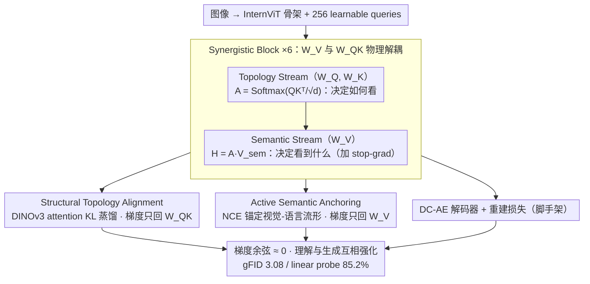

# MUSE: Resolving Manifold Misalignment in Visual Tokenization via Topological Orthogonality

**会议**: ICML 2026  
**arXiv**: [2605.05646](https://arxiv.org/abs/2605.05646)  
**代码**: 有（论文标注 GitHub，仓库地址需查正文）  
**领域**: 可解释性 / 多模态 / 视觉 Tokenizer  
**关键词**: 统一视觉 tokenizer, 流形对齐, 梯度正交, 拓扑对齐, 多模态理解-生成

## 一句话总结
MUSE 把统一视觉 tokenizer 的"理解-生成"零和困境归因于流形错配，提出梯度正交假设——把语义注入 $W_V$ 而结构梯度走 $W_{Q,K}$——并通过 Synergistic Block + DINOv3 拓扑对齐 + NCE 语义锚定彻底解耦，最终 gFID 3.08 与 linear probing 85.2%（甚至超过 InternViT-300M 老师 82.5%）共存，首次实现真正的"互相强化"而非折中。

## 研究背景与动机

**领域现状**：随着多模态大模型走向统一，业内试图用一个 unified visual tokenizer 同时服务理解（CLIP 风格语义编码）和生成（VQ-VAE/扩散 latent）。UniTok、TokenFlow、UniLIP、VTP 等都试图把两类目标塞进同一 codebook 或共享 latent。

**现有痛点**：尽管架构统一了，目标却依旧打架——像素重建喜欢"散开"的流形（多保留高频细节），语义对齐喜欢"压紧"的流形（多过滤无关纹理），导致这些方法在表征上出现"感知极化"：注意力要么碎片化（VA-VAE 一类），要么过度模糊（UniLIP 一类），中频结构信息缺失。

**核心矛盾**：两个目标在共享参数（特别是 self-attention 的 $W_Q, W_K, W_V$）里直接竞争，梯度方向甚至呈负余弦（$\cos\theta_g \ll 0$，图 2a），出现"破坏性干扰"——一边拉、另一边推，最终谁也学不好，作者称之为 Manifold Misalignment。

**本文目标**：(1) 在不增加架构开销的前提下消除生成-理解的零和折中；(2) 让"结构信息"成为桥梁，同时服务两个目标；(3) 实证验证梯度正交假设可以把"参数共享=梯度冲突"破成"分子空间=梯度协同"。

**切入角度**：从流形几何视角，理解需要 $\mathcal M_S$（语义不变）"压缩"流形，生成需要 $\mathcal M_T$（结构等变）"展开"流形；中间缺一个 $S$（Structural State）做几何基础。Transformer block 里 $W_{Q,K}$ 控制路由拓扑、$W_V$ 控制内容值，本身就是两个自然的正交子空间。

**核心 idea**：把语义梯度路由到 $W_V$、结构梯度路由到 $W_{Q,K}$，用 DINOv3 attention 蒸馏对齐拓扑、用 NCE 把内容锚定到 vision-language 流形，让两套目标在 Transformer 里物理隔离地优化。

## 方法详解

### 整体框架
MUSE 要解决的是"一个 tokenizer 同时服务理解和生成时两类梯度互相打架"的问题，做法是把编码器 $f_\theta: \mathcal X \to \mathcal Z$ 拆成两条物理隔离的梯度通路——结构梯度只走 $W_{Q,K}$、语义梯度只走 $W_V$，再让 latent 既落在语义不变流形 $\mathcal M_S$ 又落在结构等变流形 $\mathcal M_T$ 上。架构上用 6 个 Synergistic Block 组成 connector，InternVL3 的 InternViT 作视觉骨架、DC-AE 作像素解码器；训练按"先学看哪里、再学是什么、最后端到端协同"的三阶段课程展开，全程用 stop-gradient 切断重建梯度对语义分支的污染。

### 关键设计

**1. Synergistic Block：把 $W_V$ 与 $W_{Q,K}$ 物理解耦**

痛点是经典 self-attention 里 $W_Q, W_K, W_V$ 共享参数，重建与语义两类梯度被优化器强行混在一起，余弦甚至为负（破坏性干扰）。MUSE 顺着 attention 内部天然的分工把它拆成两条流：Topology Stream 用 $W_Q, W_K$ 算邻接矩阵 $A = \text{Softmax}(Q_{topo}K_{topo}^T/\sqrt{d_k})$，决定"如何看"；Semantic Stream 用独立的 $W_V$ 投出值 $V_{sem}=H_l W_V$，再按 $A$ 聚合 $H_{attn}=A\cdot V_{sem}$，决定"看到了什么"。这样结构损失只回传到 $W_{Q,K}$、语义损失只回传到 $W_V$，并在语义分支上加 stop-gradient（图 3 右下角 /// 标记）阻止重建梯度穿过语义分支再去污染路由。之所以有效，是因为作者的 violin plot（图 2c-d）显示自然训练下语义梯度本就集中在 $W_V$、结构梯度本就集中在 $W_{Q,K}$，Synergistic Block 不过是顺着这种内在功能专门化做隔离，几乎不增参数却把梯度余弦从负压到 ≈ 0。

**2. Structural Topology Alignment：用 DINOv3 attention 蒸结构**

理解和生成都缺中频结构信息，而 DINOv3 这类自监督模型的 attention map 天然涌现出物体级分割几何，正好可以当 free 的拓扑监督。MUSE 先用 4D 插值函数 $\Psi(\cdot)$ 对齐师生分辨率，再对每层每个头用 KL 散度对齐：$\mathcal L_{topo} = \frac{1}{LH}\sum_l\sum_h D_{KL}(\Psi(A_T^{(l,h)})\,\|\,A_S^{(l,h)})$，这条 loss 由架构保证只更新 $W_{Q,K}$，目标是最大化 $I(Z;S)$。课程上之所以先学拓扑，源自互信息链式分解 $I(Z;X,Y)\approx I(Z;S)+I(Z;Y|S)+I(Z;X|S,Y)$——其中结构态 $S$ 是几何基础，先把"看哪里"学稳再学"是什么"，从信息论上比同时优化所有项更合理。

**3. Active Semantic Anchoring：用 NCE 把 token value 钉在视觉-语言流形上**

以往蒸馏式语义对齐（如 UniLIP）是被动蒸馏，很容易被重建梯度持续侵蚀挤走。MUSE 改用主动锚定：projector $g_\phi(\cdot)$ 把池化 token $\bar z$ 投到视觉-语言联合空间，再用 NCE 上界 $\mathcal L_{anchor} = \mathcal L_{NCE}(g_\phi(\bar z), t) \approx -I_{LB}(Z;Y|S)$（$t$ 为配对文本 embedding）把内容钉在流形上，这条 loss 由架构保证只更新 $W_V$ 与 projector。NCE 作为信息论下界配合 stop-gradient，等价于在 $W_V$ 上加 Lagrangian 约束，强迫值参数无法漂离 $\mathcal M_S$，从根本上避免了被动蒸馏被覆盖的问题。

### 损失函数 / 训练策略
三阶段课程：Stage 1（拓扑预热，50k 步，224×224，lr 4e-4，冻 backbone，只开 $\mathcal L_{topo}$）→ Stage 2（语义注入，50k 步，lr 2e-4，加 NCE）→ Stage 3（协同微调，50k 步，lr 1e-5，开 adversarial training，端到端重建+语义+拓扑联合）。MUSE-1B/3B 两个变体分别基于 InternVL3-1B + SANA-0.6B 与 InternVL3-2B + SANA-1.6B。Connector 用 6 个 Synergistic Block，$N=256$ 个 learnable queries。预训练语料 36M 图文对（27M Qwen2.5-VL-7B recaption + 5M CC12M + 4M JourneyDB）。

## 实验关键数据

### 主实验
表 1（ImageNet-1K + ADE-20K，所有 unified 方法都重训用同一 BLIP3-o 语料保证公平）：

| 方法 | rFID↓ | gFID↓ | PSNR↑ | Zero-Shot↑ | Linear Probe↑ | mIoU↑ |
|------|-------|-------|-------|------------|---------------|-------|
| InternViT-300M (老师，仅理解) | – | – | – | 77.4 | 82.5 | 40.2 |
| VA-VAE-d32（仅生成） | 0.52 | 4.56 | 26.2 | – | – | 19.6 |
| TokenFlow | 1.37 | 7.66 | 21.6 | 65.4 | 72.4 | 17.4 |
| UniTok | 0.76 | 6.45 | 24.1 | 68.6 | 74.3 | 19.5 |
| UniLIP | 0.79 | 5.73 | 23.0 | 73.5 | 76.2 | 15.4 |
| VTP-L-d64 | 0.75 | 3.01 | 24.7 | 71.2 | 80.5 | 36.8 |
| **MUSE (本文)** | 0.62 | 3.08 | 24.9 | **76.1** | **85.2** | **46.5** |

最关键的数字：linear probing 85.2% > 老师 82.5%，且 gFID 与 VTP 持平、mIoU 远高（46.5 vs 36.8）。

### 消融实验

| 配置 | 关键现象 | 说明 |
|------|---------|------|
| Full MUSE | best | 三阶段 + Synergistic Block |
| naive 共享 $W_{Q,K,V}$ + 多目标加和 | $\cos\theta_g \ll 0$ | 经典破坏性干扰，gFID/Zero-Shot 双跌 |
| 去 stop-gradient | 语义漂移 | 重建梯度污染 $W_V$，Zero-Shot 显著掉 |
| 去 $\mathcal L_{topo}$ | mIoU 急降 | 注意力退化为碎片化 |
| 去 NCE / 改被动蒸馏 | Zero-Shot 退化 | 语义被重建梯度挤走 |
| 课程顺序倒置（先语义再拓扑） | 不收敛/退化 | 没有几何基础时 $I(Z;Y\|S)$ 难以最大化 |

### 关键发现
- 梯度余弦从负压到 ≈ 0（图 2a-b），且 split violin 显示语义/结构梯度自然 specialize 到不同参数（图 2c-d），实证支持 Gradient Orthogonality Hypothesis。
- "学生超老师" 现象：MUSE linear probing 85.2% > InternViT-300M 82.5%，作者解释为结构拓扑约束让 attention 不再退化（mIoU 由 15.4-36.8 升到 46.5），间接强化了语义可读性。
- 重建与理解不再是零和：在保持 gFID 接近生成专家（VTP 3.01）的情况下，理解侧（MMVP 74.8）反而比 UniLIP 提升明显。

## 亮点与洞察
- **"流形错配 → 梯度正交"的因果归因**：从可视化（图 2 的梯度 cos 和 violin）→ 理论（mutual information 链式分解）→ 架构（Synergistic Block）一路打通，是把"工程 trick 看似 ad-hoc"变成"理论必然"的样板，可被任何多目标共享参数场景借鉴。
- **stop-gradient 在多目标里的精准使用**：很多多任务工作上 stop-grad 是"碰运气"使用；本文是"明确说哪条梯度通路应该被切断"，并配合架构上的 $W_V$/$W_{Q,K}$ 分离，从理论到工程都说得通。
- **结构作为桥梁**：拓扑信息常被忽视，本文用 DINOv3 attention 蒸馏作为 free 的几何监督，提示我们 self-supervised 模型隐含的几何先验在 unified 系统里是被低估的资源。

## 局限与展望
- 拓扑老师必须是 DINOv3 / iBOT 等"attention 已自发具有分割能力"的模型；若老师本身 attention 退化，$\mathcal L_{topo}$ 会带偏。
- 三阶段课程对超参（lr 衰减、stage 步数）敏感，论文细节给得多但复现成本不低。
- 视频和音频模态的多模态扩展未做；目前只验证图像 token，是否能保持"互相强化"在视频时间维上仍待验证。
- $W_V$ 与 $W_{Q,K}$ 物理隔离这一前提是 vanilla self-attention 的特性，对带 RoPE / grouped-query / shared-projection 的变种 attention 适用性需要单独评估。

## 相关工作与启发
- **vs UniLIP / Tang 2025**：UniLIP 用被动蒸馏把 CLIP 语义灌进 tokenizer，但被重建梯度持续侵蚀；MUSE 用 stop-gradient + NCE 主动锚定，根本上避免侵蚀。
- **vs VTP-L-d64**：VTP 用更激进的像素监督把 gFID 推到 3.01，但 Zero-Shot 掉到 71.2；MUSE 在 gFID 几乎持平的同时 Zero-Shot 拉到 76.1，确实打破 trade-off。
- **vs UniTok / TokenFlow**：早期 unified 方法靠 codebook / Q-Former 做粗粒度对齐，缺乏架构级别的梯度路由；MUSE 在 Transformer 内部细粒度路由是新范式。
- **vs DINOv3 / DINOv2**：本文把它们的 attention map 升格为 unified tokenizer 的拓扑监督，提示 self-supervised attention 是 free 的几何先验来源。

## 评分
- 新颖性: ⭐⭐⭐⭐⭐ 梯度正交假设 + 结构桥梁，是这条线第一次有理论自洽 + 实证支持的解决方案。
- 实验充分度: ⭐⭐⭐⭐ ImageNet/ADE/MMVP/WISE/Editing 多任务覆盖 + 强 baseline 重训 + 梯度可视化，但视频/音频缺席。
- 写作质量: ⭐⭐⭐⭐⭐ 图 1-3 把动机/验证/方法三步讲得极清晰，理论分解和架构一一对应。
- 价值: ⭐⭐⭐⭐⭐ 给统一多模态系统一条可行的"互相强化"路径，对未来 UMM 设计有直接指导意义。

<!-- RELATED:START -->

## 相关论文

- [\[ICML 2026\] Learning Coherent Representations: A Topological Approach to Interpretability](learning_coherent_representations_a_topological_approach_to_interpretability.md)
- [\[ICML 2026\] BLOCK-EM: Preventing Emergent Misalignment via Latent Blocking](block-em_preventing_emergent_misalignment_via_latent_blocking.md)
- [\[ICML 2026\] Manifold-Aligned Guided Integrated Gradients for Reliable Feature Attribution](manifold-aligned_guided_integrated_gradients_for_reliable_feature_attribution.md)
- [\[ICLR 2026\] When Thinking Backfires: Mechanistic Insights Into Reasoning-Induced Misalignment](../../ICLR2026/interpretability/when_thinking_backfires_mechanistic_insights_into_reasoning-induced_misalignment.md)
- [\[CVPR 2026\] Draft and Refine with Visual Experts](../../CVPR2026/interpretability/draft_and_refine_with_visual_experts.md)

<!-- RELATED:END -->
