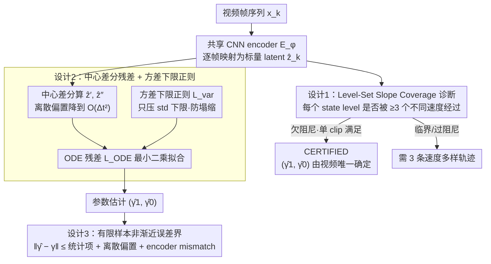

# Physics from Video: Identifiability of Time-Invariant Second-Order ODEs under Minimal Trajectory Conditions

**会议**: ICML 2026  
**arXiv**: [2606.00115](https://arxiv.org/abs/2606.00115)  
**代码**: https://github.com/wenjiewang3/PhysicsFromVideo (有)  
**领域**: 视频中的物理参数识别 / 因果表示学习 / 科学机器学习  
**关键词**: 结构可识别性、二阶 ODE、Decoder-Free、Level-Set Slope Coverage、方差下限正则

## 一句话总结
本文给出了"只用 encoder（无 decoder/无像素重建）从原始视频识别二阶线性 ODE 参数 $(\gamma_1,\gamma_0)$"的首个结构可识别性定理：用一个几何条件 **level-set slope coverage** 刻画"单条轨迹够 vs. 必须三条轨迹"的临界，证明欠阻尼可单视频识别、其它阻尼区必须三条不同轨迹，并配套提出"方差下限正则 + 中心差分"的有限样本估计器。

## 研究背景与动机
**领域现状**：当前 video world model（Sora 系/物理 IQ benchmark）追求像素级真实，但 Physics-IQ 等评测证明它们能造出"看起来对"但"物理上错"的视频——这暴露了视觉真实与物理正确的解耦。把摄像头当成廉价的非接触式物理传感器、从视频反演物理参数（弹簧常数、阻尼比、单摆长度），成为一条互补路线。

**现有痛点**：主流方法分两类——(1) autoencoder + 可微仿真，靠像素重建 loss 学动力学；(2) 完全 decoder-free，把物理约束加在 latent 空间（如 LPFV, Garcia 2025）。第一类问题在于：足够强的 decoder 能用错误的物理参数 + 补偿性外观纹理拟合出低像素 loss，**参数不唯一**。第二类去掉了 decoder，但留下更深的洞——latent 坐标系只定义到一个**任意 $C^2$ 重参化** $f$ 为止，即使 ODE residual 降到 0，恢复的 $(\hat\gamma_1,\hat\gamma_0)$ 也未必等于真值。

**核心矛盾**：encoder-only 设置缺一个理论保证——什么条件下数据本身能把 latent 坐标系"钉死"为真物理状态的仿射函数？没有这个，所有 decoder-free 方法都缺识别性根基。

**本文目标**：对最干净的非平凡模型——齐次二阶线性时不变 ODE $z''(t)+\gamma_1 z'(t)+\gamma_0 z(t)=0$——回答三件事：(i) 何时单段视频足以唯一恢复 $(\gamma_1,\gamma_0)$；(ii) 何时必须多条轨迹；(iii) 在离散有噪声场景下估计误差的非渐近上界。

**切入角度**：作者观察到，结构可识别性最终归结为 latent 重参化 $f$ 是否被迫成为仿射函数。要让 $f$ 必须仿射，就要求轨迹本身**反复经过同一物理状态值但带不同瞬时速度**——这是一个纯几何/动力学条件，可以从原始轨迹上验证。

**核心 idea**：把"latent 是否被钉死"翻译成"轨迹是否满足 level-set slope coverage"——若每个 state level $u$ 都被至少 3 个不同瞬时速度 $z'$ 经过，则任何同时满足两套二阶 ODE 的 $C^2$ 重参化 $f$ 必为仿射，因此 $(\hat\gamma_1,\hat\gamma_0)$ 必等于 $(\gamma_1,\gamma_0)$。

## 方法详解

### 整体框架
整套 pipeline 完全 encoder-only，要回答的核心问题不是"怎么把视频拟合好"，而是"什么条件下数据能把 latent 坐标系钉死为真物理状态的仿射函数、从而保证恢复的 $(\hat\gamma_1,\hat\gamma_0)$ 唯一"。运行时每帧 $\boldsymbol{x}_k$ 过共享 CNN encoder $E_\phi$ 得到标量 latent $\hat{z}_k$，用中心差分算出 $\hat{z}'_k, \hat{z}''_k$，代入 ODE 残差 $r_k = \hat{z}''_k + \gamma_1 \hat{z}'_k + \gamma_0 \hat{z}_k$ 做最小二乘拟合 $(\hat\gamma_1,\hat\gamma_0)$，再叠一个方差下限正则防止 latent 塌缩；与训练并行的一个"UNIQUENESS CHECK"诊断盒子在线判定当前 clip 是否满足 level-set slope coverage，给出 CERTIFIED 标签。理论侧（coverage 几何条件）与估计侧（离散差分 + 方差正则 + 误差界）是同一套思路的两面。

### 关键设计

**1. Level-Set Slope Coverage：把"latent 唯一性"翻译成轨迹上的几何条件**

decoder-free 方法最深的洞是 latent 坐标系只定义到一个任意 $C^2$ 重参化 $f$ 为止——即使 ODE residual 降到 0，恢复的参数也未必是真值。本文的破局点是把"$f$ 是否被迫成为仿射"这件抽象事翻译成一个能在原始轨迹上画出来验证的几何条件：称轨迹在开区间 $U \subset \mathcal{R}_z$ 上满足 coverage，当且仅当每个 state level $u \in U$ 都被至少三个时刻 $t_1,t_2,t_3$ 经过，且对应的瞬时速度 $z'(t_1), z'(t_2), z'(t_3)$ 两两不同。定理 4.2 证明：在 state consistency 假设 $\hat{z}(t)=f(z(t))$ 下，若同一个 $f$ 让 $z$ 与 $\hat{z}$ 都满足二阶 ODE，则 coverage 强制 $f$ 在 $U$ 上仿射，于是 $(\eta_1,\eta_0)=(\gamma_1,\gamma_0)$。直觉上，二阶 ODE 在 $(z,z')$ 平面上是 2 维子流形，要反推出仿射映射必须有第三个独立维度，而速度多样性恰好提供它——这也是"为什么需要 3 个速度"的物理来源。

围绕这个条件，作者刻画了不同阻尼区的最小数据需求：定理 4.3 证明欠阻尼下只要窗口长度 $L \geq 2P=4\pi/\sqrt{\gamma_0-\gamma_1^2/4}$，单条轨迹自动 coverage-positive；定理 4.5 证明临界/过阻尼/无阻尼区单条轨迹必失败（前两者每个 level 最多 2 个交点、后者只有 $\pm$ 两种速度）；定理 4.6 则证明此时三条带不同速度的轨迹就足够。整套结果第一次给 encoder-only physics-from-video 提供了"单视频够 vs. 必须三条"的临界刻画，且完全不依赖网络结构。

**2. 中心差分残差 + 方差下限正则：把连续理论落到离散噪声视频上**

光有 $\mathcal{L}_{\mathrm{ODE}}$ 会被 $\hat{z}_k \equiv 0$ 的退化最优解吃掉，且连续时间残差要离散化才能在视频帧上算。本文一是用中心差分 $\hat{z}'_k = (\hat{z}_{k+1}-\hat{z}_{k-1})/(2\Delta t)$、$\hat{z}''_k = (\hat{z}_{k+1}-2\hat{z}_k+\hat{z}_{k-1})/\Delta t^2$ 取代 LPFV 的 Euler/单边差分，把残差的离散偏置从 $O(\Delta t)$ 降到 $O(\Delta t^2)$；二是设计方差下限正则 $\mathcal{L}_{\mathrm{var}}=(\max\{0, \tau-\sqrt{\widehat{\mathrm{Var}}(\hat{z})+\varepsilon}\})^2$，只在 latent std 跌破阈值 $\tau$ 时才罚，不强制分布形状、只压住 scale 下限。

之所以不用 LPFV 的 KL-to-$\mathcal{N}(0,1)$，是因为非振荡区（临界/过阻尼）的轨迹强烈非高斯、非平稳，强行匹配标准正态会扭曲表示——实验里 KL 在这些区把 $\hat\gamma_0$ 估到 6–9，方差下限却仍准。更深的理由是方差下限正好对应有限样本误差界里"设计矩阵最小特征值 $\psi_{\min}>0$"这个关键条件：引理 D.1 证明压住 std 下限就直接给出可检查的 $\psi_{\min}$ 下界，于是"防塌缩"和"统计有效性"被同一个标量约束统一起来。

**3. 有限样本非渐近误差界：把误差拆成可调的几项**

为了让结论在离散采样、有噪声、encoder 非严格仿射的现实场景下可用，定理 4.8 在 $1-\delta$ 置信下给出 $\|\hat\eta-\gamma\|_2 \leq \frac{C_1\sigma}{\psi_{\min}}\sqrt{\log(3/\delta)/(T-1)} + \frac{C_2\sigma^2}{\psi_{\min}} + \frac{C_3\Delta t^2}{\psi_{\min}} + E_{\mathrm{enc}}$。四项分别对应 sub-Gaussian 噪声的统计误差 $O(\sqrt{\log/T})$、噪声二阶项、中心差分离散偏置 $O(\Delta t^2)$、以及 encoder 偏离仿射的确定性 mismatch $E_{\mathrm{enc}}$，让用户能直接读出"想把误差压到多少需要多长视频、多小 $\Delta t$、多准的 encoder"。多 clip 池化版本（附录 B.2）把 $T-1$ 替换为 $N=\sum_m (T^{(m)}-1)$，并通过 cross-trajectory 速度多样性同时改善 $\psi_{\min}$，给"三条短 clip 比一条长 clip 更稳"一个定量解释。

### 损失函数 / 训练策略
总目标 $\mathcal{L}_{\mathrm{total}} = \mathcal{L}_{\mathrm{ODE}} + \lambda_{\mathrm{var}} \mathcal{L}_{\mathrm{var}}$，默认 $\lambda_{\mathrm{var}}=1.0$、$\tau=1$、$(\gamma_1,\gamma_0)$ 从 $(1,1)$ 初始化。Encoder 是共享 per-frame CNN，5 个随机种子取均值±std。多 clip 版本对每个 clip 单独算方差正则并平均。

## 实验关键数据

### 主实验
合成场景在 4 个阻尼区（欠阻尼/无阻尼/临界/过阻尼）的单摆视频上验证识别性理论：

| 系统 / 阻尼区 | 真值 $(\gamma_0, \gamma_1)$ | 估计 $\hat\gamma_0$ | 估计 $\hat\gamma_1$ | Coverage |
|---|---|---|---|---|
| 单摆 欠阻尼 | (4.0016, 0.08) | 4.0037±0.0003 | 0.0800±0.0003 | 单 clip 自动满足 (L≥2P) |
| 单摆 无阻尼 | (4, 0) | 4.0032±0.0010 | 0.0002±0.0004 | 单 clip 离散下可识别 |
| 单摆 临界（3 条 coverage+） | (4, 4) | 4.0218±0.0040 | 4.0352±0.0017 | 3 条速度多样化轨迹 |
| 单摆 过阻尼（3 条 coverage+） | (4, 5) | 3.9733±0.0033 | 4.9723±0.0010 | 3 条速度多样化轨迹 |
| 单摆 临界（3 条 coverage–） | (4, 4) | 2.3462±0.0437 | 2.7642±0.0787 | 失败，验证 Thm 4.6 必要性 |
| 强度系统 欠阻尼 | (4.0016, 0.08) | 4.007±0.007 | 0.088±0.004 | 非运动场景同样成立 |
| 真实视频单摆 $L^\star=0.9$m | 0.90m | — | RMSE: 本文 ≪ PAIG (0.116) | 真实视频成功恢复绳长 |

### 消融实验

| 正则方式 / 阻尼区 | $\hat\gamma_0$ (真值 4) | $\hat\gamma_1$ (真值随区变化) | 结论 |
|---|---|---|---|
| 无正则 / 欠阻尼 | -0.0004±0.0009 | 0.0425±0.1194 | 塌缩到 $\hat{z}\equiv 0$ |
| KL-$\mathcal{N}(0,1)$ / 欠阻尼 | 4.0037±0.0009 | 0.0798±0.0003 | 振荡区 OK |
| **方差下限 / 欠阻尼** | **4.0037±0.0003** | **0.0800±0.0003** | 与 KL 持平 |
| KL-$\mathcal{N}(0,1)$ / 临界 | 9.2659±1.0532 | 6.2857±0.4848 | **完全失败** |
| **方差下限 / 临界** | **4.0218±0.0040** | **4.0352±0.0017** | 唯一能在非振荡区成功 |
| KL-$\mathcal{N}(0,1)$ / 过阻尼 | 6.8248±0.1909 | 7.3831±0.0906 | 失败 |
| **方差下限 / 过阻尼** | **3.9733±0.0033** | **4.9723±0.0010** | 仍然准确 |

### 关键发现
- **理论与实证完美对齐**：欠阻尼下首个 coverage-positive 窗口出现在 $1.1\pi$（小于充分条件 $2P=2\pi$），与参数恢复变准的拐点完全重合，验证了"coverage 是真因"。
- **离散估计器比连续理论更宽松**：无阻尼连续时间结构上不可识别（Thm 4.5），但离散采样下中心差分回归有唯一零损失目标 $(0, \gamma_0 + O(\Delta t^2))$（Prop C.1），所以长 clip 在采样意义下仍能近似恢复——这是有限样本下的"善意意外"。
- **方差下限正则是非振荡区的唯一选项**：KL 正则在临界/过阻尼下把 $\hat\gamma_0$ 估到 6-9，因为非振荡轨迹本质非高斯，强制匹配 $\mathcal{N}(0,1)$ 反而扭曲设计矩阵；方差下限只管 scale，恰好对应误差界里的 $\psi_{\min}$ 条件。
- **非运动场景同样成立**：用 state 控制灰度强度或圆半径的合成视频，欠阻尼下也能准到 4.007±0.007，说明识别性来自轨迹几何而非运动 cue，理论具普适性。
- **真实视频单摆**：在 0.45/0.90/1.50m 三个绳长上的真实手机拍摄视频，本文方法 RMSE 远低于 PAIG（PAIG 在所有长度都估到 1.01m，严重偏置）。

## 亮点与洞察
- **把识别性变成几何条件**：Level-set slope coverage 是个能在原始轨迹上**画出来**验证的几何条件（论文 Fig. 3 用 phase portrait 上的标记点直接可视化），不依赖网络结构、不需要算梯度，可作为部署时的在线诊断盒子——把"是否能信"和"是否拟合得好"解耦。
- **"为什么需要 3 个速度"的物理直觉**：二阶 ODE 在 $(z, z')$ 平面上是 2 维子流形，要从 latent 反推出仿射映射必须有第三个独立维度，速度多样性恰好提供它。这个洞察可以迁移到任何高阶 ODE——$n$ 阶 ODE 大概率需要 $n+1$ 个独立速度/加速度才能钉死 latent。
- **方差下限正则是个被严重低估的 trick**：相比 KL 它只约束 1 个标量（std），但对应了设计矩阵的最小特征值——这是个把"防塌缩"和"统计有效性"统一起来的精准设计，值得在所有 self-supervised representation 里试。
- **充分条件 vs 必要条件的优雅处理**：作者特意指出 $L\geq 2P$ 只是充分条件，实证里 $1.1\pi < 2\pi$ 就已经 coverage-positive，让读者理解理论保证和实际经验之间的 gap 来自哪里——这种诚实的写作很少见。

## 局限与展望
- **只覆盖齐次二阶线性 ODE**：附录 E 把非齐次常数项 $g$ 扩展进去说明不影响识别性，但对非线性 ODE、高阶 ODE、PDE 没有理论。把 level-set slope coverage 推广到向量值状态 + 高阶系统是显然的下一步。
- **state consistency 假设较强**：要求存在一个 $C^2$ 函数 $f$ 让 $\hat{z}(t)=f(z(t))$ 严格成立，这本质上排除了 lighting/background 强时变的真实视频。附录 F.4 的压力测试显示中等扰动下还行，但强扰动会破识别——意味着实际拍摄时要严格控制场景。
- **encoder 是 per-frame**：完全不利用帧间时间结构（如光流、3D-conv），对噪声敏感。把 temporal encoder + identifiability 同时保住是值得的开放问题。
- **依赖 coverage 诊断的可计算性**：连续时间 coverage 在合成实验里能精确算（因为知道真 trajectory），但真实视频里"true $z(t)$ 是什么"本身就是要估的——文中诊断盒子的实际可用性需要更多说明。

## 相关工作与启发
- **vs LPFV (Garcia et al. 2025)**：架构上几乎一致（都是 encoder-only），但 LPFV 没有任何识别性理论；本文给出 LPFV 工作的理论根基，同时把 Euler 差分换成中心差分（误差 $O(\Delta t) \to O(\Delta t^2)$）、把 KL 换成方差下限（非振荡区能用了）。
- **vs reconstruction-driven（PAIG 等）**：他们的识别性靠 decoder/renderer 的归纳偏置间接提供，理论上参数可被外观 nuisance 补偿；本文的可识别性来自纯几何条件，与外观完全解耦——真实视频实验里 PAIG 在所有绳长都估到同一个值就是这种"shortcut"的证据。
- **vs 经典系统辨识（Stanhope 2014, Qiu 2022, Wang 2023-24）**：他们假设直接观测到状态 $z$ 或固定观测模型，本文要从像素出发先推 latent 再识别——latent reparameterization ambiguity 是物理 from video 独有的难点，coverage 条件是对这类难点的首个干净答案。
- **启发**：把"识别性"从"模型属性"剥离成"数据轨迹的几何属性"这种思路，可以迁移到所有 self-supervised 因果表示学习——你不用证明 encoder 网络有什么性质，只要数据轨迹满足某个 coverage 条件就能保证下游参数可识别。

## 评分
- 新颖性: ⭐⭐⭐⭐⭐ encoder-only video → 物理参数识别的**首个**结构可识别性定理，coverage 几何条件是非平凡的原创工具。
- 实验充分度: ⭐⭐⭐⭐ 4 阻尼区 × 单摆/强度/scale 三种场景 + 真实视频 + 三种正则对比，理论实证一一对应；但只有单摆一种真实数据。
- 写作质量: ⭐⭐⭐⭐⭐ 结构极清晰，理论-离散-有限样本三层桥接讲透；Fig. 3 把 coverage 可视化得让人秒懂。
- 价值: ⭐⭐⭐⭐⭐ 给整个 decoder-free physics-from-video 研究线提供了缺失的理论根基，方差下限正则是可直接复用的 SSL trick。

<!-- RELATED:START -->

## 相关论文

- [\[AAAI 2026\] PragWorld: A Benchmark Evaluating LLMs' Local World Model under Minimal Linguistic Alterations and Conversational Dynamics](../../AAAI2026/interpretability/pragworld_a_benchmark_evaluating_llms_local_world_model_under_minimal_linguistic.md)
- [\[ICML 2026\] Why Linear Interpretability Works: Invariant Subspaces as a Result of Architectural Constraints](why_linear_interpretability_works_invariant_subspaces_as_a_result_of_architectur.md)
- [\[ICML 2026\] Position: Zeroth-Order Optimization in Deep Learning Is Underexplored, Not Underpowered](position_zeroth-order_optimization_in_deep_learning_is_underexplored_not_underpo.md)
- [\[ICML 2026\] Optimal Attention Temperature Improves the Robustness of In-Context Learning under Distribution Shift in High Dimensions](optimal_attention_temperature_improves_the_robustness_of_in-context_learning_und.md)
- [\[ICML 2026\] CorrSteer: Generation-Time LLM Steering via Correlated Sparse Autoencoder Features](corrsteer_generation-time_llm_steering_via_correlated_sparse_autoencoder_feature.md)

<!-- RELATED:END -->
