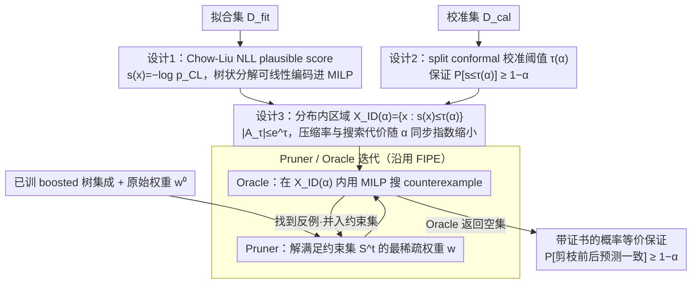

# PINE: Pruning Boosted Tree Ensembles with Conformal In-Distribution Prediction Equivalence

**会议**: ICML 2026  
**arXiv**: [2605.28068](https://arxiv.org/abs/2605.28068)  
**代码**: 待确认  
**领域**: 模型压缩 / 树集成剪枝 / Conformal Prediction  
**关键词**: 树集成剪枝, 忠实剪枝, 共形预测, 分布内等价, Chow-Liu 树

## 一句话总结
PINE 把"忠实剪枝"对 boosted 树集成的等价约束从全输入空间收缩到一个由 Chow-Liu 树似然 + 分裂共形校准定义的"分布内区域" $\mathcal{X}_{\text{ID}}(\alpha)$，用单一参数 $\alpha$ 平滑控制压缩-保真折中，在 12 个公开 tabular 数据集上把压缩率相对 FIPE 最高提升 30%，同时把"剪枝前后预测一致"的概率以 $\geq 1-\alpha$ 的形式给出可证明保证。

## 研究背景与动机
**领域现状**：在 tabular 数据上，XGBoost 这类 boosted 决策树集成仍是 SOTA，但树多了之后推理慢、验证（鲁棒性/公平性）也变难，所以训完之后做 ensemble pruning 是常见操作。已有两条路线：(a) accuracy-oriented 剪枝（IC/DREP/MDEP/ForestPrune 等），只在精度上不掉太多即可，预测可以随便变；(b) faithful pruning（Born-Again Trees, FIPE）则要求剪枝前后对任意输入预测完全一致。

**现有痛点**：accuracy-oriented 剪枝虽然能压得狠，但很多预测会变 —— 在医疗、金融这类高风险场景里，一旦下游有"按模型输出触发的工作流"或"绕着模型搭的鲁棒性/公平性检查"，预测一变下游全得重做。FIPE 这种忠实剪枝把"预测不变"做成硬约束，可惜的是它要求在整个输入空间 $\mathcal{X}$ 上都成立 —— 包括那些现实里几乎不会出现的 OOD 角落（比如 Adult 里"学前教育 + 13.5 年学龄"或者 COMPAS 里"prior offenses=0 且 prior offenses>3"这种逻辑上不可能的点）。为这些"鬼点"保留细粒度边界，FIPE 在 30 棵树的玩具例子里也只能剪到 11 棵。

**核心矛盾**：fidelity 和 compression 之间存在结构性 trade-off。要 100% fidelity，就得照顾所有 OOD 点，压缩上不去；放弃 fidelity 又会破坏决策一致性。

**本文目标**：找到一种机制，能在"真正会出现的输入"上保证预测等价，对 OOD 区域不做承诺，并且这个"真正会出现的区域"的大小可以用一个旋钮平滑调。

**切入角度**：作者观察到，OOD 区域对决策意义不大，但却吃掉了大量等价约束 —— 如果只在一个**分布内区域** $\mathcal{X}_{\text{ID}}$ 上要求等价，剪枝的可行域立刻变大；同时只要 $\mathcal{X}_{\text{ID}}$ 的覆盖率被 conformal prediction 校准过，就能把"未来输入落在 $\mathcal{X}_{\text{ID}}$"的概率压在 $\geq 1-\alpha$，从而把"剪枝前后预测一致"翻译成 $\geq 1-\alpha$ 的概率保证。

**核心 idea**：用 Chow-Liu 树的负对数似然当 "plausible score" $s(\bm{x})$，用 split conformal 校准阈值 $\tau(\alpha)$ 得到 $\mathcal{X}_{\text{ID}}(\alpha)=\{\bm{x}:s(\bm{x})\leq\tau(\alpha)\}$，然后把 FIPE 的 Oracle 搜索 counterexample 的范围从 $\mathcal{X}$ 缩到 $\mathcal{X}_{\text{ID}}(\alpha)$；Chow-Liu 的树状分解恰好能干净地编进 MILP。

## 方法详解

### 整体框架
PINE 要解决的是"忠实剪枝压不动"这个老问题：给定已训好的 boosted 树集成 $\mathcal{T}=\{T_m\}_{m=1}^M$ 和原始权重 $\bm{w}^{(0)}$，它要找一组尽量稀疏的新权重 $\bm{w}$（为 0 的树直接丢掉），但和 FIPE 要求"全空间预测不变"不同，PINE 只要求剪枝前后在一个分布内区域 $\mathcal{X}_{\text{ID}}(\alpha)$ 上保持 $\hat{y}(\bm{x};\bm{w})=\hat{y}(\bm{x};\bm{w}^{(0)})$。换句话说，它把"对所有 $\bm{x}\in\mathcal{X}$ 等价"这个硬约束，靠一个用户可调的 miscoverage 水平 $\alpha$ 收缩成"对几乎所有真实会出现的输入等价"。

实现上整套流程沿用 FIPE 的 Pruner + Oracle 迭代：先在拟合集 $\mathcal{D}_{\text{fit}}$ 上拟合 Chow-Liu 分数 $s_{\text{CL}}(\cdot)$、在校准集 $\mathcal{D}_{\text{cal}}$ 上算阈值 $\tau(\alpha)$，然后把 $\mathcal{D}_{\text{fit}}$ 当初始等价约束集 $\mathcal{S}^{(0)}$；之后反复让 Pruner 解出满足当前 $\mathcal{S}^{(t)}$ 的最稀疏权重、让 Oracle 在 $\mathcal{X}_{\text{ID}}(\alpha)$ 内用 MILP 搜新的 counterexample 并入约束集，直到 Oracle 返回空集，就在 $\mathcal{X}_{\text{ID}}(\alpha)$ 上拿到带证书的等价保证。相对 FIPE，真正改动只是 Oracle 的搜索域多了一条线性约束 $s_{\text{CL}}(\bm{x})\leq\tau(\alpha)$——但正是这条约束要能干净编入 MILP，才逼出了 Chow-Liu 这个看似绕的选型。

### 关键设计

**1. Chow-Liu NLL：一个能塞进 MILP 的"分布内"分数**

忠实剪枝的瓶颈在 Oracle：它要在某个区域里穷搜剪枝前后会改预测的反例，所以"这个区域是否分布内"的判据必须本身就是 MILP-friendly 的线性约束，否则整个搜索无解。PINE 的做法是把每个连续特征离散成 $B$ 个 bin 得到 $\tilde{\bm{x}}\in\{1,\dots,B\}^p$，在特征图上做最大互信息生成树拟合联合分布 $p_{\text{CL}}(\tilde{\bm{x}})=p(\tilde{x}_r)\prod_{j\neq r}p(\tilde{x}_j\mid\tilde{x}_{\text{pa}(j)})$，再取负对数得到 plausible score $s(\bm{x})=-\log p_{\text{CL}}(\tilde{\bm{x}})$。这个分数恰好分解成"根节点 marginal + 树边上的 conditional"，每一项只依赖单个 bin 或一对父子 bin，于是能用 $q_{i,b}\in\{0,1\}$ 标记"特征 $i$ 落在 bin $b$"、$u_{i,j,b,b'}\in\{0,1\}$ 标记父子 bin 组合，并以 $u_{i,j,b,b'}\leq q_{i,b}$、$u_{i,j,b,b'}\leq q_{j,b'}$、$u_{i,j,b,b'}\geq q_{i,b}+q_{j,b'}-1$ 这三条线性约束编码逻辑 AND，把 $s_{\text{CL}}$ 写成 $q,u$ 的线性求和，约束规模只有 $\mathcal{O}(pB^2)$，远小于离散输入空间本身的 $\mathcal{O}(B^p)$。一个容易踩的工程细节是：离散 bin 边界必须 round 到该特征在原集成 $\mathcal{T}$ 里实际出现的所有分裂阈值 $\Theta_j$ 上，否则 MILP 可行域和 $\{s\leq\tau\}$ 在几何上会错位、漏掉 counterexample。相比 isolation forest、KDE 这些常见 OOD 分数，Chow-Liu 同时具备"对联合分布有像样的捕捉力"和"可加、可线性化"两点，正好卡在忠实剪枝框架能用的位置上。

**2. Split conformal 校准 $\tau(\alpha)$：把硬约束翻成 $\geq 1-\alpha$ 的概率保证**

有了分数还差一个阈值，而 PINE 想要的是一个有 finite-sample、distribution-free 保证的旋钮，而不是凭经验拍。它在校准集 $\mathcal{D}_{\text{cal}}$ 上对 $\{s(\bm{x}_i)\}$ 取顺序统计量 $s_{(1)}\leq\cdots\leq s_{(n)}$，令 $\tau(\alpha)=s_{(k)}$、$k=\lceil(n+1)(1-\alpha)\rceil$，于是在 exchangeability 假设下直接有 $\mathbb{P}[s(\bm{X}_{\text{new}})\leq\tau(\alpha)]\geq 1-\alpha$。把这条覆盖率保证和"Oracle 已证明 $\mathcal{X}_{\text{ID}}(\alpha)$ 内无 counterexample"拼起来，就得到 Proposition 4.2 的概率等价保证 $\mathbb{P}[\hat{y}(\bm{X}_{\text{new}};\bm{w})=\hat{y}(\bm{X}_{\text{new}};\bm{w}^{(0)})]\geq 1-\alpha$。要强调两点：这是 marginal 概率（对 $\mathcal{D}_{\text{cal}}$ 和 $\bm{X}_{\text{new}}$ 联合取期望），而且每次 MILP 必须跑到可证最优/不可行才算证书——"在 time limit 内没搜到反例"是不能算数的。这一步的意义在于，现有忠实剪枝要么 100% fidelity 要么直接放弃，没有中间档；conformal 给了一个不依赖分布形状、又能给严格上下界的方式来定义"几乎所有未来输入"，把 fidelity-compression 折中变成一条用户可调的连续轴。

**3. $\mathcal{X}\to\mathcal{X}_{\text{ID}}(\alpha)$：压缩率和搜索代价同时随 $\alpha$ 指数缩小**

PINE 的理论核心是说明"为什么稍微收缩保证区域，压缩率和 Oracle 开销能同时降这么多"，而不是简单的放水换压缩。原始 $\mathcal{X}$ 被集成切成至多 $\prod_j(|\Theta_j|+1)$ 个 cell，高维下是组合爆炸；加上 Chow-Liu 约束后，Oracle 实际只需在离散状态集 $A_\tau=\{\tilde{\bm{x}}:-\log p_{\text{CL}}(\tilde{\bm{x}})\leq\tau\}$ 上搜，而命题 4.3 给出一个干净的上界 $|A_\tau|\leq e^\tau$——证明只用一行：每个 $\tilde{\bm{x}}\in A_\tau$ 满足 $p_{\text{CL}}(\tilde{\bm{x}})\geq e^{-\tau}$，再由概率归一性 $1\geq|A_\tau|e^{-\tau}$ 即得。由于 $\tau(\alpha)$ 关于 $\alpha$ 单调非增，调大 $\alpha$ 会让搜索状态上界 $e^{\tau(\alpha)}$ 指数级变小，反例搜索更快；同时 $\mathcal{X}_{\text{ID}}(\alpha)\subseteq\mathcal{X}$ 意味着约束松了、剪枝可行域更大，解到最优时 $\|\bm{w}\|_0$ 一定不会比 FIPE 差。两件事接到同一个旋钮 $\tau(\alpha)$ 上，正是 PINE 工程上能 work 的根本原因——搜索难度本身也在随 $\alpha$ 指数收缩。

### 损失函数 / 训练策略
优化目标仍是 $\arg\min_{\bm{w}\geq 0}\|\bm{w}\|_0$，s.t. $\hat{y}(\bm{x};\bm{w})=\hat{y}(\bm{x};\bm{w}^{(0)}),\forall\bm{x}\in\mathcal{X}_{\text{ID}}(\alpha)$，靠上面的 Pruner（在 counterexample 集 $\mathcal{S}^{(t)}$ 上解最稀疏可行权重）和 Oracle（受 $s\leq\tau(\alpha)$ 限制、沿用 OCEAN 的 leaf 选择 MILP encoding 的反例搜索）迭代求解。主实验用 $\ell_0$ 目标，附录 B.2 给了 $\ell_1$ 近似以省时；求解器是 Gurobi v11.0.3。XGBoost 集成超参为 $D=2$、$M=30$，$\alpha$ 在 $\{0.05, 0.1, 0.2, 0.4, 0.6, 0.8\}$ 上扫，离散 bin 数 $B=4$。

## 实验关键数据

### 主实验
12 个 UCI/OpenML tabular 分类数据集，5 个随机种子，把 PINE-CL 与 FIPE（忠实基线）、IC/DREP/MDEP（accuracy-oriented 基线）对比。Pima-Diabetes 上的详细数字：

| 方法 | $\alpha$ | 剪枝率 (%) ↑ | Fidelity (%) ↑ | 时间 (s) ↓ | 迭代数 ↓ |
|------|----------|------------|----------------|-----------|---------|
| FIPE | – | 17.3 | 100.0 | 42.5 | 24.6 |
| PINE-CL | 0.05 | 22.7 | 100.0 | 48.1 | 19.2 |
| PINE-CL | 0.1 | 26.7 | 100.0 | 48.0 | 19.6 |
| PINE-CL | 0.2 | 30.0 | 100.0 | 47.0 | 19.6 |
| PINE-CL | 0.4 | 34.7 | 99.9 | 33.8 | 15.2 |
| PINE-CL | 0.6 | 45.3 | 98.6 | 19.4 | 11.0 |
| PINE-CL | 0.8 | 55.3 | 98.3 | 12.0 | 7.8 |

跨 12 个数据集的平均：$\alpha$ 从 0.05 升到 0.8，平均剪枝率从 44.6% 升到 67.8%，平均 fidelity 仅从 99.96% 跌到 99.15%；相比 FIPE 压缩率最高可提升 30%。

### 消融 / 敏感性

| 维度 | 配置 | 现象 | 说明 |
|------|------|------|------|
| 深度 $D$ ($M=30,\alpha=0.8$) | $D=2\to 5$ | 平均剪枝率 66.94% → 34.44%，运行时 3.82s → 932.75s，迭代 2.17 → 13.17 | 深树创造更多局部决策区域，更多树"部分有用"，更难整体移除 |
| 树数 $M$ ($D=3,\alpha=0.8$) | $M=10\to 50$ | 剪枝率维持 39.17% → 51.11%，fidelity ≈ 99% | $M$ 主要影响优化开销，对压缩率影响不大 |
| Bin 数 $B$ | 见附录 B.6 | 趋势稳健 | Chow-Liu 离散化粒度不是瓶颈 |
| 目标 $\ell_0$ vs $\ell_1$ | 附录 B.2 | $\ell_1$ 更快，结果近似 | 可用于大规模场景 |

### 关键发现
- **RQ1**：accuracy-oriented 方法（IC/DREP/MDEP）在 test accuracy 上能跟原模型差不多，但 fidelity 随剪枝率单调下掉，说明"accuracy 几乎不变"$\neq$"决策一致"。PINE 在高压缩率下还能保 fidelity 接近 1。
- **RQ2**：经验测试覆盖率 $\hat{\pi}_{\text{ID}}$ 紧贴目标 $1-\alpha$，说明 split conformal 校准在真实数据上 valid，$\alpha$ 确实能当作"分布内区域大小"的旋钮。
- **RQ3**：把评测限制到 PINE 的 $\mathcal{X}_{\text{ID}}(\alpha)$ 上算 conditional fidelity $\hat{\rho}_{\text{ID}}$，IC/DREP/MDEP 仍 $<1$ —— 即便只看分布内输入它们也会改预测；PINE 是真正在分布内做到了 $\hat{\rho}_{\text{ID}}=1$。
- **Case study**：被 PINE 故意忽略的反例往往是 Adult 里"学前学历+13.5 学龄"或 COMPAS 里"prior offenses=0 且 >3"这种逻辑上不可能的点 —— FIPE 必须为它们保留更多树，PINE 直接忽略以换取压缩。
- **实用 $\alpha$ 选择**：用额外 $\mathcal{D}_{\text{sel}}$ 做 post-hoc 选择，95% fidelity 目标下经验选择器达 70.8% 平均压缩 + 98.77% 测试 fidelity；Bonferroni-Clopper-Pearson 上界选择器更保守，57.2% 压缩 + 99.72% fidelity（注意这些是经验结果，不是额外的 conformal 证书）。

## 亮点与洞察
- **"忠实剪枝 + conformal"的拼装非常自然**：忠实剪枝原本是一个"全空间硬约束"的二元问题，conformal 又是一个"我能给覆盖率一个 distribution-free 概率"的工具，作者把后者塞进前者的 Oracle 搜索域里，立刻把硬约束变成"$1-\alpha$ 概率约束"。这种"用概率工具松弛符号约束"的范式可以推广到其他需要"全空间等价"的验证/抽取任务（如规则抽取、模型蒸馏审计）。
- **Plausible score 的选择不只是统计上的好坏，而是 MILP 编码的可行性**：作者明确说 PINE 兼容任何"tree-structured distribution constraint"。这是个隐藏可扩展点 —— 想把更强的密度模型（如 normalizing flow）塞进来就得先解决"如何线性编码"的问题，附录 C 还试了 2 个替代分数。
- **理论上界 $|A_\tau|\leq e^\tau$ 同时解释了压缩和效率**：一个看似松的 information-theoretic 上界把"分布内状态数"和搜索复杂度漂亮地联系起来，并且通过 $\alpha\uparrow\Rightarrow\tau\downarrow\Rightarrow|A_\tau|\downarrow$ 给出 monotone 的可控性。这种"用概率分布的归一性当 packing 上界"的小技巧值得记。
- **RQ3 把 OOD 概念反过来用来评测 baseline**：定义 $\hat{\rho}_{\text{ID}}$ 后，accuracy-oriented 方法被"分布内"显微镜照出来仍然改预测，是一个非常有说服力的实证论证，比单纯比 fidelity 数字更直击痛点。

## 局限与展望
- **依赖 MILP 解到最优**：所有概率等价保证都建立在"Oracle 跑到 certified optimality 或 infeasibility"上，一旦上时间限制就退化为经验保证，对大集成（$D=5$ 单数据集近千秒）不太友好。
- **Exchangeability 假设**：依赖 $\mathcal{D}_{\text{cal}}$ 与未来输入同分布，分布漂移场景需要走 conditional / weighted conformal 等扩展。
- **离散化粒度与 round-to-$\Theta_j$ 的工程开销**：当特征数和分裂阈值数都大的时候，bin 边界 rounding 的复杂度（见附录 C）会成为额外负担。
- **只覆盖 tree ensembles 上的"硬决策一致"**：对回归 / 概率校准 / soft logits 的等价没有处理；又因为只看分类决策不看概率，下游若依赖 confidence score 可能仍有 mismatch。
- **没有给出 task-aware 的 $\alpha$ 选择理论**：实际选 $\alpha$ 靠 held-out 经验或 LTT 风格的 confidence bound，缺一个更直接把"业务可接受 fidelity"翻译到 $\alpha$ 的桥梁。

## 相关工作与启发
- **vs FIPE (Emine et al., 2025)**：FIPE 在整个 $\mathcal{X}$ 上做 $\hat{y}$ 等价，PINE 用 conformal 把约束限制到 $\mathcal{X}_{\text{ID}}(\alpha)$，把"100% fidelity"换成"$\geq 1-\alpha$ probabilistic fidelity"，把"无旋钮"变成"单旋钮 $\alpha$"，最高换来 30% 压缩。框架（Pruner/Oracle 迭代）几乎没动，新东西只是 Oracle 上多一条 $s\leq\tau(\alpha)$ 的 MILP 约束。
- **vs Born-Again Tree Ensembles (Vidal & Schiffer, 2020)**：BATE 用 DP 把集成蒸成一棵等价的大树，模型类整个变了；PINE 保留 ensemble 结构、只剪权重，更适合需要保留 boosting 语义的下游验证。
- **vs ForestPrune (Liu & Mazumder, 2023) / LOP (Devos et al., 2025)**：这些方法直接删内部节点或子树以拿到更高压缩，但放弃 fidelity；PINE 用一个 well-defined 的 probabilistic fidelity 保证作差异点。
- **vs accuracy-oriented IC/DREP/MDEP**：这些是 PyPruning 里基于"贡献 + 多样性"挑子集的方法，没有任何等价保证；RQ3 显示它们在分布内仍改预测，直接被 PINE 在"分布内决策一致性"这一指标上压制。
- **可迁移启发**：忠实剪枝 = "符号验证 (MILP) + 全空间等价"的范式可以套到任何"原模型→压缩/抽取/蒸馏"任务上；只要找到一个"可线性编码 + 校准过覆盖率"的 plausible score，都可以把"全空间 = 太严"变成"分布内 = 概率保证"。比如对 NN 也可以构造"NN-MILP + conformal" 的等价剪枝 / 神经规则抽取范式。

## 评分
- 新颖性: ⭐⭐⭐⭐ "把 conformal 概率覆盖 + 忠实剪枝硬约束"组合非常自然，但每个组件都已成熟，主要是 framing 上的一手好牌。
- 实验充分度: ⭐⭐⭐⭐ 12 个数据集 × 5 seed × 6 个 $\alpha$ + 深度/树数/bin/目标/Random Forest 等敏感性 + 两种 $\alpha$ 选择器都覆盖了。
- 写作质量: ⭐⭐⭐⭐ 概念顺序清晰，从 motivation 到理论再到 case study 全链路自洽；公式和算法伪代码可读性高。
- 价值: ⭐⭐⭐⭐ 给高风险 tabular 决策场景的模型压缩提供了一个 "可控 fidelity 折中" 的 deployable 方案，且 MILP 编码、Chow-Liu 选型、conformal 校准的组合可被复用到其他 model auditing / extraction 场景。

<!-- RELATED:START -->

## 相关论文

- [\[ICML 2026\] From Rashomon Theory to PRAXIS: Efficient Decision Tree Rashomon Sets](from_rashomon_theory_to_praxis_efficient_decision_tree_rashomon_sets.md)
- [\[ICML 2026\] Bridging the Knowledge-Prediction Gap in LLMs on Multiple-Choice Questions](bridging_the_knowledge-prediction_gap_in_llms_on_multiple-choice_questions.md)
- [\[ICML 2025\] Leveraging Predictive Equivalence in Decision Trees](../../ICML2025/interpretability/leveraging_predictive_equivalence_in_decision_trees.md)
- [\[ICML 2026\] Optimal Attention Temperature Improves the Robustness of In-Context Learning under Distribution Shift in High Dimensions](optimal_attention_temperature_improves_the_robustness_of_in-context_learning_und.md)
- [\[CVPR 2025\] Learning on Model Weights using Tree Experts](../../CVPR2025/interpretability/learning_on_model_weights_using_tree_experts.md)

<!-- RELATED:END -->
