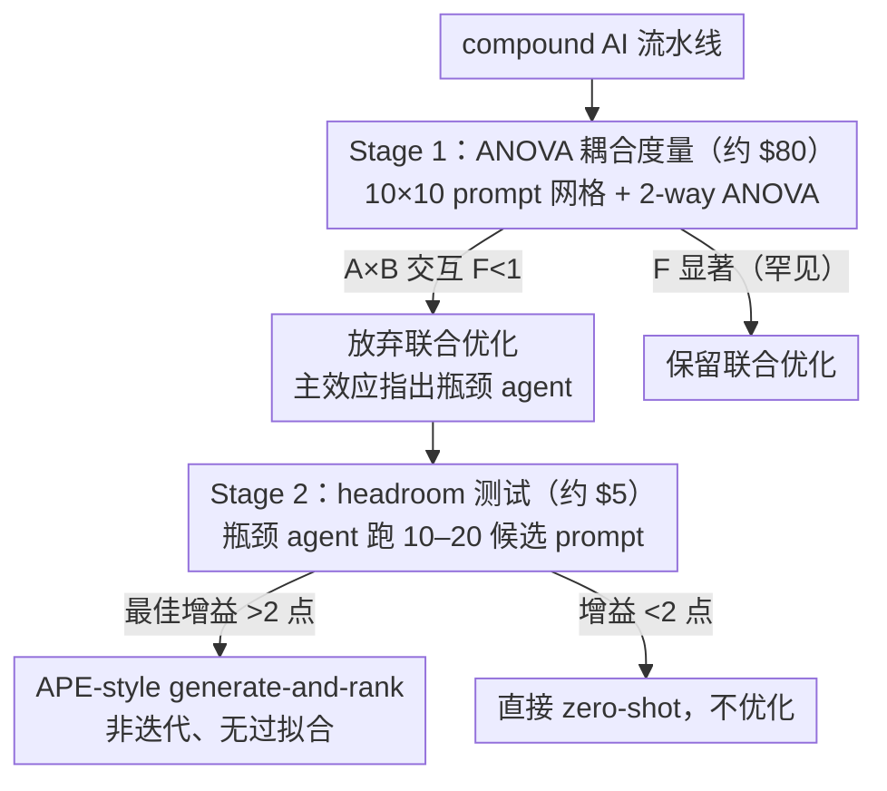

# Prompt Optimization Is a Coin Flip: Diagnosing When It Helps in Compound AI Systems

**会议**: ICML 2026  
**arXiv**: [2604.14585](https://arxiv.org/abs/2604.14585)  
**代码**: 无  
**领域**: 可解释性 / Prompt 优化 / Compound AI 系统  
**关键词**: prompt 优化、compound AI、ANOVA 方差分解、多 agent 耦合、headroom 测试

## 一句话总结
本文用 18,000 次网格评估和 144 次优化运行实证检验了 compound AI 系统中端到端 prompt 优化的两个隐含假设——agent 之间存在耦合、单 agent prompt 值得优化——发现两者在主流 mid-tier 模型上几乎都不成立（49% 的优化运行表现差于 zero-shot，A×B 交互项 $p>0.52$），并据此提出一个两阶段诊断框架（\$80 的 ANOVA 耦合预测 + \$5 的 10 分钟 headroom 测试），把"是否做 prompt 优化"从抛硬币变成可量化的决策。

## 研究背景与动机

**领域现状**：以 TextGrad、DSPy、GPTSwarm 为代表的"端到端联合 prompt 优化"方法已经成为 compound AI 系统（多 LLM 调用流水线）的事实标准工具链，几乎所有最新的 agentic 工作流优化工作都默认沿用这一范式。

**现有痛点**：这些方法都隐含两条从未被实证检验过的假设——(A) **耦合假设**：多个 agent 的 prompt 之间存在交互效应，最优 prompt 必须联合优化；(B) **可优化假设**：单个 agent 的 prompt 在现实训练预算下确实"值得优化"。如果 (A) 不成立，独立的 per-agent 优化就够了；如果 (B) 也不成立，连 per-agent 优化都是浪费。但社区现有的对比都是在不同任务、不同预算上做的"非受控比较"，从来没人在严格等算力预算下系统测过这两个假设是否成立。

**核心矛盾**：业界投入数千到上万美元跑 DSPy/TextGrad 的同时，却没人知道这些钱花得有没有道理——经验上看，这些工具在某些任务能涨点、在另一些任务直接掉点，结果像是抛硬币。如果耦合和优化空间本身就是 model-task 强相关的经验性质，那么"先验地相信联合优化有用"这件事本身就是错的。

**本文目标**：(1) 用受控实验直接测量 A、B 两个假设；(2) 解释为什么联合优化在大多数 mid-tier 设置下失效；(3) 给出一个工程上"花得起"的事前诊断协议，让从业者在投钱跑大规模优化前先判断该不该做。

**切入角度**：把 prompt 网格 $10\times10$ 当作 2-way ANOVA 的实验设计——question 当 block，Agent A 当一个因子，Agent B 当另一个因子，残差里看 A×B 交互项的 $F$ 值。这种统计学经典方差分解给出了**可证伪**的耦合度度量，比"看哪个 prompt 涨点最多"严格得多。

**核心 idea**：用 ANOVA 直接测耦合 + 用 10–20 候选 prompt 的"headroom 测试"测优化空间，把"是否做 prompt 优化"变成花 \$85、一两天就能完成的诊断流程，而不是直接 all-in 几千美元的 DSPy/TextGrad。

## 方法详解

### 整体框架

本文不提新的 prompt 优化算法，而是用统计学工具去检验业界默认的两条优化假设到底成不成立。它把"是否该做 prompt 优化"这个工程决策，转译成一套可证伪的**测量框架 + 决策协议**：先用两项严格等算力的受控研究分别测耦合（假设 A）和优化空间（假设 B），再把结论封装成事前诊断流程。

两项研究各管一头。**Study 1 检验 agent 耦合**：构造两 agent 串行流水线 $\text{Agent A} \to \text{Agent B}$，每个 agent 生成 $K=10$ 个候选系统 prompt，穷举 $10\times10=100$ 种组合，每种在 $n=30$ 道题上评估，得到三维分数张量 $Y_{ijk}$，然后用 2-way ANOVA + question blocking 把方差拆成 question 难度 / A 主效应 / B 主效应 / A×B 交互 / 残差五部分。三个任务 HotpotQA / MBPP / XSum 分别对应预期耦合度高/中/低，两个 executor 模型 Claude Haiku 4.5 与 Amazon Nova Lite，judge 用 Claude Sonnet 4.6。**Study 2 检验单 agent 优化是否值得**：在 Feedback-Bench / HelpSteer2 / WildBench / XSum 四个单 agent 任务上，把 6 种主流优化方法（APE、OPRO、EvoPrompt、PromptBreeder、DSPy-style bootstrap、作者自己的 PROSE）与 zero-shot 在严格等算力（约 100 个候选 prompt、训练集 20 题、测试集 100 题、3 次重复、2 个 executor 模型）下对比，总计 $6\times 4\times 3\times 2=144$ 次优化运行。这里全程不训练任何模型，只在固定 executor 上推理评测。

两项研究的结论最后凝成一棵两阶段的**事前诊断决策树**——先用 ANOVA 判耦合、再用 headroom 测试判优化空间，决定到底该不该投钱做 prompt 优化：

> 三条关键设计对应图上：ANOVA 耦合度量是 Stage 1（B），“can but doesn't”判据落地为 Stage 2 的 headroom 测试（D），两阶段诊断协议则是整棵决策树的封装。

### 关键设计

**1. 基于 ANOVA 的 agent 耦合度量：把"要不要联合优化"翻译成方差分解**

现有 compound AI 评测只报聚合分数，从不回答"为什么这条流水线 work"，更没法判断多 agent 的 prompt 是否真有交互。本文的切入点是把 $10\times10$ 的 prompt 网格当成 2-way ANOVA 的实验设计——question 当 block、Agent A 当一个因子、Agent B 当另一个因子，看残差里 A×B 交互项的方差占比和 $F$ 值。逻辑很干净：若 A×B 的方差和 $F$ 都低于残差水平，那"联合最优 prompt 对"与"独立最优 A × 独立最优 B"在统计意义上就不可区分，联合优化拿不到任何信息增益，per-agent 独立优化足矣。作者还在去掉行列主效应后的残差地形上算邻居自相关，结果 $\rho \in [-0.12,+0.05]$，说明残差面与白噪声不可区分，这直接打掉了 TextGrad 这类"文本梯度"方法所依赖的"存在平滑可传播信号"假设。这套度量的价值在于它**架构无关**，可以原封不动搬到任何多 agent 系统上重跑，是全文最具普适性的方法学贡献。

**2. "can but doesn't" 判据：用"会但默认不做的 gap"判断任务值不值得优化**

光说"49% 的优化运行失败"只是结果，不可操作；作者真正想要的是一个**事前**判别器，告诉从业者哪类任务才有可挖的洞。观察来自 4 个任务里唯一让 6 个方法全部显著涨点的 HelpSteer2：它要求结构化 rubric 评估 + JSON 输出，模型被提示时**能**产出这种格式（68.0 → 74.8），但 zero-shot 默认只写非结构化散文。优化的本质就是解锁这种"模型已经会做、但默认不做"的潜在能力，只有 prompt 空间里存在这种 gap，优化才有意义。反观 Feedback-Bench / WildBench / XSum 接受自由文本，模型默认行为已近最优，6 个方法的最佳增益只有 +1.1/+0.7/+0.6，全落在 20 题评测的噪声带里。这个定性判据被落地成 \$5、10 分钟的 headroom 测试：生成 10–20 个候选 prompt，看最佳候选相对 zero-shot 的增益是否 $>2$ 点，$<2$ 点就判定 landscape 平坦、所有方法都不会稳定有效（2 点阈值需按自己 setup 重标定，但"平坦 landscape = 没有可挖空间"是普适直觉）。

**3. 两阶段诊断协议 + instruction-tuning 机制解释：让"别优化"从观察升级成可外推的预测**

把两项研究的结论封装成一棵工程决策树：Stage 1 花 \$80 跑 ANOVA 网格，若交互项 $F<1$ 就放弃联合优化，主效应顺手指出瓶颈 agent；Stage 2 对瓶颈 agent 跑 \$5 的 headroom 测试，$>2$ 点增益就用 APE-style generate-and-rank（非迭代、无过拟合风险），否则直接 zero-shot。更关键的是作者给出了"为什么 agent 间不耦合"的机制性解释：instruction-tuning 和 RLHF 训练模型在多样化输入下产出一致输出，等于把"输入措辞"压成了"窄输出分布"，于是 Agent B 的输出方差被 Agent A 的语义内容（由题目决定）主导，而非被 Agent A 的措辞变化（即 prompt 改动）主导——耦合需要 agent 互相依赖对方的措辞，可 instruction-tuning 恰恰消除了这种措辞敏感性。这条解释让结论从"在我们 setup 上观察到"升级为"理论上应当如此"，同时明确划出耦合可能重新出现的边界（共享状态、Schema 依赖、反馈环、3+ agent 深流水线、结构化数据通信），告诉从业者这些场景要重新跑诊断。这种"结论 + 可证伪机制 + 失效边界"的封装，让框架在快速迭代的 frontier model 时代仍具长期可用性。

## 实验关键数据

### 主实验

Study 1 的 ANOVA 方差分解（单位：占总平方和的 %）：

| Model | Task | Question | Agent A | Agent B | A×B | Err |
|--------|--------|----------|---------|---------|------|------|
| Haiku | HotpotQA | 91.3 | 0.05\* | 0.37\*\*\* | 0.18 | 8.1 |
| Haiku | XSum | 80.3 | 0.09 | 0.09 | 0.49 | 19.0 |
| Haiku | MBPP | 19.3 | 0.60\*\* | 0.59\*\* | 2.15 | 77.4 |
| Nova | HotpotQA | 75.1 | 0.12 | 0.08 | 0.51 | 24.2 |
| Nova | XSum | 58.4 | 0.77\*\*\* | 0.22 | 0.87 | 39.7 |
| Nova | MBPP | 39.9 | 0.45\*\* | 0.16 | 1.50 | 58.0 |

A×B 交互项在 6 个条件下方差占比 0.18%–2.15%，$F<1.0$、$p>0.52$ 全军覆没，且联合最优 vs 独立最优的 gap 仅 0.0–3.3 点。

Study 2 在 Claude Haiku 4.5 上的 hold-out 测试分数（3 次重复均值，judge 0–100）：

| 方法 | FB | HS2 | WB | XSum |
|--------|------|------|------|------|
| Zero-Shot | 82.4 | 68.0 | 68.9 | 76.0 |
| APE | 82.3 | 69.3 | 68.0 | 76.6 |
| OPRO | 81.4 | 73.8 | 69.0 | 74.7 |
| EvoPrompt | 82.0 | **74.8** | 68.3 | 75.6 |
| PromptBreeder | **83.5** | 74.6 | 68.5 | 76.0 |
| DSPy-style | 81.9 | 69.8 | 65.1 | 76.2 |
| PROSE | 82.1 | 74.4 | **69.6** | 75.9 |

72 次运行里 49% 低于 zero-shot；binomial 检验 $p=0.91$，无法拒绝"增益对称分布在 0 附近"的零假设。Nova Lite 上 24 个 method×task 均值里 14 个低于 zero-shot，结论更糟。

### 消融与分析

| 切面 | 关键发现 | 说明 |
|------|---------|------|
| 任务类型 | HelpSteer2 best $\Delta=+6.8$ pts；FB/WB/XSum best $\Delta=+1.1/+0.7/+0.6$ | 仅 HelpSteer2 存在"can but doesn't"的结构化输出 gap，其余任务模型 zero-shot 已近最优 |
| Model 切换 | HelpSteer2 在 Haiku 上 6/6 方法 beat zero-shot，在 Nova Lite 上只剩 1/6 | "哪个任务可优化、哪个 agent 是瓶颈"完全由 executor 模型决定 |
| 迭代方法过拟合 | 迭代方法 train-test gap 高达 +5.6 pts；非迭代 APE 几乎为 0 | 20 题训练集下 per-candidate 评分噪声太大，迭代选择放大噪声 |
| 残差地形 | 邻居自相关 $\rho \in [-0.12,+0.05]$ | 去掉行列主效应后的残差面与白噪声不可区分，直接反驳"文本梯度"前提 |

### 关键发现
- **agent 不互动**：6 个 model×task 条件下 A×B 交互项全部不显著（$F<1$, $p>0.52$），instruction-tuning 把输入措辞压成窄输出分布，机制上"应当如此"，不是任务挑选偶然结果。
- **优化只在有"can but doesn't" gap 时有效**：4 个任务里只有 HelpSteer2 同时具备"模型会做的结构化输出"和"zero-shot 默认不输出"，6 个方法在它上面集体涨点；其余任务的优化等于抛硬币。
- **model 主导一切**：哪个 agent 是瓶颈、哪个任务可优化、哪个方法 work，全部随 executor 模型变化甚至反转——任何在某代模型上调优的 prompt 都有比模型版本更短的保质期。
- **迭代方法在小训练集下是反优化**：20 题不够区分候选的噪声差异，越迭代越过拟合，反而不如非迭代的 APE-style generate-and-rank。

## 亮点与洞察
- **把 prompt 优化翻译成方差分解问题**：用 ANOVA 直接给出"是否需要联合优化"的可证伪检验，是方法学层面的真正贡献——比拼"哪个优化器涨点多"的横向 benchmark 范式被换成了"耦合是否存在"的纵向因果检验，这套协议可以原封不动迁移到任何 multi-agent 架构。
- **"can but doesn't"作为优化空间的可操作判据**：把"为什么优化在某些任务 work"从玄学变成可观察特征——存在一种模型会做但默认不做的输出格式/结构。这个 frame 同样可以扩展到 RAG prompt、tool-use prompt、思维链触发等场景。
- **\$85 的事前诊断协议**：在动辄 \$1K–10K 的 DSPy/TextGrad 投入之前，先花 \$85 跑一遍诊断；如果 3/4 的任务都告诉你"别优化"，仅这一项就能省下成倍开销，是非常 actionable 的 engineering wisdom。
- **机制性解释链条**：从 instruction-tuning 压缩措辞分布 → 残差地形为白噪声 → 联合优化器拿不到可传播梯度 → 端到端工具的核心前提失效。这条链给"为什么 prompt 优化越来越像抛硬币"提供了能预测未来趋势的解释：随着 RL 把更多 scaffold 技巧（CoT、结构化输出、ReAct）内化进 base model，优化 headroom 还会持续缩小。

## 局限与展望
- 作者承认：只用 $K=10$ 的整 prompt 替换粒度，更细粒度的"单约束翻转、结构化组件替换"可能暴露被整 prompt 互换掩盖的耦合；两个 executor 都是 mid-tier，缺 frontier-tier 三角验证；Study 2 只用 20 训练题，理论上偏向非迭代方法。
- 我的观察：Study 2 的 4 个任务和 Study 1 的 3 个任务只在 XSum 有交集，"在两 agent 流水线上测优化是否值得"严格来说没被联合检验，端到端结论被拆成两次实验拼接，存在概念跳跃。
- 失效边界已经清楚列出：3+ agent 深流水线、shared scratchpad、反馈环、结构化数据通信（JSON schema、code）、agent 间共享 schema 依赖——这些场景里耦合可能重新出现，是后续直接复用 ANOVA 协议的天然测试床。
- 工程改进方向：把两阶段诊断打包成 DSPy/TextGrad 的"前置 lint"插件，强制在投入大规模优化前自动产出 ANOVA 报告和 headroom 分数；以及对 frontier 模型每次发布后跑同一套基准，追踪 optimization headroom 随模型代际衰减的曲线。

## 相关工作与启发
- **vs TextGrad / DSPy / GPTSwarm**：这些工作默认 agent 间存在可传播的文本梯度信号，是端到端联合优化的代表；本文是首次实证检验这一假设，并通过 ANOVA + 残差自相关在 mid-tier 模型上直接证伪，给联合优化工具划出明确的适用边界。
- **vs APE / OPRO / PromptBreeder / EvoPrompt / ProTeGi**：这些是单 prompt 优化方法，不涉及 agent 间依赖；本文不仅把它们在统一预算下对比，还指出在 20 题预算 + zero-shot 已近最优的任务上，迭代方法因过拟合反而不如非迭代的 APE-style generate-and-rank。
- **vs Helix / VMAO 等带 verification、共享 DAG 状态的新架构**：本文明确将这些架构列为"耦合可能重新出现"的候选场景，并预言 \$80 的 ANOVA 预测试可以直接复用上去，给社区指出了下一步要测量的方向。
- **vs Nie et al. (2026) 关于 agent 自动优化采用率仅 9% 的调查**：他们从社会学视角观察到 agent 框架很少真用自动优化器，本文从统计学视角给出原因——在多数 setup 下优化就是抛硬币，不用是理性选择。两者共同把"prompt 优化是否值得做"这个问题严肃化。

<!-- RELATED:START -->

## 相关论文

- [\[ICML 2026\] Diagnosing the Reliability of LLM-as-a-Judge via Item Response Theory](diagnosing_the_reliability_of_llm-as-a-judge_via_item_response_theory.md)
- [\[ICML 2026\] Adaptive Querying with AI Persona Priors](adaptive_querying_with_ai_persona_priors.md)
- [\[CVPR 2026\] Make it SING: Analyzing Semantic Invariants in Classifiers](../../CVPR2026/interpretability/make_it_sing_analyzing_semantic_invariants_in_classifiers.md)
- [\[ICML 2026\] OmniSapiens: A Foundation Model for Social Behavior Processing via Heterogeneity-Aware Relative Policy Optimization](omnisapiens_a_foundation_model_for_social_behavior_processing_via_heterogeneity-.md)
- [\[ICLR 2026\] Exploring Interpretability for Visual Prompt Tuning with Cross-layer Concepts](../../ICLR2026/interpretability/exploring_interpretability_for_visual_prompt_tuning_with_cross-layer_concepts.md)

<!-- RELATED:END -->
