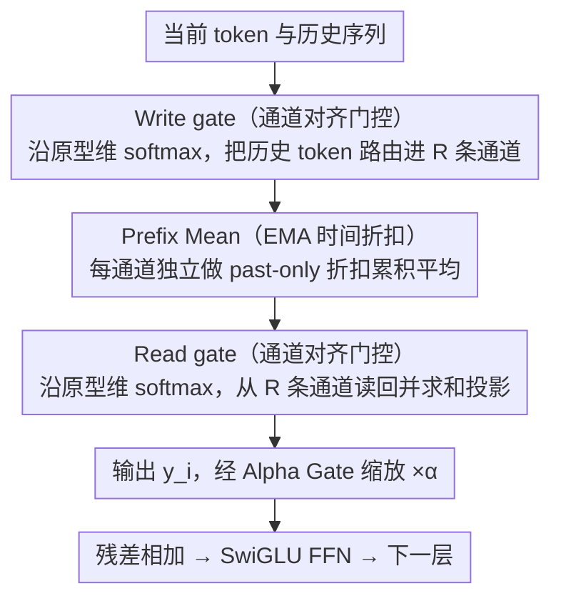

# Prototype Transformer: Towards Language Model Architectures Interpretable by Design

**会议**: ICML 2026  
**arXiv**: [2602.11852](https://arxiv.org/abs/2602.11852)  
**代码**: https://github.com/YDYordanov/prototype_transformer  
**领域**: 可解释性 / 语言模型架构  
**关键词**: 原型网络, 自回归LM, 线性注意力替代, 概念解耦, 行为编辑

## 一句话总结
ProtoT 把 Transformer 里 $O(N^2)$ 的自注意力替换成 $R$ 个可学习"原型向量"驱动的线性通信通道（write/read gate + 带时间折扣的 prefix mean），让每个原型在训练中自动绑定一个可命名的概念（如"woman""COVID""New Zealand"），从而支持对模型行为做"手术式"的概念级编辑，且文本生成 Elo 超过同规模 LLaMA。

## 研究背景与动机
**领域现状**：主流自回归 LM（GPT-4、LLaMA 系）依靠 $O(N^2)$ 自注意力建模长程依赖，能力很强但内部推理高度不透明。现有可解释性手段（attention 可视化、probing、causal intervention、SAE）几乎全是 *post-hoc*：在一个本来就没有为可解释性设计的架构上"事后挖矿"。

**现有痛点**：attention magnitude 不代表 causal importance（Jain & Wallace 2019），叠加 superposition 现象，单个 neuron/head 往往同时编码多个概念，SAE 等方法需要额外训练辅助模型才能近似解耦；而且要做"只改某个概念、其他能力保持"的精确干预非常困难，副作用通常会扩散到全局困惑度。

**核心矛盾**：高表达力的稠密 attention ↔ 概念解耦/可干预性。把所有信息揉进同一个 KV 空间，意味着任何 surgical edit 都会牵动整个空间。

**本文目标**：(1) 设计一个原生支持概念绑定的 mixer 模块；(2) 保留 LLaMA 级别的生成质量；(3) 把推理成本从 $O(N^2)$ 降到 $O(N)$。

**切入角度**：借鉴 vision 里 ProtoPNet/ProtoViT 的"原型 = 可解释决策单元"思想，把它从最终分类层下沉到 *每一层 mixer*，并改造成严格因果、past-only 的自回归形式。原型不再是分类原型，而是 *通信通道的过滤器*。

**核心 idea**：用 $R$ 个不互相交互的原型把序列拆成 $R$ 条并行通道，每条通道用 EMA 做时间折扣的 prefix mean，强迫原型在 channel-aligned softmax 的压力下走向语义专门化——一旦每个通道只编码一个概念，可解释性与 surgical editing 就成了架构的自然产物。

## 方法详解
ProtoT 的骨干与 LLaMA-3 完全一致（L 层 RMS-PreLN block，每个 block = mixer + SwiGLU FFN，skip-connection），唯一改动是把 self-attention mixer 换成 **Prototype Mixer**。其余配方（tokenizer、AdamW、cosine 退火、dropout=0.1、词嵌入与 LM head 共享权重）也照搬 LLaMA。

### 整体框架
单个 mixer 持有 $R$ 个可学习原型 $\mathbf{P}_1,\dots,\mathbf{P}_R \in \mathbb{R}^h$（实验取 $R=32$）。在位置 $i$，输入 $x_i$ 与历史 $x_{<i}$ 通过两步交互产生输出 $y_i$：

1. **Write gate**：把每个历史 token $x_j$ 按其与各原型的相似度 *沿原型维* 做 softmax 后写入对应通道；
2. **Prefix mean**：每个通道独立做 EMA 折扣的因果累积平均，得到通道 $k$ 的上下文聚合 $\mathrm{PM}_k$；
3. **Read gate**：当前 token $x_i$ 按其与各原型的相似度 *沿原型维* 做 softmax，从 $R$ 条通道读回信息并求和投影成 $y_i$。

整套公式（$U,V,W$ 为线性映射，$\tau_w,\tau_r$ 为可学温度）：

$y_i = U\!\left(\sum_{k=1}^R \mathrm{Softmax}_k\!\left(\tfrac{W(x_i)\cdot \mathbf{P}_k}{\tau_r}\right)\,\mathrm{PM}_k\right)$，
$\mathrm{PM}_k = \dfrac{\sum_{j<i}\beta_k^{i-j}\,\mathrm{Softmax}_k\!\left(\tfrac{x_j\cdot \mathbf{P}_k}{\tau_w}\right) V(x_j)}{\sum_{j<i}\beta_k^{i-j}\,\mathrm{Softmax}_k\!\left(\tfrac{x_j\cdot \mathbf{P}_k}{\tau_w}\right)}$

其中 $\beta_k=\sigma(\gamma_k)\in(0,1)$ 是可学的 EMA 衰减系数，给出每个原型的"时间偏好"，并可换算成半衰期 $t_{1/2}^{(k)}=-\ln 2/\ln \beta_k$ 用于可解释性分析。由于 $\mathrm{PM}_k$ 满足递推（$x_i$ 时刻只依赖 $x_{i-1}$ 时刻的 PM 和 $x_{i-1}$），自回归生成是严格 $O(1)$ 计算/显存每步，总成本 $O(N\cdot R\cdot h)$，对序列长度线性。

> 三条关键设计对应图上：通道对齐门控同时管 Write/Read gate 两端（B、D），EMA Prefix Mean 是中间的通道聚合（C），Alpha Gate 是输出汇入残差前的可观测探针（E）。

### 关键设计

**1. Channel-aligned 原型门控：沿原型维 softmax 的"反向 attention"**

ProtoT 真正区别于一切 attention 变体的支点，是把 write/read gate 的 softmax 从 *sequence 维* 换到了 *prototype 维*。标准 attention 让 token 之间互相分配权重，而这里是每个 token 在 $R$ 条通道之间做"路由选择"——写端按 $\mathrm{Softmax}_k(x_j\cdot \mathbf{P}_k/\tau_w)$ 决定历史 token $x_j$ 写进哪条通道，读端按 $\mathrm{Softmax}_k(W(x_i)\cdot \mathbf{P}_k/\tau_r)$ 决定当前 token 从哪条通道读回。这个小小的轴换把"信息聚合"变成"信息路由"：同一通道里若塞进两个语义会被 prefix mean 强行平均、损失上升，于是训练自动把不同概念推到不同通道，概念专门化是损失压力下的必然产物而非额外约束。读写两端各用独立映射 $W$ 与温度 $\tau_r$ 解耦，允许"读端在 $t$ 时预判、写端在 $t{+}1$ 时巩固"这种行为浮现；而 $R$ 条通道彼此 *不交互*（不像 Perceiver 的 latent 还要互相 self-attention），保证日后对某个原型做 surgical edit 时副作用不会沿通道扩散。

**2. 带 EMA 时间折扣的严格因果 Prefix Mean：把长程依赖参数化成可学时间尺度**

每条通道独立做一次 *past-only* 的折扣累积平均：对位置 $j<i$ 的写入值乘衰减因子 $\beta_k^{i-j}$ 后累加，再除以系数和做 mass normalization（实测能显著降困惑度），其中 $\beta_k=\sigma(\gamma_k)\in(0,1)$ 是每个原型可学的 EMA 衰减系数，等价于给该原型一个独立时间尺度，换算成半衰期 $t_{1/2}^{(k)}=-\ln 2/\ln\beta_k$ 后即可读出"哪个原型管短程、哪个管长程"。这里有两个刻意的结构选择：其一是求和 *只取 $j<i$*——标准 self-attention 允许 $i$ attend 自己、形成 input→output 的垂直捷径，ProtoT 故意切掉这条 self-loop，逼 write gate 提前为 read gate 做准备，这正是后文 predict-and-consolidate 现象的结构根源；其二是把长程依赖显式写成可学的 $\beta_k$，而不是指望 attention 自己从数据里挖。为补偿低层的细粒度信息损失，value 流额外用 $h/2$ 的低秩投影省下 50% mixer 计算，前两层再加 kernel=5 的局部卷积补足短程关系。

**3. Alpha Gate：零成本、训练中可观测的层贡献度探针**

每个 Prototype Mixer 的输出汇入 residual 前先乘一个标量 $\alpha$（类似 ReZero）。但与 ReZero 把 $\alpha$ 初始化为 0 相反，ProtoT 初始化为 1（identity 起步），于是训练中若某层 $\alpha$ 迅速衰减，就是该层 mixer 对最终预测几乎无贡献的强证据——传统架构要回答"这层到底有没有用"得靠昂贵的消融或 probing，这里把它做成训练过程里自然涌现、开销可忽略的可观测量。作者正是借 $\alpha$ 诊断出 layer 0 偏弱，进而验证"layer 0 共享 read/write 路由 + 把 $\tau_r$ 初始化得更尖锐（3.0 而非 1.0）"能切实提升首层效用，对调 kernel、低秩比、温度初始化等架构超参非常实用。

### 损失函数 / 训练策略
标准 next-token 交叉熵，AdamW + 线性 warmup（2% 训练步） + 余弦退火到峰值 LR 的 10%。所有 baseline 与 ProtoT 共享 backbone 超参（h=256, L=6, FFN ratio≈2.7×, dropout=0.1, BPE vocab=16k），仅 mixer 不同，确保对比公平。原型数 $R=32$（再增收益递减），注意力头数 4，词嵌入与 LM head 共享权重。

## 实验关键数据

数据：FineWeb-Edu 子集，250M tokens（默认 18k 文档 ×10 epoch；large-scale 339k 文档、h=512、L=12、ctx=512）。

### 主实验

| 数据集 / 指标 | LLaMA | Mamba | DeltaNet | ProtoT | 说明 |
|---|---|---|---|---|---|
| FineWeb perplexity（默认 ctx=256） | **78.7** | 86.0 | 90.4 | 90.5 | 默认设定接近 DeltaNet |
| FineWeb perplexity（Large-scale） | **25.8** | 26.5 | 31.5 | 29.5 | 放大后超 DeltaNet，逼近 Mamba |
| 文本生成 Elo（LLM-as-judge） | 975.2 | **1041.8** | 961.8 | 1021.2 | ProtoT > LLaMA、DeltaNet |
| GLUE 平均（9 任务） | **71.6** | 68.6 | 64.5 | 67.6 | 介于 Mamba 与 DeltaNet 间 |
| 训练吞吐 it/s (bsz=128, ctx=256) | **23.6** | 3.2 | 1.8 | 7.6 | 线性 baseline 中最快 |

### 可解释性 + 干预实验

| 方法 | Disentanglement ↑ | Coverage ↑ | Num. Themes ↓ |
|---|---|---|---|
| **ProtoT** | **6.52 ± 1.93** | **7.88 ± 2.25** | **3.86 ± 1.94** |
| LLaMA SAE (Top Variance) | 5.91 | 7.86 | 4.33 |
| LLaMA SAE (Top Frequency) | 5.52 | 7.47 | 4.68 |
| LLaMA Attention Heads | 5.02 | 6.69 | 5.02 |
| Null Model | 3.20 | 4.03 | 6.97 |

| 概念干预（WriteMask） | Max ΔProb | Mean ΔProb | Max ΔPPL | Mean ΔPPL |
|---|---|---|---|---|
| women | −16.60% | −3.13% | +0.29% | −0.08% |
| girls | −10.67% | −2.36% | +0.29% | −0.18% |
| COVID | −21.97% | −4.52% | +5.58% | +0.76% |
| New Zealand | −21.54% | −9.96% | +3.47% | +1.62% |
| mental | −2.20% | −0.73% | −0.04% | −1.20% |

### 关键发现
- **概念解耦由架构本身保证**：未训练任何辅助 SAE，ProtoT 原型在解耦度、覆盖率、主题纯度三项上全面优于 LLaMA 直接 head 或 LLaMA+SAE，说明 channel-aligned softmax + 通道独立 PM 这一组合的可解释性收益是 *免费送的*。
- **Surgical editing 真的"surgical"**：禁用 L9 P7（female）让"women"出现概率下降 16.6%，整体困惑度仅变 ±1%；禁用 L9 P18（male）反而让"women"概率 +16.95%（互补语义被释放）；中性原型 L9 P2 几乎无影响——这种因果三联验证在 post-hoc 方法上很难做到。
- **Predict-and-consolidate**：read gate 总比 write gate 早一个 token 激活（图 2），意味着模型自动学会"先预测下一概念该走哪条通道、再写入"——这是 past-only PM 切断 self-loop 后涌现的副作用，验证了第二个关键设计的动机。
- **半衰期 $t_{1/2}$ 与概念语义相关**：低半衰期的原型多对应 stop words / 标点，高半衰期对应叙事或主题性概念，给"哪个原型管短程哪个管长程"提供了可读的标尺。
- **长上下文是 ProtoT 当前短板**：固定 h=256 时 ctx 从 256→2048 困惑度反而上升（90.5→83.0 几乎打平），加大 h 后能改善 → 瓶颈在 value 流低秩投影到 $h/2$ 与 PM 通道容量。

## 亮点与洞察
- **把"可解释性"从 post-hoc 升格为架构归纳偏置**：传统 attention + SAE 路线是"先训练黑盒、再训练第二个模型来解读"，ProtoT 直接让 mixer 本身就是 "$R$ 个有名字的概念槽"，省掉一整层辅助训练，且解耦度更高 —— 这是这两年可解释 LM 方向最有可能 scale 起来的设计哲学。
- **Channel-aligned softmax 是巧妙的"反向 attention"**：标准 attention 沿 token 维 softmax，让 token 之间分配权重；ProtoT 沿原型维 softmax，让通道之间分配权重 —— 一个小小的轴换，把"信息聚合"变成"信息路由"，是整套架构得以涌现可命名概念的关键支点，可迁移到任何 mixer 设计。
- **切断 input→output 的直连（past-only PM）会逼出 predict-and-consolidate**：这种"故意去掉捷径来逼模型学高级行为"的归纳偏置非常优雅，思路可以照搬到任何想做"前瞻规划"的序列模型。
- **Alpha gate 当作"训练中可观测的层贡献度"是值得抄的工程 trick**：几乎零开销，却能在调架构超参时立刻看清每层是否"摸鱼"，比事后消融便宜得多。

## 局限与展望
- **长上下文 scaling 仍弱**：在固定容量下 ctx 增大 perplexity 不降反升，作者归因于 $h/2$ 低秩 value 投影 + PM 通道维度瓶颈；想真正取代 SSM/线性 attention 在长文档场景必须解决这一块。
- **绝对性能仍落后 LLaMA**：large-scale 困惑度 29.5 vs LLaMA 25.8、GLUE 67.6 vs 71.6，离稠密 attention 还有差距；作者也坦承这是第一代，需要社区迭代。
- **训练吞吐弱于 LLaMA**：虽然算法 FLOPs 少，但 PyTorch 的 self-attention 经过深度优化（FlashAttention 等），ProtoT 的 EMA + per-channel softmax kernel 尚未充分工程优化。
- **概念命名仍依赖 LLM-as-judge**：disentanglement / coverage 由 GPT-5.1 打分，存在主观偏差；后续可结合人类注释和探针任务做更鲁棒的概念识别。
- **$R$ 选择经验化**：$R=32$ 是经验最优点，缺乏理论指导；不同任务、不同概念稠密度下最优 $R$ 可能差距很大。

## 相关工作与启发
- **vs LLaMA / 标准 self-attention**：LLaMA 强在表达力与工程优化（吞吐、最终困惑度），但完全没有概念解耦的架构压力；ProtoT 用线性通道换来了原生的可解释性与 surgical editing，是"放弃部分表达力以换归纳偏置"的典型 trade-off。
- **vs SAE（Bricken 2023, Kissane 2024）**：SAE 在已训练好的 LLaMA 上事后挖解耦特征，ProtoT 把这种解耦做进训练目标本身。Table 4 显示 ProtoT 原型在解耦/覆盖率上击败 LLaMA+SAE，且免去了第二个模型的训练成本。
- **vs Slot Attention / Perceiver**：Slot Attention 用 latent 但要 GRU 迭代精炼且不严格因果；Perceiver latent 之间还要 self-attention（$O(R^2)$）。ProtoT 的原型彼此 *不交互*（$O(R)$），且通过 past-only EMA 做严格自回归状态更新 —— 把 latent 从"通用工作区"压缩成"语义路由瓶颈"。
- **vs Mamba / DeltaNet 等线性 attention**：性能介于两者之间，但额外提供了可解释性与可编辑性，这是 SSM/线性 transformer 路线一直缺的；从 trade-off 角度看更适合需要审计/对齐的部署场景。
- **vs ProtoPNet / ProtoViT / ProtoryNet**：早期原型方法把原型只放在最终分类层做"可解释决策"；ProtoT 把原型下沉到 *每一层 mixer*，并完成了从判别式视觉模型到自回归生成式 LM 的迁移，是这条线在 NLP 大模型时代的关键一跳。

## 评分
- 新颖性: ⭐⭐⭐⭐⭐ channel-aligned softmax + past-only EMA prefix mean + per-layer 原型化，是把可解释性写进自回归 LM mixer 的第一篇系统工作。
- 实验充分度: ⭐⭐⭐⭐ 涵盖 perplexity / 文本生成 Elo / GLUE / 鲁棒性 / 可解释性指标 / 因果干预 / 吞吐多个维度，但 large-scale 仍止步于 h=512/L=12，缺真正 1B+ 验证。
- 写作质量: ⭐⭐⭐⭐ 公式清晰、动机/消融对应明确，predict-and-consolidate 和半衰期分析的可视化很有说服力。
- 价值: ⭐⭐⭐⭐⭐ 给"可解释 by design"路线提供了一个能跑、能 scale、能编辑的具体架构模板，对齐/审计/安全方向都可能直接受益。

<!-- RELATED:START -->

## 相关论文

- [\[ACL 2026\] Towards Intrinsic Interpretability of Large Language Models: A Survey of Design Principles and Architectures](../../ACL2026/interpretability/towards_intrinsic_interpretability_of_large_language_modelsa_survey_of_design_pr.md)
- [\[ICML 2026\] DLLM-JEPA: Joint Embedding Predictive Architectures for Masked Diffusion Language Models](dllm-jepa_joint_embedding_predictive_architectures_for_masked_diffusion_language.md)
- [\[CVPR 2026\] PRISM: Prototype-based Reasoning with Inter-modal Semantic Mining for Interpretable Image Recognition](../../CVPR2026/interpretability/prism_prototype-based_reasoning_with_inter-modal_semantic_mining_for_interpretab.md)
- [\[ICML 2026\] Discovering Implicit Large Language Model Alignment Objectives](discovering_implicit_large_language_model_alignment_objectives.md)
- [\[ICML 2026\] A Behavioural and Representational Evaluation of Goal-Directedness in Language Model Agents](a_behavioural_and_representational_evaluation_of_goal-directedness_in_language_m.md)

<!-- RELATED:END -->
