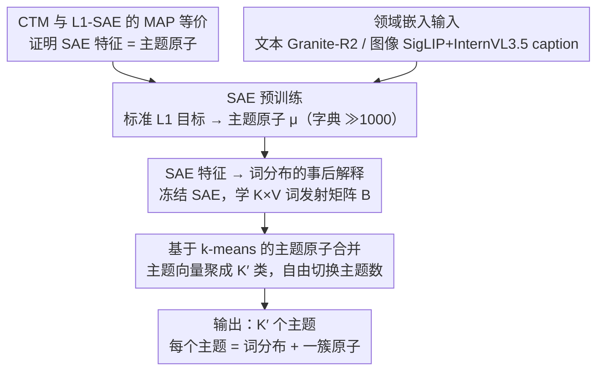

# Sparse Autoencoders are Topic Models

**会议**: ICML 2026  
**arXiv**: [2511.16309](https://arxiv.org/abs/2511.16309)  
**代码**: https://github.com/ExplainableML/SAE-TM (有)  
**领域**: 可解释性 / 表示学习  
**关键词**: 稀疏自编码器, 主题模型, LDA, 连续主题模型, 嵌入解释

## 一句话总结
本文证明稀疏自编码器（SAE）的 $L_1$ 目标恰好是一个 LDA 风格的"连续主题模型"（CTM）在高活动度、小贡献极限下的 MAP 估计，并据此提出 SAE-TM 框架：预训练 SAE 得到可复用的主题原子，事后学习词分布并通过聚类合并到任意主题数，在文本和图像数据集上的主题连贯性显著超过当前主流神经主题模型。

## 研究背景与动机

**领域现状**：稀疏自编码器（SAE）目前是分析基础模型激活、做"机制可解释性"的主流工具，社区普遍把每个 SAE 特征解读为可单独"操控"（steering）的单义概念方向（monosemantic direction）。神经主题模型（NTM）则是另一条平行的研究线，从 LDA、AVITM 一路演化到 FASTopic、TSCTM，主要面向文本 bag-of-words。

**现有痛点**：（1）SAE 一侧近年的实证研究反复发现：通过单个特征做行为操控（steering）效果差、单义性也不如线性探针稳定，导致"SAE 到底有什么用"成了悬而未决的争议；（2）NTM 一侧则受限于 posterior collapse、主题数不可变、几乎只能处理文本，难以推广到图像等高维嵌入。两条线各自有问题，但没人指出它们其实在解同一个数学问题。

**核心矛盾**：把 SAE 特征当成"可操控的单义方向"是一种过度解读——SAE 学到的更像是"主题成分"，单个特征本身不构成可独立干预的因果机制；这也解释了为什么 steering 总失败。但缺少一个统一的概率模型把这种直觉形式化。

**本文目标**：（1）从生成模型的角度给 SAE 一个原则性的解释；（2）把这个解释操作化为一个可与 NTM 公平对比的主题建模框架；（3）展示它在跨模态（文本+图像）大规模数据集分析中的实用价值。

**切入角度**：观察到 SAE 的"激活之线性叠加重建嵌入"与 LDA 的"主题之线性混合生成 bag-of-words"在结构上同构——区别只是观测域从离散词换成了连续嵌入。作者顺着这条同构关系，构造一个 LDA 在嵌入空间的连续推广，再看 SAE 目标能不能从里面推出来。

**核心 idea**：定义连续主题模型 CTM（每个嵌入是若干主题方向 $\mu_k$ 的线性组合 + 高斯噪声），在"高活动度、小贡献"的渐近极限下，$L_1$-SAE 的损失就是 CTM 的 MAP 目标；因此 SAE 特征本质是"主题原子"，多份小活动叠加在一起才解释一个嵌入，单独拎出来不该指望它有可控行为。

## 方法详解

### 整体框架

本文先在理论上证明 SAE 就是一类主题模型——$L_1$-SAE 的损失等价于一个 LDA 风格"连续主题模型"（CTM）的 MAP 目标，再顺着这个结论把 SAE 落地成可与神经主题模型（NTM）正面比拼的 SAE-TM 框架。SAE-TM 把"学表示"和"做解释"彻底解耦：先在大规模嵌入上用标准 $L_1$ 目标预训练一个 SAE，得到一组可复用的"主题原子"（即解码器列向量 $\mu_k$，扩展因子 4、字典 $\gg 1000$）；下游用任意小数据集时只冻结 SAE，额外学一个词发射矩阵把每个特征翻译成词分布，再用 $k$-means 把过细的原子合并到任意目标主题数 $K'$。整条流水线输入是领域嵌入集 $\{D_i\}$（文本用 Granite-R2、图像用 SigLIP，图像端再用 InternVL3.5 生成长 caption 当词袋），输出是 $K'$ 个主题，每个主题既是一个词分布也对应一簇原子。

### 关键设计

**1. CTM 生成模型与 $L_1$-SAE 的 MAP 等价性：把经验损失推回到生成模型先验**

SAE 长期被当成黑盒——大家知道"$L_1$ 稀疏 + 平方重建"管用却说不清它在估计什么。本文构造一个 LDA 在嵌入空间的连续推广 CTM：文档嵌入 $D=\epsilon+\sum_{i=1}^N\lambda_i c_i$ 由若干贡献线性叠加而成，每个贡献先按 $z_n\sim\mathrm{Cat}(\theta)$ 选主题、再按 $w_n\sim\mathcal{N}(\mu_{z_n},\Sigma_{z_n})$ 出方向、最后按 $\lambda_n\sim\mathrm{Ga}_{z_n}$ 出强度，文档级混合 $\theta\sim\mathrm{Dir}(\alpha)$。在"高活动度、小贡献"的渐近极限（$\rho_d\to\infty,\alpha_0\to 0,\rho_d\alpha_0\to\kappa$）以及 $\Sigma_k\to 0$（贡献对齐主题方向）下，每主题聚合强度收敛为 $S_k\Rightarrow\mathrm{Ga}(\kappa\theta_k,\beta)$；把强度重参数化为 $a_k=s\theta_k$ 后，观测模型化简成 $D\mid a\sim\mathcal{N}(Wa,\sigma^2 I)$，其负 log 后验在 $\kappa=1,\alpha_k=1$ 时正好就是 Bricken 等人的 $L_1$-SAE 损失 $\mathcal{L}(a)=\frac{1}{2\sigma^2}\lVert D-Wa\rVert_2^2+\beta\lVert a\rVert_1$（TopK / BatchTopK 这类硬稀疏 SAE 只需把假设 (A1) 换成硬支撑约束即可纳入同一框架）。这条推导既给 SAE 一个原则性的概率解释，也直接解释了"为什么单特征 steering 总失败"——SAE 特征只是 $\theta$ 的一个分量、是"主题成分"而非可独立操控的因果方向，必须组合起来才能解释一个嵌入。

**2. SAE 特征 → 词分布的事后解释：用一层薄的词发射矩阵嫁接到 NTM 的评测约定**

SAE 活在嵌入端，NTM 习惯把"主题"看成词分布，两边没法直接用 intruder detection、coherence rating 这些标准指标对比。本文冻结 SAE，只在解释层学一个 $K\times V$ 词发射矩阵 $\mathbf{B}$，定义 bag-of-words 似然 $P(D)=\prod_{w_i\in D}\pi P_0(w_i)+(1-\pi)\sum_k B_{k,i}\cdot\theta_k$：其中 $\theta_k$ 是 SAE 第 $k$ 个特征在文档嵌入 $\mathbf{D}$ 上的归一化激活（沿用 $a_k=s\theta_k$ 的同一分解），$P_0$ 是无条件 unigram 先验、负责吸收高频但无主题信息的词（$\pi=0.3$），训练时再按归一化 IDF $\log(N/\mathrm{df}(w_i))$ 给词加权，避免常见词主导损失，优化目标是全语料上的 $-\log P(D)$。关键在于完全不动 SAE 本体、只做一层轻量对齐，于是同一个预训练好的"基础 SAE"能复用到任何下游小数据集（哪怕小到不足以重训 SAE），每换一个领域只要重学一次 $\mathbf{B}$，对应实用的"foundational SAE topic model"场景。

**3. 基于 $k$-means 的主题原子合并：事后自由切换主题数**

SAE 通常有 $\gg 1000$ 个原子级特征，比 NTM 习惯的 50–500 主题粒度细太多。本文先用学到的 $\mathbf{B}$ 给每个特征算主题向量 $\mathbf{T}_k=\sum_{w_i\in\mathcal{V}}B_{k,i}\mathbf{w}_i$（$\mathbf{w}_i$ 取 word2vec/GloVe 词向量，没有时用 SAE 解码器列替代），并用 top-$p=0.9$ 截断重归一化去噪；再对 $\{\mathbf{T}_k\}$ 跑 $k$-means 聚成 $K'$ 类；最后按特征先验 $P(k)=\bar{\theta}_k$ 加权合并同簇特征的词分布 $P_{k'}(w_i)=\sum_{k:c_k=k'}P(w_i\mid\theta_k)P(k)/\sum_{k:c_k=k'}P(k)$。这样主题数 $K'$ 可以在不重训 SAE 的前提下随意调（验证集上扫一遍即可），聚类边界顺带给出主题间相似性的可视化信号，也和"一份基础 SAE、多下游多 $K'$ 复用"的思路天然兼容。

### 损失函数 / 训练策略
SAE 训练用 $L_1$ 惩罚（系数 2）、扩展因子 4（即 $K\approx 3072$）、batch 1000、5 万步、lr=0.001；词发射矩阵 $\mathbf{B}$ 训练 50–200 epoch、lr=0.01；50M Twitter 嵌入上训练一次 SAE 约 10 分钟、解释约 15 分钟，单卡即可。

## 实验关键数据

### 主实验

文本五数据集（News-20K / IMDB / Yelp / DailyMail / Twitter，文档嵌入用 Granite-R2）上不同主题数下与 8 个 NTM 基线对比（数值为跨数据集平均）：

| 主题数 | 指标 | SAE-TM | TSCTM (次优一类) | AVITM/CombinedTM |
|--------|------|--------|------------------|------------------|
| 50  | $C_I$ / $C_R$ | **54.31 / 77.25** | 44.61 / 69.75 | 38.72 / 70.24 |
| 100 | $C_I$ / $C_R$ | **51.48 / 78.01** | 35.81 / 58.53 | 38.49 / 67.37 |
| 300 | $C_I$ / $C_R$ | **43.50 / 74.22** | 26.17 / 27.40 | 33.38 / 65.67 |
| 500 | $C_I$ / $C_R$ | **40.49 / 71.22** | 21.68 / 17.67 | 31.79 / 50.77 |

SAE-TM 在所有主题数下 $C_I$（intruder detection）和 $C_R$（coherence rating）均为第一，且随主题数增加只有轻微下降；而 TSCTM 这类靠词频技巧拉高小主题数指标的方法在 500 主题时 $C_R$ 从 69.75 崩到 17.67。多样性 $D$ 上 SAE-TM 稳定排第二（仅次于 TSCTM）。

图像三数据集（CIFAR100 / Food101 / SUN397，用 SigLIP 嵌入 + InternVL3.5 长 caption）：

| 主题数 | 指标 | SAE-TM | TSCTM | CombinedTM | FASTopic |
|--------|------|--------|-------|------------|----------|
| 50  | $C_I$ / $C_R$ | **42.57 / 85.05** | 40.51 / 80.40 | 42.30 / 79.39 | 34.44 / 69.56 |
| 200 | $C_I$ / $C_R$ | **38.59 / 85.53** | 34.69 / 72.61 | 23.16 / 30.80 | 32.28 / 68.14 |
| 500 | $C_I$ / $C_R$ | **36.54 / 84.43** | 25.28 / 39.81 | 20.29 / 26.56 | 31.05 / 67.27 |

图像端 $C_R$ 在所有主题数上稳定保持 84+，是唯一一个不随主题数衰减的方法；只有多样性略低于个别基线，作者归因于图像嵌入更聚焦少数前景对象、部分 SAE 特征绑定了高频通用词。

### 消融与扩展分析

| 配置 | 关键现象 | 说明 |
|------|----------|------|
| 高活动度极限 $N=500$ vs. $N=5$ | $N$ 大时嵌入分布平滑成高斯云，$N$ 小时呈块状网格 | 验证 (A1)：只有在小贡献极限下 SAE 的连续 $L_2$ 损失才匹配 CTM 的离散生成过程 |
| 主题数从 50 → 500 | SAE-TM $C_R$ 下降 ~6 分；TSCTM 下降 ~52 分 | 合并机制不破坏主题原子，加细粒度不会让连贯性垮掉 |
| ImageNet vs. CC3M/CC12M/YFCC（100 主题） | ImageNet 在 "Fluffy Animals" / "Delicate Plants" 等显著高于 web 数据集，"Human Interaction" 显著低 | 与 ImageNet 类平衡设计相符，证明 SAE-TM 能反映数据集构造差异 |
| 日本浮世绘 7 个艺术时期 | "Domestic Scene" 江户黄金期最高、20 世纪显著下降；"Vibrant Garment" 江户/明治远高于 20 世纪 | 主题趋势与已知文化史变化吻合，展示数字人文应用 |

### 关键发现
- **理论 → 实践的闭环**：CTM 假设 (A1)（高活动度小贡献极限）不只是数学技巧——图 3 用 $N=5$ vs $N=500$ 的采样可视化直接验证了"只有在小贡献极限下，离散主题混合才平滑成 SAE 用的高斯重建损失"，反过来也解释了为什么稀疏度太低（每文档仅几个大激活）的 SAE 训练不稳。
- **主题数 scalability 是关键差异**：传统 NTM 主题数加大后连贯性崩溃，本质是模型容量被一次性分配死了；SAE-TM 因为先学小粒度原子、再 $k$-means 合并，主题数变多只是改聚类数，原子质量不变，所以从 50 到 500 几乎无衰减。
- **图像主题建模新打法**：以前的 NTM 几乎只能吃 bag-of-words，处理图像得先把图压成 caption；本文展示了"图像嵌入直接做主题"的可行性（SAE-TM / CombinedTM / FASTopic 都基于嵌入），把 SAE 推到大规模视觉数据集分析的工具位。

## 亮点与洞察
- **第一篇把 SAE 目标推成主题模型 MAP 估计**：之前所有"SAE = 主题模型"的讨论都停在直觉/类比；本文给出了从 CTM → $L_1$-SAE 的完整渐近推导（并把 TopK/BatchTopK 一并纳入），这种"经验损失 ← 生成模型先验"的推导范式可以迁移到任何稀疏字典学习方法（如 NMF、Matching Pursuit）。
- **"主题原子 + 事后合并"解耦了表示学习与解释**：SAE 一次预训练得到通用原子，下游 $K'$、词表、领域都可以换；这种"foundational 表示 + 轻量解释层"的范式很像视觉/语言基础模型，但用在了主题建模这种以前必须端到端重训的任务上。
- **对 SAE 社区是一次定位修正**：作者明确指出 SAE 不适合做单特征 steering、但适合做大规模主题/数据集审计；这个定位转换有可能改变后续 SAE 研究的评测重心（从单义性、可控性转向集合行为、数据分析）。

## 局限与展望
- **作者承认的局限**：（1）SAE 特征解释质量仍有提升空间，激活强度并不总与主题重要性对齐；（2）文档嵌入除主题外还编码情感、长度、风格等非主题信息，SAE-TM 会无意中把这些也学进去（不过这是所有嵌入型 NTM 的通病）；（3）假设 (A3)（主题间独立）排除了 Matryoshka / Matching-Pursuit 这类层级 SAE，往层级主题模型推广留待未来。
- **自己发现的局限**：图像端多样性 $D$ 偏弱、且作者把原因归到"图像嵌入聚焦前景对象"，但没真正给一个针对性的修法；目前的词发射矩阵 $\mathbf{B}$ 学习只用 bag-of-words 似然，没显式利用 SAE 自带的注意力/激活模式，潜在改进空间不小。
- **改进思路**：把层级 SAE 显式建模为层级 CTM（每层一个 $\theta^{(\ell)}$）并推导对应 MAP，能直接得到"自适应粒度主题"；对图像还可尝试用 top-激活图像的视觉 prompt + MLLM 来替代/补充 caption 路径下的词发射学习。

## 相关工作与启发
- **vs FASTopic / CombinedTM（嵌入型 NTM）**：这两个也吃嵌入，但都是从头训练一个新的概率模型；SAE-TM 直接借用已有 SAE 的字典，理论上等价于"用 MAP 替代 ELBO"，省掉了 posterior collapse 风险，并且天然支持主题数动态调整。
- **vs Zheng et al. 2025（SAE 特征当 NTM 输入 token）**：他们只是把 SAE 当作 tokenizer 喂给现成 NTM，没有触及"SAE 本身就是主题模型"这一更强的等价命题；本文直接把 NTM 的角色让给 SAE，省了一个外挂模型。
- **vs Jiang et al. 2025 / Choi et al. 2025（SAE 做数据集 inspection）**：他们靠工程经验展示 SAE 在数据集分析上有用，但缺理论锚；本文补上理论后，第 6 节的 ImageNet/CC3M/YFCC/浮世绘分析就有了原则性背书。
- **vs Bricken et al. 2023 / 主流 mechanistic interp**：主流叙事是"SAE 学单义可操控方向"，本文给出反叙事——SAE 学的是主题成分，单独操控注定打折，做集合层面分析（数据集、主题、分布差异）才是其优势区。

## 评分
- 新颖性: ⭐⭐⭐⭐⭐ 首次给出 $L_1$-SAE 与 LDA 风格 CTM 的 MAP 等价证明，从根本上改写了 SAE 的角色定位。
- 实验充分度: ⭐⭐⭐⭐ 覆盖 5 个文本 + 3 个图像数据集、5 档主题数、8 个 NTM 基线，外加 30M 图像数据集对比和浮世绘案例，规模与多样性都很扎实，仅缺少与 mechanistic-interp 类 steering 任务的直接对比。
- 写作质量: ⭐⭐⭐⭐⭐ 表 1 把 LDA / CTM 生成过程并排对照、图 3 用 $N=5$/$N=500$ 直观验证 (A1)，理论推导与实验衔接非常清晰。
- 价值: ⭐⭐⭐⭐⭐ 同时影响 SAE 可解释性社区（重新定位 SAE 的用途）和主题建模社区（提供新一代跨模态主题模型），并已开源，下游影响面广。

<!-- RELATED:START -->

## 相关论文

- [\[ICML 2026\] On the Relationship Between Activation Outliers and Feature Death in Sparse Autoencoders](on_the_relationship_between_activation_outliers_and_feature_death_in_sparse_auto.md)
- [\[ICML 2026\] PolySAE: Modeling Feature Interactions in Sparse Autoencoders via Polynomial Decoding](polysae_modeling_feature_interactions_in_sparse_autoencoders_via_polynomial_deco.md)
- [\[ICLR 2026\] Toward Faithful Retrieval-Augmented Generation with Sparse Autoencoders](../../ICLR2026/interpretability/toward_faithful_retrieval-augmented_generation_with_sparse_autoencoders.md)
- [\[ICLR 2026\] Temporal Sparse Autoencoders: Leveraging the Sequential Nature of Language for Interpretability](../../ICLR2026/interpretability/temporal_sparse_autoencoders_leveraging_the_sequential_nature_of_language_for_in.md)
- [\[ACL 2026\] AdaptiveK: Complexity-Driven Sparse Autoencoders for Interpretable Language Model Representations](../../ACL2026/interpretability/adaptivek_complexity-driven_sparse_autoencoders_for_interpretable_language_model.md)

<!-- RELATED:END -->
