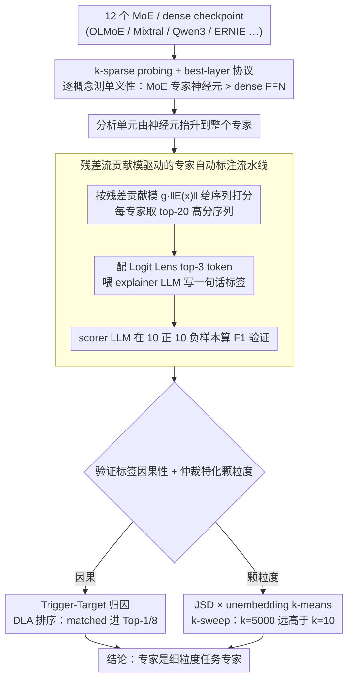

# The Expert Strikes Back: Interpreting Mixture-of-Experts Language Models at Expert Level

**会议**: ICML 2026  
**arXiv**: [2604.02178](https://arxiv.org/abs/2604.02178)  
**代码**: https://github.com/jerryy33/MoE_analysis  
**领域**: 机制可解释性 / MoE 大模型  
**关键词**: Mixture-of-Experts, 多义性, 稀疏路由, 自动可解释性, 专家特化

## 一句话总结
本文用 $k$-sparse probing 系统比较了 MoE 专家神经元与 dense FFN 神经元的多义性，发现 MoE 在稀疏路由压力下天然更接近单义，进而把分析单元从"神经元"升到"整个专家"，用 LLM 自动给数百个专家打自然语言标签并通过因果触发实验验证，最终得出"专家既不是宽域领域专家、也不是 token 级处理器，而是细粒度任务专家"的结论。

## 研究背景与动机
**领域现状**：MoE 已成为 LLM 扩展的事实标准（Gemini 2.5、DeepSeek-V3、Qwen3、ERNIE-4.5 等），每个 token 只激活全部参数的一小部分。与此同时，dense 模型的可解释性研究主要靠 Sparse Autoencoder (SAE) 之类的事后稀疏编码，对每一层都需要单独训练、算力代价巨大。

**现有痛点**：dense FFN 中的神经元高度**多义** (polysemantic)：单个神经元会同时响应多个不相关的概念，这源于 superposition——网络在 $d$ 维空间里用近似正交的方向表示远多于 $d$ 个特征。这使得"看一个神经元就知道它在干什么"几乎不可能。

**核心矛盾**：MoE 已经在架构层引入了稀疏性，但目前学界仍把 MoE 当作 dense 模型那样去解释（看神经元、训 SAE），完全没有利用其结构红利；另一方面对"专家到底在专什么"也存在两派对立——一派说专家按宽域（生物、代码）分工，一派说专家只是按句法/token 模式分工。

**本文目标**：(1) 量化回答"MoE 专家神经元是否真的比 dense FFN 神经元更单义？"；(2) 如果是，能否把分析单元从神经元拔高到整个专家，从而不依赖 SAE 就规模化解释 LLM？(3) 用这套工具去仲裁专家特化之争。

**切入角度**：Chaudhari et al. (2025) 在 toy model 上观察到"路由越稀疏，superposition 越弱"，作者把这个观察迁移到 production-scale LLM 上验证；同时引入"残差流贡献模 $g_i(x)\|E_i(x)\|_2$"作为度量专家真实活跃度的关键信号。

**核心 idea**：架构性稀疏路由会同时把**单个神经元**和**整个专家**推向单义化，于是 MoE 模型可以在"专家级"被自然语言直接解释，而不必再花大代价做神经元级别的拆解。

## 方法详解

### 整体框架
本文要解决的是"MoE 大模型能不能不靠 SAE、直接在专家这一级被读懂"。思路是把可解释性分析从神经元逐级抬升到整个专家：先用 $k$-sparse probing 量出 MoE 专家神经元确实比 dense FFN 神经元更单义，再借这股稀疏红利让 LLM 给每个专家自动写自然语言标签并做因果验证，最后用一个客观度量去仲裁"专家到底专在什么颗粒度"。全程不训练任何 LLM，只对 12 个公开的 MoE / dense checkpoint（OLMoE-1B-7B、Mixtral-8x7B、Qwen3-30B-A3B、ERNIE-4.5-21B-A3B、OLMo-7B 等）做前向分析，配一个外部 explainer/scorer LLM (Gemini 3 Flash Preview)。

### 关键设计

**1. $k$-sparse probing + best-layer 协议：把"是否单义"做成可比指标**

痛点在于"神经元到底单不单义"过去只能定性聊，没法横向比 MoE 和 dense。作者对每个概念在激活向量上训一个 $L_2$ 正则的逻辑回归，但只允许它用 top-$k$ 个维度：先按类间均值差 $a_j=|\mathbb{E}[h_j\mid y=1]-\mathbb{E}[h_j\mid y=0]|$ 选出 top-$k$ 神经元，$k\in\{1,2,4,8,16,32,64\}$，对 MoE 用的是专家中间激活 $\mathbf{h}=\mathrm{Swish}(W_{\text{gate}}x)\odot W_{\text{up}}x$，对 dense 用 FFN 同位置激活。MoE 一侧只保留被路由到目标专家的 token（承认 router 已做了一次粗筛），并为每个概念在所有层/所有专家里挑最好的那层比 $F_1$，避免"挑错层"压低分数。$k=1$ 上的高 $F_1$ 直接等于"一个概念被钉死在单个神经元"，于是单义性从形容词变成数字。为排除"MoE 只是参数更多"这个 confounder，比较按 active-parameter 配对，并在 OLMo 家族内做同总参对照——结果 OLMoE-1B-7B 用 1B active 就打过了 OLMo-7B 的 7B active，说明红利来自稀疏路由本身。

**2. 残差流贡献模驱动的专家自动标注流水线：用因果活跃度挑样本，再让 LLM 写标签**

要给专家写标签，第一步是挑出"真正激活这个专家"的序列，而 router 权重 $g_i(x)$ 只说明专家被选中、不说明它算出了有用东西，专家内部神经元绝对值也未必传到输出。作者改用专家写进残差流的更新向量的模长作为活跃度，对序列 $s$ 打分 $\mathrm{score}(s,E_i)=\max_{x\in s}\,g_i(x)\,\|E_i(x)\|_2$——因为在 transformer 里组件影响输出的唯一通道就是残差流，$\|E_i(x)\|_2$ 才是因果上真有贡献的那一项。每个专家取 top-20 高分序列，配上 Logit Lens 给出的 top-3 被推高 token，喂给 explainer LLM 写一句话描述；再让 scorer LLM 在 10 正 10 负的 held-out 样本上算 $F_1$ 验证标签判别力。OLMoE / ERNIE / Qwen3 的 14 层上几乎所有专家 $F_1>0.8$，最稀疏的 Qwen3-30B-A3B 频繁 $>0.9$，证明标签不是 LLM 凭空编的。这一步把"从神经元到专家"的方法论瓶颈打通，让自动可解释性不必再为每层训 SAE。

**3. Trigger-Target 因果归因 + JSD 特化度量：验证标签的因果性，并仲裁特化之争**

高 $F_1$ 只说明标签描述得准，不等于因果。作者让 Gemini 3 Flash Preview 按专家标签合成句子，里面埋 trigger 词（应触发该专家）和 target 词（该专家应推高的输出 token），再用 DLA $A_{v\to t}=\mathrm{LN}_{\text{linear}}(v)^\top W_U[:,t]$ 在层内给所有专家排序：matched prompt 上该专家几乎都进 Top-1 或 Top-8，而 80% 为别人设计的 control prompt 上该专家根本没被路由——这是一个很硬的反例，标签不是"什么都对"的废话。第二条线回答"专家专在哪档颗粒度"：用对 unembedding 矩阵的 $k$-means 聚类（$k\in\{10,50,100,1000,5000\}$）让模型自己的输出空间结构定义"原生领域"，对 $10^6$ 个 token 用 Jensen-Shannon Divergence 衡量每个专家相对层平均的偏离，分别报告 Routing Specialization（路由进来的 token 分布）和 Functional Specialization（被 Logit Lens 推高的 token 分布），再用 Random Expert Baseline 校正小样本噪声。若专家是宽域分工，$k=10$ 上 JSD 就该最高；实测却是 $k=5000$ 远远拉开，强力支持"细粒度任务专家"的结论。

唯一被训练的部件是上面这些逻辑回归 probe（$L_2$ 正则，75/25 train-test，按概念/层/专家逐一拟合）；所有解释流程都只是现成 checkpoint 的前向传播加一个外部 LLM。

## 实验关键数据

### 主实验：MoE vs Dense 的单义性
比较 best-layer $F_1$ 在 $k$-sparse 探针上的表现（节选自 Figure 1 / 2 / 3 的定性描述）：

| 设定 | $k=1$ 时 MoE 表现 | $k=1$ 时 dense 表现 | 关键观察 |
|------|------------------|---------------------|----------|
| 按 active-param 配对 (12 模型) | 接近最优，方差小 | 显著低于 MoE，且许多概念整体差 | gap 在 $k=1$ 最大，说明 MoE 概念常被钉在单神经元 |
| OLMo 家族同总参对比 | OLMoE-1B-7B 接近上界 | OLMo-7B (7× active) 仍多义 | 稀疏路由比原始容量更能解释单义性 |
| 按 $N_A/N$ 切片 | Qwen3-30B-A3B ($N_A/N\approx0.06$) 最干净 | Mixtral-8x7B ($N_A/N=0.25$) 明显较脏 | 路由越稀疏，单义性越强 |

### 专家级自动可解释 & 因果归因
| 配置 | 关键指标 | 说明 |
|------|---------|------|
| OLMoE / ERNIE / Qwen3 共 14 层全部专家 | 大多数专家 F1 > 0.8 | scorer 在 10 正 10 负样本上几乎能完美分类，labels 不是 LLM 凭空写的 |
| Qwen3-30B-A3B (最稀疏 MoE) | 平均 F1 频繁 > 0.9 | 路由越稀疏，labels 越可靠，与神经元级结论同向 |
| OLMoE Layers 4/9/14 × 10 专家 × 20 trigger-target 句子 | matched: 该专家几乎都进 Top-1 / Top-8 | DLA 排名上该专家确实贡献 target token |
| 同样 10 专家在为他人设计的 control prompts 上 | 80% 直接没被路由，DLA 贡献近 0 | 强反例：标签不是"什么都对"的废话 |

### 关键发现
- **稀疏度才是关键，参数量不是**：OLMoE-1B-7B 用 1B active 在 monosemanticity 上完胜 OLMo-7B（7× active），说明可解释性红利来自架构性稀疏路由，不是总参或激活参；这意味着工业界"更多 total expert + 更少 active expert"的扩展趋势顺带让模型更透明。
- **专家既不是宽域、也不是 token 级，而是细粒度任务专家**：JSD 在 $k=5000$ 上远高于 $k=10$，配合定性 Taxonomy（OLMoE-L1-E57 处理化学/生物后缀；ERNIE-L15-E0 在协调连词后推完成；OLMoE-L4-E3 是专利/法律领域；OLMoE-L15-E17 专门补 LaTeX 闭合括号 `}}`；Qwen3-L44-E12 专攻伊朗行政地理；OLMoE-L14-E59 是 D&D 规则补全器）共同支持。
- **层间出现松散功能分工**：早层 → 形态/分词，中层 → 句法粘合，中后层 → 领域知识，深层 → 结构有效性 / 格式约束，与"残差流是通信信道"的电路观一致。

## 亮点与洞察
- **残差流贡献模作为活跃度度量**很巧妙：以前自动可解释性挑高激活样本要么看 router 权重要么看神经元绝对值，都不直接对应"对最终预测的因果影响"；$g_i(x)\|E_i(x)\|_2$ 直接落在 transformer "唯一影响输出的通道"上，几乎是该问题的正确度量，可以直接搬到任何 MoE 模型的解释流水线里。
- **JSD + unembedding $k$-means 的 $k$-sweep**是仲裁"宽域 vs 任务专家"之争的最干净判据：与其用人定义的 domain 标签（biology / coding…），不如让模型自己的输出空间结构定义 domain，再用一根扫得很开的 $k$ 轴让两派假设互相证伪——结果毫无争议地落在"任务级"。
- **"模块单义性"概念双管齐下**：单个神经元因稀疏路由更单义 + router 只把同质 token 喂给同一个专家，两层叠加才让"整个专家可读"成立；这给后续"用 MoE 取代 SAE 做解释"的方向提供了清晰理论支撑。
- **趋势性结论可迁移**：若稀疏度↑→单义性↑的趋势在极端稀疏处不破，下一代 MoE 可能天生可读，这对 alignment、debug、安全审计都是巨大利好。

## 局限与展望
- **没跑最大规模 MoE**：受 GPU 内存限制，DeepSeek-V3 / Kimi-K2 / Llama-4-MoE 这一档没纳入；作者只是外推趋势。
- **未触及"专家间叠加"**：单专家内部多义性减弱了，但跨专家的 superposition 仍可能存在，对"专家是充分可解释单元"是开放威胁。
- **标签风险与误用**：作者在 Impact Statement 自承一句自然语言标签会隐藏 prompt 依赖、数据集 artifact、专家间交互；同样的精细定位能力对恶意 actor（绕过安全机制、抽取能力）也是双刃剑。
- **未来方向**：把专家当 sub-circuit 节点、研究 router 如何把这些"子例程"串联成更大计算流（circuit tracing on MoE）；用专家级干预做精确编辑/能力消除而不必动全部参数。

## 相关工作与启发
- **vs Sparse Autoencoder (Bricken et al., 2023)**：SAE 是事后给 dense 模型每一层训一个稀疏字典，算力代价巨大且每层都得训；本文证明 MoE 模型可以直接把"专家"当作天然 sparse code 单元，**省掉 SAE 训练步骤**，是"用架构红利换可解释性税"的典型范式。
- **vs Chaudhari et al. (2025) toy-model 稀疏-superposition 实验**：Chaudhari 在玩具模型上首次提出"稀疏路由削弱 superposition"，本文把它**搬到 production-scale**，并加上单义度量化、自动标签、因果归因三层验证，把假说升级为可被工业界采纳的事实。
- **vs 专家特化两派 (Muennighoff et al., 2025 宽域派 / Xue et al., 2024 token 级派)**：本文不挑边站，而是给出一个能让两派假设互相证伪的客观度量（JSD vs $k$-sweep），用数据仲裁——结论是"两派都不全对，专家是细粒度任务专家"。
- **vs Geva et al. (2021) "FFN as key-value memory"**：本文承认很多专家也是 key-value memory，但**把"value"从向量推到自然语言层面**，等于给 key-value memory 视角加了人类可读的语义注释。

## 评分
- 新颖性: ⭐⭐⭐⭐ 把"稀疏路由→单义性"从 toy-model 推到 production-scale，再首次系统证明"专家级自动可解释"的可行性，方法组合扎实。
- 实验充分度: ⭐⭐⭐⭐⭐ 12 模型 × 58 概念 × 多个 $k$ × 多层，叠加跨家族对照、causal trigger-target、JSD $k$-sweep，三重证据闭环。
- 写作质量: ⭐⭐⭐⭐ 结构清晰、动机递进自然；公式与图表配合到位；个别概念（"modular monosemanticity"）若再多一页定义会更利于复现。
- 价值: ⭐⭐⭐⭐⭐ 给 MoE 大模型的可解释性研究指出一条不依赖 SAE 的廉价路线，并仲裁了多年悬而未决的"专家特化"争论，对 alignment / 安全审计直接有用。

<!-- RELATED:START -->

## 相关论文

- [\[CVPR 2026\] ERMoE: Eigen-Reparameterized Mixture-of-Experts for Stable Routing and Interpretable Specialization](../../CVPR2026/interpretability/ermoe_eigen-reparameterized_mixture-of-experts_for_stable_routing.md)
- [\[ACL 2025\] EXPERT: An Explainable Image Captioning Evaluation Metric with Structured Explanations](../../ACL2025/interpretability/expert_an_explainable_image_captioning_evaluation_metric_with_structured_explana.md)
- [\[NeurIPS 2025\] AgentiQL: An Agent-Inspired Multi-Expert Framework for Text-to-SQL Generation](../../NeurIPS2025/interpretability/agentiql_an_agent-inspired_multi-expert_framework_for_text-to-sql_generation.md)
- [\[ACL 2026\] METER: Evaluating Multi-Level Contextual Causal Reasoning in Large Language Models](../../ACL2026/interpretability/meter_evaluating_multi-level_contextual_causal_reasoning_in_large_language_model.md)
- [\[ICML 2026\] Query Circuits: Explaining How Language Models Answer User Prompts](query_circuits_explaining_how_language_models_answer_user_prompts.md)

<!-- RELATED:END -->
