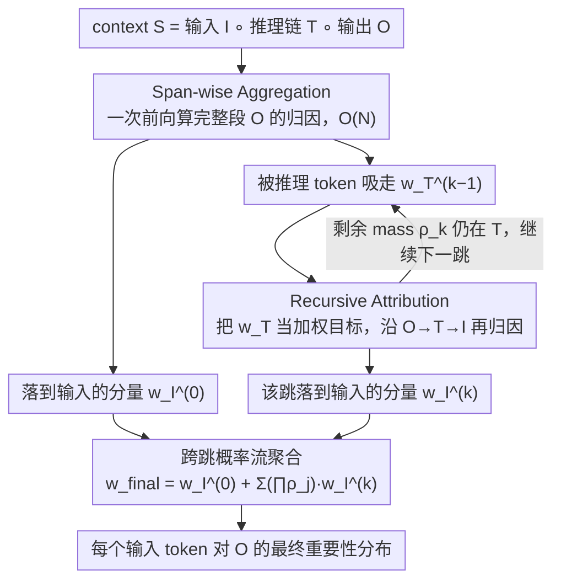

# Towards Long-Horizon Interpretability: Efficient and Faithful Multi-Token Attribution for Reasoning LLMs

**会议**: ICML 2026 Oral  
**arXiv**: [2602.01914](https://arxiv.org/abs/2602.01914)  
**代码**: https://github.com/wbopan/flashtrace  
**领域**: 可解释性 / LLM 推理 / Token 归因  
**关键词**: token attribution, reasoning LLM, span-wise aggregation, recursive attribution, long-context interpretability

## 一句话总结
针对推理 LLM 长思维链场景下逐 token 归因 $\mathcal{O}(M\cdot N)$ 慢且归因质量被中间推理 token 吸光的问题，本文提出 FlashTrace：用 span-wise 聚合一次过算完整段目标 token 的归因，再用递归归因把重要性从输出经推理链回溯到原始输入，5k 目标 span 上比最强基线 IFR 快 130 倍以上，同时在 RULER / MATH / MoreHopQA 上 faithfulness 全面占优。

## 研究背景与动机

**领域现状**：Token attribution 是解释 LLM 输出的主流可解释性手段，主流路线包括 perturbation-based（REAGENT/CLP）、gradient-based（Integrated Gradients）、attention+relevance 传播（IFR、AttnLRP）等。它们都假设要解释的目标是单个 token，把 context 中每个 token 对它的因果贡献算成一个分布。

**现有痛点**：现代 reasoning LLM（o1、DeepSeek-R1、Qwen-3）会先吐几千 token 的 chain-of-thought 再给答案，让 token 归因落到两个具体问题上：
- 效率瓶颈：要解释长度 $M$ 的输出 span，必须对每个 token 各跑一次归因，复杂度从 $\mathcal{O}(N)$ 变成 $\mathcal{O}(M\cdot N)$，5k 输出用 IG 要 10 小时以上、用最快的 IFR 也要 38 分钟，根本没法在 agent workflow 里用。
- 忠实度下降（information absorption）：自回归模型下一个 token 直接由前一个 token 触发，所以推理 token $\mathbf{T}$ 会吸掉绝大部分 attribution mass。文中 Figure 1 量化了这件事——CoT 一开，分到 $\mathbf{T}$ 上的 mass 从 ~80% 涨到 >90%，而 ground-truth 输入 token 的 recovery rate 从 26% 暴跌到 <10%。最终解释只告诉你"答案是被上一句推理决定的"，根本回不到 prompt 里那条真正的证据。

**核心矛盾**：现有方法只刻画 input→output 的直接依赖，而推理 LLM 的因果链是 $\mathbf{I}\to\mathbf{T}\to\mathbf{O}$ 三段；既要绕过中间桥 $\mathbf{T}$ 把重要性继续传回 $\mathbf{I}$，又要避免对 $\mathbf{T}$ 里每个 token 都暴力跑一遍归因。换句话说，"多 token 目标"和"多跳传播"必须同时解决，否则效率/忠实度二选一。

**本文目标**：定义 multi-token attribution 问题，把它拆成两个子问题——(i) 给定 span $S$，一次算完所有源 token 对 $S$ 的贡献；(ii) 把推理 token 吸走的 mass 沿因果链反向传回原始输入。

**切入角度**：作者注意到 ALTI/IFR 框架下，attention head 对单个 target 位置 $i$ 的贡献写成 $\mathbf{f}_{j\to i}(\mathbf{x}_j)=\alpha_{i,j}^h \cdot (\mathbf{x}_j W_V^h W_O^h)$，其中 $\mathbf{v}_j = \mathbf{x}_j W_V^h W_O^h$ 只跟源 token 有关，与目标位置 $i$ 解耦。把这一观察推到整段目标 span 上，"算所有源 token 对整段 span 的贡献"就可以被代数因式分解掉。

**核心 idea**：用 span-wise 聚合把"对整段 span 的归因"压成一次前向，再用 recursive attribution 把上一跳分到推理 token 上的分数当成下一跳的"加权 target"，从而在不显著加成本的前提下，把重要性沿 $\mathbf{O}\to\mathbf{T}\to\mathbf{I}$ 流回去。

## 方法详解

### 整体框架
FlashTrace 要解释的目标是模型最终输出 span $\mathbf{O}$，输入是一段完整 context $\mathbf{S}=\mathbf{I}\circ\mathbf{T}\circ\mathbf{O}$（用户输入 + 推理链 + 输出），最终给出每个 context token 对 $\mathbf{O}$ 的重要性分数 $\mathbf{w}_{final}$，理想情况下能把分数精准聚回原始输入 $\mathbf{I}$ 里真正决定答案的那几个 token。它把这件事拆成两层：先用 span-wise 聚合在一次前向里算完整段 $\mathbf{O}$ 的归因（Hop 0），拿到落在输入的 $\mathbf{w}_{\mathbf{I}}^{(0)}$ 和被推理 token 吸走的 $\mathbf{w}_{\mathbf{T}}^{(0)}$；再把 $\mathbf{w}_{\mathbf{T}}^{(k-1)}$ 当成下一跳的加权目标递归地重做归因（Hop $k\ge 1$），让 mass 沿 $\mathbf{O}\to\mathbf{T}\to\mathbf{I}$ 继续往输入流；最后按"剩余 mass"折算把各跳的输入分量合成单一分布。所有归因共用 ALTI 的 L1 proximity 度量 $\text{Proximity}(\mathbf{z},\mathbf{y}) = \max(0, -\|\mathbf{y}-\mathbf{z}\|_1 + \|\mathbf{y}\|_1)$（衡量"去掉贡献 $\mathbf{z}$ 后目标向量 $\mathbf{y}$ 的范数会缩多少"，在 Transformer 高维各向异性空间里比 cosine 稳），实验里 $K=1$ 一跳即够用。

### 关键设计

**1. Span-wise Aggregation：把整段 span 的归因压成一次前向**

效率瓶颈来自"输出 span 有 $M$ 个 token、每个都要单独跑一遍归因"，复杂度 $\mathcal{O}(M\cdot N)$，5k 输出连最快的 IFR 都要 38 分钟。FlashTrace 的做法是把整段目标的层级表示先求和为 $\mathbf{Y}_S=\sum_{i\in S}\mathbf{y}_i$，把源 token $j$ 对整段的贡献定义为 $\mathbf{Z}_S=\sum_{i\in S}\mathbf{z}_{j\to i}$，再套同一个 L1 proximity 算分。关键杠杆是 attention 的线性性：attention head 贡献 $\alpha_{i,j}^h \cdot \mathbf{v}_j$ 里的 $\mathbf{v}_j = \mathbf{x}_j W_V^h W_O^h$ 只跟源 token 有关、与目标位置 $i$ 解耦，于是可以提出来写成 $\mathbf{F}_{j\to S}=\mathbf{v}_j \cdot (\sum_{i\in S}\alpha_{i,j}^h)$——昂贵的 V/O 投影只算一次，每多一个 target 位置只多一次标量乘加，residual 流也一并按 span 求和，内存不再随 $M$ 涨。这是纯代数重排、不引入任何近似，因此 ALTI/IFR 原有的忠实度性质全部保留，复杂度从 $\mathcal{O}(M\cdot N)$ 降到 $\mathcal{O}(N)$，也为后面的多跳传播腾出了预算。

**2. Recursive Attribution：沿推理链把 mass 反向回溯**

单跳归因只能告诉你"答案是被上一句推理决定的"，因为自回归下推理 token $\mathbf{T}$ 会吸掉绝大部分 attribution mass（information absorption）。FlashTrace 把上一跳分给推理 token 的重要性 $\mathbf{w}_{\mathbf{T}}^{(k-1)}$ 转化成下一跳的"加权目标"，让 mass 不停留在 $\mathbf{T}$、继续往 $\mathbf{I}$ 传。具体是把 span-wise 聚合从 0/1 mask 自然推广到加权 span，新目标 $\mathbf{Y}^{(k)}=\sum_{j\in \mathbf{T}} w_j^{(k-1)} \cdot \mathbf{y}_j$、对应贡献 $\mathbf{Z}^{(k)}=\sum_{j\in \mathbf{T}} w_j^{(k-1)} \cdot \mathbf{z}_{k\to j}$；同样的因式分解仍然成立，$\mathbf{v}_k$ 只算一次、外面点乘标量 $\sum_j w_j^{(k-1)}\alpha_{j,k}^h$，所以每跳成本基本等于一次前向。它把重要性等价成"信息流概率"，每跳剩余 mass $\rho_k=\sum_{t\in\mathbf{T}}w_t^{(k)}$ 沿链传播。设计成"加权 span 上的同一个 span-wise op"既能回答"那句推理又是被 prompt 里哪段决定的"，又避免了 CAGE 那种 sentence-level 切分，把多跳传播也压在 $\mathcal{O}(N)$ 之内。

**3. 跨跳概率流聚合：把多跳结果折算成单一分布**

多跳跑完会有 $K$ 份分给输入的分量 $\mathbf{w}_{\mathbf{I}}^{(k)}$，直接相加会让推理链短的那跳被不公平放大。FlashTrace 把整个递归过程看成 mass 的逐跳分流——每跳要么"沉降"到输入、要么"剩在推理链上等下一跳解释"——按剩余 mass 折算后再合并：$\mathbf{w}_{final}=\mathbf{w}_{\mathbf{I}}^{(0)}+\sum_{k=1}^{K}(\prod_{j=0}^{k-1}\rho_j)\cdot \mathbf{w}_{\mathbf{I}}^{(k)}$，其中 $\rho_j$ 是第 $j$ 跳还留在 $\mathbf{T}$ 上的剩余 mass。这样各跳分布都落在同一概率尺度上合并，结果可比、可可视化；$\rho_k$ 很小时也天然提供了早停信号，实验里 $K=1$ 即可解掉绝大部分推理链依赖。

### 损失函数 / 训练策略
FlashTrace 是 training-free 的事后可解释性算法，没有训练损失，不改模型权重，对底层 Transformer 也无侵入式假设——只用前向 attention 权重 + value/output 投影即可计算。唯一超参是递归跳数 $K$，实验默认 $K=1$。

## 实验关键数据

### 主实验

RULER 系列（多需求 Needle-in-a-Haystack mq、Variable Tracking mv、长上下文 HotpotQA），评估 Qwen-3 8B Instruct，指标 Recovery Rate↑ / RISE↓ / MAS↓：

| 数据集（任务） | 指标 | FlashTrace | 最强基线 | 提升幅度 |
|---|---|---|---|---|
| mq q4（NIAH） | Recovery Rate ↑ | 0.413 | 0.328 (IFR) | +8.5 pp |
| mv v4（Variable Tracking） | Recovery Rate ↑ | 0.516 | 0.452 (IFR) | +6.4 pp |
| HotpotQA h4 c1 | Recovery Rate ↑ | 0.755 | 0.253 (IFR) / 0.229 (AttnLRP) | +50 pp |
| HotpotQA(1024) | RISE ↓ | 0.033 | 0.074 (IFR) | −55% |
| MATH | MAS ↓ | 0.446 | 0.490 (IFR) | −9% |
| MoreHopQA | MAS ↓ | 0.205 | 0.228 (IFR) | −10% |
| Aider Code Gen | MAS ↓ | 0.173 | 0.773 (IFR per-token avg) | −78% |

效率（5k token 目标 span，RULER）：FlashTrace < 20 s，IFR > 38 min，**130×+ 加速**；同时 IG / IG-Attn / Perturbation 在长 context 直接 OOM（Figure 4 虚线）。

### 消融实验

| 配置 | 复杂度 | 时间 (s) | RISE ↓ | MAS ↓ | 说明 |
|---|---|---|---|---|---|
| Exhaustive Token-Level Rollout（理论上的精确多跳归因） | $\mathcal{O}(M\cdot N)$ | 11.2 | 0.116 | 0.193 | MoreHopQA 上的暴力上界 |
| FlashTrace（span-wise + 递归） | $\mathcal{O}(N)$ | 0.72 | 0.128 | 0.205 | 时间 ↓93.6%，忠实度只掉 ~10% |
| FlashTrace, K=0（关掉递归） | — | — | — | — | Figure 1 可视化：mass 卡在 $\mathbf{T}$ 上，recovery rate 跌到 <10% |
| FlashTrace on LLaMA-3.1-8B-It（RULER Avg） | — | — | 0.171 | 0.231 | 换模型仍优于 IFR (0.206/0.298) 和 AttnLRP (0.398/0.683) |

### 关键发现
- **递归是质变而非微调**：仅 $K=1$ 一跳，HotpotQA Recovery Rate 从 IFR/AttnLRP 的 0.13–0.25 跃到 0.51–0.76（h2/h4/h6/h10 全段），证明 information absorption 不是"小修小补"的问题，必须显式建模 $\mathbf{O}\to\mathbf{T}\to\mathbf{I}$ 的流向。Figure 3 的 hop1−hop2 差异图直观显示：第二跳里推理 token 普遍掉分（红）、输入 token 普遍涨分（绿）。
- **Span-wise 是几乎免费的近似**：vs Exhaustive Rollout，FlashTrace 在 MoreHopQA 上 RISE/MAS 只退化 6–10%，运行时间从 11.2 s 缩到 0.72 s（93.6% 提速），说明"把多 token 目标聚合成单一 span"在多跳推理上是高质量近似，不需要走 sentence-level 切分（如 CAGE）那种昂贵路线。
- **跨任务跨模型稳定**：在代码生成 Aider 上 MAS 从 IFR 的 ~0.78 跌到 0.17，差出近 5 倍，说明 span-wise 归因不仅适合自然语言推理链，也能处理结构化中间产物（代码 diff）；换到 LLaMA-3.1-8B-It 后相对优势保留，说明这套机制不挑模型族。
- **效率曲线决定可用性**：Figure 4 显示 IG/Perturbation 类方法在 ~2–4k 输入或几百 token 输出处就 OOM，IFR 虽不 OOM 但时间随目标 span 线性涨；FlashTrace 内存 / 时间对目标 span 长度几乎平直——这是它能跑在 agent workflow 里的根本原因。

## 亮点与洞察
- **代数恒等式带来的免费午餐**：把 $\mathbf{F}_{j\to S}=\mathbf{v}_j \cdot (\sum_{i\in S}\alpha_{i,j}^h)$ 提取出来这一步看似简单，却是整篇文章的杠杆点——它让"对 span 的归因"在数学上变成对单 token 归因的标量加权，从而不引入任何近似就把 $M$ 维循环消掉。这是 attention 线性性 + ALTI proximity 度量恰好可加性的合谋。
- **把多跳归因写成概率流**：用 $\rho_k$ 当"剩余 mass"、$(\prod \rho_j)\cdot \mathbf{w}_{\mathbf{I}}^{(k)}$ 当"第 $k$ 跳沉降到输入的概率"这套语义，使得多跳聚合既有概率意义又天然支持早停，避免了"多跳越多越好/越多越乱"的玄学调参。这种"信息流分流"的视角可以迁移到任何需要把重要性沿生成链反向传播的解释器（如 tool-calling、ReAct trace、agent 长 memory 检索）。
- **正确诊断 = 半个解法**：作者先用一组干净的 Figure 1 实验把"reasoning token 吸 mass→recovery rate 跌"这件事量化出来，把模糊的"CoT 让解释变差"变成两个可测指标；随后 method 章每一个设计都明确对应一个被诊断出来的痛点。这种"先做诊断 ablation 再上 method"的结构值得借鉴。

## 局限与展望
- **proximity 是相关性而非反事实**：作者自己强调 L1 proximity 衡量的是"源 token 表示有多少流进 target span"，是 informational contribution；虽然他们用 RISE/MAS 这种 perturbation 指标验证了它能预测因果重要性，但严格的因果归因（counterfactual / mediation analysis）仍未做。
- **递归跳数固定为 $K=1$ 的代价**：默认 $K=1$ 已能解掉大多数推理链，但 Appendix H 才讨论 $K>1$ 的影响。对超长推理（几十次反思、多轮 tool-call 嵌套）是否需要自适应 $K$、$\rho_k$ 阈值化早停，文中没在主文给出实操指南。
- **目标 span 必须连续**：方法对"连续 span"做聚合很自然，但实际 reasoning trace 里关键步骤往往是非连续的（中间夹了大量噪声 token）。把"span"换成"任意权重子集"在公式上没问题，但如何自动挑选关键非连续目标（而不是简单地选 top-k）仍是 open 问题。
- **只验证到 8B 量级**：实验只覆盖 Qwen-3 8B 和 LLaMA-3.1-8B-It，没在 30B+ 或 MoE 模型上跑。考虑到 MoE 的 attention 共享与 expert 路由会改变信息流动模式，generalization 还需验证。

## 相关工作与启发
- **vs AttnLRP / IFR**：同样基于 attention/relevance 传播，但 AttnLRP/IFR 只能对单 token target 算分，多 token 时只能"逐个跑+平均"，又慢又会被中间推理吸 mass。FlashTrace 把目标从 token 升级为加权 span，并显式做多跳，是对这条技术路线的两个正交补丁。
- **vs CAGE（concurrent work）**：CAGE 也用递归思路追多跳，但它在 sentence-level 切分目标、跑多次完整归因，成本随推理链段数线性涨，长 context 难用。FlashTrace 在 token-span 这一更细的粒度上做加权 span，配合 span-wise 代数化降到 $\mathcal{O}(N)$，效率优势是数量级的。
- **vs Integrated Gradients / Perturbation**：IG 类方法理论解释力强、有 axiom guarantee，但梯度+多步积分让它在长 context 直接 OOM；Perturbation 类需要反复前向。FlashTrace 牺牲一点"完美的因果可解性"换来工程上可用的几秒级延迟，更接近 agent 时代真实部署需求。
- **vs Circuit-tracer / Transcoder**：那条线探的是模型内部 feature circuit，回答"哪个内部组件负责某种行为"；FlashTrace 回答"哪个外部输入 token 触发了某段输出"。两条线互补：前者是机制可解释性，后者是数据可解释性，可以叠加用——先用 FlashTrace 定位关键输入，再用 circuit-tracer 看模型内部是怎么用的。

## 评分
- 新颖性: ⭐⭐⭐⭐ 把现有 ALTI/IFR 的代数性质用足 + 递归归因构造，思路朴素但精确踩中 reasoning LLM 时代的痛点。
- 实验充分度: ⭐⭐⭐⭐ 覆盖 NIAH / VT / HotpotQA / MATH / MoreHopQA / Aider 六类任务，含跨模型、跨任务、效率/忠实度 Pareto、与暴力 Exhaustive Rollout 的逼近度对比，主线很硬；扣分点是没上 30B+ 或 reasoning RL 模型。
- 写作质量: ⭐⭐⭐⭐⭐ 诊断（Sec 3.2）→ 方法（Sec 4）→ 实验的论证链非常顺，Figure 1/3/4 都直接服务于关键 claim，公式推导用最少符号交代清楚。
- 价值: ⭐⭐⭐⭐⭐ 长 context + 长 CoT 是当前 agent 部署的常态，能在秒级算出可信归因，对 debug、prompt 优化、agent trace 审计都是直接生产力，代码开源。

<!-- RELATED:START -->

## 相关论文

- [\[ICML 2026\] IQA-Spider: Unifying Multi-Granularity Image Quality Assessment with Reasoning, Grounding and Referring](iqa-spider_unifying_multi-granularity_image_quality_assessment_with_reasoning_gr.md)
- [\[ICML 2026\] Manifold-Aligned Guided Integrated Gradients for Reliable Feature Attribution](manifold-aligned_guided_integrated_gradients_for_reliable_feature_attribution.md)
- [\[ICML 2026\] From Rashomon Theory to PRAXIS: Efficient Decision Tree Rashomon Sets](from_rashomon_theory_to_praxis_efficient_decision_tree_rashomon_sets.md)
- [\[ICML 2026\] Interpretability Can Be Actionable](interpretability_can_be_actionable.md)
- [\[ICML 2026\] LLMs Lean on Priors, Not Programming Language Semantics](llms_lean_on_priors_not_programming_language_semantics.md)

<!-- RELATED:END -->
