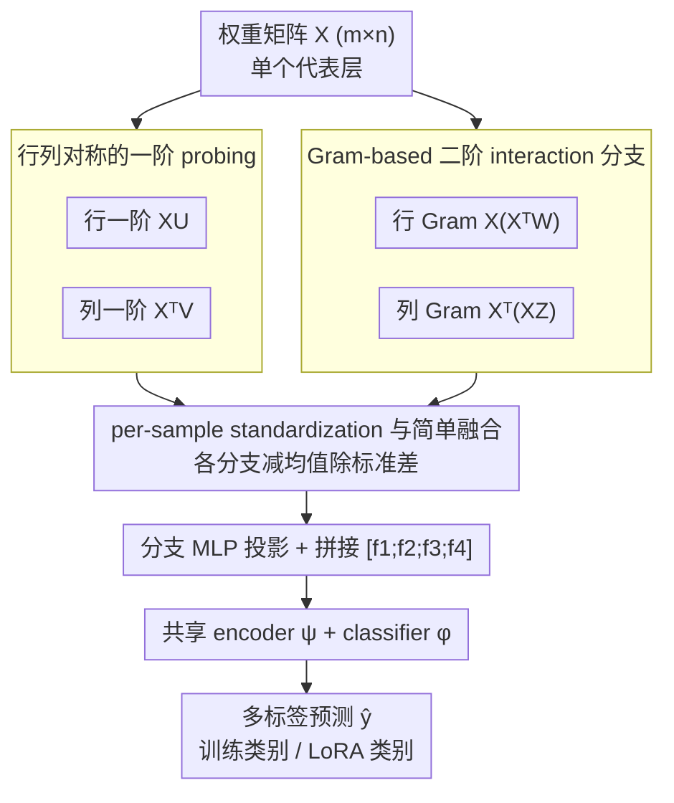

# What Linear Probes Miss: Multi-View Probing for Weight-Space Learning

**会议**: ICML2026  
**arXiv**: [2605.23410](https://arxiv.org/abs/2605.23410)  
**代码**: https://github.com/AI-hew-math/MVProbe  
**领域**: 可解释性 / 权重空间学习  
**关键词**: 权重空间学习, probing, 模型识别, Gram 矩阵, LoRA 识别  

## 一句话总结
这篇论文指出单视角一阶 probe 会漏掉权重矩阵的行列交互与二阶相关结构，并提出 MVProbe 用行/列一阶投影加行/列 Gram 分支的多视角表示，在 Model Jungle 和 Stable Diffusion LoRA 识别上显著超过 ProbeX。

## 研究背景与动机
**领域现状**：开源模型仓库快速膨胀，很多 checkpoint 缺少完整数据集、任务或能力说明。weight-space learning 试图直接从模型参数推断训练类别、数据分布或模型属性，不依赖外部 metadata。直接 flatten 权重既昂贵又破坏结构，因此 probing 方法用可学习 probe 向量穿过权重矩阵，生成轻量且 permutation-equivariant 的表示。

**现有痛点**：以 ProbeX 为代表的单层 probing 能扩展到较大模型，但主要依赖 $XU$ 这种单视角一阶投影。它本质上只沿 probe 方向看每一行的响应，容易忽略列侧结构，也看不到行与行、列与列之间的 pairwise correlation。不同权重矩阵只要在 probe nullspace 上不同，就可能产生完全相同的一阶响应。

**核心矛盾**：权重矩阵的语义不仅在单个 row 或 column 的线性投影中，也在神经元之间、输入特征之间的相似性结构中。要保持可扩展性，不能直接构造复杂图或 flatten 全参数；但要提高识别能力，又必须比一阶单视角 probe 捕获更多几何信息。

**本文目标**：作者希望保留 single-layer probing 的效率，同时补上 first-order probing 的表达力缺口。MVProbe 通过四个互补分支同时观察 row、column、row Gram 和 column Gram，并用理论分析说明为什么二阶分支能区分一阶 probe 区分不了的矩阵，以及为什么多阶响应需要标准化。

**切入角度**：论文把 probe 向量解释为 weight matrix 几何中的 learnable landmarks。一阶 probe 看权重到 landmark direction 的投影，二阶 Gram probe 看样本与样本之间的相似性到 landmark combination 的响应。这样可以在不显式形成巨大图结构的情况下获取 kernel-like 几何信息。

**核心 idea**：用多视角 probing 同时捕获权重矩阵的一阶方向响应和二阶相似性结构，并对每个分支做 per-sample standardization，使不同阶数的信号能平衡融合。

## 方法详解
MVProbe 输入单个代表层的权重矩阵 $X\in\mathbb{R}^{m\times n}$，目标是预测该 checkpoint 的属性标签，例如 fine-tuning 使用的 CIFAR-100 类别或 LoRA 对应的 ImageNet 类别。与 ProbeX 只做 $XU$ 不同，MVProbe 为同一个矩阵抽取四种响应：行侧一阶、列侧一阶、行侧 Gram 二阶、列侧 Gram 二阶。每个响应先单独标准化，再由 branch-specific projection 映射到共同维度，四个分支拼接后输入共享 encoder 和分类头。

### 整体框架
给定权重矩阵 $X$，MVProbe 学习四个 probe 矩阵 $U,V,W,Z$。行一阶分支计算 $XU$，列一阶分支计算 $X^\top V$；行 kernel 分支计算 $XX^\top W$，列 kernel 分支计算 $X^\top XZ$。为了避免二阶分支天然尺度更大，每个分支响应矩阵 $S$ 都做 $\tilde{S}=(S-\mu(S))/(\sigma(S)+\epsilon)$。标准化后，各分支经过 MLP 投影为 $f_i$，拼接为 $[f_1;f_2;f_3;f_4]$，再用共享 encoder $\psi$ 和 classifier $\phi$ 输出多标签预测 $\hat{y}$。

### 关键设计
1. **行列对称的一阶 probing**:

	- 功能：同时观察输出神经元聚合输入的模式和输入坐标连接输出的模式。
	- 核心思路：$XU$ 是 row-centric sketch，每行表示一个输出神经元沿 probe directions 的响应；$X^\top V$ 是 column-centric sketch，每行表示一个输入维度与输出侧 probe 的连接模式。理论上存在 $X_1\ne X_2$，使得 $X_1U=X_2U$ 但 $X_1^\top V\ne X_2^\top V$。
	- 设计动机：神经网络权重矩阵有输入/输出两侧几何，一阶单侧 probe 会把落在 probe nullspace 的变化完全忽略。加入转置视角能减少这种盲区。

2. **Gram-based 二阶 interaction 分支**:

	- 功能：捕获行与行、列与列之间的 pairwise similarity，补上一阶投影看不到的相关结构。
	- 核心思路：行 Gram $K_{row}=XX^\top$ 编码输出神经元之间的相似性，列 Gram $K_{col}=X^\top X$ 编码输入特征之间的相似性。MVProbe 不显式形成大 Gram 矩阵，而是结合 probe 计算 $XX^\top W=X(X^\top W)$ 和 $X^\top XZ=X^\top(XZ)$，复杂度仍为 $O(mnr)$。
	- 设计动机：Theorem 4.1 说明当 $rank(U)<n$ 时，可以构造两个一阶响应相同但二阶响应不同的矩阵。因此二阶分支不是重复信息，而是能分离一阶 probe 折叠掉的权重几何。

3. **per-sample standardization 与简单融合**:

	- 功能：防止二阶响应因尺度更大而压倒一阶分支，让四个视角都能参与决策。
	- 核心思路：理论分析表明，对于 i.i.d. Gaussian 权重，二阶响应范数期望与一阶响应范数的比值约为 $O(n\sigma^2)$，直接拼接会让 higher-order branch 主导。MVProbe 对每个样本、每个分支独立减均值除标准差，使分支 Frobenius norm 与元素数量相关而不由阶数决定。
	- 设计动机：多视角方法如果没有尺度控制，模型可能只学到最大幅度的分支。作者选择标准化 + 简单 concat，是因为实验中比 L2 normalize 或 learned weighting 更稳。

### 损失函数 / 训练策略
训练目标是标准多标签二分类损失 $\mathcal{L}=\mathcal{L}_{BCE}(\hat{y},y)$。实现中每个分支使用 $r=128$ 个 probe，projection dimension 为 128，最终表示维度为 512；Adam 学习率 $3\times10^{-4}$，batch size 128，训练 500 epochs，单张 RTX 3090 即可完成。Model Jungle 上使用各架构最优单层：ResNet 67、SupViT 59、MAE 64、DINO 47；Stable Diffusion LoRA 使用 layer 46。

## 实验关键数据

### 主实验
| 数据集 / 架构 | 指标 | MVProbe | 之前SOTA | 提升 |
|--------|------|------|----------|------|
| Model Jungle ResNet | Accuracy | 92.24 | ProbeX×4 87.16 | +5.08 |
| Model Jungle SupViT | Accuracy | 92.33 | ProbeX×4 90.33 | +2.00 |
| Model Jungle MAE | Accuracy | 81.62 | ProbeX×4 77.26 | +4.36 |
| Model Jungle DINO | Accuracy | 78.29 | ProbeX×4 73.25 | +5.04 |
| SD200 LoRA In-Dist. | Accuracy | 99.80±0.00 | ProbeX 98.48±0.48 | +1.32 |
| SD1k LoRA Zero-shot | Accuracy | 97.96±0.29 | ProbeX 52.42±2.48 | +45.54 |

### 消融实验
| 配置 | 关键指标 | 说明 |
|------|---------|------|
| $XU$ only | ResNet 90.42 / DINO 74.17 | 单一 row 一阶分支较强，但不如 full |
| $X^\top V$ only | ResNet 88.94 / DINO 72.04 | column 一阶提供互补但单独较弱 |
| second-order only | SupViT 92.04 / MAE 80.57 | 二阶组合在部分架构上接近 full，说明 Gram 结构信息很强 |
| MVProbe all four | ResNet 92.24 / SupViT 92.33 / MAE 81.62 / DINO 78.29 | 四分支在所有架构上最佳 |
| w/o Std vs w/ Std | 平均 65.9 → 68.8 | 标准化平均 +2.8，89.2% 层受益，符合理尺度分析 |
| all-layer win rate | 95.1% | 在 327 个可用层中，MVProbe 超过 ProbeX 的层占 311 个 |

### 关键发现
- 仅增加 ProbeX probe 数量不够。ProbeX×4 仍低于 MVProbe，说明收益主要来自视角设计，而不是参数量或 probe 数量。
- 二阶 Gram 分支提供的是互补信息，不是简单更强的一阶替代。DINO 上 second-order only 略低于 first-order，但 full 仍最佳，说明不同架构需要不同视角组合。
- 标准化是必要组件。没有 standardization 时多阶响应尺度不平衡，标准化后平均提升 +2.8%，尤其在 DINO 和 ResNet 上分别提升 +4.2 和 +4.1。
- LoRA 实验最能体现差距。在 SD1k 这种 1000 类、每类 5 个模型的困难设置下，ProbeX in-distribution 只有 35.75%，MVProbe 达到 97.88%。

## 亮点与洞察
- 论文把 probing 的失败说清楚了：不是 probe 方法天然不行，而是单视角一阶 sketch 会把 nullspace 和 pairwise interaction 结构折叠掉。Theorem 4.1 给这个直觉提供了干净的构造。
- MVProbe 的设计很工程友好。二阶分支看起来要形成 Gram 矩阵，但通过结合律写成 $X(X^\top W)$ 和 $X^\top(XZ)$，复杂度保持在 $O(mnr)$，训练时间几乎和 ProbeX×4 相当。
- per-sample standardization 是容易被忽略但很关键的细节。多分支模型常常直接 concat，本文用尺度理论解释为什么这样会偏向高阶响应，并用跨层消融验证。
- 从可解释性角度看，MVProbe 提供了一种分析 checkpoint 的轻量工具：即使没有 metadata，也能通过权重几何推断模型训练类别或 LoRA 属性，有助于模型仓库治理和模型选择。

## 局限与展望
- 方法仍依赖选择单个代表层。虽然 MVProbe 对层选择更稳，但 MAE、DINO 的绝对准确率仍低于 ResNet/SupViT，说明某些架构的单层权重信息不足。
- 当前任务主要是训练类别识别和 LoRA 类别识别。模型能力、偏见、安全属性、数据泄露等更复杂属性能否从同样表示中可靠预测，还需要实验。
- 多视角分支是手工设定的，未针对架构类型自适应。ResNet、ViT、LoRA 的最优视角和层深不同，未来可能需要 architecture-aware branch selection。
- 权重空间识别本身可能带来隐私和模型溯源风险。若能从权重恢复训练数据属性，需要配套讨论数据治理与发布策略。

## 相关工作与启发
- **vs ProbeX**: ProbeX 证明 single-layer probing 可扩展到大模型，但主要使用一阶单视角表示；MVProbe 在同样单层设置下补充列视角和 Gram 视角，明显提升准确率和层鲁棒性。
- **vs ProbeGen / Neural Graph**: ProbeGen 和图方法在小模型或多层设置有价值，但大权重矩阵上计算较重；MVProbe 保持 probing 的轻量性，同时引入二阶几何。
- **vs hand-crafted statistics / StatNN**: 统计量方法只看均值、方差、分位数等粗粒度特征，无法表达神经元相互关系；MVProbe 的 Gram 分支直接建模这种相关结构。
- **启发**: 对模型仓库搜索、LoRA 自动标注、checkpoint 去重和模型 provenance 分析，可以用 MVProbe 这类权重几何表示作为基础特征，再结合少量真实评估或元数据。

## 评分
- 新颖性: ⭐⭐⭐⭐ 多视角 probe 和 Gram 分支思路清楚，理论动机比单纯堆分支更有说服力。
- 实验充分度: ⭐⭐⭐⭐⭐ Model Jungle、全层 win rate、标准化消融、高阶分支消融和 SD LoRA 都覆盖到了。
- 写作质量: ⭐⭐⭐⭐ 方法和理论联系紧密，表格信息充分；部分符号较密，需要读者熟悉权重空间学习背景。
- 价值: ⭐⭐⭐⭐ 对模型识别、权重空间分析和模型仓库管理很有实用价值，也为 probing 方法如何超越一阶线性响应提供了清晰方向。

<!-- RELATED:START -->

## 相关论文

- [\[ICLR 2026\] Domain Expansion: A Latent Space Construction Framework for Multi-Task Learning](../../ICLR2026/interpretability/domain_expansion_a_latent_space_construction_framework_for_multi-task_learning.md)
- [\[ICLR 2026\] Beyond Linear Probes: Dynamic Safety Monitoring for Language Models](../../ICLR2026/interpretability/beyond_linear_probes_dynamic_safety_monitoring_for_language_models.md)
- [\[ACL 2026\] Rhetorical Questions in LLM Representations: A Linear Probing Study](../../ACL2026/interpretability/rhetorical_questions_in_llm_representations_a_linear_probing_study.md)
- [\[ACL 2026\] Linear Probes Detect Task Format, Not Reasoning Mode in Language Model Hidden States](../../ACL2026/interpretability/linear_probes_detect_task_format_not_reasoning_mode_in_language_model_hidden_sta.md)
- [\[AAAI 2026\] Share Your Attention: Transformer Weight Sharing via Matrix-Based Dictionary Learning](../../AAAI2026/interpretability/share_your_attention_transformer_weight_sharing_via_matrix-based_dictionary_lear.md)

<!-- RELATED:END -->
