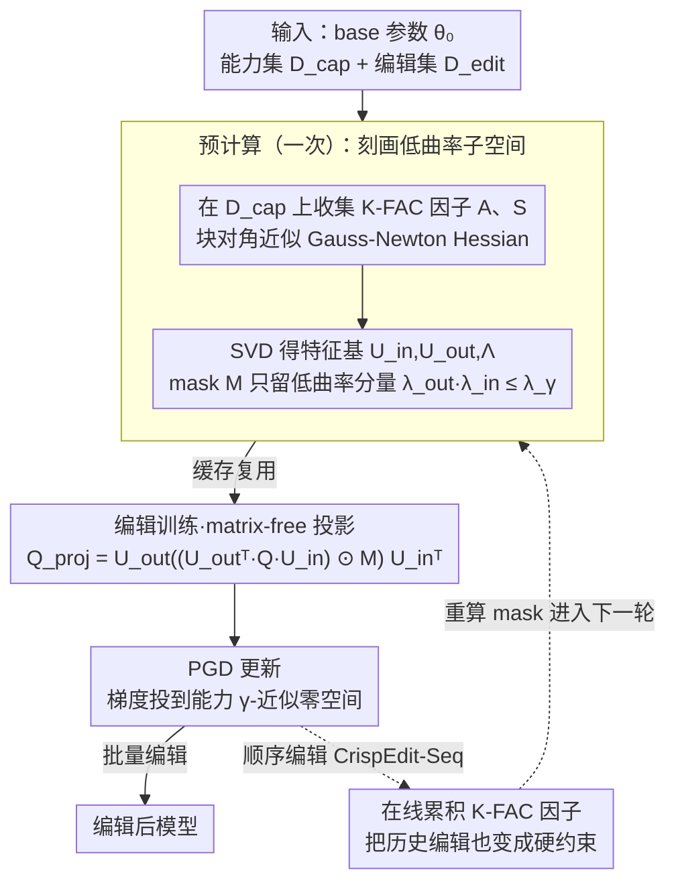

# CrispEdit: Low-Curvature Projections for Scalable Non-Destructive LLM Editing

**会议**: ICML 2026  
**arXiv**: [2602.15823](https://arxiv.org/abs/2602.15823)  
**代码**: https://github.com/zarifikram/CrispEdit  
**领域**: 模型编辑 / LLM 知识更新 / 二阶优化  
**关键词**: Gauss-Newton Hessian, K-FAC, Bregman divergence, 矩阵无关投影, 能力保持

## 一句话总结
把 LLM 编辑写成"最小化编辑损失 s.t. 能力损失不变"的约束优化, 用 Bregman 散度等价转化为 Gauss-Newton Hessian 的低曲率子空间投影, 再借 K-FAC + 一个无需显式构造投影矩阵的 Kronecker 特征基技巧, 让 3000 条编辑在 A40 上 6 分钟跑完, 同时把 LLaMA-3-8B 的 MMLU/IFEval/ARC-C/TruthfulQA/GSM8K 平均掉点压到 < 1%, 显著优于 AlphaEdit / MEMIT / 微调。

## 研究背景与动机
**领域现状**：LLM 知识会陈旧 (新事实、新事件), 全量 retrain 太贵, 模型编辑 (model editing) 通过定点更新少量权重来注入新事实、移除有害行为, 是更新模型的实用替代。代表方法 ROME / MEMIT 找"知识所在的 MLP 层"做最小二乘更新; AlphaEdit / Adam-NSCL 把更新投影到激活协方差零空间; LoRA / FT 直接微调小部分参数。

**现有痛点**：编辑成功率高的方法常常"安静地"破坏通用能力 (与 reward hacking 同源): MEMIT 在 LLaMA-3-8B 上做 3000 条 ZsRE 编辑后 MMLU 从 69.5 暴跌到 22.9、GSM8K 跌到 0; AlphaEdit 虽然好一些, MMLU 仍跌到 52.7、GSM8K 45.5。这类问题在"教师强制" 评测里看不到, 必须用 autoregressive 生成评估 (yang-etal-2025-mirage)。同时, 现有方法基于"哪里存知识"、"激活协方差零空间"等启发式, 假设强且与"能力保持"只是间接相关。

**核心矛盾**：要"成功改" 与 "不破坏通用能力" 同时实现, 等价于在一个高维参数空间里找到一个既能降低 edit loss 又几乎不动 capability loss 的方向; 这是个硬约束二次规划, 在 LLM 规模 ($10^{10}$ 参数) 下原本无法实现。

**本文目标**：(1) 把编辑形式化为约束优化, 不用 Lagrangian relax; (2) 用与"能力保持"直接挂钩的几何量替代启发式; (3) 让二阶方法在 billion 参数 transformer 上可行 (内存与时间都要现实)。

**切入角度**：作者注意到神经网络 loss landscape 高度各向异性 (Hessian 大多数特征值很小), 因此"沿低曲率方向走"几乎不影响 capability loss; 又注意到 Bregman 散度的二阶 Taylor 展开恰好等于 Gauss-Newton Hessian, 不需要 base model 收敛到驻点, 比标准 Hessian 假设更现实; 再用 K-FAC + Kronecker 特征基把 GNH 投影做成 matrix-free。

**核心 idea**：把编辑梯度投影到 "capability loss 的 γ-近似零空间", 该零空间由 Gauss-Newton Hessian 给出, 进一步用 K-FAC 的 $A_{l-1} \otimes S_l$ Kronecker 分解 + Hadamard mask 实现 $O(d_{\text{in}}^2 + d_{\text{out}}^2)$ 内存的 matrix-free 投影。

## 方法详解

### 整体框架
给定 base 参数 $\theta_0$、能力参考集 $\mathcal{D}_{\text{cap}}$ (默认 WikiText)、编辑集 $\mathcal{D}_{\text{edit}}$。Stage 1 (预计算, 仅一次): 对每个要编辑的层 $l$ 在 $\mathcal{D}_{\text{cap}}$ 上跑前向收集 K-FAC 因子 $A_{l-1} = \mathbb{E}[a_{l-1} a_{l-1}^\top]$ 与 $S_l = \mathbb{E}[g_l g_l^\top]$, 做 SVD 得 $U_{\text{in}}, U_{\text{out}}, \Lambda_{\text{in}}, \Lambda_{\text{out}}$, 算 mask $M_{ij} = \mathbb{1}[\lambda_i^{\text{out}} \lambda_j^{\text{in}} \le \lambda_\gamma]$。Stage 2 (编辑训练): 对 edit batch 算梯度 $Q_l$, 用 $Q_l^{\text{proj}} = U_{\text{out}}((U_{\text{out}}^\top Q_l U_{\text{in}}) \odot M) U_{\text{in}}^\top$ 投影后做 PGD 更新, 全程不显式构造 $d_{\text{in}} d_{\text{out}} \times d_{\text{in}} d_{\text{out}}$ 投影矩阵。Stage 3 (可选, 顺序编辑): 每轮在线累积 K-FAC 因子, 把上一轮编辑也变成新的"能力"约束。

### 关键设计

**1. Bregman 散度约束 → Gauss-Newton Hessian：给"能力不变"找一个不依赖收敛的二次形**

"能力 loss 几乎不变"这个硬约束若走标准二阶推导, 要求 base model 在能力数据上处于驻点 ($\nabla \mathcal{L}_{\text{cap}}(\theta_0) = 0$), 而真实 LLM 根本不满足。本文改用 Bregman 散度度量能力偏移: $\mathsf{d}^{\text{Breg}}_{\ell, y} = \ell(f_\theta(x), y) - \ell(f_{\theta_0}(x), y) - \langle \nabla \ell(f_{\theta_0}(x), y), f_\theta(x) - f_{\theta_0}(x) \rangle$, 它对 $\theta$ 做二阶 Taylor 展开后线性项天然为零, 于是直接得到 $\mathsf{d}^{\text{Breg}} \approx \frac{1}{2}(\theta-\theta_0)^\top G_{\text{cap}}(\theta-\theta_0)$, 其中 $G_{\text{cap}} = \mathbb{E}[J^\top H_{\hat y} J]$ 正是 Gauss-Newton Hessian (softmax + 交叉熵下与 Fisher 等价, K-FAC 是天然近似)。这一步把框架图里那张"低曲率子空间"建立在一个对 LLM 真正成立的几何量上。更关键的是 Proposition 1 证明 $\mathsf{Null}(K_{\text{cap}}^l) \subseteq \mathsf{Null}(G_{\text{cap}}^l)$——AlphaEdit / Adam-NSCL 投影所用的激活协方差零空间只是 GNH 零空间的一个子集, 因此它们是 CrispEdit 的过度保守特例; GNH 给出更大的"安全编辑"方向集, 能在更宽的方向上改而几乎不动能力。

**2. K-FAC + matrix-free Kronecker 投影：让二阶投影在十亿参数上跑得动**

有了 GNH 还不够——显式存一个 $d_{\text{in}} d_{\text{out}} \times d_{\text{in}} d_{\text{out}}$ 的投影矩阵, 在 LLaMA-3-8B 的 MLP (4096 × 14336) 上要约 3.4TB, 完全不可行。本文先用 K-FAC 把每层 GNH 块对角化成 Kronecker 积 $G_{\text{cap}}^l \approx A_{l-1} \otimes S_l$, 其特征值恰是两边之积 $\lambda_{ij} = \lambda_i^{\text{out}} \cdot \lambda_j^{\text{in}}$; 于是对一个梯度矩阵 $Q_l$, 投影只需"旋到特征基 → 用低曲率 mask $M$ 滤掉高曲率分量 → 旋回去": $Q_l^{\text{proj}} = U_{\text{out}}((U_{\text{out}}^\top Q_l U_{\text{in}}) \odot M) U_{\text{in}}^\top$, 全程仅 3 次矩阵乘 + 1 次 Hadamard, 不构造任何大投影矩阵, 存储从 $O(d_{\text{in}}^2 d_{\text{out}}^2)$ 压到 $O(d_{\text{in}}^2 + d_{\text{out}}^2)$ (约 200M 量级)。这些 K-FAC 因子在能力集 $\mathcal{D}_{\text{cap}}$ 上一次性预计算并缓存, 后续 3000 条编辑全部复用——这正是把编辑成本从"小时级"压到"分钟级"的来源。

**3. 顺序编辑 CrispEdit-Seq：把历史编辑也压进 K-FAC 因子缓解遗忘**

顺序编辑 (编辑分批到达、逐轮更新模型) 本质是持续学习: naive 做法每轮都得把全部历史编辑数据重跑一遍, 既存不下又容易遗忘前面已注入的知识。CrispEdit-Seq 抓住一个关键事实——$A_{l-1}, S_l$ 这组 K-FAC 因子本身就是"基模能力 + 历史编辑损失零空间"的充分统计量, 于是每完成一轮编辑就用 streaming average 把这一轮的因子在线合并进累积因子 $\{A_{\text{acc}}^{l-1}, S_{\text{acc}}^l\}$, 下一轮的投影 mask 据此重算。这样后续编辑会被自动迫使同时保留基模能力和此前所有编辑, 全程只存 $O(d_{\text{in}}^2 + d_{\text{out}}^2)$ 统计量、不保留任何历史编辑数据, 天然适合隐私敏感场景。

### 损失函数 / 训练策略
约束: $\min_\theta \mathcal{L}_{\text{edit}}(\theta)$ s.t. $(\theta - \theta_0)^\top G_{\text{cap}} (\theta - \theta_0) \le \varepsilon$。实操中, 用投影梯度下降 (PGD) 加 K-FAC 投影, 每 epoch 一次。能量阈值 $\gamma \in (0, 1)$ 控制投影激进程度 (论文搜 $\gamma = 1 - 10^{-k}, k \in [1/10, 7]$)。K-FAC 因子在 $\mathcal{D}_{\text{cap}}$ 上一次性预计算 + 缓存, 后续 3000 条编辑可复用; LLaMA-3-8B 上 3000 条编辑全流程仅 4–6 分钟 (cached projector)。

## 实验关键数据

### 主实验
LeNet-5 (MNIST → Fashion-MNIST) 控制实验先验证: PGD 投到 Hessian 低曲率子空间得到最好的 pre-train/fine-tune trade-off, K-FAC 与 EK-FAC 紧随其后, 远超激活协方差 (Adam-NSCL 启发式) —— 实证支撑 Proposition 1。

LLaMA-3-8B-Instruct 在 ZsRE / CounterFact / WikiBigEdit 上 3000 条编辑, 用 WILD (autoregressive) 评 edit reliability/generalization, 在 5 个 base benchmark (MMLU / IFEval / TruthfulQA / ARC-C / GSM8K) 评能力保持:

| 数据集 | 方法 | Edit Rel (QA Context) | Edit Gen (No Context) | MMLU | GSM8K | 时间 |
|--------|------|-----------------------|----------------------|------|-------|------|
| ZsRE | base | 2.1 | 2.1 | 69.5 | 73.5 | – |
| ZsRE | MEMIT | 0.1 | 0.1 | **22.9** | **0.0** | 9h27m |
| ZsRE | AlphaEdit | 70.1 | 39.4 | 52.7 | 45.5 | 7h19m |
| ZsRE | LocBF-FT | 69.5 | 22.1 | 69.5 | 75.5 | 22m |
| ZsRE | **CrispEdit** | **80.5** | **50.9** | **69.5** | **76.0** | **4m6s** |
| CounterFact | AlphaEdit | 74.9 | 44.1 | 47.4 | 37.5 | 5h56m |
| CounterFact | **CrispEdit** | **79.4** | 32.4 | **69.3** | **76.5** | **3m17s** |

CrispEdit 同时拿到最高编辑成功率与几乎零的能力掉点, 同时比 AlphaEdit 快 100×。

### 消融实验

| 配置 | Pre-train Acc | Fine-tune Acc | 说明 |
|------|---------------|---------------|------|
| Hessian (gold) | 99% (维持) | 高 | 控制基线, LeNet 可算 |
| GNH (Bregman) | ≈ Hessian | ≈ Hessian | Bregman 替代标准 Hessian 几乎无损 |
| K-FAC | 略低于 GNH | ≈ GNH | block-diag 近似有效 |
| EK-FAC (CrispEdit) | ≈ K-FAC | ≈ K-FAC | 与 K-FAC 相当 |
| Adam-NSCL (激活协方差) | 较差 | 较差 | 与 Prop 1 一致: 启发式过度保守 |

### 关键发现
- **AlphaEdit 是 CrispEdit 的严格子情形** (Proposition 1): $\mathsf{Null}(K_{\text{cap}}^l) \subseteq \mathsf{Null}(G_{\text{cap}}^l)$, 解释了为何 AlphaEdit 一保守就降 MMLU 17 个点, CrispEdit 能在更宽方向上自由编辑而保持能力。
- 用 autoregressive (WILD) 评编辑揭示了"teacher-forced 评测虚高"的现象: MEMIT 在传统 ROME 风格指标上看着行, 在 WILD 上 GSM8K 直接 0.0。
- 缓存 K-FAC 后, 编辑成本从"小时级"变成"分钟级", 真正达到产品化可用; 3000 edits 在 A40 上 6 min。
- LoRA / FT / FT Sequential 在 sequential 设置下能力掉点最严重 (LoRA Sequential GSM8K 0.0), CrispEdit-Seq 仍能保住 73–74。

## 亮点与洞察
- **Bregman 散度 → GNH 是一手漂亮的理论替换**: 解决了二阶方法"要求 base 收敛到驻点"的实操不可行性, 给所有基于 Hessian 的 LLM 编辑/微调/continual learning 工作打开了新窗口。
- **Proposition 1 直接收编了 AlphaEdit / Adam-NSCL 谱系**: 一句话告诉你"这些方法就是我的特例", 既给理论统一, 又解释了实验上的差距 —— 这种"框架性"工作很有引用价值。
- **Matrix-free Kronecker 投影**: 实际上是个 numerical linear algebra trick, 但带来的内存/速度收益 (3.4TB → 200MB, 数小时 → 数分钟) 是工程上的决定性突破; 这套技术可直接迁移到任何 K-FAC 应用 (二阶训练、curvature regularization 等)。
- **autoregressive (WILD) 评测**: 论文实验结果选择了 yang-etal-2025-mirage 提出的真实 generation 评估, 把很多看似 SOTA 的方法揭穿成"teacher-forced 假象"; 这条经验值得做编辑评测的人记住。

## 局限与展望
- 作者承认 K-FAC 是 block-diagonal 近似, 忽略了跨层耦合; 在编辑跨多层时近似可能掉精度, 论文用 EK-FAC 缓解但未根治。
- "能力参考集" $\mathcal{D}_{\text{cap}}$ 的选择影响很大 —— 若与目标 benchmark 分布不匹配, 投影方向就保不住对应能力。论文用 WikiText 通用语料, 但 GSM8K 等推理任务可能需 reasoning-heavy 校准集。
- 仅在 LLaMA-3-8B 与 Qwen-2.5-1.5B 上验证, 没在 70B+ 模型测试; K-FAC 因子规模仍随 $d^2$ 增长, 在更大模型 (尤其 MoE) 上仍需进一步压缩。
- $\gamma$ 是关键超参 (能量阈值), 需任务 tuning; 论文搜了 $1 - 10^{-k}$ 一段, 但没给"如何在新任务上零成本选 $\gamma$"的建议。
- 顺序编辑 CrispEdit-Seq 上仍有一定 generalization 掉 (ZsRE 上 80.5 → 71.1), 说明 streaming 累积 K-FAC 还不是完全无损。

## 相关工作与启发
- **vs AlphaEdit / Adam-NSCL**: 都做"投到能力零空间", 但用激活协方差 $K_{\text{cap}}$, Proposition 1 证明这是 CrispEdit 的过严特例; 实验上 MMLU 差 17 个点, 编辑成功率反而 CrispEdit 更高, 揭示"保守"未必"安全"。
- **vs MEMIT / ROME**: 都做"定位 + 编辑", 但在 autoregressive 评测下 MMLU 灾难性下跌 (22.9 vs 69.5); CrispEdit 不用"定位知识"假设, 适用范围更广。
- **vs LoRA / FT**: 微调类方法在 sequential 编辑下几乎全崩 (LoRA Sequential GSM8K 0.0), 因为没显式能力保持约束; CrispEdit 把约束做成投影器, 与 FT 互补。
- **vs UltraEdit**: UltraEdit 速度更快 (3 min), 但编辑成功率仅 20.0, CrispEdit 在 4 min 内拿到 80.5, 时间-质量 Pareto 上完胜。

## 评分
- 新颖性: ⭐⭐⭐⭐⭐ Bregman → GNH 替换 + matrix-free Kronecker 投影是清晰原创, Proposition 1 把多个先前方法收编为特例。
- 实验充分度: ⭐⭐⭐⭐ 2 base × 3 编辑数据集 × 5 能力 benchmark × autoregressive 评测, 含 sequential 设置与小尺度控制实验; 缺 70B+ 验证。
- 写作质量: ⭐⭐⭐⭐⭐ Figure 2 几何直觉、Proposition 1 严格证明、Algorithm 1/2 伪代码、实验表对应清晰, 写作精炼。
- 价值: ⭐⭐⭐⭐⭐ 给"产品化模型编辑"提供了一个真正可用的方案 (4 min, 1% 掉点), 同时把多个启发式编辑方法纳入统一框架, 学术与工程价值双高。

<!-- RELATED:START -->

## 相关论文

- [\[ICML 2026\] From Backward Spreading to Forward Replay: Revisiting Target Construction in LLM Parameter Editing](from_backward_spreading_to_forward_replay_revisiting_target_construction_in_llm_.md)
- [\[ACL 2026\] CLaRE-ty Amid Chaos: Quantifying Representational Entanglement to Predict Ripple Effects in LLM Editing](../../ACL2026/knowledge_editing/clare-ty_amid_chaos_quantifying_representational_entanglement_to_predict_ripple_.md)
- [\[ACL 2025\] ChainEdit: Propagating Ripple Effects in LLM Knowledge Editing through Logical Rule-Guided Chains](../../ACL2025/knowledge_editing/chainedit_propagating_ripple_effects_in_llm.md)
- [\[ICML 2026\] Reverse-Engineering Model Editing on Language Models](reverse-engineering_model_editing_on_language_models.md)
- [\[ICML 2026\] Do Text Edits Generalize to Visual Generation? Benchmarking Cross-Modal Knowledge Editing in UMMs](do_text_edits_generalize_to_visual_generation_benchmarking_cross-modal_knowledge.md)

<!-- RELATED:END -->
