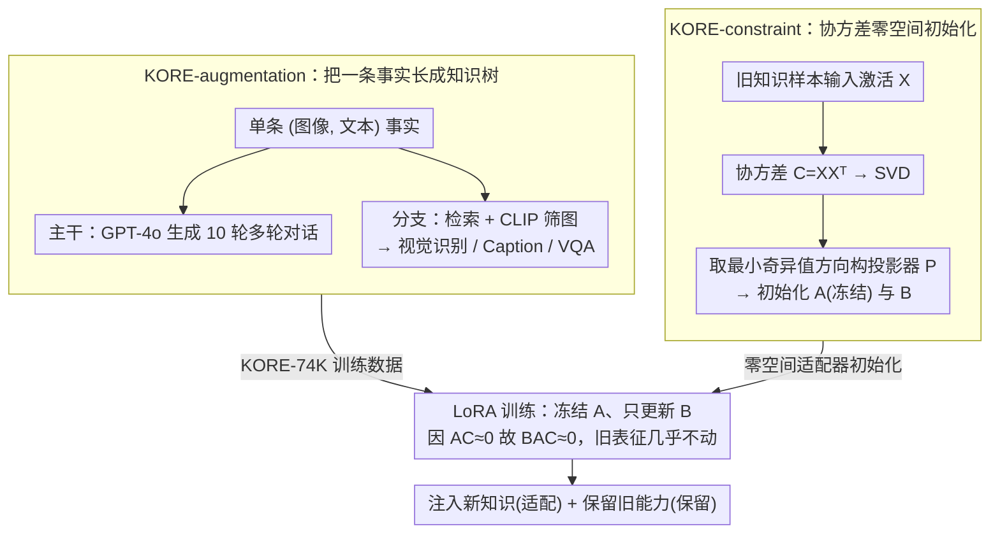

# KORE: Enhancing Knowledge Injection for Large Multimodal Models via Knowledge-Oriented Controls

**会议**: ICML 2026  
**arXiv**: [2510.19316](https://arxiv.org/abs/2510.19316)  
**代码**: 未明确（论文提及"接受后公开"）  
**领域**: 知识编辑 / 多模态 / 持续学习  
**关键词**: 知识注入, 多模态大模型, 灾难性遗忘, 零空间投影, 数据增强

## 一句话总结
KORE 通过两阶段"知识导向控制"为 LMM 注入新知识 — 一边把单条事实自动扩成结构化的多轮对话+指令任务（提升泛化），一边用先前知识的协方差矩阵零空间初始化 LoRA 适配器（最小化对旧能力的干扰），在 LLaVA-v1.5 / Qwen2.5-VL 上同时实现强适配和强保留。

## 研究背景与动机
**领域现状**：LMM 把世界知识冻结在预训练权重里，但现实世界在变化（新人物、新事件、新产品），所以需要"知识注入"机制：既能学到新知识（adaptation），又不能忘掉老本事（retention）。

**现有痛点**：(1) Full fine-tuning 计算贵且容易过拟合到训练样本表面，无法泛化（如 EVOKE 上 Full-FT 只是把训练 prompt 复述一遍）；(2) PEFT 方法（LoRA、Prompt Tuning）虽然便宜但仍会灾难性遗忘；(3) 持续学习方法（EWC、LwF）能保留旧知识但抑制了新知识吸收，常出现"答非所问 + 指令遗忘"现象。

**核心矛盾**：知识 internalize 需要充足、多样的训练信号 → 容易破坏既有表征；保护旧表征又限制了对新概念的塑形能力 — 适配性和保留性此消彼长。

**本文目标**：(1) 用知识增强提升新知识的真正"internalization"而非死记硬背；(2) 用结构约束让 fine-tune 方向"不去碰"承载旧能力的子空间；(3) 把两者整合到一套两阶段优化里，可适配不同 LMM 架构与规模。

**切入角度**：作者注意到 (a) 普通文本/图像增强只是表层 paraphrase，不能构造知识之间的逻辑关联；(b) 旧知识本质上是 linear layer 输入激活的协方差结构 — 在协方差矩阵的零空间里改参数等价于"不改变旧输入下的输出"。

**核心 idea**：把"知识注入"控制变成两件事 — 数据维度上把一条知识展开成系统化的知识树（trunk: 多轮对话, branches: 视觉识别/Caption/VQA 任务），参数维度上把 LoRA 的 $A$ 矩阵初始化在旧知识协方差零空间，让 $AC\approx 0$，从而 $BAC\approx 0$，旧表征几乎不动。

## 方法详解

### 整体框架
KORE 把"既要学新知识、又不能忘旧本事"这对矛盾拆成数据和参数两条独立可控的线，组成一个两阶段流程。前一阶段 KORE-augmentation 在数据侧动手，把每条孤立的 (image, text) 事实自动膨胀成一棵结构化"知识树"，让模型从多个角度反复消化同一条知识；后一阶段 KORE-constraint 在参数侧动手，把 LoRA 适配器初始化到"旧知识激活协方差"的零空间里，使新知识的写入方向天然绕开承载旧能力的子空间。两阶段各管一头——增强主攻适配、约束主攻保留——最后合到一次标准 LoRA 训练里：冻结落在零空间的 $A$、只更新 $B$，用增强出来的知识树数据做监督。

### 关键设计

**1. KORE-augmentation：把一条事实长成一棵知识树**

传统增强（同义词替换、图像旋转）只是表层 paraphrase，把一条知识扩成若干孤立样本，扩大了曝光面却没建立知识内部的逻辑关联，模型学到的往往是"复述训练 prompt"而非真正 internalize。KORE 改成"主干 + 分支"的树状展开：主干是一条多轮对话流，由启发式模板 Q&A 加上 GPT-4o 基于原文生成的 10 轮对话构成；分支则是三类视觉指令任务——以 News 标题或 Entity 名为关键词从 Google 检索 top-5 图、再用 CLIP 余弦相似度筛出 2 张相关图后，分别构造视觉识别（"图中是 X 吗？"答 Yes）、Image Caption（GPT-4o 生成的段落摘要）和 VQA（GPT-4o 产出 $(Q,A,S,H)$ 四元组，$S$ 为主语、$H$ 为上位词供检索）。同一条知识从对话、识别、描述、问答四个抽象层级被反复呈现，相当于逼模型在不同任务上 cross-validate 这条事实，从而真正吸收而非死记。作者用 EVOKE 原始知识跑出 KORE-74K 数据集（75K 对话 + 46K VQA）。

**2. KORE-constraint：协方差零空间初始化让新知识绕开旧表征**

旧知识的本质是各线性层"输入激活的协方差结构"，只要参数改动不改变旧输入下的输出，旧能力就不受影响。KORE 据此把 LoRA 的低秩矩阵 $A$ 钉死在旧任务激活协方差的零空间里：对每个线性层收集激活 $X\in\mathbb{R}^{d_{in}\times BL}$，算出 $C=XX^\top$，做 $\text{SVD}(C)=\sum_i\sigma_i u_i u_i^\top$，取最小奇异值对应的 $r$ 个左奇异向量拼成 $\hat U$，得到投影器 $P=\hat U\hat U^\top$；再用 $\text{SVD}(W_0 P)=U^*\Sigma^*(V^*)^\top$ 初始化 $B=U^*\sqrt{\Sigma^*}$、$A=\sqrt{\Sigma^*}(V^*)^\top$，并把原权重改成 $W_0'=W_0-BA$ 保证训练起点行为不变。训练时冻结 $A$ 只更新 $B$——因为 $A$ 落在零空间使 $AC\approx 0$，无论 $B$ 怎么变都有 $BAC\approx 0$，旧任务输入下输出几乎不动。这把"旧知识保护"从需要 KL 正则或 replay 数据的损失约束，变成一次 SVD 就搞定的纯几何隔离，等价于把新旧知识塞进两个正交子空间。作者还用 CO-SVD 实验（图 4）验证了协方差确实捕获了多模态知识：用 MME / ScienceQA 协方差去掉小奇异值后性能保留远好于 plain SVD / ASVD，且不同任务呈现可区分的 outlier 模式。更进一步，这套约束的"保护对象"是可配置的：默认从 OneVision 的 4 个子集（General / Doc·Chart / Math / OCR）混采 256 例得到覆盖广谱能力的"通用协方差"，也可只从某个目标 benchmark（如 MME / ScienceQA / POPE）采 256 例构建"专用协方差"，优先保护该 benchmark——图 6 显示 MME 专用约束让 MME 涨 7.17 且其他维度无明显回退。于是同一套机制既能做"一刀切"的通用保留，也能切到"按需保留"，适配不同部署场景在意的旧能力。

### 损失函数 / 训练策略
标准 LoRA cross-entropy 损失，无额外正则。LLaVA-v1.5 (7B)：rank=235、batch=54、$\eta=2\times10^{-4}$、cosine decay、6 epoch、AdamW、DeepSpeed Zero3、4 张 H100；7B/13B 用相同配置，Qwen2.5-VL 用 rank=274、batch=24、grad accum=8。covariance 提取只跑一次推理。

## 实验关键数据

### 主实验
LLaVA-v1.5 (7B) 上 KORE 与 9 个 baseline 在 EVOKE（适配）+ 12 个保留 benchmark 上的整体对比：

| 方法 | 参数量 | K.A(EVOKE F1) | K.R(均值) | Avg | HARS |
|------|--------|---------------|-----------|-----|------|
| Pre-trained | — | 9.34 | 54.32 | 46.74 | — |
| Full-FT | 6759M | 15.17 | 16.09 | 31.66 | 24.13 |
| LoRA | 340M | 18.31 | 41.38 | 33.47 | 25.12 |
| Replay | 340M | 17.98 | 51.67 | 43.00 | 28.83 |
| EWC | 340M | 19.42 | 43.50 | 35.14 | 26.30 |
| CIA | 340M | 20.27 | 44.52 | 35.99 | 26.69 |
| **KORE (r=235)** | 340M | **41.26** | 51.75 | **40.00** | **82.81** |
| **KORE (r=256)** | 369M | **41.32** | 51.50 | **42.10** | **84.93** |

KORE 在适配上把 LoRA 的 F1 从 18.31 推到 41.26，保留分数还能与 Replay 持平 — 完全跨越了适配-保留 trade-off。

### 消融实验
分维度保留 + 关键消融：

| 配置 | K.A | K.R | Avg | HARS | 解读 |
|------|------|-----|-----|------|------|
| Full KORE (r=235) | 35.96 | 40.00 | 37.98 | 82.81 | 完整 |
| W/o Augmentation | 14.57 | 40.16 | 27.37 | 64.14 | 适配掉 21.4 — 增强是适配关键 |
| W/o Constraint | 38.82 | 35.78 | 37.30 | 79.04 | 保留掉 4.2 — 约束是保留关键 |
| W/o 冻结 $A$ | 36.85 | 38.92 | 37.88 | 81.96 | 冻结 $A$ 边际正贡献 |
| KORE-aug vs 文本知识感知增强 | K.A 38.82 vs 20.29 | — | — | — | 知识树增强超出表层 paraphrase 18.5 分 |

13B 和 Qwen2.5-VL 上同样模式：HARS 分别 85.46 和 67.10，远超 Replay 的 66.73 / 30.89。

### 关键发现
- **两个机制刚好互补**：去掉增强主要伤适配（K.A 21↓），去掉约束主要伤保留（K.R 4↓）；只有同时使用才能在适配和保留两个维度都拿满分。
- **知识树式增强真实有效**：相同的 GPT-4o 增强器下，KORE-aug 比"知识感知文本增强"高 18.5 K.A，说明性能不是从 GPT-4o 蒸馏来的，而是来自"主干+分支"的结构化设计。
- **覆盖更精细维度**：在 4 个新闻子类 + 4 个实体子类上，KORE 全面超越所有 baseline；在 OCR / MMMU / HallB 等保留维度上达到最佳分。
- **可定制约束实用**：用 MME 子集做 covariance 时 MME 涨 7.17 而其他维度无明显跌；说明可以按部署场景调"保护对象"。
- **架构无关、可扩展**：在 LLaVA-13B 上 HARS 85.46（更大模型增强效果更显著）；在架构不同的 Qwen2.5-VL 上同样优于 Replay，说明 KORE 是真正的通用框架。

## 亮点与洞察
- "知识树状增强"是个洞察很深的设计：传统增强把一条知识扩成 N 条孤立样本，KORE 把它们之间的语义关联也建出来，相当于教模型"这条知识能用来回答这些不同问题"。这种结构化曝光让 internalization 不再是 memorization。
- 用"输入激活协方差的零空间"作为 LoRA 初始化基底，把"旧知识保护"变成了一个干净的线性代数操作 — 不需要 KL 正则、不需要 replay 数据，只要做一次 SVD 就行。这种"几何隔离 vs 损失正则"的设计更可扩展。
- 冻结 $A$ 只动 $B$ 是 LoRA 不对称性研究的巧妙利用：理论保证只要 $A$ 在零空间，无论 $B$ 怎么变 $BAC\approx 0$ 都成立 — 这把"保护"从"训练动态约束"变成了"参数化结构约束"。
- 提出 HARS（适配-保留调和分数）正面治理了过往综合指标偏 bias 的问题，与 Precision-Recall F1 类比，做综合排名很自然。

## 局限与展望
- 协方差 $C$ 用 256 个样本估算，对长尾或新颖输入的覆盖可能不足；尽管作者展示了"32 样本就够用"的鲁棒性，但极端 OOD 场景未充分测。
- 增强依赖 GPT-4o，构造 KORE-74K 成本较高，且 GPT-4o 自身偏见会传到学生模型。
- 约束方法只考虑了"前向输出不变"，没有约束注意力 pattern 或中间层语义，可能在多步推理任务上不如显式 replay。
- LoRA rank 越大效果越好，但参数预算与性能存在 trade-off；如何自适应选 rank 仍未解决。
- 没有评测连续多轮注入（task t+1, t+2, ...），真正的"lifelong"场景下零空间会被逐步耗尽，需要扩展。

## 相关工作与启发
- **vs AlphaEdit (Fang 2025)**：都用零空间投影做知识编辑，但 AlphaEdit 针对纯 LLM 的事实编辑且无数据增强；KORE 是 LMM 场景且把增强 + 约束捆绑成两阶段优化。
- **vs CorDA / CIA / EWC / LwF**：传统持续学习靠正则化约束所有参数，KORE 用几何隔离只让"会破坏旧表征"的方向受限，干扰小、容量大。
- **vs Replay (image+text rehearsal)**：Replay 需要存储原始旧数据有隐私风险；KORE 只需一次性的协方差矩阵（聚合统计），更轻量且隐私友好。
- **vs SEFE**：SEFE 把遗忘分为表面 + 本质两类，KORE 用增强 + 约束分别对应两侧，思路相通但实现更具操作性。

## 评分
- 新颖性: ⭐⭐⭐⭐ — 知识树增强 + 协方差零空间 LoRA 这两件事单独都不是首创，但作为"两阶段控制"系统组合并落到多模态场景上是新颖的。
- 实验充分度: ⭐⭐⭐⭐⭐ — 12 个保留 benchmark × 3 模型规模 × 9 个 baseline，附录中 13B 与 Qwen 都跑了，证据非常完整。
- 写作质量: ⭐⭐⭐⭐ — 概念清楚、图示直观（图 1/2/3 信息量很大），数学推导（定理 C.1/C.2）严谨。
- 价值: ⭐⭐⭐⭐ — 为生产环境下的 LMM 知识更新提供了一套可操作的、成本可控的方案；HARS 指标也将成为后续工作参考。

<!-- RELATED:START -->

## 相关论文

- [\[ICLR 2026\] When Large Multimodal Models Confront Evolving Knowledge: Challenges and Explorations](../../ICLR2026/knowledge_editing/when_large_multimodal_models_confront_evolving_knowledge_challenges_and_explorat.md)
- [\[ICML 2026\] The Labyrinth and the Thread: Rethinking Regularizations in Sequential Knowledge Editing for Large Language Models](the_labyrinth_and_the_thread_rethinking_regularizations_in_sequential_knowledge_.md)
- [\[ACL 2025\] Structure-aware Domain Knowledge Injection for Large Language Models](../../ACL2025/knowledge_editing/structure-aware_domain_knowledge_injection_for_large_language_models.md)
- [\[ICML 2026\] Revisiting Parameter-Based Knowledge Editing in Large Language Models: Theoretical Limits and Empirical Evidence](revisiting_parameter-based_knowledge_editing_in_large_language_models_theoretica.md)
- [\[AAAI 2026\] Hybrid-DMKG: A Hybrid Reasoning Framework over Dynamic Multimodal Knowledge Graphs for Multimodal Multihop QA with Knowledge Editing](../../AAAI2026/knowledge_editing/hybrid-dmkg_a_hybrid_reasoning_framework_over_dynamic_multimodal_knowledge_graph.md)

<!-- RELATED:END -->
