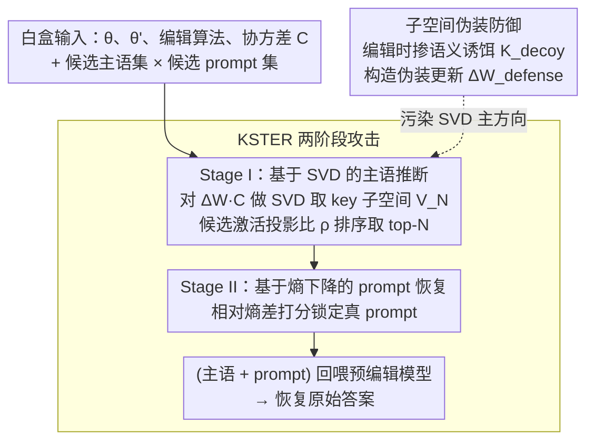

# Reverse-Engineering Model Editing on Language Models

**会议**: ICML 2026  
**arXiv**: [2602.10134](https://arxiv.org/abs/2602.10134)  
**代码**: https://github.com/reanatom/EditingAttack  
**领域**: 知识编辑 / LLM 安全  
**关键词**: locate-then-edit、逆向工程攻击、子空间重构、熵下降、子空间伪装防御

## 一句话总结
论文揭示 locate-then-edit 类知识编辑方法（ROME/MEMIT/AlphaEdit）的参数更新矩阵会通过其行空间泄露"被编辑主语"的指纹，并提出两阶段攻击 KSTER（先用 SVD 恢复主语，再用前后模型的熵差恢复 prompt），同时给出基于"语义诱饵"注入的子空间伪装防御方案。

## 研究背景与动机

**领域现状**：LLM 在预训练时不可避免地记住了海量敏感信息（个人隐私、版权片段等）。重新训练成本极高，因此 *model editing* 成为主流缓解方案，其中 **locate-then-edit** 范式（ROME/MEMIT/AlphaEdit）因可解释、零推理开销、可定位 FFN 参数而被广泛用作"事后删除/修改敏感知识"的工具，常被当作隐私保护的基础设施。

**现有痛点**：以往的研究都集中在编辑的 *效果* 与 *泛化性* 上（编完是否准、是否破坏其他知识），却几乎没人系统问过：编辑动作本身是否反过来成了一条 *泄露侧信道*？如果攻击者能同时拿到编辑前后的权重 $\theta$ 和 $\theta'$，被擦除的内容是否会从权重差 $\Delta\theta$ 里反推回来？

**核心矛盾**：locate-then-edit 的核心解析解（ROME 是秩-1，MEMIT 是低秩最小二乘）天然把"被编辑主语的 key 向量"作为低维结构压进了 $\Delta\mathbf{W}$。**用来保护隐私的机制本身**变成了被编辑信息的高保真签名——擦除越精准，签名越纯净。

**本文目标**：(1) 形式化证明 $\Delta\mathbf{W}$ 编码了被编辑主语的可恢复"指纹"；(2) 设计实际攻击恢复 *主语 + prompt 模板 + 原始答案*；(3) 提出一种不损害编辑效用的防御策略。

**切入角度**：作者观察到，FFN 中"主语最后一个 token 在被编辑层的隐状态"具有强烈的 **subject invariance**——同一主语在不同 prompt 模板下激活几乎一致（cos sim 接近 1），注意力也集中在主语 token。这意味着 $\mathbf{K}$ 矩阵几乎只编码"主语身份"，与 prompt 上下文解耦，攻击者根本不需要先猜对 prompt 就能锁定主语。

**核心 idea**：用 Woodbury 恒等式把 MEMIT 的更新改写成 $\Delta\mathbf{W} = \mathbf{R}(\mathbf{I}+\mathbf{K}^\top\mathbf{C}^{-1}\mathbf{K})^{-1}\mathbf{K}^\top\mathbf{C}^{-1}$，进而证明 $\mathrm{RowSpace}(\Delta\mathbf{W}\mathbf{C}) \subseteq \mathrm{ColSpace}(\mathbf{K})$——对 $\Delta\mathbf{W}\mathbf{C}$ 做 SVD 就直接得到"主语 key 子空间"，把候选主语的激活向该子空间投影，投影比最大的就是被编辑主语。第二阶段用"编辑后模型对真 prompt 熵几乎为 0"这一过拟合现象，做相对熵下降排序恢复 prompt。

## 方法详解

### 整体框架
论文要回答的是"拿到编辑前后两份权重，能不能把被擦除的隐私反推回来"，并把它拆成一条两阶段攻击 KSTER 加一套防御。威胁模型设白盒攻击者持有 $\theta$、$\theta'$、编辑算法和协方差 $\mathbf{C}$，外加一个由公开领域知识构造的"候选主语集 × 候选 prompt 集"。攻击先在 Stage I 从权重差 $\Delta\mathbf{W}$ 的代数结构里捞出被编辑主语，再在 Stage II 用前后模型的熵差为每个主语锁定真 prompt，最后把"主语+prompt"喂回预编辑模型一次就拿到原始答案；防御 Subspace Camouflage 则反向操作，在编辑时主动掺入"语义诱饵"主语，让攻击者 SVD 看到的子空间被诱饵污染。

### 关键设计

**1. 基于 SVD 的主语推断（Stage I）：把"反推主语"降格成一次子空间投影**

攻击者真正想要的是被编辑主语的 key 向量 $\mathbf{K}$，但 $\Delta\mathbf{W}$ 里 $\mathbf{R}$ 未知、$\mathbf{K}$ 无法直接解出。作者的破局点是只需要 $\mathbf{K}$ 张成的*子空间*而非 $\mathbf{K}$ 本身：Woodbury 改写已证明 $\mathrm{RowSpace}(\Delta\mathbf{W}\mathbf{C})\subseteq\mathrm{ColSpace}(\mathbf{K})$，于是先由 $\mathrm{rank}(\Delta\mathbf{W})$ 估出编辑条数 $N$（$\mathbf{R}$、$\mathbf{K}$ 满列秩时严格成立），再对 $\mathbf{M}=\Delta\mathbf{W}\mathbf{C}$ 做 SVD，取前 $N$ 个右奇异向量 $\mathbf{V}_N$ 当作重构出的 key 子空间。判定某个候选主语 $s_i^c$ 是否被编辑，只要用一个通用模板从预编辑模型取出它的激活 $\mathbf{k}_i^c=\mathcal{F}_\theta(s_i^c,\mathcal{T}_{\rm gen})$，看它落进该子空间的比例——投影比定义为 $\rho_i^c = \|\mathbf{V}_N^\top \mathbf{k}_i^c\|_2 / \|\mathbf{k}_i^c\|_2$，按 $\rho$ 排序取 top-$N$ 即为推断主语。这一步之所以成立，靠的正是 subject invariance：通用模板下的激活和真编辑模板下的激活几乎重合，标量投影比就足以区分。式中乘 $\mathbf{C}$ 是为抵消协方差对原始行空间的几何畸变，附录 G.16 进一步证明该判别对 $\mathbf{C}$ 的估计噪声鲁棒；AlphaEdit 因带零空间投影 $\mathbf{P}$，需在 $\mathbf{P}$ 调整后的版本上打分（Lemma G.18）。

**2. 基于熵下降的 prompt 恢复（Stage II）：拿"编辑过拟合"当判别信号**

锁定主语后还要还原编辑用的 prompt 模板。直接比对前后模型的 logit 余弦相似度在大 batch 下会被多条编辑互相串扰，作者换了个对编辑目标更敏感的量：编辑的本质就是把目标 prompt 的下一 token 分布压成近似 one-hot，所以真 prompt 上的熵会塌缩得格外厉害。对每个候选对 $(\hat{s}_i, r_j^c)$ 分别算预/后编辑模型的香农熵 $H(\hat{s}_i,r_j^c;\theta)$ 和 $H(\hat{s}_i,r_j^c;\theta')$，按相对熵下降打分 $\mathrm{Score}=\dfrac{H(\hat{s}_i,r_j^c;\theta)-H(\hat{s}_i,r_j^c;\theta')}{H(\hat{s}_i,r_j^c;\theta')+\epsilon}$，取 top-$N_r$。分母的妙处在于专门放大那些被推到近零熵的过拟合 prompt，从而把被编辑的那一条顶到前列；由于熵差只对"信息塌缩"方向敏感、恰好对齐编辑算法的优化目标，这个判别在 $N=100$ 的大批量下依旧稳定。

**3. 子空间伪装防御（Subspace Camouflage）：用语义诱饵主动污染攻击者的 SVD**

防御方希望在不损编辑效用的前提下，把 $\Delta\mathbf{W}$ 的行空间从真实的 $\mathrm{ColSpace}(\mathbf{K})$ 挪到一个掺了诱饵的 $\mathrm{ColSpace}(\tilde{\mathbf{K}})$，让 Stage I 的 SVD 主方向被带偏。具体做法是从一个不相关的真实主语池采诱饵 key $\mathbf{K}_{\rm decoy}$，按 $\tilde{\mathbf{K}} = \mathbf{K} + \alpha \cdot \frac{\|\mathbf{K}\|_2}{\|\mathbf{K}_{\rm decoy}\|_2}\mathbf{K}_{\rm decoy}$ 构造伪装 key，再解出唯一满足"行空间陷入 $\mathrm{ColSpace}(\tilde{\mathbf{K}})$、且对原始 keys 表现不变（$\Delta\mathbf{W}_{\rm defense}\mathbf{K}=\Delta\mathbf{W}\mathbf{K}$）"的防御更新 $\Delta\mathbf{W}_{\rm defense} = \Delta\mathbf{W}\mathbf{K}(\tilde{\mathbf{K}}^\top \mathbf{C}^{-1}\mathbf{K})^{-1}\tilde{\mathbf{K}}^\top \mathbf{C}^{-1}$（配小岭正则 $\lambda=10^{-8}$ 稳数值）。和单纯加随机噪声不同，诱饵对应真实激活，会"主动竞争"地把攻击者的奇异向量拉向自己；附录 H.3/H.4 还证明攻击者既判定不了防御是否启用，也无法从 $\tilde{\mathbf{K}}$ 反推 $\mathbf{K}$——因为反推所需的 $\mathbf{R}$ 本身就等价于直接拿到被保护知识，形成循环依赖，从信息论上堵死了后门。

整套方法不涉及任何训练：攻击是纯几何加信息论的一次性运算，防御只是对原编辑 closed-form 解的一次等价改写，仅多一个控制保护强度的标量超参 $\alpha$（实验取 $\alpha\in[1,5]$）。

## 实验关键数据

模型：GPT-J (6B)、Llama3-8B-Instruct、Qwen2.5-7B-Instruct；编辑方法：ROME / MEMIT / AlphaEdit；数据集：CounterFact、zsRE；攻击批量 $N\in\{10,50,100\}$。

### 主实验：主语推断 top-N 召回（CounterFact）

| Model | $N$ | MEMIT (KSTER 白盒) | MEMIT 灰盒基线 | AlphaEdit (KSTER 白盒) | AlphaEdit 灰盒基线 |
|-------|-----|--------------------|----------------|-------------------------|---------------------|
| GPT-J | 100 | **0.95** | 0.88 | **0.96** | 0.86 |
| Llama3-8B-Instruct | 100 | **0.99** | 0.68 | **0.99** | 0.45 |
| Qwen2.5-7B-Instruct | 100 | **0.94** | 0.59 | **0.95** | 0.51 |

prompt 恢复（Llama3-8B-Instruct, CounterFact, $N=100$）：top-1 0.51 / top-5 0.81 / top-20 0.94，语义相似度 0.88；端到端原始答案恢复 top-20 达 0.74。

### 消融 / 分析：防御端 camouflage 强度 $\alpha$（MEMIT, Llama3-8B-Instruct, CounterFact）

| $\alpha$ | 真主语平均排名（越高越安全） | Efficacy | Generalization | Fluency |
|----------|------------------------------|----------|----------------|---------|
| 0（无防御） | 50.83 | 0.95 | 0.52 | 6.33 |
| 1 | 148.62 | 0.98 | 0.49 | 6.33 |
| 3 | 206.47 | 0.96 | 0.52 | 6.34 |
| **5** | **394.12** | 0.96 | 0.53 | 6.32 |
| 7 | 634.39 | 0.91 | 0.42 | 6.26 |

### 关键发现
- **灰盒 → 白盒鸿沟随 $N$ 急剧拉大**：$N=10$ 时灰盒尚能匹配，$N=100$ 时灰盒崩到 0.45–0.68，白盒稳在 0.94–0.99——说明 $\Delta\mathbf{W}$ 的代数结构比 logit 差异承载了多得多的可分离信息。
- **协方差估计极其鲁棒**：默认 $\mathbf{C}$ 由 10 万条 Wikipedia 估计，但实验显示 100 条样本就收敛；AlphaEdit 在 10 条样本下仍保持峰值——侧面说明攻击不需要"知道训练分布"。
- **失败模式呈双峰**：真 prompt 排名落在 6–100 区段是 *语义泛化误差*（模型把主语错判为更广类别，激活了同类竞争 prompt）；落在 700–1000 是 *优化约束冲突*（编辑目标与 $\mathbf{C}$ 统计先验矛盾，导致编辑后熵反而升高，让熵差判别失效）。
- **防御的 sweet spot 在 $\alpha=5$**：真主语排名抬到 394，编辑效果几乎不掉；但 $\alpha=7$ 时 AlphaEdit efficacy 暴跌到 0.46，因 $\mathbf{P}$ 的小特征值使矩阵求逆病态化，导致更新矩阵不稳定。

## 亮点与洞察
- **"安全机制反成侧信道"的优雅刻画**：用 Woodbury 恒等式一步把 MEMIT 的解析解改写成"$\mathbf{K}$ 的列空间显式出现在 $\Delta\mathbf{W}\mathbf{C}$ 的行空间里"——把一个看起来纯工程的"权重 diff"问题，转化为标准的子空间恢复问题，整套攻击随之退化成一次 SVD 加一次投影，思路非常干净。
- **subject invariance 的实证发现可独立复用**：FFN 中"主语最后一个 token 的激活"几乎与 prompt 无关，这一发现对理解 LLM 的事实存储位置、设计未来的编辑/解释方法都有参考价值，不止用于攻击。
- **熵下降比 logit 差更鲁棒**：编辑的本质就是"在目标 prompt 上把分布压成 near one-hot"，作者把这个副产物直接当作判别信号，分母放大近零熵——这种"利用对手过拟合"的视角值得迁移到其他白盒模型分析任务。
- **防御的"循环依赖"论证巧妙**：诱饵之所以稳，是因为要反推真 $\mathbf{K}$ 必须先拿到 $\mathbf{R}$，而 $\mathbf{R}$ 的构造本身又需要原始 prompt 和答案——攻击者绕开防御所需的信息就等于攻击的最终目标，从信息论上把后门堵死。

## 局限与展望
- 攻击依赖"白盒 + 候选池包含真值"的设定：候选池的构造能力（领域过滤）直接决定攻击代价，开放集场景下复杂度还未量化。
- 当前实验只覆盖单次编辑与小规模 batch（最大 $N=100$），sequential editing 和数千条规模编辑下行为只在附录略涉，扩展性尚待验证。
- 防御只针对 *白盒 + 单层 FFN locate-then-edit*；对外部记忆类（SERAC、GRACE）、meta-learning 类（MEND、KE）等不修改 FFN 参数的编辑方法，攻击和防御均未给出对应版本。
- 诱饵主语会带来 *目标外幻觉*：$\alpha\ge 3$ 时被诱饵主语的 TFR 从 0.51 跌到 0.43、fluency 下滑，长期累积可能侵蚀模型知识空间，需配合 selective camouflage 等改进。

## 相关工作与启发
- **vs Youssef et al. (2025)**：他们仅能恢复模型的预编辑 *行为*，不能反推 prompt 和原答案；KSTER 在没有原 prompt 假设下做到了三件套全恢复。
- **vs Patil et al. (2024)**：通过中间层 logit 探测原答案，但需要攻击者已知原 prompt；本文打破了这一强假设，且对 batch 编辑稳定。
- **vs Membership Inference / PII Extraction 系工作**：传统隐私攻击在 *未编辑* 模型上盲采，召回低；本文证明"做过编辑"的模型反而比未编辑更易被精准定向攻击，开辟了 "edit-aware privacy attack" 这一新方向。
- **启发**：该思路可推广到任何"低秩更新 + 解析解"的修改算法（LoRA finetune、prefix tuning 的权重 diff、unlearning），凡是更新落在一个由"被修改样本激活"张成的低维子空间里的，都有同构的子空间恢复风险。

## 评分
- 新颖性: ⭐⭐⭐⭐⭐ 首次系统揭示 locate-then-edit 的编辑动作本身是数据泄露侧信道，攻击/防御/理论自洽。
- 实验充分度: ⭐⭐⭐⭐ 三个 LLM × 三个编辑算法 × 两个数据集 + 协方差鲁棒性 + camouflage 强度扫描；但缺多层联合编辑、sequential editing 大规模评估。
- 写作质量: ⭐⭐⭐⭐⭐ 动机层层推进，Woodbury 改写 → 子空间恢复 → 熵下降 → 诱饵防御逻辑严密，附录给完整证明。
- 价值: ⭐⭐⭐⭐⭐ 既给出可立即复现的"安全审计工具"，也对模型编辑社区敲响警钟，会显著影响后续 privacy-preserving editing 设计。

<!-- RELATED:START -->

## 相关论文

- [\[ICML 2026\] The Labyrinth and the Thread: Rethinking Regularizations in Sequential Knowledge Editing for Large Language Models](the_labyrinth_and_the_thread_rethinking_regularizations_in_sequential_knowledge_.md)
- [\[ICML 2026\] Revisiting Parameter-Based Knowledge Editing in Large Language Models: Theoretical Limits and Empirical Evidence](revisiting_parameter-based_knowledge_editing_in_large_language_models_theoretica.md)
- [\[ACL 2026\] The Model Agreed, But Didn't Learn: Diagnosing Surface Compliance in Large Language Models](../../ACL2026/knowledge_editing/the_model_agreed_but_didn39t_learn_diagnosing_surface_compliance_in_large_langua.md)
- [\[AAAI 2026\] Multiplicative Orthogonal Sequential Editing for Language Models (MOSE)](../../AAAI2026/knowledge_editing/multiplicative_orthogonal_sequential_editing_for_language_models.md)
- [\[ACL 2026\] Aligning Language Models with Real-time Knowledge Editing](../../ACL2026/knowledge_editing/aligning_language_models_with_real-time_knowledge_editing.md)

<!-- RELATED:END -->
