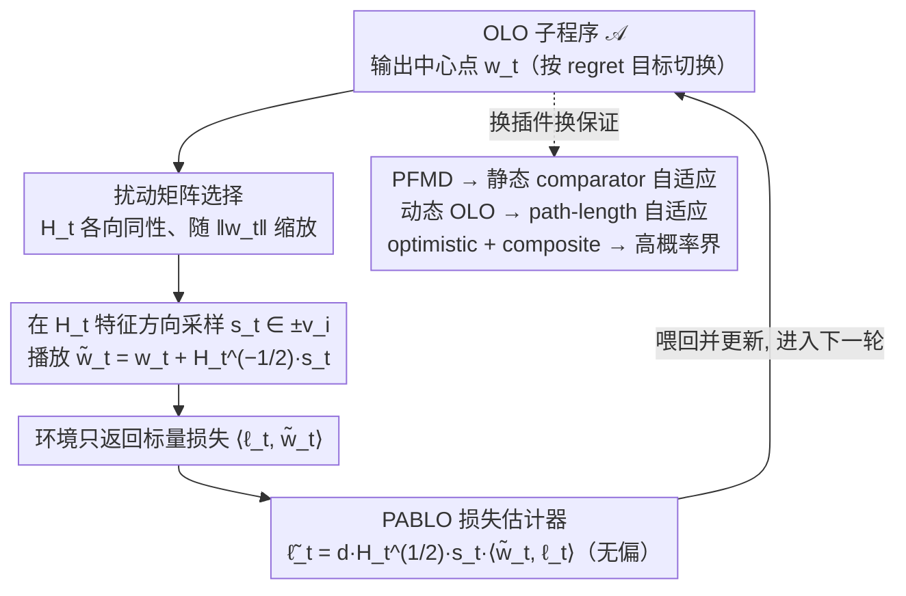

# A Perturbation Approach to Unconstrained Linear Bandits

**会议**: ICML2026  
**arXiv**: [2603.28201](https://arxiv.org/abs/2603.28201)  
**代码**: 无公开代码（理论论文，缓存未提供代码仓库）  
**领域**: 优化 / 在线学习 / Bandit理论  
**关键词**: 无约束线性bandit、在线线性优化、扰动估计、动态regret、高概率界  

## 一句话总结
本文重新审视 Abernethy 等人的扰动式 bandit linear optimization 思路，提出 PABLO 归约，把无约束线性 bandit 转成可调用任意 OLO 子程序的问题，并由此得到 comparator-adaptive 静态/动态 regret、高概率界以及若干下界讨论。

## 研究背景与动机
**领域现状**：Bandit Linear Optimization 要求学习器每轮选择动作 $w_t$，只观察标量损失 $\langle \ell_t,w_t\rangle$，而不是完整梯度 $\ell_t$。经典工作通常研究有界动作集合，例如欧氏球或多面体；在这些设定中，探索噪声必须保证动作仍在可行域内，regret 也由域直径控制。

**现有痛点**：无约束 BLO（uBLO）把动作集合放大到 $\mathbb{R}^d$，目标变成对任意 comparator $u$ 自适应，同时控制相对零动作的风险 $R_T(0)\le \epsilon$。这个设定更接近 parameter-free online learning，但 bandit feedback 只给一维观测，如何同时得到 comparator norm 自适应、动态 comparator 自适应和高概率界并不清楚。

**核心矛盾**：无约束域看似更难，因为没有固定半径限制动作；但也正因为没有可行域约束，扰动矩阵不必再由 barrier geometry 决定，可以自由选择。论文的关键洞察是，在 uBLO 中只要构造出无偏且范数可控的损失估计，就可以把问题交给成熟的 Online Linear Optimization 子程序。

**本文目标**：作者希望建立一个模块化 reduction：bandit 部分只负责随机扰动和构造损失估计，full-information OLO 部分负责 comparator-adaptive 或 dynamic regret。基于这个框架，论文给出 expected regret、高概率 static/dynamic regret，并讨论静态下界的维度依赖。

**切入角度**：论文从 SCRiBLe/Abernethy 扰动方法出发，但不把 OLO 更新和 self-concordant barrier 绑死，而是把二者解耦。PABLO 每轮先让任意 OLO 算法输出 $w_t$，再围绕 $w_t$ 采样一个矩阵控制的随机扰动点，利用单点 bandit feedback 反推出无偏估计 $\tilde{\ell}_t$。

**核心 idea**：在无约束线性 bandit 中，用可调矩阵扰动构造“足够好”的损失估计，把 BLO 降维成 OLO 子程序调用，从而继承 parameter-free 与 dynamic OLO 的强 regret 保证。

## 方法详解
本文的主线是 PABLO（Perturbation Approach for Bandit Linear Optimization）。它每轮把 OLO learner 的输出 $w_t$ 作为中心，选择正定矩阵 $H_t$，在 $H_t$ 的特征向量方向上随机取 $s_t\in\{\pm v_i\}$，实际播放 $\tilde{w}_t=w_t+H_t^{-1/2}s_t$。环境只返回标量损失 $\langle \ell_t,\tilde{w}_t\rangle$，算法据此构造 $\tilde{\ell}_t=dH_t^{1/2}s_t\langle \tilde{w}_t,\ell_t\rangle$，再把它交回 OLO learner 更新。

### 整体框架
输入是任意 OLO 算法 $\mathcal{A}$、时间长度 $T$ 和 bandit loss 序列。输出是一串无约束动作及 regret 保证。PABLO 本身不限定 OLO 子程序：若选择 parameter-free mirror descent，就得到静态 comparator-adaptive expected regret；若选择动态 comparator-adaptive OLO 算法，就得到 path-length 自适应动态 regret；若选择带 optimistic composite penalty 的 OLO 变体，则能处理高概率界中无约束动作范数带来的额外项。

关键技术在于 $H_t$ 的设置。论文采用满足 $H_t\preceq \frac{1}{d(\|w_t\|^2\vee \varepsilon^2)}I_d$ 的各向同性选择，这样扰动在 $w_t$ 大时变小，在 $w_t$ 接近零时由 $\varepsilon$ 防止除零。由此得到两类估计性质：$\tilde{\ell}_t$ 是无偏的，并且其二阶矩和几乎处处范数都有可控上界。这些性质决定了后续能接哪些 OLO 保证。整体看，PABLO 是一个每轮循环的归约：OLO 子程序给中心点、bandit 侧造无偏估计再喂回，二者解耦后只换子程序就能换 regret 保证。

### 关键设计

**1. PABLO 损失估计器：把一维 bandit 反馈反推成可喂给 OLO 的向量损失**

full-information OLO 算法库要的是完整的梯度/线性损失向量，而 bandit 只给一个标量 $\langle\ell_t,\tilde w_t\rangle$，二者之间的鸿沟正是 bandit-to-OLO 归约的全部难点。PABLO 的做法是围绕 OLO learner 输出的中心点 $w_t$ 做一次随机扰动：在正定矩阵 $H_t$ 的特征方向上均匀采样 $s_t\in\{\pm v_i\}$，实际播放 $\tilde w_t=w_t+H_t^{-1/2}s_t$，再用

$$\tilde\ell_t = d\,H_t^{1/2}s_t\,\langle\tilde w_t,\ell_t\rangle$$

去估计真实的 $\ell_t$。关键在于 $s_t$ 在正负特征方向上对称采样，使估计里的交叉项在条件期望下两两抵消，从而得到无偏性 $\mathbb{E}[\tilde\ell_t\mid\mathcal{F}_{t-1}]=\ell_t$。有了这个无偏代理，bandit 问题就被翻译成了一个 full-information OLO 问题，现成的 comparator-adaptive 算法可以原封不动地接上来。

**2. 无约束域下的扰动矩阵选择：让探索尺度随中心点自适应**

经典 BLO 在有界域里探索，扰动必须保证 $\tilde w_t$ 不越出可行集，所以扰动几何被 barrier 锁死；无约束域把动作集放大到 $\mathbb{R}^d$ 后这条约束消失了，反而带来自由度——$H_t$ 不必再服从 barrier geometry，可以纯粹以"估计稳定"为目标来选。但代价是动作范数无界，若扰动尺度不变，$w_t$ 一大估计就会爆炸。本文让 $H_t$ 随中心点范数缩放，要求

$$H_t \preceq \frac{1}{d\,(\|w_t\|^2\vee\varepsilon^2)}I_d$$

即 $w_t$ 大时扰动收紧、$w_t$ 接近零时由 $\varepsilon$ 兜底防止除零。这一选择直接换来两条 OLO 子程序最需要的性质：几乎处处的范数上界 $\|\tilde\ell_t\|^2\le 4d^2\|\ell_t\|^2$，以及条件二阶矩上界 $\mathbb{E}[\|\tilde\ell_t\|^2\mid\mathcal{F}_{t-1}]\le 2d\|\ell_t\|^2$。正是这两条决定了后面能安全接哪些 OLO 保证。

**3. 按 regret 目标切换 OLO 子程序：同一归约产出多种 uBLO 保证**

以往 uBLO 算法常把 bandit 几何、方向学习和尺度学习耦合成一个整体，换一种 regret 目标就要重写整套分析。PABLO 把 bandit feedback 的处理彻底独立出来后，归约对 OLO 子程序是黑箱的，于是只要换插件就能换保证：接 parameter-free mirror descent 得到静态 comparator-adaptive 的期望 regret；接无约束动态 OLO 算法得到对真实 path-length $P_T$ 自适应的动态 regret；接带 optimistic update 与 Huber-like composite penalty 的变体，则能抵消无约束 iterate 的 $\sum_t\|w_t\|^2$ 项，拿到高概率界。这个 generic reduction 把任意 OLO regret bound 翻译成 bandit regret bound，多出来的代价仅来自估计噪声与扰动稳定性，于是 OLO 领域未来的新技术可以近乎免费地迁移到 uBLO。

### 损失函数 / 训练策略
本文是理论算法论文，没有神经网络训练损失。分析对象是线性损失 $f_t(w_t)=\langle \ell_t,w_t\rangle$ 下的 regret。主要策略包括：用 ghost-iterate trick 将 PABLO regret 归约到 OLO 子程序 regret；在 expected regret 中区分 comparator norm 是 oblivious 还是 norm-adaptive；在 dynamic regret 中使用 path-length $P_T=\sum_{t=2}^T\|u_t-u_{t-1}\|$ 及其 log-linear 版本；在 high-probability bound 中通过 composite penalty 和 optimism 抵消无约束 iterate 范数项。

## 实验关键数据

### 主实验
论文无传统 empirical experiments；主“结果表”是理论保证对比。下表把核心定理按设置整理。

| 结果 | 设置 | 主要保证 | 相比已有工作的意义 |
|------|------|----------|--------------------|
| Theorem 3.1 | 静态 comparator-adaptive expected regret | 约为 $\tilde{O}(G\epsilon + \frac{d}{\kappa}\|u\|\sqrt{V_T})$，oblivious 时 $\kappa=\sqrt{d}$，adaptive 时 $\kappa=1$ | 揭示 comparator norm 是否可依赖轨迹会造成 $\sqrt{d}$ 级差异 |
| Theorem 3.3 | 动态 expected regret | 依赖 $\Phi_T+P_T^\Phi$ 和 $\sum_t\|\ell_t\|^2\|u_t\|$，无需预知 $P_T$ | 首个 uBLO 中对真实 path-length $P_T$ 达到 $\sqrt{P_T}$ 型自适应的保证 |
| Theorem 4.3 | 静态 high-probability regret | $\tilde{O}(dG(\epsilon+\|u\|)\log(T/\delta)+G\|u\|\sqrt{dT\log(T/\delta)})$ | 高概率下匹配 constrained Euclidean ball 最佳已知量级（忽略 polylog） |
| Theorem 4.4 | 动态 high-probability regret | 约含 $\sqrt{d(\Phi_T+P_T^\Phi)[d\mathcal{V}_T\wedge\Omega_T]}$ 及低阶项 | 同时保留 worst-case $\sqrt{d(M^2+MP_T)T}$ 和 per-comparator 自适应解释 |
| Theorem 5.2 | 有界欧氏球下界 | 证明 folklore $\Omega(\sqrt{dT})$ 方向 regret 下界 | 为 uBLO scale/direction 分解中的方向难度提供独立证据 |

### 消融实验
理论论文没有模块消融实验。下面用作者的分析对比替代，展示关键假设和设计选择如何改变 regret 形态。

| 对比项 | 选择 A | 选择 B | 影响 |
|--------|--------|--------|------|
| comparator norm 时序 | oblivious / 初始确定 | norm-adaptive / 可依赖轨迹 | expected regret 中可否使用 sharper second-moment bound；两者产生 $\kappa=\sqrt{d}$ vs $\kappa=1$ 的维度差异 |
| bandit-to-OLO 路径 | scale/direction decomposition | PABLO 无偏估计 + OLO 子程序 | 前者在 norm-adaptive setting 可能退化到 $\tilde{O}((dT)^{2/3})$，PABLO 保持 $\sqrt{T}$ 型 horizon 依赖 |
| 动态变化度量 | switch count $S_T$ | path-length $P_T$ | $S_T$ 只看是否变化，$P_T$ 反映变化幅度；本文首次在 uBLO 中无预知 $P_T$ 获得 $\sqrt{P_T}$ 型依赖 |
| 高概率分析 | 直接套 OLO 高概率界 | composite penalty + optimistic hints | 后者抵消无约束 $\|w_t\|$ 项，否则 bound 中会出现不可控 iterate 范数 |
| 下界假设 | 只控期望 comparator norm | 同时考虑 worst-case magnitude | 只控期望会允许极小概率巨大 comparator 的无意义线性下界，说明 norm-adaptive 下界需要更精细假设 |

### 关键发现
- PABLO 的估计器是整个框架的支点：它同时无偏、二阶矩较小、几乎处处范数有界，使现代 comparator-adaptive OLO 算法能在 bandit feedback 下使用。
- 无约束域反而带来自由度。因为不需要保证扰动点留在有界集合内，$H_t$ 可以按 $\|w_t\|$ 选择，从而把估计稳定性作为主要目标。
- comparator norm 的“什么时候选”不是技术细节。若 norm 与损失/算法随机性耦合，很多 prior work 隐含使用的 Jensen 步骤不再成立，导致维度依赖变化。
- 动态 regret 的 path-length 依赖比 switch count 更细。只用 $S_T$ 会把小变化和大跳变都当作一次 switch，而 $P_T$ 能表达真实 comparator 轨迹长度。
- 高概率界的难点不是无偏估计本身，而是无约束 OLO iterate 可能很大。optimistic composite-penalty cancellation 是处理这一点的关键。

## 亮点与洞察
- 论文最漂亮的地方是模块化。PABLO 把“从 bandit 标量反馈造向量估计”和“用 OLO 算法控制 regret”分离，使后续理论可以随着 OLO 子程序进步而升级。
- 对 oblivious 与 norm-adaptive comparator 的区分很有启发。很多 parameter-free 结论看起来是“同时对所有 $u$ 成立”，但当 $u$ 的 norm 可以事后依赖轨迹时，分析中独立性假设会变得非常敏感。
- 动态 regret 部分展示了无约束问题的特殊性。在很多 constrained bandit setting 中，不预知 path-length 很难达到好结果；本文说明 uBLO 也许避开了一些 constrained lower bound 的限制。
- 下界讨论虽然没有完全解决 conjecture，但很诚实地指出 scale lower bound 与 direction lower bound 不能自动合并。这比直接宣称 tightness 更有价值。

## 局限与展望
- 论文主要是理论贡献，没有实验验证 PABLO 在实际 bandit/online decision 应用中的常数、稳定性和可实现性。
- 多个 regret bound 隐藏 polylog 项，且算法子程序较复杂。对于实际使用者，常数和调参成本可能不小。
- 静态 lower bound 仍是 conjecture，尤其是如何在同一 hard sequence 中同时强迫 scale difficulty 和 direction difficulty 尚未解决。
- norm-adaptive setting 的合理下界模型仍不清楚。论文指出只控制 $\mathbb{E}\|u\|$ 太弱，但还没有给出最终替代假设。
- 扩展到 Bandit Convex Optimization 只是未来方向。线性结构对无偏估计和 regret 分解都很关键，非线性情形可能需要新的估计器。

## 相关工作与启发
- **vs SCRiBLe / Abernethy et al.**: 经典 SCRiBLe 把 FTRL regularizer 和局部扰动几何耦合在一起；PABLO 解耦 OLO 子程序和扰动矩阵，更适合无约束域。
- **vs van der Hoeven / Luo / Rumi 的 uBLO 工作**: 既有方法多采用 scale/direction decomposition，本文指出它们常隐含 comparator norm oblivious 假设，并给出在 norm-adaptive 情况下更稳健的 PABLO 路径。
- **vs parameter-free OLO**: 本文可以看成把 parameter-free OLO 的 comparator-adaptive 能力搬到 bandit feedback 下，代价是构造并控制随机损失估计。
- **vs constrained adversarial linear bandits**: 有界域中 minimax regret 依赖决策集几何；本文在无约束域中关注 comparator norm、风险控制和 path-length，自然问题结构不同。

## 评分
- 新颖性: ⭐⭐⭐⭐☆ 用 PABLO 模块化重构 uBLO，并揭示 norm-adaptive comparator 的隐含难点，理论视角新鲜。
- 实验充分度: ⭐⭐⭐☆☆ 理论论文没有实证实验，但定理、对比和下界讨论较完整。
- 写作质量: ⭐⭐⭐⭐☆ 主线清楚，贡献分层明确；证明依赖附录和复杂 OLO 子程序，阅读门槛较高。
- 价值: ⭐⭐⭐⭐☆ 对在线学习和 bandit 理论很有启发，特别是为 uBLO 与 parameter-free OLO 的结合提供了通用接口。

<!-- RELATED:START -->

## 相关论文

- [\[NeurIPS 2025\] Infrequent Exploration in Linear Bandits](../../NeurIPS2025/learning_theory/infrequent_exploration_in_linear_bandits.md)
- [\[ICML 2025\] Heavy-Tailed Linear Bandits: Huber Regression with One-Pass Update](../../ICML2025/learning_theory/heavy-tailed_linear_bandits_huber_regression_with_one-pass_update.md)
- [\[ICLR 2026\] Lipschitz Bandits with Stochastic Delayed Feedback](../../ICLR2026/learning_theory/lipschitz_bandits_with_stochastic_delayed_feedback.md)
- [\[ICML 2026\] Multi-task Linear Regression without Eigenvalue Lower Bounds: Adaptivity, Robustness and Safety](multi-task_linear_regression_without_eigenvalue_lower_bounds_adaptivity_robustne.md)
- [\[ICLR 2026\] An Efficient, Provably Optimal Algorithm for the 0-1 Loss Linear Classification Problem](../../ICLR2026/learning_theory/an_efficient_provably_optimal_algorithm_for_the_0-1_loss_linear_classification_p.md)

<!-- RELATED:END -->
