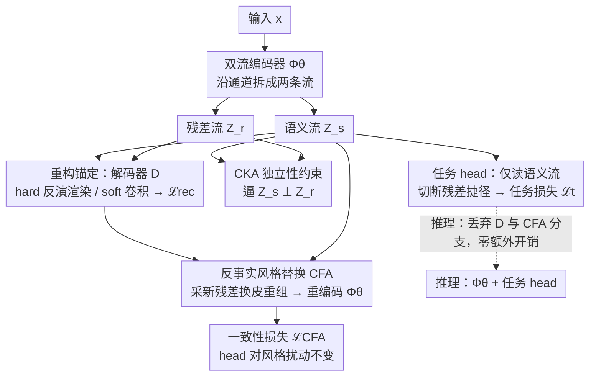

# CORE-MTL: Rethinking Gradient Balancing via Causal Orthogonal Representations

**会议**: ICML 2026  
**arXiv**: [2606.02221](https://arxiv.org/abs/2606.02221)  
**代码**: https://github.com/Hope-Rita/CORE-MTL  
**领域**: 优化 / 多任务学习 / 因果表示学习  
**关键词**: 多任务学习, 梯度冲突, 因果解耦, OOD 泛化, 反事实增强

## 一句话总结
作者把多任务学习里"负迁移"的根因从"梯度冲突"重新归到"共享表征里语义和噪声纠缠"，提出 CORE-MTL：双流编码器把表征拆成语义 $\hat{Z}_s$ 和残差 $\hat{Z}_r$，用 CKA 独立性约束 + 反事实风格替换 + 反演渲染重构来落地"因果正交"，理论上给出比梯度平衡更紧的 OOD 上界，实验上在 NYUv2/Cityscapes 的 ID 与 GTA5→Cityscapes、Cityscapes-C 的 OOD 设定上同时压过 PCGrad/GradNorm/STCH/FairGrad 等十种 baseline。

## 研究背景与动机

**领域现状**：多任务学习（MTL）的主流套路分两派，一派是优化派——在每次更新时调整任务权重或投影梯度方向（GradNorm、PCGrad、MGDA、STCH、FairGrad），另一派是架构派——给每个任务分配 backbone 上的不同切片（MTAN）。共同特点是把共享表征当黑盒，只在梯度或路由层面动手脚。

**现有痛点**：负迁移依然普遍存在，且 OOD（分布漂移、风格扰动、合成→真实）下性能急剧下降。作者指出，更深层的问题是共享表征里把"任务相关的不变语义"和"风格/光照/背景这类干扰因子"混在一起编码，下游 head 在训练分布里靠这些 nuisance 短路抄近道。

**核心矛盾**：梯度冲突往往是负迁移的症状而非病因。当 nuisance 因素已经被编码进共享表征，任你怎么投影或重加权梯度，下游预测都得带着这些虚假相关一起走——也就是说优化派改不动"表征几何"。

**本文目标**：从因果角度证明优化派方法存在一个 OOD 误差下界，并设计一个"表征中心"的框架，把语义流和残差流结构性地分开，让任务 head 只看语义流。

**切入角度**：假设输入由不变语义因子 $Z_s$ 和残差 nuisance 因子 $Z_r$ 经过生成机制 $X=g(Z_s,Z_r)$ 产生，分布漂移只改变 $Z_r$ 的协方差 $\Sigma_r$，$Z_s$ 分布保持不变。在线性-高斯 SCM 下，编码器学到的表征若被一个旋转角 $\psi$ 把 $Z_s,Z_r$ 混在一起，OOD 误差就有 $c\sin^2(\psi)\|\Sigma_r^T-\Sigma_r^S\|_F$ 的下界——纯靠梯度操纵无论如何抹不掉这个 $\sin^2\psi$ 项。

**核心 idea**：与其在梯度空间打补丁，不如直接把表征结构性地拆成语义流 $\hat{Z}_s$ 和残差流 $\hat{Z}_r$，并强制 head 只读语义流；解耦后梯度正交性会作为"几何副产品"自动出现，无需 PCGrad 那种 post-hoc 手术。

## 方法详解

### 整体框架
输入 $x$ 进入共享编码器 $\Phi_\theta$，输出被显式拆成两条 stream：$(\hat{Z}_s,\hat{Z}_r)=\Phi_\theta(x)$。$K$ 个任务 head $f_{\phi_t}$ 只读语义流 $\hat{Z}_s$，残差流 $\hat{Z}_r$ 不进 head。训练时三套约束依次作用在这对表征上：先用 CKA 独立性损失逼 $\hat{Z}_s\perp\hat{Z}_r$；再用重构锚定把整对 $(\hat{Z}_s,\hat{Z}_r)$ 喂给解码器 $\mathcal{D}$ 还原 $x$，给两条流"分工"提供物理/结构锚点；最后用反事实增强（CFA）复用这个解码器，从经验残差分布里采 $\tilde{Z}_r$ 与原 $\hat{Z}_s$ 拼成"换皮"输入 $\tilde{x}=\mathcal{D}(\hat{Z}_s,\tilde{Z}_r)$，重编码后逼 head 对风格扰动不变。推理阶段只用编码器+任务 head，解码器和反事实分支都丢掉，所以零额外开销。

### 关键设计

**1. 双流编码 + 仅语义流接 head：从架构上切断"任务预测利用残差信号"这条捷径**

优化派 MTL 改不动表征几何，所以本文直接动表征：把共享编码器输出沿通道维一分为二，$(\hat{Z}_s,\hat{Z}_r)=\Phi_\theta(x)$，语义流 $\hat{Z}_s$ 走任务 head，残差流 $\hat{Z}_r$ 只走解码器和反事实分支。这相当于在网络拓扑里就把"任务损失对残差敏感"的短路掐断。为了量化这条捷径堵得多严，作者定义 leakage 系数 $\lambda_{\text{leak}}=\sup\|g_s(z_s,z_r)-g_s(z_s,z_r')\|/\|z_r-z_r'\|$ 衡量语义流对残差的偏导，并证出 OOD 界

$$\mathcal{E}_T(h)-\mathcal{E}_S(h)\leq C_{\text{cap}}+\alpha\,\lambda_{\text{leak}}\,W_1(P_S(Z_r),P_T(Z_r)).$$

只要 $\lambda_{\text{leak}}\to 0$，OOD gap 就和残差漂移幅度脱钩——这正好替代了 GradNorm/PCGrad 那个不可消除的 $\sin^2(\psi)$ 下界，把鲁棒性从"优化动力学"层面提到"表征几何"层面。

**2. CKA 独立性约束：把"梯度正交"从 PCGrad 的投影手术改写成可微的表征正则**

架构切分只保证"信息可分"，不保证"信息真分开"，所以补一个统计层面的约束：用 mini-batch 上的线性 CKA 作正则 $\mathcal{L}_{\text{CKA}}=\text{CKA}(\mathbf{Z}_s,\mathbf{Z}_r)$，最小化两组特征矩阵的线性依赖。在线性-高斯假设下，作者证明降低 CKA 等价于压低编码器 Jacobian 的 cross-term，因此 CKA 是 $\lambda_{\text{leak}}$ 的可微代理。一个漂亮的副产品是 Proposition 2.5：$\mathbb{E}[\cos^2(g_{\text{task}},g_{\text{res}})]\leq c\cdot\text{CKA}(Z_s,Z_r)+\delta$，也就是说任务梯度和残差梯度在最后共享层近乎正交，梯度冲突在源头被消解——以往要靠 PCGrad 投影硬拗的"梯度正交"，这里成了表征解耦的几何副产品，不需要任何 post-hoc 手术。

**3. 重构锚定（grounding）：给两条流分配明确的语义角色**

CKA 只逼两条流互不相关，却不规定"哪条流该装什么"——纯统计独立可以被退化解满足（比如随机切分通道也"独立"）。重构锚定就是给这个角色分工提供物理/结构锚点：把整对 $(\hat{Z}_s,\hat{Z}_r)$ 喂给解码器 $\mathcal{D}$ 还原输入 $x$，逼两条流各自保留还原图像所需的信息。它有两种实例化：**Hard Grounding** 把解码器实现为基于物理的反演渲染 $\hat{x}\approx\mathcal{A}(\hat{Z}_r)\odot\mathcal{S}(\mathcal{N}(\hat{Z}_s),\mathbf{L}(\hat{Z}_r))$，让 $\hat{Z}_s$ 负责几何（法向量）、$\hat{Z}_r$ 负责光度（反照率 + 光照），重构损失 $\mathcal{L}_{\text{rec}}=\|x-\hat{x}\|_1+\lambda_{\text{lpips}}\text{LPIPS}(x,\hat{x})$；**Soft Grounding** 在没有物理先验时退化为通用卷积解码器 + $L_1$ 重构，靠"head 只读 $\hat{Z}_s$"加 CKA 把判别信息和重构残差功能性地推到对的 stream 上。Hard grounding 给出更强的语义锚定，soft grounding 则靠架构瓶颈 + 统计压力达到类似的功能解耦。

**4. 反事实风格替换（CFA）：直接训练 head 对风格扰动不变**

切流 + 独立 + 重构只保证"信息分得开、各有角色"，还没直接教 head"别理风格"。反事实增强（CFA）复用上面的解码器做一次反事实干预：从当前 batch 的经验残差分布里采一个新的 nuisance 向量 $\tilde{Z}_r$，与原始语义 $\hat{Z}_s$ 拼接、过解码器合成"同语义、异风格"的图像 $\tilde{x}=\mathcal{D}(\hat{Z}_s,\tilde{Z}_r)$，再喂回编码器，要求 head 给出与原图一致的标签：$\mathcal{L}_{\text{CFA}}=\sum_t w_t\mathcal{L}_t(f_{\phi_t}([\Phi_\theta(\tilde{x})]_s),y_t)$（过反事实分支时冻 BN 统计量防风格泄漏）。这等于直接惩罚 head 在标签与 nuisance 之间建立的虚假相关。CFA 直接从 batch 内采样合成，不依赖外部风格库，工程上几乎白嫖；推理阶段解码器和反事实分支全丢，零额外开销。

### 损失函数 / 训练策略
总目标 $\mathcal{L}_{\text{total}}=\sum_t w_t\mathcal{L}_t+\lambda_{\text{CKA}}\mathcal{L}_{\text{CKA}}+\lambda_{\text{CFA}}\mathcal{L}_{\text{CFA}}+\lambda_{\text{rec}}\mathcal{L}_{\text{rec}}$，任务权重可固定（实验中等权）也可叠 GradNorm，$\mathcal{L}_{\text{rec}}$ 按是否有物理先验在 hard 和 soft 之间切换。Backbone 一律 ResNet-50，反事实通路上冻 BN 统计以严格评估鲁棒性。

## 实验关键数据

### 主实验
NYUv2（3 任务）+ Cityscapes（2 任务）的 In-Distribution 结果（精选关键指标）：

| 方法 | NYUv2 mIoU↑ | NYUv2 Depth Abs↓ | NYUv2 Normal Mean↓ | Cityscapes mIoU↑ | Cityscapes Depth Rel↓ |
|------|------------|------------------|--------------------|------------------|----------------------|
| Single Task | 0.5192 | 0.5260 | 24.27 | 0.6869 | 47.96 |
| Equal Weighting | 0.5316 | 0.3911 | 24.29 | 0.6962 | 44.03 |
| PCGrad | 0.5222 | 0.3916 | 24.39 | 0.6998 | 44.56 |
| GradNorm | 0.5264 | 0.3896 | 24.39 | 0.7015 | 44.55 |
| STCH | 0.5377 | 0.3917 | 23.20 | 0.6952 | 42.84 |
| MTAN | 0.5401 | 0.3822 | 24.02 | 0.7023 | 45.57 |
| FairGrad | 0.5291 | 0.3944 | 23.07 | 0.6986 | 43.74 |
| RepMTL | 0.5492 | 0.3727 | 24.53 | 0.7079 | 44.32 |
| **CORE-MTL** | **0.5693** | **0.3544** | **22.49** | **0.7229** | **19.61** |

OOD 部分 GTA5→Cityscapes（Sim-to-Real）与 Cityscapes-C 摘要：CORE-MTL 在目标域 mIoU 0.5435（PCGrad 0.5047）、Pixel Acc 0.8401（PCGrad 0.7943）、Depth Rel 235.04（PCGrad 301.61）；Cityscapes-C 上 mIoU 0.6104 / Pixel Acc 0.8670 / Depth Rel 38.10 均显著优于所有 baseline，验证 Theorem 2.4 中"压低 leakage 就压低 OOD gap"的预测。

### 消融实验
NYUv2 上四个组件逐个加：

| 配置 | Seg mIoU↑ | Depth Abs↓ | Normal Mean↓ | 说明 |
|------|----------|-----------|--------------|------|
| Vanilla MTL | 0.5249 | 0.4418 | 25.62 | 无双流，普通共享 |
| + DS | 0.5352 | 0.3813 | 23.30 | 双流但无重构/正则，已经显著掉 depth/normal 误差 |
| + DS + Grounding | 0.5424 | 0.3827 | 23.22 | 加重构锚定，分割再涨 |
| + DS + Grounding + CKA | — | — | — | 独立性约束补齐角色分工 |
| Full (+ CFA) | 0.5693 | 0.3544 | 22.49 | 反事实贡献最显著的鲁棒性增益 |

CelebA 多任务可扩展性（任务数 K=10→40）：CORE-MTL 训练耗时近似常数（~300 s/epoch），而 PCGrad 从 690 s 线性涨到 2806 s；平均属性准确率始终最高。

### 关键发现
- **梯度正交是结构副产品**：Fig. 4/5 显示训练完成后任务梯度与重构梯度的 cos 相似度近 0，且任务-任务梯度矩阵呈结构化 block pattern，不需要 PCGrad 的投影手术。
- **稳定性比 1 高出一个量级**：表 3 的特征替换实验，cross-domain 设定下 $\Delta Z_r/\Delta Z_s=3.28$，说明语义流确实"扛住"了风格扰动而残差流照单全收。
- **PCGrad/FairGrad 在 OOD 反而退步**：表 2 中多个梯度手术方法的 Δ（source-target gap）比 EW 还大，从经验上印证 Theorem 2.3 的下界——梯度操纵在 entangled 表征上无法解决 OOD 问题。
- **Colored-Cityscapes 短路测试**：作者额外构造了类别颜色被打乱的对照集，CORE-MTL 仍稳居第一，说明它真的在打压"残差当作短路"而不是依赖完美的语义-残差独立假设。

## 亮点与洞察
- **把"梯度冲突"重新归因到"表征几何"**：用一个干净的线性-高斯 SCM 给出 $\sin^2(\psi)$ 不可消除下界，从理论上判了优化派 MTL 在 OOD 下的"死刑"，再用解耦表征给出更紧的可达上界——这种"两边夹住"的论证方式比单纯 propose 一个新模块强很多。
- **CKA 作为 leakage 系数的可微代理**：把几何量（$\lambda_{\text{leak}}$）和统计量（CKA）通过线性-高斯假设搭桥，让一个"表征独立"的口号变成可以反传的损失项，trick 可迁移到 disentangle、domain generalization、causal representation 几乎所有场景。
- **反事实风格替换不需要外部数据集**：CFA 直接从 batch 内的经验残差分布采样合成 $\tilde{x}$，避免了 mixup/stylization 那种依赖第二数据集或外部风格库的尴尬，工程上几乎"白嫖"。
- **Hard / Soft Grounding 双轨**：物理先验强的场景（几何理解）用反演渲染锚定，弱先验场景（属性识别）退化为通用解码器，给出了同一框架在不同领域落地的标准答案——这种"模板化"思路也是 representation-centric 方法接下来要走的路。

## 局限与展望
- **理论建立在线性-高斯 SCM 上**：$Z_s\perp Z_r$ 与编码器是固定旋转的假设很强，实际场景里语义和上下文高度耦合（如行人总在斑马线上）。作者用 Colored-Cityscapes 部分回应了这一点，但缺乏对耦合强度的连续刻画。
- **依赖好的解码器**：Hard grounding 需要写出物理 forward model，跨域（如医学影像、时序信号）该怎么找等价的"物理"先验仍开放；Soft grounding 在没有显式先验时的可识别性靠的是经验直觉，理论保证较弱。
- **训练开销不可忽略**：双流 + 反事实 + 重构使每 epoch 约 300 s（EW 约 90 s），虽然不随 $K$ 线性增长，但绝对值仍约 3× 基线；推理零开销但训练阶段需要更大显存放解码器。
- **任务范围窄**：实验集中在密集视觉任务和属性分类，对 NLP MTL（GLUE/multi-task fine-tuning）、强化学习多目标这类场景未验证；如何在没有 pixel-level 重构信号的模态上做 grounding 是个真问题。

## 相关工作与启发
- **vs PCGrad / GradNorm / FairGrad**：它们都在梯度空间动手，把任务梯度投影到非冲突方向或重加权；CORE-MTL 直接论证这一派存在不可消除的 OOD 下界，再把"梯度正交"作为表征解耦的副产品免费拿到，反而更彻底。
- **vs MTAN（架构派）**：MTAN 给每个任务装 attention 通路从 backbone 抽自己的切片；CORE-MTL 不再按任务切，而是按"语义 vs 残差"切，更接近 causal disentanglement 范式，跨任务共享更优。
- **vs RepMTL（同样 representation-centric）**：RepMTL 关注共享表征的统计对齐但不显式建因果结构；CORE-MTL 引入了 SCM 解读、反事实增强和物理 grounding，理论与机制都更完整，实验上也压过 RepMTL。
- **vs IRM / DANN（OOD 表征学习）**：IRM 在多环境上推不变表征，DANN 用对抗对齐；CORE-MTL 把这套"不变性"思路嫁接到 MTL 内部 head→stream 的关系上，并且不依赖多环境标注，单一训练域就能跑。
- **启发**：这套"切流 + CKA 独立 + 反事实重组"模板可以直接搬到 RLHF 的 reward modeling（把"safety-relevant"和"style"切开）、视频生成（把"内容"和"风格"切开）、医学图像（把"病灶"和"成像设备风格"切开）等场景；只要任务里存在明确的 nuisance 维度，都能套用。

## 评分
- 新颖性: ⭐⭐⭐⭐ 把 MTL 负迁移问题从优化层提到表征层，理论+方法双线展开；架构本身（双流+CKA+CFA）零件不算稀奇但组合自洽。
- 实验充分度: ⭐⭐⭐⭐⭐ 涵盖 ID（NYUv2/Cityscapes/CelebA）、OOD（GTA5→Cityscapes、Cityscapes-C、Colored-Cityscapes）、可扩展性（K=10→40）、四组件消融、梯度正交可视化，对比十种 baseline。
- 写作质量: ⭐⭐⭐⭐ Theorem 2.3 与 2.4 形成"两边夹住"的论证骨架，公式推理清晰；唯一遗憾是物理 grounding 的实现细节被推到附录，正文略简略。
- 价值: ⭐⭐⭐⭐ 给 MTL 社区提供了一个新的看问题角度，下界结论对未来梯度派方法的"天花板"有警示意义，反事实风格替换这个 trick 单独拎出来也能用到 OOD 泛化研究里。

<!-- RELATED:START -->

## 相关论文

- [\[ICLR 2026\] Function Spaces Without Kernels: Learning Compact Hilbert Space Representations](../../ICLR2026/learning_theory/function_spaces_without_kernels_learning_compact_hilbert_space_representations.md)
- [\[ICML 2026\] MMD-Balls as Credal Sets: A PAC-Bayesian Framework for Epistemic Uncertainty in Test-Time Adaptation](mmd-balls_as_credal_sets_a_pac-bayesian_framework_for_epistemic_uncertainty_in_t.md)
- [\[ICML 2026\] Semi-Supervised Noise Adaptation: Transferring Knowledge from Noise Domain](semi-supervised_noise_adaptation_transferring_knowledge_from_noise_domain.md)
- [\[ICML 2026\] Towards Optimal Robustness in Learning-Augmented Paging](towards_optimal_robustness_in_learning-augmented_paging.md)
- [\[ICML 2026\] On the Learnability of Test-Time Adaptation: A Recovery Complexity Perspective](on_the_learnability_of_test-time_adaptation_a_recovery_complexity_perspective.md)

<!-- RELATED:END -->
